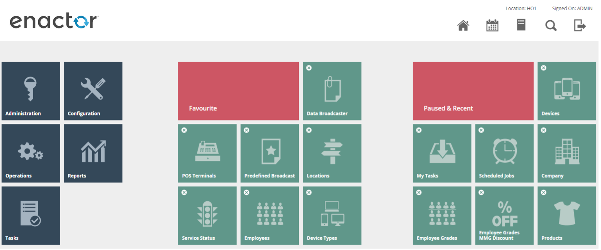
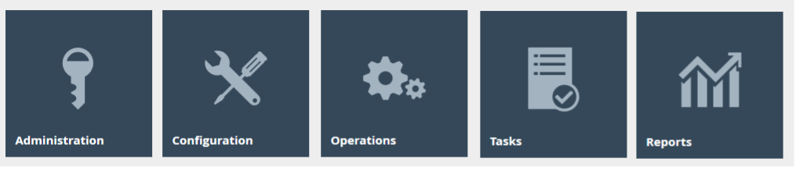
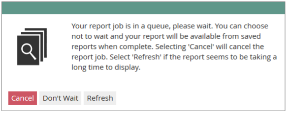
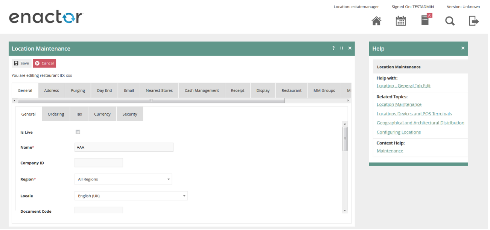

# Estate Manager Navigation

##Introduction
This How-to guide covers the basic use and navigation of the Estate Manager application.  The Enactor Estate Manager Application is a web-based application, which serves as a central repository for data for all of the Enactor Retail Applications and provides Web Services to those applications. The Web Maintenance Application of the Estate Manager is a browser-based User Interface, which provides Menu Options to: 

* Maintain and Distribute Configuration 
* Preform Administrative Tasks 
* Perform Operational Tasks 
* Monitor the Estate. 

The intent of the guide is to provide basic guidance on use of Estate Manager.  Please refer to the additional how-to guides and the full solution documentation for more detailed information on various topics.

## Navigation
The Enactor Estate Manager Web Maintenance Application provides a User Interface, which is a Web Application accessible using a standard internet Web Browser. Relevant users may be provided a URL whereby the Estate Management Menu may be accessed either on the Web or more typically the Customer’s intranet. The Estate Manager is a central point of control providing access to Data Maintenance, Administrative and Operational functions. 

There are three main means of navigating to the functions that the user requires:

* Menu – all required functions are available by navigating through the menu structures (the blue icons)
* Search – by searching for keywords in the title of the function
* Favourite and Recent Items – these items will be populated as the user makes use of the various Estate Manager functions

 
### Home Page
Once successfully Signed-On the User is presented with a **Main Menu** that looks much like the one illustrated below, although site customisation or User- and Context-specificity may apply. 
 

Menu Options are represented, as illustrated above, by named, iconised Tiles, which are typically configured to appear only if the user has the necessary permission. The dark grey Tiles to the left of the illustration represent the highest-level divisions of functionality. The **Favourite** and **Paused & Recent** menu groups are dynamic elements of the entry-level menu page, which provide quick access to frequently, recently or currently accessed menu options, which are automatically maintained. 

The following insights will be helpful in using this menu system: 

* The **Main Menu** (options in Grey icons) is displayed at the left of all menu pages. 
* The **Main Menu** is displayed in conjunction with two dynamic sub-menus representing 

**Favourites** (automatically defined by usage) and Paused and Recent selected options 

*	Menu Options represented by **Grey** icons always lead to a sub-menu 
* The currently selected sub-menu is indicated in a **Red** icon 
* Menu Options represented by **Green** icons always lead to a data input page 
* The **Search** icon (  ) allows for direct access to Menu Options based on a title search 
* The **Home** icon (  ) returns to the Main Menu 
* The **Exit** icon (  ) exits the application. 

 
### Main Menu

 

#### Administration
Submenus and options of the **Administration Menu** serve to obtain information or initiate actions as typically required in the course of Estate Management. Certain configuration elements, such as Devices, Service Types and Definitions etc. are also maintained via the Administration Menu since these are considered to be Estate Management responsibilities. 

#### Configuration
Submenus and options of the **Configuration Menu** serve to maintain configuration stored centrally within the Estate Manager database but applicable to the estate as a whole. 

#### Operations
Day-to-day operational tasks related to Cash Management, Customer Relationship, Reporting and Inventory functions, which may be undertaken as responsibilities more widely distributed than Estate Management are organised under the submenus and options of the **Operations Menu**. 

#### Tasks
The **Tasks Menu** provides access to the user’s task list and available business processes.  The My Tasks Option presents a Search and Select Page with separate Tabs for ***Pending*** and ***Completed*** Tasks.  Business process can also be initiated via the ***Launch Business Process*** option.

 
#### Reports
Enactor includes an assortment of reports which are accessed through the **Reports Menu**.  The reports are organized into multiple categories.  

Reports are presented in a standard User Interface, which typically includes capture of report parameters. Once initiated the user is presented with the ***Wait For Report*** options. 

This page indicates the progress of the report runner. Several (self-explanatory) messages can appear at this point with options to **Cancel, Don’t Wait** or **Refresh**: 

The Cancel option cancels the report, or if the User chooses not to wait for the report, the Don’t Wait option exits the page leaving the report generation to occur in the background. In this case the user can access the report at some later time using the Saved Reports option 

 
### Enactor Online Help 
Almost all pages of the Estate Manager offer a body of Online Help in a Help Point, which is accessed using the Help Icon (  ) in the top-right-hand region of the page in the Title Banner. 

#### Accessing Help 
Selecting the Help Point opens a new **Help Panel** within the current page as illustrated below, which may be closed using the Close Icon (  ) at the top-right-hand corner of the Help Panel itself. 
 

If left open, the Help Panel persists and is context sensitive, presenting Help Options appropriate to the current Web Maintenance page as the User navigates among the Tabs and Options of the current page. 

#### The Help Panel 
The Help Panel offers links to Help Information in three categories: **Help With, Related Topics** and **Context Help**. These links bring together direct access to various sections of the **Enactor Books** Content relevant to the Help Point of the current page. 

#### Help With 
The **Help With** link provides access to help content that directly relates to the application page containing the help point that was accessed. 

#### Related Topics 
The set of **Related Topics** Help Links provide access to Help Information on topics related to that of the application page containing the help point that was accessed. 

#### Context Help 
The **Context Help** Help Links provide access to help content that contain information about the wider context of the application and the function of the page containing the help point that was accessed. 
 
