# Alerts and Montioring

## Introduction

The purpose of this guide is to provide a foundational understanding of the options and capabilities available when configuring Alerts. 
Alerts allow the system to detect certain events by checking the Application Process Log, Application Log, System Log and JMX Beans. It then sends an alert through Communication Options such as email, SMS, Application Process and Business Process. 
There are a number of aspects in the system to consider in order to get alerts configured and running successfully, and this guide would basically cover all necessary configurations required to successfully send and receive Alerts based on the various triggers of events in the system.

## Overview
This guide will cover the configuration for the following:

* **Create Alert User** – Creation of a user where the email config is defined for sending alerts via email.
* **Configure Location for Email Alerts** – Configuration of the Estate Manager location to send email alerts.
* **Alert Services** – The list of services which are required for alert configuration.
* **Configure Alert Types** – The various alert types which are available for configuration.
* **Monitoring Alerts** – Using Alert Maintenance to monitor the Alerts that have been triggered.
* **Alert Scenarios** – Failed Transaction Processing, Failed XML Import, Failed Scheduled Job, Licence Failed and Database Connection Failed scenarios are discussed.

## Configuration Steps

### Create Alert User
To send alerts as an email, an Alert User has to be defined. This is where the email configuration too is defined for this particular user for sending alerts via email. 
To configure the Alert User follow the steps below:

Navigate to User Maintenance using the Search or the path
 
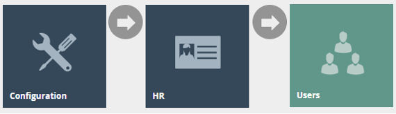

To create a new User, select **Create a New User** on the User Maintenance page.
 
 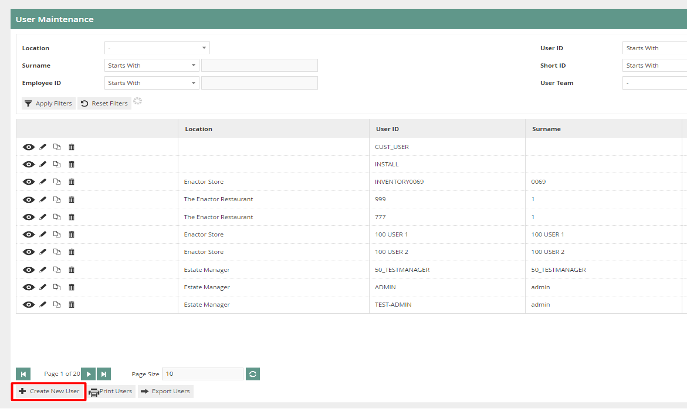

Enter ALERTS as the unique **User ID** for the new User and click Create. 
 
 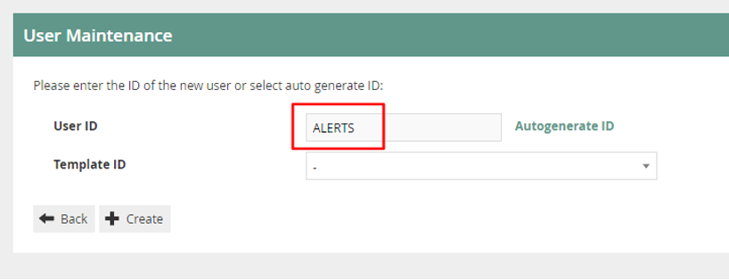

The User Maintenance, for the newly created ALERTS User, is presented as follows and the two tabs to configure are; **General** and **Email**.  

#### User – General Tab
The General tab has all the basic information that captures the identity of the new ALERTS User.

 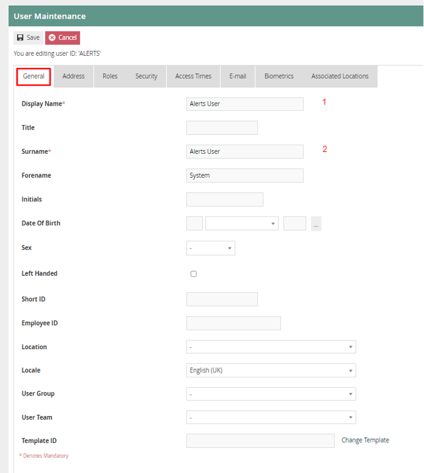

Set the appropriate values on the **General** tab as follows:

| Configuration	| Description |
| --- | -------- |
| Display Name |	This is the name displayed in the screen after signing into the Estate Manager. Enter any identifiable name here. Eg: Alerts User. |
| Surname	| This is the surname given to the User. Enter any appropriate surname here. Eg: Alerts User. |
 
#### User – Email Tab
The Email tab captures the email configuration for the new ALERTS User.
 
 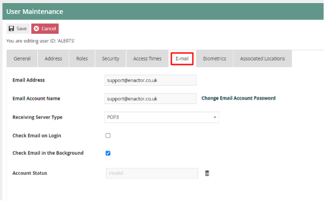

Set the appropriate values on the **Email** tab as follows:

| Configuration | Description |
| --- | -------- |
| Email Address	| Enter the email address which would be used to send the email alerts. |
| Email Account Name |	Enter the same email address, as used in the previous field, once again here as well. |
| Change Email Account Password |	Enter the correct password of the email address that has been entered. |
| Check Email on Login |	If checked, the Email would be checked on Login. |
| Check Email in Background |	If checked, the Email would be checked in the Background. |
| Account Status	| Shows the status of the email account.  If there is an issue with the email configuration, then after several tries, the system will automatically set the user's email account status to "Invalid". Once set to invalid the system will not try to access the user's email account. After resolving the email configuration issues, make sure to check this field and if it is “Invalid” then click on the bin icon and set it to "Valid". |

:::note
Be sure to set the correct email address and a valid password for the email account on the above page.  Without this, the alert system will not be able to send email alerts.
:::

 
### Configure Location for email alerts
The Estate Manager location should be configured to send email alerts. See details below on how to configure the location email config.  

Following is an example of configuring the Email Tab of the Estate Manager location to use IMAP and SMTP:

Navigate to Location Maintenance using the Search or the path 

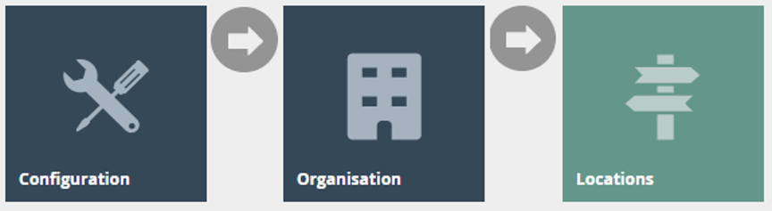
 
In the list of locations, search for Estate Manager and click on the corresponding edit icon in order to configure the Estate Manager Location.

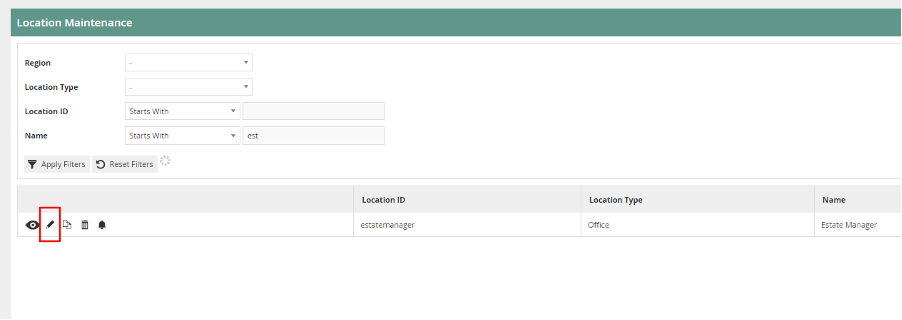 

#### Location – Email Tab
Within the EM location, the email configuration is done via the "Email" Tab. Below is a screenshot of the Location Maintenance of the Estate Manager location. 
The System User should point to the "ALERTS" user created in the previous section.

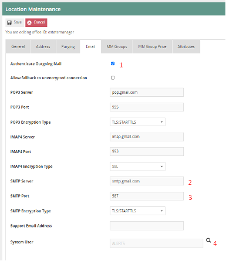
                                                                                                                         
Set the appropriate values as follows:

| Configuration |	Description |
| --- | -------- |
| Authenticate Outgoing Mail |	Checkbox, if checked indicates that all outgoing mail will be authenticated. This is done using the User's email account and password. If this option is not selected and the SMTP server requires authentication the outgoing email will not be sent. |
| SMTP Server	 | An SMTP server is a mail server that only supports the sending of emails. Using one, you can send email from anywhere. Alphanumeric; maximum 100 characters and it must contain a full stop. |
| SMTP Port |	Alphanumeric; maximum 50 characters. |
| SMTP Encryption Type |	Select the appropriate SMTP Encryption Type from the dropdown which contains the following options: <ul><li>None</li><li>SSL</li><li>TLS/STARTTLS</li></ul> |
| System User	 | This is the System User associated with this location who sends the email alerts. The search button will take the User to the User Maintenance select page to enable selection of the required user. Make sure to always have the System User selected as the “ALERTS” user that was created. |

### Alert Services
In order for the Alerts to work, there are a number of services that are required. This section covers the list of services and their functionalities.

| Service Description | Device Type |	Functionality |
| ------ | ------ | ------ |
| Alert Dispatcher |	Estate Manager, Back Office | Dispatches alerts via Email |
| Alert Monitor	| Estate Manager, Back Office | Monitors Estate Manager logs for alert's messages |
| Email Internal Router |	Estate Manager, Back Office, Inventory Manager | Routes the email internally via the application |
| Email Sender |	Estate Manager, Back Office, Inventory Manager | Email sending service |

After you have restarted the EM, navigate to Service Status using the Search or the path

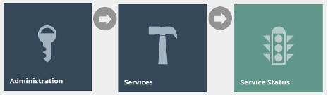
 
Here you can check that all the required services are running.

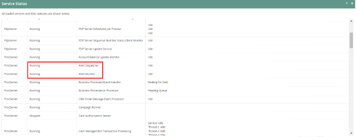
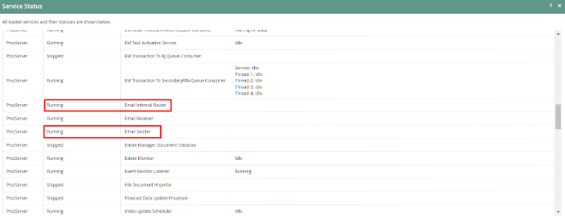 
 

### Configure Alert Types
Alert types are used to defined what alerts to raise when certain events are detected in the logs, where to monitor from (Application Process log, Application Log, System Event Log) and the communication type (i.e., Email) used to send the Alerts. Basically, all that we have done so far is setting up an email and the services which are needed to send the alert. 
This section is where we configure at which events (triggers) do we want to send the alerts and where to send the alert if that event is triggered. 
Note: If alerts are to be defined on the Store Server, then the alert types should be broadcast down to the Store Server.

Alert Types can be categorised based on the Trigger as: 

* Application Process Log
* Application Log
* System Event Log
* JMX Bean

:::note
Configuration of JMX Bean Alerts is documented in the “How-To Guide Configuring MBean Alerts” document.
:::

Communication Options for sending alerts comprises of:

* Email
* SMS
* Application Process
* Business Process

 
The examples provided below are pre-loaded into the environment:

| Alert Type ID |	Description	| Trigger | Log Entry Type / Log Level | Entry Type ID |
| ------ | ------ | ------ | ------ | ------ |
| FAILED_XML_IMPORT	| When File Import is used in the Estate Manager to import configs and any such import fails, because it could not parse or process successfully, a Failed to import XML file alert is sent to the user. | Application Process Log	 | Error	| xmlFileImporter |
| FAILED_TRANS_PROCESS | When a Transaction fails to process, a Transaction Processing Failed alert is sent to the user. | Application Process Log | Error | document |
| FAILED_SCHEDULED_JOB	| When broadcasts fail to submit due to an error, a Scheduled Job Failed alert is sent to the user. |	Application Process Log	 | Error | scheduledJob |
| LICENCE_FAILED |	When the Licence used is either expired or invalid, a Licence Validation Failed alert is sent to the user. |	Application Log |	Error	|
| DATABASE_CON_FAILED | When there is a problem with connecting to the Database, then a Database Connection Failed alert is sent to the user.	| Application Log | Error |	

To further explain the above table, lets take the alert type DATABASE_CON_FAILED. The trigger for this alert type is Application Log and the Message Text “com.enactor.core.database.DatabaseException: Failed to get connection”. So if that exact Message Text does exist in the Application Log, then an Email is sent as an alert to the recipient as configured.

For each of these Alert Types, we have to configure how and to whom we want to send the alerts. Following is how you can configure to send each Alert as an email as required:

Navigate to Alert Type Maintenance using the Search or the path

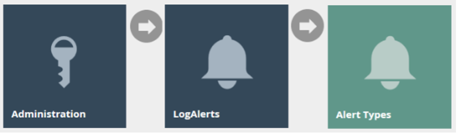
 
Click on the edit icon of the Alert Type that you want to configure, and this will take you to the Alert Type Maintenance of that particular Alert Type. It is the Communication Options Tab that we have to configure in order to set the email we wish to send the alert to.

#### Alert Type – Communication Options Tab
This is where you specify all configurations regarding which method you want to send the Alert and to whom you want to send once this Alert Type has been triggered.
Email, SMS, Application Process and Business Process are the Communication Option Types that are available for selection. Many Communication Options can be added for one Alert Type by having different devices configured as shown below.

 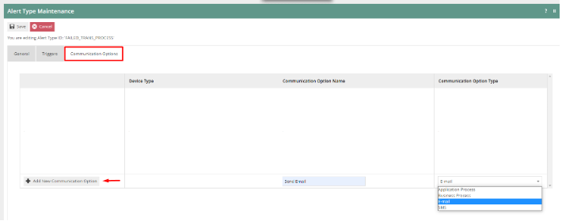

In order to create a new Communication Option Type, pick from the dropdown and enter an appropriate Communication Option Name and then click on Add New Communication Option.
 
 

Following is an example of an **Email** Communication Option Type and its configurations:

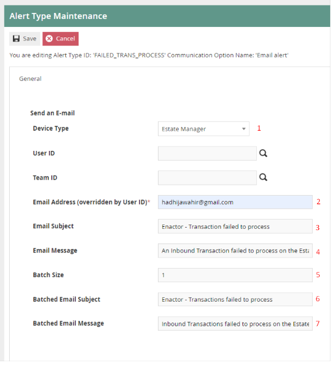
 
Set the appropriate values as follows:

| Configuration	| Description |
| ------ | ------ |
| Device Type	| Dropdown list selection of defined device types. |
| Email Address (overridden by User ID)	| Enter the email address which you want to send the Alert to. |
| Email Subject	| Subject of the message to be sent when the alert is triggered. |
| Email Message	| Message to be sent when the alert is triggered. |
| Batch Size	| Numeric value; When the Alert Type has been triggered the same number of times as the batch size value that is set here (not on every trigger), a batch email will be sent. The value set here defines after how many triggers should this batch email be sent. |
| Batch Email Subject |	Subject of the message for the batch email. |
| Batch Email Message	| Message to be included when the batch email is sent. |

Click **Save** after configuring the appropriate values.

Finally, after configuring the Communication Options Tab, click on **Save** to finish creating your new Alert type.

### Monitoring Alerts
Alerts that have been triggered in the system can be viewed in the Alert Maintenance.
In order to view this, navigate to Alert Maintenance using the Search or the path
 
 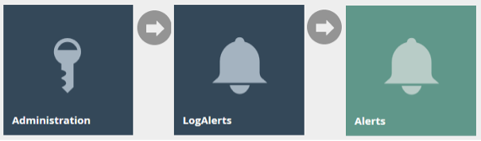

The Alert Maintenance page, as illustrated below, lists the Alerts corresponding to the Events that have logged to the nominated triggers based on the criteria and configuration defined in Alert Types.
 
 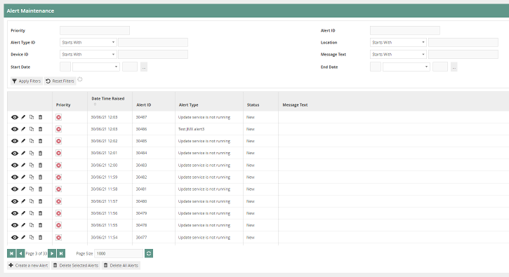

### Alert Scenarios
There are a number of situations, detailed below, where when a failure occurs, the estate manager will send an email alert to the user. Within each category there are individual messages and batched messages which also have text specifying the type of error.

#### Failed Transaction Processing
This is where an Inbound Transaction has failed to process on the Estate Manager. One of the following transaction types not processing through inbound documents could cause this error:

* Normal Retail Sale Transaction
* Employee Retail Sale Transaction
* Airport Sale Transaction
* Tax Refund Request Transaction
* System Event

Whenever such a Failed Transaction Processing error occurs, an alert will be sent as an email to the user as configured. The Email alert received is as follows:
 
 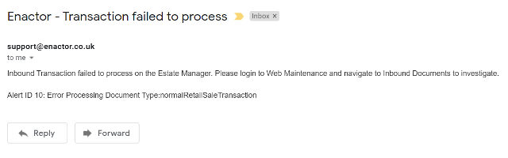

In order to view the Alert created for this, first make a note of the Alert ID that was sent in the email. Then navigate to Alert Maintenance and enter the Alert ID from the email in the Filter Option and click Apply Filters as follows:
 
 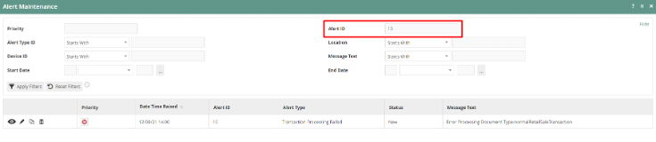

To further view this Failed Scheduled Job error, make a note of the Date Time that this Alert was raised and navigate to Inbound Document Viewer using the Search or the path
 
 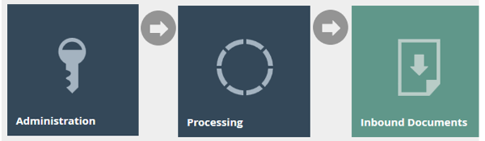

Make the following changes in the Filter Options:
Queue Name > Estate Manager Transaction Processing
Status > Failed

Click on the ! icon of the row that matches close to the time that your alert was created as follows:

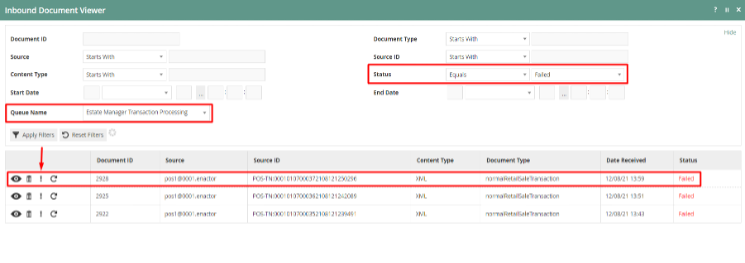
 
The Application Process Log of this particular failed transaction processing job would be opened as follows:
 
 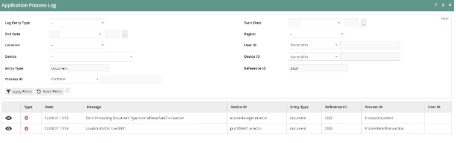
 
Here we can notice the message “Location Not In Use:0001”, which is the reason why this transaction processing failure has occurred in this example.
 
#### Failed XML Import
This is where when an XML file or files are imported directly into the Imports folder of the Estate Manager and the import fails because it could not parse or process successfully.

Whenever such a Failed XML Import error occurs, an alert will be sent as an email to the user as configured. The Email alert received is as follows:
 
 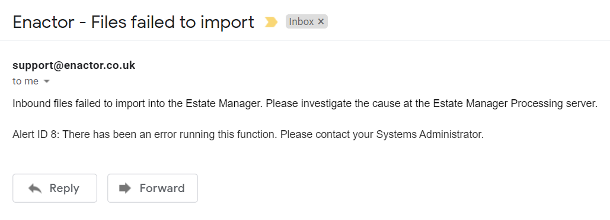

In order to view the Alert created for this, first make a note of the Alert ID that was sent in the email. Then navigate to Alert Maintenance and enter the Alert ID from the email in the Filter Option and click Apply Filters as follows:
 
 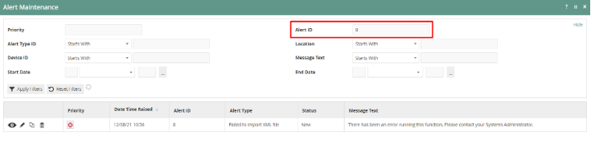

To further view this Failed XML Import error, make a note of the Date Time that this Alert was raised and navigate to the Application Process Log and click on the eye icon of the row that matches close to the time that your alert was created:
 
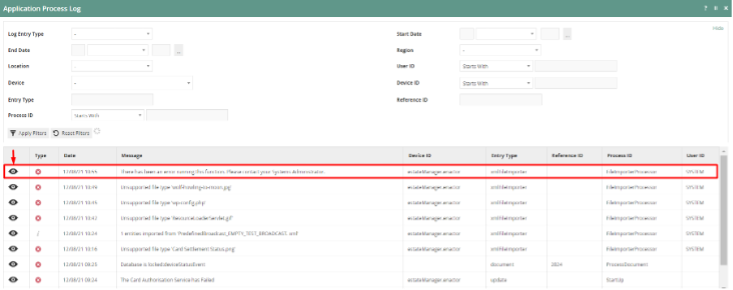

Navigate to the Exception Summary or Exception Details tab for information about the error that can assist further investigation as follows:
 
 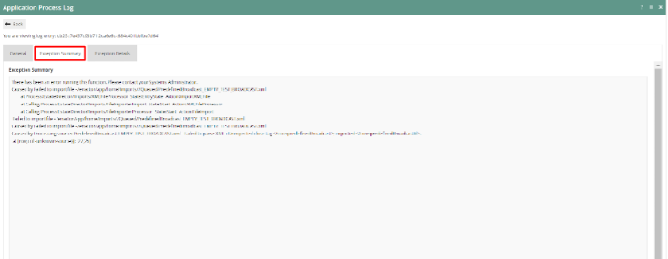
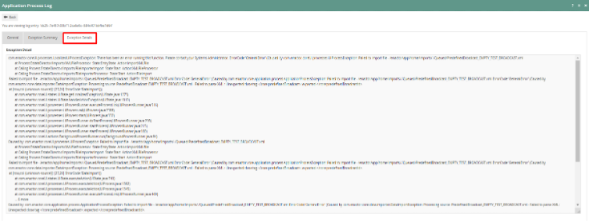

#### Failed Scheduled Job
This is where when there is a Scheduled Job that has failed, such as a failed import using the File Import Maintenance in the Estate Manager, an email alert is sent to the User.

Whenever such a Failed Scheduled Job error occurs, an alert will be sent as an email to the user as configured. The Email alert received is as follows:
 
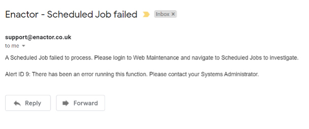
 
In order to view the Alert created for this, first make a note of the Alert ID that was sent in the email. Then navigate to Alert Maintenance and enter the Alert ID from the email in the Filter Option and click Apply Filters as follows:
 
 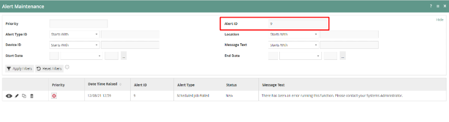
 
To further view this Failed Scheduled Job error, make a note of the Date Time that this Alert was raised and navigate to Scheduled Job Maintenance using the Search or the path
 
 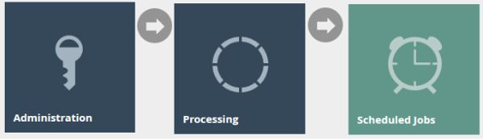

Change the filter value of Status Failed and click on the ! icon of the row that matches close to the time that your alert was created as follows:
 
 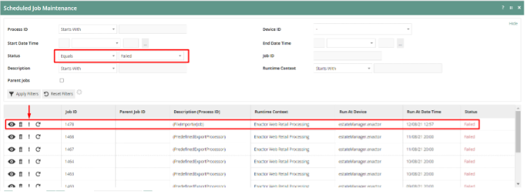

The Application Process Log of this particular failed scheduled job would be opened and then click on the eye icon of the row with the failed message as follows:
 
 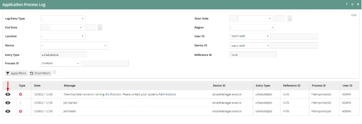

Navigate to the Exception Summary or Exception Details tab for information about the error that can assist further investigation as follows:
 
 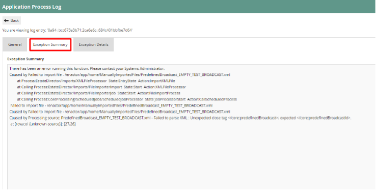
 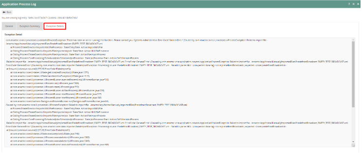
 
#### Licence Failed
This is where when the Licence used is either expired or invalid, a Licence Validation Failed alert is sent to the user.

Whenever such a Licence Failed error occurs, an alert will be sent as an email to the user as configured. The Email alert received is as follows:
 
 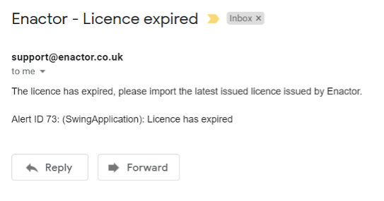

In order to view the Alert created for this, first make a note of the Alert ID that was sent in the email. Then navigate to Alert Maintenance and enter the Alert ID from the email in the Filter Option and click Apply Filters as follows:
 
 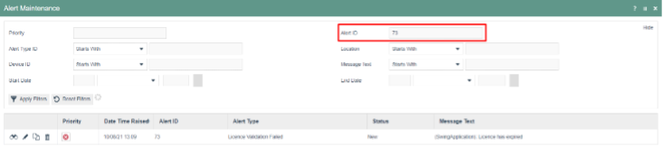
 
To further view this Licence Failed error, make a note of the time that this Alert was created and navigate to the Application Log and make the following changes in the Filter Options:
Log Context Name > Estate Manager Enactor Web Retail Processing
Event Type > Errors
 
 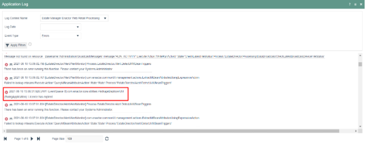

You will be able to notice the Licence failed error in the Application Log with other errors.

#### Database Connection Failed
This is where when there are intermittent database connection issues, a Database Connection Failed alert is sent to the user.

Whenever such a Database Connection Failed error occurs, an alert will be sent as an email to the user as configured. The Email alert received is as follows:
 
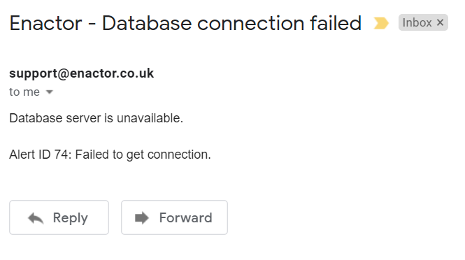

In order to view the Alert created for this, first make a note of the Alert ID that was sent in the email. Then navigate to Alert Maintenance and enter the Alert ID from the email in the Filter Option and click Apply Filters as follows:
 
 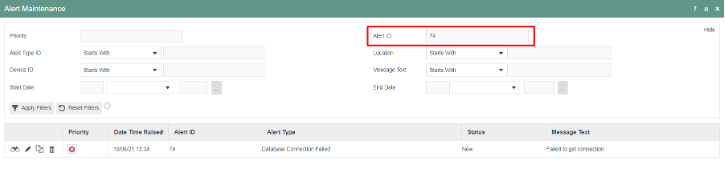

To further view this Database Connection Failed error, make a note of the time that this Alert was created and navigate to the Application Log and make the following changes in the Filter Options:
Log Context Name > Estate Manager Enactor Web Retail Processing
Event Type > Errors
 
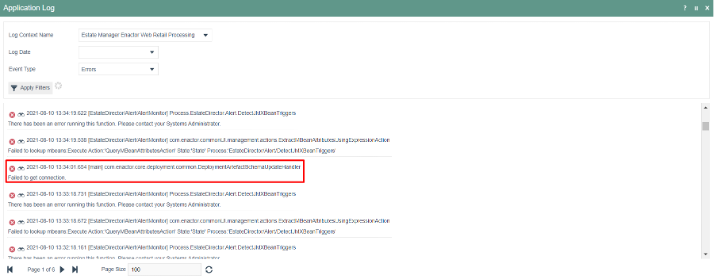

You will be able to notice the Database Connection failed errors that have caused the intermittent database connection failures here in the Application Log along with other errors.

Above shows alerts for intermittent database connection failures and not for total database connection failures. If there is a total database connection failure, following is the screen that is shown to the user when the Estate Manager is opened:
 
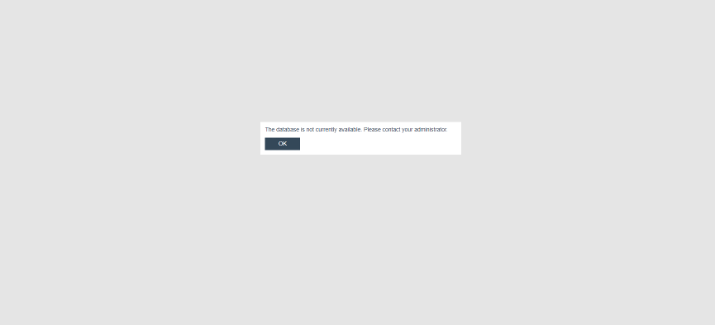

 
