# Base Organisation Structure

## Introduction
This How-to guide covers the setting up the core Organisation Structure, on which the key Configuration components will be based. The base level of the structure begins with the basic company information and default trading currency.  With the basic company information in place, a regional structure that reflects the Retailer’s business organization including stores, warehouses and other locations is added.  The regional structure also provides the underpinnings for other components such as Menu Groups, Price Groups and Fascias.

The intent of the guide is to provide basic guidance on configuration including required and the most common options.  Please refer to the full solution documentation for a detailed explanation of all available settings.

## Company Configuration 
Basic Company information is made available to applications in a Company configuration element. For example, the Company Address may be used in receipts. 

At least one **Company** element is required. Although other Company entries may be created and used in processing and reporting the mandatory entry is required for Licencing and other built-in processing requirements. The mandatory entry must have a Company ID value of 1 and the **Company Name** value must correspond exactly to the string provided for the software Licence. A built-in Company element with **Company ID** of ‘1’ is typically provided with Installed default data if so, has default Company Name value of ‘Enactor’. This entry, if present, should be modified to provide the correct Company Name (as per licence) and other details. 

 
### Accessing the Company Configuration
The **Company** element may be accessed using the Company option, obtained via the selection sequence shown below starting from the Main Menu: 

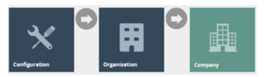

The Company option invokes the Company Maintenance page as illustrated below. The example illustrated contains the installed default data entry, which should be modified to provide the correct Company Name (as per licence) and other details. Use the Edit option (  ) to access the entry for edit. 

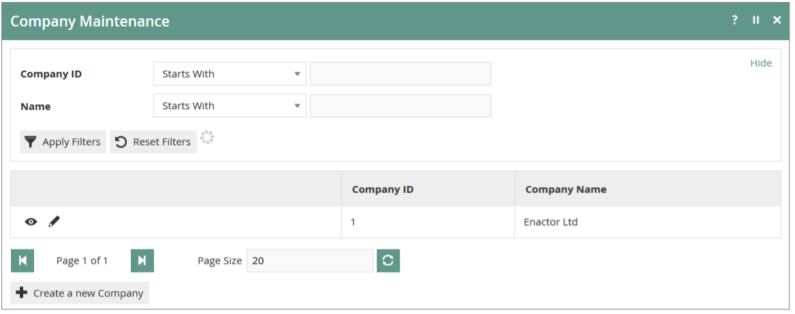

### New Company
In the Company Maintenance page as illustrated above, select the ***Create a new Company*** option: 

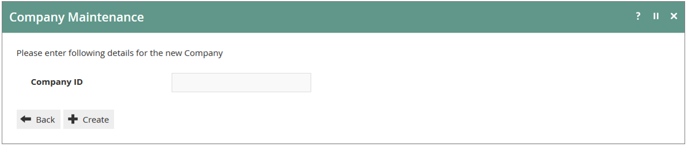 

In the initial screen of Company Create a Company ID is required.
 
### General Tab
Other information associated with the Company can be entered into the properties of the **General** and **Address Tabs** of the Company Maintenance page and provides information that may be used variously throughout the Retail Applications such as for printing receipts and builtin reports and may also be used in Custom Reports or generated documents. The General Tab illustrated below captures the properties described in the following table: 

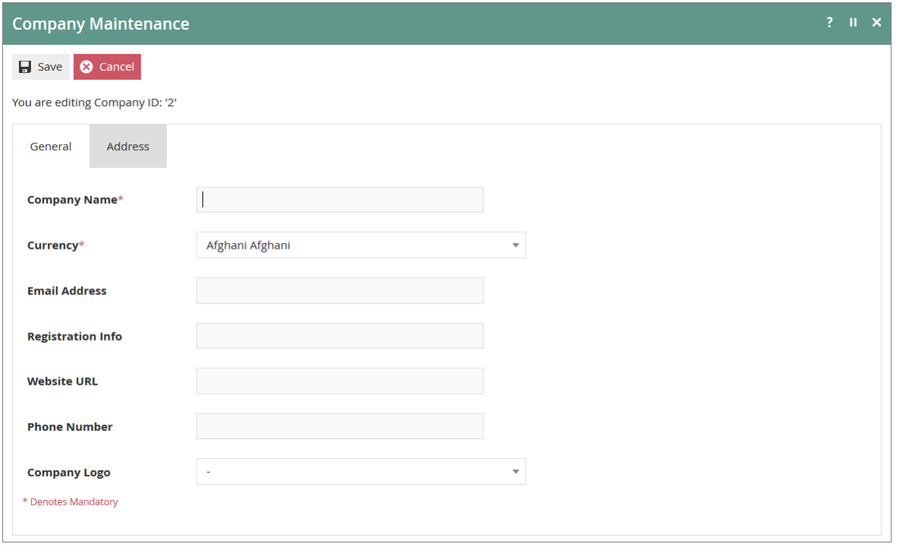  

 
### Address Tab
In the ***Address*** Tab (following) specify the Company Address and other contact details as described in the table following. 

 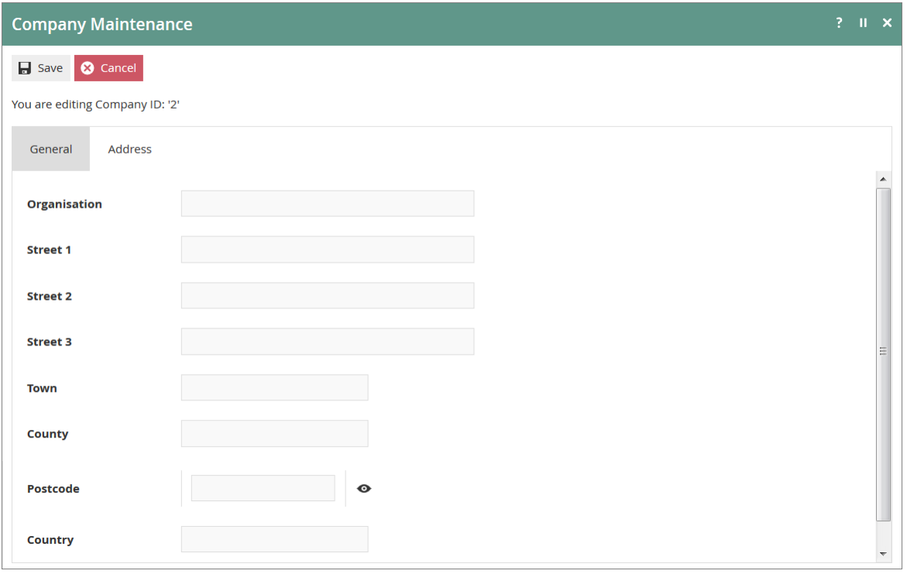 

 
## Configuring Groups
The Groups architecture provides for a variety of predefined **Group Types**, all of which are managed in the Group Hierarchy Maintenance Application of Estate Manager Web Maintenance. Groups configuration is foundational, especially the Region Group Type 

### Accessing Groups 
Groups are accessed using the Groups option, obtained via the selection sequence shown below starting from the Main Menu: 

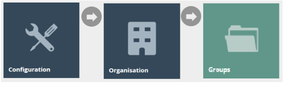 

### New Groups
After making a Group Type selection in the Group Type Filter field use the ***Create new (selected Group Type) Hierarchy*** option to create a new Group Hierarchy. 

 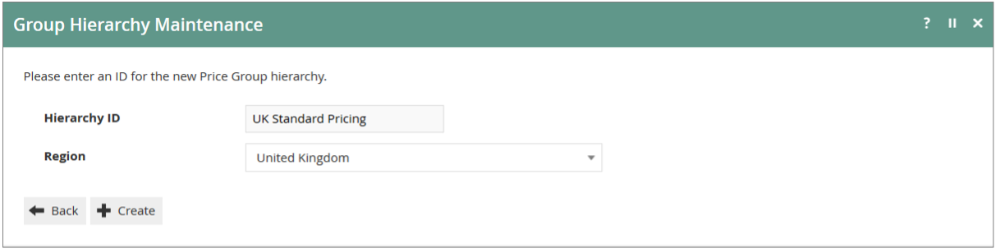 

In the initial page of the Group Hierarchy create function a **Hierarchy ID** value is required and in most cases a **Region** must be also specified. 

### Group Maintenance
Use the **Group Hierarchy Maintenance** page, as illustrated below, to manage Groups of a selected **Type**. Having selected a Group Type the user is able to Add View, Edit, Copy, or Delete ***Group Hierarchies*** and manage the ***Groups*** within them. 

 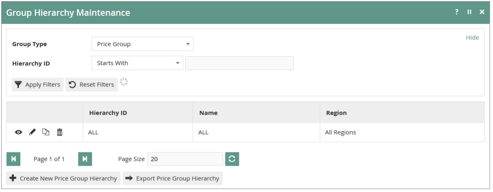 

Filter the listed ***Group Hierarchies by*** entering or selecting values in the Filter properties and selecting ***Apply Filters***.

 
### Region Group
The Region Group Type permits only one Region Hierarchy (All Regions), which is used to represent geographical areas. For example, a UK based company may have a regional hierarchy based on geographic subdivisions of the UK, whereas a Europe- wide company may have a regional hierarchy based on countries. 

#### Region Maintenance
Once the Group Hierarchy has been created, the **Group Hierarchy Edit** page of Group Hierarchy Maintenance is available to ***Add, Edit*** or ***Remove*** Group nodes in the hierarchy as illustrated for the example from the Region Group Type below: 

 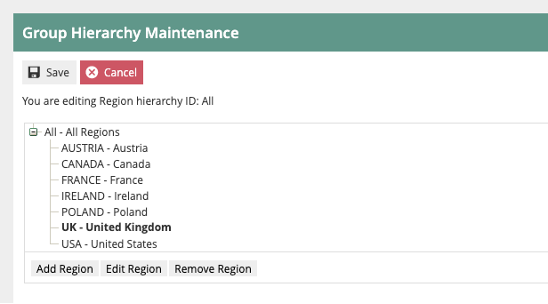 

### Menu Group
The Menu Group Type allows 2 levels and is used to identify a given set of menus applicable to Location or POS Terminal context and in Role maintenance to identify a Menu Group applicable to given Role. 

#### Menu Group Maintenance
Once the Group Hierarchy has been created, the **Group Hierarchy Edit** page of Group Hierarchy Maintenance is available to ***Add, Edit*** or ***Remove*** Group nodes in the hierarchy as illustrated for the example from the Menu Group Type below: 

 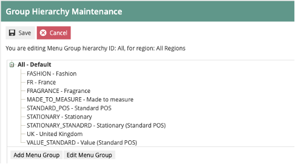 

 
### Price Groups
The Price Group Type is used to identify groups of Product Prices in a hierarchical structure of up to 10 levels. In Product Price Maintenance, Price Groups differentiate Product Prices and may be used to assign Product Prices by Price Group to be used at a POS in POS Terminal configuration. 

#### Price Group Maintenance
Once the Group Hierarchy has been created, the **Group Hierarchy Edit** page of Group Hierarchy Maintenance is available to ***Add, Edit*** or ***Remove*** Group nodes in the hierarchy as illustrated for the example from the Price Group Type below: 

   

### Fascias
Facia Groups allow 2 levels and are used to identify different stores within a store based on the association of Products with a Facia Group and is used in product-related presentation (e.g. receipt logo images) and reporting. 

#### Fascia Group Maintenance
Once the Group Hierarchy has been created, the **Group Hierarchy Edit** page of Group Hierarchy Maintenance is available to ***Add, Edit*** or ***Remove Group*** nodes in the hierarchy as illustrated for the example from the Price Group Type below: 

 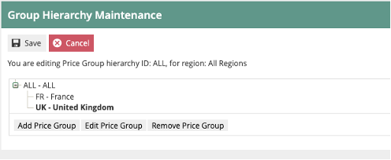 

 

 
