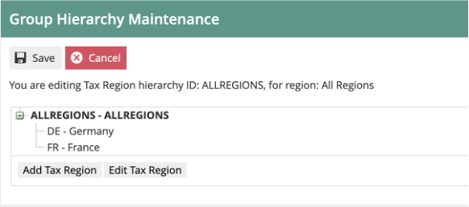
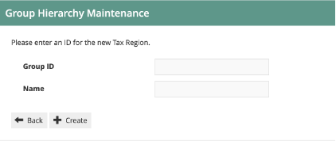
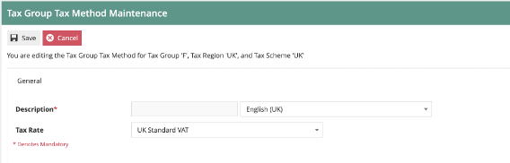

# Configuring UK VAT

## Introduction

The purpose of this guide is to show how to configure the Enactor Estate Manager and POS to calculate Tax correctly.  This guide will use UK VAT as the model, but other tax regimes could be equally well supported with the appropriate configuration.

### Overview
The following steps are required to configure UK Tax:

* Tax Region Configuration
* Tax Scheme Configuration
* Tax Rate Configuration
* Tax Group Configuration
* Product Configuration
* Tax Group Tax Method Configuration
* Location/POS Terminal Configuration

## Prerequisites

### Resources
Before starting, you should have the following resources in place:

* Enactor Estate Manager
* Enactor POS (configured within the UK Region, connected to the Estate Manager)
* Standard Configuration, including:
	* Base Configuration
	* UK Retail (I have used UK in this example, but it could be other regional config packs.  If you import the UK Retail config, the tax configuration described will already exist.  Please note that in this guide we will go through the process of creating the configuration from scratch, as an example.)
* Examples of Data to be used as models, particularly product data

### Prior Training/Experience
You should be familiar with the following:

* Estate Manager configuration
* Enactor configuration concepts, including Locations, POS Terminals, Products etc.
* Data broadcasting
* Standard POS Sales processes

## Configuration Steps

### Tax Region Configuration
The first step is to configure the Tax Region to which the Tax Scheme will be applied (a tax scheme is the container for all the tax rules applicable to a Sales Tax regime such as UK VAT).  Tax Regions allow us to apply the same Tax Scheme in different Geographical regions, with applicable rates for each region.  However, they are frequently used with a 1:1 relationship to Tax Schemes.

Tax Region is an example of a Group configuration, so it is accessed using Group Maintenance: *Configuration-Organisation-Groups*.  Then select the Group Type of “Tax Region” from the drop-down.

 

A single Tax Region hierarchy is usually used for all regions.  Click on the “Edit”   icon by the existing “ALLREGIONS” hierarchy.

This will then display the regions within the hierarchy:
 
 

We will now add a new region under the “ALLREGIONS” top-level group.
Select ALLREGIONS (so it is bold) and then click on “Add Tax Region”:

 

We will set the Group ID to “UK” and the Name to “United Kingdom”.  Then Click Create.
The hierarchy then shows the new group in the list:
 

This concludes the Tax Region configuration.

### Tax Scheme Configuration
The next step is to configure the Tax Scheme.  The Tax Scheme is the “container” for all the configuration settings that relate to that scheme.  Multiple tax schemes can be maintained in the same Enactor solution.  Each Tax Scheme will be relevant for specific area(s) of the Enactor estate (e.g. geographic regions).

Go to Tax Scheme configuration using Search or the path Configuration-Financial-Tax Schemes. The set of existing Tax Scheme will be shown:
 

Click on “Create a New Tax Scheme”.  The Tax Scheme ID field is shown:
 

For UK VAT we will use an ID of “UK”.

 
You will then be presented with the tax scheme details page:
 
 

Set the values on the page as follows:

* Set the Description to “UK Tax”.
* For UK, we do not use a Tax Calculation Service.  This should be left blank (which means Enactor will calculate the VAT itself).
* UK does not use multiple tax rates.
* Prices do include VAT, so check that box.
* Do not remove Tax on Sale.
* Manufacturer coupons are not relevant.

We will set the Applicable Tax Rates later.  We have finished the Tax Scheme maintenance for now, so click on Save.

### Tax Rate Configuration
Tax Rates are used for the various Percentage Rates of tax to be applied within the scheme.  For example, for UK VAT there are three rates (as at 9 Oct 2020):

| Rate ID |	Rate Name	| Percentage |	Applies To |
| ---- | ---- | ---- | ---- |
| UKS	| Standard Rate |	20% |	Most Products |
| UKR	| Reduced Rate	| 5% |	Takeaway food, Children’ Car Seats etc. |
| UKZ	| Zero Rate	| 0%	| Foods, Books, Children’s clothes etc. |

So we will create three rates for the UK VAT Tax Scheme.

Go to Tax Rate configuration using Search or the path Configuration-Financial-Tax Rates.

 
The list of currently configured Tax Rates is shown:

 
As you can see, each rate has an effective date.  It is possible to set up one or more rates with the same ID (e.g. UKS for UK Standard VAT) with different effective dates.  The application will use the applicable rate with the most recent past effective date.

Click on “Create a new Tax Rate”.
The initial Tax Rate Maintenance screen is then shown:
 
 

The Tax Rate Type defines how the tax will be calculated. Use VAT for simple schemes such as that for UK and EU countries.  For countries with more complex rules where the rate is be dependent on the value of the transaction, use Tax Value or Tax Percentage tables.  Composite rates are used when multiple rates are applicable to each item.
As we are configuring UK VAT, we will simply use the VAT type.

The Tax Rate ID can be any unique string.  We will use UKS for UK Standard VAT.  The effective date will be the date at which the 20% rate started in the UK (4 Jan 2011).

The Tax Rate Maintenance details page is then shown:
 
 

Give the rate a meaningful description (e.g. UK Standard VAT).
The Display Tax Code will display on the POS receipt, a short code (e.g. “S” for Standard) is usually used.
Set the Percentage to 20%.
Tax Authority and Fiscal Reference are not relevant for UK tax.

Then save the rate.  Repeat for the other two UK Rates.  This will give you a set of three rates applicable for UK VAT:
 
 

If there is a new Percentage for the same rate (e.g. if the standard rate changed to 21%) then the additional rate should be created with the same Tax Rate ID (e.g. UKS) and a new Effective date.  This new rate will then automatically take effect from that date.

Now the tax rates need to be assigned to the Tax Scheme.  To do this, go to Tax Scheme Maintenance (Configuration-Financial-Tax Schemes) and edit the UK VAT Scheme.  Then click on the “Applicable Tax Rates” tab:
 

You can now add each of the three rates to the scheme.  Select the rate from the drop-down and click on Add.
You will finish up with three rates on the scheme:
 
 

Then save the Tax Scheme.
This concludes the Tax Rates maintenance.

 
### Tax Group Configuration
Tax Groups identify the products that categories that attract different levels of tax.  For example, if a retailer operated just in the UK, they might have simply have groups comprising:

* General Merchandise
* Food
* Books
* Children’s Clothes

This would allow them to set the correct rate to each product category.  However, if the retailer operates in multiple territories, they may want to use more granular categories.  This will allow them to set the applicable rates in each territory.  Setting the correct tax groups for your organisation(s) will depend on the product categories and territories involved.  For this example, we will set up tax groups comprising:

| Tax Group ID	| Tax Group Name	| Applicable UK VAT Rate |
| ---- | ---- | ---- |
| Apparel	| A	| UKS (20%) |
| Food	| F	| UKZ (0%) |
| General Merchandise	| G	| UKS (20%) |
| Takeaway Food	| T	| UKR (5%) |
| Books	| B	| UKZ (0%) |

Navigate to  the tax groups maintenance app using search or the menu path *Configuration-Financial-Tax Groups*.  Please note Tax Groups is a specific maintenance utility.  It is not the same as the Groups maintenance utility.

 
For each group required, click on “Create a new Tax Group”.

 
Then enter the ID and click “Create”.

 
The only required data for the group is the description.
The External Tax Group field is for mapping to a 3rd party system if required.

Enter the description and save.
Then repeat for the other groups:
 

This concludes the Tax Group configuration.

### Product Configuration

Now that we have created the tax groups, we need to assign them to the relevant products.  Note: this will normally be carried out externally to Enactor, using the system of record for product data (usually an ERP or PIM), and then imported via an integration process.  We will configure products manually within Enactor as examples:

Go to Product Maintenance (Configuration-Merchandise-Products) and edit an example product:
 
 

Click on the “Tax” tab:
 
 

The first two checkboxes are not relevant for this example.  The key entry is the “Tax Group” dropdown.  This should be set to the appropriate tax group for the product (as this is yoghurt, I will choose the Food Tax Group).

The table at the bottom is used when there are multiple tax regions in the organisation, and the tax group for this product is different in various regions.  This is an additional complexity that should be avoided wherever possible, but if necessary it can be used to set an alternative tax group to the product for specific tax region(s).

Once the tax group is assigned to the product, save it.  Amend any other example products you wish to use.

### Tax Group Tax Method Configuration
Now that we have maintained Tax Regions, Schemes, Rates and Groups, we need to bring them all together so that the application can apply the rules in the right way.  To do this, we use the Tax Group Tax Method mapping configuration.  

Go to the Tax Group Tax Method maintenance utility using search or the menu path *Configuration-Financial-Tax Group Tax Methods*.

 
First, we will filter the list to the Tax Region we are interested in (United Kingdom). Then we can create the set of mapping records for each Tax Group:
Click on “Create a new Tax Group Tax Method”.

	
 
Select the appropriate values for each of the three dropdowns.  Choose each Tax Group in turn.  The Tax Region should be United Kingdom.  The tax scheme should be UK VAT.  Then click “Create”.

 
Enter a description, e.g. “Food – zero rate”.  
Choose the applicable tax rate from the dropdown.
Then click Save:

  
Repeat for each of the Tax Groups in the region.  Apply the appropriate rate for each group.
 
 

This concludes the configuration of Tax Group Tax Methods.
 
### Location Configuration
The final configuration step is to apply the tax region and tax scheme to each applicable location.  This tells the application what tax rules to apply at each store.
Note that as well as configuring tax directly using Location Maintenance, it is possible to use Location Templates (e.g. a UK Location template may be used to set UK VAT rules for all UK Stores).

Go to the Location maintenance utility using search or the menu path Configuration-Organisation-Locations.

Edit a UK Store location and choose the General-Tax Tab:
 
 

Set the Tax Region to United Kingdom and the Tax Scheme to UK VAT:

:::note
It is also possible to configure the VAT rules at POS Terminal level.  This would normally only be used where there are “Special” POS Terminals within a store, which have non-standard tax rules.  Generally the tax settings on the POS Terminal would be left blank, which would cause the POS to fall back to the store location-level settings.
:::

This concludes the Location Configuration for tax.

## Broadcasting and Testing the Configuration
At this stage all the tax rules that have been configured should be broadcast to the applicable stores/devices.  The “Retail Static Data” Predefined Broadcast configuration could be used for this.

Once all the rules have been broadcast, the till should be restarted to ensure it has applied the latest settings to all applicable entities.

Then transactions may be processed to confirm the configuration is working as expected.

If the POS is configured to display the Tax breakdown on the receipt (in the POS Terminals Printing-Flags configuration) this can be immediately checked.

Example of Receipt with Tax Details included:
 
 

If the tax breakdown is not required on the receipt, the XML Transaction basket may be reviewed to check the tax calculation details.

 
