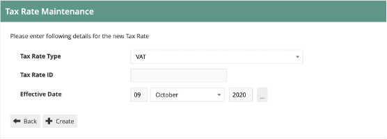
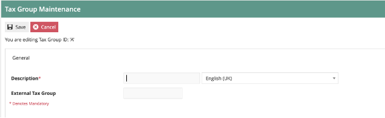

# Configuring US Tax
## Introduction

The purpose of this guide is to show how to configure the Enactor Estate Manager and POS to calculate Tax correctly.  This guide will use US sales tax as the model, but other tax regimes could be equally well supported with the appropriate configuration.

The Enactor Retail Application includes a configurable Tax Engine which is fully capable of supporting global estates.  The native Tax configuration of Enactor Retail accommodates regional Taxation rules by defining Tax Schemes in which different Tax Rates may apply alternatively or in combination.  

## Overview
The following steps are required to configure US Tax:

* Tax Region Configuration
* Tax Scheme Configuration
* Tax Rate Configuration
* Tax Group Configuration
* Product Configuration
* Tax Group Tax Method Configuration
* Location/POS Terminal Configuration

## Prerequisites

### Resources
Before starting, you should have the following resources in place:

* Enactor Estate Manager
* Enactor POS (configured within the US Region, connected to the Estate Manager)
* Standard Configuration, including:
	* Base Configuration
	* US Retail (due to the complexity of US sales tax, one should assume that additional configuration will always be required even when using the US Retail configuration set)
* Examples of Data to be used as models, particularly product data

### Prior Training/Experience
You should be familiar with the following:

* Estate Manager configuration
* Enactor configuration concepts, including Locations, POS Terminals, Products etc.
* Data broadcasting
* Standard POS Sales processes

## Configuration Steps
### Tax Region
Tax Regions are hierarchical Groups of type Tax Region, which are closely integrated with the Regions hierarchy. Each Tax Region Hierarchy is associated with a Region. Regions are also Groups. To create or modify Groups of type Tax Region, access the Group Hierarchy Maintenance page and select the Tax Region Group Type. To create a new Hierarchy select Create New Tax Region Hierarchy. In the initial page of the Create option specify the Hierarchy ID and select a Region from the Regions dropdown list to associate it with then select Create. 

#### Tax Region Configuration
The first step is to configure a Tax Region to which a Tax Scheme will be applied (a tax scheme is the container for all the tax rules applicable to a particular tax jurisdiction).  Tax Regions allow us to manage tax rate and law changes in different jurisdictions. When dealing with US sales tax, there is typically a 1:1 relationship to Tax Schemes.

Tax Region is an example of a Group configuration, so it is accessed using Group Maintenance: Configuration-Organisation-Groups.  Then select the Group Type of “Tax Region” from the drop-down.

 
 
 

A single Tax Region hierarchy is usually used for all regions.  Click on the “Edit”   icon by the existing “ALLREGIONS” hierarchy.

This will then display the regions within the hierarchy:
 
 

We will now add a new region under the “ALLREGIONS” top-level group.
Select ALLREGIONS (so it is bold) and then click on “Add Tax Region”:

 

We will set the Group ID to “US” and the Name to “United States”.  Then Click Create.
The hierarchy then shows the new group in the list:
 
 

The steps above should be repeated until a region is fully built down to the jurisdiction level.  As shown below:

 

This concludes the **Tax Region** configuration.

### Tax Schemes
The Tax Scheme is an independent entity that is specifically associated only with a set of Tax Rates. Note that a Tax Rate should not be associated with multiple Tax Schemes unless it is intended that any change to the rate should be applicable to all the Tax Schemes. 

#### Tax Scheme Configuration
The next step is to configure the Tax Scheme.  The Tax Scheme is the “container” for all the configuration settings that relate to that scheme.  Multiple tax schemes can be maintained in the same Enactor solution.  A Tax Scheme will be created for each tax jurisdiction/Tax Region.

Go to Tax Scheme configuration using Search or the path Configuration-Financial-Tax Schemes.

The set of existing Tax Scheme will be shown:
 

Click on “Create a New Tax Scheme”.  The Tax Scheme ID field is shown:
 
 

For this example, we will create a Tax Scheme for the Atlanta, GA Tax Region.  Enter a scheme ID that can be easily recognized.  In this example, we’re using USG_ATL.

You will then be presented with the tax scheme details page:
 
 

Set the values on the page as follows:

* Set the Description to “Atlanta, GA Tax”.
* For this example, we are not using a Tax Calculation Service.  This should be left blank (which means Enactor will caulate the tax itself).
* Enable Multiple Tax Rates Allowed.
* Prices do not include Tax, so that box should remain unchecked.
* Do not remove Tax on Sale.
* Manufacturer coupons are not relevant.

We will set the Applicable Tax Rates later.  We have finished the Tax Scheme maintenance for now, so click on Save.

### Tax Rates
**Tax Rates** are defined before and independently of **Tax Schemes**. They are named Tax Rate values, which may be independently associated with Tax Schemes when Tax Schemes are created or modified. Multiple Tax Rates may be associated with a Tax Scheme. 

:::note
Although Tax Rates are independent of Tax Schemes, they should not be associated with multiple Tax Schemes unless it is intended that a change to the Tax Rate value should affect all the associated Tax Schemes.
:::

### Tax Rate Configuration Approach
When configuring tax rates for US retailers, there are multiple approaches that can be taken.  Either approach will result in the correct tax being calculated and collected POS.  The impact of the approach taken will be realized during initial setup as well as ongoing operations and maintenance.  Tax Rates can either be setup generically (i.e. 4.0% State Sales Tax) or jurisdiction specific (i.e. 4.0% State Sales Tax- Georgia).  Each method has its own pro’s and con’s:

When using generic Tax Rates, the number of rates that will need to be created for a retailer will be minimized.  For example, there are 5 states in the US that have the same 4.0% state sales tax rate as Georgia.  While not a huge savings in terms of data setup, the benefit can increase greatly at the county level where only very large or very dense chains operate multiple locations within a single county.  The use of generic Tax Rates may also streamline the setup of new locations where it will be more likely that the appropriate tax rate may already exist.

When using jurisdiction specific Tax Rates, while the number of distinct rate entries will increase, the level of effort to maintain those rates over time will decrease.  For example, if the state of Georgia were to increase the state sales tax rate to 4.5%, it would only require a single change to update all jurisdictions within the state of Georgia.  Using a generic Tax Rate would require that every jurisdiction within Georgia to be updated individually.  Also, the ability to specify an effective date on a tax rate simplifies the coordination of updates and provides additional options when managing “tax free” holidays.

Determining the best approach for a retailer will be based on many factors including number of locations, number of jurisdictions and any tax rate integration capabilities available.  Some integrations may only provide jurisdictions with appropriate rate level information where others may provide jurisdiction specific Tax Rates.  The examples shown in this document utilize the generic approach to configuring Tax Rates, but the general concepts and approach is applicable for either method.

#### Tax Rate Configuration
Tax Rates are used for the various Percentage Rates of tax eligible to be applied within the scheme.  This must include all possible rates for all products being sold within a jurisdiction.  For example, in our Atlanta, GA location, we need to account for State, County, City and Other tax rates for fully taxed, reduced tax and tax-free merchandise:

| Rate ID |	Rate Name	| Percentage |	Applies To |
| ------ | ------ | ------ | ------ |
| ST_4.0 |	State Sales Tax 4.0% |	4% | Most Products |
| CN_3.0	| County Sales Tax 3.0%	 | 3%	| Most Products |
| CT_1.5	| City Sales Tax 1.5% |	1.5%	| Most Products |
| OT_0.4 |	Other Sales Tax 0.4% |	.4%	 | Most Products |
| ST_0.0	| State Sales Tax 0.0% |	0%	| Grocery and state exempt items |
| CN_0.0	| County Sales Tax 0.0%	 | 0%	| County exempt items |
| CT_0.0	| City Sales Tax 0.0%	| 0%	| City exempt items |
| OT_0.0	| Other Sales Tax 0.0%	| 0%	| Other exempt items |

Eight rates will be required to support the Atlanta, GA location.

Go to Tax Rate configuration using Search or the path Configuration-Financial-Tax Rates. 

The list of currently configured Tax Rates is shown:

 
As you can see, each rate has an effective date.  It is possible to set up one or more rates with the same ID with different effective dates.  The application will use the applicable rate with the most recent past effective date. 

Click on “Create a new Tax Rate”.
The initial Tax Rate Maintenance screen is then shown:
 
 

The Tax Rate Type defines how the tax will be calculated. Use VAT for most jurisdictions where tax is calculated simply as a percentage of the selling price.  For jurisdictions with more complex rules where the rate is be dependent on the value of the transaction, use Tax Value or Tax Percentage tables.  Composite rates are used when multiple rates are applicable to each item.  See Appendix A for more information on special Tax Rate entry methods.

As we are configuring basic, percentage-based taxes in this example, we will simply use the VAT type.

The Tax Rate ID can be any unique string.  We will use ST_4.0 for the 4.0% State Sales Tax.  Since the rate itself is generic, we will not specify an effective date.

The Tax Rate Maintenance details page is then shown:
 
  

Give the rate a meaningful description (e.g. State Sales Tax 4.0%).
The Display Tax Code will display on the POS receipt.  Most US retailers choose to display the tax type as well as the percentage.  A Display Tax Code of “4.0% State” would be appropriate.

Set the Percentage to 4%.
Tax Authority and Fiscal Reference are not relevant for US tax.

Then save the rate.  Repeat for the other seven Atlanta, GA Rates.  This will give you a set of eight rates applicable for Atlanta, GA.

Now the tax rates need to be assigned to the Tax Scheme.  To do this, go to Tax Scheme Maintenance (Configuration-Financial-Tax Schemes) and edit the Atlanta, GA Scheme.  Then click on the “Applicable Tax Rates” tab:
 
  

You can now add each of the three rates to the scheme.  Select the rate from the drop-down and click on Add.
You will finish up with eight rates on the scheme:
 
  

Then save the Tax Scheme.
This concludes the Tax Rates maintenance.

 
### Tax Groups
Tax Groups are defined with a Tax Group ID and Description and serve simply as an identifiable anchor with which Products may be associated and thereby collectively referenced for purposes of associating them with a Tax Scheme either universally or regionally (via TaxGroupTaxMethod). Note that Tax Groups are not hierarchical and are not defined using the Groups infrastructure. An individual Product may be specifically assigned to a Tax Group either universally (at Product level) or regionally, by specifying a list of Tax Region-Tax Group assignments for the Product. Alternatively (or additionally) a Merchandise Management Group (MM Group) may be assigned to a Tax Group, also either universally (at MM Group level) or regionally, by specifying a list of Tax Region-Tax Group assignments for the MM Group. If an individual Product should happen to be associated with a Tax Group by both routes the specific Product assignment takes precedence. 

### Tax Group Configuration
Tax Groups identify the categories of product that may attract different levels of tax.  In the US, this can be very complex as qualification as well as benefits can vary by jurisdiction.  For example, in the state of Ohio, all grocery items are tax exempt at all levels but in Georgia, grocery items are tax exempt at the state level but may still be taxed at the county and city level.  The retailer will be very familiar with how and where their products can be impacted.  For the purpose of this example, we will use the following categories which are commonly affected by various tax rate reductions:

* General Merchandise
* Grocery
* Clothing
* Services

For this example, we will set up tax groups comprising:

| Tax Group ID |	Tax Group Name |	Atlanta, GA Tax Rate |
| Clothing |	C	| 8.9%- ST, CN, CT, OT |
| Grocery	| G	 | 4.9%- CN, CT, OT |
| General Merchandise | 	M	| 8.9%- ST, CN, CT, OT |
| Services	| S	 | 8.9%- ST, CN, CT, OT |

Navigate to  the tax groups maintenance app using search or the menu path Configuration-Financial-Tax Groups.  

:::note
Tax Groups is a specific maintenance utility.  It is not the same as the Groups maintenance utility.
:::

 

 
For each group required, click on “Create a new Tax Group”.

 
The enter the ID and click “Create”.

 The only required data for the group is the description.
The External Tax Group field is for mapping to a 3rd party system if required.

Enter the description and save.
Then repeat for the other groups:
 
 

This concludes the Tax Group configuration.

### Product Configuration

Now that we have created the tax groups, we need to assign them to the relevant products.  Note: this will normally be carried out externally to Enactor, using the system of record for product data (usually an ERP or PIM), and then imported via an integration process.  We will configure products manually within Enactor as examples:

Go to Product Maintenance (Configuration-Merchandise-Products) and edit an example product:
 

Click on the “Tax” tab:

 

The first two checkboxes are not relevant for this example.  The key entry is the “Tax Group” dropdown.  This should be set to the appropriate tax group for the product (as this is bottled water, I will choose the Grocery Tax Group).
The table at the bottom is used when there are multiple tax regions in the organisation, and the tax group for this product is different in various regions.  This is an additional complexity that should be avoided wherever possible, but if necessary it can be used to set an alternative tax group to the product for specific tax region(s).

:::tip
Tax Group and Regional Tax Group can also be assigned at any level of the Merchandise Hierarchy. When editing an MMG Group in Group Hierarchy Maintenance, a Tax tab is presented that includes the same settings as the Tax tab for products.  It is only recommended to configure Tax Group at the MMG level if it can be supported through the retaier's entire assortment.  For clarity reasons, it is not recommended to mix settings at both the MMG and Product level.
:::

Once the tax group is assigned to the product, save it.  Amend any other example products you wish to use.

### Tax Group Tax Methods
Tax Group Tax Methods are defined to associate a Tax Group, Tax Scheme and Tax Region with a specific individual or set of Tax Rates derived from those associated with the Tax Scheme. They may be defined, after all required instances of the above elements are defined. 

### Tax Group Tax Method Configuration
Now that we have maintained Tax Regions, Schemes, Rates and Groups, we need to bring them all together so that the application can apply the rules in the right way.  To do this, we use the Tax Group Tax Method mapping configuration.  

Go to the Tax Group Tax Method maintenance utility using search or the menu path Configuration-Financial-Tax Group Tax Methods.

 
First, we will filter the list to the Tax Region we are interested in (US- Atlanta, GA). Then we can create the set of mapping records for each Tax Group:
Click on “Create a new Tax Group Tax Method”.	

 
Select the appropriate values for each of the three dropdowns.  Choose each Tax Group in turn.  The Tax Region should be US-Atlanta, GA.  The tax scheme should be Atlanta, GA Tax.  Then click “Create”.

 
Enter a description, e.g. “Grocery- Atlanta, GA”.  
Select and add the appropriate Tax Rates for the Tax Group.  Since this example is for Grocery products in Atlanta, GA remember to select the 0.0% State Tax Rate (refer to table in the Tax Group section). Then click Save:

  
Repeat for each of the Tax Groups in the region.  Apply the appropriate rate for each group.
 
 

This concludes the configuration of Tax Group Tax Methods.
 
### Location Configuration
The final configuration step is to apply the tax region and tax scheme to each applicable location.  This tells the application what tax rules to apply at each store.

Go to the Location maintenance utility using search or the menu path Configuration-Organisation-Locations.

Edit the Atlanta, GA location and choose the General-Tax Tab:
 
 

Set the Tax Region to US- Atlanta, GA and the Tax Scheme to Atlanta, GA Tax.

This concludes the Location Configuration for tax.

### POS Terminal Configuration
It is common, but not required, in the US for retailers to print a breakdown of the taxes collected on the receipt.  To have the detailed information printed, select the Printing tab in POS Terminal Maintenance and then navigate to the Flags subtab.  Select the option Print Tax Details on Receipt:
 

:::tip
It is also possible to configure the tax rules at POS Terminal level.  This would normally only be used where there are “Special” POS Terminals within a store, which have non-standard tax rules or a terminal taken off-site to sell in a different jurisdiction.  Generally, the tax settings on the POS Terminal would be left blank, which would cause the POS to fall back to the store location-level settings.
:::

This concludes the POS Terminal Configuration for tax.

## Broadcasting and Testing the Configuration
At this stage all the tax rules that have been configured should be broadcast to the applicable stores/devices.  The “Retail Static Data” Predefined Broadcast configuration could be used for this.

Once all the rules have been broadcast, the till should be restarted to ensure it has applied the latest settings to all applicable entities.

Then transactions may be processed to confirm the configuration is working as expected.

If the POS is configured to display the Tax breakdown on the receipt (in the POS Terminals Printing-Flags configuration) this can be immediately checked.

If the tax breakdown is not required on the receipt, the XML Transaction basket may be reviewed to check the tax calculation details.
 
## Appendix A- Alternative Tax Rate Configuration
While most taxing authorities in the US now rely on simple percentage calculations, some jurisdictions still make use of tax tables to enforce special rounding rules where others have chosen to implement variable rates and change the tax rate based on purchase.

As an example, the state of Florida uses a bracket system for calculating sales tax when the transactions fall below or in between whole dollar amounts.  The state sales tax rate is 6% and allows an additional county tax of 0 – 2.5%.  Below is the tax table provided for an 8% effective rate:
 
 

To configure the Tax Rate represented by this table, create a new tax rate of the type Tax Value Table:
 
 

Enter the basic information on the General tab
 
 

Begin replicating the tax table on the Table Value Tab:
 
 

:::info
Notice that there is a pattern within the table and it essentially begins repeating after $1.09.  To save entering the entire table, we can stop entering ranges at $1.09 and use the Repeat From feature on the $.10 - $.12 bracket.
:::

In some jurisdictions, the tax rate changes based on the amount purchased.  In the state of Rhode Island, no state sales tax is charged on the first $250.00 of clothing purchases.  Purchase beyond $250.00 are subject to the standard 7% state Tax Rate.  This can be configured using the Tax Percentage Table Tax Rate Type.

Create a new Tax Rate for Rhode Island with a type of Tax Percentage Table:
 
 

Enter the general Tax Rate information:

 

Enter the value ranges and associated tax percentages as shown below.  By selecting Tax Percentage Applies to Range you are stipulating that the tax amount will be calculated based on range when the purchase amount spans multiple ranges.  In our example, checking the box will mean that only the purchase amount exceeding $250.00 will be taxed at 7% (i.e. on a $265 purchase, $250 would be taxed at 0% and $15 would be taxed at 7%).
 
 

After special rates have been created as described above, they can be included into Tax Schemes and Tax Group Tax Methods just as the standard VAT type taxes described earlier.
 
