# Data and Regional Broadcasting

## Introduction

The purpose of this guide is to demonstrate how to configure broadcasts that are used to distribute configuration throughout the estate to meet organizational needs. 
All data is managed and maintained centrally in the Estate Manager. To apply configuration changes across the estate, the user will need to broadcast configurations using the Enactor broadcast function. The data broadcasting function in Enactor is fundamentally for selecting configuration elements (entities) that require distribution and identifying the target devices that they should be distributed to. This targeted distribution of the configured data to distributed systems of Enactor retail applications can be achieved in both manual and automated procedures with administration options to configure and manage them.

## Overview
This guide will cover the following configuration entities: 

* **Prerequisites for Broadcasting** – Providing an understanding of how active subscriptions work and how they can be managed for devices. 
* **Predefined Broadcast Configuration** – Defining the key requirements and setting up broadcasts to be sent across the estate. 
* **Data Broadcaster Configuration** – Enable manual distribution of specific data to devices across the estate as specified in the predefined broadcasts. 
* **Broadcast Status** – Monitoring the status of the broadcasts locally as well as in the Estate Manager to make sure that they are successfully completed. 
* **Troubleshooting Broadcast Issues** – Tackling and fixing broadcast issues that may arise during broadcasting.

## Prerequisites for Broadcasting
To perform broadcasts successfully, the user must ensure that the intended target devices for broadcasts are subscribed before performing any broadcasts. Without the device being subscribed, the Estate Manager will not be able to communicate with the devices. If correctly installed, any device at start-up will connect to the Estate Manager Server and will be automatically subscribed. Once subscribed, the Estate Manager will be able to target that device or the range of devices and broadcast data directly to them. If the device has not been subscribed, it will not receive the broadcasted updates, and such failure to subscribe may happen due to network issues or firewall restrictions.

### Active Subscriptions Management
Active Subscription Management option provides a means to monitor and manage the subscriptions to queues from Devices in the Estate. Before performing any broadcasts, it is better to check if the device has already been subscribed.  
To check if the device is subscribed, follow the steps below:

The Active Subscriptions Management application can be accessed through: 
Administration -> Message Service -> Active Subscriptions Management
 
 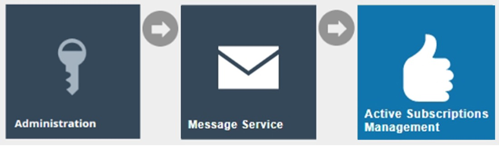

The **Active Subscriptions** page lists all subscriptions to all queues for all Devices. The user is enabled to perform a filtered search of any of the Enactor messaging queues and/or the Client ID as shown below. The Client ID contains the device ID and is considered the best way to determine if a device has been subscribed to the queues.  

Following are the Enactor messaging queues: 

* AllStores – Every device in the enactor estate will subscribe to this queue. 
* Device – This is a device-specific queue. 
* Location – This is a location-specific queue. Once a device has been loaded in a valid location, it will subscribe to this queue. 
* Region – This is a region-specific queue and once a device has been loaded in a valid region it will subscribe to this queue. 

Enter the Client ID (Device ID) of the device that you wish to monitor the subscription status in the Client ID filter space and select the apply filter option. 
The subscribe status of the selected device will be listed as shown below in the example. The below example shows that the **pos1@0001.enactor** device is successfully subscribed to all the messaging queues and is ready to receive broadcasts from the Estate Manager.
 
 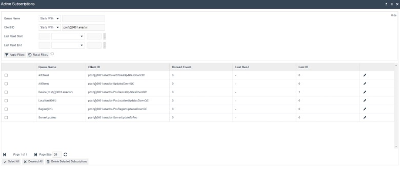
 
## Configuration Steps
Predefined Broadcasts are persistent, reusable entities that define the key requirements of a broadcast. This allows the user to create a broadcast, add or remove the entities they wish to broadcast and then target the broadcast to exactly where they wish to send the configurations.

### Predefined Broadcast
To create a new Predefined Broadcast, follow the steps below:

The Predefined Broadcast Maintenance application can be accessed through: 
Administration -> Data Management -> Broadcasts -> Predefined Broadcast
 
 
 
To create a new Predefined Broadcast, select **Create a new Predefined Broadcast** on the Predefined Broadcast Maintenance page.
 
  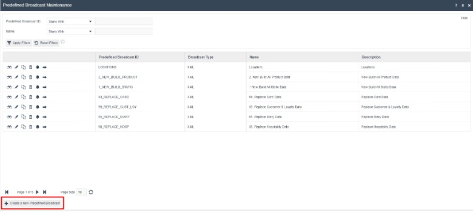
  
Enter a unique **Predefined Broadcast ID** for the new Predefined Broadcast. The ID can be alphanumeric and contain a maximum of 20 characters. The ID will be used to uniquely identify this new Predefined Broadcast. Use of a systematic and business-specific naming convention is recommended here.
 
 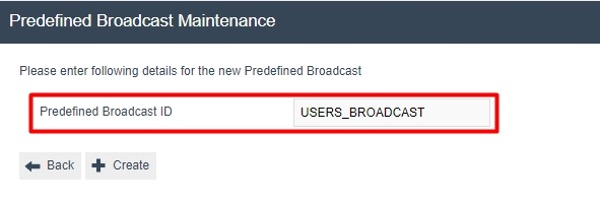
 
 Select **Create**.
 
The Predefined Broadcast Maintenance, for the newly created Predefined Broadcast, is presented as follows with the 3 key tabs namely; **General, Details** and **Override**. 

#### Predefined Broadcast – General Tab
The **General** tab has all the basic information that captures the identity of the Predefined Broadcast.
 
  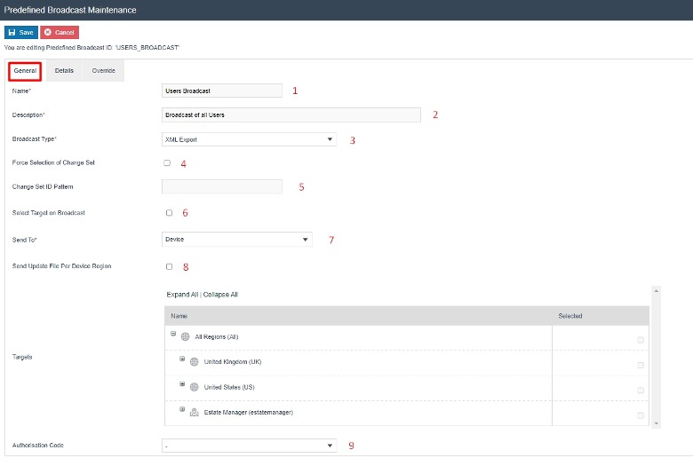
  
Set the appropriate values on the **General** tab as follows:

| Configuration	| Description |
| ------ | ------ |
| Name	| Enter a unique identifier by which users may recognise and select the predefined broadcast in other user interfaces, that can be alphanumeric with a maximum of 50 characters. |
| Description | Enter a user-friendly, informative description for the predefined broadcast that can be alphanumeric with a maximum of 100 characters. |
| Broadcast Type |	Select the desired Broadcast Type from the dropdown list of predefined Export Types, which supports broadcast. Built-in types are XML and CSV. |
| Force Selection of Change Set |	Checkbox, if checked indicates that change sets must be used to select a Change Set. A Change Set defines the period covered by instance selection for the broadcast. If selected, a dropdown list of Change Sets will be presented for selection. |
| Change Set ID Pattern | This is a string value which is used to specify a Change Set for which the broadcast is to be made. Automatically generated change set IDs normally have the form {userId}-{openDateTime}, so a User ID is usually sufficient. Other automatically generated IDs have the same format. These are mainly generated by imports and the two main IDs are SELL_CODE_SET_IMP and PRICE_SET_IMP. Custom change sets can also be created with Arbitrary IDs. |
| Select Target on Broadcast | Checkbox, if checked indicates that targets for the broadcast must be specified by the user at the time of submitting the Predefined Broadcast using the Data Broadcaster. If not checked, an additional panel is present in the General Tab to capture and include specified Targets in the Predefined Broadcast itself. |
| Send to / Target | Select the desired target for the broadcast from a dropdown list of fixed options. <ul><li>**All Stores** – Indicates all Store Servers, Mobiles Servers and POS devices.</li><li>**Regions** – Indicates selected regions only and devices linked to the region.</li><li>**Locations** – Indicates selected locations and devices linked to that location.</li><li>**Device** – Indicates individual devices.</li></ul>This is applicable only if the previous “Select Target on Broadcast” field is not checked. |
| Send Update File Per Device Region | This field is applicable when defining Predefined Regional Entities for Broadcasts. Checkbox, if checked indicates that when the zip files are sent to the target devices, they are sent according to the regions as separate zip files for the same device. This is explained further in “Regional Broadcasting – Local Updates Folder” sub-section later in this guide. |
| Authorisation Code | Specifies an authorisation (permission/privilege) required to be in the User’s Role for the User to apply the broadcast. Select a desired authorisation Code from the dropdown List if applicable. The permission value can be defined in Special Functions element of User Roles Maintenance.|

#### Predefined Broadcast – Details Tab
The **Details** tab displays a list of entities available to broadcast and provides for selection of the configuration elements (entities) to be broadcasted. If “Force Selection of Change Set” described in the General Tab is not checked, all instances of the configuration elements selected here will be broadcasted.
 
 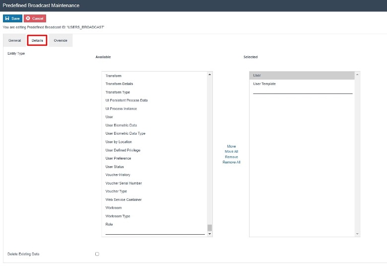
 
Set the appropriate values on the Details tab as follows:

| Configuration	| Description |
| ------- | ------ |
| Entity Type |	Select the entities you wish to include by highlighting and double clicking on an individual entity to move it to the selected table (table on the right) or by highlighting a range of entities and selecting the “Move” button. All entities within the selected table will form part of the broadcast. |
| Delete Existing Data |	Checkbox, if checked indicates that all data for the selected configuration elements (entities) will be deleted from the selected target before the broadcast data is applied. |
| Broadcast Delay |	Set a specific time period, if necessary to delay this predefined broadcast when it is being broadcasted. The period specified here will only be triggered after this predefined broadcast has been broadcasted using the data broadcaster. |

#### Predefined Broadcast – Override Tab
The **Override** tab allows for advanced overrides of Entity Distribution Details by the Predefined Broadcast. This will not be described in this guide.
 
 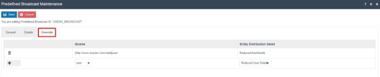
 
After configuring all the above 3 tabs, select Save to complete creating the new Predefined Broadcast.

### Regional Predefined Broadcast
Certain entities have region or location-based configurations such as product, menu, roles, tender and more. These entities would have been configured only for a particular region or location. However, when the usual broadcasts are done, even the entities that are not a part of that region or location are broadcasted, which in turn broadcasts a large amount of unnecessary data to that device. 

Following is an example scenario: 
A parent region is set to All Regions with UK and US as its Child Regions. Tenders are configured in the Tender Maintenace separately for UK and US regions. A new device is set up in the UK region and requires the Tenders that are configured only for the UK region to be broadcasted.  However, this cannot be done by broadcasting the **Tender** entity to the new device in the UK region, as it will broadcast all the US tender configurations as well, which is unnecessary data for the device in the UK region. 
 
For this purpose, the “Tender by Region” entity in the Details tab of Predefined Broadcast Maintenance is used, which ensures that the entities are distributed only to specified regions. There are many such entities for both Region and Location, which are listed and shown in the next sub-section. With this option, broadcasts can be sent to All Regions or Stores in the estate, but will only impact the respective regions or locations to which the entities have been configured. This enables the distribution of data throughout the estate in a more efficient manner.

#### Predefined Broadcast – Details Tab
In the Details tab of the Predefined Broadcast Maintenance application, there are special entities that can be selected for Regional Broadcasting.

Following are the entities that can be selected to broadcast the entities by Region:

* Location by Region
* Menu by Region
* Option Set by Region
* Product by Region
* Product Attribute by Region
* Product Price by Region
* Product Product Group by Region
* Product Sale Region by Region
* Promotion by Region
* Reason by Region
* Regional Product by Region
* Role by Region
* Selling Code by Region
* Tender by Region

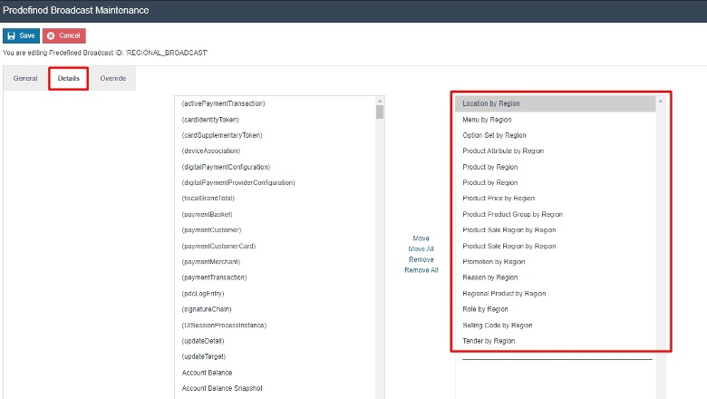
 
Following are the entities that can be selected to broadcast the entities by Location:

* Product Price by Location
* User by Location

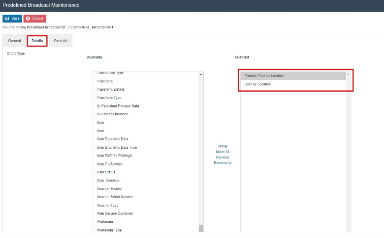
 
#### Regional Broadcasting – Local Updates Folder
Once broadcasts are completed, the affected entities are sent to the target devices in the form of a zip file. They are then downloaded by the devices and these zip files exist in the Updates Folder. This is further explained in the "Local Updates Folder" sub-section under “Broadcast Status”. 

:::note
Please make sure to select the “Send Update File Per Device Region” checkbox in the “Predefined Broadcast – General Tab”, which will enable the zip files to be broken down into more than 1 zip file, allowing to form a better structure of the data that is being broadcasted. The example below shows the Updates Folder after the above configuration has been enabled.
:::
 
Following is how the contents of the zip file in the local updates folder is shown when the normal **Tender** entity is broadcasted:

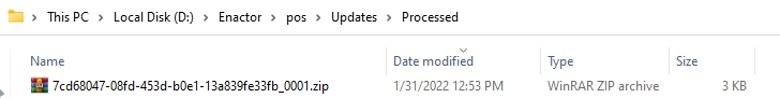
 
You will notice here that this zip file ends with “_0001”, which contains all the Tender configurations of All Regions, UK Region and US Region.
But when the Tender by Region entity is broadcasted, you will notice that there are 2 separate zip files as shown below:
 
 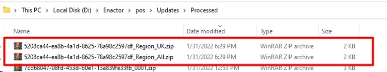
 
From the 2 zip files available, one contains just the Tender configurations for the UK Region while the other zip file has All Regions Tender configurations that are common to all the Regions in the Estate. 
Note: There will not be any configuration from the US region in either of these zip files. 
 
This demonstrates how Regional Broadcasting can be done by using the special entities that are available to select for broadcasting. This reduces the inefficiency caused by the transferring of large unnecessary configurations and ensures much efficient broadcasting, as only region-specific data is broadcasted.

:::note 
The Enactor Regional Broadcasting Functional Document contains more in-depth information on Regional Broadcasting.
:::

 
## Data Broadcaster
This is used to manually distribute specific data to selected devices in the Estate utilizing Predefined Broadcasts while also managing the timing selection of data distribution. The Data Broadcaster application broadcasts data based on the information specified in the selected Predefined Broadcast.

To create a new Data Broadcast, follow the steps below:

The Data Broadcast Maintenance application can be accessed through: 
Administration -> Data Management -> Broadcasts -> Data Broadcaster	
 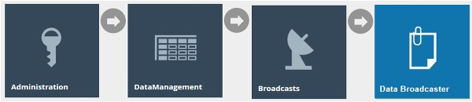

Alternatively, Data Broadcaster Maintenance can also be accessed through the Predefined Broadcast, by selecting the Broadcast icon of the corresponding predefined broadcast as shown below:

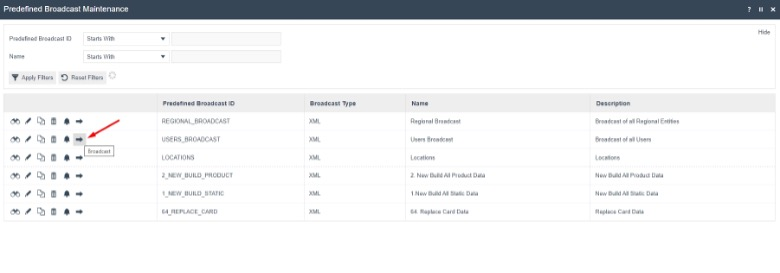

 Select and set the appropriate values for the fields for this Data Broadcast and click on the Submit button to initiate the broadcast according to the configuration specified on this page.
 
 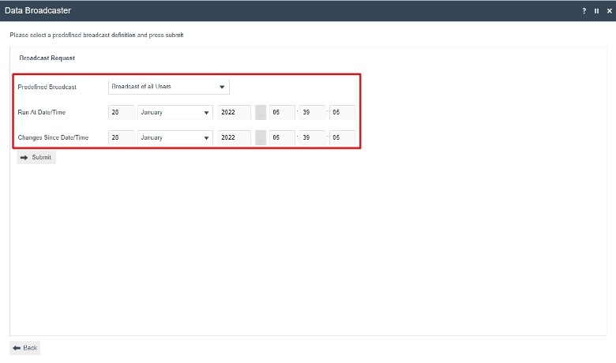
 
Set the appropriate values in the fields as follows:

| Configuration	| Description |
| ------ | ------ |
| Predefined Broadcast |	Select the desired predefined broadcast from a dropdown list of configured options. |
| Run At Date/Time |	Set a date and time at which broadcast is to be run. It defaults to the current date and time. A future date and time can be set here based on the requirement. |
| Changes Since Date/Time	| Set a date and time from when the changes of the entities in the predefined broadcast are to be included for broadcast. |
| Change Set	| Dropdown selection from a list of dates and times when database updates have occurred. The Submit button will initiate the broadcast according to the configuration specified on this page. |

If the predefined broadcast has been configured to “Delete Existing Data”, the user will only have the option to define the run at start date and time. A delete broadcast will always send the full entity file/s with a delete command to clear the entity table on the targeted device. 
 
If the predefined broadcast has been configured to “Force Selection of Change Set”, the user will only have the option to define the Change Set from the dropdown and will not be able to specify a run at start date and time.

When submit is selected, if the predefined broadcast has been configured to “Select Target on Broadcast”, then the broadcast target selection is shown.

Select the appropriate targets and select Submit to proceed.  

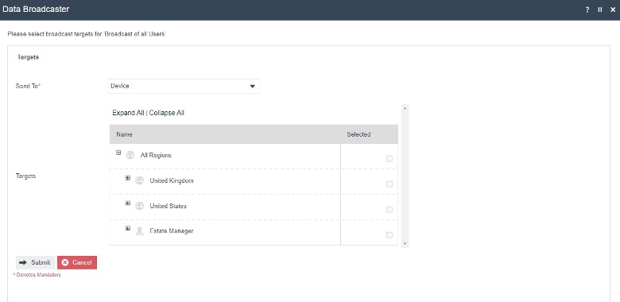

If the Broadcast is successfully submitted, a success message is displayed with an option to View.

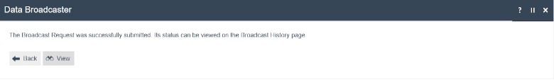
 
The View option navigates to the Broadcast History entry for the current Broadcast, which can also be accessed in the Broadcast History Maintenance. This is further describedin the “Broadcast Status” section of this guide.

### Scheduling a new Data Broadcast
Predefined broadcasts can be scheduled to run automatically at specific intervals according to a schedule by creating a diary entry. This can be done in the predefined broadcast maintenance by selecting the Schedule icon of the corresponding predefined broadcast as follows:

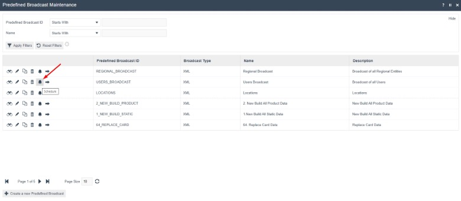
 
The Diary Maintenance for the newly created Scheduled Broadcast, is presented below. Diary Maintenance application can also be accessed by clicking on the Diary icon next to the Home icon in the top right corner of Estate Manager.

#### Diary – General Tab
The General tab specifies all the details required to define and schedule the diary entry for the scheduled broadcast.
Following is an example of the broadcast scheduled to run at the end of each day:
 
 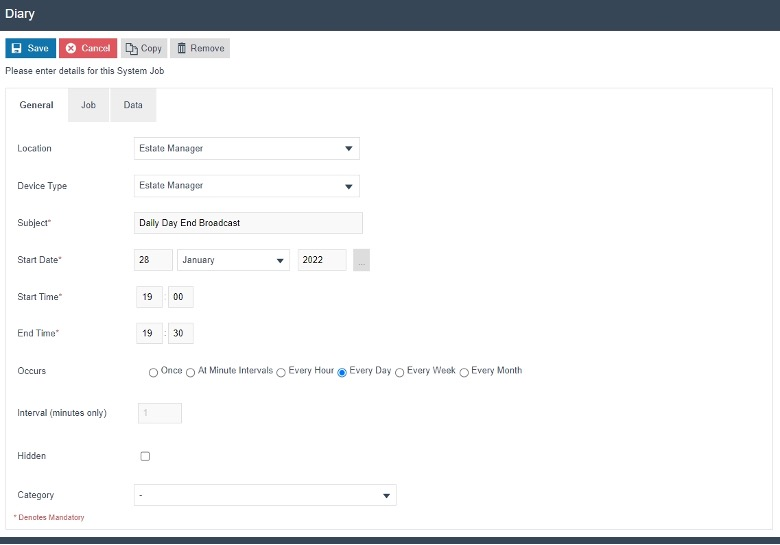
 
Set the appropriate values on the General tab as follows:

| Configuration	| Description |
| ------ | ------ |
| Location |	Select the desired Location from a dropdown list of all configured Locations. |
| Device Type |	Select the desired Device Type from a dropdown list of all configured devices. |
| Subject	| Enter a description that describes the scheduled job. E.g., User Broadcast Every 15 minutes |
| Start Date	| Set the starting day to run the job for the first time. |
| Start Time	| Set the starting time in the day for each scheduled instance of running the job. |
| End Time |	Set the ending time in the day for each scheduled instance of running the job. |
| Occurs	| Select the frequency of the job from a dropdown list of fixed occurrences:<ul><li>**Once** – Broadcasts the data only once at the start date and start time configured.</li><li>**Every Minute Intervals** – The broadcast will run every minute from the start time until the end time for that day.</li><li>**Every Hour** – The broadcast will run every hour from the start time until the end time for that day.</li><li>**Every Day** – Scheduled Job will run once a day commencing each day at the start time and stop at the end time.</li><li>**Every Week** – Will run every 7 days following the start time/date.</li><li>**Every Month** – Will run every month on the same date.</li></ul> |
| Interval (minutes only) |	Enter the minute value if “Every Minute Intervals” is selected in the Occurs field. |
| Hidden	| Checkbox, if checked it will hide this job in the listings of scheduled jobs unless explicitly requested. |
| Category |	Dropdown list selection of configured diary entry categories. |
 
#### Diary – Job Tab
The Job tab specifies the Process ID of the Job to be run. When scheduling predefined jobs such as broadcasts, this information is supplied from the context. This is already assigned in this tab since the predefined broadcast had been used to create this diary job.
 
 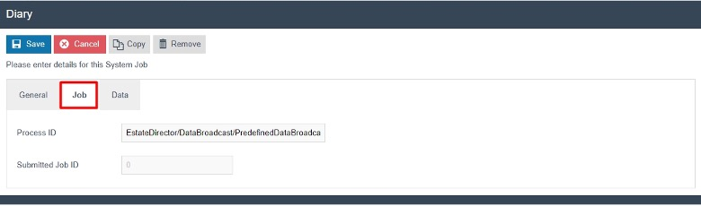
 
#### Diary – Data Tab
The Data tab specifies the input data supplied as parameters that are needed to execute this job. The parameters are as follows:

* Name of the parameter that is known to the Process and used by it to identify the input.
* Java Type specifies the nature of the parameter (in terms of Java Data Types).
* Value property receives the value intended for execution-specific input

These are already assigned in this tab since the predefined broadcast was used to create this diary job.
 
 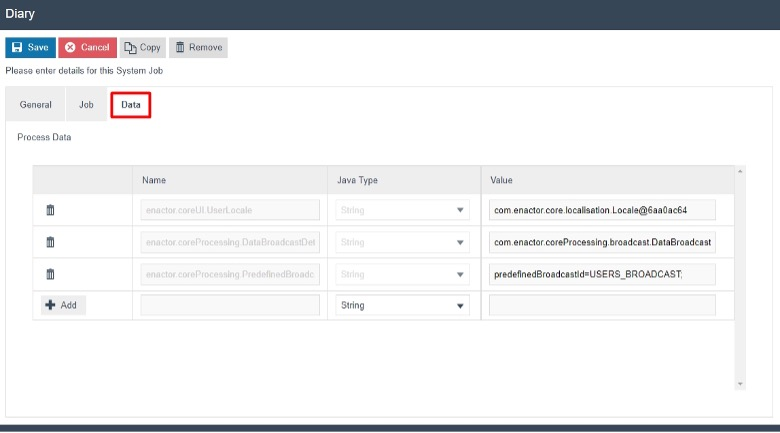
 
Select **Save** to commit the changes. The job will run automatically in the background as scheduled and the job can be monitored in the scheduled jobs application.

## Broadcast Status
Once the Broadcast is sent using the Data Broadcaster, the status of Broadcasts can be monitored in 2 ways:
 
1.	Using the Broadcast History Maintenance in Estate Manager. 
2.	Using the Updates Folder in the Local Machine and the Updates Table in the Local Database. 

Monitoring the status starts from the Broadcast History Maintenance in the Estate Manager. Once the status changes to “Sending to Recipients”, the local updates folder and the updates table in the local database can be monitored to check if the broadcast has been received successfully to the intended device. Then a message is sent back to the Estate Manager resulting in a change in status to “Successful”. This way the complete broadcast status can be monitored.

### Broadcast History Maintenance
The status of all the broadcasts that have been done are displayed in the Broadcast History Maintenance and filters can be used to select and view individual entries as desired.
 
 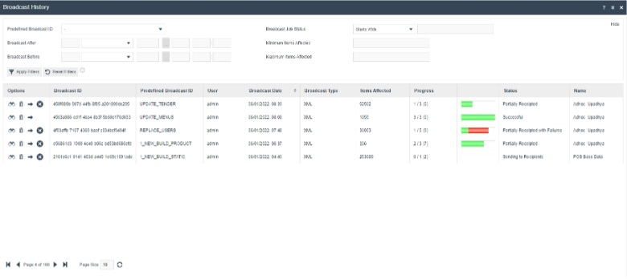
 
Select the view button against each broadcast to navigate to a Broadcast History View page of that broadcast to further examine the details of the broadcast. 

#### Broadcast History – General Tab
The General tab provides all the basic identification and status details of the Broadcast. All fields are Read‑Only at this point. 

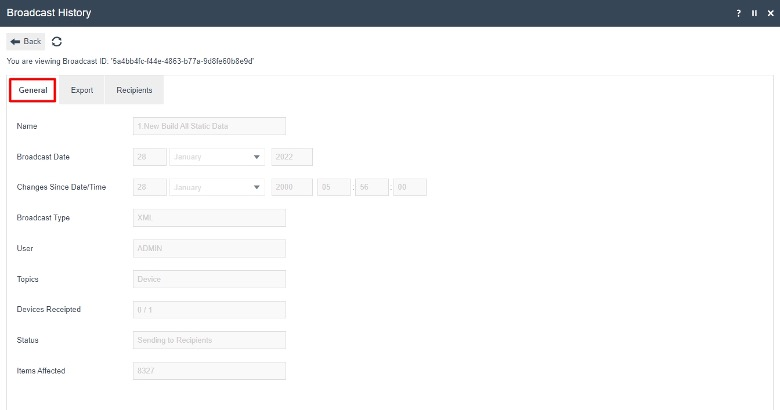

Following are the details of each field:

| Configuration	| Description |
| ------ | ------ |
| Name	| Alphanumeric; maximum 50 characters. A unique identifier given to the Predefined Broadcast and by which Users may recognise and select it in other User Interfaces. |
| Broadcast Date	| The date on which the Broadcast was submitted for processing. |
| Changes Since Date/Time	| The date/time that the changes from are selected for broadcast in the data broadcaster. |
| Broadcast Type	| The defined export type for broadcast as selected in the Predefined Broadcast. Built-in types are XML and CSV. |
| User |	The User ID of the User Account from which the Broadcast was submitted. |
| Topics	| Indicates the Target level to which the Broadcast was defined to distribute to. |
| Devices Receipted	| The number of Target Devices that have acknowledged the receipt of the broadcast as a ratio of all devices targeted. |
| Status	| If completed the Status will indicate as either Successful or Failed. Intermediate stages of processing such as Exporting may be indicated. |
| Items Affected	| This figure normally indicates the total number of instances of all entities distributed in the Broadcast. However, in some circumstances the broadcast may involve replay of the Activity Log (resending updates) and may be inflated. |

#### Broadcast History – Export Tab
The **Export** tab indicates the status of preparation of the download data package to be made available for distribution to selected Target devices. There are two phases of processing in this process of preparation; Exporting and Collating, each with a progress status bar shown the Overall Status region at the top of the page.

##### Broadcast History – Export Tab – Exporting Sub-tab
The Export phase, which is shown in the Exporting Sub Tab, initiates a process to extract data for each Entity selected for export. These processes export the data from the Estate Manager database in the format requested; each has a progress bar, which indicates in Yellow if data export is in progress or Green if data Export has completed, otherwise remains Grey, if there is no data.
 
 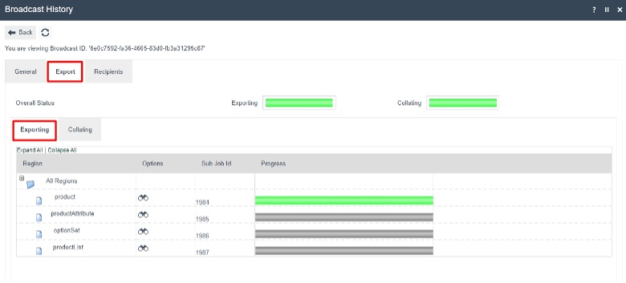
 
##### Broadcast History – Export Tab – Collating Sub-tab
The Collating phase processes the exported data files into a download package, usually one file for all distribution Targets, and the progress bar indicates in yellow as files are being added and green when completed. Multiple files, and progress bars may be present subject to the distribution configuration. The progress bar shown for Overall Status of collating is a summation of the status of individual Broadcast Files.
 
 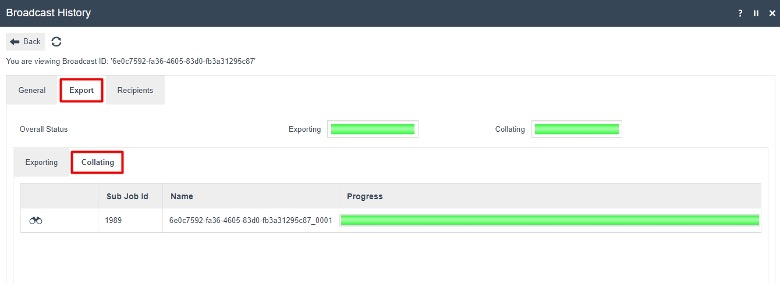
 
#### Broadcast History – Recipients Tab
The recipients tab, list the recipients the broadcast is being sent to. Following are the status indicators for each device:

*  : A device with a dash against is not subscribed to the estate manager, however the device is setup in the estate manager.  
* : An empty box against a device means that this device is included within the broadcast but has not acknowledged the broadcast. Check that the device is running and on the network. 
* : The device has successfully received and loaded the broadcast.
* : The device has received the broadcast but has failed to successfully load it.

 
### Local Broadcast Status
When the Status of the broadcast in the Broadcast History Maintenance changes to “Sending to Recipients”, the status should be checked locally to see if the broadcast files for the device have been received. The status can be checked in both the Local Updates folder as well as the Updates folder of the local database.

#### Local Updates Folder
Broadcasts will be received as updates in the form of XML files compressed within a zip file. These are downloaded by the devices and exist in the enactor home directory of the targeted device. The user can check if the broadcast has been received by viewing the C:\[ENACTOR_HOME]\pos\Updates directory.   

 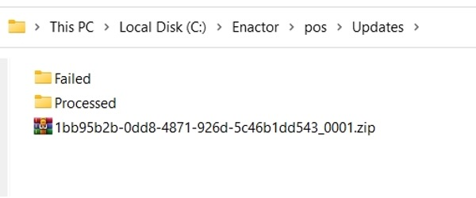
 
The file would first sit in this directory while being processed and then if the broadcast/application update has been received and processed, the file will move into the processed folder and a failure will move the file to the failed directory. If failures should occur check the common.log for more information in C:\[ENACTOR_HOME]\pos\logs

#### Database Updates Table
The user can also check the updates table for the current status of the broadcast. This will need to be checked in the database of the device receiving the broadcast. This should only be done when investigating problems with updates not being received.  

 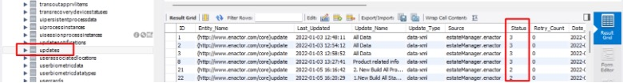
 
Database Updates table current statuses are shown in integer values from 1 to 7 and following are what they depict:

1.  STATUS_PENDING: Broadcast is pending, and download has not begun.
2.  STATUS_PROCESSED: Processed successfully.
3.  STATUS_FAILED: Failed requires further investigation.
4.  STATUS_RETRY: Attempting to process the update again.
5.  STATUS_SCHEDULED: Scheduled download not to be processed until late date/time.
6.  STATUS_DOWNLOADED: downloaded but not processed.
7.  STATUS_RETRY_DOWNLOADED: Attempting to download the update again.

## Troubleshooting Broadcast Issues
Broadcast Issues can occur due to many reasons, and this is first shown to the User in the Broadcast History Maintenance, where the status column shows a Failed message. This section covers how to troubleshoot such broadcast issues and fix them to successfully send broadcasts with a status of Success.

### Scheduled Jobs
Most broadcasts, when failed, can be monitored in the Scheduled Jobs Maintenance.
When the broadcast fails in the Broadcast History, make a note of the date and time that the Broadcast has failed. 

 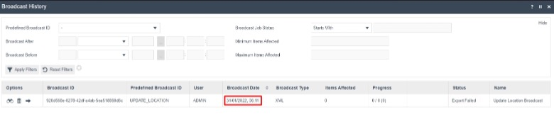
 
The Scheduled Job Maintenance application can be accessed through:  
 Administration -> Processing -> Scheduled Jobs  
 
  
  
Change the filter of Status to **Failed** and then click on the **( ! )** icon of the row with the time and date that matches close to the failed broadcast as follows:

 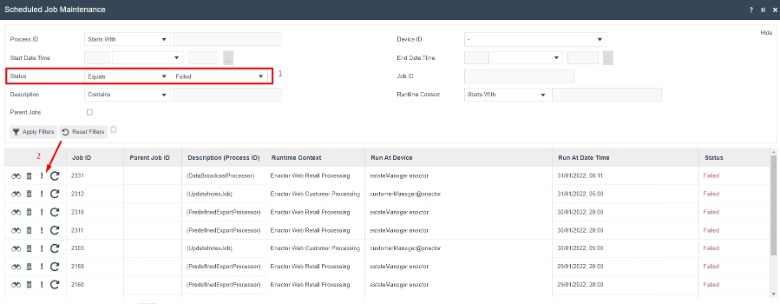
 
 This will open the Application Process Log, where the failed transaction processing job will be shown. The message indicates the reason for the selected job to fail and as shown on the below example the message “No matching regions found for export criteria.” is shown as the reason. 

  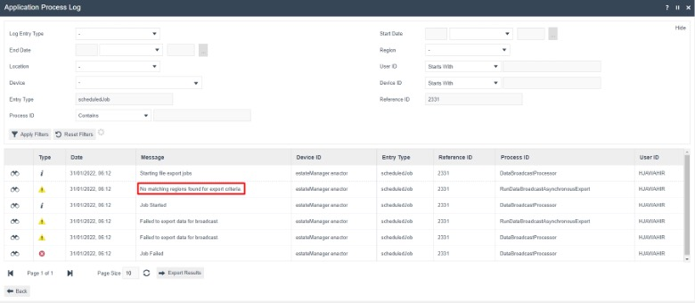
  
Make sure to navigate to the Location Maintenance and monitor that the location exists and ”Is Live”. Hence, once this issue is fixed in the location, the broadcast can be sent to this location successfully.

### Locks 
There can be instances when the broadcast does not successfully get sent because the entity that the user is trying to broadcast to is locked by the Estate Manager and cannot be accessed for broadcasting. Typically locks older than a threshold of 24 hours are ignored. However, a manual facility is also available to monitor and maintain these locks. The User may wish to examine the status of Persistent locks and may do so by using the Persistent Lock Maintenance page.

The Scheduled Job Maintenance application can be accessed through:  
 Administration -> Processing -> Scheduled Jobs
 
 
 
 The list of locked entities is currently displayed here. If the entity that the user is trying to broadcast is also available in this list, click on the Delete icon of that entity row and release the lock as shown below:
 
  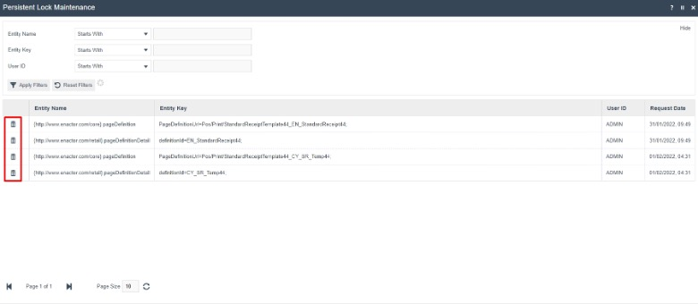
  
After releasing the lock, the broadcast of that entity can be completed successfully.

 
