# Regional and Location Data Relationships to Broadcasting

## Introduction

The purpose of this guide is to provide a foundational understanding of how to configure regional and locational entities and configure broadcasts for them. This will ultimately result in the distribution of data specific only to that region or location. 
 
Some entities have region or location-based configurations such as product, menu, roles and tender. These entities would have been configured only for a particular region or location. However, when the usual broadcasts are done, the entities that are not part of that region or location are also broadcasted, which in turn broadcasts a large amount of unnecessary data to that device.

An example scenario is described below: 
Consider a parent Region configured as All Region, with UK and US as its' Child Regions. Tenders are configured separately in the Tender Maintenace for the UK and US regions. The requirement is to set up a new device in the UK region and have the Tenders that are configured only for the UK region to be broadcasted to that device. However, this cannot be done by broadcasting the Tender entity to the new device in the UK region, as this will also result in broadcasting all the US tender configurations, that are unnecessary data for the device in the UK region.

Hence, for this purpose, there is an entity called **“Tender by Region”** which makes sure that the entities are distributed only to the particular regions. This entity can be accessed via the Predefined Broadcast Maintenance Details tab. There are many such entities for both Region and Location, and these are listed and shown in the “Predefined Broadcast Configuration” section. This way broadcasts can be sent to All Regions or Stores in the estate, but will only impact the respective regions or locations to which the entities have been configured. This allows distributing data throughout the estate in a more efficient manner.

There are two aspects in configuration for Regional Broadcasting: 

1.	Configuring the necessary Regional/Locational entities appropriately. 
2.	Configuring the predefined broadcast to send the regional broadcasts successfully. 
 
Note: Not all entities support Regional Broadcasting, and only the “Regional Entity Configuration” and “Locational Entity Configuration” sections cover the entities that support Regional Broadcasting. 
 
Following are the **Regional Entities** and where they can be configured, to successfully Broadcast by Region using the Predefined Broadcast:

| Regional Entity| 	Configuration |
| ------ | ------ |
| Location by Region |	Location Maintenance |
| Menu by Region	| Group Maintenance > Menu Group |
| Option Set by Region |	Attribute / Option Set Maintenance |
| Product by Region |	Product Maintenance > General Tab > Product Sale Region Tab |
| Product Attribute by Region |	Attribute / Option Set Config Maintenance |
| Product Price by Region |	Group Maintenance > Product Price Group |
| Product Product Group by Region |	Product Maintenance > General Tab > Product Group Tab |
| Promotion by Region |	Promotion Maintenance |
| Reason by Region |	Reason Maintenance |
| Regional Product by Region |	Regional Product Maintenance |
| Role by Region	| User Role Maintenance |
| Selling Code by Region |	Product Maintenance > General Tab > Selling Codes Tab |
| Tender by Region |	Tender Maintenance |

Following are the Locational Entities and where they can be configured to successfully Broadcast by Location using the Predefined Broadcast:

| Locational Entity	| Configuration |
| ------ | ------ |
| Product Price by Location	| Product Price Maintenance |
| User by Location	| User Maintenance |

## Overview
This guide will cover the configuration for the following:

* **Regional Entity Configuration** – Allows configuring regional entities for regional broadcasting.
* **Locational Entity Configuration** – Allows configuring locational entities for locational broadcasting.
* **Data Distribution for Regional Broadcasting** – Provides understanding of how regional and locational data is handled during broadcasting.

## Regional Entity Configuration
This section describes the regional entities that can be configured and their functinality ensuring that Broadcast by Region is successfully executed.

As the initial step, set up regions against the organisation. Group Hierarchy Maintenance application is used to set up regions. 

The Group Hierarchy maintenance application can be accessed through: 
Configuration -> Organisation -> Groups

 

Set the filter of the **Group Type** to **Region** and click on the **Edit** icon set against **All Regions** field as shown below:
 
  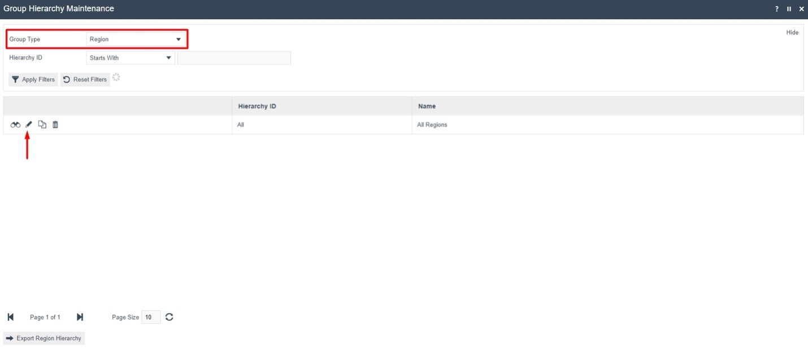
  
This will allow adding, editing and removing regions to manage regions as required.
 
  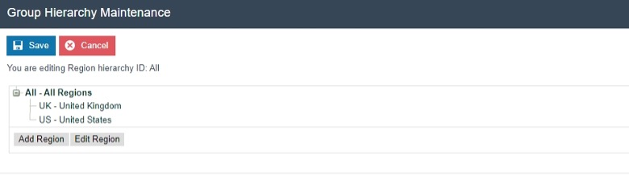
  
Once this is done, most of the Regional Entities can be configured as per the regional hierarchy defined above.

Following are the **Regional Entities** and where they can be configured:

| Regional Entity	| Configuration |
| ------ | ------ |
| Location by Region |	Location Maintenance > General Tab > General Tab |
| Menu by Region | Group Maintenance > Menu Group |
| Option Set by Region |	Attribute / Option Set Maintenance |
| Product by Region	| Product Maintenance > General Tab > Product Sale Region Tab |
| Product Attribute by Region	| Attribute / Option Set Config Maintenance |
| Product Price by Region	| Group Maintenance > Product Price Group |
| Product Product Group by Region	 | Product Maintenance > General Tab > Product Group Tab |
| Promotion by Region	| Promotion Maintenance |
| Reason by Region	| Reason Maintenance |
| Regional Product by Region |	Regional Product Maintenance |
| Role by Region	| User Role Maintenance |
| Selling Code by Region	| Product Maintenance > General Tab > Selling Codes Tab |
| Tender by Region |	Tender Maintenance |

### Location By Region
Regional Broadcasting for the Location will be done based on how the Region is set in the Location entity. When configuring a location, the region can be specified for each of the locations in the General Sub-Tab. If no region is set against the location, the Location by Region entity will not broadcast as required.

#### Configuration
The location maintenance application can be accessed through: 
Configuration -> Organisation -> Locations

  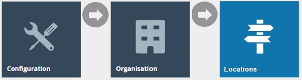

**Edit** the desired **Location** and make sure that the appropriate **Region** is selected in the **Region** field as shown below:
 
  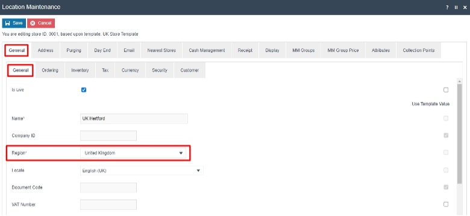
  
:::note
If the region is set by the Location template, make sure to navigate to the Location Template Maintenance and make the changes to the Region field for the appropriate Location Template.
:::

#### XML
Following is the XML of the above UK Hertford Store Location Entity:

 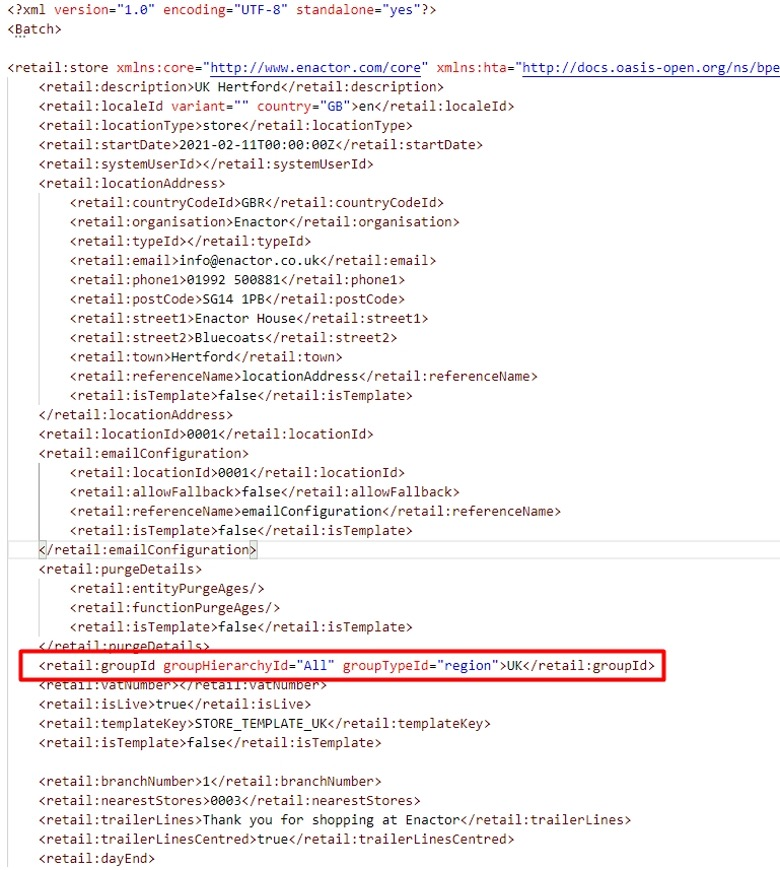
 
It is the **groupId** property which defines the region in this Location entity.

### Menu by Region
When configuring a menu for regional broadcasting, it is the menu group that specifies the region to which the menu belongs. There are two configuration steps to set up menus for specific regions:

1.	A menu group should first be configured for the region as required.
2.	A menu should be configured for that configured menu group that has a configured region to it. 

This way, the Menu by Region entity can be used to successfully broadcast the menus that are specific to the corresponding regions.

#### Configuration
First create the Menu Group to specify a region to it. Group Hierarchy Maintenance application is used to set up menu groups. 

The Group Hierarchy maintenance application can be accessed through: 
Configuration -> Organisation -> Groups

   

Set the filter of the **Group Type** to **Menu Group** and then click on **Create New Menu Group Hierarchy** as shown below:
 
   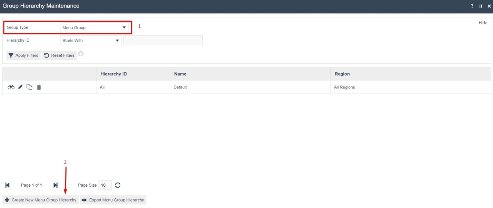
   
Enter a unique **Hierarchy ID** for the Menu Group Hierarchy. The ID can be alphanumeric and contain a maximum of 20 characters.

Select the desired Region for the Menu Group from the **Region** drop-down.

:::note
The Region dropdown consists of the Regions that are already configured in the Group Hierarchy Maintenance.
::: 
 
   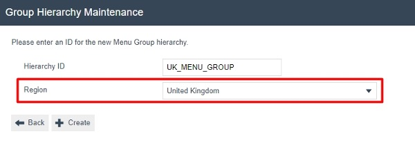

The above example shows how a Menu Group has been created for the United Kingdom Region.

Once the Menu Group has been created, a Menu can be created for this particular Menu Group.

The Menu maintenance application can be accessed through: 
Configuration -> System -> Menus

   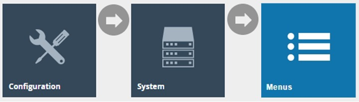

To create a new menu, select **Create New Menu** on the Menu Maintenance page.  

  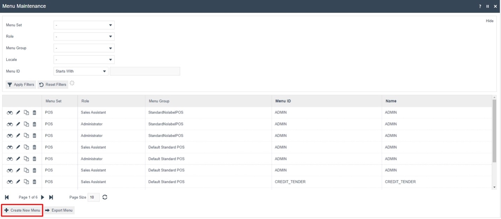
  
Make sure to set the Menu Group from the dropdown appropriately.

:::note
The Menu Group dropdown consists of the Menu Groups that are already configured in the Group Hierarchy Maintenance.
:::

Following is an example of a new Sale menu created for the above configured Menu Group:
 
   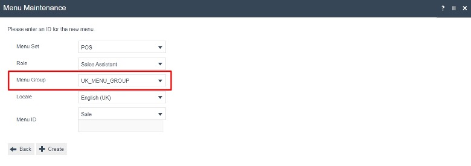
   
This way menus can be configured enabling the use of the Menu by Region entity, to successfully broadcast the menus that are specific to the corresponding regions.

#### XML
The **XML** of the above UK_MENU_GROUP Menu Group Entity is shown below:

  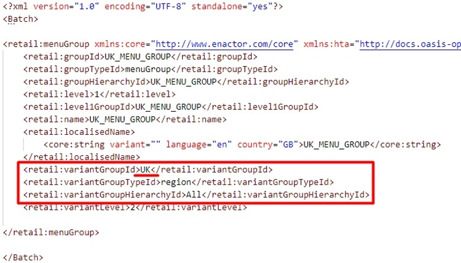

 It is the **variantGroupId** property which defines the region in this Menu Group entity.

The **XML** of the above Sale Menu Entity is shown below:

  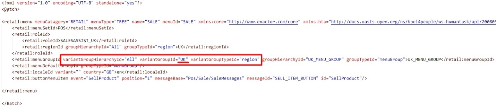
  
 It is the **variantGroupId** property (derived from the menu group entity) which defines the region in this Menu entity.

### Option Set by Region
Regional Broadcasting for an Option Set is done based on how the Region is set in the Option Set entity. When configuring an option set, the region can be specified for each of the option sets at the time of creating it. This way, the Option Set by Region entity can be used to successfully broadcast the option sets that are specific to the corresponding regions.

#### Configuration
First create the Option Set to specify a region to it. Attribute / Option Set Maintenance application is used to set up Option Sets.

The Attribute / Option Set maintenance application can be accessed through: 
Configuration -> Merchandise -> Attribute / Option Sets

   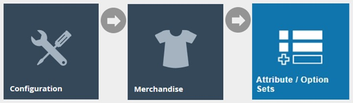

Set the filter of the **Type** to **Product Options** and click on **Create a New Option Set** as shown below:
 
   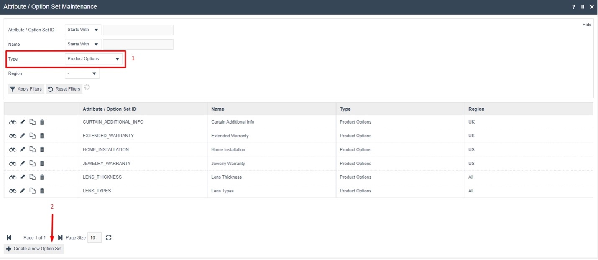
   
Enter a unique **Attribute / Option Set ID** for the Option Set. The ID can be alphanumeric and contain a maximum of 20 characters. 
 
Select the desired Region for the Option Set from the **Region** drop-down.

:::note
The Region dropdown consists of the Regions that are already configured in the Group Hierarchy Maintenance.
 :::

  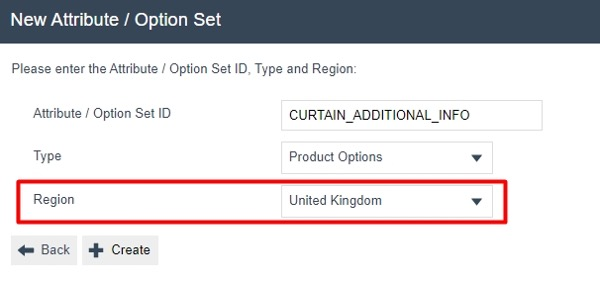
  
The above example shows how an Option Set has been created for the United Kingdom Region. This way Option Sets can be configured enabling the use of the Option Set by Region entity, to successfully broadcast the option sets specific to the corresponding regions.

#### XML
The **XML** of the above CURTAIN_ADDITIONAL_INFO Option Set Entity is shown below:

  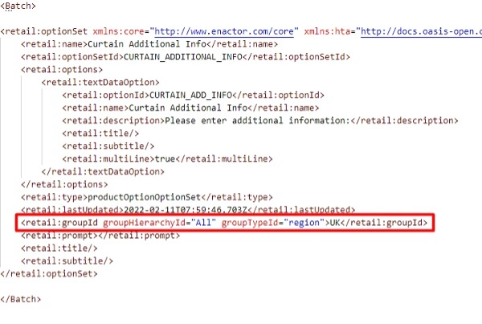
 
It is the **groupId** property which defines the region in this Option Set entity.

### Product by Region
Regional Broadcasting for a Product will be done based on how the Region is set in the Product entity. When configuring a Product, the Sale Region can be specified for each of the products in the Product Sale Region Tab of Product Maintenance. This way, the Product by Region entity can be used to successfully broadcast the products specific to the configured regions.

#### Configuration
First configure the Product to specify a region to it. Product Maintenance application is used to configure products.

The Product maintenance application can be accessed through: 
Configuration -> Merchandise -> Products

   

Click on the edit icon of any product that the region needs to be specified, as shown below:
 
 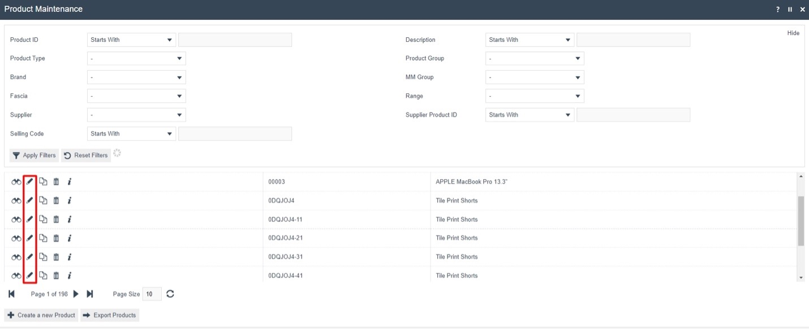
   
Navigate to the **General > Product** Sale Region Tab.

Select the desired region from the **Sale Regions** dropdown list and select **Add**. 

:::note
The Sale Regions dropdown consists of the Regions that are already configured in the Group Hierarchy Maintenance.
:::
 
   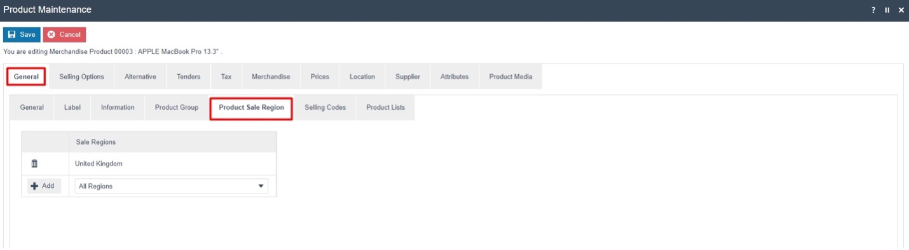
   
The above example shows how a Product has been created for the United Kingdom Region. This way Products can be configured enabling the use of the Product by Region entity, to succeesfully broadcast the products specific to the corresponding regions.

:::note
There is also an entity called **Product Sale by Region** which can also be configured the same way that Product by Region was configured above.
:::

#### XML
The XML of the above Product Sale Region Entity which was configured in the Product Maintenance is shown below:

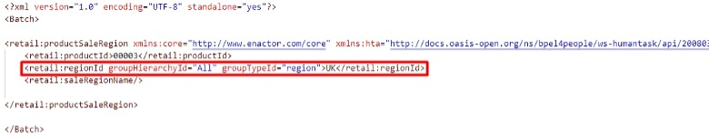

 It is the **regionId** property which defines the region in this Product Sale Region entity.

:::note
A Product has a large amount of data and the XML that shows the Product Sale Region of the Product exists in the entity called Product Sale Region and not in the Product entity itself.
:::

### Product Attribute by Region
When configuring a product attribute for regional broadcasting, it is the product attribute that specifies the region for which the product belongs to. There are two configuration steps to set up product attributes for specific regions: 

1.	A price attribute should first be configured for the region as required. 
2.	A product should be configured for that configured price attribute which should have a configured region to it. 
 
This way, the Product Attribute by Region entity can be used to successfully broadcast the product attributes specific to the corresponding regions.

#### Configuration
First create the Product Attribute to specify a region to it. Attribute / Option Set Maintenance application is used to create product attributes. 

The Attribute / Option Set maintenance application can be accessed through: 
Configuration -> Merchandise -> Attribute / Option Sets

 

Set the filter of the **Type** to **Product Attributes** and click on **Create a New Option Set** as shown below:
 
 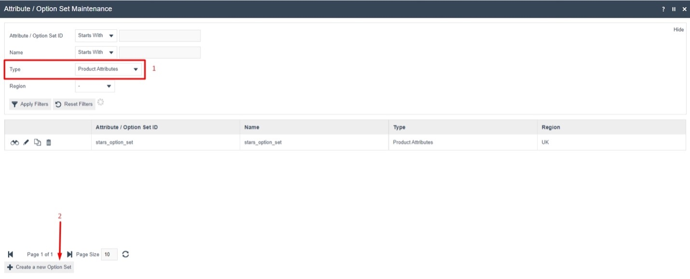
 
Enter a unique **Attribute / Option Set ID** for the Product Attribute. The ID can be alphanumeric and contain a maximum of 20 characters. 
 
Select the desired Region for the Product Attribute from the **Region** drop-down.

:::note
The Region dropdown consists of the Regions that are already configured in the Group Hierarchy Maintenance.
::: 

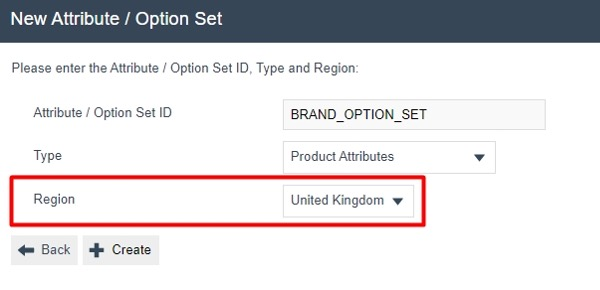

Once the Product Attribute has been created, a Product can be configured for this particular Product Attribute.
 

The Product maintenance application can be accessed through: 
Configuration -> Merchandise -> Products

 

Click on the edit icon of any product that the product attribute needs to be specified, as shown below:
 
 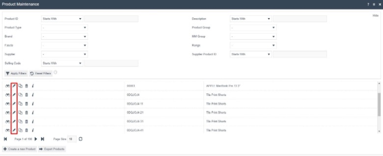
 
Navigate to the **Attributes > Global Attributes** Tab and enter a value for your product attribute as shown below:
 
 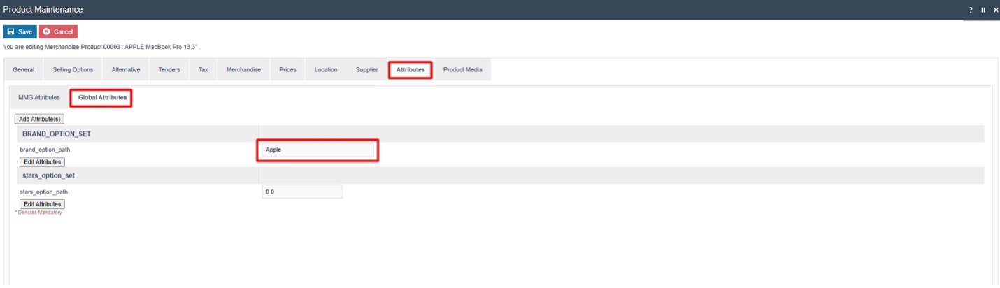
 
The above example shows how a Product Attribute has been configured for the United Kingdom Region. This way Product Attributes can be configured enabling the use of the Product Attribute by Region entity, to successfully broadcast the Product Attributes specific to the corresponding regions.

#### XML
The **XML** of the above BRAND_OPTION_SET Option Set Entity which is the Product Attribute is shown below:

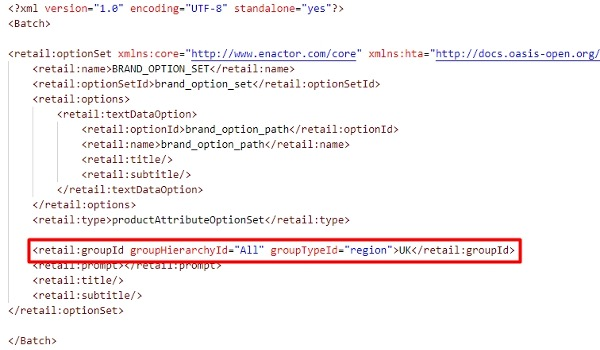 

It is the **groupId** property which defines the region in this Option Set entity.

The **XML** of the above Product Attribute Entity is shown below:

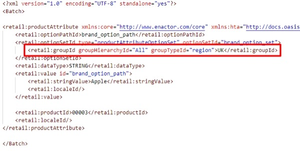 

It is the **groupId** property which defines the region in this Product Attribute entity.

:::note
Product has a large amount of data and the XML that shows the Product Attributes of the Product exists in the entity called Product Attribute and not in the Product entity itself.
:::

### Product Price by Region
When configuring a product price for regional broadcasting, it is the price group that specifies the region for which the product price belongs to. There are two configuration steps to set up product prices for specific regions:

1.	A price group should first be configured for the region as required.
2.	A product should be configured for that configured price group which has a configured region to it.

This way, the Product Price by Region entity can be used to successfully broadcast the product prices specific to the corresponding regions.

#### Configuration
First the Price Group should be created to specify a region to it. Group Hierarchy Maintenance application is used to set up price groups. 

The Group Hierarchy maintenance application can be accessed through: 
Configuration -> Organisation -> Groups

 

Set the filter of the **Group Type** to Price Group and click on **Create New Price Group Hierarchy** as shown below:
 
 
 
Enter a unique **Hierarchy ID** for the Price Group Hierarchy. The ID can be alphanumeric and contain a maximum of 20 characters.

Select the desired Region for the Price Group from the **Region** drop-down.

:::note
The Region dropdown consists of the Regions that are already configured in the Group Hierarchy Maintenance.
::: 

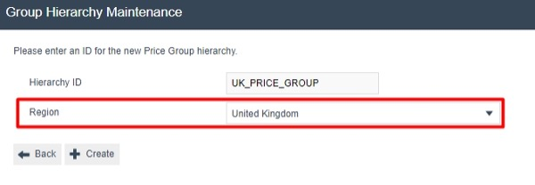

The above example shows how a Price Group has been created for the United Kingdom Region.

Once the Price Group has been created, a Product can be configured for this particular Price Group.

The Product maintenance application can be accessed through: 
Configuration -> Merchandise -> Products

 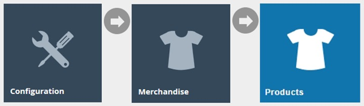

Click on the edit icon of any product that the price group needs to be specified, as shown below:
 
 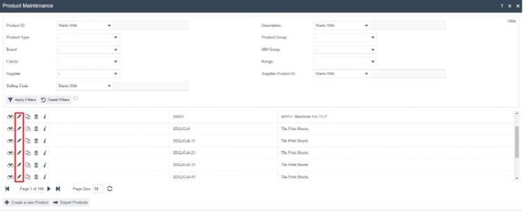

Navigate to the Prices Tab and click on the Add button as shown below:
 
 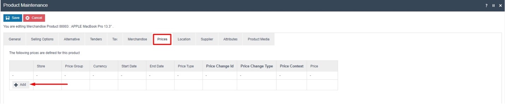
 
Select the appropriate Price Group from the Price Group dropdown as per the required region.

:::note
The Price Group dropdown consists of the Price Groups that are already configured in the Group Hierarchy Maintenance.
:::
 
 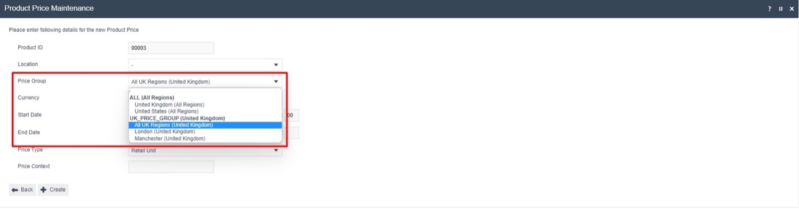

This way Product Prices can be configured enabling the use of the Product Price by Region entity, to successfully broadcast the Product Prices specific to the corresponding regions.

#### XML
The **XML** of the above UK_PRICE_GROUP Price Group Entity is shown below:

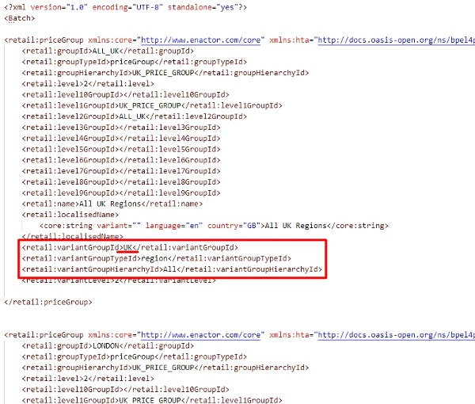
 
It is the **variantGroupId** property which defines the region in this Price Group entity.

The **XML** of the above Product Price Entity which was configured in the Product Maintenance is shown below:

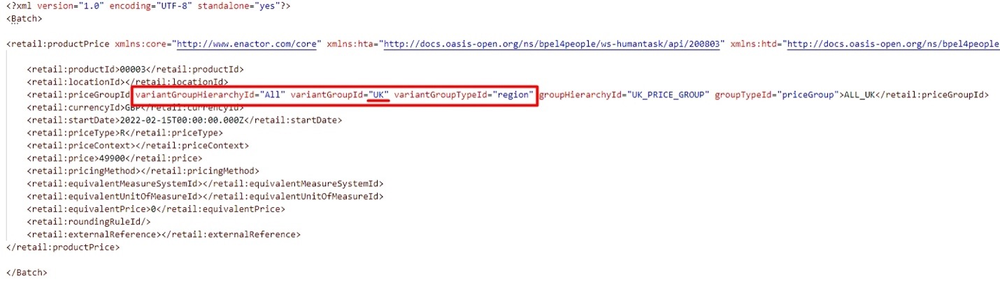

It is the **variantGroupId** property (derived from the price group entity) which defines the region in this Menu entity.

:::note
Product has a large amount of data and the XML that shows the Product Price exists in the entity called Product Price and not in the Product entity itself.
:::

### Product Group by Region
When configuring a product group for regional broadcasting, it is the product group that specifies the region for which the product belongs to. There are two configuration steps to set up product prices for specific regions:

1.	A product group should first be configured for the region as required.
2.	A product should be configured for that configured product group, which has a configured region to it.

This way, the Product Group by Region entity can be used to successfully broadcast the product groups specific to the corresponding regions.

#### Configuration
First the Product Group should be created to specify a region to it. Group Hierarchy Maintenance application is used to set up product groups.  
 
The Group Hierarchy maintenance application can be accessed through:  
Configuration -> Organisation -> Groups

 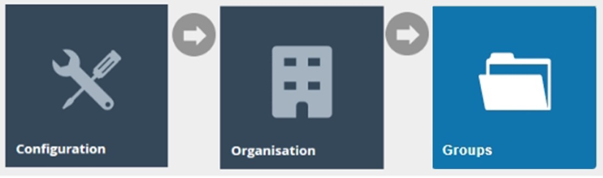

Set the filter of the **Group Type** to **Product Group** and click on **Create New Product Group Hierarchy** as shown below:
 
 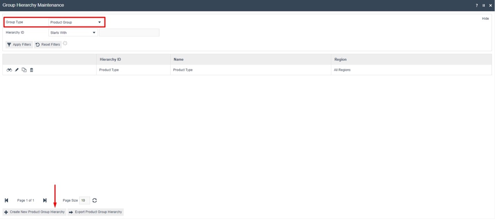
 
Enter a unique **Hierarchy ID** for the Product Group Hierarchy. The ID can be alphanumeric and contain a maximum of 20 characters. 
 
Select the desired Region for the Product Group from the **Region** drop-down.

:::note
The Region dropdown consists of the Regions that are already configured in the Group Hierarchy Maintenance.
::: 

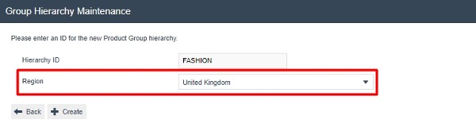

The above example shows how a Product Group has been created for the United Kingdom Region.

Once the Product Group has been created, a Product can be configured for this particular Price Product Group.

The Product maintenance application can be accessed through:  
Configuration -> Merchandise -> Products

 

Click on the edit icon of any product that the product group needs to be specified, as shown below:
 
 
 
Navigate to **General > Product Group** Tab.

Select the appropriate Product Group from the **Product Group** dropdown as per the required region and click on **Add**.

:::note
The Product Group dropdown consists of the Product Groups that are already configured in the Group Hierarchy Maintenance.
:::
 
 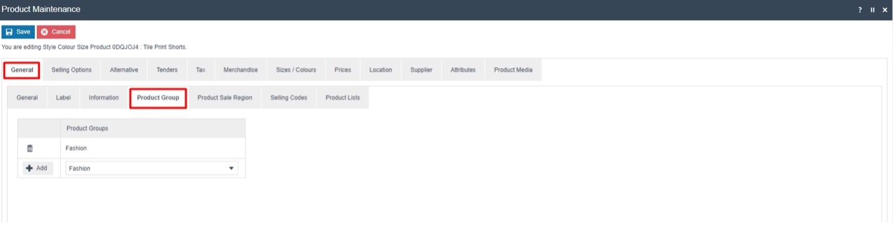
 
This way Product Groups can be configured enabling the use of the Product Group by Region entity, to successfully broadcast the Product Groups specific to the corresponding regions.

#### XML
The **XML** of the above FASHION Product Group Entity is shown below:

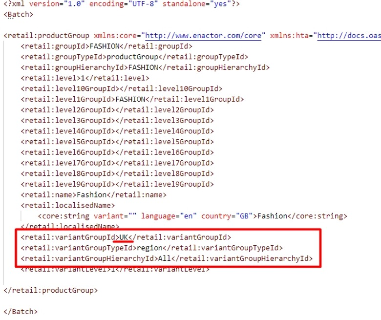

 It is the **variantGroupId** property which defines the region in this Product Group entity.

The **XML** of the above Product Group Entity which was configured in the Product Maintenance is shown below:

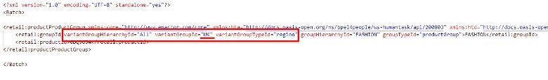

 It is the **variantGroupId** property (derived from the product group entity) which defines the region in this Product entity.

:::note
Product has a large amount of data and the XML that shows the Product Group of the Product exists in the entity called Product Group and not in the Product entity itself.
:::

### Promotion by Region
Regional Broadcasting for a Promotion is done based on how the Region is set in the Promotion entity. When configuring a promotion, the region can be specified for each of the promotions at the time of creating it. This way, the Promotion by Region entity can be used to successfully broadcast the promotions specific to the corresponding regions.

#### Configuration
First the Promotion should be created to specify a region to it. Promotion Maintenance application is used to set up promotions.  

The Promotion maintenance application can be accessed through:  
Configuration -> Merchandise -> Promotions

 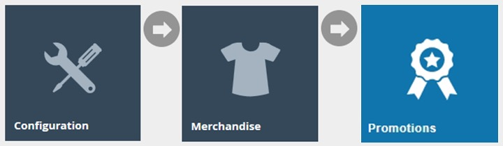

To create a new promotion, select **Create New Promotion** on the Promotion Maintenance page as shown below:
 
 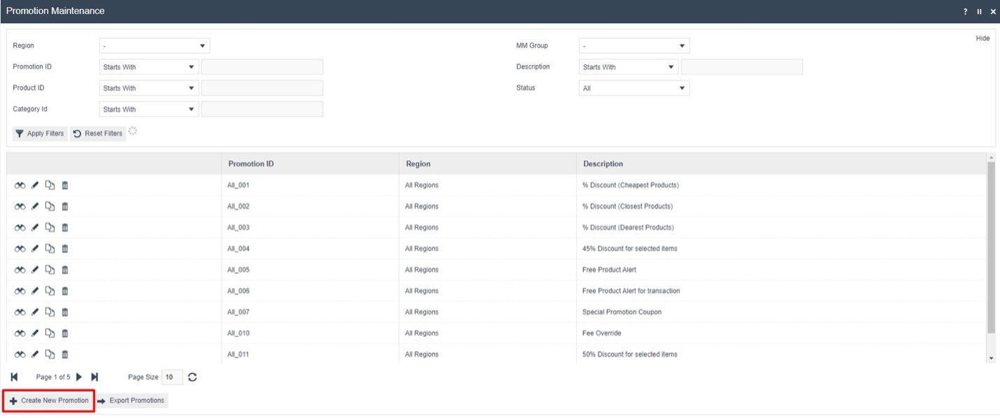
 
Select the desired Region for the **Promotion** from the **Region** drop-down.

Enter a unique **Promotion ID** for the promotion. The ID can be alphanumeric and contain a maximum of 20 characters.

:::note
The Region dropdown consists of the Regions already configured in the Group Hierarchy Maintenance.
::: 

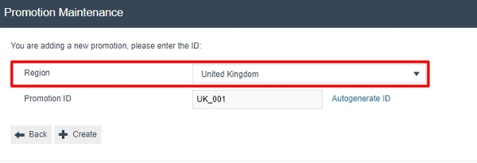

The above example shows how a Promotion has been created for the United Kingdom Region. This way Promotions can be configured enabling the use of the Promotion by Region entity, to successfully broadcast the promotions specific to the corresponding regions.

#### XML
The **XML** of the above UK_001 Promotion Entity is shown below:

 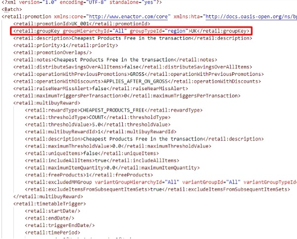
 
It is the **groupKey** property which defines the region in this Promotion entity.

### Reason by Region
Regional Broadcasting for a Reason will be done based on how the Region is set in the Reason entity. When configuring a reason, the region can be specified for each of the reasons at the time of creating it. This way, the Reason by Region entity can be used to successfully broadcast the reasons specific to the corresponding regions.

#### Configuration
First the Reason should be created to specify a region to it. Reason Maintenance application is used to set up Reasons.  
 
The Group Reason Maintenance application can be accessed through:  
Configuration -> Organisation -> Reasons

 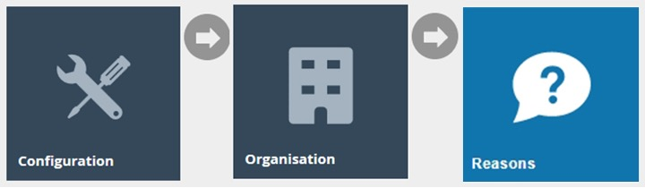

To create a new reason promotion, select **Create New Reason** on the Reason Maintenance page as shown below:
 
 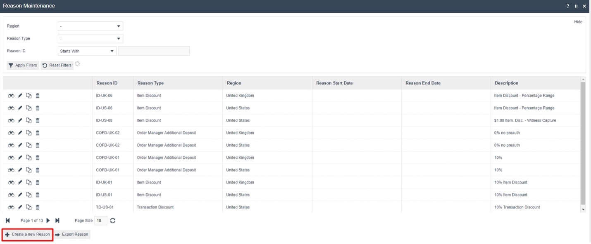
 
Select the desired Region for the **Reason** from the **Region** drop-down.

Select the desired Reason Type from the **Reason Type** drop-down.

Enter a unique **Reason ID** for the reason. The ID can be alphanumeric and contain a maximum of 20 characters.

:::note
The Region dropdown consists of the Regions that are already configured in the Group Hierarchy Maintenance.
::: 

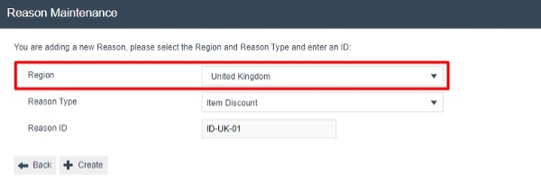

The above example shows how a Reason has been created for the United Kingdom Region. This way Reasons can be configured enabling the use of the Reason by Region entity, to successfully broadcast the reasons specific to the corresponding regions.

#### XML
The **XML** of the above ID-UK-01 Reason Entity is shown below:

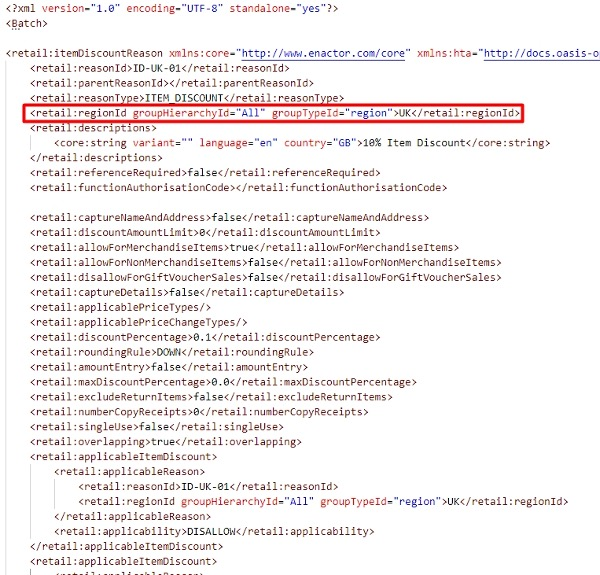
 
It is the **regionId** property which defines the region in this Reason entity.

### Regional Product by Region
Regional Broadcasting for a Regional Product will be done based on how the Region is set in the Regional Product entity. When configuring a regional product, the region can be specified for each of the regional products at the time of creating it. This way, the Regional Product by Region entity can be used to successfully broadcast the regional products specific to the corresponding regions.

#### Configuration
First the Regional Product should be created to specify a region to it. Regional Product Maintenance application is used to set up Regional Products.  
 
The Regional Product maintenance application can be accessed through:  
Configuration -> Merchandise -> Regional Products

 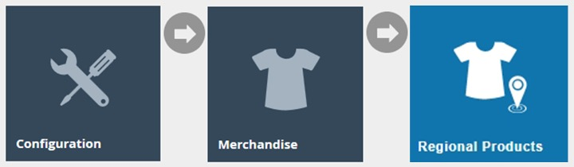

To create a new product, select **Create a new Product** on the Regional Product maintenance page as shown below:
  
  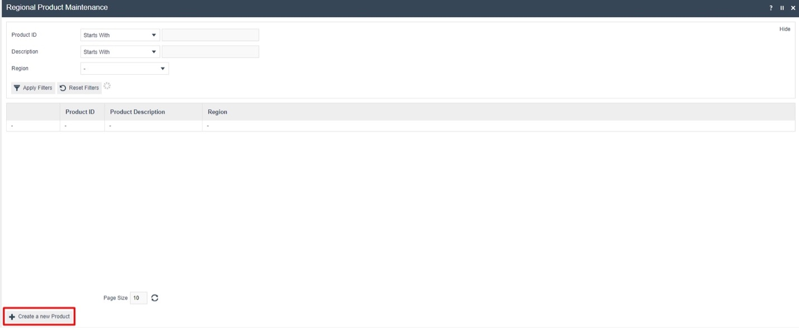
  
Select the desired Region for the Regional Product from the **Region** drop-down.

Enter a unique **Product ID** for the Regional Product. The ID can be alphanumeric and contain a maximum of 20 characters.

:::note
The Region dropdown consists of the Regions that are already configured in the Group Hierarchy Maintenance.
::: 

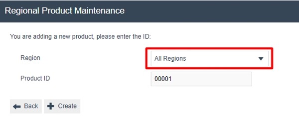

The above example shows how a Regional Product has been created for the United Kingdom Region. This way Regional Products can be configured enabling the use of the Regional Product by Region entity, to successfully broadcast the regional products specific to the corresponding regions.

#### XML
The **XML** of the above 0001 Regional Product Entity is shown below:

 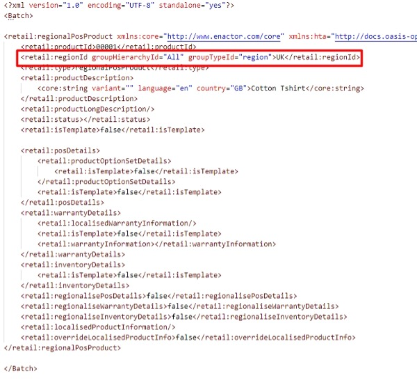
 
It is the *regionId* property which defines the region in this Regional Product entity.

### Role by Region
Regional Broadcasting for a Role will be done based on how the Region is set in the Role entity. When configuring a role, the region can be specified for each of the roles at the time of creating it. This way, the Role by Region entity can be used to successfully broadcast the roles specific to the corresponding regions.

#### Configuration
First the Role should be created to specify a region to it. User Role Maintenance application is used to set up user roles.  
 
The User maintenance application can be accessed through:  
Configuration -> HR -> User Roles

 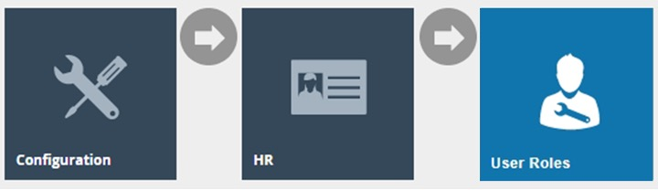

To create a new User Role, select **Create a new User Role** on the User Role maintenance page as shown below:
 
 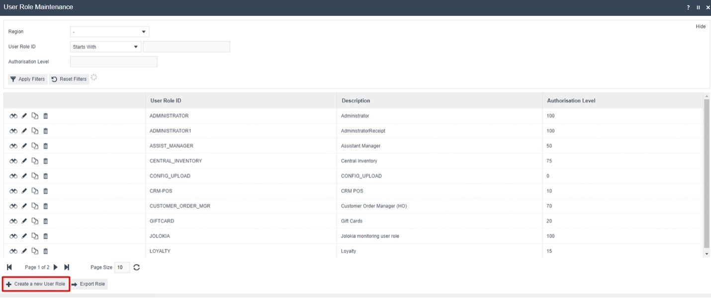
 
Select the desired Region for the user role from the **Region** drop-down.

Enter a unique **User Role ID** for the user role. The ID can be alphanumeric and contain a maximum of 20 characters.

:::note
The Region dropdown consists of the Regions that are already configured in the Group Hierarchy Maintenance.
:::

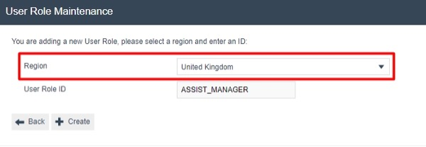 

The above example shows how a Role has been created for the United Kingdom Region. This way Roles can be configured enabling the use of the Role by Region entity, to successfully broadcast the roles specific to the corresponding regions.

#### XML
The **XML** of the above ASSIST_MANAGER Role Entity is shown below:

 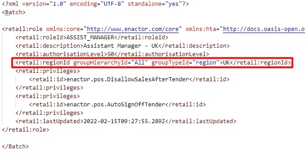
 
It is the **regionId** property which defines the region in this Role entity.

### Selling Code by Region
Regional Broadcasting for a Selling Code will be done based on how the Region is set in the Product entity. When configuring a Product, the Selling Code can be specified for each of the products in the Selling Codes Tab of the Product Maintenance. This way, the Selling Code by Region entity can be used to successfully broadcast the selling codes specific to the configured regions.

#### Configuration
First the Product should be configured to specify a selling code to it.

The Product maintenance application can be accessed through:  
Configuration -> Merchandise -> Products

 

Click on the edit icon of any product that the selling code region needs to be specified, as shown below:
 
 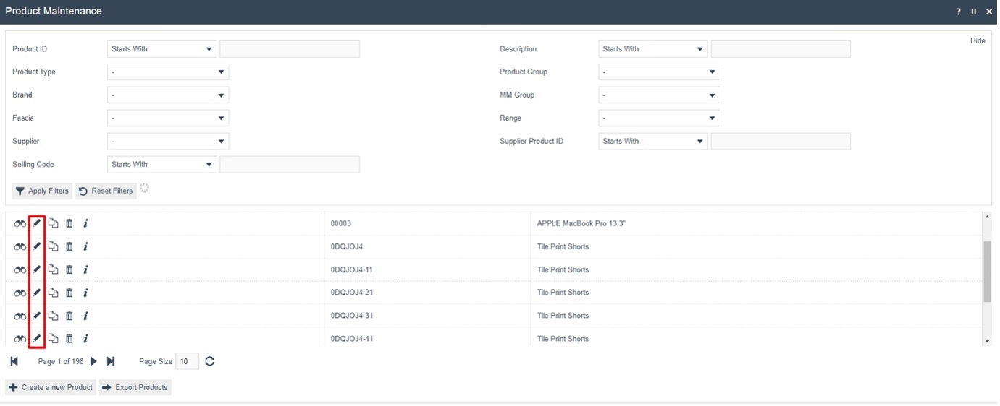
 
Navigate to the **General > Selling Codes** Tab.

Enter a Selling Code and select the desired region from the **Regions** dropdown list and click on the **Add** button.

:::note
The Regions dropdown consists of the Regions that are already configured in the Group Hierarchy Maintenance.
:::

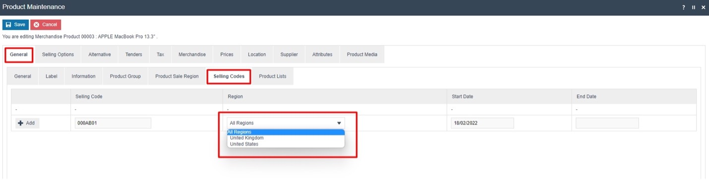
 
This way Selling Codes can be configured enabling the use of the Selling Code by Region entity, to successfully broadcast the products specific to the corresponding regions.

#### XML
The **XML** of the Selling Code Entity configured above in the Product Maintenance is shown below:

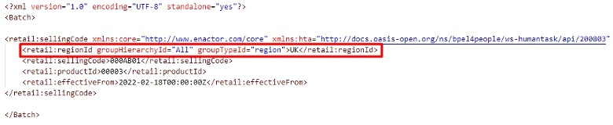

It is the **regionId** property which defines the region in this Selling Code entity.

:::note
Product has a large amount of data and the XML that shows the Selling Code exists in the entity called Selling Code and not in the Product entity itself.
:::

### Tender by Region
Regional Broadcasting for a Tender will be done based on how the Region is set in the Tender entity. When configuring a tender, the region can be specified for each of the reasons at the time of creating it. This way, the Tender by Region entity can be used to successfully broadcast the tenders specific to the corresponding regions.

#### Configuration
First the Tender should be created to specify a region to it. Tender Maintenance application is used to set up tenders.  
 
The Tender maintenance application can be accessed through:  
Configuration -> Financial -> Tenders

 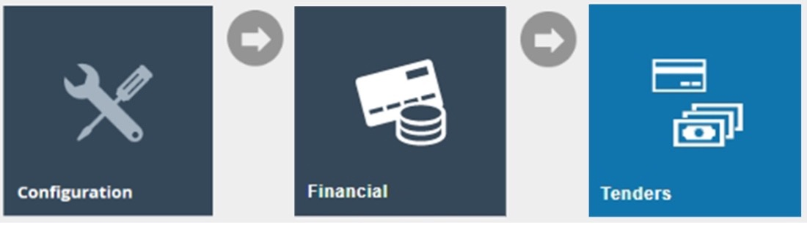

To create a new Tender, select **Create a new Tender** on the Tender maintenance page as shown below:
 
 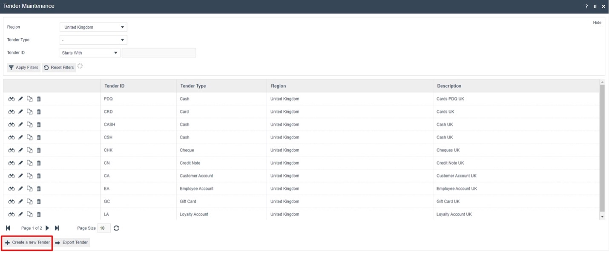
 
Select the desired Region for the **Tender** from the **Region** drop-down. 
 
Select the desired Tender Type from the **Tender Type** drop-down. 
 
Enter a unique **Tender ID** for the tender. The ID can be alphanumeric and contain a maximum of 20 characters.

:::note
The Region dropdown consists of the Regions that are already configured in the Group Hierarchy Maintenance.
::: 

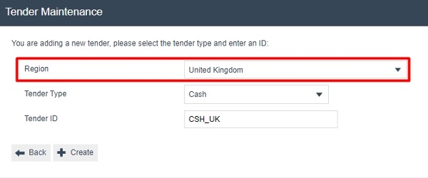

The above example shows how a Tender has been created for the United Kingdom Region. This way Tenders can be configured enabling the use of the Tender by Region entity, to successfully broadcast the tenders specific to the corresponding regions.

#### XML
The **XML** of the above CSH_UK Tender Entity shown below:

 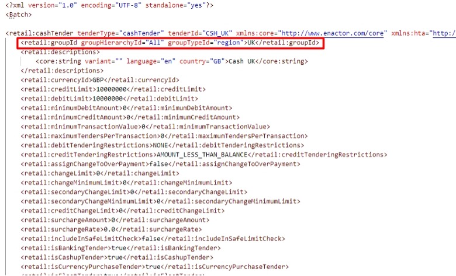
 
It is the **groupId** property which defines the region in this Tender entity.

## Locational Entity Configuration
Following are the Locational Entities and where they can be configured to sucessfully Broadcast by Location using the Predefined Broadcast:

| Locational Entity |	Configuration |
| ------ | ------ |
| Product Price by Location |	Product Price Maintenance |
| User by Location	| User Maintenance |

### Product Price by Location
Locational Broadcasting for a Product Price will be done based on how the Location is set in the Product Price entity. When configuring a product price, the location can be specified for each of the product prices at the time of creating it. This way, the Product Price by Location entity can be used to successfully broadcast the product prices specific to the corresponding locations.

#### Configuration
First a product price should be created to specify a region to it. Product Price Maintenance application is used to set up product prices.  
 
The Tender maintenance application can be accessed through:  
Configuration -> Financial -> Tenders

 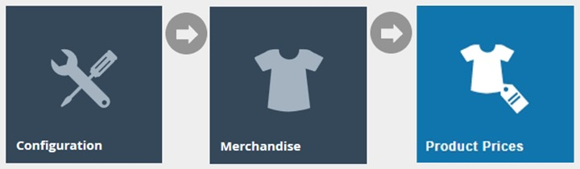

To create a new product price, select **Create a Product Price** on the Product Price maintenance page as shown below:
 
 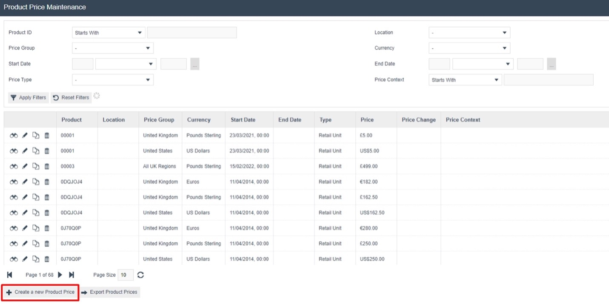
 
Enter the **Product ID** and select the desired **Location** for the **Product Price** from the Location dropdown.

:::note
The Location dropdown consists of the Locations that are already configured in the Location Maintenance.
:::

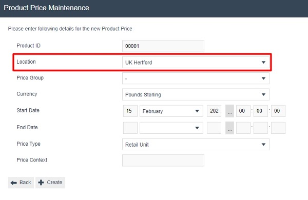 

This way product prices can be configured enabling the use of the Product Price by Location entity, to successfully broadcast the product prices specific to the corresponding locations.

#### XML
The **XML** of the above Product Price Entity is shown below:

 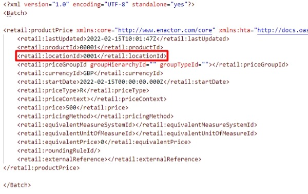

It is the **locationId** property which defines the region in this Product Price entity.

### User by Location
Locational Broadcasting for a User will be done based on how the Location is set in the Users entity. When configuring a user, the location can be specified for each of the users at the time of creating it. This way, the Users by Location entity can be used to successfully broadcast the users specific to the corresponding locations.

#### Configuration
The User maintenance application can be accessed through:  
Configuration -> HR -> Users

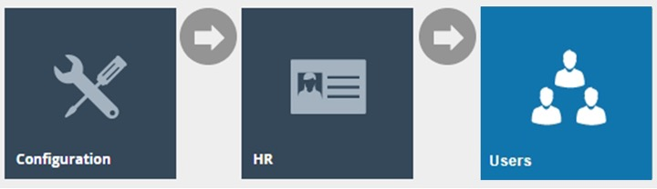 

**Edit** the desired **User** and make sure that the appropriate **Location** is selected in the Location field as shown below:

:::note
The Location dropdown consists of the Locations that are already configured in the Location Maintenance.
:::
 
 
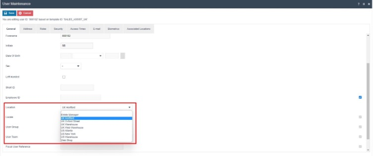

This way users can be configured enabling the use of the User by Location entity, to successfully broadcast the userss specific only to the corresponding locations.

#### XML
The **XML** of the above UK Hertford Store Location Entity is shown below:
 
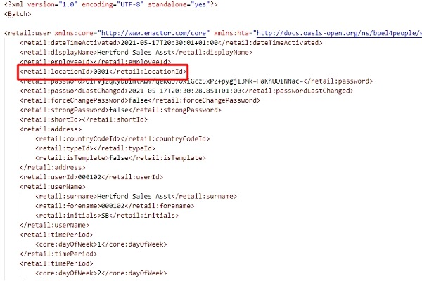

It is the **locationId** property which defines the region in this User entity.

## Data Distribution for Regional Broadcasting
This section explains how Regional and Locational data are handled during broadcasting. It starts with the selection of the target (device, location or region). Exporting and collation take place for the regional and locational entities. These move into a notification queue, and finally a subscribed device receives the regional or locational data. The status of the subscribed device can be monitored in the broadcast history.  

### Regional Broadcast – Devices
This section describes, along with an illustration, how data is distributed when broadcasts are sent to Devices.

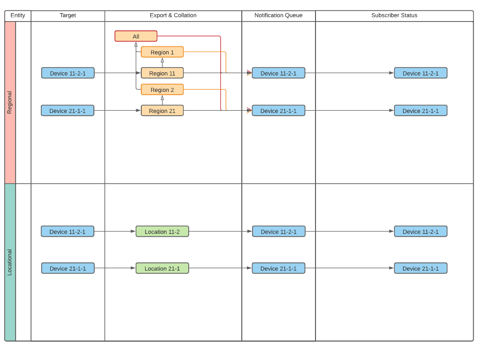

 The following table describes each column of the above diagram in detail:
 
| Target	| Export & Collation |	Notification Queue | Subscriber Status |
| ------ | ------ | ------ | ------ | 
| This is when the predefined broadcast has been configured as Devices in the “Send to” field as the broadcast target, which allows sending the broadcast to only particular devices. | In the Export & Collation stage, the selected entities are checked whether they are regional or locational, based on the target specified, which here is the Device.   The first row depicts how the Regional Entities will be handled. The first Device, Device 11-2-1, is part of Region 11, and that region is a child of both Region 1 and All. So, the export and collation will handle the Regional entities configured for Region 11, Region 1 and All Regions. The Regional entities for Region 2 and Region 21 are not included in this context. They will instead be included for the other Device, Device-21-1-1, which is a part of those Regions. When the Export and Collation has completed there will be individual zip files for each region.  The second row depicts how the Locational Entities will be handled. The devices are the same, so this is the only place where the process will differ. Here the export and collation will handle the location that the device is a part of. | During the Notification stage, notifications will be sent to inform the target of the files it needs to download. In this case, it will use the Device Queue. Once the notification is sent, it will then be up to the subscribers of the queue to request the files to download. | The status of the subscribers will be updated, and this can be viewed in the broadcast history. In this case the subscribers will just be the targets. |		
	

### Regional Broadcast – Locations
This section describes, along with an illustration, how data is distributed when broadcasts are sent to **Locations**.

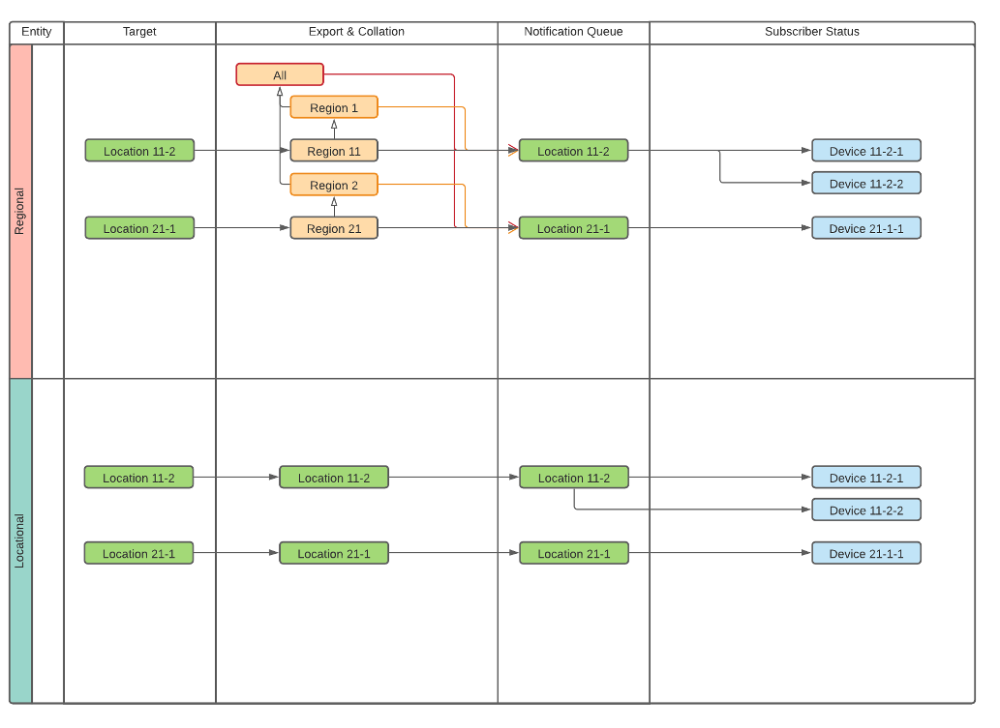

 The following table describes each column of the above diagram in detail:
 
| Target	| Export & Collation |	Notification Queue | Subscriber Status |
| ------ | ------ | ------ | ------ |
| This is when the predefined broadcast has been configured as Locations in the “Send to” field as the broadcast target, which allows to send the broadcast to only particular locations. | In the Export & Collation stage, the selected entities are checked if it is regional or locational, based on the target specified, which here is the Location.  The first row depicts how the Regional Entities will be handled. The first Location, Location 11-2, is part of Region 11, and that region is a child of both Region 1 and All. So, the export and collation will handle the Regional entities configured for Region 11, Region 1 and All. The Regional entities for Region 2 and Region 21 are not included in this context. They will instead be included for the other Location, Location-21-1, that is a part of those Regions. When the Export and Collation has completed there will be individual zip files for each region.  The second row depicts how the Locational Entities will be handled. The locations are the same, so this is the only place where the process will differ. Here the export and collation will handle the location of the entity that the device is a part of.	| Once all the export & collation jobs are completed, everything is combined, and a notification is sent through the messaging system. This is when the data goes to the target, where it is decided which queues it needs to go down through. In this case, it will use the Location Queue. Once the notification is sent it will then be up to the subscribers of the queues to request the files to download. | The status of the subscribers will be updated, and this can be viewed in the broadcast history. The subscribers are those who are a part of the targets. |
	

### Regional Broadcast – Regions
This section describes, along with an illustration, how data is distributed when broadcasts are sent to **Regions**.

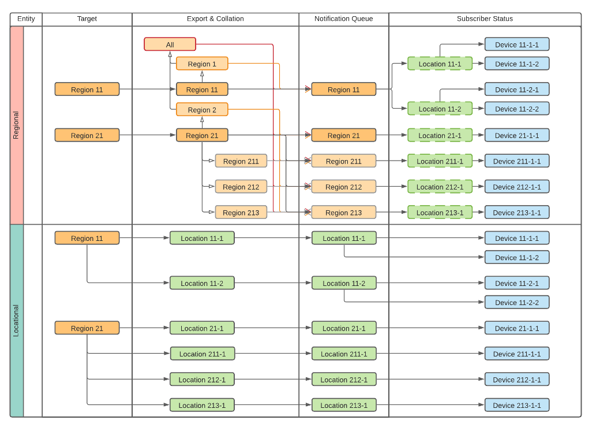

 The following table describes each column of the above diagram in detail:
 
| Target	| Export & Collation |	Notification Queue | Subscriber Status |
| ------ | ------ | ------ | ------ |
| This is when the predefined broadcast has been configured as Regions in the “Send to” field as the broadcast target, which allows to send the broadcast to only particular regions. | In the Export & Collation stage, the selected entities are checked if it is regional or locational, based on the target specified, which here is the Region.  The first row show how the Regional Entities will be handled. The first target is Region 11 so that is included automatically. It is also a child of Region 1 and All so they will also be included. The export and collation will therefore handle the Regional entities configured for Region 11, Region 1 and All. For the second target Region 21 and Region 2 will be included for similar reasons. Region 21 also has child regions of its own, Region 211, Region 212, and Region 213. When the Export and Collation has completed there will be individual zip files for each region.  The second row shows how the Location Entities will be handled. For the first target, Region 11, there are two locations that are a part of it, Location 11-1 and Location 11-2. Any locations for Region 1 or All are ignored. The second target, Region 21, has one location, Location 21-1. Again, locations for Region 2 or All are ignored. Since Region 21 has child regions (Region 211, Region 212, and Region 213), their locations which are Location 211-1, Location 212-1, and Location 213-1 will also be included. | During the Notification stage, notifications will be sent to inform the target of the files it needs to download. In this case, it will use the Region Queue for Regional Entities and the Location Queue for Locational Entities. Once the notification is sent it will then be up to the subscribers of the queues to request the files to download. | The status of the subscribers will be updated, and this can be viewed in the broadcast history. In this case, the subscribers are part of the locations within the targets. |
			
:::note
Once the regional and locational entities are configured, they can be selected in the Predefined Broadcast and the Data Broadcaster can then be used to send the Regional Broadcasts to the appropriate targets. These steps are covered comprehensively in the **How-to Guide for Configuring Data and Regional Broadcasting**.
:::

 
