# POS Behaviour- Menus
## Introduction
This How-to guide covers the basic configuration of POS Menus. Enactor Retail Applications that present User Interfaces (UIs) use Menus as the principal means to navigate and access functionality of the Application. Menu configuration provides the first level of Retailer control over what Application Functionality individual Users and groups of Users may access and how they navigate to the functions they require. 

The intent of the guide is to provide basic guidance on configuration of POS Menus.  In this guide we will specifically review the POS Sale and Tender Menus.  Please refer to the full solution documentation and other how-to guides for more information on other Menus.
### Overview
The following areas will be reviewed as part of establishing Inventory Management:

* Menus
* Menu Groups
* User Roles
* Locale

## Prerequisites
### Resources
Before starting, you should have the following resources in place:

* Enactor Estate Manager
* Enactor POS, connected to the Estate Manager
* Standard Configuration, including:
	* Base Configuration
	* Products

### Prior Training/Experience
You should be familiar with the following:

* Estate Manager configuration
* Enctor POS
* Enactor configuration concepts, including Locations, POS Terminals, Products etc.
* Data broadcasting

## Configuration 
Menus are associated with a Locale, User Role and Menu Group. These relations must be understood, and the related configuration elements defined before proceeding to create Menu configurations. From the POS User perspective some POS Menu options select other Menus or invoke software functions. These are the POS Menus for which the action behind the Menu Option is an Event; a Function or Process defined within the constraint of the Menu Set. 
 
### Menu Creation
Access Menus using the Menus option, obtained via the selection sequence shown: 

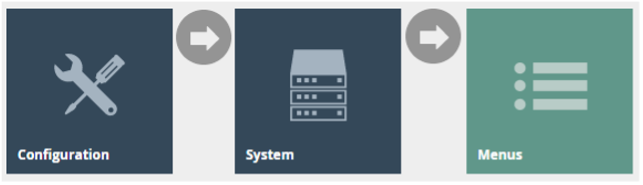

The Menus option invokes the Menus Maintenance select page as shown below. The Select page lists currently configured Menus and enables the User to Add, View, Edit, Copy or Delete Menus.

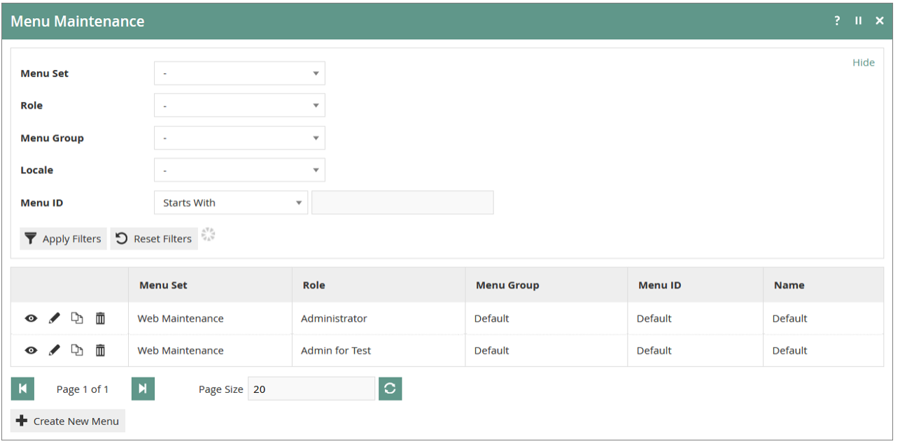 

In the Menu Maintenance select page select the ***Create a new Menu Option***, which presents an initial page to capture a Menu Set, Role, Menu Group, Locale and Menu ID, all of which serve to uniquely identify a Menu. Enter values and select the ***Create*** option. 

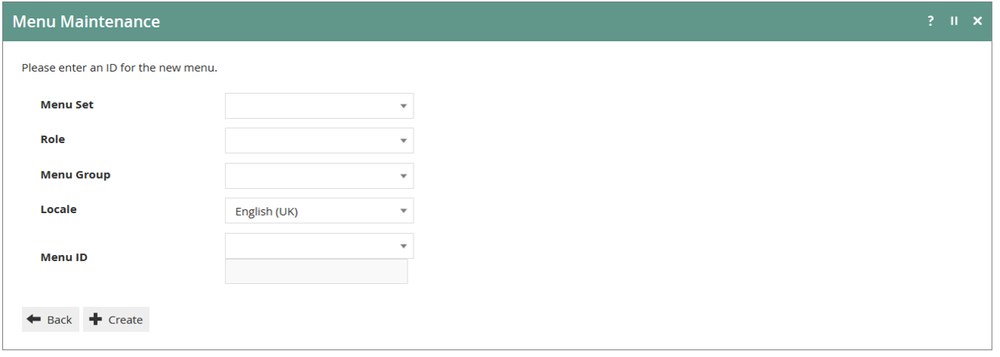 

The ***Create New Menu*** option initiates the creation of a new Menu ‘from scratch’. However, Menus may also be created by copying existing Menus including the supplied Example Menus mentioned above. To copy an existing Menu mouse-click on the Copy Icon (  ) associated with it in the Menu Maintenance List. The initial page shown above, which is used to capture the mandatory elements that uniquely identify the new Menu, is common to both methods. 

The **Menu Set** is specific to each Application and is associated, in the Estate Manager Database, with all the Events of the Application, which are available to be referenced by Options in Menus. The MenuSets available to the Estate Manager appear in the Dropdown list field for the property. There are two fundamental Enactor Retail Application Menu Sets, namely ***Web Maintenance*** and ***POS***. 

Locale is configured using **Configuration>Organisation>Locales**. Equivalent Menus for different Locales may be created by creating copies of the first-created Menu and applying the different Locale values. These copied Menus may remain equivalent in all respects other than Locale if the Menu Option labels are specified based on a Message Resource since the Message Resource will be dynamically selected based on the Locale of the User. Alternatively, Locale-Specific labels may be explicitly specified as text in the Menu configuration. 
 
For supplied Enactor Retail Applications, the set of **Menu ID**s applicable to the software associated with the **Menu Set** is available as a drop-down list for selection. Absent any Customisation using the Enactor Toolset the **Menu ID** need and should only ever be selected from the drop-down list, since these are the only Menus that the software will ever request and load. 

An individual Menu once created, or when selected for Edit presents in the Edit window of the Menu Maintenance Page as shown below, in an expandable Tree structure; Sub-Menu nodes have an Expand/Collapse Icon (  ) by which the User may navigate and view the Menu (as presented in the configuration maintenance interface). The Menu Edit page captures identifying properties of the Menu and allows for manipulation of its structure and content. 

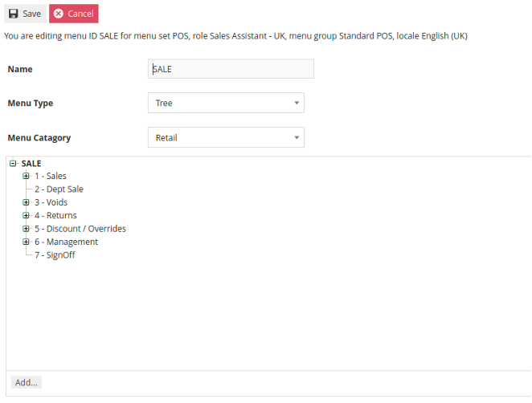

### Menu Construction 
Menu Options shown in the Edit window of the Menu Maintenance Page that have an Expand/Collapse Icon (  ) are Sub-Menu nodes (i.e. Folders) to which new Options may be added. When such options, including the root configuration Menu itself, are selected (shown highlighted in **Bold**) the ***Add*** option will be available to add new options to them. This is the basic method of Menu Construction and the available options are described following. Although the Create new Menu Option described in section Menu New provides a starting point for creating configuration Menus, using the Copy method, as described in Menu Creation Options above, is the ideal starting point for Menu construction as it has the advantage of providing a ready-built Menu structure, which may be customized to the requirement by applying the various options described below in sections Editing Menu Elements to the existing elements and Adding Menu Elements. In both cases the menu is constructed (or re-constructed) in the Edit page of Menu Maintenance, which is illustrated and described above. 

Menus are internally hierarchical in the sense that ***Folder*** options may be added to the main, root Menu, which appear in the User Interface as Sub-Menus, and to which further options may be added, including other Folder options. 

New Menu Options may be added using the ***Add*** option. When selected, the User is presented with a pop-up menu of the types of Menu Items that may be added, as shown at right. The options illustrated are described in brief in the following table and in detail in the following sections. In all cases, when one of these options is selected, the Menu Maintenance function opens in the General Tab of the Menu Element Maintenance page to capture details of the new element. 

Only two of the Add options shown above should ever be required for the creation of Restaurant and POS Menus, these being ***Add a new Button*** and ***Add a new Button Folder***. 
 
### POS Menus
This guide will cover the POS **Sale Menu** and the **Tender Menu**.  While there are other menus in the POS Menu Set, these are most likely to require some level of customization to suit the retailer.

In the standard NextGen UI, the menu is represented as 2 rows of 4 buttons at the bottom of the screen or a single column of 8 buttons on the right side depending on the theme resolution.  **The Sale Menu** is displayed while in the basket view.  Once the transaction has been tendered, the menu switches to the **Tender Menu**.

As mentioned previously, example menu configurations are available in Estate Manager.  It is recommended to start by copying an existing menu and making modifications rather than starting from scratch.

#### Sale Menu
In the Menu Maintenance view, use the filters to help locate an existing **Sale Menu**.  In the example below, we have filtered on POS as the **Menu Set**, Sales Assistant as the **Role** and Standard POS as the **Menu Group**.  

 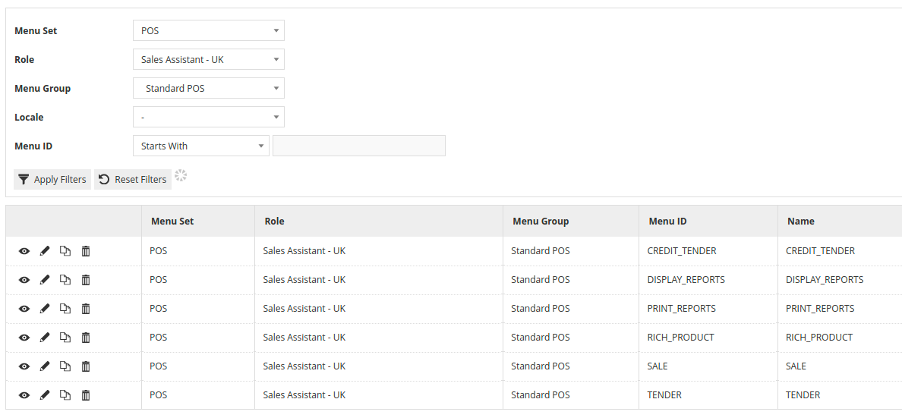

Locate the **Sale Menu** and click the icon to create a duplicate.

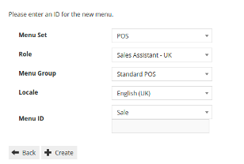

Select the desired **Role, Menu Group, Locale** and assign a **Menu ID**.  Click on **Create** to create the new menu which is now ready to be edited.
 
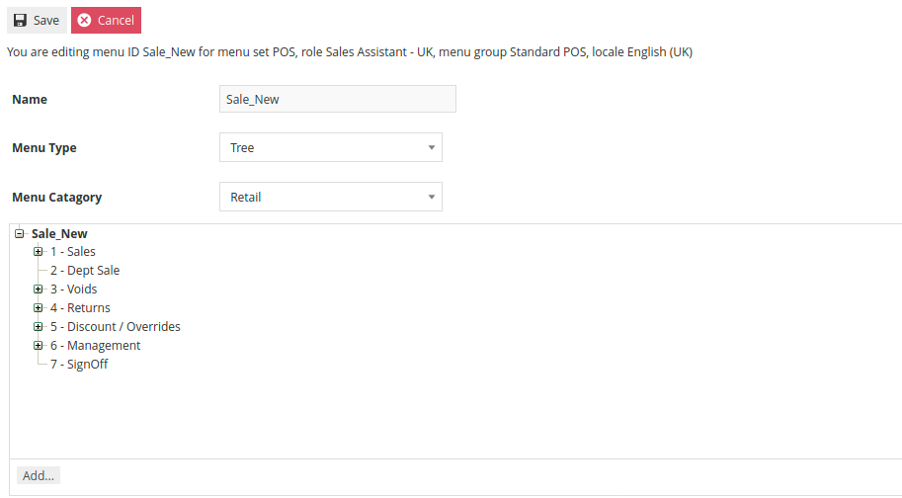

The **Sale Menu** contains most of the functions that will be required by a retailer.  Most of the customization work will involve restructuring the hierarchy of the menu, removing unnecessary items or potentially adding a new item.

The numbers in the Menu tree represent the button position for the item.  In the above example, the main **Sale Menu** only has 7 buttons defined so the eighth button will not appear.  To change the order in which the functions appear, select the button that needs to be moved and then use the **Move Up** or **Move Down** buttons until the order is corrected.  This can be done at any level of the hierarchy. 

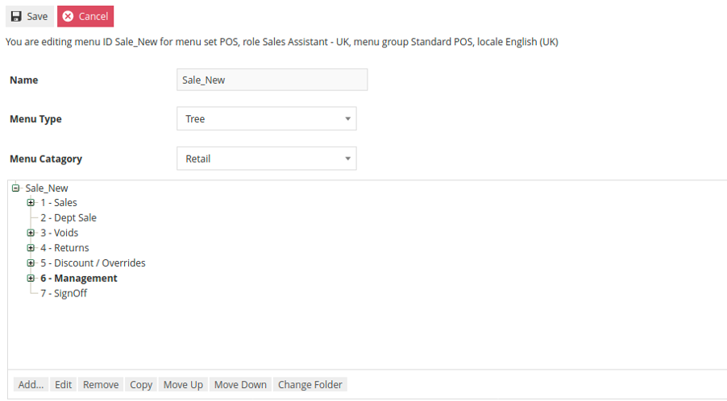

Removing an item is done by selecting the item and then clicking **Remove**.  It is important to note that the **Remove ** action can be used on individual functions as well as folders.  If it is used on a folder, it will remove the folder and all contents within the folder.

Buttons and Folders can be added by selecting the containing folder first and then clicking **Add** and then selecting either **Add a new Button Folder** or **Add a new Button**.

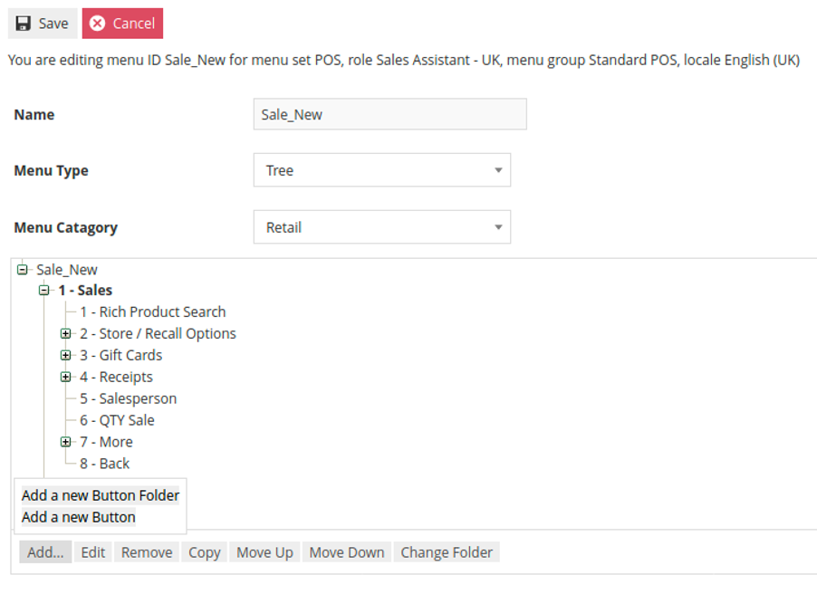

If **Add a new Button Folde**r was selected a prompt will appear to collect the folder name and button position.
 
 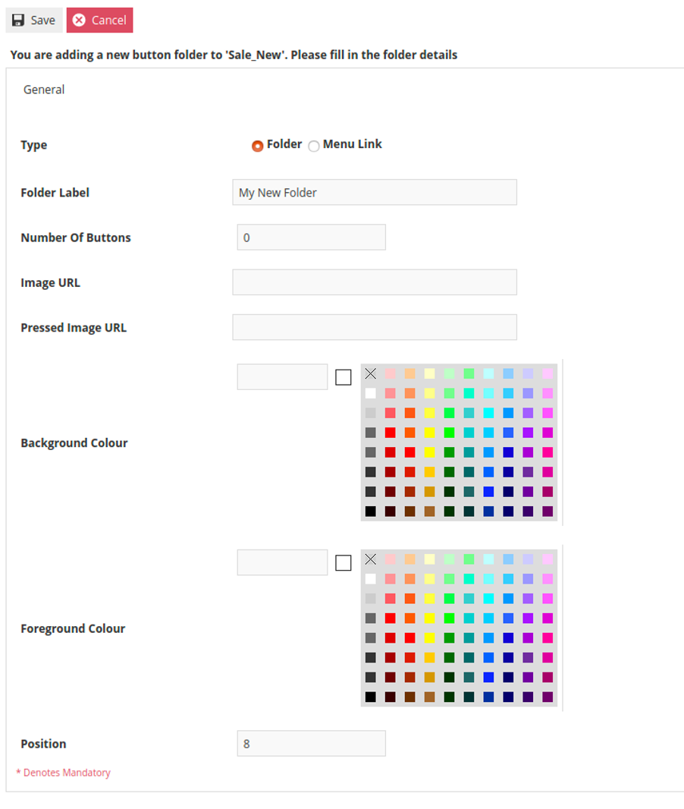

As the style of the button is already defined within the UI, the only information that needs to be supplied is the **Folder Label** which is the text that will appear on the button and the button position.

When **Add a new Button** is selected a similar form will be presented.  This form is slightly different in that it requires the **Event** that is to be fired by the button to be selected.  In this example we are adding a button that will trigger a **No Sale**.  Similarly to the new folder process, the desired button text should be entered as the **Button Label** and the button Position should be specified at the bottom of the form.

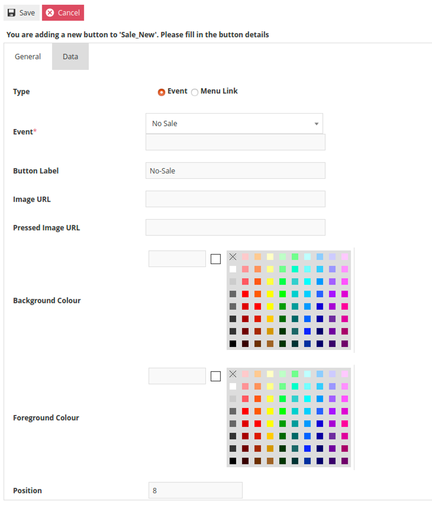
 
All events that can be launched from the POS should appear in the **Event** drop-down. 

In addition to changing the order of appearance, the structure of the hierarchy can also be adjusted.  By using the **Change Folder** option, it is possible to move a function or folder to a different location or level of the hierarchy.  Using our example again, we will move the **Loyalty Folder** from the second level of the **Sales Folder** up to the first level.  To accomplish this, click on the **Loyalty Folder** and select **Change Folder**.
 
 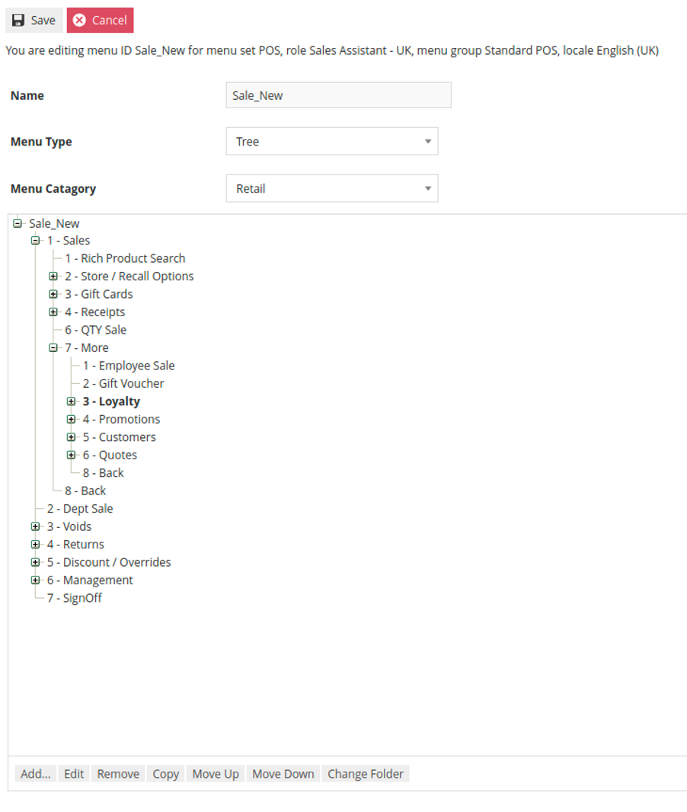
 
At that point an option appears to select the desired target folder from a drop-down of the menu hierarchy.  In this case, select the **Sales Folder**.

 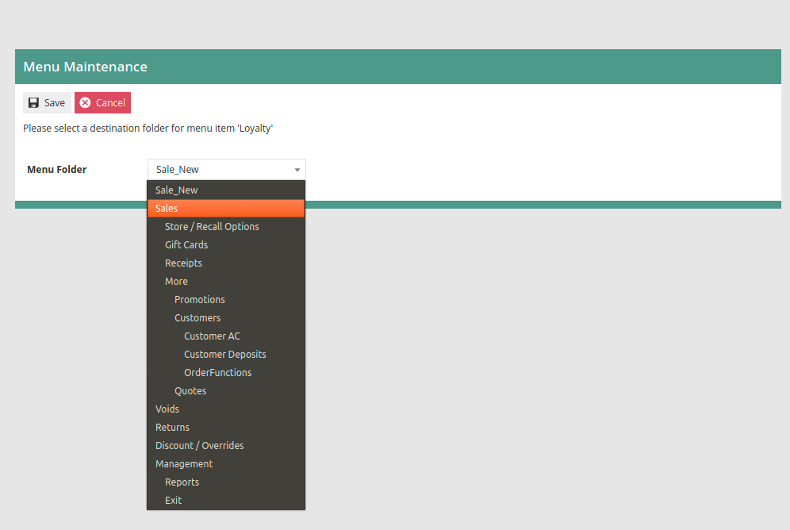

After saving the change, the **Loyalty Folder** will now appear in the top level of the **Sales Folder**.  When a folder or button is moved, it will retain its previous position ID.  Use the **Move up** and **Move down** functions to select the desired position within the new folder.

 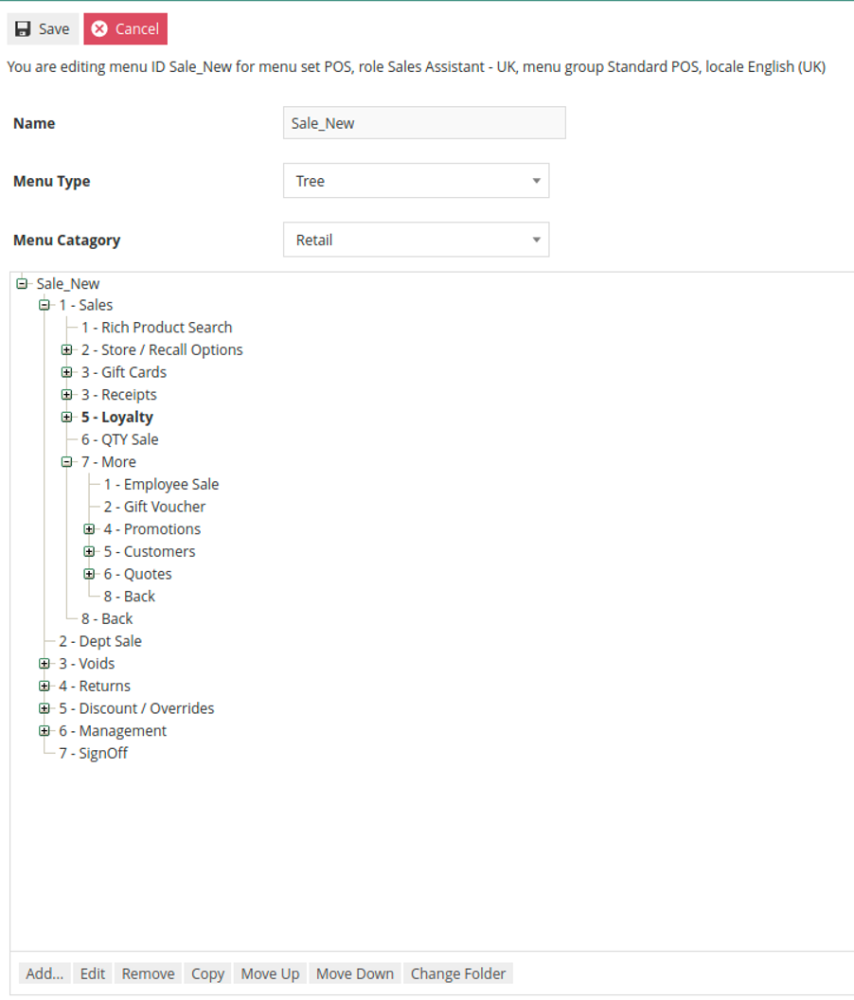

Once the **Sales Menu** is completely revised it can be saved.  If additional variations of the menu are to be created for different **Roles, Locales** or **Menu Groups** this process can be repeated using the newly created menu as the source for the working copy.
 
#### Tender Menu
In the Menu Maintenance view, use the filters to help locate an existing **Tender Menu**.  In the example below, we have filtered on POS as the **Menu Set**, Sales Assistant as the **Role** and Standard POS as the **Menu Group**.  

 

Locate the **Tender Menu** and click the icon to create a duplicate.

 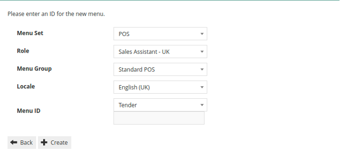

Select the desired **Role, Menu Group, Locale** and assign a **Menu ID**.  Click on **Create** to create the new menu which is now ready to be edited.

 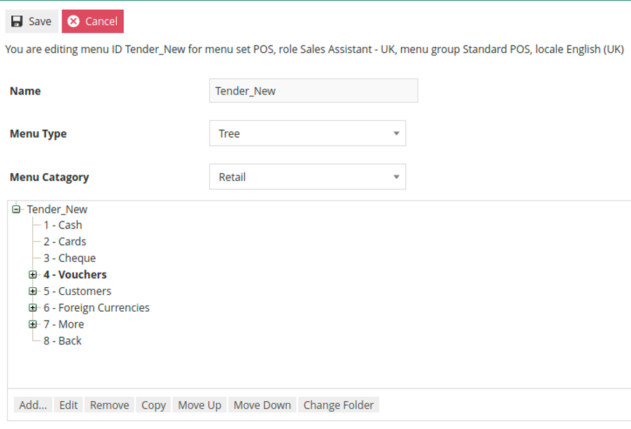

The process to reorder, add and remove items from the **Tender Menu** are the same as what was described previously for the **Sales Menu**.  What is different about the **Tender Menu** is that each tender represented on the menu must be linked to a tender that has already been configured.  Because of this, it is recommended to complete tender configuration prior to modifying the **Tender Menu**.  Additionally, the **Event** triggered must also be properly selected.

In the above example, **Cash** is the first button in the menu.  By editing the button, we can see on the **General Tab** that the Event is set to **Cash Tender**, the **Button Label** is **Cash** and the **Position** is **1**.

 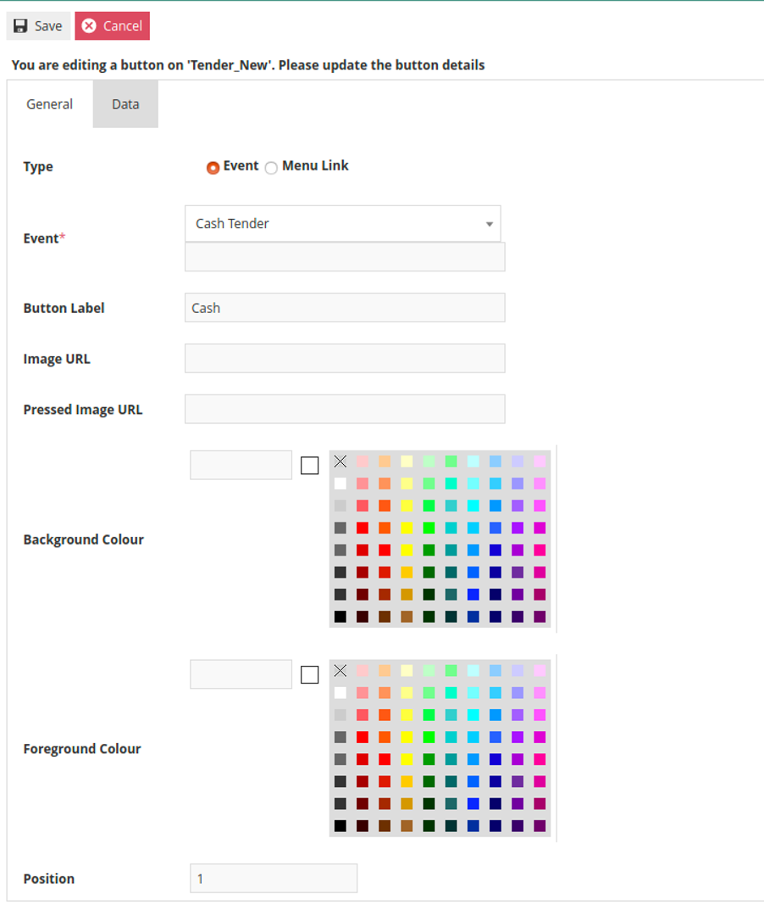

The **Data Tab** is where this button will be linked to the correct **Cash Tender**.  In the **Tender Maintenance** view, we can find the **Cash Tender** and see that a **Tender ID** of **CASH_UK** has been defined.
 
 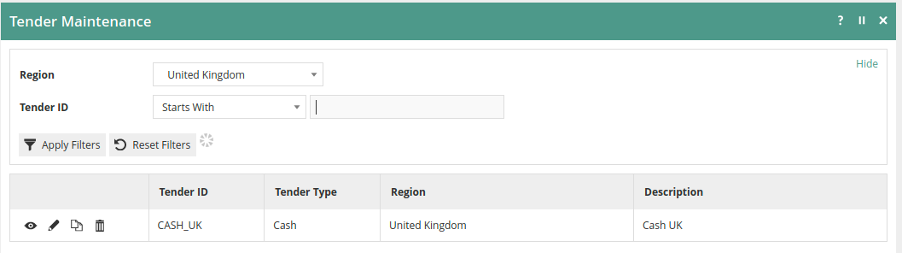

On the **Data Tab, enactor.mfc.TenderID** must have the correct **Tender ID** specified in the Value field.  In this example, the correct **Value** would be **CASH_UK**.  If the **Value** is incorrect it must be changed to match the desired **Tender ID**.

 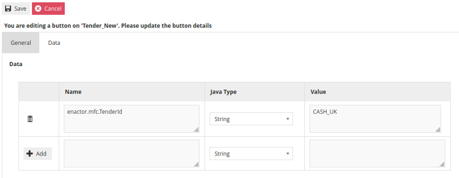

If a new **Menu Button** is being added, there will be no pre-existing entry on the **Data Tab**.  In this scenario, enter **enactor.mfc.TenderId** in the **Name** field and the appropriate **Tender ID** in the Value field.  

:::caution
When making a new entry on the **Data Tab**, it is critical to remember to press the **+Add** button before leaving the page.
:::

All options remaining on the **Tender Menu** must be linked to the appropriate **Tender ID**.

