# POS Order Capture
## Introduction

The purpose of this guide is to show how to configure the Enactor Estate Manager and POS to support Order Capture at the Point of Sale.

Order Capture at the POS can be carried out in two ways:

* Using the Order button from the Sales menu – this puts the POS into Ordering mode, so that products then entered are treated as ordered rather than sold
* Using Rich Product Search – this allows users to browse and find products using a web-style interface, which provides a richer and more intuitive experience. 

This guide will focus on the Rich Product Search approach, but ordering using the menu will also be covered.

Please note configuring order capture requires amendments to several types of data.  It is recommended that you familiarise yourself with the main Enactor configuration pages before undertaking this task (see Prerequisites for details).

### Overview
The following steps are required to enable Order Capture:

* Location Configuration – setting the rules on where orders may be accepted, and on how they may be fulfilled.
* Reason Configuration – setting up the reason codes used in the order capture flow
* Product Configuration – setting products so they may be ordered, and adding appropriate details so they may be accessed using Rich Product Search 
* Menu Configuration – setting up the Rich Product Search menu, and adding Order functions to the Sales Menu on the POS
* Role Configuration – ensuring POS users have the appropriate privileges to carry out ordering functions
* POS Terminal Configuration – setting up the POS so it has the correct menu and other required settings
* Inventory Configuration – setting product inventory so that the Inventory and Order Management systems can find the right stock levels to support Ordering functions.
* Synchronising Configuration with the POS (“Broadcasting”).
* Executing the Order Capture at the POS
* Checking Order Details at the Estate Manager

## Prerequisites

### Resources
Before starting, you should have the following resources in place:

* Enactor Estate Manager
* Enactor POS (configured within the UK Region, connected to the Estate Manager)
* Standard Configuration, including:
* Base Configuration
	* UK Retail (I have used UK in this example, but it could be other regional config packs)
	* Retail Segment pack (I have used UK Grocery here, but it could be UK Fashion etc.)
* Examples of Data to be used as models, particularly product data

### Prior Training/Experience
You should be familiar with the following:

* Estate Manager configuration
* Enactor configuration concepts, including Locations, POS Terminals, Products etcl.
* Data broadcasting
* Standard POS Sales processes

If necessary, please revise the appropriate how-to guides on these concepts before starting the Order Capture configuration process.

## Configuration Steps

### Location Configuration
The first step is to configure the warehouse location which will be the main Inventory source for orders in our environment.
Go to Location configuration using Search or the path *Configuration-Organisation-Locations*.  The key tabs are the General tab and the Ordering Tab

#### Warehouse Location
Create a new Warehouse as follows:
 
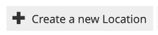

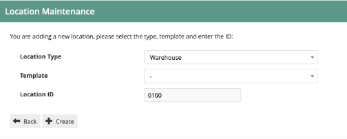
 
:::note
You can use whichever Location ID you wish, and you may choose to use Location Templates if you prefer.  Warehouse Location 0100 may already exist in your configuration.   If so, you can edit it, or create a new warehouse if you wish.
:::
 
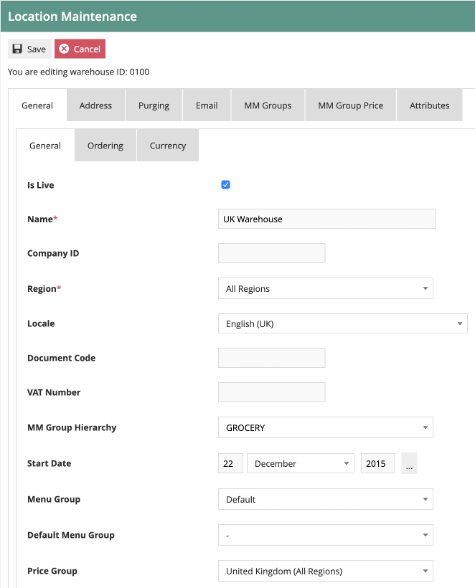
 
The key fields on the General tab are:

* Description – set as required
* Region – set the warehouse at the country level.  If you have a multi-country configuration, you should have one warehouse for each country that will be taking orders.

 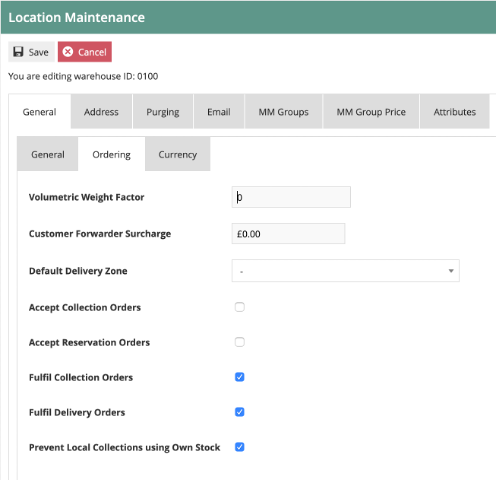

The key fields on the Ordering tab are:

* Accept Collection Orders – this should be set to off as the warehouse will not normally accept orders
* Accept Delivery Orders – this should be set to off as the warehouse will not normally accept orders
* Fulfil Collection Orders – this should be set to on as the warehouse will be the primary fulfilment source
* Fulfil Delivery Orders – this should be set to on as the warehouse will be the primary fulfilment source
* Prevent Local Collections Using Own Stock – this should be set to On.  The warehouse will not normally accept orders so this scenario is unlikely to arise.

Set the data on the other tabs as required – currency should be set to the Coutry’s main currency.  Address should also be set.
 
#### Store Location
Each of the store locations where you will be accepting orders should be set as follows.  This would normally be done using a location template.  The guide below will configure the location directly, but the process is similar with templates.

The critical tab on the Store Location configuration is Ordering.  

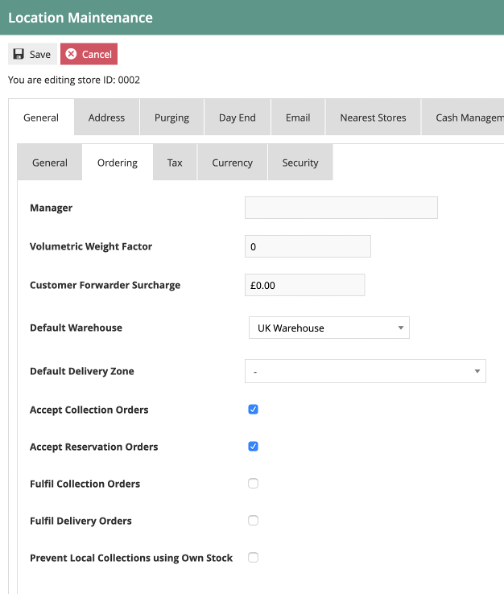

The main fields on the Ordering Tab are as follows:

* Default Warehouse – this should be set to the warehouse you have configured for the region
* Accept Collection Orders – this should be set to on, assuming you wish to allow Click and collect orders
* Accept Delivery Orders – this should be set to on, assuming you wish to allow Home Delivery orders
* Fulfil Collection Orders – this should be set dependent on whether you want to allow fulfilment of click and collect orders from the store
* Fulfil Delivery Orders – this should be set dependent on whether you want to allow fulfilment of Home Delivery orders from the store 
* Prevent Local Collections Using Own Stock – this should be set dependent on whether you want the store to fulfil collect orders using its own stock (i.e. click and reserve)

This completes the location configuration.
 
### Reason Configuration
The following reason code is used by the Order capture process:

#### Customer Order Deposit
 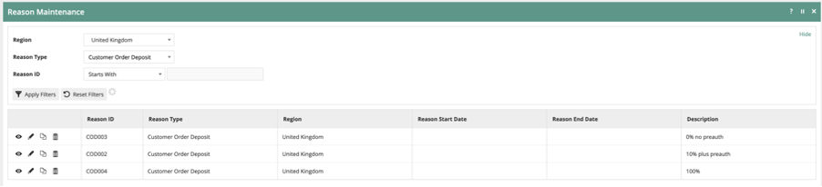
 
This is used to set the order deposit values that may be accepted on the POS.  For example, if the deposit is always 100% up front for all POS orders, only the 100% option should be included.  If the deposit can be a specific value or % of the total order value, this can be configured on the reasons.  Where the deposit value is less than 100% of the total, you can choose to have the POS create a card pre-authorisation for the remaining amount.
 
### Product Configuration

#### Product
There is one key field that is required on the Product configuration.  This is held on the Merchandise Tab.  The field is the “Allow Customer Order” checkbox.  This should be set for all Merchandise, SKU and Style products which may be ordered by customers.

The configuration process below uses the Estate Manager UI to configure the Product.  This is fine for small volumes and for creating example data.  For large volumes of product data, this would be handled by integration.  An example configured product may be exported to provide a template of the XML structure required to include the Allow Customer Order data.

Go to Product Configuration using search or the path *Configuration-Merchandise-Product*.

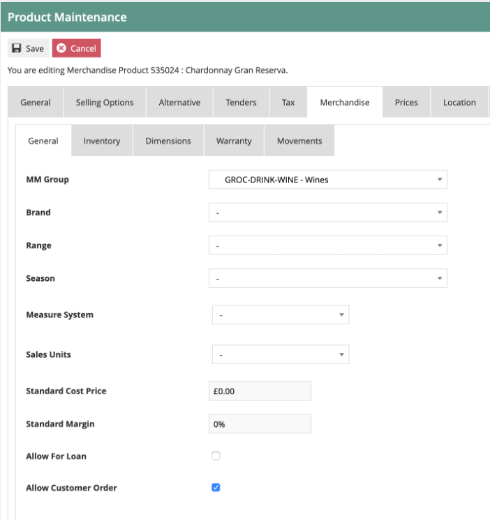 
 
#### Product Ordering
Product Ordering is an **optional** configuration entity.  If all products have the same rules (e.g. they all allow Collection, Delivery and Reservation, and use the same delivery types) then the Product Ordering data is not required.

If different rules are applicable depending on the product, then product Ordering may be used to record the settings for each product.

Go to Product Ordering Configuration using search or the path *Configuration-Merchandise-Product Ordering*.

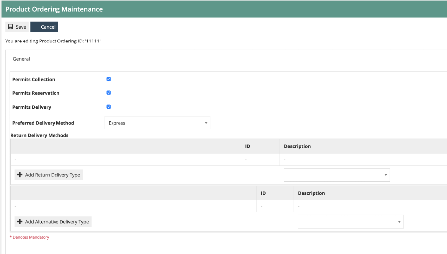 

Set the “Permits” flags dependent on which delivery methods are allowed.
Set the Preferred delivery method
If additional returns and send delivery methods are allowed, these may also be maintained.
 
#### Product Group
Products should be added to a Product Group structure to support browsing via the Rich Product Search facility on the POS.

The Product Group is maintained using the Group maintenance UI.  A hierarchical structure may be configured to reflect how products may be browsed for, as on a commerce website.  This is usually different from the main MMGroup hierarchy, which is typically used for reporting.

Go to Group Configuration using search or the path *Configuration-Organisation-Group*.  Then select the Group Type *Product Group*.

An example Product Group structure is shown below.  You should configure your Product Group to reflect the required structure for browsing.  The product group hierarchy should be assigned to the appropriate region.:
 
 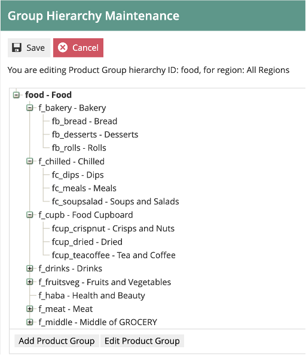
 
If the group structure is common to all regions, it may be assigned to the top-level “All Regions”.  If it is only applicable at, say, country level, then it should be assigned to the appropriate country region

 
#### Product Group Products
Once the Product Group structure is in place, products should be assigned to the appropriate Group(s).  Note: products may be assigned to multiple Product Groups.

Go to Product Configuration using search or the path Configuration-Merchandise-Product.

In Product Configuration, select the “Product Group” sub-tab from the “General” tab:
 
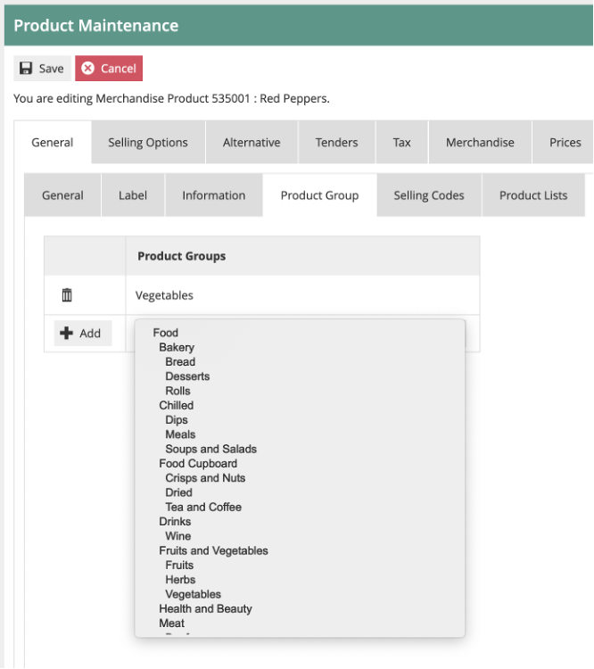

You may add the product to one or more groups from the Product Group list.
If you have multiple Product Group hierarchies configured, make sure all the Groups to which the Products belong are from the correct Hierarchies.

This concludes the Product Configuration.
 
### Menu Configuration
#### Rich Product Menu
Menu is the next part of the Rich Product Search Configuration.  The Rich Product Menu provides the initial view of the Rich Product Search on the POS, and holds a set of menu options with image buttons, e.g.:
 
 
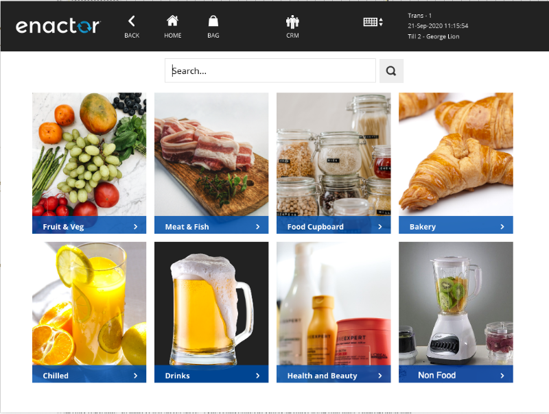

Go to Menu Configuration using search or the path Configuration-System-Menus.

The menu selection required is as follows:

* Menu Set – POS
* Role – Whichever role your POS menus are assigned to.  I am using a Role of Sales Assistant-UK
* Menu Group – whichever Menu Group is configured for your POS Terminals.  I am using a Menu Group of GROCERY.
* Locale – appropriate Locale for your region.  I am using English(UK)
* Menu ID – set to RICH_PRODUCT
 
 
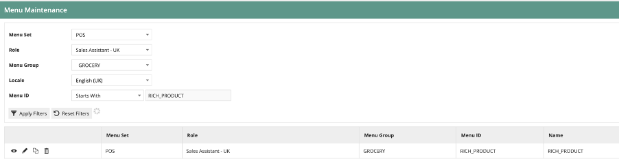

Edit the Rich Product Menu.  If one does not exist for your Role/Menu Group, then copy one from another Role/Menu Group.

There should be a set of up to 8 button items on the menu:
 

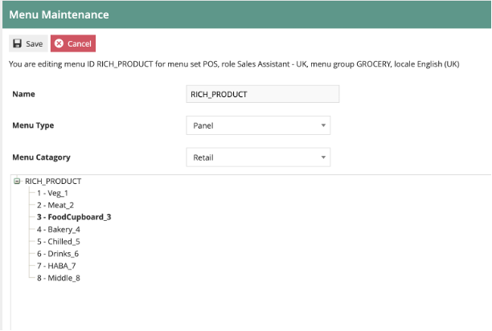

Each Button item should be configured as follows:
##### General Tab
 
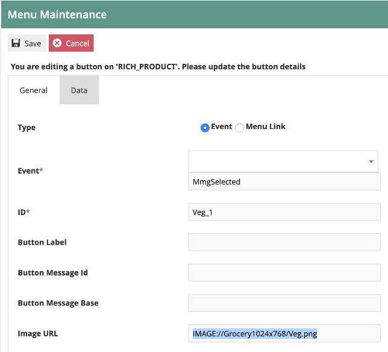

Set the values on the **General** tab as follows:

* The Event should be set to MmgSelected.
* The ID should be a unique ID of your choice
* The Image URL should point to an appropriate image.

If you have uploaded images to the Enactor system, they will have a URL like this:
IMAGE://Grocery1024x768/Veg.png

In my example:

* “Grocery1024x768” is the Image Category to which the images have been assigned
* “Veg.png” is the image filename.

:::note
It is also possible to point at external URLs for the menu images, using a normal http URL structure.
:::

As we are using images, the message (text) details on the menu items can be ignored.

##### Data Tab
  
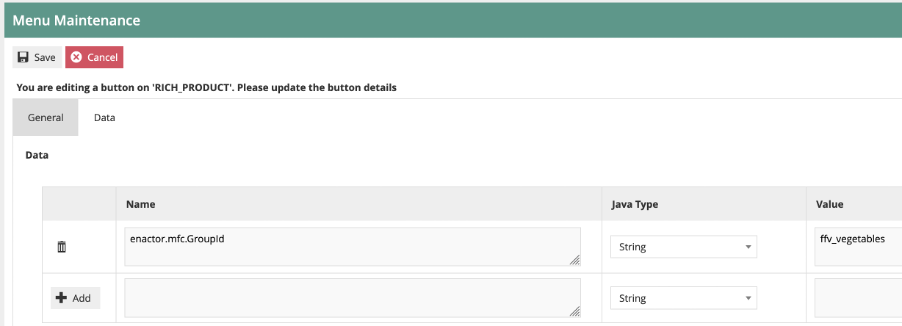

Set the **Data** tab as follows:

There should be one data item, with a Name of *enactor.mfc.GroupId*.  The Java Type should be String.

The Value should be set to the appropriate Product Group ID.  In the example above I am using the Group ID of the vegetables group.
 
#### Ordering Functions Menu
As well as/Instead of using Rich Product Search, we may wish to select ordering directly from the Sale menu.  This will necessitate adding certain functions to the menu structure.

In the example below, I have ordering functions in a sub-menu of the Sales Menu, called “OrderFunctions”:
 
 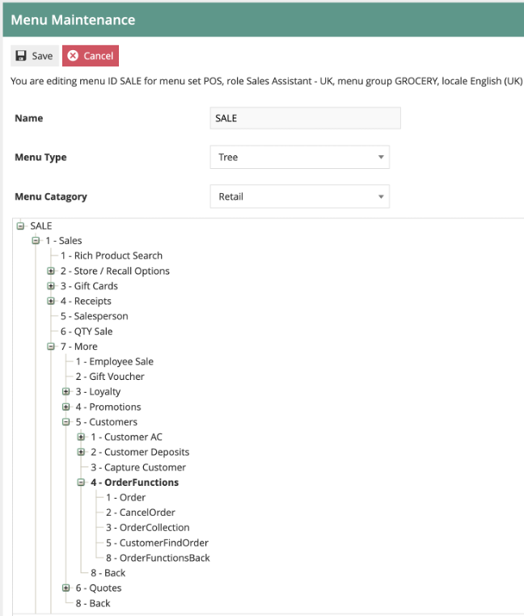

You may choose to put the Order functions at whichever location in the Sale menu is appropriate for your environment.

The three key menu functions are:

* Order – starts the order capture process
* CollectOrder – records the in-store collection of an existing order
* FindOrder – finds an existing order, for enquiry or other functions.

##### Order Function
This has the following settings:

* Event: Order
* Button Message ID: ORDER_BUTTON
* Visibility expression: #{priv:checkPrivilege('enactor.pos.OrderAllowed')}

This visibility expression will ensure the menu button is only shown to users who are allowed to carry out orders.  There are no data tab settings.

#### Order Collection Function
This has the following settings:

* Event: CustomerOrderCollection
* Button Message ID: CUSTOMER_ORDER_COLLECTION_BUTTON
* Visibility expression: #{priv:checkPrivilege('enactor.pos.CustomerOrderCollectionAllowed)}

This visibility expression will ensure the menu button is only shown to users who are allowed to carry out order collections.  There are no data tab settings.

#### Find Order Function
This has the following settings:

* Event: CustomerFindOrder
* Button Message ID: CUSTOMER_FIND_ORDER_BUTTON
* Visibility expression: #{priv:checkPrivilege('enactor.pos.CustomerFindOrderAllowed)}

This visibility expression will ensure the menu button is only shown to users who are allowed to carry out find order functions.  There are no data tab settings

This concludes the Menu Configuration.
 
### Role Configuration

#### Order Capture Role
The role configuration approach I will take is to create a Role that has all the privileges necessary to capture and manage orders at the POS.
This role may then be assigned to users (or user templates) so that the appropriate people may execute Order Capture.

Go to Role Configuration using search or the path *Configuration-HR-User Roles*.

Create a new Role called POS_ORDERS_XX, where XX is a country abbreviation.
I recommend that this role is set at the Country level.  In my example, the country is UK so the role is called POS_ORDERS_UK
 

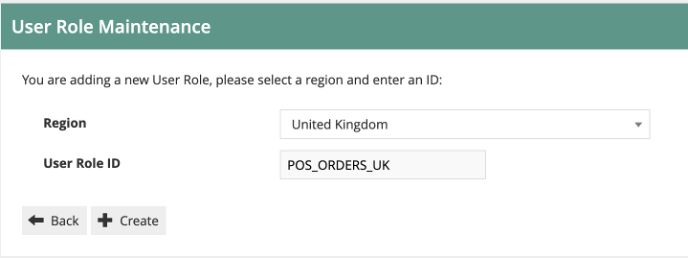

Set an appropriate authorisation level for the role.  This should be lower than the standard Sales Assistant UK role:
 

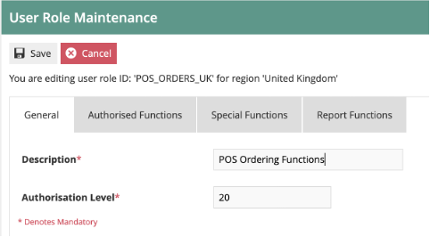

Then go to the Authorised Functions tab.

From Application Package, select “Enactor Customer Orders POS”.  If this is not shown in the list, you need to deploy the Customer Orders POS jar – refer to the JAR deployer how-to guide for this.

You should now have a list of around 40 privileges.  Enable the following Function ID privileges for the POS_ORDERS_XX role:

| Function ID | Function Name |
| ---- | ---- |
| enactor.pos.AuthorisesVoidOrder	| Authorises Void Order |
| enactor.pos.VoidOrderAllowed |	Void Order Allowed |
| enactor.pos.AuthorisesCustomerFindOrder | Authorises Find Order |
| enactor.pos.CustomerFindOrderAllowed	| Find Order Allowed |
| enactor.pos.AuthorisesCustomerOrderCollection | Authorises Customer Order Collection |
| enactor.pos.CustomerOrderCollectionAllowed | Customer Order Collection Allowed |
| enactor.pos.AuthorisesDeliveryChargeOverride | Authorises Delivery Charge Override |
| enactor.pos.AuthorisesDeliveryChargeReduction | Authorises Delivery Charge Reduction |
| enactor.pos.DeliveryChargeOverrideAllowed | Delivery Charge Override Allowed |
| enactor.pos.AuthorisesOrder |	Authorises Order |
| enactor.pos.OrderAllowed	| Order Allowed |
| enactor.pos.AuthorisesOrderReturnAsStandardReturn | Authorises Order Return as Standard Return |
| enactor.pos.AuthorisesCollectionPaymentVoidCollection | Authorises Void Collection Payment To Void Collection |

:::note
This provides the shopfloor user with the most commonly required order functions.  You may need to add or remove functions depending on your specific requirements.
:::

Save the new Role.
Assign the role to the appropriate users or user templates.

This concludes the role configuration.
 
### POS Terminal Configuration
The POS Terminals need to be configured to use the Menu Groups, product groups etc that have been set up above.
You may either configure the POS terminals directly, or use POS Terminal Templates to group similar POS configurations together (recommended).  I will use POS terminal configuration below, but the process is the same for configuring a template.

Navigate to POS Terminal configuration using Search or the path *Configuration-Organisation-POS Terminals* (or *POS Terminal Templates*)

Select the POS Terminal you require by filtering the list, then edit.

The settings to be changed are in the User Interface Tab.
 
 
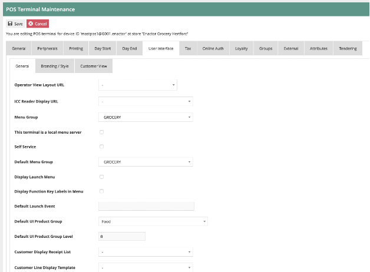

Set the following fields:

* Menu Group  - set to the Menu Group to which you have assigned the Rich Product Menu (I have used GROCERY in my example)
* Default Menu Group – as above
* Default UI Product Group – set to the Product Group you have maintained to hold the Rich Product group structure (I have used Food)
* Default UI Product Group Level - set to 0

### Inventory Configuration
The final Configuration step is to set up some example inventory levels.  These will be used by the POS and the Order Management system to ensure inventory is available to be ordered by the customer.

For each of the products you wish to order, you should:

* Set up Warehouse Inventory
* Set up Store inventory, if you wish to allow picking from the store

I will set up inventory at the Warehouse for an example product.  You can apply this approach to as many items as you wish.  Also, you may choose to import inventory data from an external source.  To assist with this, you may export example Item Inventory Levels.

#### Item Inventory Levels
Go to the Item Inventory levels configuration page using Search or the path *Configuration-Merchandise-Item Inventory Levels*.
 
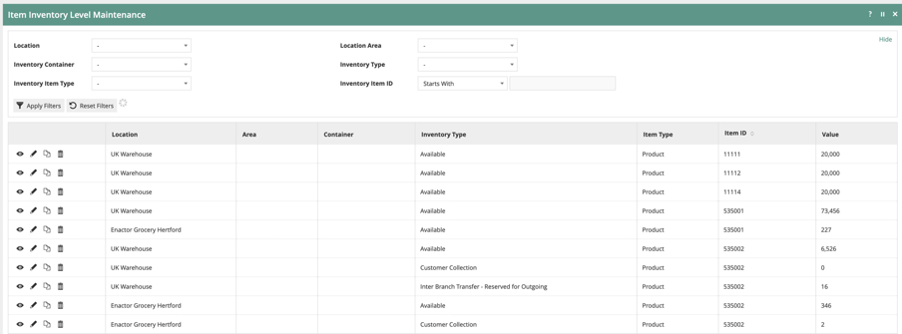

This will show the item inventory data that has already been maintained.

Create a new Item Inventory level record for the Warehouse you created above.  I am using product 535024
 
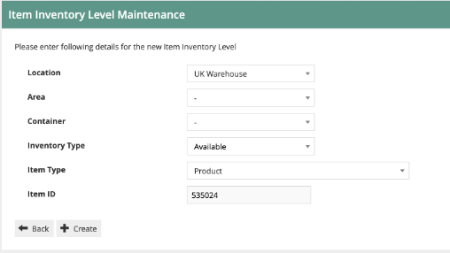
 
The Inventory Type should be set to “Available” : this means it is available for picking to fulfil orders.

Set the number available:
 
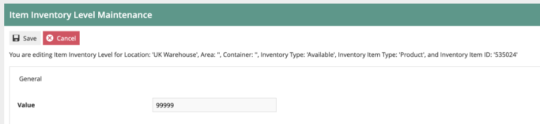

Save the inventory level.  You can repeat this process for each of the items you wish to be able to order.
You can also set local inventory at the store level if you wish.  The process is the same as above, but you will use the Store location instead of the Warehouse location.

This concludes the inventory configuration.

### Synchronising Configuration with the POS
Use the Broadcast functionality to send all the configuration changes you have made to your POS Device(s).  Refer to the “How to broadcast Configuration Data to stores and devices” guide if you need a reminder on this process.  Ensure the configuration has been received on the POS.

To use the Rich Product Search functionality on the POS, it is necessary to update the local indexes (Lucene).  This is a process that normally runs daily on the POS at 5am.  However, if you do not wish to wait, you can execute the process manually.  You only need to run this process if you have created or changed products that you wish to order.

Log onto the POS as a POS Admin user.  Then follow the menu path *Management-Admin-System Admin-Update Indexes*.  You will then get an acknowledgement:
  
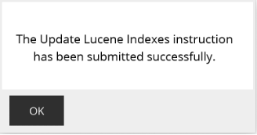

The time taken for the update process will depend on the volume of product data on the POS.  Normally for a POS with a small number of products, it should take only a few minutes.  You can check the progress of the job by looking at the Scheduled Jobs display: Management-Admin-System Status-Scheduled Jobs.  When the job has completed, it’s status will update to “Successful”. 

## Processing an Order on the POS
You are now ready to try creating an order on the POS.

### Rich Product Search
To start, go to the Rich Product Search page by clicking the “Products” icon at the top of the POS Screen.
 
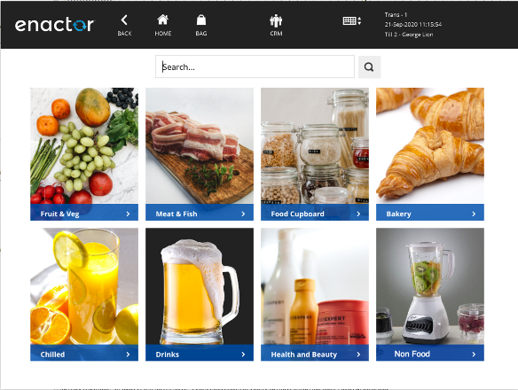

(Your menu will be specific to your environment).  You can then search for a product, or use the menu to browse to a category page.  You can search by Product Code, barcode or description.
 
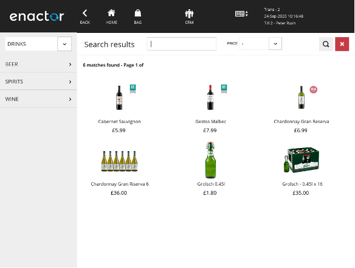
 
You can then select a product to view the product details:

This will show rich data, including images and product information.  It will also show local stock levels.
 
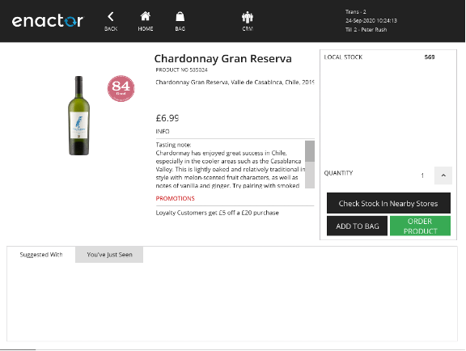

You can click on “Check Stock in nearby Stores”. This will show inventory levels at any nearby stores, plus the warehouse(s).

To order this item, click on the “Order Product” button.  If you wish to order more than one, choose the quantity first then order.
Note: clicking “Add to bag” button will create a “Take” sale for the product, and will not put the POS into “Order” mode.

### Order Basket
Once you have ordered the item, you will be returned to the basket view:
 
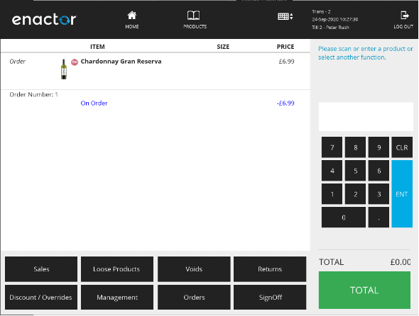

Note that the item is marked as “Order”, an Order Number has been assigned (Order no. 1 in this case), and there is a total “On order” value of £6.99.
The total value of the basket is considered to still be £0.00 because ordered items are not considered to be part of the basket total.
At this point, you can add more items to the basket, or you can complete the order.

To complete, click the “Total” button.

### Completing Order Capture
You will then be taken through the Order Checkout process.

#### Customer Details
First you will be prompted for Customer Details:
 
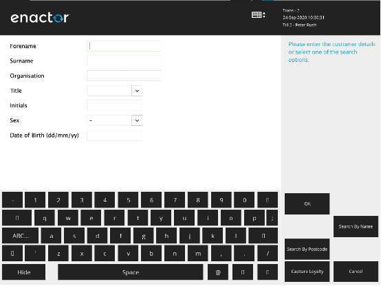

You can either key in the customer details manually, or if you have customer/loyalty data available, you can search for the customer (e.g. by name or postcode).
There may be several customer data capture screens.

#### Delivery Options
Once you have entered the customer details, you will be taken to the “Delivery Options” page.  This is where you select the destination for the order.  The order may be sent to the customer’s address, or you can select Collect from Store. Alternatively if the goods are available in the current store, the customer can take them immediately.
 
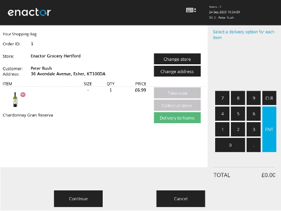

When you have multiple items on the order, you can select different options for each item.

If the customer wishes to have the goods delivered to a different store, you can choose this at the top of the screen

Once the delivery options have been selected, click on Continue.
If you have selected “Delivery to Home”, you will be taken through Destination Address entry pages.  These will default to the Customer address, but you can change to a different address if you wish.

The next page is for “Delivery Status” messages.  This confirms how the customer will receive updates on their order.
 
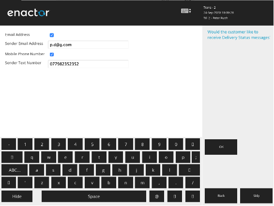

There is then a Delivery Instructions page.  This is for messages to the courier company.

#### Deposit Entry
The next step is to choose the deposit amount.  The values here are dependent on the Order Deposit reasons that have been setup (see Customer Order Deposit above)

If only one deposit reason is configured (e.g. always 100% up front) then the deposit reason capture is skipped.

#### Payment
Once the deposit amount is confirmed, you will be taken to the Payment (Tendering) page:
 
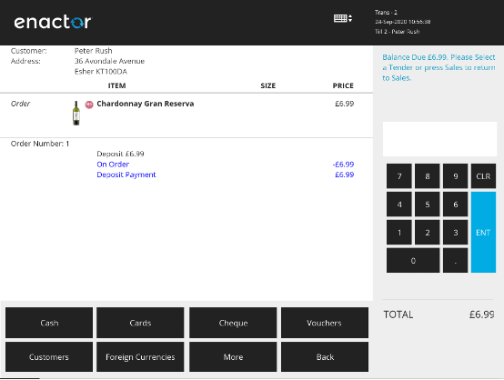

(In this example, the customer is paying a 100% deposit).

This is similar to the normal POS payment page.
Choose the tender type(s) and values that the customer wishes to use.  Once the order deposit value is fully paid, the transaction will complete and the order receipt should be printed.  If email receipts are enabled, the receipt printing menu will be presented.
 
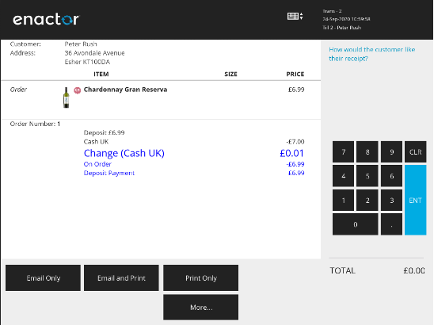

The order capture is now completed.
 
## Checking the Order in the Estate Manager
Once the order has been completed on the POS, is is initially created as a POS transaction (containing all the order details).  The POS transaction will then be submitted to the Estate Manager, like all other POS transactions.  Once there, it is processed and the Customer Order is created.
Here is an overview of the process
 
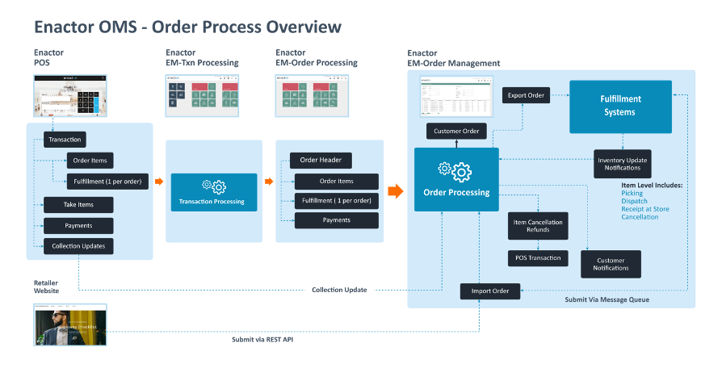

Once it has been processed by the Estate Manager, you can then view the Customer Order using the Customer Orders Maintenance UI.
In the EM, navigate by Search to Customer Orders or use the Menu Path Operations-CRM-Customer Orders.
 This will show all the orders on the system.  You can use the filters to find the order(s) you are looking for.
 
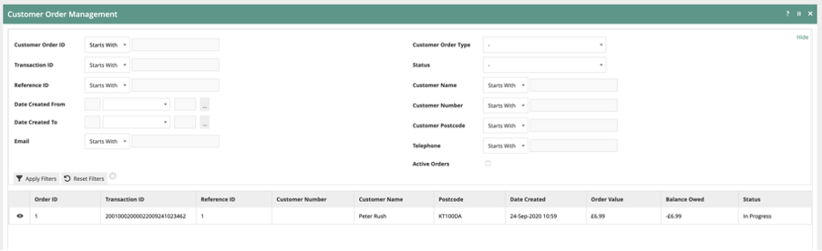

 To view or edit the order, click on the view (eye) icon.  This will display the order details:
 
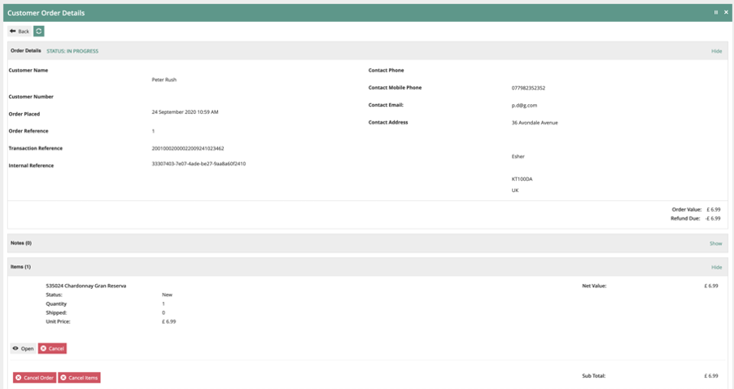

This displays the order header information (including customer and address details).
It also shows each of the items on the order.
The order header and item-level statuses are also shown.

 
