# POS Styles and Themes
## Introduction

The purpose of this guide is to show how to configure Themes and other Styling components to allow you to style the Enactor POS application to meet your organisation’s branding requirements.

There are two approaches to managing the styling on the POS.  The first uses Stylesheets and images which are uploaded and configured using the Estate Manager, and are then broadcast to the POS as for normal configuration data.

The second approach uses custom “Themes” that are deployed onto the POS as part of a custom POS installation.

This how-to guide will cover both approaches.

### Overview
The following steps are required to configure POS Styles and Themes:

* Stylesheet Configuration
* Image Category Configuration
* Image Configuration
* POS Terminal Configuration (Stylesheets and Images)
* Theme Configuration
* POS Terminal Configuration (Themes)
* Rich Product Menu Configuration

## Prerequisites

### Resources
Before starting, you should have the following resources in place:

* Enactor Estate Manager
* Enactor POS (configured within the UK Region, connected to the Estate Manager)
* Standard Configuration, including:
	* Base Configuration
	* UK Retail (I have used UK in this example, but it could be other regional config packs.)
* Examples of Data to be used as models, particularly product data

 
###Prior Training/Experience
You should be familiar with the following:

* Estate Manager configuration
* Enactor configuration concepts, including Locations, POS Terminals, Products etc.
* Data broadcasting
* Standard POS Sales processes

## Configuration Steps

### Stylesheet Configuration
The Stylesheet is a document containing the rules for how the POS application should appear, including fonts, colours and images.  It is combined with a set of templates that define the structure of the POS Pages, and a set of images, to provide the final User Interface design:

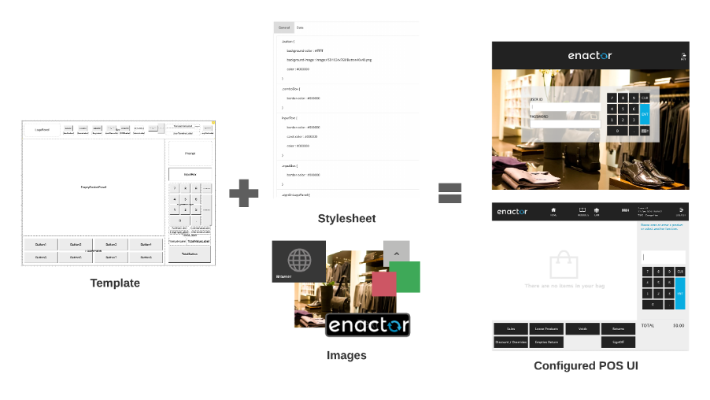
 
The stylesheet may be maintained using standard CSS editing tools and techniques.  An existing Stylesheet should be used as a model, to ensure all the required styles are included.

The main components of the stylesheet that will be maintained comprise:

* Colours – entered as hexadecimal RGB codes, e.g. #FF3344:  
* Images – these use a standard URL Structure e.g. 	image://ImageCategory/Button40x40.png. This URL relates to the images and image categories that have been created/uploaded for this POS UI
* Fonts: these normally come from the template, but may be overridden with the stylesheet

To configure a stylesheet, navigate to the Maintenance utility in the Estate Manager using search or the path *Configuration-Organisation-Stylesheet Maintenance*.
 
 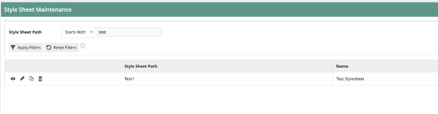

Click the “Create Style Sheet” button to create a new style sheet.

Enter the Path of the style sheet.  This will be a path structure based on an existing Enactor POS theme.  For example, a stylesheet that is a child of the Enactor NextGen1024x768 theme may have the path “NextGen1024x768/Test1024x768”

 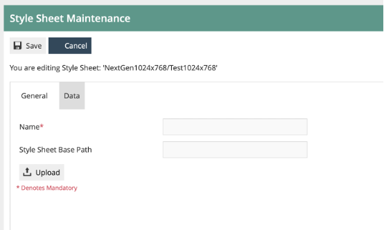

On the next page, enter a Name for the stylesheet.  
The Base Path field is not required.

Then Upload the CSS file that will be the basis of your stylesheet.  This may have been provided by Enactor, or edited externally using a 3rd party tool.  Click the Upload button, then browse to find the file on the filesystem.  Then click Upload.
 
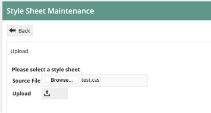
 
If you then navigate to the Data tab, you will see the CSS content.  The CSS cannot be edited on this page.  If editing is required, this should be done externally and the file re-uploaded.

Once the file is uploaded, you may Save the Stylesheet.

:::note
Once the CSS file is uploaded to an Enactor Stylesheet and saved, it is recorded internally in Enactor in XML format.  This is the format used if Enactor broadcasts or exports the Stylesheet data.  Do not confuse the CSS file (which may only be uploaded to Enactor using the Stylesheet maintenance utility) with the Enactor Stylesheet XML, which operates in the same way as all other Enactor master data XML entities.
:::

This concludes Stylesheet configuration.

### Image Category Configuration

Image Categories are used to classify different types of images within Enactor.  Several Image Categories are provided with Enactor initially.  More categories may be created to hold different sets of images for use within POS UI configurations.

As noted above, the standard image URL for each POS image contains the Image Category as a folder path.  E.g. image://TestCat1024x768/Button40x40.png points to a standard-sized button image in the TestCat1024x768 folder.

When images are deployed to the filesystem on the POS (which is done automatically by the data broadcast & receive process) they will be located within folders matching the Image Categories.

To configure Image Categories, navigate to the maintenance utility using Search or the path *Configuration-Media-Image Categories*.

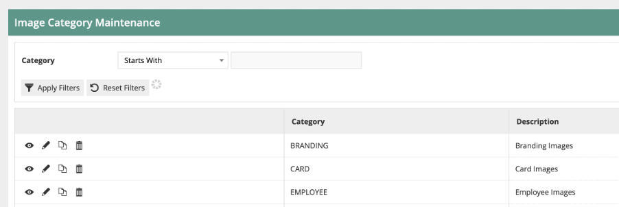

To create a new category, click on “Create a new Image Category”.
 
 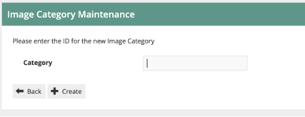

Give the Category an appropriate ID.  Often this will include the resolution of the UI (e.g. 1024x768, 1920x1080) so it is clear to which scale the images in the category relate.

 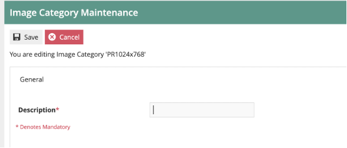

Then give the Category an appropriate name and save.  This concludes image category maintenance.

### Image Configuration
Now we have an image category, we can upload the images required for the User Interface.  The Images will each belong to the category we have created, and will be referenced in the Stylesheet.

To create the image records, navigate to Image maintenance using Search or the path *Configuration-Media-Images*.

 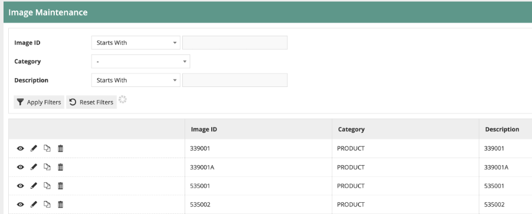
 
The Image maintenance utility is used to manage several categories of images, including those used for products, receipt logos etc.

Start by selecting the Image Category you have created from the dropdown.  You will then have an empty list as no images have been created for this category yet.

 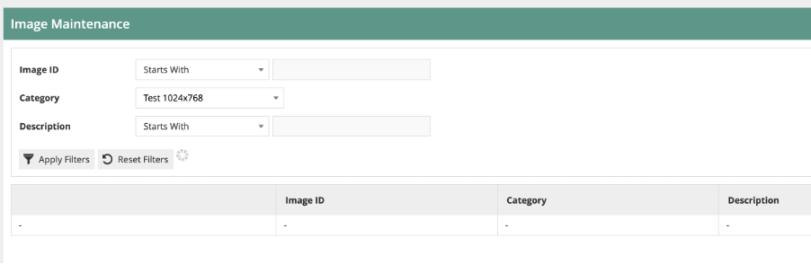

Start a new image by clicking “Upload a new image”.

 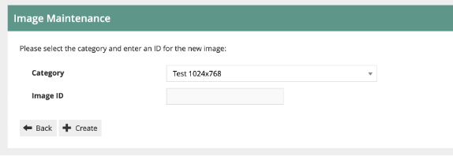

The Category should be preset to your image category.  Give the image ID the name of your file, excluding the extension.  So testimage.png would have an image ID of testimage.  Here I am uploading a background image.

 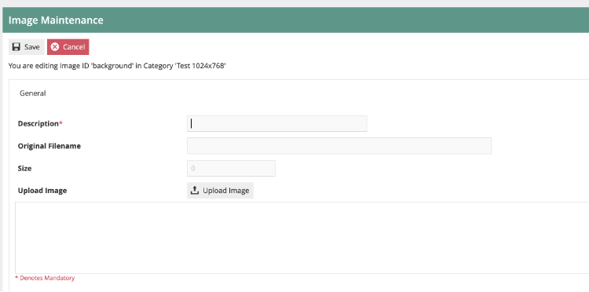

Give the image an appropriate description.  Then click on “Upload Image” and browse to find the image file on your local filesystem.
 
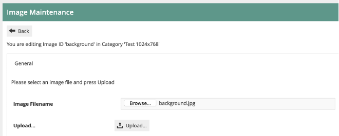

Then click Upload… to load the file into the Estate Manager.

 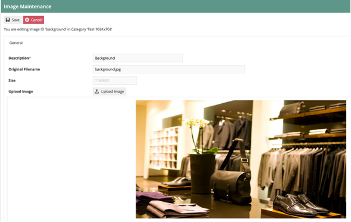

The utility will show a preview of the image, and the filename and size will be populated.  Save the image record.

Then repeat this process for all the images required by your stylesheet.

This concludes the image configuration step.

### POS Terminal Configuration (Stylesheet and Images)
The final configuration step is to apply the stylesheet you have configured to your POS Terminals/POS Terminal Templates.  This will then make the changes effective.

Navigate to POS Terminal Configuration using Search or the path *Configuration-Organisation-POS Terminals* or *Configuration-Organisation-POS Terminal Templates*.

Then select the POS Terminal/Template you wish to modify, and click on edit.
Then switch to the User Interface Tab, and the Branding/Style sub-tab:

 

The Operator View Theme should be set to the parent theme of which your stylesheet is a child (see Stylesheet maintenance above for reference).  

Then select the Operator View Style Sheet drop-down.  Select your Stylesheet name from the list.
 
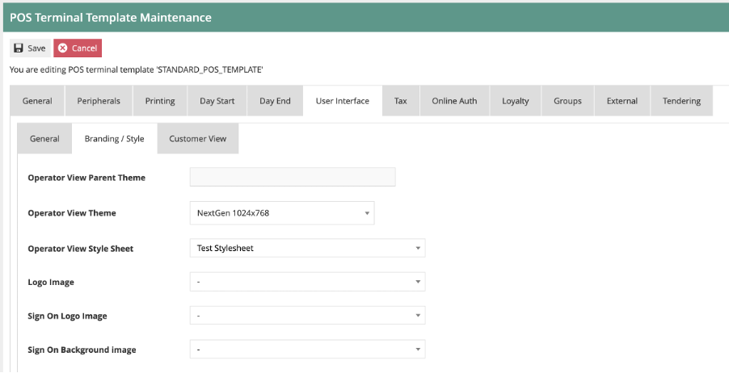

Save the POS Terminal/POS Terminal Template.

This concludes the POS Terminal configuration Step.  All the configuration required to set the Styling of the POS UI is now complete.  Broadcast all the amended entities to your target POS Device(s).  Once they have been received, restart the POS application.

You should see the reconfigured POS user interface displayed.
 
### Theme Configuration
The alternative approach to POS UI configuration is to use a Theme.  This theme will have been developed, either by Enactor, a partner, or an in-house development team.  The Theme will be installed on the POS along with the rest of the POS application.  It will then need to be configured, to ensure the POS devices use the appropriate theme(s).

The development team will provide a Theme xml file.  This should be uploaded to the Estate Manager using the File Importer.

Once the Theme xml has been imported, it should then appear in the Theme Maintenance utility (Navigate to Theme Maintenance using Search or the Path Configuration-Organisation-Theme):

 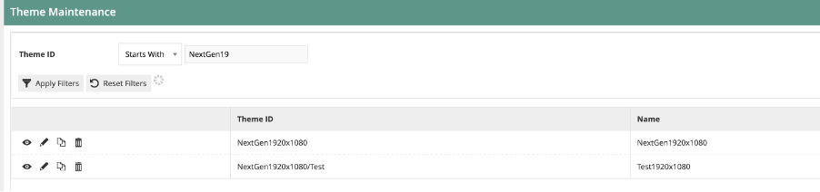

To review the theme, click on view or edit.  The Page Definition tab lists all the Page Definitions that are included in the Theme.  This should not normally be amended.

This concludes Theme configuration.

### POS Terminal Configuration (Themes)
Once the Theme has been uploaded and checked, it may be assigned to the appropriate POS Terminals/POS Terminal Templates.  This will then make the changes effective.

Navigate to POS Terminal Configuration using Search or the path *Configuration-Organisation-POS Terminals* or *Configuration-Organisation-POS Terminal Templates*.

Then select the POS Terminal/Template you wish to modify, and click on edit.
Then switch to the User Interface Tab, and the Branding/Style sub-tab:

 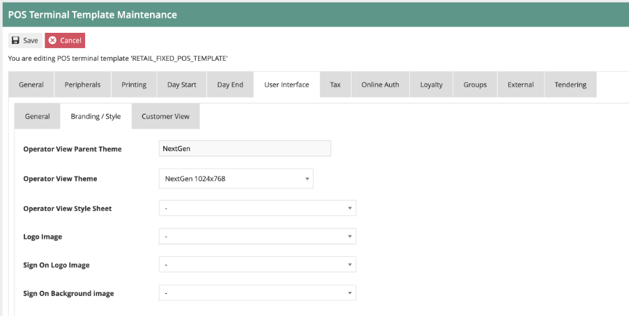

The Operator View Theme should be set to the name of the Theme you have uploaded:
 
 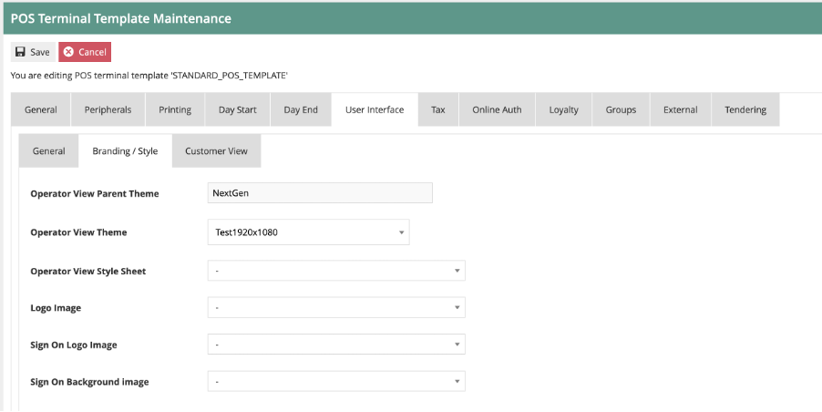

Once this has been set, you may save the POS Terminal/POS terminal Template.

This concludes the POS Terminal configuration Step.  All the configuration required to set the Styling of the POS UI is now complete.  Broadcast the amended entities to your target POS Device(s).  Once they have been received, restart the POS application.

You should see the reconfigured POS user interface displayed.

 
