# Store Inventory Management
## Introduction
The purpose of this guide is to show how to configure the Enactor Estate Manager and POS to enable the Inventory Management capabilities of the solution.  While very little configuration is needed to activate the functionality itself, there are numerous options within various master data components that will impact the overall capabilities and experience.

The Enactor Inventory Management application is not only responsible for tracking store level inventory as it is impacted by retail transactions, but it also provides the necessary functionality to track and manage inventory as it traverses the retailer’s supply chain.  The associated Inventory Management operations are largely managed Business Processes. 

### Overview
The following areas will be reviewed as part of establishing Inventory Management:

* Inventory Management Preferences
* Products
* Locations
* Suppliers
* Inventory Types
* Reason Codes

## Prerequisites
### Resources
Before starting, you should have the following resources in place:

* Enactor Estate Manager
* Enactor POS, connected to the Estate Manager
* Standard Configuration, including:
	* Base Configuration
	* Products

### Prior Training/Experience
You should be familiar with the following:

* Estate Manager configuration
* Enactor configuration concepts, including Locations, POS Terminals, Products etc.
* Data broadcasting
* Inventory Management operations
* Inventory Levels and Inventory Types

 
## Configuration Steps
### Inventory Management Preferences
The Inventory Management Preferences are set by default.  No changes are required to enable Inventory Management functionality.  Changes may be required to ensure the tracking and valuation of inventory meets your retailer’s requirements.

The Inventory Management Preferences Maintenance application can be accessed through:  *Configuration-Inventory-Inventory Management Preferences*. 

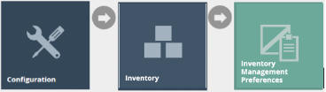

Select Preference Set ID 1 for editing.

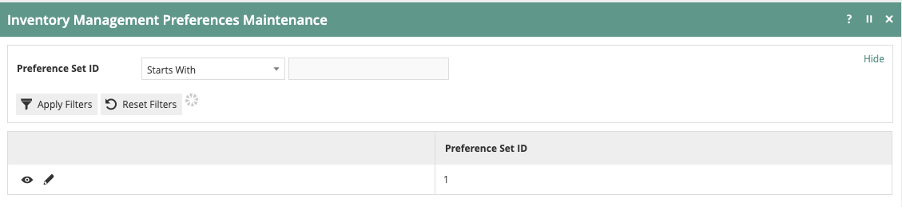
On the General tab, the first setting to consider will be “Distribution Responsibility”.  The choices for this setting are “Source” or “Destination”.  Quite simply, this setting defines which location “owns” the inventory while in transit.  This setting should be made based on the retailer’s accounting practices.

 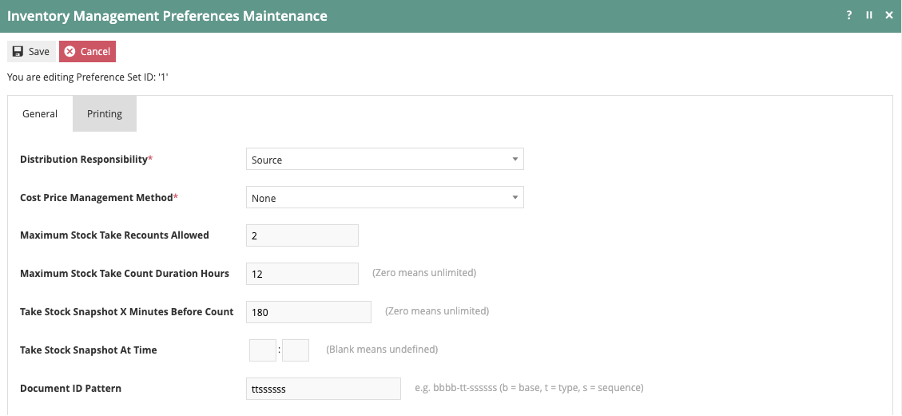

The next setting on the General tab is “Cost Price Management Method”.  The choices for this setting are “None”, “FIFO”, “LIFO”, “Cost” or “Average Cost”.  As above, this setting should be made based on the retailer’s accounting practices.

Also, on the General tab, there are several settings related to the Stock Take function.  When a Stock-Take is initiated, the system will suggest a deadline for Stock-Take completion and a time at which the inventory snapshot will be taken.  Changes to these settings will be drive the default values as Stock-Take requests are submitted.  These values should be changed to match the retailer’s preferred business process.

On the Printing tab, you are able to specify if any of the documents associated with the standard Inventory Management transactions should automatically be generated as a PDF or printed as part of the standard business processes.

 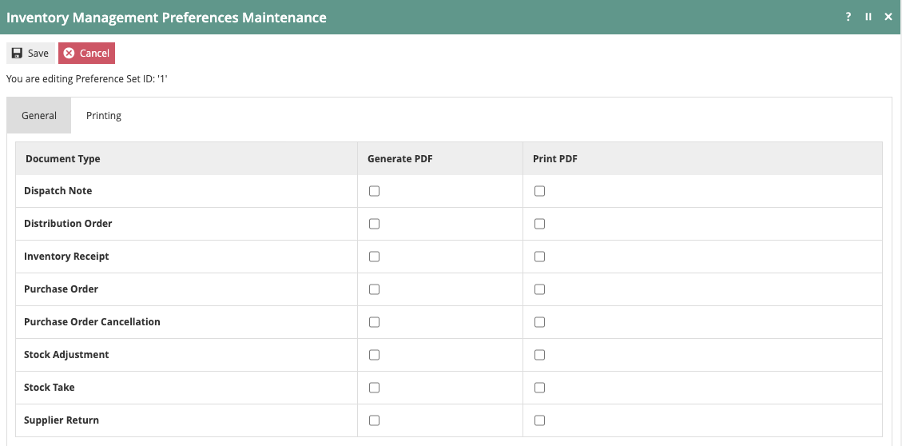
 
### Products
A separate guide has been published on setting up base product data (see: ‘How to configure example Product Data’).  This guide will only deal with the aspects of product setup that support or impact Inventory Management.

While all product data will likely be provided by an integration to the retailer’s ERP system, the following section will demonstrate how these changes can also be made directly within Estate Manager.  

The Product Maintenance function can be accessed through: Configuration-Merchandise-Products.  Use the filters provided to locate and select the desired product. 

 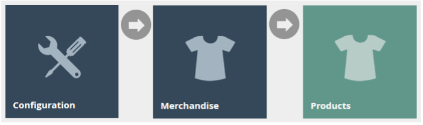

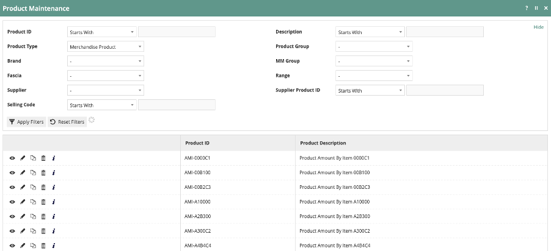
 
Once the product has been selected, click on the “Merchandise” tab.

 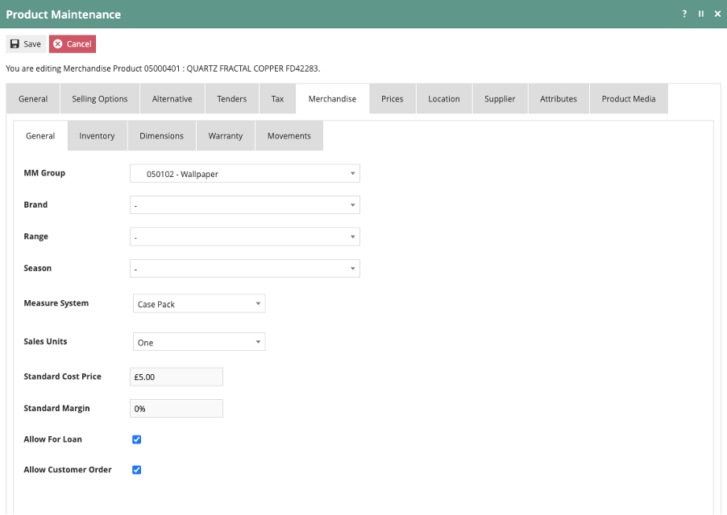

Some settings within Product Maintenance will not impact user functionality but may provide meaningful data to other processes.  On the Merchandise-General tab, it is possible to define a “Standard Cost Price” and a “Standard Margin” amount.  These entries may be used by your retailer to arrive at an inventory valuation as discussed in the section on Inventory Management Preferences.

Also, on the General tab, it is possible to designate if an item is allowed to be loaned out or if it can be sold as a customer order instead of from stock.

The Inventory tab contains several settings that directly impact the ordering of a product.

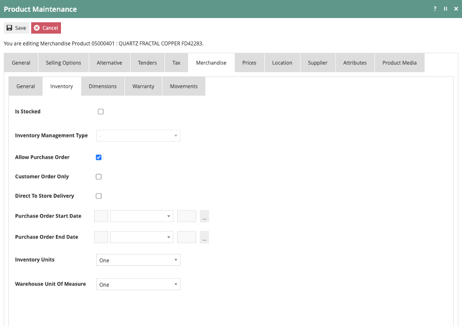
 
The “Is Stocked” option only applies to constituent products and is used in relation to the inventory management of Composite Products.  The “Inventory Management Type” option is available in the event that the product inventory needs to be tracked and managed at the serial number level which is often the case for high-value goods.

Selecting the “Allow Purchase Order” option permits a purchase order to be raised against the item.  Additionally, if the “Direct To Store Delivery” option is selected the product may be shipped directly from the supplier to the store without passing through the retailer’s own distribution channel.  The “Purchase Order Start and End Dates” make it possible to specify a date range as to when Purchase Orders can be raised.

The “Customer Order Only” option will prevent the product from being sold from store stock.  The product can only be sold through a customer order.

Options for “Inventory Units” and “Warehouse Unit of Measure” are derived from the values selected for “Measure System” and “Sales Unit” as part of the standard product setup.
 
The Dimensions tab allows the recording of product dimensions, weight and general size statement.  This information could be used by other applications to provide things like slotting assignments or boxing recommendations for orders.

 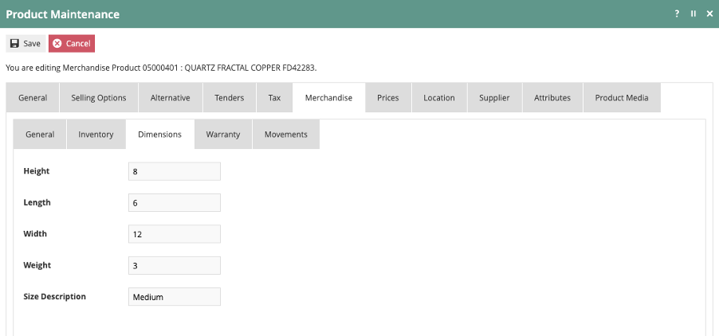

The Location tab captures properties relating to the product at the selected location.  After clicking on the Location tab, select a location from the left-hand column.

 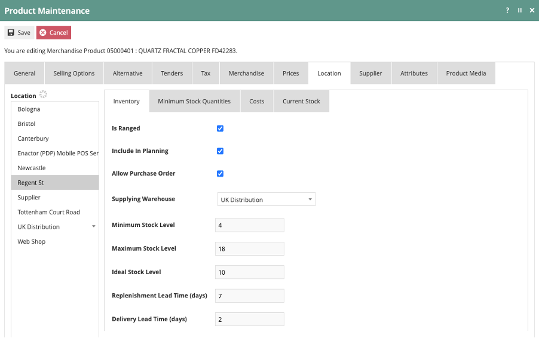
 
The “Is Ranged” option indicates that the product is part of the selected location’s normal stock range.  If “Include in Planning” is selected, the store will be included in any planning for that product.

When “Allow Purchase Order” is enabled, the store will be allowed to raise a purchase order for the item.  Those purchase orders would be created as direct delivery.  The “Supplying Warehouse” permits the selection of which warehouse is assigned to fulfil the selected product to the selected store.

Additional fields are provided on the Location-Inventory tab to specify Minimum, Maximum and Ideal stock levels.  Standard Replenishment and Delivery Lead Times can also be added.

The Minimum Stock Quantities Sub-Tab captures required minimum stock levels to be applied by the Inventory Management System. Levels may be specified with a period dependency at a level of granularity required by the business for the individual Product and Location. Minimum stock level may be specified for a specific period (or number of periods) of the year and varied from year to year. 

 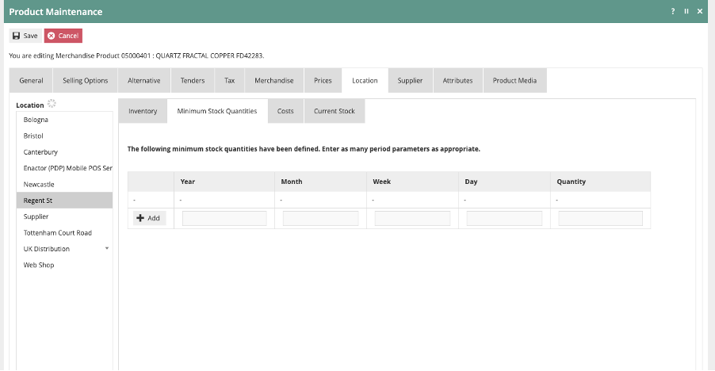

To add a Period-Minimum Stock Level specification to the list, enter the properties defining the period and the required Minimum Stock level then select the **Add** option. To remove entries, select the Rubbish Bin Icon option: 
 
 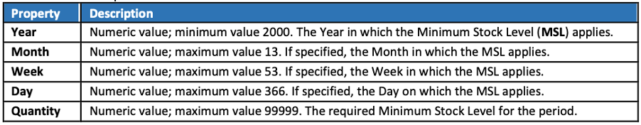
 
The Location Costs Sub-Tab, as illustrated below, captures manual entries of Cost details for the Product at the selected Location. Details for the selected Inventory type are added to a list when the User selects **Add**. The List is normally populated automatically if Inventory Preference **Cost Price Management Method** is not set to NONE in the Estate Manager Configuration>Inventory>Inventory Management Preferences. The Cost Details are captured in properties described in the following table: 

 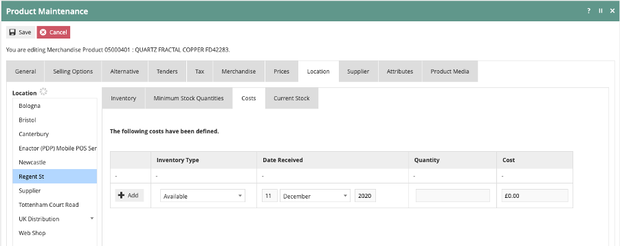
 
 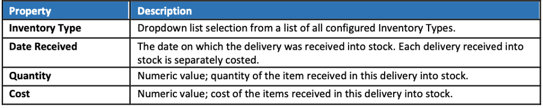

### Locations
The core configuration for Locations is covered in the ‘How to configure a New Store’ guide.  This guide will cover the specific location settings that impact Inventory Management from.  This guide will also show how to create a Warehouse Location.
 
Locations are accessed using the Locations option, obtained via the selection sequence shown: 

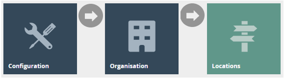

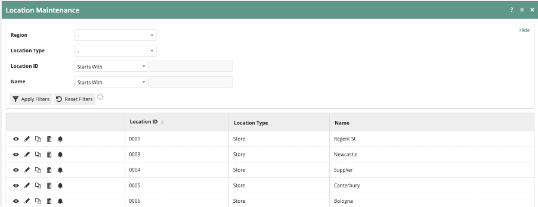
 
To create a Warehouse Location, click on “Create a New Location”.  Select a Location Type of “Warehouse”, assign a Location ID and click “Create”.
 
 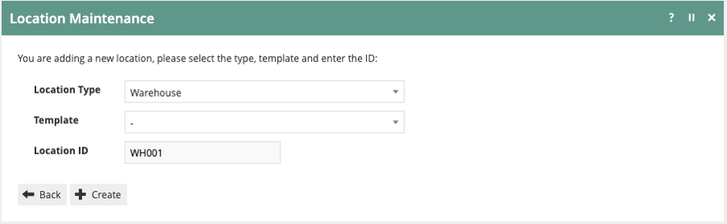
 
Generally, the information needed to setup a warehouse is the same as what is required for a store setup.  On the General-General tab, a warehouse “Name” and “Region” selection are required.  As with stores, a default “Locale” should be assigned as well as the appropriate MMG Group.
 
 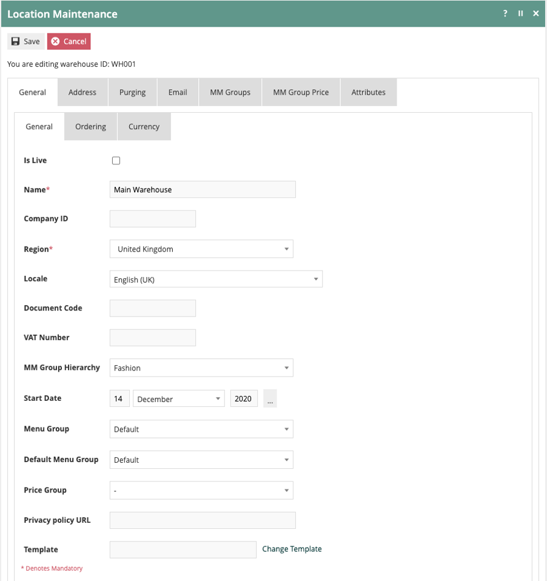
 
The General-Ordering tab is also very similar to that of a store location.  This allows additional control over how the warehouse will interact with customer orders. Direct settings are provided on the General-Ordering tab to specify if the location can “Accept Collection Orders” or "Accept Reservation Orders”.  Additionally, it is possible to specify if the location is authorised to “Fulfil Collection Orders” or “Fulfil Delivery Orders”.  A location can also be restricted from using stock on hand to fulfil collection Orders.
 
 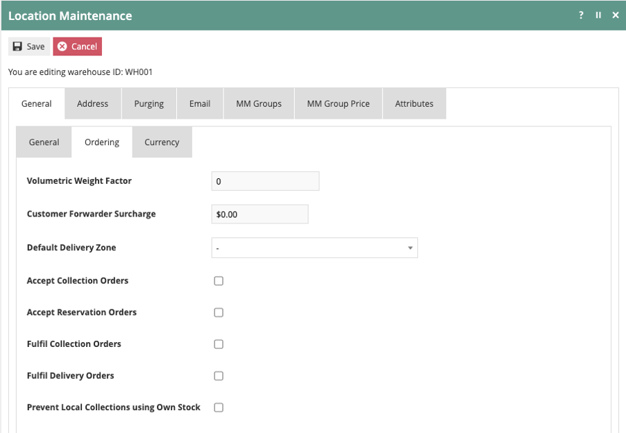
 
All other location settings very closely mirror the default location setup steps.

To configure store specific Inventory Management settings, return to the Location Maintenance screen and choose a store location.  After selecting a store, navigate to the General-Ordering tab.
 
 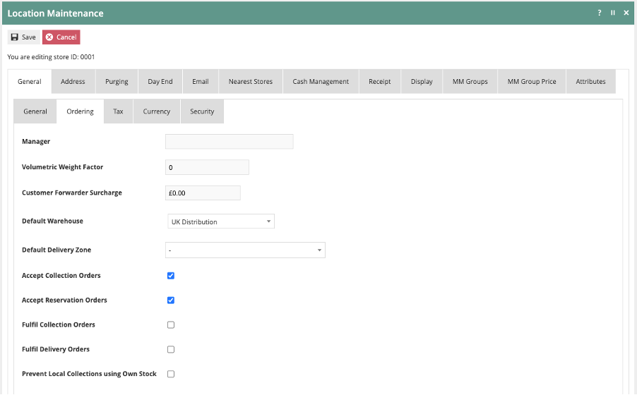
 
On the Ordering tab, the “Default Warehouse” is selected for a location.  This represents the location where stock should be drawn from to fulfil orders.  On the Ordering tab, it is also possible to specify if the location can “Accept Collection Orders” or Accept Reservation Orders”.  Additionally, it is possible to specify if the location is authorised to “Fulfil Collection Orders” or “Fulfil Delivery Orders”.  A location can also be restricted from using stock on hand to fulfil collection Orders.

### Suppliers
If Enactor will be used to order product from external sources, it will require the setup of Suppliers.  Based on the Product and Product-Location settings discussed previously in this document, purchase orders may be raised to suppliers from stores, warehouses or both.
 
Suppliers are accessed using the Supplier option, obtained via the selection sequence shown:

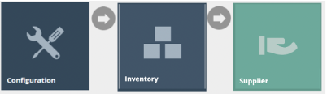

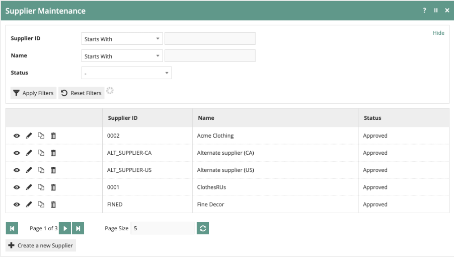
 
To add a Supplier, click on “Create a new Supplier”.  After entering the Supplier ID, the Supplier Configuration will be presented.
 
 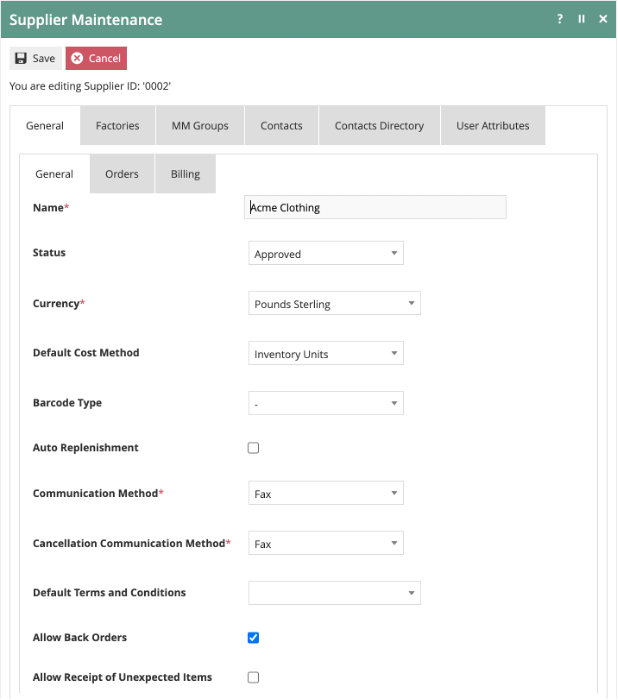
 
On the General-General tab, the Supplier “Name” and “Currency” are required.  Additionally, “Communication Method” and “Cancellation Communication Method” are also required as they drive specific activities within various business processes.  These settings determine how order and cancellation information will be shared with a supplier.  Current choices include: Post, Fax, File, Email, Email (CSV), Email (PDF) and None.  

It is important to note that it will not be possible to raise a purchase order for unless the “Status” is set to “Approved”.  Settings to “Allow Back Orders” and to “Allow Receipt of Unexpected Items” are also provided.  If “Allow Back Orders” is selected, orders can remain open after initial receipt to receive any items that were back ordered.  The “Allow Receipt of Unexpected Items” will allow the receiver to add items to the receipt that were not ordered but were delivered.
 
 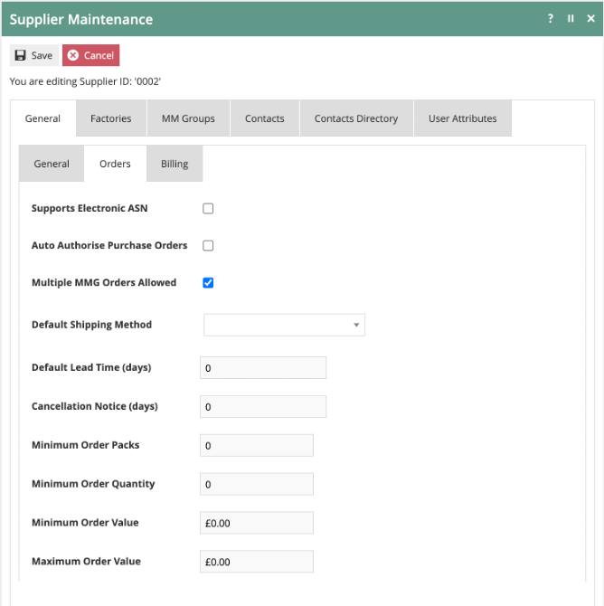
 
The General-Orders tab allows the configuration of several key order handling attributes.  The “Supports Electronic ASN” is selected if electronic ASN’s from this Supplier will be interfaced to Enactor.  If the Supplier does not Support Electronic ASN’s the system will automatically generate a receiving document to be used when the shipment arrives.

In the default business processes, Purchase Orders go through an authorization task.  The option to “Auto Authorise Purchase Orders” will skip that step if the person creating the Purchase Order also has the authority to approve the Purchase Order.

Other common settings found on the General-Orders tab include the ability to track a “Default Lead Time” as well as the necessary “Cancellation Notice” requirement.  Minimum and Maximum Order variables can also be specified.

If a Supplier is associated with different MM Groups, the MM Groups tab can be used to establish different order rules based on MM Group.
 
 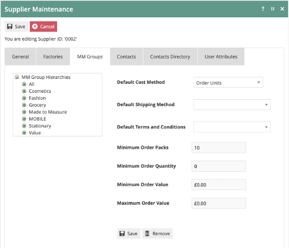
 
After an MM Group is selected in the left panel, MM Group specific Order settings can be selected in the right panel.  These settings will be enacted based on the MM Group specified on the Purchase Order.

The additional settings found on the General-Billing, Factories, Contacts, Contacts Directory and User Attributes do not impact the core Inventory Management functionality and are provided for general Supplier information.

### Supplier Products
Once a Supplier has been created, product must be associated to the supplier to permit ordering.  While this can be completed within Product Maintenance, adding this information one product at a time is too inefficient when working with a number of items.  The Supplier Products application provides a format to handle large data sets including direct copy-paste from a spreadsheet.
 
Supplier Products are accessed using the Supplier Products option, obtained via the selection sequence shown: 

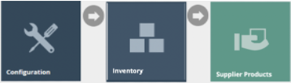

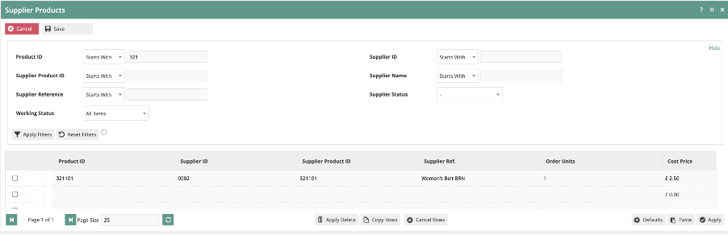
 
The Supplier information for any Product can be added or updated simply by adding values for the headers displayed on the form.

Large quantities of updates can be made by copying and pasting data from a spreadsheet.  To use this functionality, copy the data range from a spreadsheet without header row information.  Click the “Paste” button in the bottom right corner of the page.  At that time, a window will be presented to accept the copied data:
 
 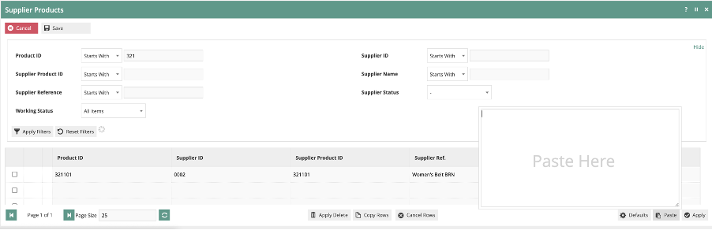
 
Once the data has been pasted, a mapping utility will be presented to associate the data column with the appropriate field.  Default values can also be specified at this point if needed.
 
 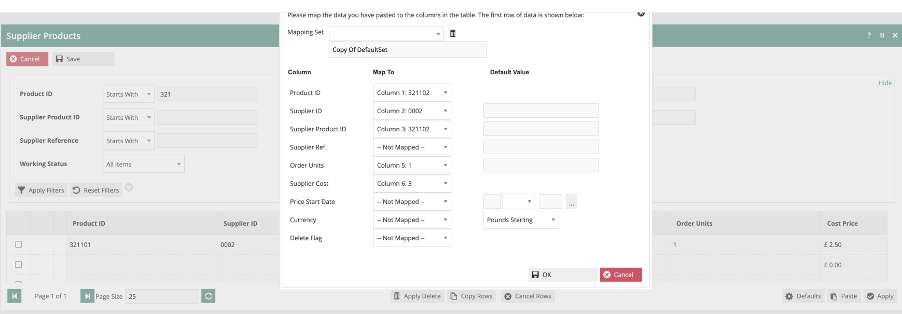
 
When the mapping is complete, click on “OK”.  The copied data will now be mapped onto the form in Estate Manager.
 
 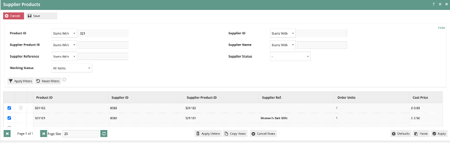
 
Clicking on “Save” will now commit these entries.

### Inventory Types
By default, a number of Inventory Types are created to account for various Inventory Type labels that are needed to track inventory as it flows through the supply chain.

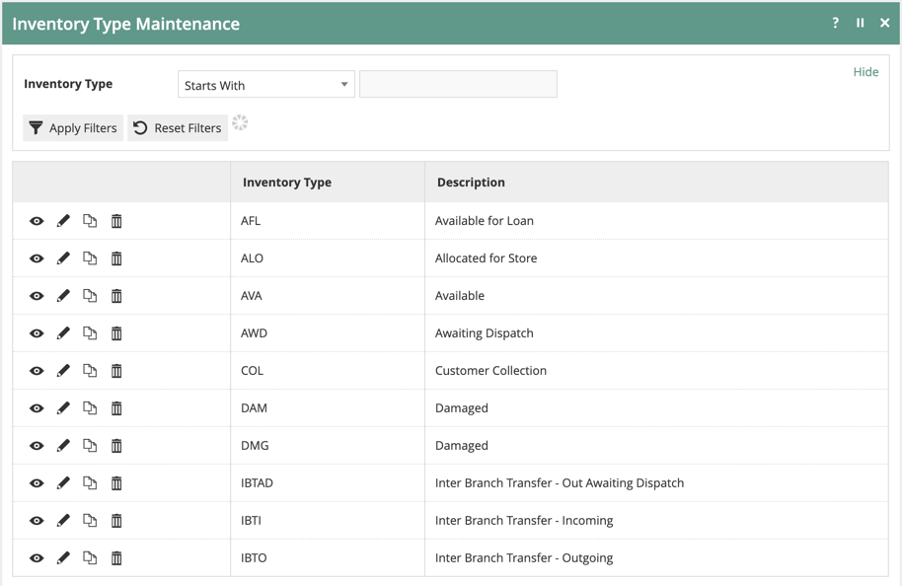
 
Inventory Types are essentially labels to be used by various Business Processes and, therefore, carry no configuration details.  To create an additional Inventory Type, simply click on “Create a new Inventory Type” followed by the “Inventory Type ID” and associated “Description”.
 
 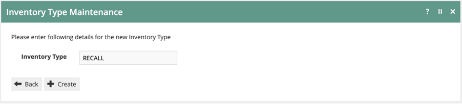
 
 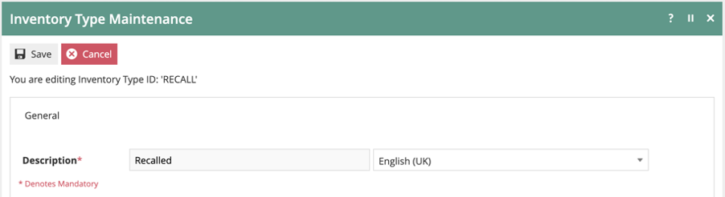
 
### Reasons
There are multiple Reason Types that are related to Inventory Management.  These Reason Types have the capability of moving Inventory between Inventory Types. Reason Types with the provision to alter Inventory Types include:

* Inter Store Transfer
* Item/Receipt Exchange
* Item/Receipt Return
* MMG Return
* Stock Adjustment

Using the Inventory Types mentioned in the previous section, these Reason Types allow associated Reasons to define an execute the inventory movement associated with the transaction.
 
Reasons are accessed using the Reasons option, obtained via the selection sequence shown: 
 
 
 
 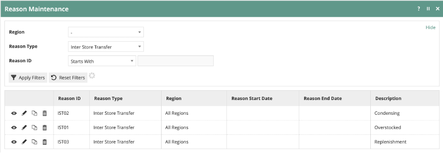
 
Return and Exchange related Reasons simply allow the specification of the inventory type that the merchandise should be allocated to upon completion of the return.
 
 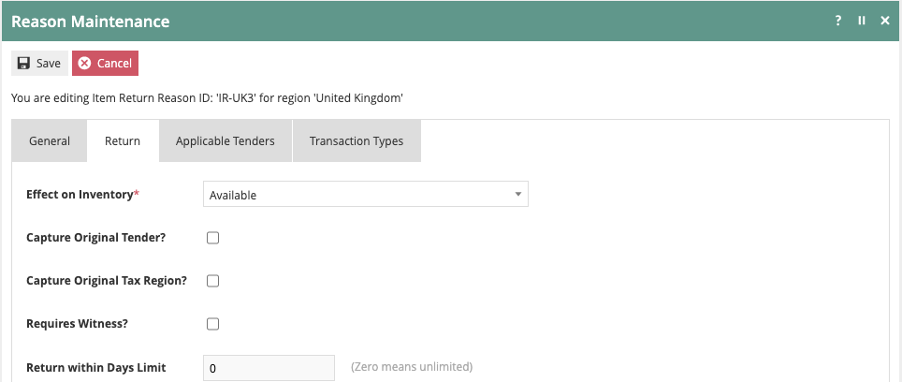
 
This is accomplished by simply selecting the desired Inventory Type in the “Effect on Inventory” setting.

Reasons associated with an Inter Store Transfer Reason Type allow specification of the Inventory Type that the product is being moved from.
 
 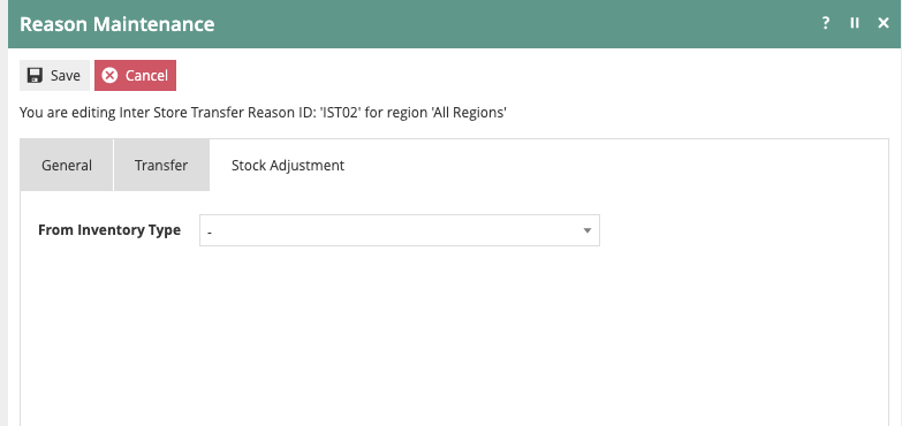
 
In the case of an Inter Store Transfer Limited Reason Type, the end Inventory Type can also be specified.
 
 

The Stock Adjustment Reason Type includes both the beginning and resulting Inventory Type.
 
In addition to the Inventory Type, a Stock Ledger Transaction Type can be optionally included.

 
