# Configuring Customer Communication Scripts
# Introduction

The purpose of this guide is to show how to configure Customer Order
Communication Scripts within the Enactor Estate Manager.

Communication Scripts are used to generate rich text emails and SMS
messages sent to customers. They are used to send

- Order confirmations

- Order notifications, e.g. dispatch or refund notifications

# Prerequisites

## Resources

Before starting to maintain a communication script, you should have the
following resources in place:

- Enactor Estate Manager

- Enactor Order Manager

- Standard Configuration, including:

  - Base configuration

  - Order Management configuration

## Prior Training/Experience

You should be familiar with the following:

- Estate Manager configuration

- Data broadcasting

- Order Management operations

# 

# Configuration

## Communication Script Maintenance

Communication scripts are maintained using the Communication Script
Maintenance application. The menu option is located in Configuration -\>
CRM, shown highlighted in this screenshot.

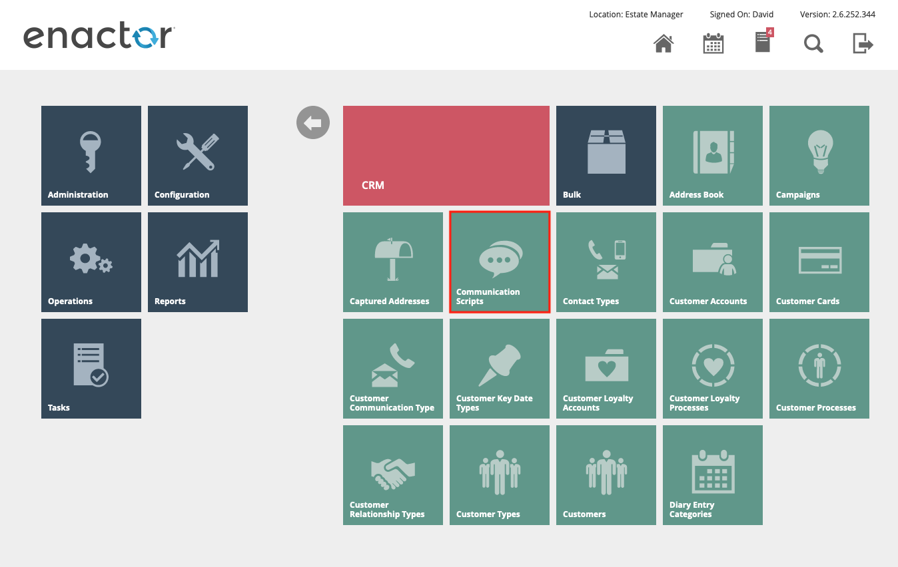

Selecting the menu option takes the user to the Communication Script
select page. An example is shown below, with the results filtered where
the name contains “store”. The four scripts shown are the order
confirmation and completion SMS and Email templates for an order to be
collected at a Store.

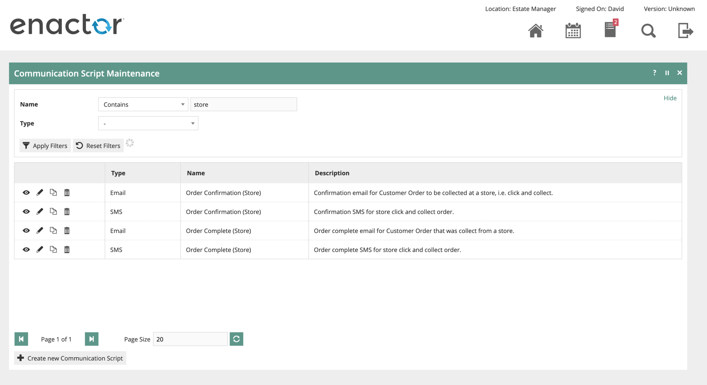

Editing the “Order Confirmation (Store)” communication script takes the
user to the General tab. If the communication script is relevant to a
CRM campaign, the campaign can be selected from the drop-down.

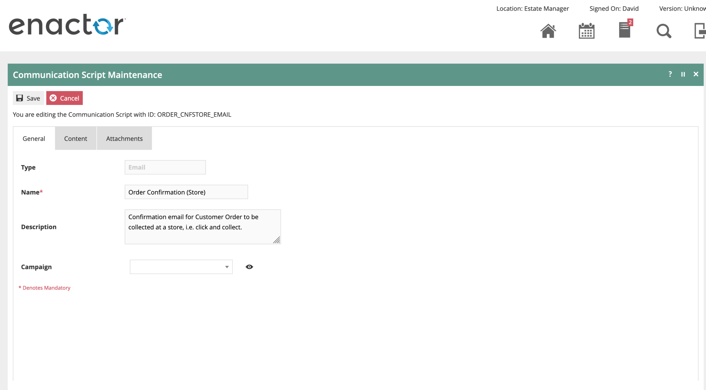

The next tab, Content, allows the user to edit the content of the
message. This communication script has been configured with the
following properties

- Content Type – the email will be sent with a content type of Rich Text
  (HTML). The alternative is Plain Text.

- Template Type – the template engine that will be used to generate the
  content is Apache FreeMarker. Other options are No Template and Simple
  Token Replacement.

- Editor Type – choose which editor is used in the Maintenance page to
  > edit the content. The options are Plain Text and Rich Text (HTML).
  > The two editors are shown in the screenshots below. Both editors
  > display the placeholders for the dynamic data elements. The HTML
  > editor will render the HTML static content.

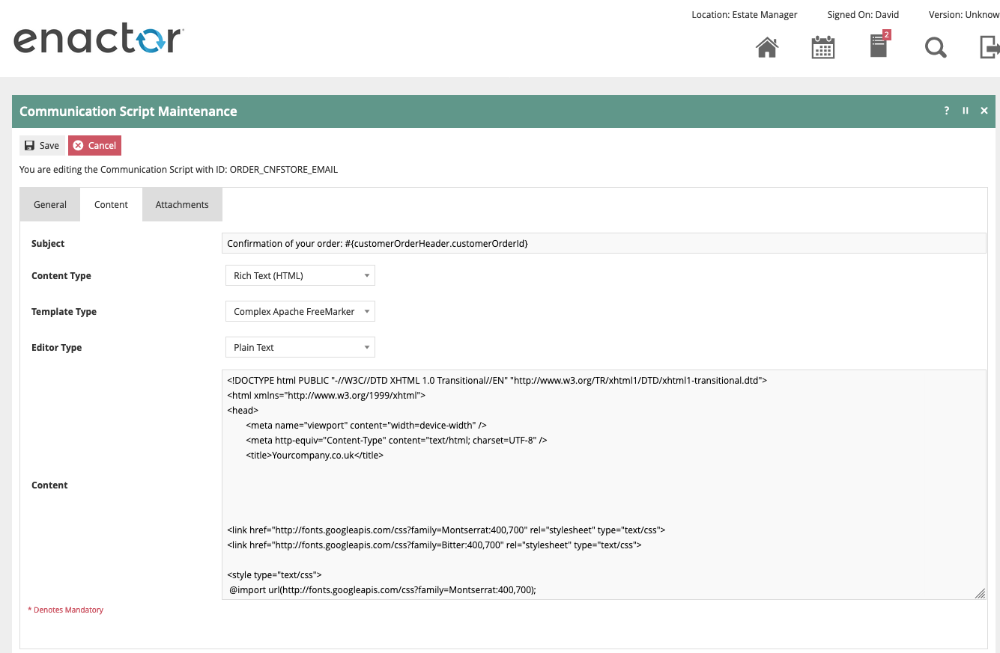

Rich Text (HTML) editor

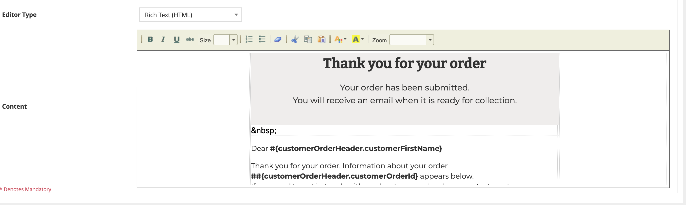

The final tab, Attachments, allows external files to be sent with the
email. The attachments can be referenced within the FreeMarker script
using the “cid:” notation, e.g.

\<a href="#"\>\\</a\>

It is, however, not guaranteed to be displayed inline if the email
client does not support the cid notation.

A complete example of an order confirmation email is shown in the
appendices to this document.

The email rendered by the example, styled FreeMarker template will be
similar to that shown below.

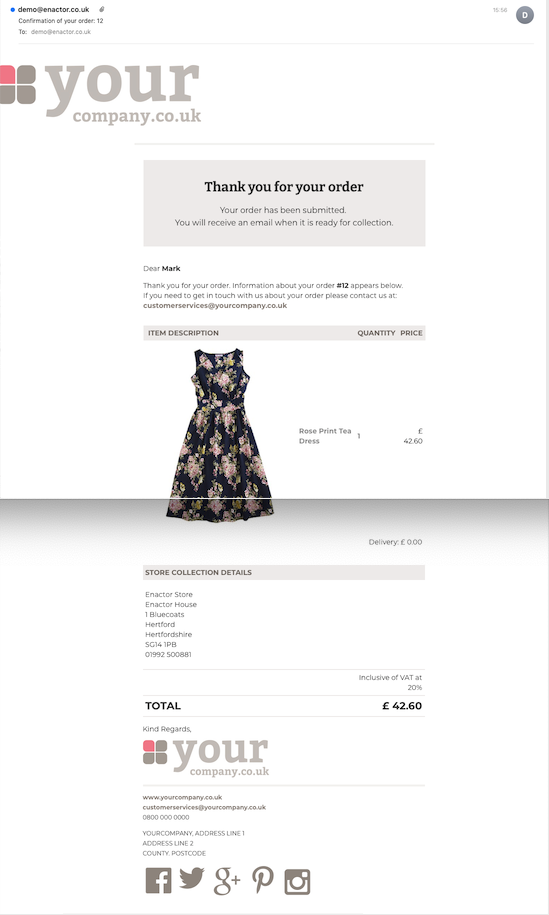

# Apache FreeMarker

## Introduction

The communication script content is written using Apache’s FreeMarker
language. From the FreeMarker website, <https://freemarker.apache.org>,
is this description.

> Apache FreeMarker™ is a *template engine*: a Java library to generate
> text output (HTML web pages, e-mails, configuration files, source
> code, etc.) based on templates and changing data. Templates are
> written in the FreeMarker Template Language (FTL), which is a simple,
> specialized language (not a full-blown programming language like PHP).
> Usually, a general-purpose programming language (like Java) is used to
> prepare the data (issue database queries, do business calculations).
> Then, Apache FreeMarker displays that prepared data using templates.
> In the template you are focusing on how to present the data, and
> outside the template you are focusing on what data to present.
>
>   />

Enactor’s implementation of FreeMarker performs exactly as described
above. A set of Java objects representing the Order plus the order’s
Items, Fulfilments and Payments are populated and passed to the template
engine along with the Communication Script content described above.

The output of the document generation from the static FreeMarker
content, combined with dynamic Java data, is an HTML email body.

A full FreeMarker reference and tutorial is here -
https://freemarker.apache.org/docs/dgui.html

# Integration with Customer Orders

## Java Objects

The Java objects available within the FreeMarker template engine are
firstly listed and then described in more detail. Example JSON
representations of the objects are included in Appendices at the end of
this document.

Note that not all data is available in all cases, for example if the
notification is being generated for dispatch of one fulfilment, then the
list of fulfilments will be limited to one.

- Customer Order Header

- List of Order Items

- List of Fulfilments

- List of Payments

- Customer

- Destination Location

- Products Map

- Product Images Map

- Sizes Map

- Style Attributes Map

- Colours Map

- Locations Map

The sections below describe a subset of the properties for each of the
types listed above.

### Customer Order Header

This object holds general properties of an order.

Object reference: customerOrderHeader

| *Property name*         | *Java Type*     | *Comments*                                                                                                                                                                                                                                                                      |
|-------------------------|-----------------|---------------------------------------------------------------------------------------------------------------------------------------------------------------------------------------------------------------------------------------------------------------------------------|
| customerOrderId         | String          | Unique order ID.                                                                                                                                                                                                                                                                |
| createdByUserKey.userId | String          | User ID of the POS user during order take on.                                                                                                                                                                                                                                   |
| createdAtLocationKey.   | String          | Location ID of the POS during order take on.                                                                                                                                                                                                                                    |
|                         |                 |                                                                                                                                                                                                                                                                                 |
| locationId              |                 |                                                                                                                                                                                                                                                                                 |
| createdDate             | DateTimeWith-   | The date the order was created. If order take on was at the POS, this is the date and time of the transaction. The Java type is an Enactor extension to Java Calendar class. See below for a formatting example.                                                                |
|                         |                 |                                                                                                                                                                                                                                                                                 |
|                         | TimeZoneAdapter |                                                                                                                                                                                                                                                                                 |
| customerOrderTypeId     | String          | The order type ID of the order. Within Enactor there may be orders of different types, e.g. one order type per channel. Displaying the customer order type in an email to the customer may not be useful, but using the order type to conditionally display information may be. |
| customerTitle           | String          | The title captured for the customer.                                                                                                                                                                                                                                            |
| customerFirstName       | String          | The first name of the customer who created the order.                                                                                                                                                                                                                           |
| customerPostcode        | String          | The customer's postcode.                                                                                                                                                                                                                                                        |
| customerSurname         | String          | The customer's surname.                                                                                                                                                                                                                                                         |
| customerNumber          | String          | The customer's number, only set if there is a customer record in Enactor.                                                                                                                                                                                                       |
| currencyKey.            | String          | Currency ID of the values and prices in the order. Typically used by the formatter to correctly format prices. See below for an example                                                                                                                                         |
|                         |                 |                                                                                                                                                                                                                                                                                 |
| currencyId              |                 |                                                                                                                                                                                                                                                                                 |
| orderValue              | Long            | The total value of the order, in pence or equivalent, stored as a long value. Use the formatter with the currency ID to format for output. See below for an example.                                                                                                            |
| status                  | String          | The status of the order -- SUBMITTED, CANCELLED, AVAILABLE, COMPLETED, etc.                                                                                                                                                                                                     |
| adjustments             | List            | A list of adjustments relating to the order, e.g. discounts, promotions, charges, etc. See below for details.                                                                                                                                                                   |

### Customer Order Items

This list holds the list of items contained in the order. The properties
for one item line in the order are shown below.

Object reference: customerOrderItemList

| *Property name*   | *Java Type* | *Comments*                                                                                                                                                                                                |
|-------------------|-------------|-----------------------------------------------------------------------------------------------------------------------------------------------------------------------------------------------------------|
| fulfilmentId      | Integer     | The ID of the fulfilment for this line item.                                                                                                                                                              |
| lineNumber        | Integer     | The line number of this order item. Guaranteed to be unique in the order.                                                                                                                                 |
| productKey.       | String      | The ID of the ordered product. Can be used in conjunction with the Products Map and the Product Images Map to output the product description, image URL and other details.                                |
|                   |             |                                                                                                                                                                                                           |
| productId         |             |                                                                                                                                                                                                           |
| orderedQty        | Integer     | The quantity ordered for this line item. If the line has been split, for example in the case of two fulfilments for the same product, this may not be the full quantity of this product in this order.    |
| shippedQty        | Integer     | The quantity shipped for this line item, which for partial dispatches may be different from the ordered quantity.                                                                                         |
| effectiveNetValue | Long        | The price paid by the customer for one ordered item. Discounts and promotions have been applied to the unit price. Multiply this property by the ordered or shipped quantity to calculate the line total. |
| unitPrice         | Long        | The original price of the product, without any discounts or promotions applied.                                                                                                                           |
| status            | String      | The status of the item -- SUBMITTED, CANCELLED, AVAILABLE, COMPLETED, etc.                                                                                                                                |
| adjustments       | List        | A list of adjustments relating to the order item, e.g. discounts, promotions, charges, etc. See below for details.                                                                                        |

### Customer Order Adjustment

This object holds the properties for any adjustments to an order or an
order item.

Object reference: customerOrderItem.adjustments\[n\] or
customerOrderHeadr.adjustments\[n\] where n is the index of the
adjustment. Alternatively use the iterator expression \<#list
customerOrderItem.adjustments as customerOrderItemAdjustment\>

| **Property name** | **Java Type** | **Comments**                                                                                                            |
|-------------------|---------------|-------------------------------------------------------------------------------------------------------------------------|
| adjustmentType    | String        | The type of the adjustment, e.g. DISCOUNT, PROMOTION, SHIPPING, DELIVERY, etc.                                          |
| adjustmentDetail  | String        | The details of any adjustment, e.g. the reason ID of the discount or promotion or the product ID of a delivery product. |
| description       | String        | The description of the adjustment, e.g. the reason description for a promotion.                                         |
| amount            | Long          | The amount, in pence, of the adjustment.                                                                                |
| percentage        | Float         | If the adjustment was a percentage of the item’s value, the percentage adjusted.                                        |

### Customer Order Fulfilments

This list holds the list of fulfilments for the order items. The
properties for one fulfilment in the order are shown below.

Object reference: customerOrderFulfilmentList

| *Property name*             | *Java Type* | *Comments*                                                                                                                                                                        |
|-----------------------------|-------------|-----------------------------------------------------------------------------------------------------------------------------------------------------------------------------------|
| fulfilmentId                | Integer     | The ID of the fulfilment for this line item. Using the fulfilment ID on the customer order item allows the items to be grouped by fulfilment and/or destination type.             |
| sourceType                  | String      | If the item is being sourced from a supplier, then ‘supplierFulfilment', otherwise ‘locationStockFulfilment' for fulfilment from an internal location.                            |
| sourceId                    | String      | In the case of location source type, the ID of the fulfilment location.                                                                                                           |
| destinationType             | String      | The type of destination of the fulfilment, either ‘COLLECTION' for click and collect or ‘ADDRESS' for home delivery.                                                              |
| destinationLocationKey.     | String      | If the destination type is Collection, then the ID of the collection location. The details of the collection location can be displayed using the Locations Map, described below.  |
|                             |             |                                                                                                                                                                                   |
| locationId                  |             | If the destination type is Address, then the destination address will be populated.                                                                                               |
| destinationName.            | String      | If the destination type is Address, then the destination name will be populated.                                                                                                  |
|                             |             |                                                                                                                                                                                   |
| title                       |             |                                                                                                                                                                                   |
| destinationName.            | String      |                                                                                                                                                                                   |
|                             |             |                                                                                                                                                                                   |
| forename                    |             |                                                                                                                                                                                   |
| destinationName.            | String      |                                                                                                                                                                                   |
|                             |             |                                                                                                                                                                                   |
| surname                     |             |                                                                                                                                                                                   |
| deliveryCharge              | Long        | Depending on the configuration used, the delivery type, charge and product ID may be populated. The delivery charge can be formatted using the order's currency, described below. |
| deliveryChargeProductId     | String      |                                                                                                                                                                                   |
| deliveryTypeKey.            | String      |                                                                                                                                                                                   |
|                             |             |                                                                                                                                                                                   |
| deliveryTypeId              |             |                                                                                                                                                                                   |
| trackingDetails.            | String      | Depending on the configuration used, the delivery shipping provider and method may be populated.                                                                                  |
|                             |             |                                                                                                                                                                                   |
| shippingMethodDescription   |             |                                                                                                                                                                                   |
| trackingDetails.            | String      |                                                                                                                                                                                   |
|                             |             |                                                                                                                                                                                   |
| shippingMethodId            |             |                                                                                                                                                                                   |
| trackingDetails.            | String      |                                                                                                                                                                                   |
|                             |             |                                                                                                                                                                                   |
| shippingProviderDescription |             |                                                                                                                                                                                   |
| trackingDetails.            | String      |                                                                                                                                                                                   |
|                             |             |                                                                                                                                                                                   |
| shippingProviderId          |             |                                                                                                                                                                                   |
| trackingDetails.            | String      | If tracking details were communicated from the fulfilment system, the tracking reference and URL will be populated.                                                               |
|                             |             |                                                                                                                                                                                   |
| trackingReference           |             |                                                                                                                                                                                   |
| trackingDetails.            | String      |                                                                                                                                                                                   |
|                             |             |                                                                                                                                                                                   |
| trackingUrl                 |             |                                                                                                                                                                                   |

### Customer Order Payments

This list holds the list of payments for the order. The properties for
one payment in the order are shown below.

Object reference: customerOrderPaymentList

| *Property name* | *Java Type* | *Comments*                                                                                                                                                         |
|-----------------|-------------|--------------------------------------------------------------------------------------------------------------------------------------------------------------------|
| paymentNumber   | Integer     | The number of the payment. Guaranteed to be unique for this order.                                                                                                 |
| paymentType     | String      | The type of the payment, typically ‘customerOrderCashPayment' or ‘customerOrderCardPayment'.                                                                       |
| amount          | Long        | The amount of this payment. Note that the amounts are always positive. The isRefund boolean below will signify that the payment was a refund back to the customer. |
| tenderKey.      | String      | The tender ID of the payment.                                                                                                                                      |
|                 |             |                                                                                                                                                                    |
| tenderId        |             |                                                                                                                                                                    |
| currencyKey.    | String      | The currency of this payment.                                                                                                                                      |
|                 |             |                                                                                                                                                                    |
| currencyId      |             |                                                                                                                                                                    |
| foreignValue    | Long        | If the payment was in a foreign currency, the foreign value and exchange rate will be populated.                                                                   |
| exchangeRate    | Float       |                                                                                                                                                                    |
| status          | String      | The status of the payment -- COMMITTED, PENDING, REFUNDED, etc.                                                                                                    |
| isRefund        | Boolean     | Whether this payment is a refund. Note that the amounts are always positive.                                                                                       |
| refundAvailable | Long        | If this payment is not a refund, the amount of the payment that is available to be refunded. See the example in the next section on using Java boolean properties. |

### Customer

This list holds the customer record for the order. It will be populated
only if Customers are retrieved during order take on. Note that most, if
not all, of the customer properties will also be present in the order,
which may make this object superfluous.

Object reference: customer

| *Property name* | *Java Type* | *Comments*                                                             |
|-----------------|-------------|------------------------------------------------------------------------|
| customerNumber  | String      | The number of the customer. Guaranteed to be unique within the Estate. |
| nationality     | String      | The nationality of the customer.                                       |
| customerName.   | String      | The title of the customer.                                             |
|                 |             |                                                                        |
| title           |             |                                                                        |
| customerName.   | String      | The forename of the customer.                                          |
|                 |             |                                                                        |
| forename        |             |                                                                        |
| customerName.   | String      | The surname of the customer.                                           |
|                 |             |                                                                        |
| surname         |             |                                                                        |

### Destination Location

The destination location is the same object used in the locations map,
described above for a fulfilment location.

Object references: destinationLocation, locationsMap

| **Property name**        | **Java Type** | **Comments**                |
|--------------------------|---------------|-----------------------------|
| description              | Integer       | Location description        |
| locationId               | String        | The ID of the location.     |
| locationAddress.street1  | String        | Location address properties |
| locationAddress.street2  | String        |                             |
| locationAddress.street3  | String        |                             |
| locationAddress.town     | String        |                             |
| locationAddress.county   | String        |                             |
| locationAddress.postCode | String        |                             |
| locationAddress.phone1   | String        |                             |

### Products Map

This map holds details of the products in the order. The full product
record is in the map, meaning that every property of the product is
available. A small sample of the properties are shown below. Note that
much of the product record will be present elsewhere in the order, e.g.
product price. The products map exists only as an extended respository
of product information.

The map is keyed by product ID, obtained for example from the product ID
in an order item:

\${productsMap\[customerOrderItem.productKey.productId\].productDescription.string}

Object reference: productsMap

| *Property name*        | *Java Type* | *Comments*                                    |
|------------------------|-------------|-----------------------------------------------|
| productDescription.    | String      | The default description for the product.      |
|                        |             |                                               |
| string                 |             |                                               |
| brandKey.              | String      | The brand for the product.                    |
|                        |             |                                               |
| groupId                |             |                                               |
| taxGroupKey.           | String      | The tax group for the product.                |
|                        |             |                                               |
| taxGroupId             |             |                                               |
| posDetails.            | Integer     | The customer age restriction for the product. |
|                        |             |                                               |
| customerAgeRestriction |             |                                               |

### Product Images Map

This map contains URLs of product images, keyed by product ID. Use any
product ID to use the URL from the map in the FreeMarker output.

See the example in the section below for more information.

Object reference: productImageURLsMap

### Sizes Map

This map contains size objects, keyed by product ID. Use any product ID
to retrieve the size of the product from the map.

Object reference: sizeMap

| **Property name** | **Java Type** | **Comments**                                                                                                                                                                                                 |
|-------------------|---------------|--------------------------------------------------------------------------------------------------------------------------------------------------------------------------------------------------------------|
| sizeId            | String        | The ID of the size.                                                                                                                                                                                          |
| sizeRangeId       | String        | The ID of the size range.                                                                                                                                                                                    |
| description       | String        | The size’s description. Typically this property will be used to output the size’s description, e.g. “Extra Large”, rather than the size ID, e.g. “MENS_TROUSERS_XL”, which is held in the order item record. |

### Style Attributes Map

This map contains style attribute objects, keyed by product ID. Use any
product ID to retrieve the style attributes of the product from the map.

Object reference: sizeMap

| *Property name* | *Java Type* | *Comments*                                          |
|-----------------|-------------|-----------------------------------------------------|
| attributeValue  | String      | The value of the style attribute.                   |
| styleAttribute. | String      | The type of the option set of this style attribute. |
|                 |             |                                                     |
| optionSetKey.   |             |                                                     |
|                 |             |                                                     |
| type            |             |                                                     |
### Colours Map

This map contains colour objects, keyed by product ID. Use any product
ID to retrieve the colour of the product from the map.

Object reference: colourmap

| **Property name** | **Java Type** | **Comments**                                                                                                                                                                                               |
|-------------------|---------------|------------------------------------------------------------------------------------------------------------------------------------------------------------------------------------------------------------|
| colourId          | String        | The ID of the colour.                                                                                                                                                                                      |
| colourRangeId     | String        | The ID of the colour range.                                                                                                                                                                                |
| description       | String        | The colour’s description. Typically this property will be used to output the colour’s description, e.g. “Red”, rather than the size ID, e.g. “WOMENS_DRESSES_RED”, which is held in the order item record. |

### Locations Map

This map contains location objects, keyed by fulfilment ID. Use the
fulfilment ID to retrieve the location of the fulfilment from the map.

Object reference: locationMap

A sample set of properties of the location object are listed below. The
whole location object is contained in the map, but typically the name
and address are used in the output.

| *Property name*  | *Java Type* | *Comments*                                   |
|------------------|-------------|----------------------------------------------|
| locationId       | String      | The ID of the location                       |
| description      | String      | The name of the location                     |
| locationAddress. | String      | The address and phone number of the location |
|                  |             |                                              |
| street1          |             |                                              |
| locationAddress. | String      |                                              |
|                  |             |                                              |
| street2          |             |                                              |
| locationAddress. | String      |                                              |
|                  |             |                                              |
| street3          |             |                                              |
| locationAddress. | String      |                                              |
|                  |             |                                              |
| town             |             |                                              |
| locationAddress. | String      |                                              |
|                  |             |                                              |
| county           |             |                                              |
| locationAddress. | String      |                                              |
|                  |             |                                              |
| postCode         |             |                                              |
| locationAddress. | String      |                                              |
|                  |             |                                              |
| phone1           |             |                                              |

## Template Language Examples

This section will highlight the structures used in the example templates
from this document. The examples below can be seen in the screenshot of
the generated email in the section above.

To replace dynamic text, use FreeMarker template language elements.

**Example 1** – displaying the customer’s first name and order ID

The dynamic Java data is wrapped in \${…} and is converted to static
data by the FreeMarker engine.

\<p\>Dear
\<strong\>\${customerOrderHeader.customerFirstName}\</strong\>\</p\>

\<p\>Thank you for your order. Information about your order
\<strong\>#\${customerOrderHeader.customerOrderId}\</strong\> appears
below.\</p\>

**Example 2** – iterating the list of items

Use the \<#list …\> structure

\<#list customerOrderItemList as customerOrderItem\>

The named variable after the “as” can be used within the context of the
list as in example 1.

\${customerOrderItem.orderedQty}

**Example 3** – display information from a map structure

Maps of data are passed to the FreeMarker engine, one being a map of
product image URLs keyed by product ID. Use the \[…\] structure combined
with \${…} to retrieve values from a map.

`\`

Use the locationMap object to output the description of the location
rather than the location’s ID.

\${locationMap\[customerOrderHeader.createdAtLocationKey.locationId?string\].description}

**Example 4** – use a formatter to format a price

Enactor provides extensions to FreeMarker built-ins. One of these
extensions can be used to format prices. Use the freeMarkerFormatter
within the \${…} structure. The value of an order is multiplied by the
quantity to get the total price, which is formatted using the currency
ID from order.

\${freeMarkerFormatter.formatCurrency((customerOrderItem.orderedQty \*
customerOrderItem.effectiveNetValue),customerOrderHeader.currencyKey.currencyId)}

Use the orderValue property to output the total value of the order.

\${freeMarkerFormatter.formatCurrency(customerOrderHeader.orderValue,customerOrderHeader.currencyKey.currencyId)}

**Example 5** – use a formatter to format a date

Use the freeMarkerFormatter within the \${…} structure as for the
currency format. Pass the date format in a Java SimpleDateFormat format
as the second parameter to the method.

\${freeMarkerFormatter.formatDate(customerOrderHeader.createdDate, "dd
MMM yyyy hh:mm:ss")}

**Example 6** – conditional output

The example scripts in this document use a nested iterator with a
conditional \<#if\> to group the items in the order by fulfilment
method, for example if a customer has opted for both home delivery and
store collection in the same order.

\<#list customerOrderFulfilmentList as customerOrderFulfilment\>

\<#list customerOrderItemList as customerOrderItem\>

\<#if customerOrderItem.fulfilmentId ==
customerOrderFulfilment.fulfilmentId\>

-- display this item’s detail here

\</#if\>

\</#list\>

\</#list\>

**Example 7** – conditional output revisited

The FreeMarker built-in function has_content can be used within an
\<#if\> to determine if the Java object has data, i.e. is not null and
not “empty”.

This sample will only output Street 2 of the destination address if it
is populated.

\<#if (customerOrderFulfilment.destinationAddress.street2)?has_content
\>

\${customerOrderFulfilment.destinationAddress.street2}\<br/\>

\</#if\>

**Example 8** – using Java boolean properties

The usual Java “toString” operation does not work in FreeMarker.
Attempting to output the value of a boolean property in a FreeMarker
template will produce an empty string. Using the “?string” built-in will
convert the boolean value to the strings specified, or use the \#if
construction to test the value and output appropriately.

\<#if (customerOrderPayment.isRefund)\>Refund payment\</#if\>

\${customerOrderPayment.isRefund?string("Refund payment", "Not refund
payment")}

# Testing Communication Scripts

Changes made to communication scripts using the Communication Script
Maintenance are applied immediately. As soon as the communication script
has successfully been saved, any order communications generated will use
the new script layout.

The Business Process Administration page on Estate Manager is available
to administrators with suitable privileges and can be used to re-run
individual business process tasks. This will allow testing of the
generation of Communication Scripts without the need to complete the
take on of a new order on the POS and wait for processing to complete.

To access Business Process Administration, go to the Administration -\>
Business Process menu and select Business Process Administration.

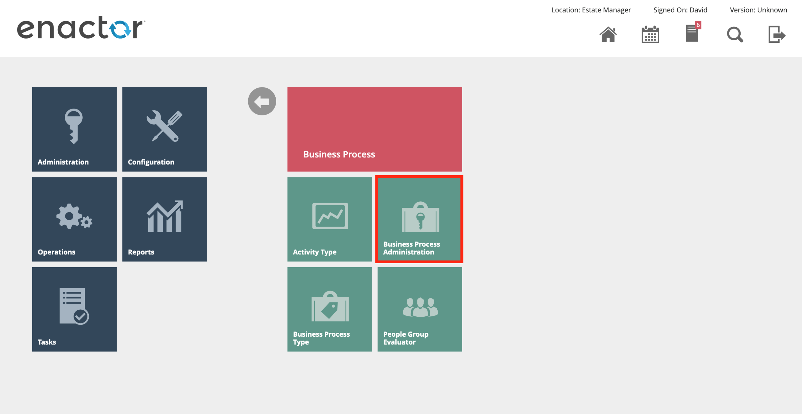

The Business Process Administration page lists all business process
instances. To filter the page to show the single business process
controlling the customer order that can be used for testing, go to
Operations -\> CRM -\> Customer Orders and view a suitable order.

Select and copy the Internal Reference field from the customer order,
shown below, and return back to the list of business
processes.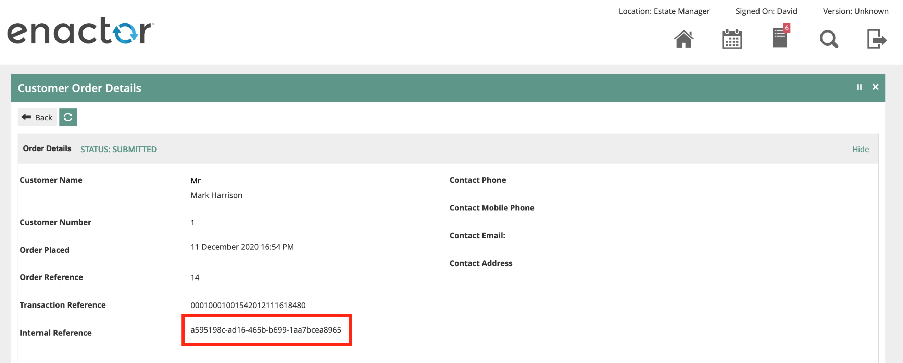

Paste the copied Internal Reference to the Instance ID filter and press
Apply Filters. This will display a single customer order business
process instance. Edit the business process by selecting the Edit pencil
icon.

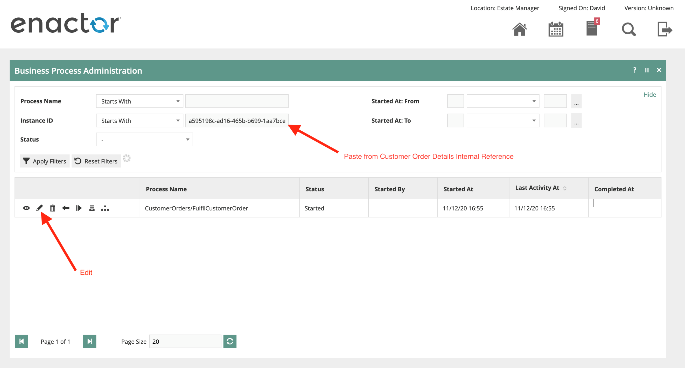

To fully verify and confirm that the business process instance and
correct customer order are linked, select the View icon to display a
pop-up dialog containing the properties of that particular task. One of
the properties will be the CustomerOrderId, which will match the order
ID of used to copy the Internal Reference.

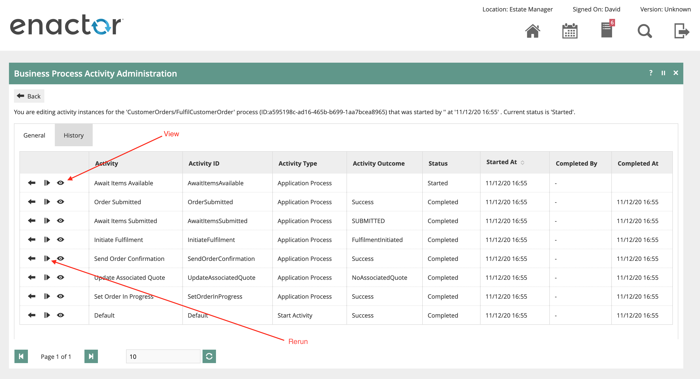

Selecting the Rerun button on the Send Order Confirmation task will
cause the business process engine to “undo” or compensate all subsequent
tasks and then rerun the Send Order Confirmation task, continuing the
business process from the compensated task.

The screenshot below shows that the original task, from 11/12/20 has
been Undone and another rerun task generated on 5/01/21. The Send Order
Confirmation task will cause the order confirmation email to be sent to
the customer, in the process regenerating the email contents from the
updated communication script.

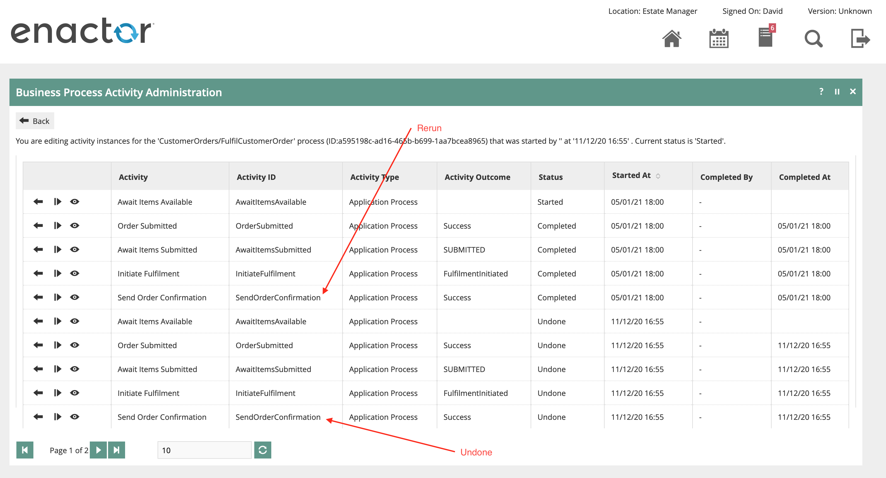

Using the process described above, the email can be regenerated from the
updated communication scripts many times in quick succession, without
having to resort to having to create a new order and wait for
processing.

# Appendix 1

Example FreeMarker script for Order Confirmation Email, simplified.

\<html xmlns="http://www.w3.org/1999/xhtml"\>

\<h1 style="color: \#5e9ca0;"\>Thank you for your order\</h1\>

\<h2 style="color: \#2e6c80;"\>Your order has been submitted. You will
receive an email when it is ready for collection.\</h2\>

\<p\>Dear
\<strong\>\${customerOrderHeader.customerFirstName}\</strong\>\ 

\<span\>Thank you for your order. Information about your order
\<strong\>#\${customerOrderHeader.customerOrderId}\</strong\> appears
below. \<br/\>

If you need to get in touch with us about your order please contact us
at: \</span\>\<a
href="mailto:customerservices@yourcompany.co.uk"\>\<span\>customerservices@yourcompany.co.uk\</span\>\</a\>\</td\>

\</p\>

\<p\>

\<table\>

\<tr bgcolor="#efedec"\>

\<th\>ITEM DESCRIPTION\</th\>

\<th\>QUANTITY\</th\>

\<th\>PRICE\</th\>

\</tr\>

\<#list customerOrderFulfilmentList as customerOrderFulfilment\>

\<#list customerOrderItemList as customerOrderItem\>

\<#if customerOrderItem.fulfilmentId ==
customerOrderFulfilment.fulfilmentId\>

\<tr\>

\<td\>'\\</td\>

\<td\>\${productsMap\[customerOrderItem.productKey.productId\].productDescription.string}\</td\>

\<td\>\${customerOrderItem.orderedQty}\</td\>

\<td\>\${freeMarkerFormatter.formatCurrency((customerOrderItem.orderedQty
\*
customerOrderItem.effectiveNetValue),customerOrderHeader.currencyKey.currencyId)}\</td\>

\</tr\>

\</#if\>

\</#list\>

\<tr\>

\<td colspan="2"\>&nbsp;\</td\>

\<td colspan="2"\>Delivery:
\${freeMarkerFormatter.formatCurrency(customerOrderFulfilment.deliveryCharge,customerOrderHeader.currencyKey.currencyId)}\</td\>

\</tr\>

\<#if customerOrderFulfilment.destinationType =="ADDRESS"\>

\<tr\>\<td colspan="4" height="25"\>&nbsp;\</td\>\</tr\>

\<tr bgcolor="#efedec"\>

\<td\>HOME DELIVERY DETAILS\</span\>\</td\>

\</tr\>

\<tr style="border-bottom: 2px solid \#efedec;"\>

\<td\>

\<p\>

\<#if (customerOrderFulfilment.destinationAddress.street1)?has_content
\>

\${customerOrderFulfilment.destinationAddress.street1}\<br/\>

\</#if\>

\<#if (customerOrderFulfilment.destinationAddress.street2)?has_content
\>

\${customerOrderFulfilment.destinationAddress.street2}\<br/\>

\</#if\>

\<#if (customerOrderFulfilment.destinationAddress.street3)?has_content
\>

\${customerOrderFulfilment.destinationAddress.street3}\<br/\>

\</#if\>

\<#if (customerOrderFulfilment.destinationAddress.town)?has_content \>

\${customerOrderFulfilment.destinationAddress.town}\<br/\>

\</#if\>

\<#if (customerOrderFulfilment.destinationAddress.county)?has_content \>

\${customerOrderFulfilment.destinationAddress.county}\<br/\>

\</#if\>

\<#if (customerOrderFulfilment.destinationAddress.postCode)?has_content
\>

\${customerOrderFulfilment.destinationAddress.postCode}\<br/\>

\</#if\>

\<#if (customerOrderFulfilment.destinationAddress.phone1)?has_content \>

\${customerOrderFulfilment.destinationAddress.phone1}\<br/\>

\</#if\>

\</p\>

\</tr\>

\</#if\>

\<#if customerOrderFulfilment.destinationType =="COLLECTION"\>

\<tr\>\<td colspan="4" height="25"\>&nbsp;\</td\>\</tr\>

\<tr bgcolor="#efedec"\>

\<td\>STORE COLLECTION DETAILS\</span\>\</td\>

\</tr\>

\<tr\>

\<td colspan="4" height="25"\>&nbsp;\</td\>

\</tr\>

\<tr style="border-bottom: 2px solid \#efedec;"\>

\<td\>

\<p\>

\<#if
(locationMap\[customerOrderFulfilment.fulfilmentId?string\].description)?has_content
\>

\${locationMap\[customerOrderFulfilment.fulfilmentId?string\].description}\<br/\>

\</#if\>

\<#if
(locationMap\[customerOrderFulfilment.fulfilmentId?string\].locationAddress.street1)?has_content
\>

\${locationMap\[customerOrderFulfilment.fulfilmentId?string\].locationAddress.street1}\<br/\>

\</#if\>

\<#if
(locationMap\[customerOrderFulfilment.fulfilmentId?string\].locationAddress.street2)?has_content
\>

\${locationMap\[customerOrderFulfilment.fulfilmentId?string\].locationAddress.street2}\<br/\>

\</#if\>

\<#if
(locationMap\[customerOrderFulfilment.fulfilmentId?string\].locationAddress.street3)?has_content
\>

\${locationMap\[customerOrderFulfilment.fulfilmentId?string\].locationAddress.street3}\<br/\>

\</#if\>

\<#if
(locationMap\[customerOrderFulfilment.fulfilmentId?string\].locationAddress.town)?has_content
\>

\${locationMap\[customerOrderFulfilment.fulfilmentId?string\].locationAddress.town}\<br/\>

\</#if\>

\<#if
(locationMap\[customerOrderFulfilment.fulfilmentId?string\].locationAddress.county)?has_content
\>

\${locationMap\[customerOrderFulfilment.fulfilmentId?string\].locationAddress.county}\<br/\>

\</#if\>

\<#if
(locationMap\[customerOrderFulfilment.fulfilmentId?string\].locationAddress.postCode)?has_content
\>

\${locationMap\[customerOrderFulfilment.fulfilmentId?string\].locationAddress.postCode}\<br/\>

\</#if\>

\<#if
(locationMap\[customerOrderFulfilment.fulfilmentId?string\].locationAddress.phone1)?has_content
\>

\${locationMap\[customerOrderFulfilment.fulfilmentId?string\].locationAddress.phone1}\<br/\>

\</#if\>

\</p\>

\</td\>

\</tr\>

\</#if\>

\</#list\>

\</tr\>

\<tr\>

\<td colspan="2"\>&nbsp;\</td\>

\<td colspan="2"\>Inclusive of VAT at 20%\</span\>\</td\>

\</tr\>

\<tr\>

\<td colspan="2" style="font-size: 21px;"\>TOTAL\</td\>

\<td colspan="2" style="font-size:
21px;"\>\${freeMarkerFormatter.formatCurrency(customerOrderHeader.orderValue,customerOrderHeader.currencyKey.currencyId)}\</td\>

\</tr\>

\</table\>

\</p\>

\</html\>

# Appendix 2

Example FreeMarker script for Order Confirmation Email, complete with
styling. The HTML for this template was generated using a WYSIWYG HTML
editor, with dynamic text replaced with template language elements.

\<meta content="width=device-width" name="viewport" /\>

\<meta content="text/html; charset=UTF-8" http-equiv="Content-Type" /\>

\<title\>Yourcompany.co.uk\</title\>

\<link href="http://fonts.googleapis.com/css?family=Montserrat:400,700"
rel="stylesheet" type="text/css" /\>

\<link href="http://fonts.googleapis.com/css?family=Bitter:400,700"
rel="stylesheet" type="text/css" /\>

\<style type="text/css"\> @import
url(http://fonts.googleapis.com/css?family=Montserrat:400,700); @import
url(http://fonts.googleapis.com/css?family=Bitter:400,700); body{
font-family: Arial, sans-serif!important; } @media screen{ font-family:
'Montserrat', arial, sans-serif; } /\*
------------------------------------------- PHONE
-------------------------------------------- \*/ @media only screen and
(max-width: 600px) { body{ font-family: 'Montserrat', arial, sans-serif;
} .emailImage{ height:auto !important; max-width:600px !important;
width: 100% !important; } } .ExternalClass {width: 100%;}\</style\>

\<!--\[if (gte mso 9)\|(IE)\]\>

\<table width="600" align="center" cellpadding="0" cellspacing="0"
border="0" style="display:block!important; margin:0 auto!important;
text-align: center;"\>

\<tr\>

\<td\>

\<\![endif\]--\>

\<center\>

\<table align="center" bgcolor="#ffffff" cellpadding="0" cellspacing="0"
height="100%" style="border-collapse: collapse;margin:0 auto!important;
text-align: center;" valign="center" width="100%"\>

\<tbody\>

\<tr\>

\<td align="center"\> \\</td\>

\</tr\>

\<tr\>

\<td align="center"\> \\</td\>

\</tr\>

\<tr\>

\<td align="center" bgcolor="#FFFFFF"
style="display:inline-block!important; max-width:600px!important;
margin:0 auto!important; clear:both!important;"\>

\

\<table cellpadding="0" cellspacing="0" height="100%"
style="border-collapse: collapse;" width="100%"\>

\<tbody\>

\<tr\>

\<td width="3%"\> &nbsp;\</td\>

\<td width="94%"\>

\<table cellpadding="0" cellspacing="0" height="100%"
style="border-collapse: collapse;" width="100%"\>

\<tbody\>

\<tr\>

\<td colspan="" height="30"\> &amp;nbsp;\</td\>

\</tr\>

\<tr\>

\<td align="center" bgcolor="#efedec" colspan=""\>

\

\<h1 style="color: \#333333; font-family: Arial, sans-serif; font-size:
27px;"\> \Thank you for your order\</span\>\</h1\>

\

\Your order has been submitted.\  You will receive an
email when it is ready for collection.\</span\>\</p\>

\</div\>

\</td\>

\</tr\>

\<tr\>

\<td colspan="" height="20"\> &amp;nbsp;\</td\>

\</tr\>

\<tr\>

\<td align="center" colspan="3" style="line-height: 20px; color:
\#333333; font-family: Arial, sans-serif; text-align: left; font-size:
14px; font-weight: 400; padding: 0px; margin: 0px;"\>

\<p\> \Dear
\<strong\>\${customerOrderHeader.customerFirstName}\</strong\>\</span\>\</p\>

\Thank you for your order. Information about your order
\<strong\>#\${customerOrderHeader.customerOrderId}\</strong\> appears
below.\  If you need to get in touch with us about your order
please contact us at: \</span\>\<a
href="mailto:customerservices@yourcompany.co.uk" style="color: \#8c827a;
font-family: Arial, sans-serif; font-size: 14px; font-weight: 600;
text-decoration: none; margin: 0px; padding: 0px;
display:inline-block;"\>\customerservices@yourcompany.co.uk\</span\>\</a\>

\</td\>

\</tr\>

\<tr\>

\<td colspan="3" height="30"\> &amp;nbsp;\</td\>

\</tr\>

\<tr\>

\<td align="center" colspan="3"\>

\${formattedOrderLines}

\<table align="center" bgcolor="#ffffff" cellpadding="3" cellspacing="0"
height="100%" style="border-collapse: collapse;margin:0 auto!important;
text-align: center;" valign="center" width="100%"\>

\<tbody\>

\<tr bgcolor="#efedec"\>

\<th colspan="2" style="line-height: 20px; color: \#746c65; font-family:
Arial, sans-serif; text-align: left; font-size: 14px; font-weight: 600;
padding: 5px 5px 5px 10px; margin: 0px;"\> \ITEM
DESCRIPTION\</span\>\</th\>

\<th style="line-height: 20px; color: \#746c65; font-family: Arial,
sans-serif; text-align: left; font-size: 14px; font-weight: 600;
padding: 5px; margin: 0px;"\> \QUANTITY\</span\>\</th\>

\<th style="line-height: 20px; color: \#746c65; font-family: Arial,
sans-serif; text-align: left; font-size: 14px; font-weight: 600;
padding: 5px; margin: 0px;"\> \PRICE\</span\>\</th\>

\</tr\>

\<tr style="border-bottom: 2px solid \#efedec;"\>

\<td colspan="2"\> &amp;nbsp;\</td\>

\<td colspan="2" style="line-height: 20px; color: \#333333; font-family:
Arial, sans-serif; text-align: right; font-size: 14px; font-weight: 400;
padding: 5px; margin: 0px;"\> \Inclusive of VAT at 20%\</span\>\</td\>

\</tr\>

\<tr style="border-bottom: 2px solid \#efedec;"\>

\<td colspan="2" style="line-height: 20px; color: \#333333; font-family:
Arial, sans-serif; text-align: left; font-size: 21px; font-weight: 600;
padding: 10px 5px; margin: 0px;"\> \TOTAL\</span\>\</td\>

\<td colspan="2" style="line-height: 20px; color: \#333333; font-family:
Arial, sans-serif; text-align: right; font-size: 21px; font-weight: 600;
padding: 10px 5px; margin: 0px;"\> \\${total}\</span\>\</td\>

\</tr\>

\<tr\>

\<td colspan="4" height="25"\> &amp;nbsp;\</td\>

\</tr\>

\<tr bgcolor="#efedec"\>

\<th colspan="4" style="line-height: 20px; color: \#746c65; font-family:
Arial, sans-serif; text-align: left; font-size: 14px; font-weight: 600;
padding: 5px 5px 5px 10px; margin: 0px;"\> \STORE COLLECTION
DETAILS\</span\>\</th\>

\</tr\>

\<tr\>

\<td colspan="4" style="line-height: 20px; color: \#333333; font-family:
Arial, sans-serif; text-align: left; font-size: 14px; font-weight: 400;
padding: 5px; margin: 0px;"\>

\<p\> \\${destinationLocation.description}\ 
\${notEmpty(destinationLocation.locationAddress.street1) ?
concat(destinationLocation.locationAddress.street1, &#39;\  &#39;)
: &#39;&#39;} \${notEmpty(destinationLocation.locationAddress.street2) ?
concat(destinationLocation.locationAddress.street2, &#39;\  &#39;)
: &#39;&#39;} \${notEmpty(destinationLocation.locationAddress.street3) ?
concat(destinationLocation.locationAddress.street3, &#39;\  &#39;)
: &#39;&#39;} \${notEmpty(destinationLocation.locationAddress.town) ?
concat(destinationLocation.locationAddress.town, &#39;\  &#39;) :
&#39;&#39;} \${notEmpty(destinationLocation.locationAddress.county) ?
concat(destinationLocation.locationAddress.county, &#39;\  &#39;)
: &#39;&#39;} \${notEmpty(destinationLocation.locationAddress.postCode)
? concat(destinationLocation.locationAddress.postCode, &#39;\ 
&#39;) : &#39;&#39;}\ 
\${destinationLocation.locationAddress.phone1}\</span\>\</p\>

\</td\>

\</tr\>

\</tbody\>

\</table\>

\</td\>

\</tr\>

\<tr\>

\<td colspan="" height="10"\> &amp;nbsp;\</td\>

\</tr\>

\<tr\>

\<td align="center" colspan="" style="line-height: 20px; color:
\#333333; font-family: Arial, sans-serif; text-align: left; font-size:
14px; font-weight: 400; padding: 0px; margin: 0px;"\> \Kind
Regards,\</span\>\</td\>

\</tr\>

\<tr\>

\<td\> \\</td\>

\</tr\>

\<tr\>

\<td colspan="" height="10"\> &amp;nbsp;\</td\>

\</tr\>

\<tr\>

\<td align="center"\> \\</td\>

\</tr\>

\<tr\>

\<td style="line-height: 20px; color: \#333333; font-family: Arial,
sans-serif; text-align: left; font-size: 12px; padding: 0px; margin:
0px;"\>

\<p\> \<a href="www.yourcompany.co.uk" style="color: \#8c827a;
font-family: Arial, sans-serif; font-size: 12px; font-weight: 600;
text-decoration: none; margin: 0px; padding: 0px; display:inline-block;"
target="\_blank"\>\www.yourcompany.co.uk\</span\>\</a\>\ 
\<a href="mailto:customerservices@yourcompany.co.uk" style="color:
\#8c827a; font-family: Arial, sans-serif; font-size: 12px; font-weight:
600; text-decoration: none; margin: 0px; padding: 0px;
display:inline-block;"\>\customerservices@yourcompany.co.uk\</span\>\</a\>\ 
\0800 000 0000\</span\>\</p\>

\<p\> \YOURCOMPANY, ADDRESS LINE 1\  ADDRESS LINE 2\ 
COUNTY. POSTCODE\</span\>\</p\>

\<a href="#"\>\\</a\> \<a href="#"\>\\</a\> \<a href="#"\>\\</a\> \<a
href="#"\>\\</a\> \<a href="#"\>\\</a\>

\</td\>

\</tr\>

\<tr\>

\<td colspan="" height="30"\> &amp;nbsp;\</td\>

\</tr\>

\</tbody\>

\</table\>

\</td\>

\<td width="3%"\> &nbsp;\</td\>

\</tr\>

\</tbody\>

\</table\>

\</div\>

\</td\>

\</tr\>

\</tbody\>

\</table\>

\</center\>

\<!--\[if (gte mso 9)\|(IE)\]\>

\</td\>

\</tr\>

\</table\>

\<\![endif\]--\>

# Appendix 3

JSON representations of the Java objects available within the FreeMarker
template. Note that these are example data sets only.

Customer Order Header

{

"authorisedByUserKey" : { },

"completedDate" : "2020-12-09T10:42:43.000+00:00",

"notificationContactTypeKey" : {

"id" : "CX_ORD_NOTIFICATION"

},

"reasonId" : {

"regionId" : {

"groupTypeId" : "region"

}

},

"customerOrderId" : "20001",

"customerOrderTypeId" : "CUSTOMER_ORDER",

"createdDate" : "2020-12-09T10:42:43.000+00:00",

"lastUpdatedByUserKey" : { },

"customerNumber" : "123",

"customerFirstName" : "Beth",

"customerTitle" : "Mrs",

"customerSurname" : "Chadwick",

"customerPostcode" : "AL1 1AL",

"preferredContactTypeKey" : {

"id" : "CX_ORD_CONTACT"

},

"locationId" : {

"id" : "0001"

},

"userId" : {

"id" : "1111"

},

"deviceId" : { },

"currencyId" : {

"id" : "GBP"

},

"address" : \[ {

"country" : "UK",

"county" : "Hertfordshire",

"email" : "b.chadwick@email.co.uk",

"mobilePhone" : "07495 555633",

"phone1" : "01727 555394",

"street1" : "23 St Leonards Road",

"town" : "St Albans",

"isTemplate" : false,

"countryCodeId" : { },

"typeId" : {

"id" : "CX_ORD_CONTACT"

}

} \]

}

List of Customer Order Items

\[ {

"customerOrderId" : "20001",

"lineNumber" : 1,

"fulfilmentId" : 1,

"orderedQty" : 1,

"shippedQty" : 1,

"effectiveNetValue" : 4260,

"taxAmount" : 0.0,

"locationId" : { },

"userId" : { },

"productId" : {

"id" : "MB709SN-1"

},

"destinationLocationId" : { },

"reasonId" : {

"regionId" : {

"groupTypeId" : "region"

}

}

}, {

"customerOrderId" : "20001",

"lineNumber" : 2,

"fulfilmentId" : 1,

"orderedQty" : 2,

"shippedQty" : 2,

"netPrice" : 1175,

"effectiveNetValue" : 1000,

"taxAmount" : 5.0,

"locationId" : { },

"userId" : { },

"productId" : {

"id" : "DF715XM-1"

},

"destinationLocationId" : { },

"reasonId" : {

"regionId" : {

"groupTypeId" : "region"

}

},

"adjustments" : \[ {

"adjustmentNumber" : 1,

"adjustmentType" : "DISCOUNT",

"adjustmentDetail" : "DISCOUNT1",

"description" : "£1.75 discount",

"amount" : 175,

"reasonKey" : {

"regionId" : {

"groupTypeId" : "region"

}

}

} \]

} \]

List of Customer Order Fulfilments

\[ {

"customerOrderId" : "20001",

"fulfilmentId" : 1,

"sourceType" : "locationStockFulfilment",

"sourceId" : "0100",

"destinationType" : "COLLECTION",

"destinationLocationId" : {

"id" : "0001"

},

"destinationAddress" : {

"isTemplate" : false,

"countryCodeId" : { },

"typeId" : { }

},

"destinationName" : { },

"deliveryChargeForeignCurrencyId" : { },

"deliveryTypeId" : { },

"trackingDetails" : { }

}, {

"customerOrderId" : "20001",

"fulfilmentId" : 2,

"sourceType" : "locationStockFulfilment",

"sourceId" : "0100",

"destinationType" : "ADDRESS",

"destinationLocationId" : { },

"destinationAddress" : {

"county" : "Hertfordshire",

"phone1" : "01727 555943",

"postCode" : "AL1 1LA",

"street1" : "14 Eastbury Court ",

"town" : "St Albans",

"isTemplate" : false,

"countryCodeId" : { },

"typeId" : { }

},

"destinationName" : { },

"deliveryChargeForeignCurrencyId" : { },

"deliveryTypeId" : { },

"trackingDetails" : { }

} \]

List of Payments

\[ {

"customerOrderId" : "20001",

"paymentNumber" : 1,

"paymentType" : "customerOrderCashPayment",

"amount" : 6610,

"tenderId" : {

"tenderId" : "CASH",

"groupId" : {

"groupTypeId" : "UK",

"variantGroupTypeId" : "All"

}

},

"currencyId" : {

"id" : "GBP"

},

"status" : "COMMITTED",

"isRefund" : false,

"refundAvailable" : 6610,

"createdByUserKey" : { }

} \]

Customer

{

"customerNumber" : "5432",

"customerName" : {

"surname" : "Chadwick",

"forename" : "Beth",

"title" : "Mrs"

},

"employeeKey" : { },

"customerType" : { },

"createdBy" : { },

"createdAt" : { }

}

Location Map – if the fulfilment type has a destination location, which
is typical for Collection orders, the location map will contain details
of the location, keyed by fulfilment ID.

{

"1" : {

"description" : "St Albans Store",

"locationType" : "location",

"locationAddress" : {

"countryCodeId" : { },

"typeId" : { },

"county" : "Hertfordshire",

"phone1" : "01727 555993",

"postCode" : "AL1 3BU",

"street1" : "14 High Street",

"town" : "St Albans",

"isTemplate" : false

},

"locationId" : "0001",

"emailConfiguration" : {

"locationId" : "0001",

"isTemplate" : false

},

"purgeDetails" : {

"isTemplate" : false

},

"exchangeRateConversionMethod" : "INDIRECT",

"isTemplate" : false,

"currencyId" : { },

"systemUserId" : { },

"defaultMenuGroupId" : { },

"menuGroupId" : { },

"priceGroupId" : { },

"fiscalProductGroupHierarchyId" : { },

"mmGroupHierarchyId" : { },

"exchangeRateGroupId" : { }

}

}
