# Configuring Discount Reasons
# I­ntroduction

The purpose of this guide is to provide a foundational understanding of
the options and capabilities available when configuring Discount
Reasons. Discount Reasons mainly consist of Item Discounts, Transaction
Discounts and Price Overrides. Reasons are configured based on a Reason
Type (Eg: Item Void Reason, Transaction Void Reason) and are associated
with a Region in which they are applicable.

The properties of a Reason configuration too depend on the Reason Type.
Discount Reasons are Reasons for which either a particular item or an
entire transaction is enabled discounts at the checkout. This guide
provides the basic step-by-step configurations required to set up the
necessary Discount Reasons.

## Overview

This guide will cover the configuration for the following:

-   **Item Discounts** -- Allows setting a discount for a particular
    item in a transaction.

-   **Transaction Discounts** -- Allows setting a discount for the
    entire transaction.

-   **Price Overrides** -- Allows changing the existing price of a
    selected item in a transaction.

**Prior Training / Experience ** 

You should be familiar with the following:  

-   Estate Manager Configuration  

-   Data Broadcasting 

# Configuration Steps

Reasons are created based on a pre-defined **Reason Type** and
associated with a Region in which they are applicable. Each Reason Type
is known to a specific function of the application, that is required to
capture reasons of the specific type. Many of the Reason Types relate to
Application-Specific built-in functionality. 

## Item Discounts

Item Discount Reason allows setting a discount for a particular item in
a transaction. This governs how manual discounts are handled at the POS.
Generally, an Item Discount Reason does not directly impact how a
promotional discount is treated.

The reason maintenance application can be accessed through:

Configuration -\> Organisation -\> Reasons

To create a new Reason, select **Create a New Reason** on the Reason
Maintenance page.

Select the appropriate Region** **from the **Region** drop-down. 

Select **Item Discount** from the **Reason Type** drop-down. 

Enter a unique **Reason ID **for the new Item Discount Reason. The ID
can be alphanumeric and contain a maximum of 20 characters. 

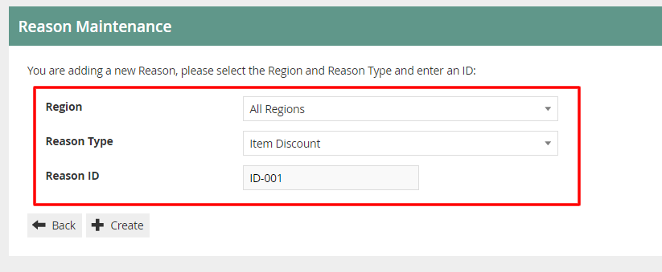

You will be presented with the following options to complete creating
the new Item Discount Reason: 

### Reason -- General Tab

The General tab has all the basic information that captures the identity
of the Item Discount Reason.

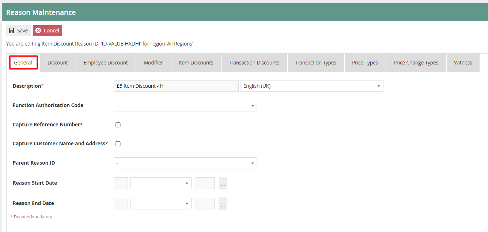

Set the appropriate values on the **General** tab as follows:

| Configuration                     | Description                                                                                                                                                                                         |
|-----------------------------------|-----------------------------------------------------------------------------------------------------------------------------------------------------------------------------------------------------|
| Description                       | Enter a user-friendly, meaningful description for the Reason that can be alphanumeric with a maximum of 50 characters.                                                                              |
|                                   | Select the locale from the dropdown list of all configured Locales.                                                                                                                                 |
| Function Authorisation Code       | Select the applicable Function Authorisation Code from the drop-down list. These are defined and configured in Role Maintenance and applicable only if the reason selection requires authorisation. |
| Capture Reference Number          | Select check box, if the User should be prompted to enter a reference number when using this Reason.                                                                                                |
| Capture Customer Name and Address | Select check box, if the User should be prompted to capture the Customer's Name and Address when using this Reason.                                                                                 |
| Parent Reason ID                  | If the reason requires a parent reason, select the relevant parent reason from the drop-down list of all configured Reasons of the same Reason Type.                                                |
| Reason Start Date                 | Enter a Reason Start Date                                                                                                                                                                           |
| Reason End Date                   | Enter a Reason End Date                                                                                                                                                                             |

### Reason -- Discount Tab

The Discount tab provides a comprehensive list of properties available
for configuration of the specific Item Discount Reason that captures
different characteristics of the Discount to be applied.

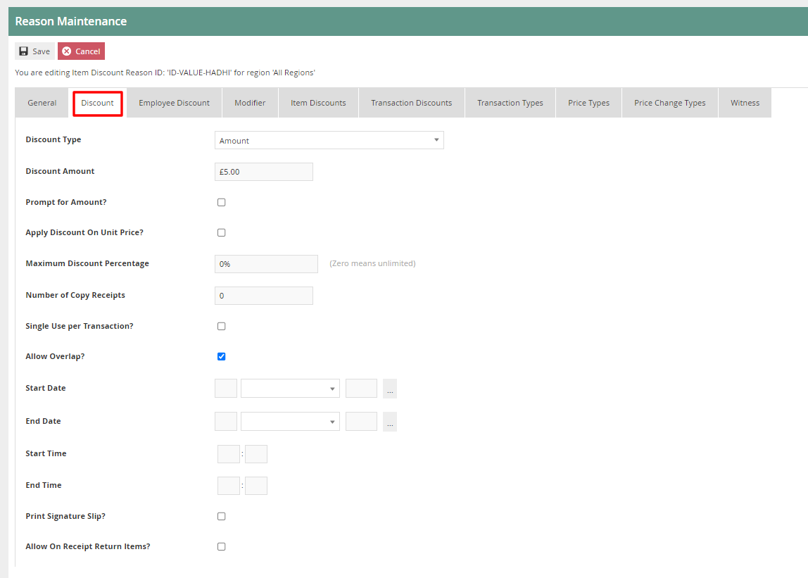

| Configuration                  | Description                                                                                                                                                                                  |
|--------------------------------|----------------------------------------------------------------------------------------------------------------------------------------------------------------------------------------------|
| Discount Type                  | Select an appropriate status of the discount type from a drop-down list.                                                                                                                     |
|                                |                                                                                                                                                                                              |
|                                | - *Percentage *-- Allows setting a percentage value to be discounted from the total price of the item.                                                                                       |
|                                |                                                                                                                                                                                              |
|                                | - *Amount *--* *Allows setting a fixed value to be discounted from the total price of the item.                                                                                              |
|                                |                                                                                                                                                                                              |
|                                | - *New Price* -- Allows setting a new price to the item.                                                                                                                                     |
| Discount Amount/Percentage     | Depending on the selection of the previous field (Discount type), enter either an amount (numeric value) or a percentage (ranging from 0-100).                                               |
| Rounding Rule                  | Select an appropriate rounding rule for percentage values from a drop-down list.                                                                                                             |
|                                |                                                                                                                                                                                              |
|                                | - *Down* -- Allows to round down a percentage value.                                                                                                                                         |
|                                |                                                                                                                                                                                              |
|                                | - *Nearest *--* *Allows to round to the nearest percentage value.                                                                                                                            |
|                                |                                                                                                                                                                                              |
|                                | - *Up* -- Allows to round up a percentage value.                                                                                                                                             |
| Prompt for Amount?             | Select the checkbox if the User should be prompted to enter the discount amount when using this Reason.                                                                                      |
| Apply discount on Unit Price?  | Select the checkbox if the discount should be applied on Unit Price.                                                                                                                         |
| Maximum Discount Percentage    | Enter a numeric value ranging from 0-100 which will determine the maximum discount percentage applicable. Setting the value to 0 determines, an unlimited discount percentage is applicable. |
| Number of Copy Receipts        | Enter a numeric value ranging from 0-5 to determine the number of copy receipts.                                                                                                             |
| Single Use per Transaction?    | Select the checkbox if this Reason can be used only once in the transaction.                                                                                                                 |
| Allow Overlap?                 | Select the checkbox to indicate that this Reason can be available for selection even if another discount has already been applied.                                                           |
| Start Date                     | Enter a date from when this Discount is valid.                                                                                                                                               |
| End Date                       | Enter a date until when this Discount is valid.                                                                                                                                              |
| Start Time                     | Enter a time from when this Reason is valid.                                                                                                                                                 |
| End Time                       | Enter a time until when this Reason is valid.                                                                                                                                                |
| Print Signature Slip?          | Select the checkbox to indicate that a signature slip will be printed when this Reason is used.                                                                                              |
| Allow On Receipt Return Items? | Select the checkbox to indicate that this Reason is available for selection on receipt return items.                                                                                         |

Select **Save.**

\* Multiple Reasons can be created for the Item Discount Reason Type as
required. These Reasons will be presented to the operator to select from
when performing an Item Discount.

## 

## Transaction Discounts

Transaction Discount Reason allows setting a discount for an entire
transaction that consists of one or more items. Both Item Discount and
Transaction Discount Reason Types capture the same properties in the
same set of Tabs of their Reason Maintenance pages with the one
exception of the **Include Subsequent Items** property, applicable only
to Transaction Discount Reason Types and captured in the Modifier Tab.

To create a new Reason, select **Create a New Reason** on the Reason
Maintenance page.

Select the Region** **from the **Region** drop-down. 

Select **Transaction Discount** from the **Reason Type** drop-down. 

Enter a unique **Reason ID **for the new Item Discount Reason. The ID
can be alphanumeric and contain a maximum of 20 characters. 

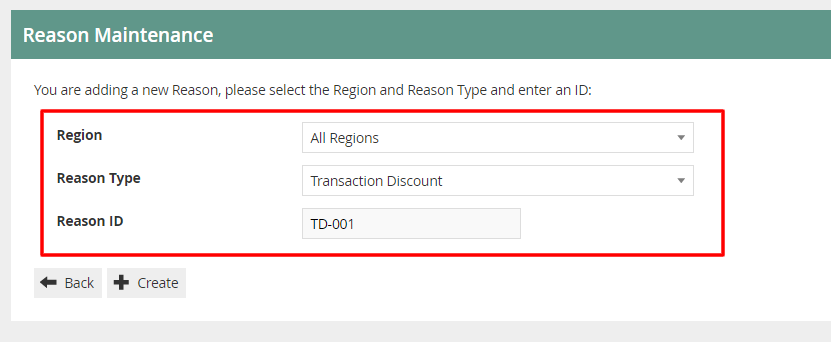

You will be presented with the following options to complete creating
the new Transaction Discount Reason: 

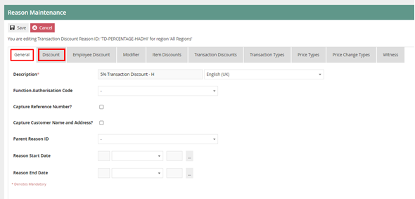

### Reason -- General Tab

The General tab has all the basic information that captures the identity
of the Transaction Discount Reason.

Set the appropriate values on the** General Tab** as per the sample on
configuring item discount reason.

### Reason -- Discount Tab

The Discount tab provides a comprehensive list of properties available
for configuration of the specific Transaction Discount Reason that
captures different characteristics of the Discount to be applied.

Set the appropriate values on the** Discount Tab** as per the sample on
configuring item discount reason.

### Reason -- Modifier Tab

The Modifier Tab captures a set of flags that determine the
applicability of the Discount in diverse circumstances and Item and
transaction Types.

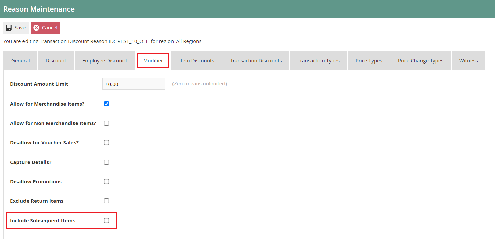

If the checkbox is against **Include Subsequent Items** is selected, it
indicates that after a Discount is applied to the Transaction with this
Reason Code, when/if further Items are added to the Transaction, the
Discount amount will be re-calculated to include the items added.

Select **Save.**

\* Multiple Reasons can be created for the Transaction Discount Reason
Type as required. These Reasons will be presented to the operator to
select from when performing a Transaction Discount.

## Price Overrides

Price Override Reason allows the operator to change the existing price
of a selected item in a transaction.

To create a new Reason, select **Create a New Reason** on the Reason
Maintenance page.

Select the Region** **from the **Region** drop-down. 

Select **Price Override** from the **Reason Type** drop-down. 

Enter a unique **Reason ID **for the new Item Discount Reason. The ID
can be alphanumeric and contain a maximum of 20 characters. 

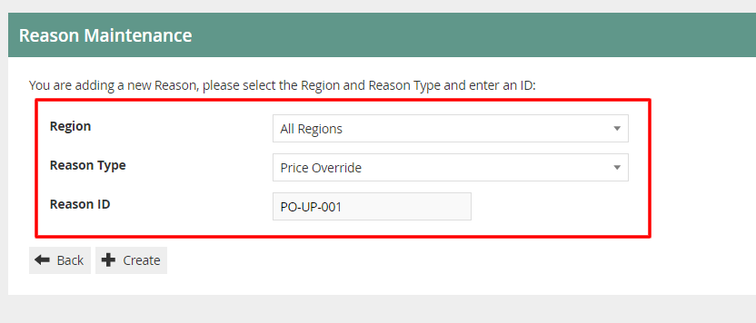

You will be presented with the following options to complete creating
the new Price Override Reason: 

### Reason -- General Tab

The General tab has all the basic information that captures the identity
of the Price Override Reason.

Set the appropriate values on the** General Tab** as per the sample on
configuring item discount reason.

### 

### Reason -- Price Override Tab

The Price Override tab provides properties which allows to set values
and constraints on the specific Price Override Reason.

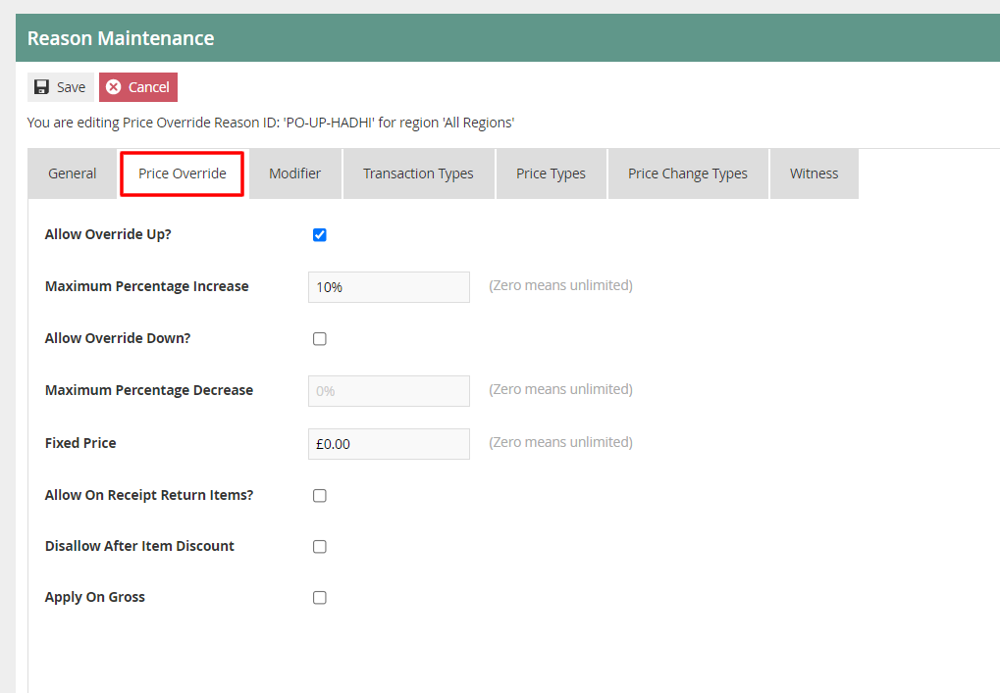

Set the appropriate values on the **Price Override** tab as follows:

| Configuration                  | Description                                                                                                                                                                                                                                                                                     |
|--------------------------------|-------------------------------------------------------------------------------------------------------------------------------------------------------------------------------------------------------------------------------------------------------------------------------------------------|
| Allow Override Up?             | Select the checkbox to determine that the price can be overridden and increased when this reason is used.                                                                                                                                                                                       |
| Maximum Percentage Increase    | Enter a numeric value ranging from 0-100 which will determine the maximum percentage increase applicable. Setting the value to 0 determines, an unlimited percentage is applicable.                                                                                                             |
| Allow Override Down?           | Select an appropriate rounding rule for percentage values from a drop-down list.                                                                                                                                                                                                                |
|                                |                                                                                                                                                                                                                                                                                                 |
|                                | - *Down* -- Allows to round down a percentage value.                                                                                                                                                                                                                                            |
|                                |                                                                                                                                                                                                                                                                                                 |
|                                | - *Nearest *--* *Allows to round to the nearest percentage value.                                                                                                                                                                                                                               |
|                                |                                                                                                                                                                                                                                                                                                 |
|                                | - *Up* -- Allows to round up a percentage value.                                                                                                                                                                                                                                                |
| Maximum Percentage Decrease    | Select checkbox to indicate that the price can be reduced when this reason is used.                                                                                                                                                                                                             |
| Fixed Price                    | Allows setting a fixed price. Set a fixed numeric value that will determine the price which will be used whenever this reason is selected. This price will be applied when using this Reason, regardless of the product price. If set to 0 it indicates that the fixed price is not applicable. |
| Allow On Receipt Return Items? | Select the checkbox to indicate that this Reason is available for selection on receipt return items.                                                                                                                                                                                            |
| Disallow After Item Discount   | Select checkbox to indicate that this Reason cannot be selected after an item discount is already applied. To use this price override reason, in addition to an item discount, leave this unchecked.                                                                                            |
| Apply on Gross                 | Select the checkbox to indicate that this price override reason is applied on the gross transaction amount.                                                                                                                                                                                     |

### Reason -- Modifier Tab

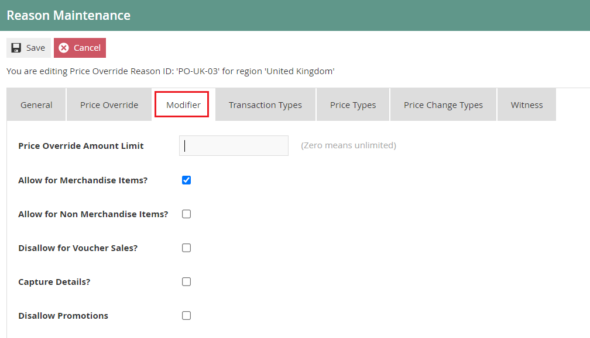

Set the appropriate values on the **Modifier** tab as follows:

| Configuration                    | Description                                                                                                                                                             |
|----------------------------------|-------------------------------------------------------------------------------------------------------------------------------------------------------------------------|
| Price Override Amount Limit      | Enter a numeric value that will indicate the maximum amount by which the price can be overridden. Setting the value to 0 determines, an unlimited amount is applicable. |
| Allow for Merchandise Items?     | Select checkbox to indicate that this Reason is applicable to Merchandise Items.                                                                                        |
| Allow for Non Merchandise Items? | Select checkbox to indicate that this Reason is applicable to Non Merchandise Items.                                                                                    |
| Disallow for Voucher Sales?      | Select checkbox to indicate that this Reason is not allowed for Voucher Sales.                                                                                          |
| Capture Details                  | Select checkbox to prompt the User to capture details when using this Reason.                                                                                           |
| Disallow Promotions              | Select checkbox to indicate that promotions are not allowed when using this Reason.                                                                                     |

Select **Save.**

\* Multiple Reasons can be created for the Price Override Reason Type as
required. These Reasons will be presented to the operator to select from
when performing a Price Override.

## Menus 

To enable the use of the above reasons, appropriate Menus and Role
privileges should be configured separately.

The menu maintenance application can be accessed through:  

Configuration -\> System -\> Menus 

 

The **Sale Menu** contains most of the functions that will be required
by a retailer. Most of the customization work will involve restructuring
the hierarchy of the menu, removing unnecessary items, or potentially
adding a new item.

Following are the events that can be configured for this reason menu:

| Configuration                  | Description                                                                                                                                                                                                                                                                                     |
|--------------------------------|-------------------------------------------------------------------------------------------------------------------------------------------------------------------------------------------------------------------------------------------------------------------------------------------------|
| Allow Override Up?             | Select the checkbox to determine that the price can be overridden and increased when this reason is used.                                                                                                                                                                                       |
| Maximum Percentage Increase    | Enter a numeric value ranging from 0-100 which will determine the maximum percentage increase applicable. Setting the value to 0 determines, an unlimited percentage is applicable.                                                                                                             |
| Allow Override Down?           | Select an appropriate rounding rule for percentage values from a drop-down list.                                                                                                                                                                                                                |
|                                |                                                                                                                                                                                                                                                                                                 |
|                                | - *Down* -- Allows to round down a percentage value.                                                                                                                                                                                                                                            |
|                                |                                                                                                                                                                                                                                                                                                 |
|                                | - *Nearest *--* *Allows to round to the nearest percentage value.                                                                                                                                                                                                                               |
|                                |                                                                                                                                                                                                                                                                                                 |
|                                | - *Up* -- Allows to round up a percentage value.                                                                                                                                                                                                                                                |
| Maximum Percentage Decrease    | Select checkbox to indicate that the price can be reduced when this reason is used.                                                                                                                                                                                                             |
| Fixed Price                    | Allows setting a fixed price. Set a fixed numeric value that will determine the price which will be used whenever this reason is selected. This price will be applied when using this Reason, regardless of the product price. If set to 0 it indicates that the fixed price is not applicable. |
| Allow On Receipt Return Items? | Select the checkbox to indicate that this Reason is available for selection on receipt return items.                                                                                                                                                                                            |
| Disallow After Item Discount   | Select checkbox to indicate that this Reason cannot be selected after an item discount is already applied. To use this price override reason, in addition to an item discount, leave this unchecked.                                                                                            |
| Apply on Gross                 | Select the checkbox to indicate that this price override reason is applied on the gross transaction amount.                                                                                                                                                                                     |

\*Configuring Menus is further described in a separate How-to Guide.

**Roles **

The configuration interface used to specify User Roles facilitates the
selection of required permissions by applying a discovery process to the
Package resources of the Enactor Retail Software itself. Named
Privileges are associated with individual Functions, which assert their
requirement. The required Permissions implicitly correspond to these
Privileges and provide the building blocks used to construct User
Roles. 

 

The user role maintenance application can be accessed through:  

Configuration -\> HR -\> User Roles 

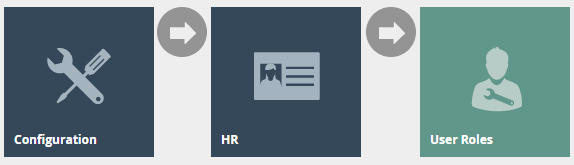 

 

Authorisation to run the specific functionality documented here are
controlled with privileges maintained in roles. 

 

Select the appropriate role you wish to edit, the example here is
using SALES_ASSISTANT.

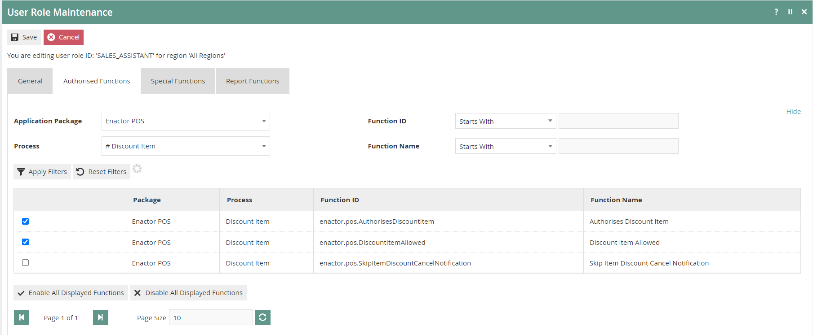

Select the enactor POS package and configure the privileges as
required.  

 

Following are the privileges that can be configured for this user role: 

| Reason Type           | Package      | Function ID                                |
|-----------------------|--------------|--------------------------------------------|
| Item Discount         | Enactor POS  | enactor.pos.AuthorisesDiscountItem         |
|                       |              |                                            |
|                       |              | enactor.pos.DiscountItemAllowed            |
| Transaction Discount  | Enactor POS  | enactor.pos.AuthorisesTransactionDiscount  |
|                       |              |                                            |
|                       |              | enactor.pos.TransactionDiscountAllowed     |
| Price Override        | Enactor POS  | enactor.pos.AuthorisesPriceOverride        |
|                       |              |                                            |
|                       |              | enactor.pos.PriceOverrideAllowed           |

\* Configuring User Roles is further described further in a separate
How-to Guide.

## Broadcasting 

To deliver the configuration changes to the POS, broadcast the following
entity.

-   Reason

-   Menu

-   Roles

# POS Functionality

## Item Discount Reason Functionality 

On adding products to the bag, the operator will be presented with
screen 1.

Select product as shown on screen 2, to view all applicable functions
for the product displayed at the bottom pane.

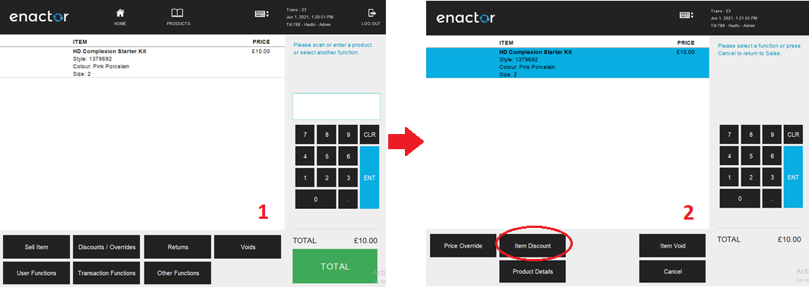

Select **Item Discount** and a set of configured Item Discount Reasons
are displayed to the operator as shown on screen 3.

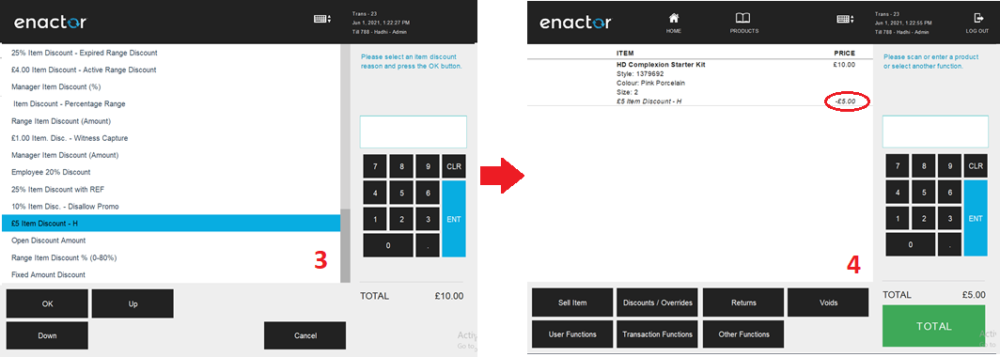

The operator can then select the applicable Reason and click **OK** to
apply the Item Discount to the selected product and it will appear as
shown on screen 4.

## Transaction Discount Reason Functionality 

On adding products to the bag, the operator will be presented with
screen 1.

Select **Discounts / Overrides** and the operator will be navigated to
screen 2.

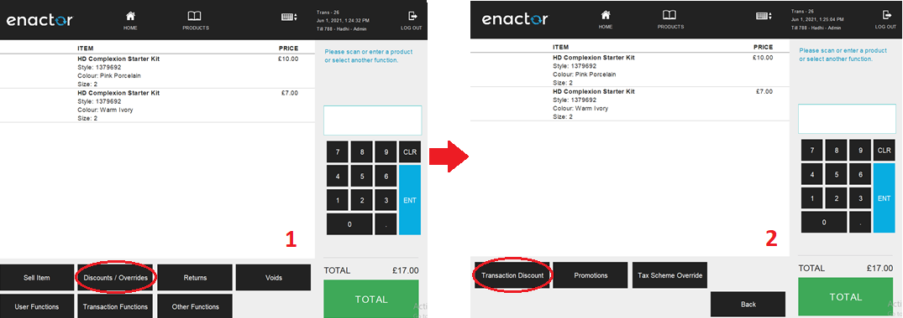

Select **Transaction Discount** and a set of configured Transaction
Discount Reasons are displayed to the operator as shown on screen 3.

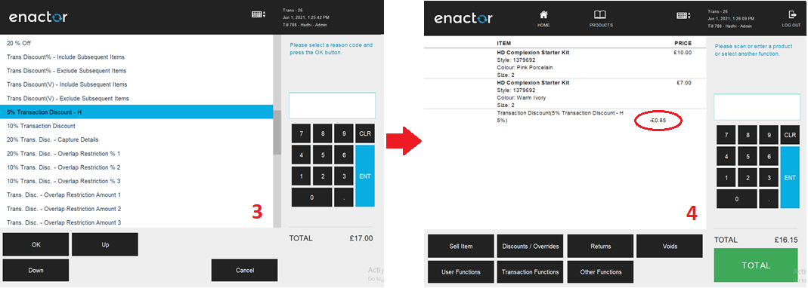

The operator can then select the applicable Reason and click **OK** to
apply the Transaction Discount to the selected transaction which will
appear as shown on screen 4.

## Price Override Reason Functionality 

On adding products to the bag, the operator will be presented with
screen 1.

Select product as shown on screen 2, to view all applicable functions
for the product displayed at the bottom pane.

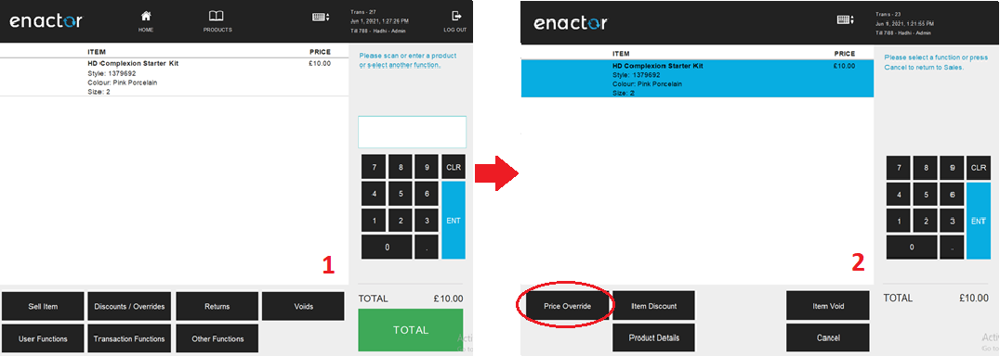

Select **Price Override** and a set of configured Price Override Reasons
are displayed to the operator as shown on screen 3.

The operator can then select the applicable Reason and click **OK** to
apply the Price Override function to the selected product.

As shown on screen 4 the operator will be prompted to **enter** the new
price applicable.

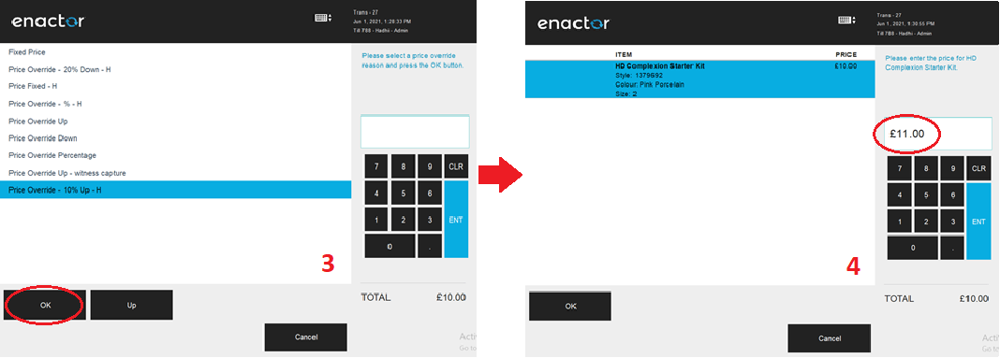

\* Make sure to enter a value which will meet the configured conditions
of the selected Price Override Reason.

Select **OK**, to apply the desired Price Override Reason to the
selected product as follows:

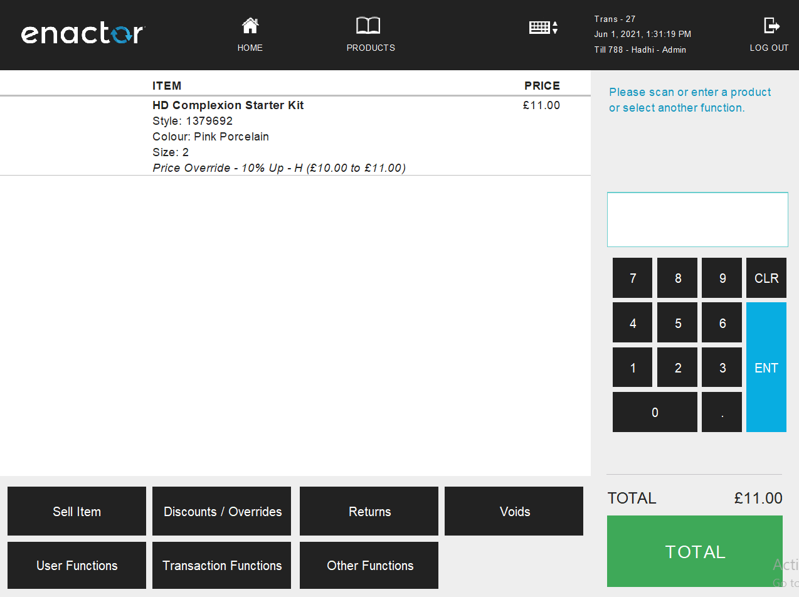
