# Configuring Employee Sales
# Introduction

The purpose of this guide is to show how to configure various aspects to
effectively manage Employee Sales. While Enactor supports multiple ways
of providing products at a discount to Employees, this guide will focus
on the Employee Sale which provides the most robust flexibility and
control.

## Overview

The following areas will be reviewed as part of configuring the Employee
Sale:

-   Employees

-   Reason Codes

-   Employee Cards

-   Employee Grades

-   Employee Accounts

-   Promotions

# Prerequisites

## Resources

Before starting, you should have the following resources in place:

-   Enactor Estate Manager

-   Enactor POS (configured within the UK Region, connected to the
    Estate Manager)

-   Standard Configuration, including:

    -   Base Configuration

    -   UK Retail (I have used UK in this example, but it could be other
        regional config packs. If you import the UK Retail config, the
        tax configuration described will already exist. Please note that
        in this guide we will go through the process of creating the
        configuration from scratch, as an example.)

-   Examples of Data to be used as models, particularly Employee

## Prior Training/Experience

You should be familiar with the following:

-   Estate Manager configuration

-   Enactor configuration concepts, including Locations, POS Terminals,
    Products, Discounts, Promotions etc.

-   Data broadcasting

-   Standard POS Sales processes

# Fundamentals

## Selling to Employees

Retailers understand that having employees who use, understand and are
passionate about the products and services that they offer can be an
asset. By providing additional discounts to their employees, retailers
not only get product into the hands of the people responsible for
selling it but also create an important recruiting and retention tool.
Tighter margins have caused many retailers to reduce or eliminate
Employee Discounts.

The Enactor solution supports numerous options on ways to manage an
Employee Sale. Discounts can be calculated and applied based on the
Employee, Employee Grade, Employee Group or MM Group. Additionally,
Employees can be limited on the value of product purchased or amount of
discount received over a period of time. The Enactor Promotions Engine
can even be leveraged to create meaningful Employee-only offers that can
help increase basket size and recover lost margin.

## Manual Employee Discounts

While not covered in detail within this guide, Enactor does support the
use of manually applied Employee Discounts. These are created and
managed using Item and Transaction Discount Reason Codes and therefore
do not offer the enhanced flexibility and control found when using the
Employee Sale Transaction Type.

## Employee Sale

An Employee Sale is a unique Transaction Type within the Enactor
solution. This provides the ability to reconsider any number of business
rules and change their behaviour when compared to a traditional retail
transaction. In addition to specifying the type of discount, an Employee
Sale Reason also has the ability to enforce employee validation, track
spending/received discount, enforce allowable tenders as well as other
discount related parameters.

## Discount Types

There are many different Discount Types that can be supported by an
Employee Sale. Each Discount Type will drive various configuration
requirements:

 **Fixed:** All employees receive a single, fixed Discount Percentage
 as specified in the Employee Sale Reason.

 **Employee:** When selecting the Employee Discount Type, the discount
 percentage is specified within the Employee Record which permits the
 use of different discount percentages for different employees. This
 Discount Type supports a 2-level discount scheme which utilises an
 accumulated discount balance threshold to determine the appropriate
 level.

 **Employee Spend:** Similar to the Employee Discount Type above with
 the exception that accumulated spend balance is used to affect the
 discount level. Spend is based on the pre-discount value of
 merchandise.

 **Employee Grade:** The Employee Grade Discount Type permits assigning
 a Discount Percentage based on the Employees Grade within the
 organisation. As with the Employee Discount Type mentioned previously,
 a 2-level discount scheme can be defined which utilises an accumulated
 discount balance to select the appropriate level.

 **Employee Grade Spend:** This Discount Type is selected when it is
 preferred to use an accumulated spend balance to select the
 appropriate Employee Grade discount level. Spend is based on the
 pre-discount value of merchandise.

 **Employee Grade By MMG:** This is a variation of the Employee Grade
 Discount Type. When selecting Employee Grade by MMG, it is possible to
 specify 2 discount levels for multiple MM Groups. A pre-set
 accumulated discount threshold is used to determine discount level as
 with other Discount Types. The Employee Grade by MMG Discount Type
 also permits specifying discounts by Product ID.

 **Employee Grade Spend By MMG:** Conceptually similar to the above
 Discount Type with the exception that accumulated spend is used to
 determine discount level. Spend is based on the pre-discount value of
 merchandise.

 **Promotions:** While not an actual Discount Type, it is worth noting
 that the Enactor Promotions Engine supports the utilisation of
 Promotions within an Employee Sale. Promotions for general customers
 can be allowed within an Employee Sale and Promotions can be
 configured to only be available in Employee Sales. Promotions can also
 be specific to Employee Grades as well as Employee Groups. Promotions
 can be used in conjunction with all the Discount Types mentioned
 above. The discount amount received from a Promotion can contribute to
 the accumulated discount balance.

# Configuration

Each Discount Type mentioned previously drives a different approach for
configuration. The following sections on the configuration of Employees,
Employee Sale Reason Type and Employee Cards cover the core settings
that are independent of Discount Type. Additional instructions specific
to each Discount Type are found later in the document.

## Employee Configuration

Enactor maintains Employee records independently from User records for
the purpose of managing Employee Sales. It is important to note that
these entities are truly independent so that a User record entry does
not imply an Employee record. Typically, Employee data will be
interfaced to Enactor from a 3^rd^ party system, but we will cover
manual entry in this guide to reinforce the concepts.

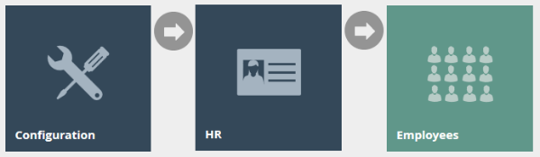

Employees are defined using the Employees option, obtained *via* the
selection sequence shown at right starting from the Main Menu:

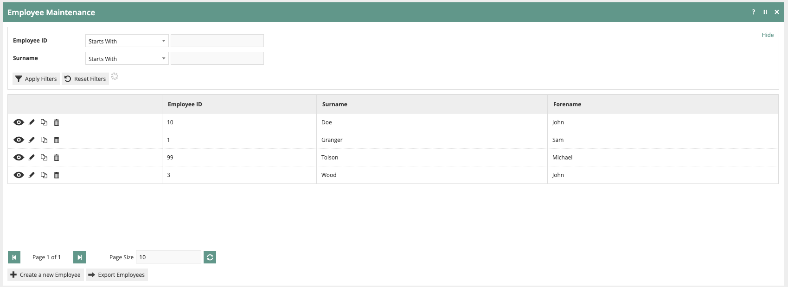

To create a new Employee record, click 'Create a new Employee'.

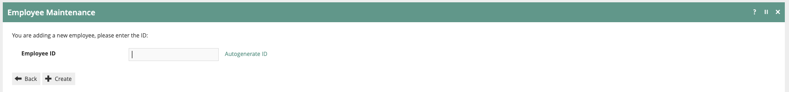

The Employee ID can be entered, or the system can be generated.

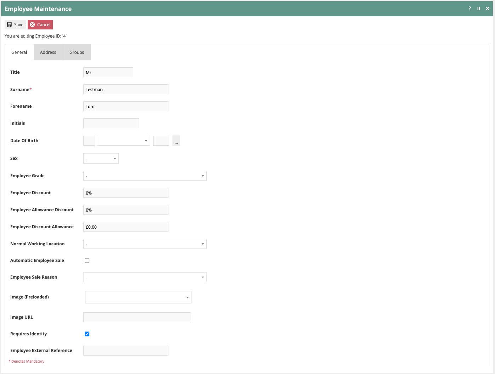

Very limited information is mandatory in the Employee record. Some of
the optional fields directly influence the Employee Sale functionality
regardless of the Discount Type selected. The Normal Working Location
ties an Employee to a Location which can be helpful when searching for
an Employee. The Automatic Employee Sale option initiates an Employee
Sale when the Employee is added to the transaction via Loyalty if
enabled. When using the Automatic Employee Sale option, select the
Employee Sale Reason from the dropdown.

The following options are handled differently depending on the Employee
Discount Type being used: Employee Grade, Employee Discount, Employee
Allowance Discount and Employee Discount Allowance. Configuration of
these options will be reviewed by Discount Type later in this document.

## Employee Sale Reason Type

The configuration of Reasons is covered in a separate guide. Please
refer to that guide for information on navigating to and use of the
Reason Maintenance application.

The Employee Sale Reason Type governs the authorization and business
rules when executing an Employee Sale transaction.

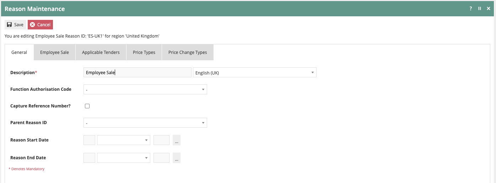

The General tab is consistent with all other Reason Types. Please review
the configuration guide on Reasons for more information regarding these
options.

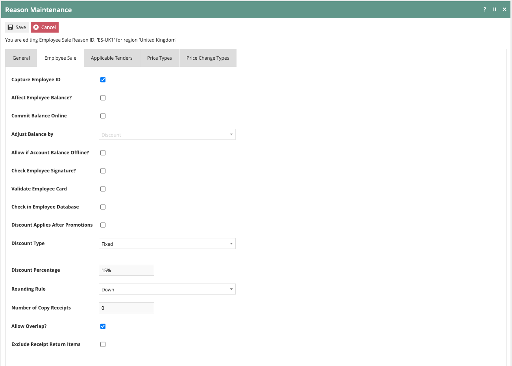

The Employee Sale tab includes settings related to employee validation,
discount eligibility and discount methodology.

The Capture Employee ID option requires that an Employee ID be entered
at the start of an Employee Sale. If the Employee ID is to be validated,
the Check in Employee Database option must also be selected. If an
Employee Card with a number different from the Employee ID is to be used
for validation the Validate Employee Card option should be selected. See
the following section on configuring Employee Cards if appropriate.

Additional Settings on the Employee Sale tab can impact how discounts
are applied regardless of the Discount Type being used. The Discount
Applies After Promotions will apply the selected discount after any
eligible Promotions are applied. The Allow Overlap? option permits the
Employee Sale Discount to overlap with other Reason Type driven
Discounts. The Exclude Receipt Return Items will not apply the Employee
Sale Discount to items that are part of a Receipt Return assuming they
were originally purchased without an Employee Sale Discount.

Many of the remaining settings will be used differently depending on the
Discount Type selected. These items will be reviewed in detail by
Discount Type later in this document.

### Employee Cards 

As discussed previously, it is possible to issue Employee Cards that
must be scanned to initiate an Employee Sale. For security reasons, the
ID used for the Employee Card is not a derivative of the Employee ID.
The initial step of setting up Employee Cards is defining the IIN Range
so POS can recognize the card.

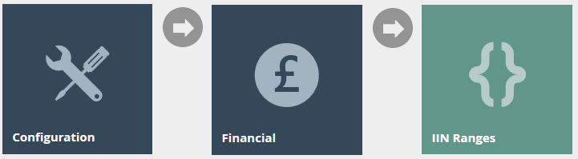

IIN Ranges are defined using the IIN Ranges option, obtained *via* the
selection sequence shown at right starting from the Main Menu:

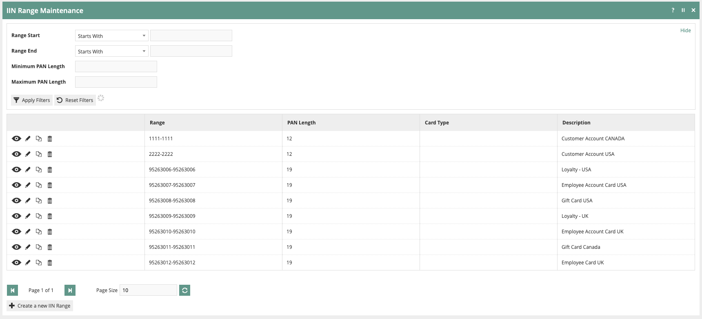

To create a new IIN Range click 'Create a new IIN Range'.

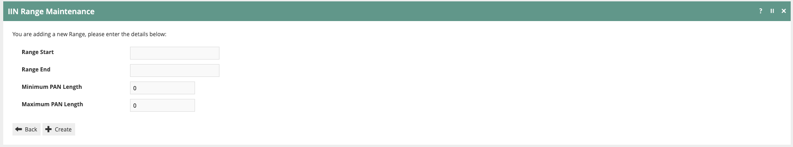

The first step is to specify the Range Start and Range End for the
Employee Card. The Minimum and Maximum PAN Length is also specified on
the initial screen. Once the fields have been completed, click 'Create'.

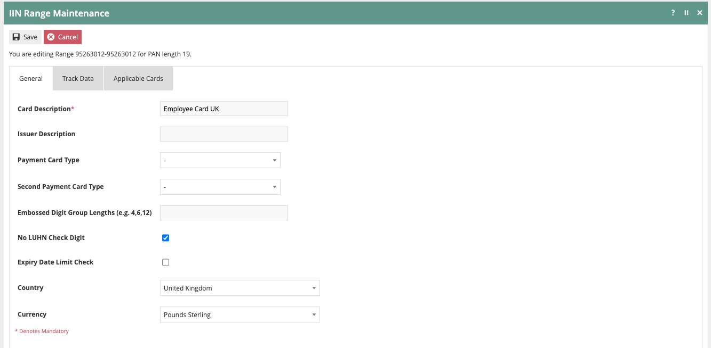

There are multiple tabs displayed within IIN Range Maintenance. On the
General tab, only a Card Description is required. Assuming the card
number does not include a LUHN Check Digit, be sure that option is
selected.

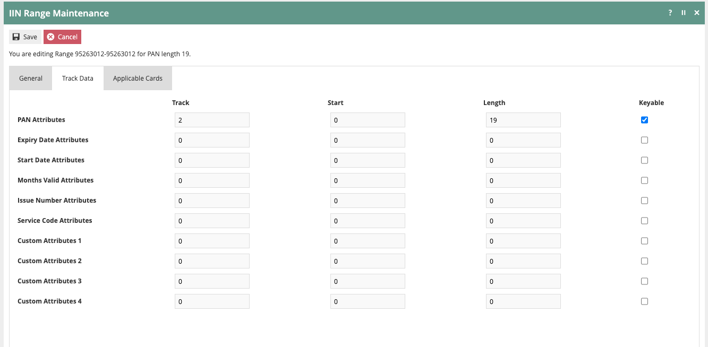

If the Employee Card is to use a magnetic strip, the details on where
the PAN exists must be specified on the Track Data tab.

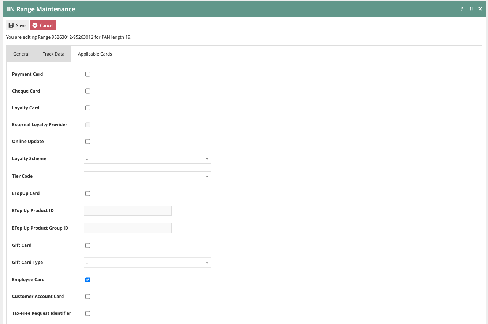

In the Applicable Cards tab, select the Employee Card option.

Once the IIN Range for Employee Cards have been established, it is
possible to associate a card with an Employee ID by using the Employee
Card Maintenance application.

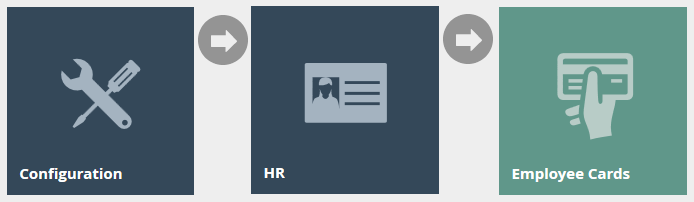

Employee Cards are configured using the Employee Cards option, obtained
via the selection sequence shown at right starting from the Main Menu:

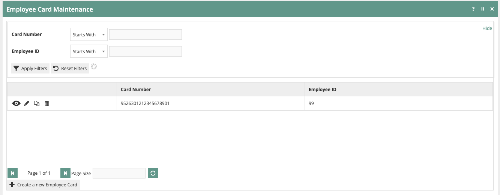

Begin by clicking 'Create a new Employee Card'.

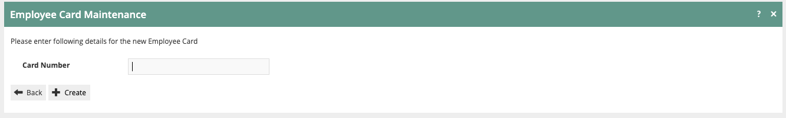

Enter the Card Number and click 'Create'.

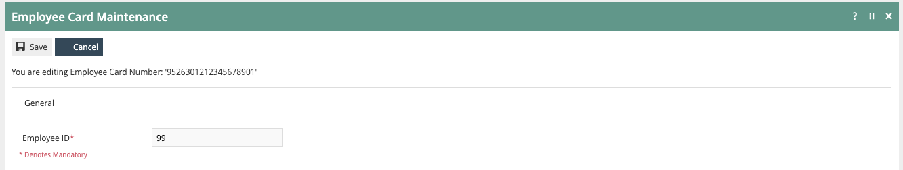

Enter the Employee ID that is to be associated with the Employee Card
Number and save.

Now, when using the Validate Employee Card option in the Employee Sale
Reason, the Employee Card will be required for employee validation.

## Discount Types

At this point, each Discount Type will be reviewed individually. This
will include the specific configuration required within the Employee
Record, Employee Sale Reason and other areas. The following examples all
have the Capture Employee ID and Check in Employee Database options
enabled to perform employee validation at the start of the transaction.

### Fixed Discount

All configuration needed to support a Fixed Discount Type can be
completed within the Employee Sale Reason.

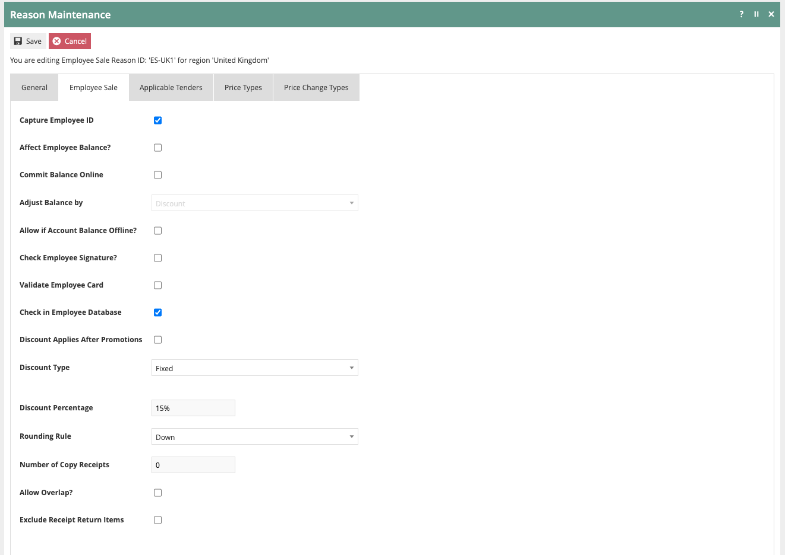

In the Discount Type dropdown, select 'Fixed'. Enter the desired
Discount Percentage and Rounding Rule.

### Employee Discount

#### Without Balance Tracking

To support the Employee Discount Type, configuration of the Employee
Sale Reason and the Employee Record are required.

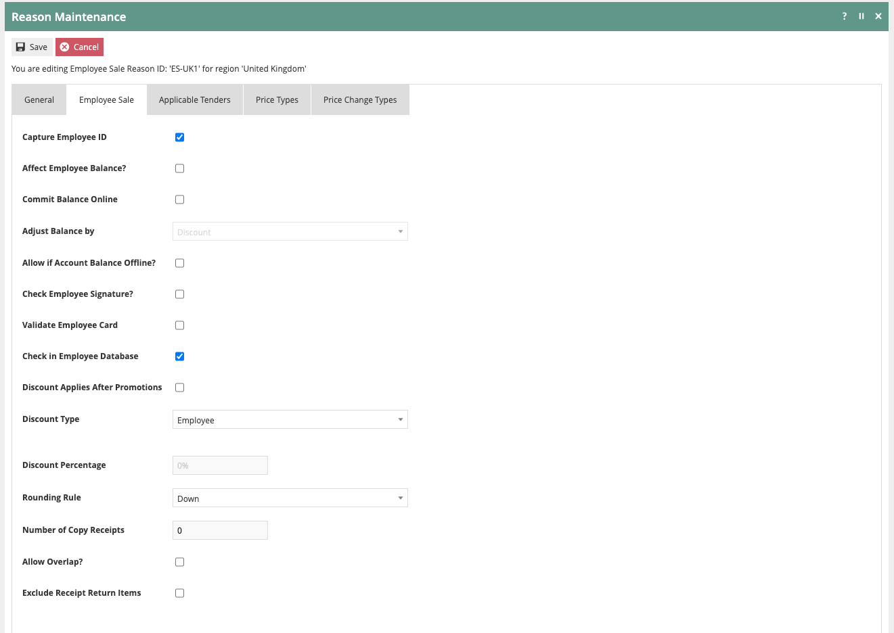

In the Employee Sale Reason, set the Discount Type as Employee on the
Employee Sale tab.

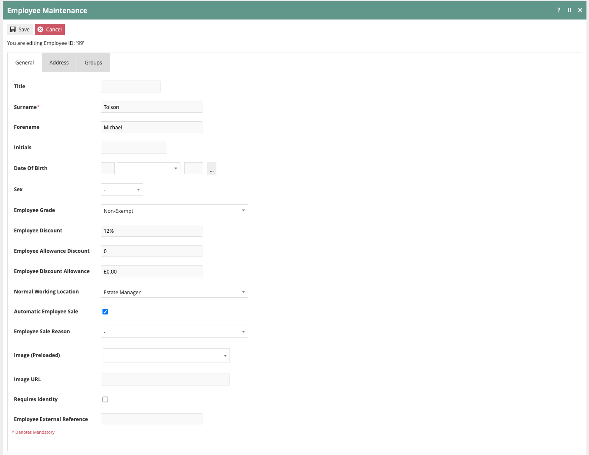

Within the Employee Record, enter the desired Employee Discount
percentage. The Employee Allowance Discount and Employee Discount
Allowance fields will not have entries since a Discount Balance is not
being tracked. Each Employee Record must have an Employee Discount
percentage specified.

#### With Balance Tracking

When using the Employee Discount Type, it is possible to configure a
2-tier discount scheme. This permits a retailer to offer a higher
Employee Discount amount initially but reduce it once an employee has
received a certain level of benefits over a period of time. The
following example assumes that the accumulated discount balance will be
tracked within Enactor.

Configuration of the Employee Sale Reason is done in the same manner
mentioned previously with a few additional settings.

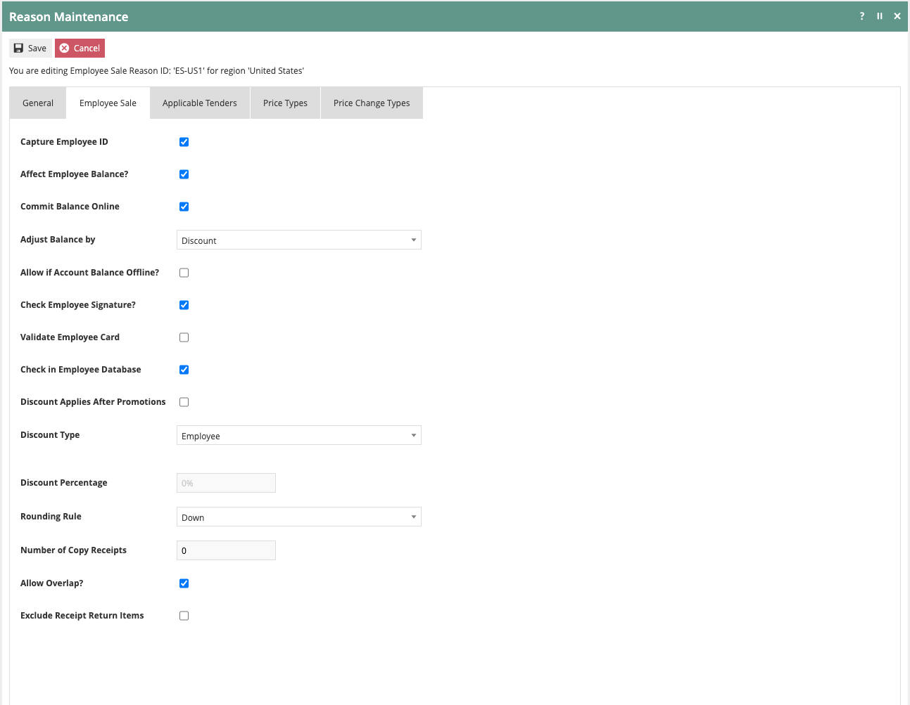

Selecting the Affect Employee Balance? initiates the processes needed to
validate and update employee balances. The Commit Balance Online option
indicates that the tracking will be done within Enactor. The Adjust
Balance by option indicates if the discount levels are based on
accumulated Discount or Spend. In this case, the balance will be
maintained by accumulated Discount.

The Employee Record is configured in the same manner as before, but
additional options will now be specified.

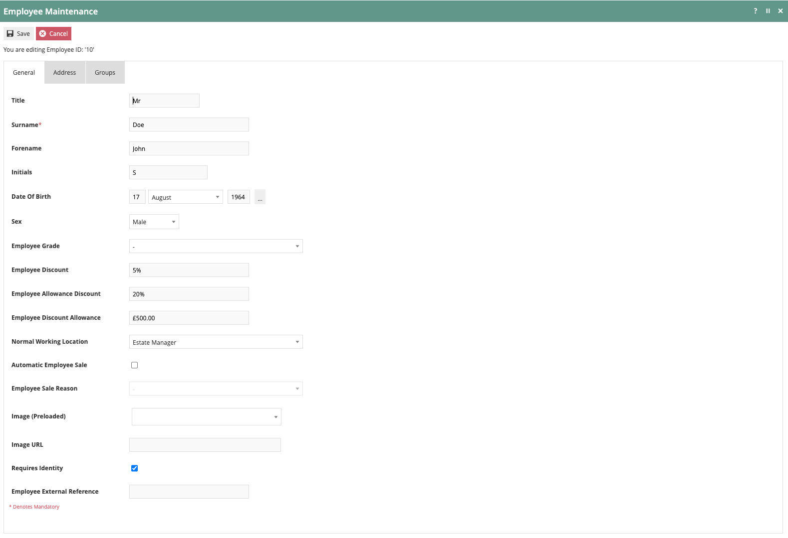

To configure a 2-level discount scheme, the initial discount amount is
entered as the Employee Allowance Discount. The discount amount after
the threshold is exceeded is entered as the Employee Discount. The
threshold amount is the Employee Discount Allowance.

In the example above, an Employee will receive a 20% employee discount
at the start of a period. Once they have accumulated \$500 in Employee
Discounts, they will only receive a 5% discount through the end of the
period.

When using a Discount Type that depends on Balance Tracking, an Employee
Account must be created. This is where the balance will be maintained.

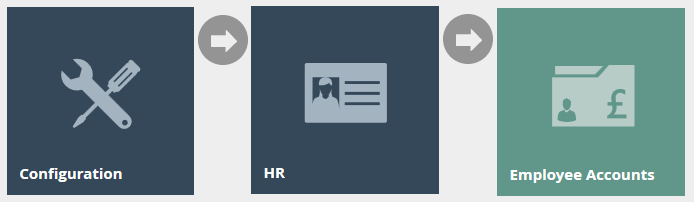Employee Accounts are maintained using the Employee
Accounts option, obtained *via* the selection sequence shown at right
starting from the Main Menu:

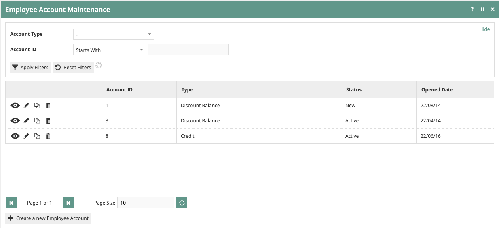

Click the 'Create a new Employee Account' button.

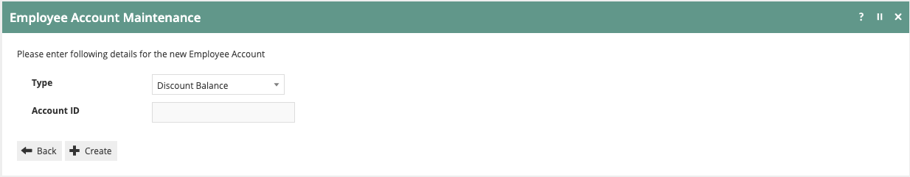

Select the Type of account from the dropdown. Since the account is
tracking accumulated discount in this example, select Discount Balance.
The Account ID is set to the Employee ID. The account can now be
created.

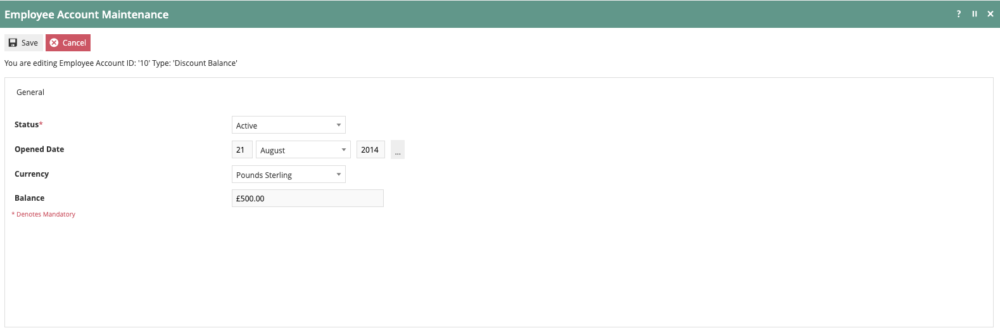

Since the account is being created manually, the amount entered on the
Employee record for the Employee Discount Allowance must be entered as
the Balance for the Employee Account. The account can now be saved. Once
the changes have been broadcast, discounts received on Employee Sales
will accumulate in the account. Be sure to set the Status to Active to
fully enable the account.

When an Employee Sale is initiated at POS, the Employee information
along with the Account Balance is displayed. The Account Balance
represents the amount of discount value available at the Employee
Allowance Discount level. Once the Account Balance reaches £0.00, the
discount level will be switched to the Employee Discount.

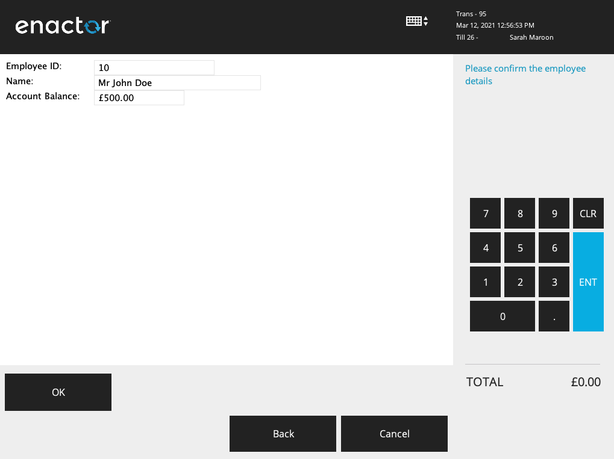

Once the Employee Discount Allowance is reached, the discount percentage
will switch from the Employee Allowance Discount to the Employee
Discount Amount. The retailer will reset the Account Balance when they
reach the end of their defined period.

### Employee Spend

The Employee Spend Discount Type is a variation of the Employee Discount
Type with Balance Tracking. This Discount Type uses an accumulated spend
balance to determine which discount level is available.

There Employee Sale Reason configuration is very similar to the previous
example. The changes required can be seen below.

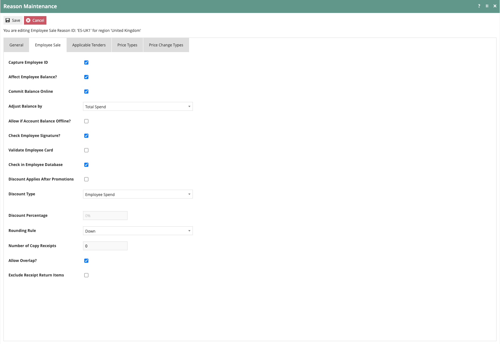

In the Employee Sale Reason configuration, select a Discount Type of
Employee Spend and set the Adjust Balance by option to Total Spend.

The Employee Record is configured in the same way as the previous
example. Note that it is not necessary to make an entry for the Employee
Discount Allowance when using this Discount Type.

When tracking by Total Spend, a different Employee Account Type is
required. This Discount Type is used with a Discount Spend Employee
Account Type. The setup is similar to the previous example.

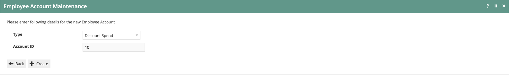

Select Discount Spend from the Type dropdown and enter the Employee ID
as the Account ID and click 'Create'.

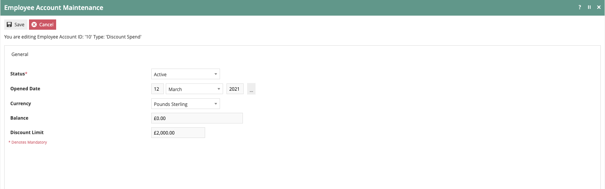

Once the account is created, enter the Discount Limit. The Discount
Limit represents the allowable amount of accumulated spend within
Employee Sale transactions before the discount changes from the Employee
Allowance Discount to the Employee Discount specified in the Employee
Record. Be sure to set the Status to Active to fully enable the account.

When initiating an Employee Sale at POS, the Employee Information will
be displayed along with the current Account Balance. The Account Balance
represents the remaining amount that can be spent within Employee Sales
before the shift in discount level.

### Employee Grade

In the previous examples, it has been demonstrated how to apply a
consistent level across all Employees as well as being able to specify
discount level by Employee. An additional option is available that
permits setting the Employee Discount by Employee Grade. An Employee
Grade is part of the retailer's HR structure that groups similar job
roles and or pay ranges into Employee Grades. When using a Discount Type
of Employee Grade, the Employee Account Balance will be tracked by
Discount.

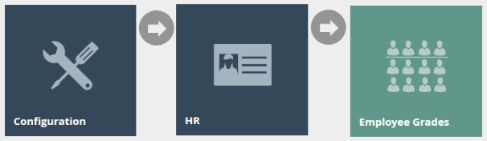

Employee Grades are defined using the Employee Grades option, obtained
*via* the selection sequence shown at right starting from the Main Menu:

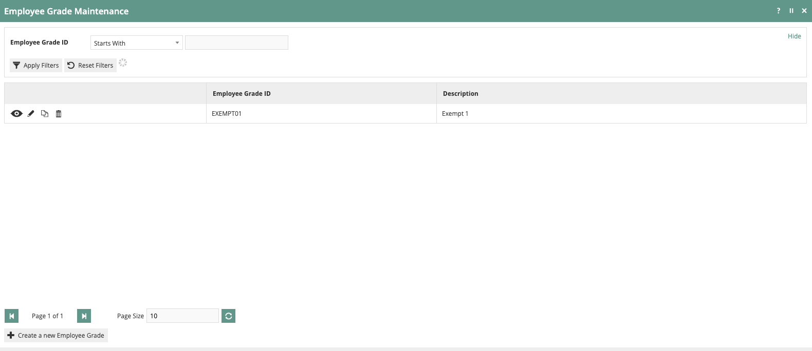

From the Employee Grade Maintenance application, click 'Create a New
Employee Grade'.

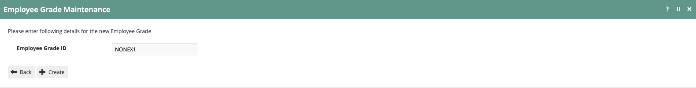

Enter the Employee Grade ID and click 'Create'.

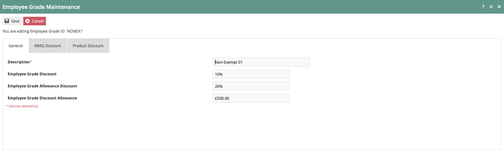

Once the Employee Grade has been created, enter a Description for the
Grade. Similar to the Employee Discount Type, multiple levels of
Employee Discount can be specified. The Employee Grade Allowance
Discount represents the Discount that will be applied before the
Employee Grade Discount Allowance level is met. The Employee Grade
Discount is the Discount that will be applied after Employee Grade
Discount Allowance level is exceeded. The MMG Discount and Product
Discount tabs are only used with other Discount Types.

Once all Employee Grades have been created, proceed with the following
configuration.

The Employee Sale Reason configuration is similar to previous Discount
Types.

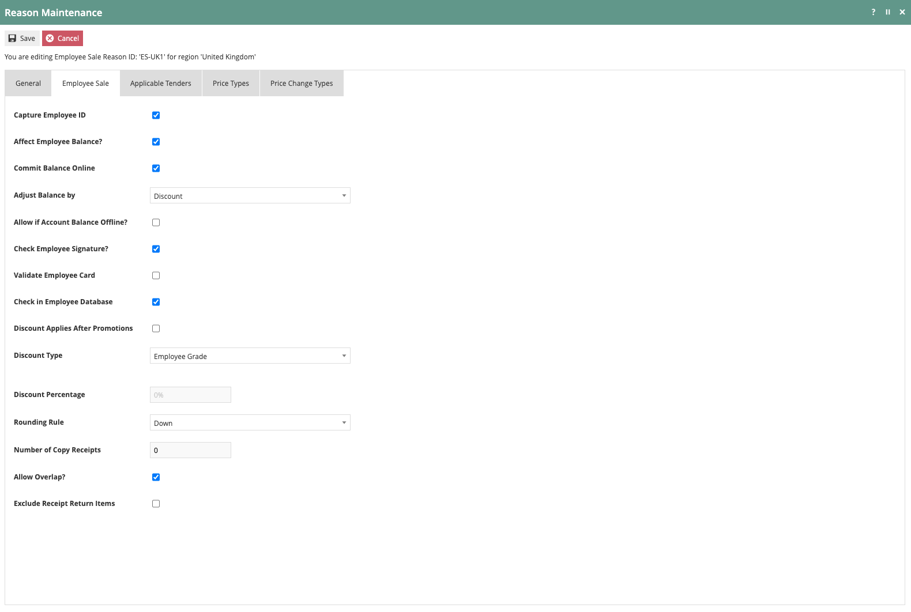

The Discount Type should be set to Employee Grade and select Discount
for the Adjust Balance by option.

An Employee Grade must be specified for each Employee.

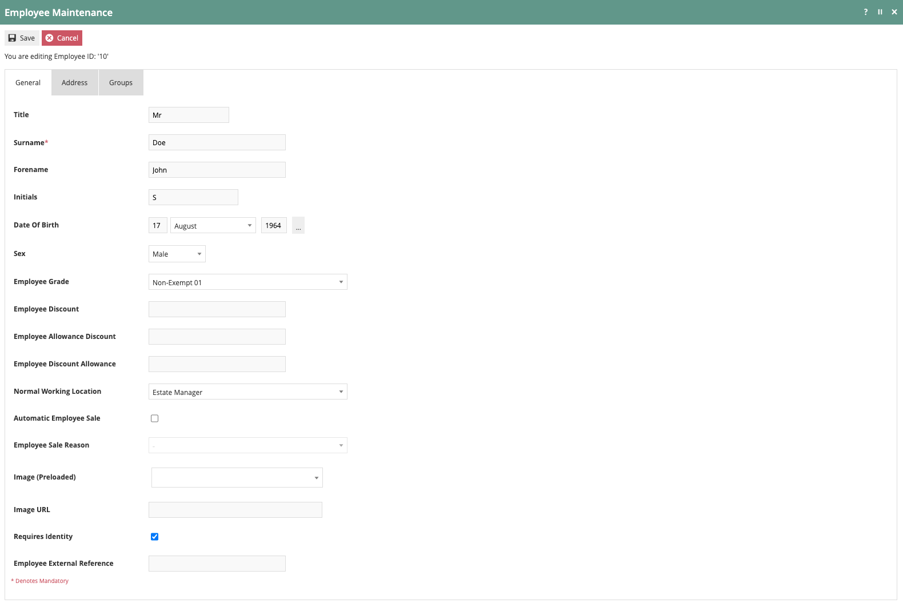

Select the appropriate Employee Grade for the Employee. Note, it is not
necessary to specify Employee Discount, Employee Allowance Discount or
Employee Discount Allowance in the Employee record when using the
Employee Grade Discount Type.

An Employee Account will need to be created to be used with the Employee
Grade Discount Type.

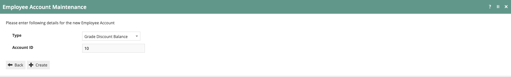

When creating the Employee Account, select Grade Discount Balance as the
Type. The Account ID is set to the same value as the Employee ID.

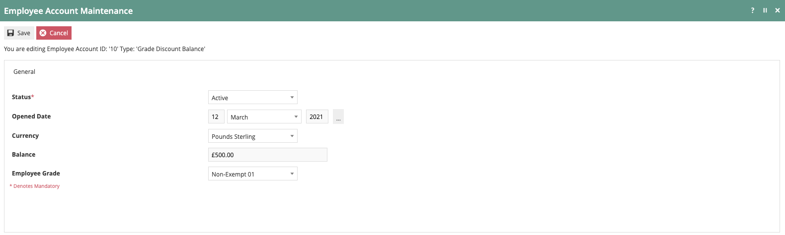

Once the Account has been created, set the Balance to the desired
Employee Grade Discount Allowance and select the employee's grade from
the dropdown. Be sure to set the Status to Active to fully enable the
account.

At POS, the information shown at the beginning of an Employee Sale is
consistent with other Discount Types that use Discount Balance tracking.

### Employee Grade Spend

This Discount Type is a variant of the Employee Grade Discount Type. The
Employee Grade Spend Discount Type differs in that Balance Tracking is
done by Spend as opposed to Discount.

The configuration of Employee Grades and associated changes to the
Employee record are done as explained in the previous section.

The configuration of the Employee Sale Reason is shown below.

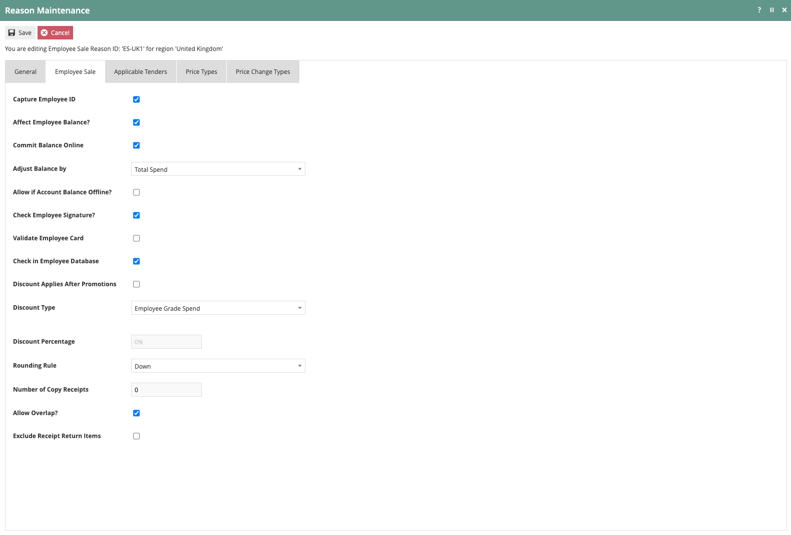

Be sure that the Adjust Balance by option is set to Total Spend and the
Discount Type is Employee Grade Spend.

An Employee Account will need to be created to be used with the Employee
Grade Spend Discount Type.

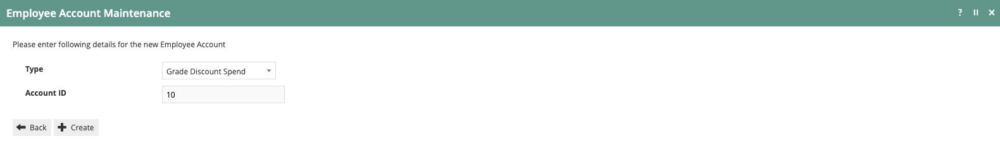

The Employee Account Type is set to Grade Discount Spend. The Account ID
should be set to the associated Employee ID.

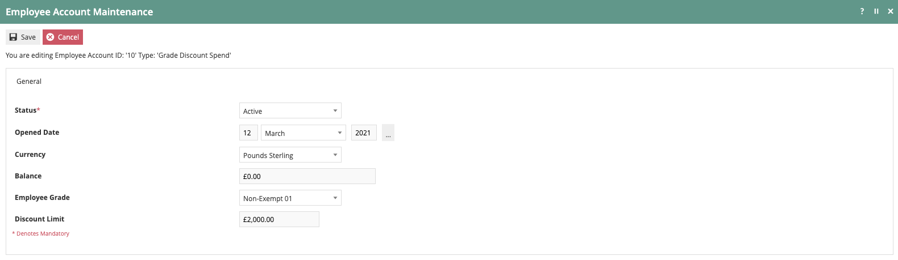

Once the account has been created, the appropriate Employee Grade should
be selected, and the Employee Grade Discount Allowance is entered. Be
sure to set the Status to Active to fully enable the account.

At POS, the information shown at the beginning of an Employee Sale is
consistent with other Discount Types that use Spend Balance tracking.

### Employee Grade By MMG

The Employee Grade By MMG Discount Type not only allows different
discount levels based on Employee Grade but it also permits specifying
different discount levels by MM Group and Product ID. The Employee Grade
By MMNG Discount Type utilises Balance Tracking by Discount to determine
discount level.

Employee Grades are created in the same manner as described in the
Employee Grade Discount Type.

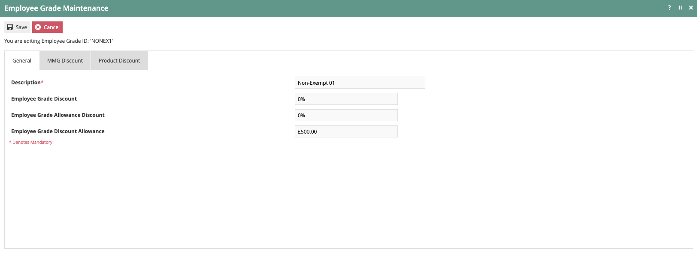

The Employee Grade Discount and Employee Grade Allowance Discount fields
are not used with this Discount Type. The Employee Grade Discount
Allowance is still used to specify the Discount Balance level that will
result in a change of discount levels.

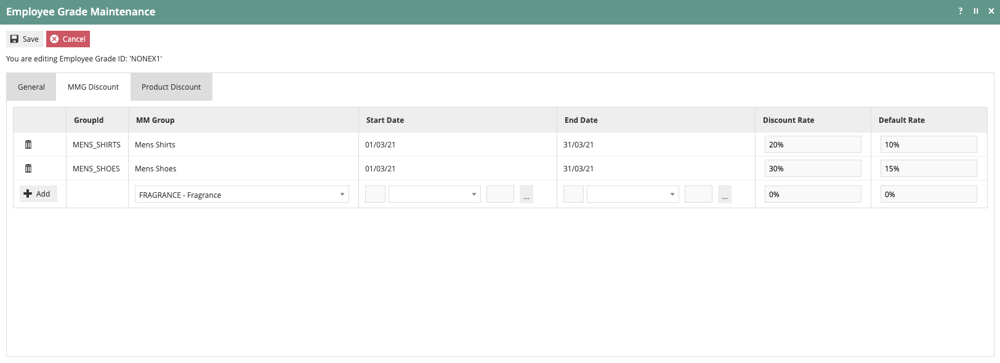

On the MMG Discount tab, specify the desired MM Group, effective dates
and Discount Rates. Start by selecting the MM Group from the dropdown.
Specify the Start Date and the End Date for the discount. The Discount
Rate will be applied before the Employee Grade Discount Allowance is met
and the Default Rate will be used after the allowance is met. Once all
entries have been made, click the 'Add' button.

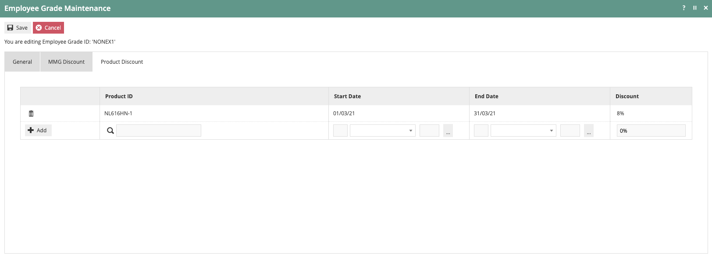

On the Product Discount tab, it is possible to specify a Discount for a
specific Product ID. Enter a Product ID or click the magnifying glass to
search for a product. Enter a Start Date and an End Date for the
Discount. A single Discount level is supported when creating a Product
Discount.

It is important to note that products that are not listed on the Product
Discount tab or are part of an MM Group specified on the MMG Discount
tab, will not be discounted in an Employee Sale.

The Employee Sale Reason configuration is shown below.

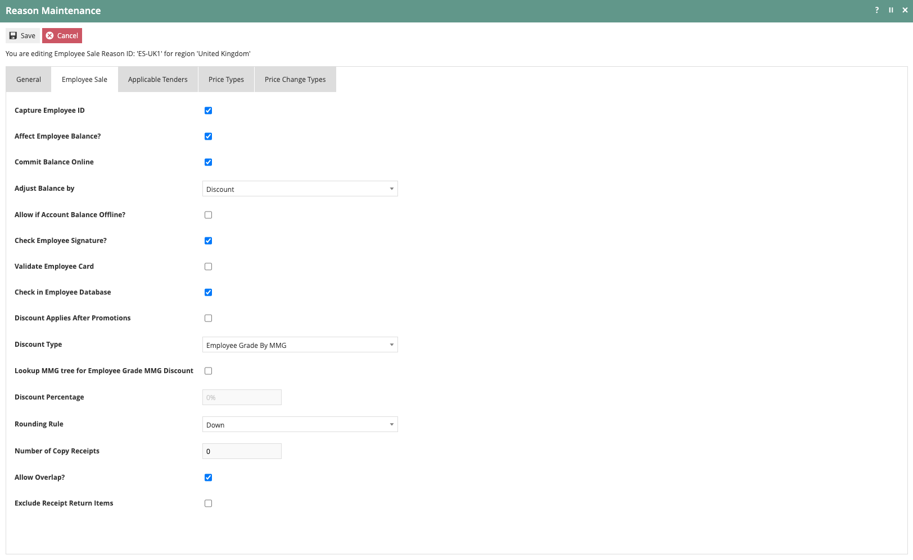

An Employee Account will need to be created to be used with the Employee
Grade By MMG Discount Type. Employee Account setup will mirror what was
described for the Employee Grade Discount Type.

At POS, the information displayed at the beginning of an Employee Sale
transaction is consistent with other Discount Types that utilise Balance
Tracking by Discount. Unlike other Discount Types, it is likely that
various discount levels, including no discount, may be shown in the
transaction.

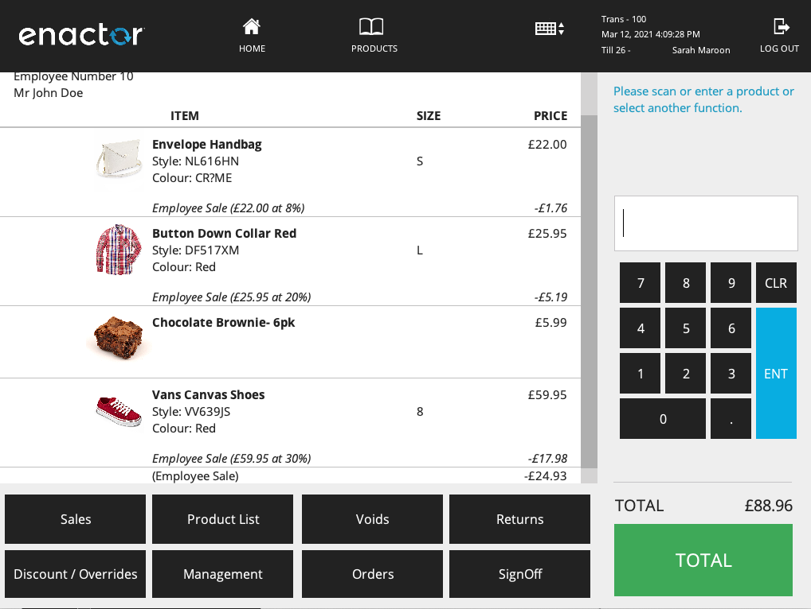

### Employee Grade Spend By MMG

This is a variant of the Employee Grade By MMG Discount Type where
Balance Tracking is done by Spend. When configuring the Employee Grade
Spend By MMG Discount Type only the Employee Sale Reason and Employee
Account differ from what was explained in the previous section.

The Employee Sale Reason configuration is shown below.

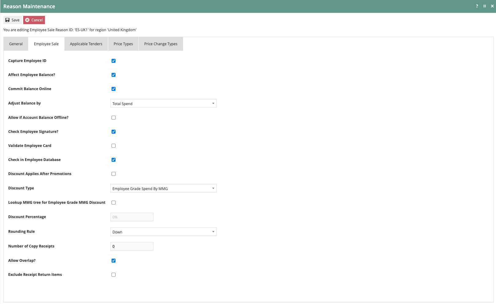

Adjust Balance by should be set to Total Spend. Select Employee Grade
Spend By MMG as the Discount Type.

An Employee Account will need to be created to be used with the Employee
Grade Spend By MMG Discount Type. Employee Account setup will mirror
what was described for the Employee Grade Spend Discount Type.

At POS, the information displayed at the beginning of an Employee Sale
transaction is consistent with other Discount Types that utilise Balance
Tracking by Spend. Unlike other Discount Types, it is likely that
various discount levels, including no discount, may be shown in the
transaction. An example can be viewed in the previous section.

### Promotions

Promotions are discussed in detail in a separate configuration guide.
Please reference that document for detailed information on setting up
offers. Once a Promotion has been created, it can be made available in
an Employee Sale or can be made exclusive to an Employee Sale.

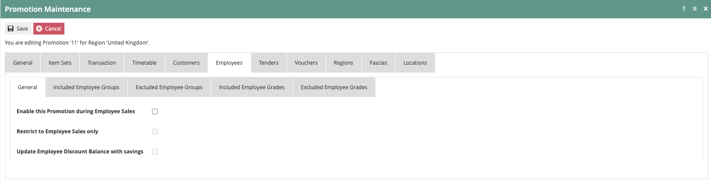

In the Promotion Maintenance application, navigate to the Employees tab.
On the Employees -- General tab, select the Enable this Promotion during
Employee Sales option to allow the Promotion to apply in an Employee
Sale transaction. By selecting the Restrict to Employee Sales only the
promotion will only be available in Employee Sale transactions. If the
Employee Sale Reason is set to Adjust Balance by Discount, the discount
obtained from the Promotion can be added to the balance when the Update
Employee Discount Balance with savings option is selected.

Additionally, it is possible to Include or Exclude specific Employee
Grades by selecting and adding them on the appropriate tabs. This can
also be done by Employee Groups. The configuration of Employee Groups is
reviewed below.

The general creation of Groups is discussed in the Organisation
Structure guide. To create an Employee Group, navigate to Group
Maintenance and select the Employee Group as the Group Type.

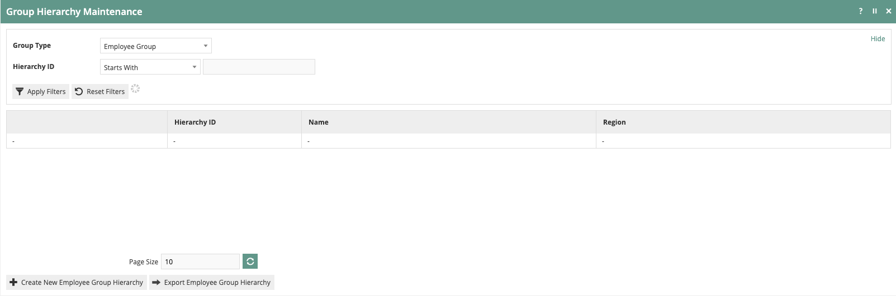

Click on 'Create New Employee Group Hierarchy'.

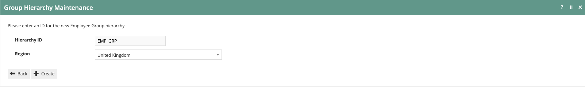

Enter a Hierarchy ID, select the appropriate Region and then click
'Create'.

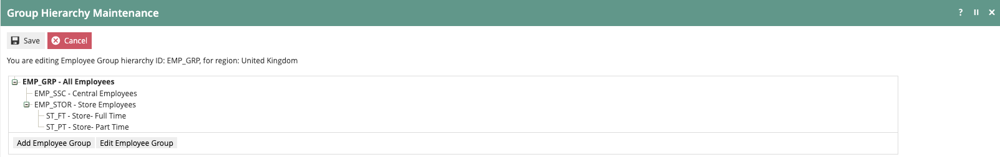

Use the Add Employee Group function to create the desired Employee Group
Hierarchy. Once created, the Employee Group can be set on the Employee
Record.

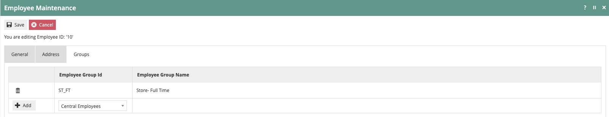

In Employee Maintenance, select the desired Employee and navigate to the
Groups tab. Select the desired Employee Group from the dropdown and
click 'Add'. Repeat until all applicable groups have been added.

### Product Restrictions

Using the Employee Grade by MMG Discount Type variants allow some
control over what products are eligible for Employee Sales. In many
cases, it may be more practical to simply exclude specific items from
being discounted in an Employee Sale which can be done in Product
Maintenance.

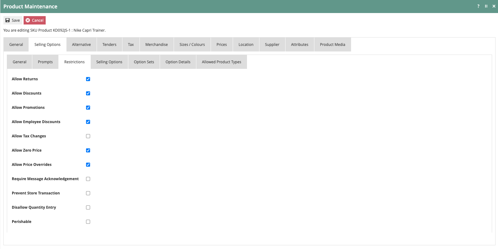

After finding and selecting the Product in Product Maintenance, select
the Selling Options -- Restrictions tab. Deselect the Allow Employee
Discounts option to prevent discounts during an Employee Sale.

# 

# 
