# Creating and Customising Receipts

#Introduction

The purpose of this guide is to show how to configure Receipts to allow
you to set up and customise a variety of Receipts to meet your
organisations' needs. This guide introduces all the basics in
understanding the Receipt Maintenance and the various terminologies that
are associated with it, and then walks through on the different
customisations that can be made to the receipts that are available for
customisation in the Receipt Maintenance.

## Overview

This guide will cover the configuration for the following:

-   Receipts Configuration -- Provides all the basics required in
    understanding the Receipt Maintenance, its terminologies and how a
    basic customisation can be done to a Receipt and printed in a
    physical printer.

-   Customisations to Receipts -- Provides a step-by-step guide on the
    various range of customisations that can be made to the different
    Receipts that are available for customisation in the Receipt
    Maintenance.

# Receipts Configuration

This section covers all the basics that are required to understand the
Receipt Maintenance and start making receipt customisations. The areas
that are covered in this section are accessing the receipt maintenance,
creating a new receipt, getting started with the new receipt by making a
basic customisation to it and finally understanding the various
terminologies of the Receipt Maintenance.

## Accessing Receipt Maintenance

If a user needs to access Receipt Maintenance, they will need the
appropriate privileges for their user account. However, Receipt
Maintenance has a larger number of privileges than other maintenance
applications, so it is important to ensure that the correct privileges
have been enabled for your users.

To enable these privileges, follow the steps below:

Navigate to User Role Maintenance using the Search or the path

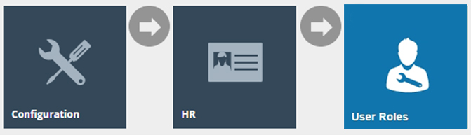 

In the User Role Maintenance, select the **Edit icon of the User** that
you wish to enable the privilege for.

Navigate to the **Authorised Functions tab** of that selected User and
change the filter of the Application Package as **Receipt Maintenance**
as follows:\
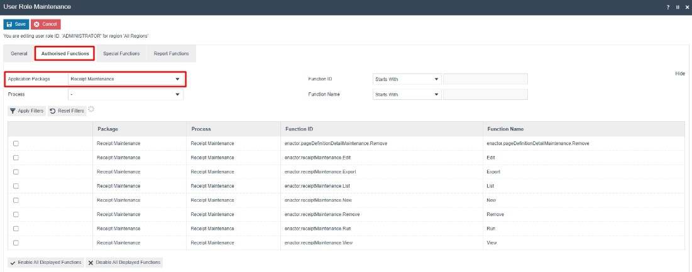 

This would list out all the privileges that are needed in order to be
able to access all the Standard Receipts functions as follows:

  
| Package | Process | Function ID | Function Name |
| ---- | ---- | ---- | ---- |
| Receipt Maintenance | Receipt Maintenance | enactor.receiptMaintenance.View | View |                                                
| Receipt Maintenance | Receipt Maintenance | enactor.receiptMaintenance.Run | Run |
| Receipt Maintenance | Receipt Maintenance | enactor.receiptMaintenance.Edit | Edit |
| Receipt Maintenance | Receipt Maintenance | enactor.receiptMaintenance.New | New |
| Receipt Maintenance | Receipt Maintenance | enactor.receiptMaintenance.Remove | Remove |
| Receipt Maintenance | Receipt Maintenance | enactor.receiptMaintenance.List | List |
| Receipt Maintenance | Receipt Maintenance | enactor.receiptMaintenance.Export | Export |
| Receipt Maintenance | Receipt Maintenance | enactor.pageDefinitionDetailMaintenance.Remove | Remove |

Make sure that your User has the required privileges enabled by ticking
on the necessary functions that are listed or if you want to enable all
privileges, just click on **Enable All Displayed Functions** and click
on **Save**.

For these changes to apply, sign out and back into the Estate Manager.

Now you will be able to access the Receipt Maintenance and carry out all
Receipt related functions.

## Create a new Receipt

The Receipt Maintenance is used to create new Receipts. To create a new
Receipt follow the steps below:

Navigate to Receipt Maintenance using the Search or the path

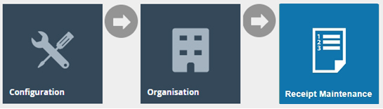

Select **New Receipt Document** on the Receipt Maintenance page.

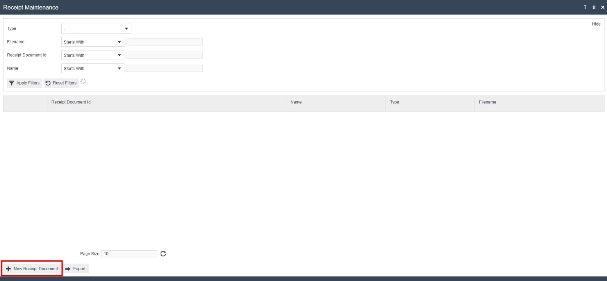 

This will open the **New Receipt** screen where the following 3 fields
must be defined for this new Receipt:

| Configuration | Description |
| ---- | ---- |
| Type | Select the Receipt Type from the Type drop-down.  This is the page definition type that the custom receipt will be linked to. This is necessary for the custom receipt to be discoverable by other maintenance applications. |
| Receipt Document ID  | Enter a unique Receipt Document ID for the new Receipt.  This is the unique id of the receipt. It will be used as part of the generated filename for the custom receipt. It will also be used as part of the page definition detail automatically generated for the custom  receipt. The ID can be alphanumeric and contain a maximum of 20 characters and will be used to uniquely identify this new Receipt. Use of a systematic and business-specific naming convention is recommended here. |
| Original Receipt Document | Select an Original Receipt Document from the Original Receipt Document drop-down.  This is a drop-down of the available system receipts. This is automatically restricted based Type that was selected above. The values displayed are the filenames of the receipts. The file name of the selected system receipt will be used for generating the filename of your custom receipt.  The Original Receipt Document selected here will decide the width of the custom receipt that is you are going to create, since this will inherit its layout from the selected system receipt, as well as any future changes to that system receipt. 

We will create a new Receipt with the Type **Standard Receipt** and the
Original Receipt Document as **StandardReceiptTemplate44**, which would
give us a 44-columns width Receipt as follows:

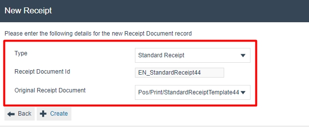 

**Note:** The create button will not appear until a type has been
selected. Also note that, if system receipts under the Original Receipt
Document dropdown are not available for the Type that is selected, then
you will not be able to create a custom receipt in Receipt Maintenance.

Once **Create** is clicked, you will be navigated to the Edit Receipt
page for your new Receipt. This receipt will match the layout for the
system receipt and therefore look identical until customisations are
made. In order to use the new custom receipt, you will need to enter a
name. The input for this field is presented in the initial view of the
receipt.

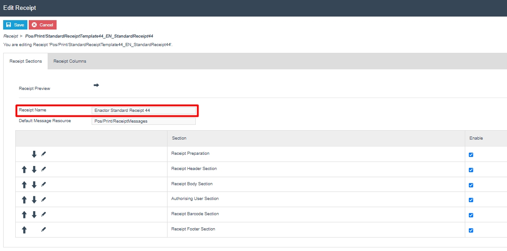 

**Note:** It is recommended that you save the receipt once you have
entered a name. It is easier to back out of changes if you can simply
exit the page. By saving now, you avoid having to recreate the receipt
while making the initial changes.

The Edit Receipt Maintenance, for the newly created Receipt, is
presented with the 2 key tabs namely; **Receipt Sections and Receipt
Columns**.

### Edit Receipt -- Receipt Sections

The **Receipt Sections** Tab contains the list of each section that the
Receipt consists of. Eg: Receipt Header Section, Receipt Body Section,
Receipt Footer Section.

Using this, customisations can be made separately for each section of
the Receipt.

This tab is also where the preview of the Receipt can be set up and
viewed.

Customisations to Receipt Sections and Previewing of the Receipt will be
further explained later in this guide.

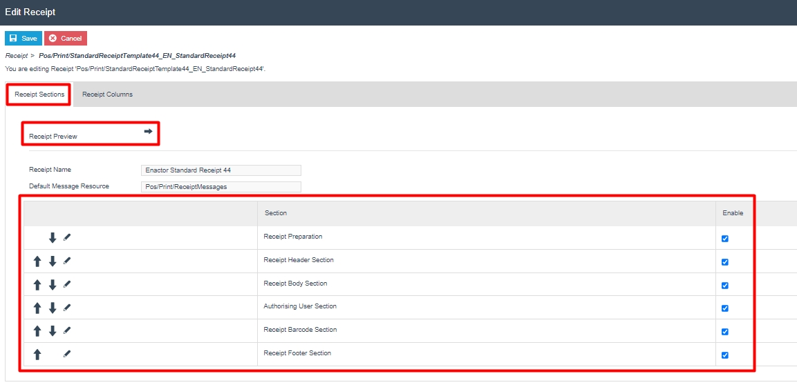 

### Edit Receipt -- Receipt Columns

The **Receipt Columns** Tab contains the list of all configured columns
that the Receipt can make use of in each of its sections.

Eg: Address Details, Item Detail, Amount, Item Value.

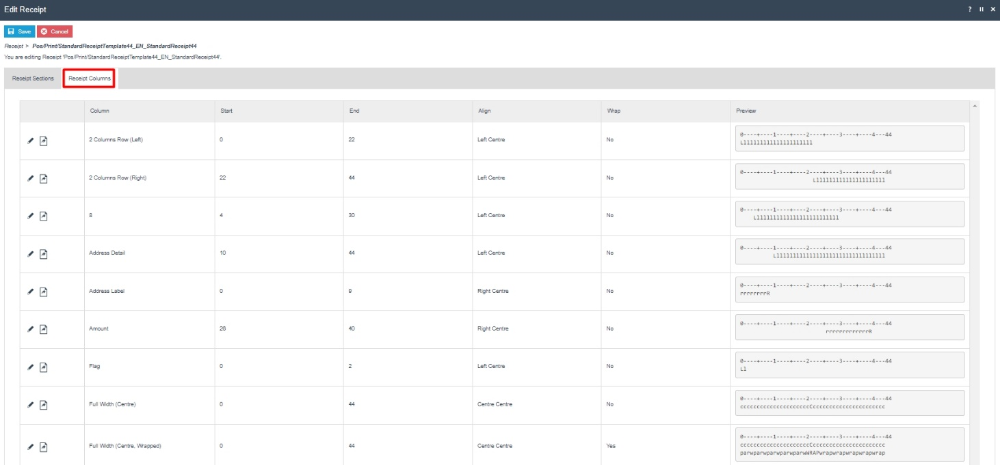 

Each of these columns can be edited by clicking on the edit sign. New
columns can also be created by clicking on **Create** at the end of this
table.

Customisations to Receipt Columns will be further explained later in
this guide.

**Getting Started with Receipts**

This section allows you to get started with making proper use of the
Receipts Maintenance and covers the basics on:

-   How a customisation can be made to a new Receipt.

-   Previewing the customised Receipt in the Receipt Maintenance.

-   Getting the customised Receipt printed using a physical printer in
    the POS.

To make the customisations, we will use the Enactor Standard Receipt 44,
which is the following 44-column Standard Receipt that was created in
the previous section:

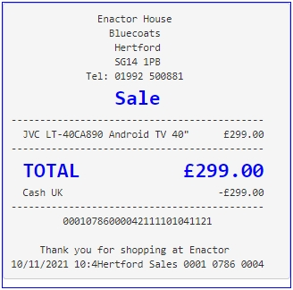

The customisation is to hide the currency symbols of each merchandise
item in the receipt that is printed.

Making the First Customisation

Receipts display the currency symbols of the item values by default. To
hide the currency symbols, we should first navigate to the exact element
that displays the currency symbol for the item value in the Receipt.

First, navigate to the Receipt Maintenance and click on the **Edit icon
of the Receipt** that was created.

In the Edit Receipt page, we need to make the customisation to the
Receipt Body Section, hence click on the **Edit icon of the Receipt Body
Section** as follows:

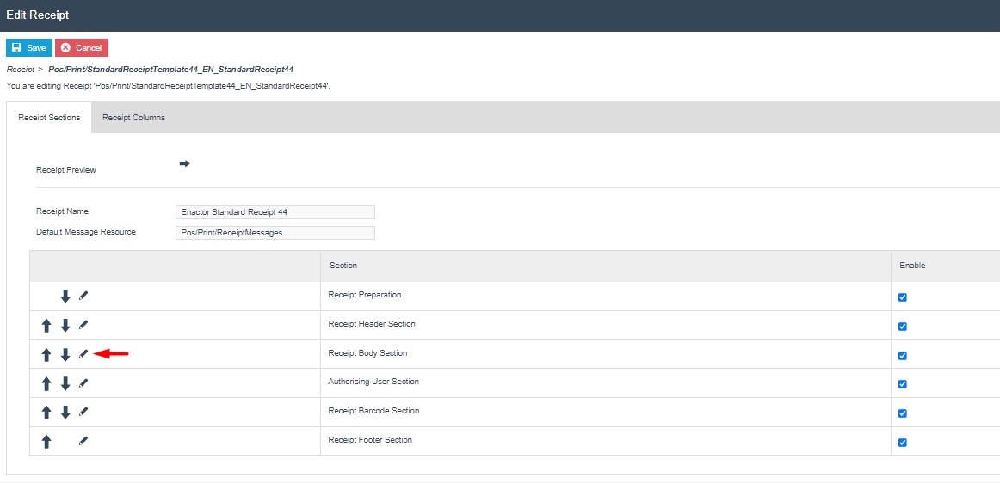 

This would list down the Elements used in this Receipt Body Section.
From this section, we need to navigate to the Element which displays the
current item value of the Receipt. Following is the path where this
element exists:\
Basket Items List \> Merchandise Item \> Merchandise Standard Item
Details \> Value

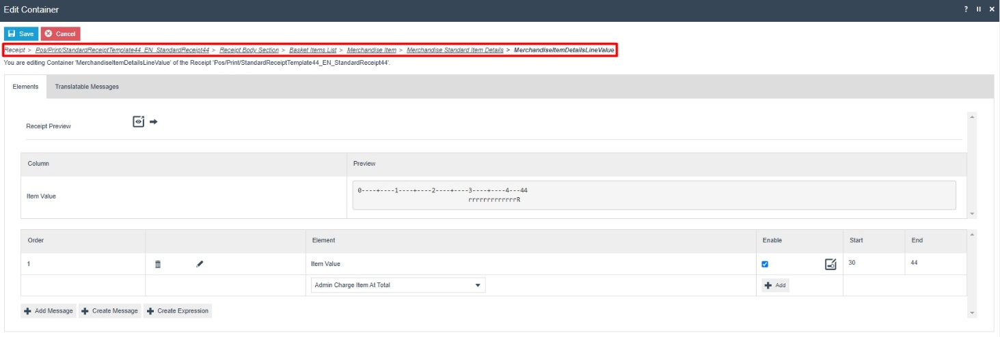 

It can be noticed that there is an element called Item Value here, which
is what displays the value of each item in the Receipt, which also
includes the currency symbol.

First, we need to isolate the currency symbol and item value as 2
elements.

1 -- **Disable the current "Item Value" element and select the following
2 elements from the dropdown and click + Add**:

-   Sales Item Value Currency

-   Sales Item Value

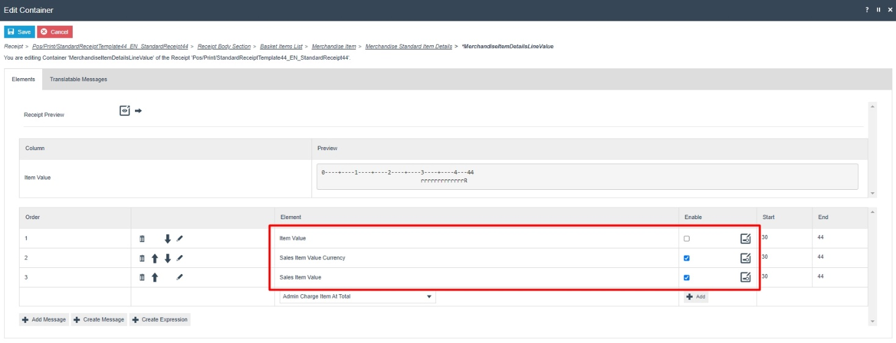 

If you now check the preview of the receipt, you will notice that adding
these 2 elements have had the same effect as the Value element that was
disabled.

**Note:** Previewing of the Receipt is covered in the next sub-section.

Next, the currency symbol is to be hidden.

2 -- **Disable the "Sales Item Value Currency" element** as follows:

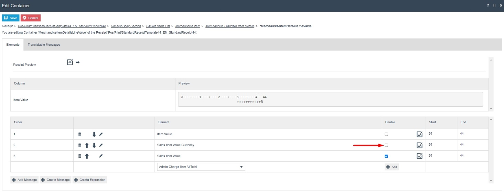 

Now **click on Save and navigate to the root of the Receipt and save all
changes** to this Receipt.

Once these changes have been made, we should navigate to the root of the
Receipt to save all changes.

For this click on the
**Pos/Print/StandardReceiptTemplate44_EN_StandardReceipt44** in the
Navigation Bar that is found right below the Save button as follows:

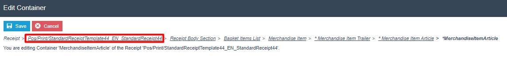

A Confirm Navigation popup would appear showing the changes that have
been made and make sure to click **Save and Continue,** which would save
the changes in these sections.

Finally, click on the **Save** button to successfully save the Receipt
and now you are ready to try out the customised Receipt.

Previewing the Customised Receipt

Using the Receipt Maintenance, we will be able to preview the changes
made to the Receipt. For this go back to the Edit Receipts page of the
Enactor Standard Receipt 44, and click on the **"→" icon of the Receipt
Preview** field as follows:

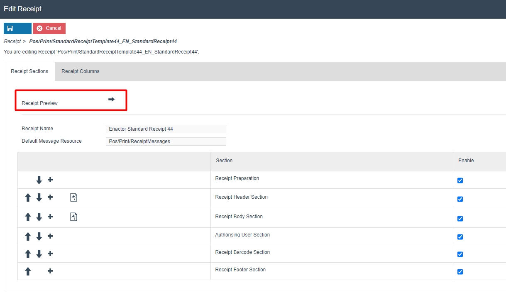 

This would navigate to the Retail Transaction Archive of the Estate
Manager. Using this select a transaction suitable to be used as the
Receipt Preview.

Next, in the Edit Receipt Preview page, **Enter a suitable description**
for this Receipt Preview as follows:

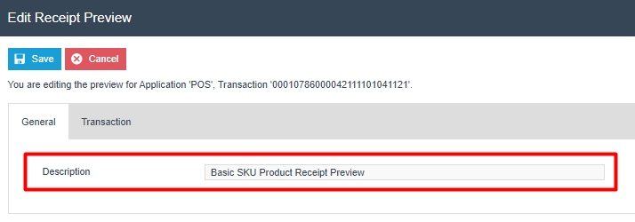 

Once you click **Save**, you can now notice there is a new Show Preview
icon that appears along with → icon in the Receipt Preview field.

Click on the **Show Preview of the Receipt Preview field**, which would
bring up the Receipt Preview.\
Following are examples of the Receipt Previews before and after the
currency symbol customisation is made:

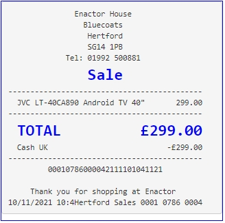

This way you can clearly notice that the customisation made to disable
the currency symbol has been successfully made, and only the value of
each Merchandise Item is now displayed in the Receipt.

Printing the Receipt on a Physical Printer

Now that we have made and previewed a customisation to a receipt, we are
ready to use this customised Receipt on a physical printer.

To set this customised Receipt as your Primary Receipt, navigate to the
POS Terminal Maintenance using the Search or the path:\
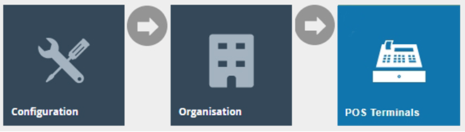 

Click on the **Edit icon of the POS Terminal** that the Primary Receipt
is to be changed.\
**Go to the tab Printing → General** and in the drop-down for Primary
Receipt select **Enactor Standard Receipt 44** as follows:

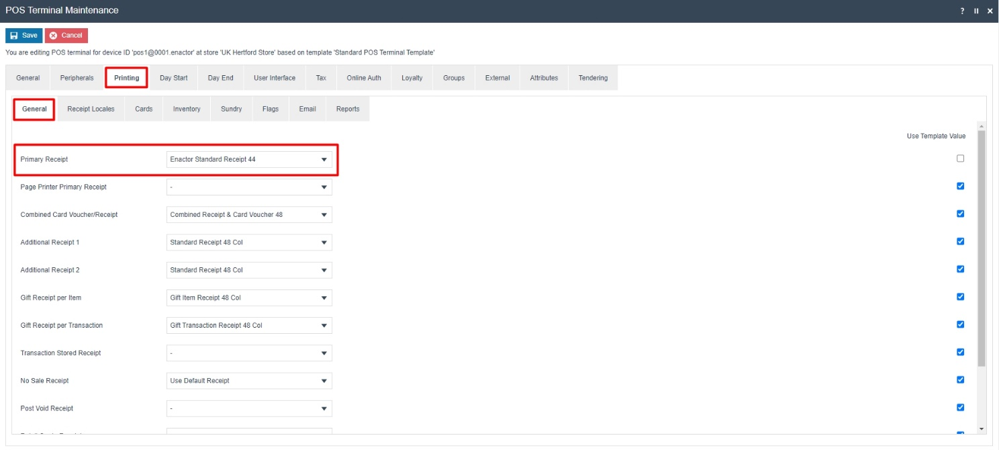

Click **Save** and finally broadcast the following entities to your
device:

-   Page Definition

-   Page Definition Detail

-   POS Terminal

After the broadcast has been sent successfully, make sure to restart
your POS terminal. Finally, carry out a complete transaction in your POS
and you will be able to notice the receipts printed as follows:

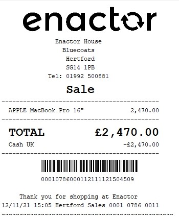

The value for the Merchandise Item is now displayed without the currency
symbol and hence it can be seen that the Receipt has been successfully
customised and printed on the physical printer.

## Receipt Terminology

This section covers in detail the terminology of the various functions
available in the Receipt Maintenance such as the unique navigation bar,
receipt columns and receipt preview functions.

### 

### Understanding the Navigation Bar

Receipts are structurally complex during configuration and to help with
this the Receipt Maintenance uses multiple pages to help you drill down
to the part of the receipt that you wish to change. To prevent the user
from getting lost during this, a navigation bar is provided.

The navigation bar basically lists the locations that have been visited
and how far into the sections of this particular receipt you currently
are.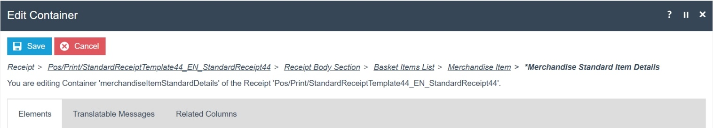

Following are the 3 navigation item formatting and what they each
depict:

-   **Bold** - This is the current entry in the navigation bar.

-   [Underlined]{.underline} - This is the previous entry in the
    navigation that can be navigated directly to.

-   **\*** - This shows that the current or previous entry in the
    navigation bar has been modified and has unsaved changes.

**Note:** The most important navigation item in the navigation bar is
the root of the receipt, i.e., the first navigation item that follows
"Receipt \>" in the navigation bar. The importance is that this is the
only place in the navigation bar that **allows you to save all the
changes to the database**.

### Managing Receipt Columns

The placement of text on a line is controlled by columns. These tell the
printer where the text should start and end, how it should be aligned,
and whether there should be any wrapping.

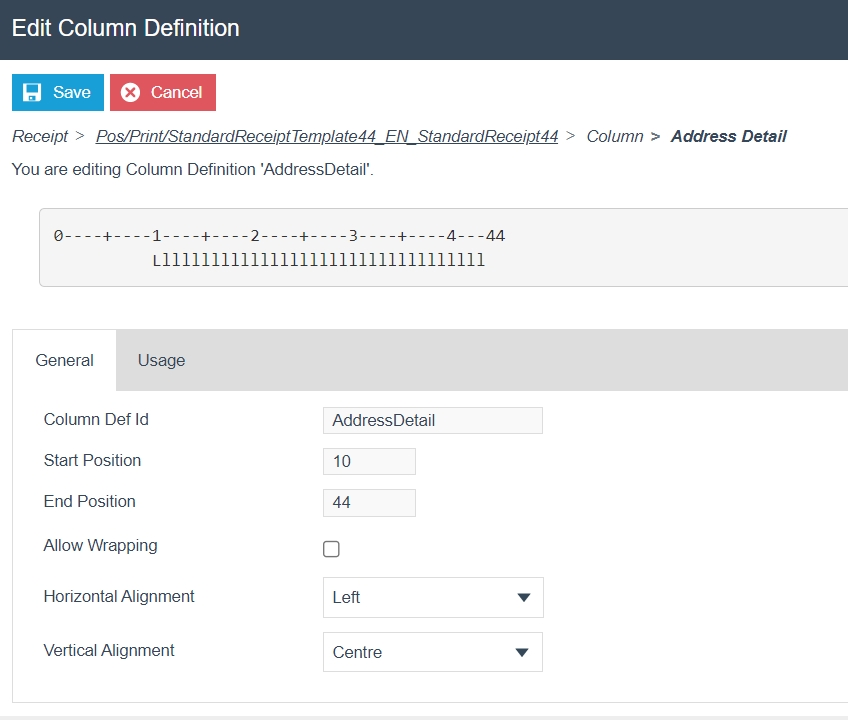 

The following table details the properties of the Column Definition:

| Configuration | Description |
| ---- | ---- |
| Column Def Id | This ID is used to uniquely identify a column.  Changing the ID of an existing column will   have no effect on the users of that column and will stop the printer from being able to correctly place the output for that element. |
| Start and End Position | These control where an element can place its output. Positions that start before or end          after the receipt line are meaningless and so will be prevented by the application.  When multiple columns appear on the same line they are applied in order. Should two columns overlap, the later one will overwrite the earlier one. Whitespace can never overwrite text.|
| Allow Wrapping | Normally a column will truncate any output to fit within its bounds. By enabling wrapping, the column will instead use additional lines to fit any remaining output. Once the wrapping is done normal output will resume from the next line. |
| Horizontal and Vertical Alignment | This controls where the output is to be placed within the start and end boundaries of the column. |

### Managing Previews

Understanding how a change to a receipt affects the final output of the
receipt is not simple. To help with this, the Receipt Maintenance allows
you to select a transaction to view while making your changes. You will
then be able to see how the receipt for that transaction changes as you
make customisations using the Receipt Preview option available in the
Receipt Maintenance.

The basics of creating a preview was covered in the previous section.
This section is about how these previews can be managed. Once a preview
has been created and the Show Preview icon is clicked the following
Receipt Preview popup appears:

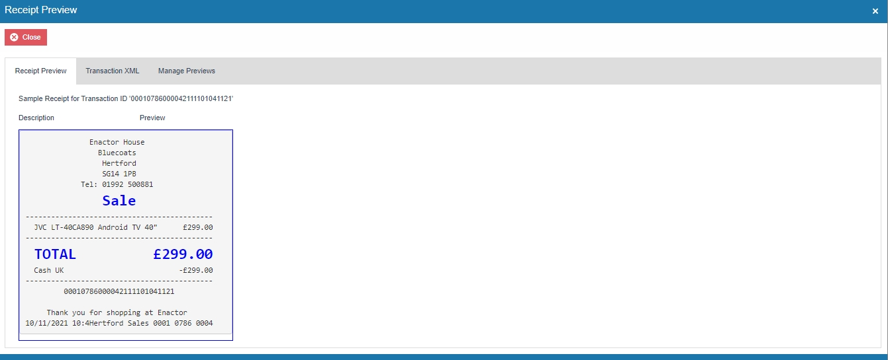 

The following table details the 3 tabs of the Receipt Preview popup:

| Configuration | Description |
| ---- | ---- |
| Receipt Preview | This shows the rendered receipt with all the current changes made for this receipt in the       Receipt maintenance. |
| Transaction | This shows the transaction XML that is used to show the Receipt Preview. |
| Manage Previews | This contains all the options required to manage all the previews that are linked with this receipt. |

**Note:** The rendered receipt in the Receipt Preview tab is updated
whenever a change is made and can be viewed immediately.

The Manage Previews tab manages a list of previews for a receipt.
Whenever a preview is chosen it will be added to the list.

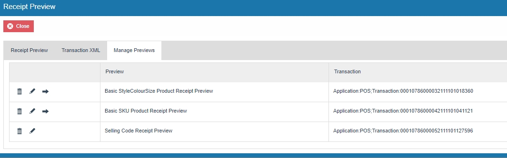 

The following can be done to each receipt preview that is in this list:

-   Previews that are no longer required can be deleted.

-   Previews can be edited, which goes to the same page used when
    creating the preview.

-   Previews that are not the currently selected preview will have a
    button to switch to that preview.

Eg: If I need to make some customisations that are related to just a
Style Colour Size product, the **Basic StyleColourSize Product Receipt
Preview** should be selected from the above shown screen. This preview
that has been created contains a transaction where just a Style Colour
Size product has been sold, and this would allow to preview the
customisations which are relevant to just this. The same way you can
create your own set of previews here for the different scenarios that
you will want to customise and preview your receipts.

# Customisations to Receipts

There are various customisations that can be made to Receipts and this
section covers most of the basic customisations. In the previous
section, a customisation was made to hide the currency symbol of each
merchandise item in the printed standard receipt.

This section would cover step-by-step on a wider range of customisations
that can be made to Receipts.

**Note:** Each of the following customisations start by using a new
Standard Receipt that has a 44-columns template from scratch (as shown
in the Create a new Receipt section) and ends up with the customisation
being made as per each requirement.

Following is the preview of the Standard Receipt with the 44-columns
template without any customisations that we will be using throughout the
next sections:

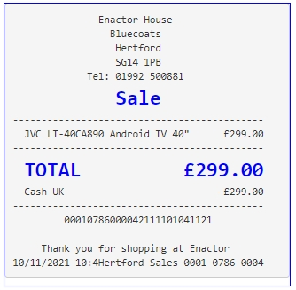

### 

## Hiding the negative symbol from item value discount in tender sales lines

This section will guide you through on how customisations can be done
when an item value discount is included in the transaction. The current
Standard Receipt displays item value discounts as follows:

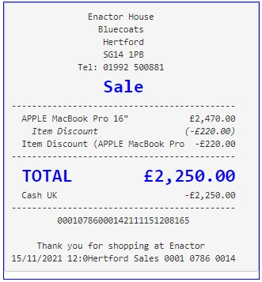

It can be seen here that the discount reason is displayed twice in this
Receipt and contains the negative symbol for each of the discount
values.

In this customisation, we will change the content of the receipt as
follows:

-   Disable the item discount that re-appears.

-   Hide the negative symbol of the discount value.

Let us first disable the duplicate item discount that appears in the
current Receipt.

1 -- **Navigate to the Receipt Body Section \> Basket Items List** where
we can find the "Discount Item" element that displays the duplicate item
discount reason.

2 -- **Disable the Discount Item element** as follows:

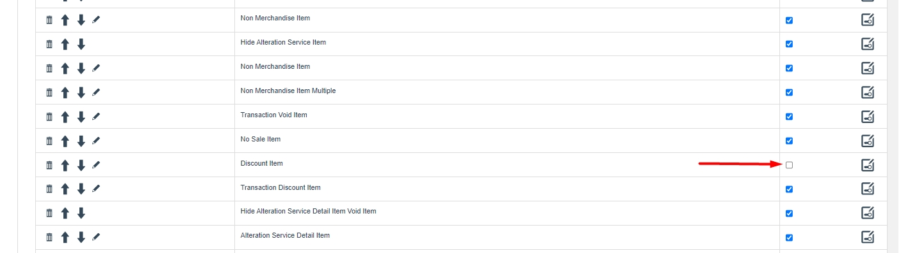 

3 -- Clicking on Receipt Preview now would show that the duplicate item
discount reason does not display in the Receipt anymore.

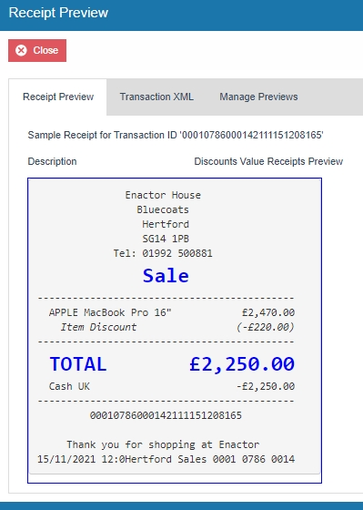

Next, we need to hide the negative symbol of the item discount value.

4 -- From the Basket Items List page, **navigate to Merchandise Item \>
Item Modifiers \> Discount Modifier** where we can find the elements
that display the various item discount values.

We need to enable the proper elements that would allow us to hide the
negative symbol for the item discount values.

5 -- **Disable the "Discount Modifier Review Line" element** and
**enable the "Discount Percentage Modifier" and "Discount Value
Modifier" elements** as follows:

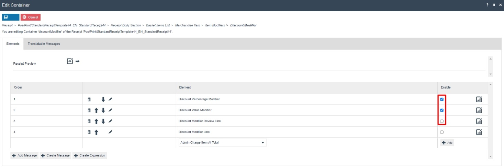 

Now that we have the appropriate elements enabled, let us hide the
negative symbol for the item discount values.

6 -- **Navigate to the "Discount Value Modifier"** element and **disable
the Item Reason element** since this element would display a duplicate
reason.

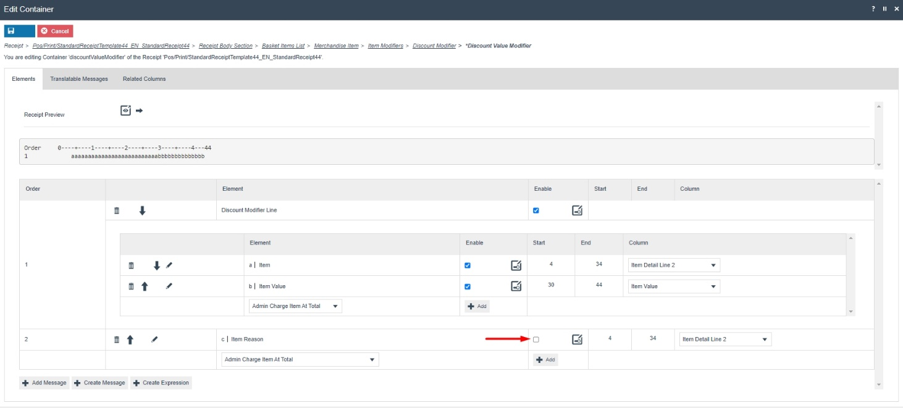 

Now let us make the final customisations to hide the negative symbol for
the item discount values.

7 -- **Navigate to the "Item Value"** element and **add the "Discount
Absolute" element** and **disable the Discount Value element** as
follows:

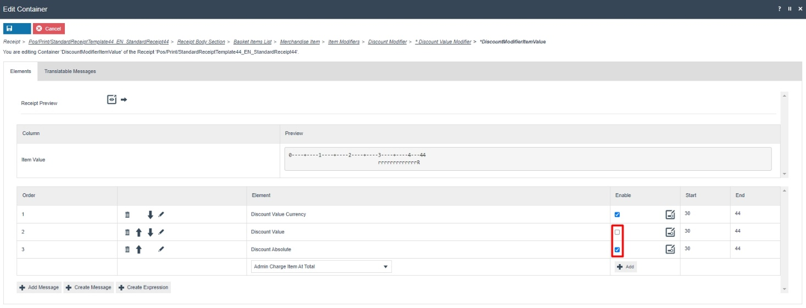 

Now that we have made all the necessary changes to the item discount
values, **click on Save and navigate to the root of the Receipt and save
all changes** to this Receipt.

You can **select your Receipt again and preview** it before broadcasting
and using this new customised Receipt in the POS.

If everything is successful, your Receipt will now show discount item
value without the negative symbol in the POS as follows:

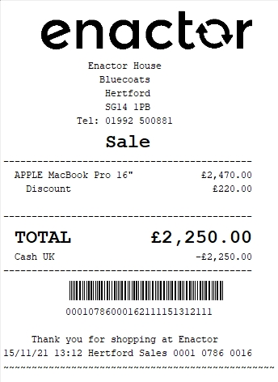

The discount item value for the item appears here as required and hence
it can be seen that the Receipt has been successfully customised and
printed on the physical printer.

**Note:** If you are going to use card as the tender option, then it is
the Combined Receipt type which is used in the POS to print and not the
Standard Receipt. Hence, the same changes done above for the Standard
Receipt should also be made to the Combined Receipt.

### 

## Add content such as date, time and thank you message to the footer

This section will guide you through on how customisations can be done in
the footer section of the Receipt. In the existing Standard Receipts
footer, there is already a line with the date, time, name and
transaction ID. And also, this line is below the message that says,
"Thank you for shopping at Enactor".

In this customisation, we will change the content of the footer and
display it in the following order:

-   Display only the date and time.

-   Display the Thank you message.

-   Centre align both lines.

Let us first disable the Thank you message that appears in the current
Receipt.

1 -- **Navigate to the Receipt Barcode Section** where we can find the
"Location Trailer Lines" element that displays the Thank you message.

2 -- **Disable the Location Trailer Lines element** as follows:

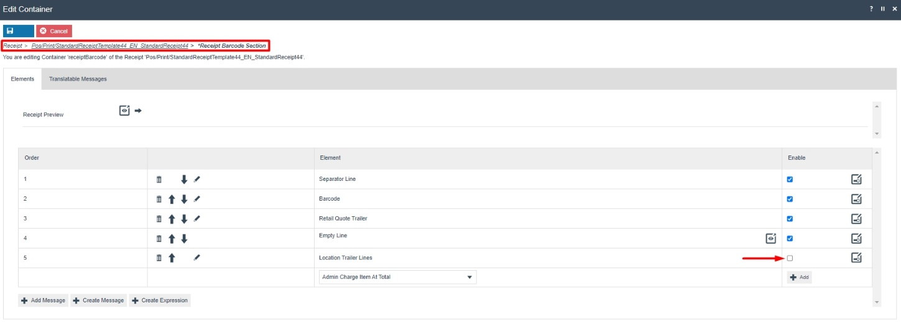

3 -- Clicking on Receipt Preview now would show that the Thank you
message does not display in the Receipt anymore.

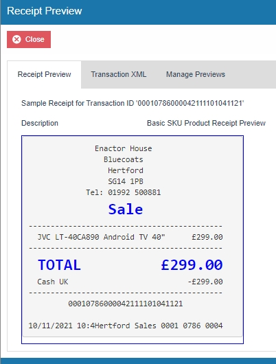

Next, we need to disable the existing line that displays date, time,
name and transaction ID.

4 -- **Navigate to the Receipt Footer Section** where we can find the
"Trailer Line" element that displays the date, time, name and
transaction ID.

5 -- **Disable the Trailer Lines Element** as follows:

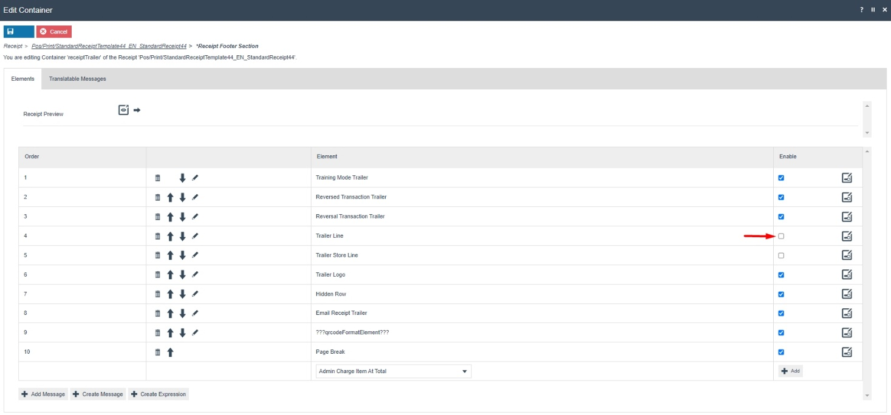 

6 -- Clicking on Receipt Preview now would show that the date, time,
name and transaction ID does not display in the Receipt anymore.

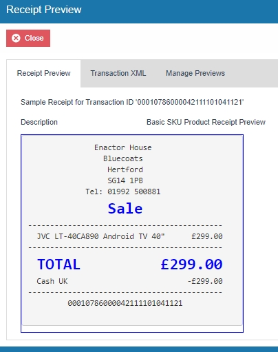

Now that we have disabled the existing elements of the current receipt,
we can now start adding the elements in the order that we need.

First, we need to add the element to display just the date and time in
the Receipt Footer.

1 -- In the Elements column, from the dropdown, **select the "Header
Line" element** and **click on the Add button**.

2 -- Now we need to move it up in the order list.

**Use the up arrow of the Header Line element row and move this element
to the position of the Trailer Lines element** that was disabled.

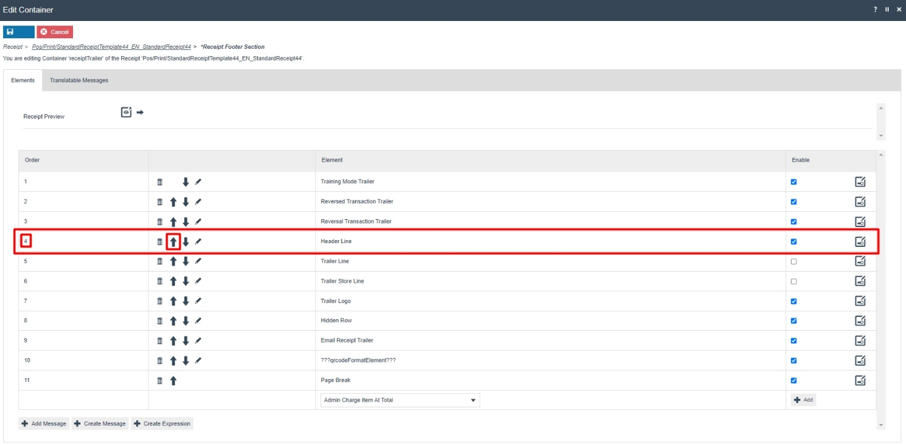 

We must now customise this element to display only the Date and Time.

3 -- **Click on the edit icon of the Header Line element** and **disable
the two elements that are not required to display the date and time**.

The two date and time related elements that are enabled have "Three
Columns Row 1 (Left)" assigned to them. This gives a left alignment to
this element.

4 -- To centre align the date and time elements, **change the
corresponding columns to "Full Width (Centre**)" as follows:

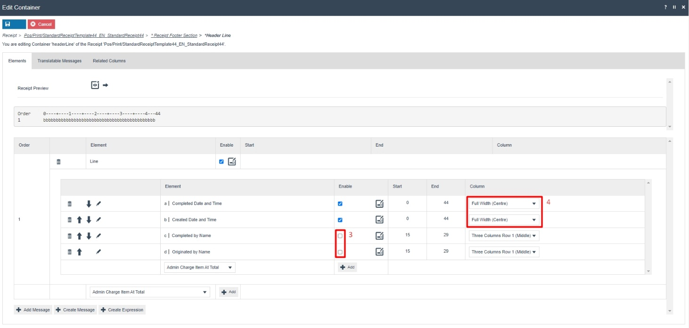 

Now that we have customised to display only the centred date and time in
our Receipt footer, **click Save**.

Finally, we need to display the Thank you message as the final line of
the Receipt.

1 -- In the Elements column of the Receipt Footer section, from the
dropdown, **select the "Location Trailer Lines" element** and **click on
the + Add button**.

Since we need the Page Break to be final element of the Receipt, we need
to move the Location Trailer Lines element up in the order list.

2 -- **Use the up arrow of the Location Trailer Lines element row and
move this element to the position of the Page Break element**.

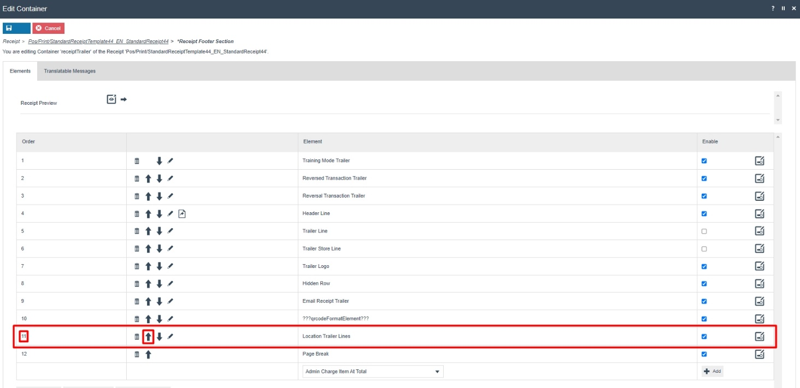 

Now that we have made all the necessary changes to the Receipt Footer
section, **click on Save and navigate to the root of the Receipt and
save all changes** to this Receipt.

You can **select your Receipt again and preview** it before broadcasting
and using this new customised Receipt in the POS.

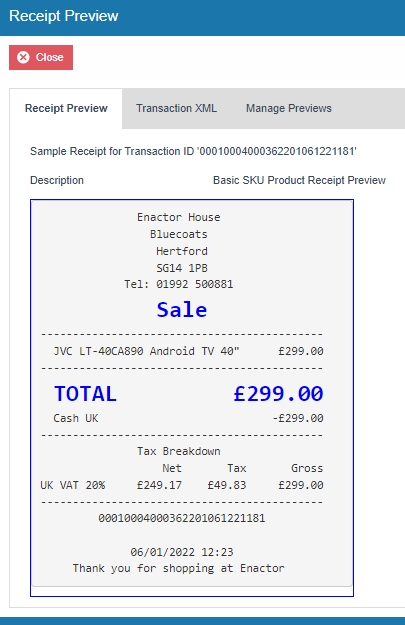

If everything is successful, your Receipt will now display the
customised Receipt Footer in the POS as follows:

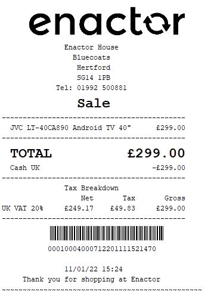

The Receipt Footer appears here as required and hence it can be seen
that the Receipt has been successfully customised and printed on the
physical printer.

**Note:** If you are going to use card as the tender option, then it is
the Combined Receipt type which is used in the POS to print and not the
Standard Receipt. Hence, the same changes done above for the Standard
Receipt should also be made to the Combined Receipt.

## Addition of the Active Selling Code in the Receipt

This section will guide you through on how customisations can be done
when products are sold using the Active Selling Code.

In this customisation, we will change the content of the receipt and
display it in the following order:

-   Display the Active Selling Code underneath the Product Description.

-   Display the Item Value in the Active Selling Code line.

-   Hide the Item Value from the Product Description line.

Let us first display the Active Selling Code for each Merchandise
Product.

1 -- **Navigate to the Receipt Body Section → Basket Items List →
Merchandise Item** where we can find the "**Merchandise Item Trailer**"
element.

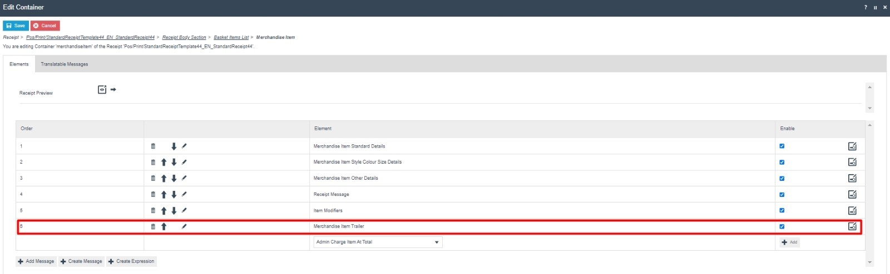 

2 -- **Navigate into the Merchandise Item Trailer** element where we can
find the "Merchandise Item Article" element that enables the Active
Selling Code.

3-- **Tick in the Enable column of the Merchandise Item Article** to
enable this element.

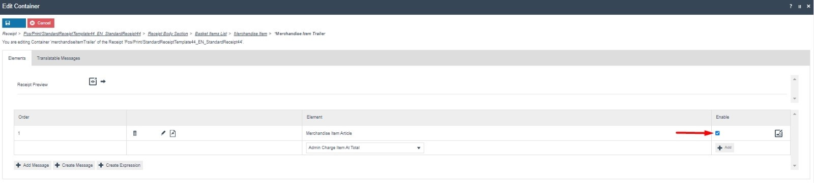 

After enabling this element, click on the edit icon to further customise
this element. This would show that the Merchandise Item Article Element
consists of the following Elements:

-   **Merchandise Item Article Number**: This element contains the text
    for the Active Selling code.

-   **Merchandise Item Value**: This element contains the currency and
    value of the item.

Following is a Receipt Preview that shows what has happened after
enabling this.

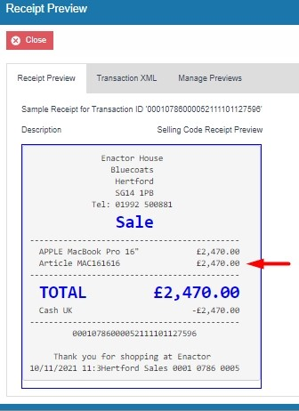

We can notice that in front of the Active Selling Code, it says
"Article". We need to disable the Article text that appears and leave
only the Active Selling Code in this line.

4 -- To do this, click on the **Edit icon of Merchandise Item Article
Number**, and **Disable the Merchandise Article Text and Single
Spacing** elements as follows:

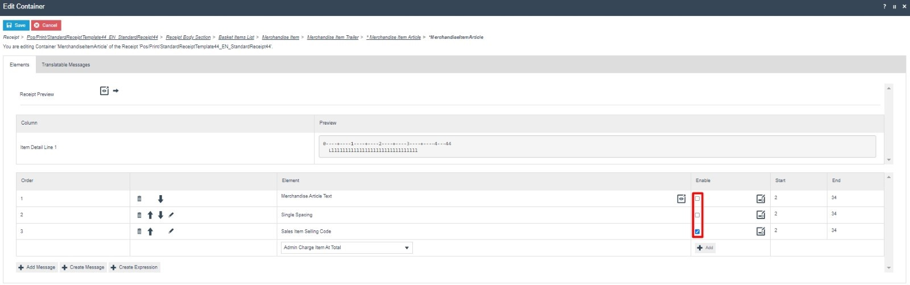 

[Finally, w]{.mark}e need to disable the Item Value that appears in the
Product Description line.

1 -- **Go back to the root of the Receipt** and **Click Save and
Continue** when prompted.

2 -- **Navigate to the following path**:\
Receipt Body Section → Basket Items List → Merchandise Item →
Merchandise Standard Item Details

3 -- **Disable the Value element** as follows:

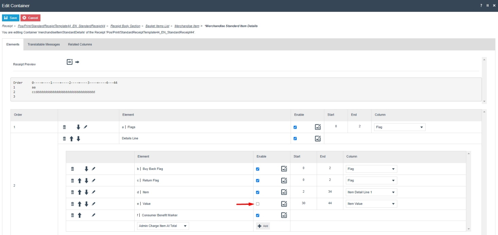 

Now that we have made all the necessary changes as required, **click on
Save and navigate to the root of the Receipt and save all changes** to
this Receipt.

You can **select your Receipt again and preview** it before broadcasting
and using this new customised Receipt in the POS.

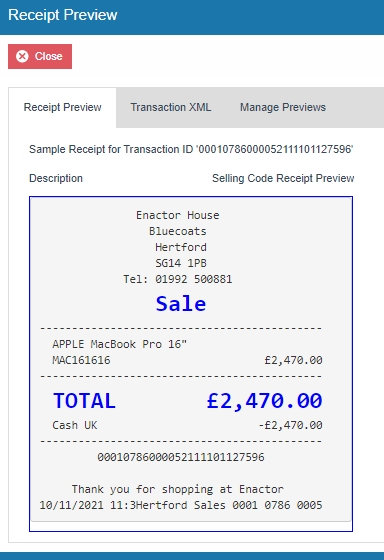

If everything is successful, the customised Receipt with the Active
Selling Code will now show in the POS as follows:

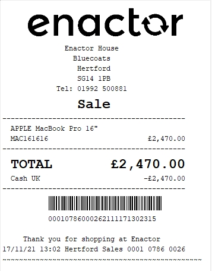

The Active Selling code for the item appears here as required and hence
it can be seen that the Receipt has been successfully customised and
printed on the physical printer.

**Note:** If the Product sold does not have an Active Selling Code, then
the Product ID would replace this and display in the Receipt.

**Note:** If you are going to use card as the tender option, then it is
the Combined Receipt type which is used in the POS to print and not the
Standard Receipt. Hence, the same changes done above for the Standard
Receipt should also be made to the Combined Receipt.

## Style Colour Size Product Customisations

This section covers the customisations of the Receipts that are related
to Style Colour Size Products.

The current Standard Receipt displays Style Colour Size Products as
follows:

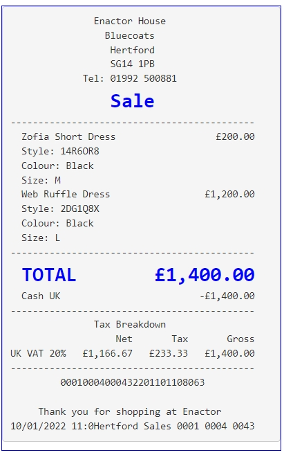

You can notice that the Product Description line and the Style, Colour
and Size lines are all together. In this customisation we will change
the content of the receipt to display the Style, Colour and Size lines
indented to the right for each product, so that it will make the Receipt
look more organised.

1 -- **Navigate to the Receipt Body Section → Basket Items List →
Merchandise Item** **→** **Merchandise Item Style Colour Size Details**
where we can find the Style, Colour and Size elements.

2 - For these 3 elements, **change the column from Item Detail 1 to Item
Detail Line 2** as follows:

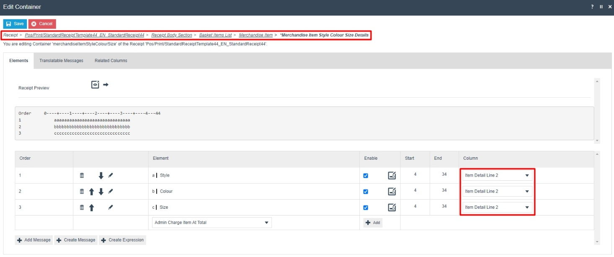 

Now that we have made all the necessary changes as required, **click on
Save and navigate to the root of the Receipt and save all changes** to
this Receipt.

You can **select your Receipt again and preview** it before broadcasting
and using this new customised Receipt in the POS.

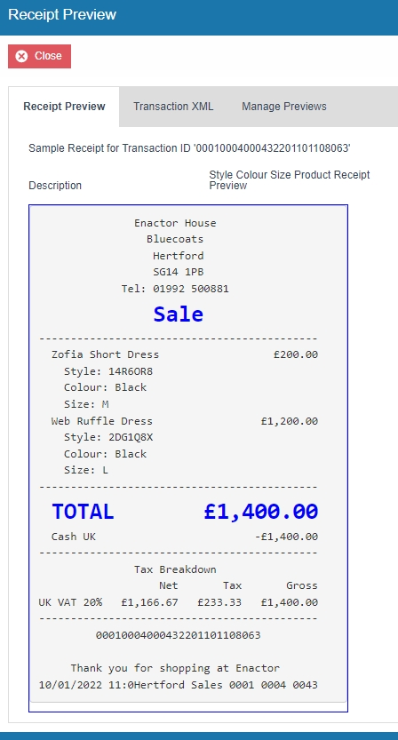

If everything is successful, the customised Receipt with the Style,
Colour and Size customisations will now show in the POS as follows:

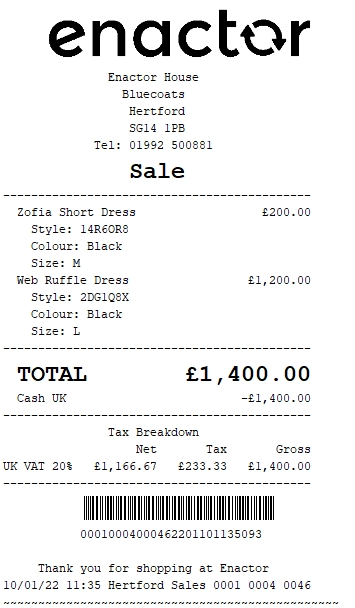

The Style, Colour and Size customisations for the item appears here as
required and hence it can be seen that the Receipt has been successfully
customised and printed on the physical printer.

**Note:** If you are going to use card as the tender option, then it is
the Combined Receipt type which is used in the POS to print and **not**
the Standard Receipt. Hence, the same changes done above for the
Standard Receipt should also be made to the Combined Receipt.

## Basket Modifiers

This section covers the customisations that are related to basket item
modifiers of the basket items such as item discounts, transaction
discounts and price overrides.

The current Standard Receipt displays discounts as follows:

It can be seen here that the discount reason is displayed twice in this
Receipt, the discount value contains brackets and the item price after
the reduction is not displayed in this Receipt.

So before starting any of the basket modifier customisations, let us
first customise the current Standard Receipt to show the basket item
modifiers in a clean and clear manner.

### Initial Customisation for Basket Modifiers

In this customisation, we will change the current Standard Receipt
content of the receipt as follows:

-   Hide the item value that appears at the end of product description
    line.

-   Disable the item discount that re-appears.

-   Hide the brackets and leave just the discount value with the
    negative symbol.

-   Display the final item value after discount, along with its Active
    Selling Code.

Let us first hide the item value of the item and leave only the product
description in the first line of each item in the Receipt.

1 -- **Navigate to the Receipt Body Section → Basket Items List →
Merchandise Item → Merchandise Standard Item Details** and disable the
"**Value**" element as follows:

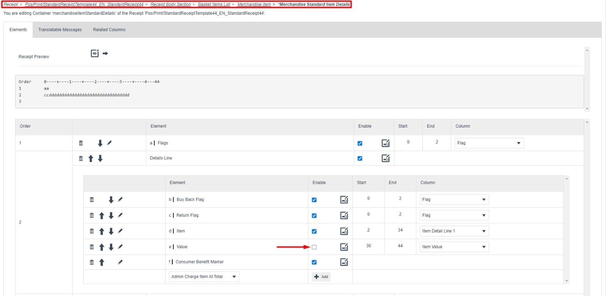 

This would now hide the item value and leave only the product
description in the first line of each item in the Receipt as follows:

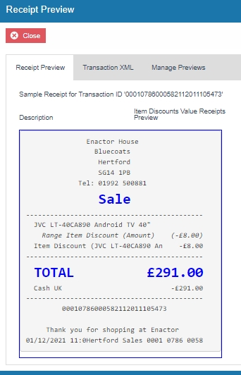

Now we have to disable the duplicate item discount that appears in the
current Receipt.

1 -- **Navigate to the Receipt Body Section \> Basket Items List** where
we can find the "Discount Item" element that displays the duplicate item
discount reason.

2 -- **Disable the Discount Item element** as follows:

 

3 -- Clicking on Receipt Preview now would show that the duplicate item
discount does not display in the Receipt anymore.

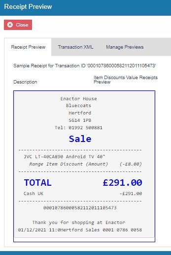

Next, we need to hide the brackets and leave just the item discount
value with the negative symbol.

1 -- From the Basket Items List page, **navigate to Merchandise Item \>
Item Modifiers \> Discount Modifier** where we can find the elements
that display the various item discount values.

The **Discount Modifier Review Line** is the element that displays the
discount values with the brackets.

2 -- **Disable the "Discount Modifier Review Line" element** and
**enable the "Discount Percentage Modifier" and "Discount Value
Modifier" elements** as follows:

 

This would now display the applied discount along with its reason as
follows:

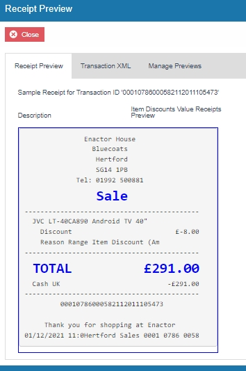

Now let us display the final item value after discount, along with its
Active Selling Code.

1 -- **Navigate to the Receipt Body Section → Basket Items List →
Merchandise Item** where we can find the "**Merchandise Item Trailer**"
element.

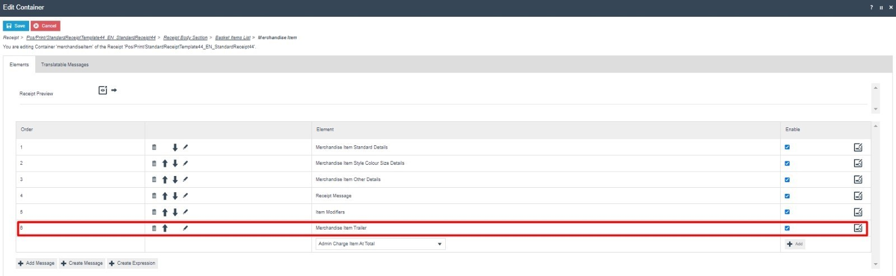 

2 -- **Navigate into the Merchandise Item Trailer** element where we can
find the "Merchandise Item Article" element that enables the Active
Selling Code.

3-- **Tick in the Enable column of the Merchandise Item Article** to
enable this element.

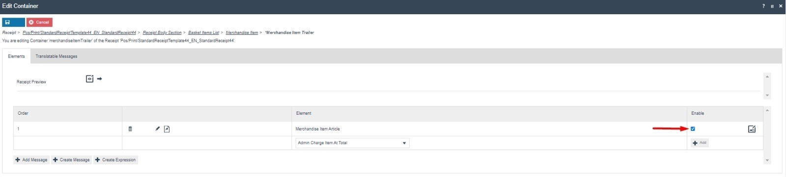 

Following is a Receipt Preview that shows what has happened after
enabling this.

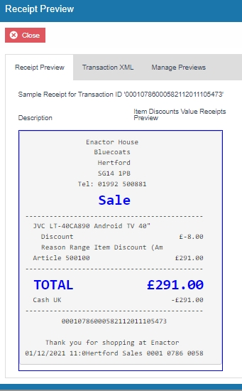

Now that we have made all the necessary changes as required, **click on
Save and navigate to the root of the Receipt and save all changes** to
this Receipt.

This Standard Receipt is now ready to make basket modifier
customisations.

**Note:** If you are going to use card as the tender option, then it is
the Combined Receipt type which is used in the POS to print and not the
Standard Receipt. Hence, the same changes done for the Standard Receipt
should also be made to the Combined Receipt.

### Item Discount Pricing

This section will guide you through on how Item Discount customisations
can be made in Receipts.

In this customisation, we will change the content of the receipt and
display it in the following order:

-   Display only the Product Description of the item without the value.

-   Display the Original Price of the item.

-   Display the Item Discount and value.

-   Display the Item Discount Reason.

-   Display the Product ID or Active Selling Code and the final value of
    the item.

From the above list, the current customised standard receipt only needs
customisations for the first 2 lines of the Receipt, i.e., hiding the
item value from line 1 and adding the new line 2 which displays the
original price of the item.

**Note:** Before starting the customisations in this section, make sure
that you have made the customisations to the Standard Receipt as
discussed in the sub-section "Initial Customisation for Basket
Modifiers".

Let us first add the new line to display as line 2, of each item in the
basket, which is to display the original price of this item before the
item discount is applied.

1-- **Navigate to the Receipt Body Section → Basket Items List →
Merchandise Item → Item Modifiers** and enable the "**PreItem Modifiers
Conditional**" element as follows:

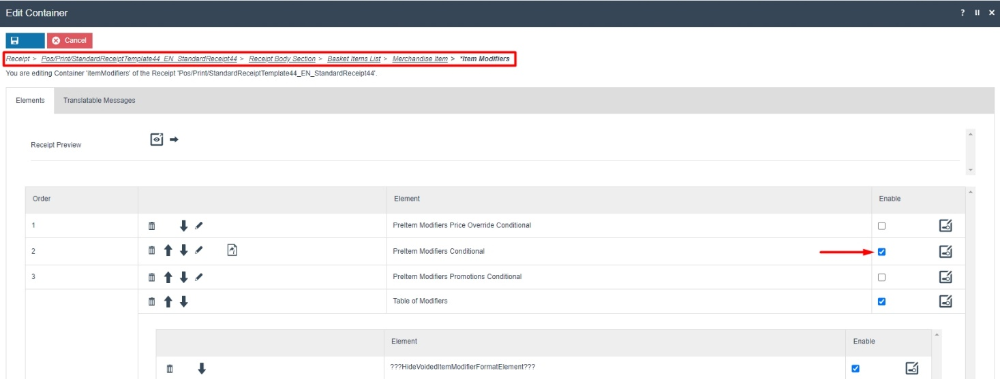 

This element would display the below contents of the Receipt for each
item in the basket:

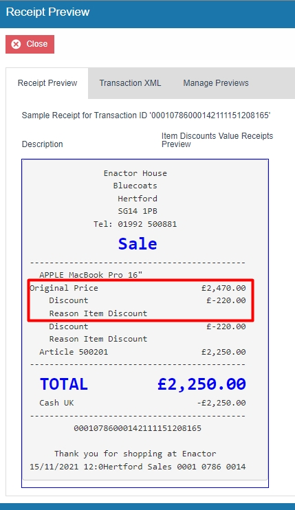

By enabling the above element, you can notice that the original price is
displayed but the following 2 adjustments are to be made:

-   Remove the duplicate item discount that appears from the Discount
    Modifier element.

-   Fix the alignment of the Original Price label.

2 -- In the current **Item Modifiers** page, **disable the two "Discount
Modifier"** elements.

3 -- In this same page, **navigate to PreItem Modifiers Conditional \>
PreItem Modifiers Item Value**.

4 -- For the "Original Value Label" element, **change the column to Item
Detail Line 2** as follows:

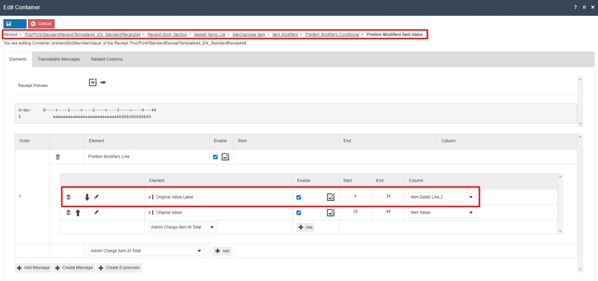 

Now that we have made all the necessary changes as required, **click on
Save and navigate to the root of the Receipt and save all changes** to
this Receipt.

You can **select your Receipt again and preview** it before broadcasting
and using this new customised Receipt in the POS.

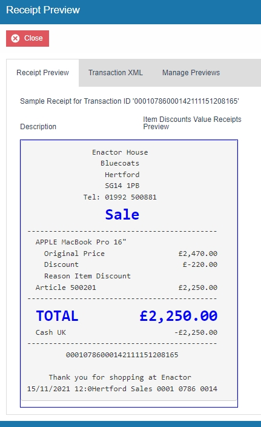

If everything is successful, the customised Receipt with the Item
Discount customisations will now show in the POS as follows:

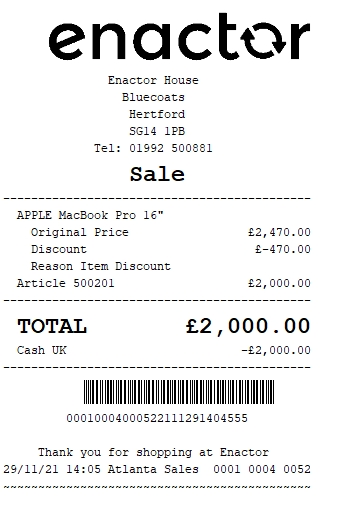

The Item Discount will be displayed in the format as required and hence
it can be seen that the Receipt has been successfully customised and
printed on the physical printer.

**Note:** If you are going to use card as the tender option, then it is
the Combined Receipt type which is used in the POS to print and not the
Standard Receipt. Hence, the same changes done above for the Standard
Receipt should also be made to the Combined Receipt.

### Transaction Discount Pricing

This section will guide you through on how Transaction Discount
customisations can be made in Receipts.

Following shows how transaction discounts are displayed in the current
customised standard receipt:

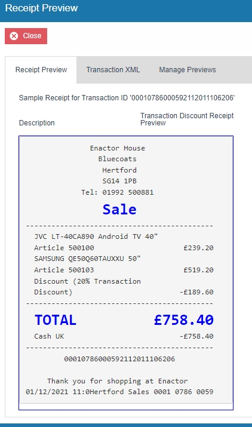

**Note:** Before starting the customisations in this section, make sure
that you have made the customisations to the Standard Receipt as
discussed in the sub-section "Initial Customisation for Basket
Modifiers".

In this customisation, we will change the content of the receipt and
display it in the following order:

-   Display only the Product Description of the item without the value.

-   Display the Product ID or Active Selling Code and the final value of
    the item.

-   Display a separator after all the basket items.

-   Display the total of the original prices of the items in the basket.

-   Display the reason and total value of all the Transaction Discount
    applied for each item in the basket.

-   Display the final total of the Receipt which is the transaction
    discounts total deducted from the original price.

From the above list, the current customised standard receipt needs
customisations for displaying the transaction discount and value of each
basket item, display a separator at the end of the basket items and
displaying of the 3 totals.

Let us add the separator, total transaction discount value and the final
total value of the Receipt.

1-- **Navigate to the Receipt Body Section, disable the "Transaction
Discount Item List" element** and **enable the "Basket Transaction Items
List" element**.

2 -- **Navigate into the "Basket Transaction Items List" element** and
enable both elements that are displayed as follows:

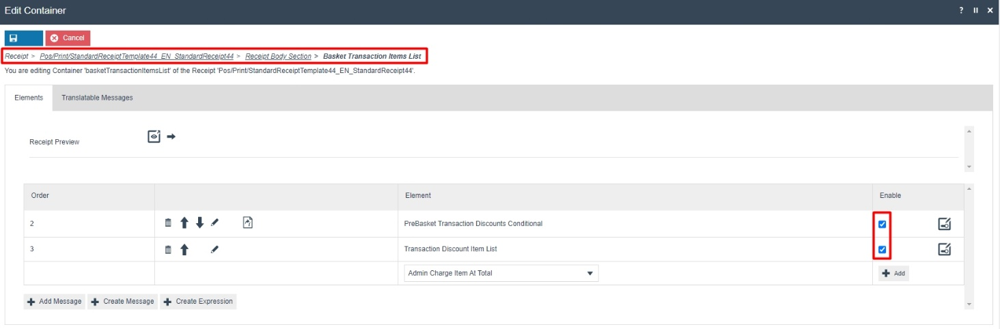 

This element would display in the receipt as follows:

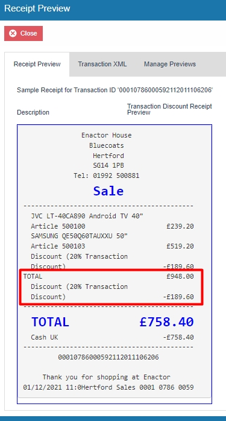

Let us now add a separator line to the first line of this element.

3 -- **Navigate into the PreBasket Transaction Discounts Conditional \>
PreTransaction Discounts Total** and from the dropdown, **select the
"Separator" element** and **click on the + Add button**. Now **move it
up to the first row by clicking on the up-arrow of this element** once.

Let also fix the alignment of the Total Label here.

4 -- **Change the Column of the Label row to "Item Detail Line 1**" as
follows:

After adding the Seperator and fixing the total label alignment, the
changes made are as follows:

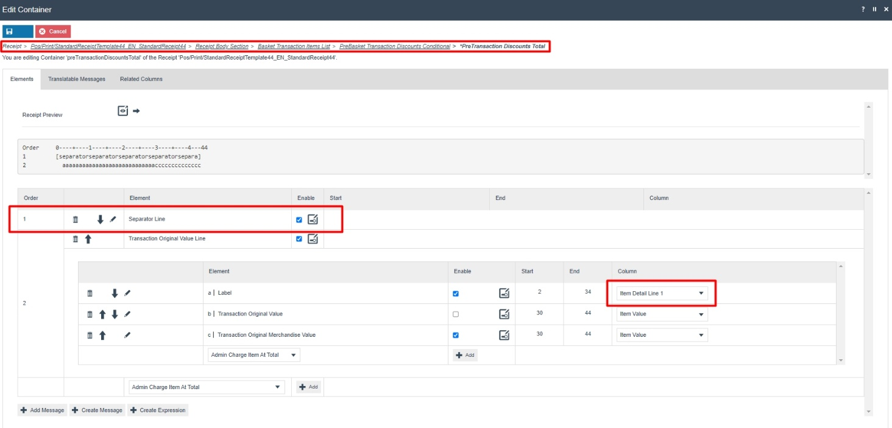 

The receipt preview after making the above changes is now shown as
below:

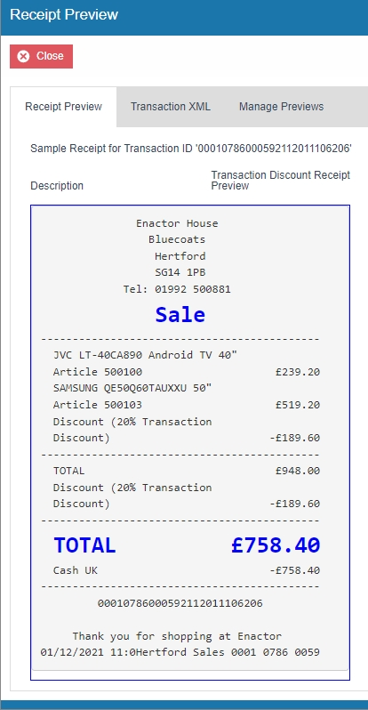

There is still a duplicate transaction discount item line that appears
above the new element that we added, which is to be removed.

5-- **Navigate to the Receipt Body Section → Basket Items List** and
**disable the "Transaction Discount Item" element.**

Now that we have made all the necessary changes as required, **click on
Save and navigate to the root of the Receipt and save all changes** to
this Receipt.

You can **select your Receipt again and preview** it before broadcasting
and using this new customised Receipt in the POS.

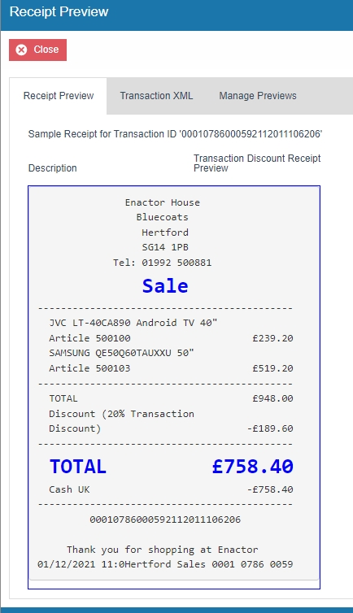

If everything is successful, the customised Receipt with the Transaction
Discount customisations will now show in the POS as follows:

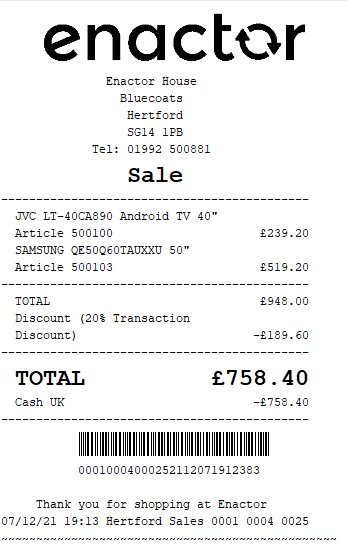

The Transaction Discount will be displayed in the format as required and
hence it can be seen that the Receipt has been successfully customised
and printed on the physical printer.

**Note:** If you are going to use card as the tender option, then it is
the Combined Receipt type which is used in the POS to print and not the
Standard Receipt. Hence, the same changes done above for the Standard
Receipt should also be made to the Combined Receipt.

### Price Overrides

This section will guide you through on how Price Override customisations
can be made in Receipts.

#### Price Override Down

Following shows how Price Override Down is displayed in the current
customised standard receipt:

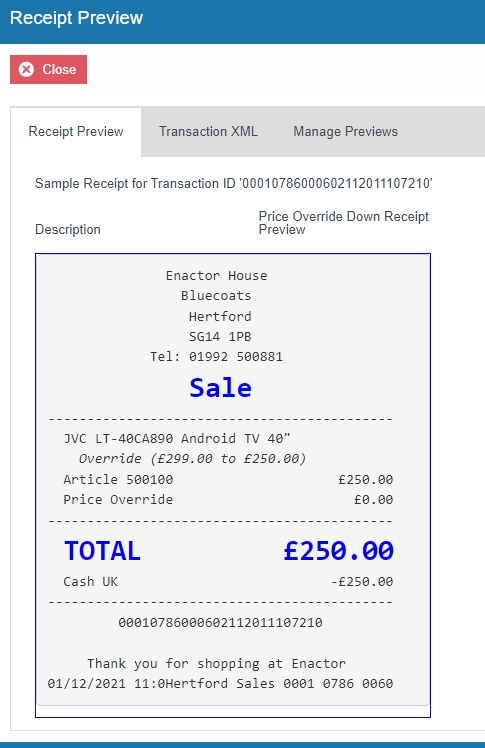

**Note:** Before starting the customisations in this section, make sure
that you have made the customisations to the Standard Receipt as
discussed in the sub-section "Initial Customisation for Basket
Modifiers".

In this customisation, we will change the content of the receipt and
display it in the following order:

-   Display only the Product Description of the item without the value.

-   Display the Original Price of the item.

-   Display the Price Override and its value with a negative symbol.

-   Display the Product ID or Active Selling Code and the final value of
    the item.

-   Remove the Duplicate Price Override that appears with a 0 value.

From the above list, the current customised standard receipt needs
customisations from lines 2 to 4, which displays the original price,
price override and the price override reason of the basket item. We need
to also finally remove the duplicate price override that appears.

Let us first enable the original price of the item.

1 -- **Navigate to Receipt Body Section \> Basket Items List \>
Merchandise Item \> Item Modifiers \> Price Override Modifier**.

2 -- **Enable the "PreItem Modifiers Line" element** and **change its
column alignment to "Item Detail Line 2" from the column dropdown** as
follows:

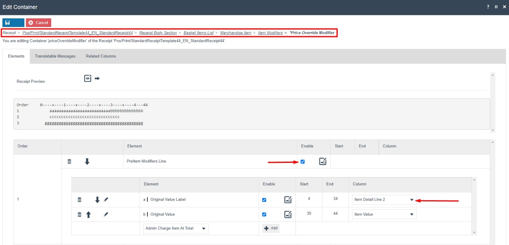 

The Receipt Preview would now display the Original Price as follows:

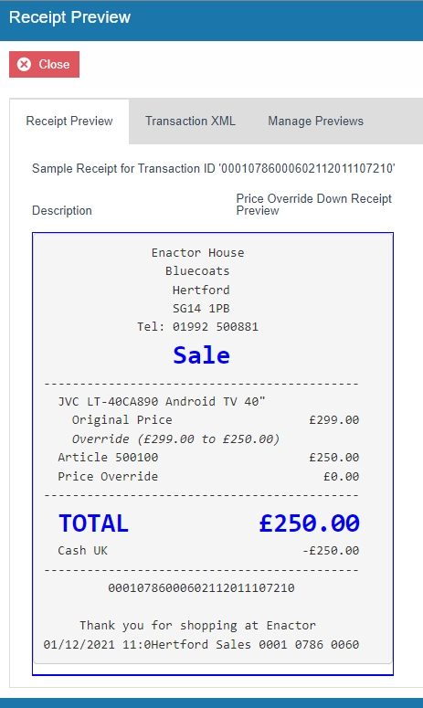

Now we have to add the Price Override and its value with a negative
symbol.

3 -- In the same Price Override Modifier page, **enable the "Price
Difference" element** and now the Receipt Preview will be as follows:

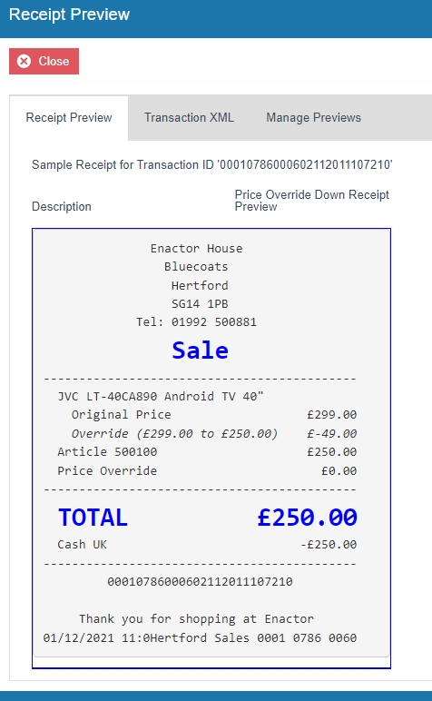 

Let us now disable the duplicate price override line that appears at the
end of the basket.

4 -- **Navigate back to the Basket Items List element** and **disable
the "Price Override Item" element** as follows:

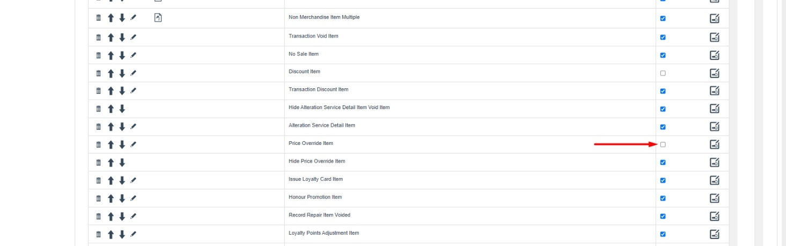 

Now that we have made all the necessary changes as required, **click on
Save and navigate to the root of the Receipt and save all changes** to
this Receipt.

You can **select your Receipt again and preview** it before broadcasting
and using this new customised Receipt in the POS.

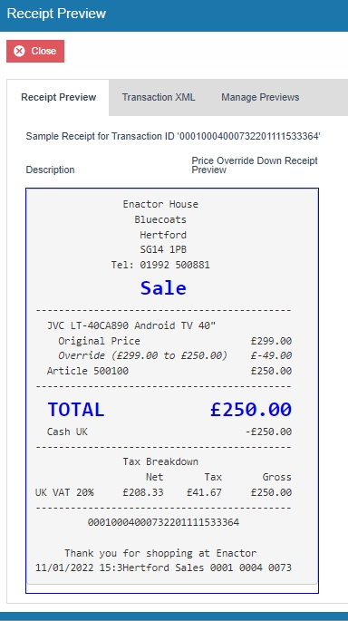 

If everything is successful, the customised Receipt with the Price
Override down customisations will now show in the POS as follows:

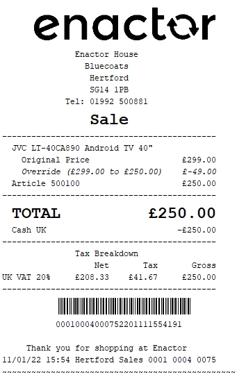

The Price Override down will be displayed in the format as required and
hence it can be seen that the Receipt has been successfully customised
and printed on the physical printer.

**Note:** If you are going to use card as the tender option, then it is
the Combined Receipt type which is used in the POS to print and not the
Standard Receipt. Hence, the same changes done above for the Standard
Receipt should also be made to the Combined Receipt.

#### Price Override Up

Following shows how Price Override Up is displayed in the current
customised standard receipt:

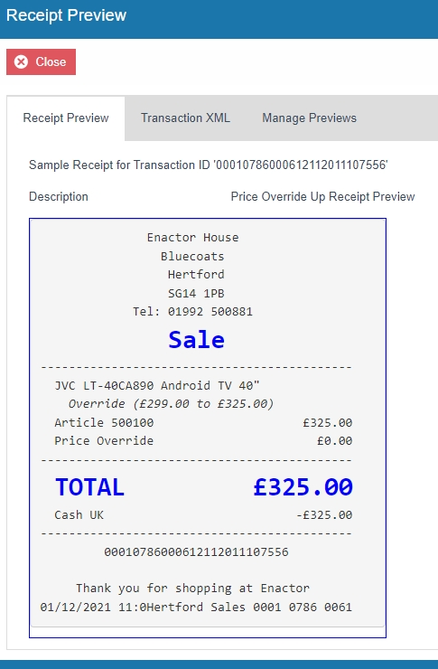 

**Note:** Before starting the customisations in this section, make sure
that you have made the customisations to the Standard Receipt as
discussed in the sub-section "Initial Customisation for Basket
Modifiers".

In this customisation, we will change the content of the receipt and
display it in the following order:

-   Display only the Product Description of the item without the value.

-   Remove the Price Override up in the Receipt.

-   Display the Product ID or Active Selling Code and the final value of
    the item.

-   Remove the Duplicate Price Override that appears with a 0 value.

From the above list, the current customised standard receipt needs
customisations only to the lines 2 and 4, where we need to also remove
the price override reason up and the duplicate price override that
appears.

Let us first remove the price override reason up of the item.

1 -- **Navigate to Receipt Body Section \> Basket Items List \>
Merchandise Item \> Item Modifiers**.

2 -- **Enable the "PreItem Modifiers Price Override Conditional"
element** and **disable the two "Price Override Modifier" element** as
follows:

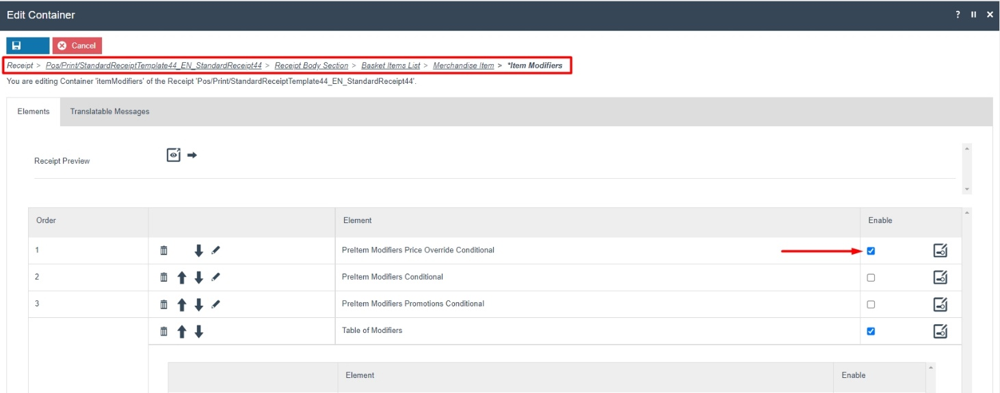 

The Receipt Preview would now display as follows:

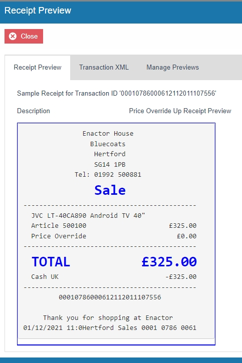

Let us now disable the duplicate price override line that appears at the
end of the basket.

3 -- **Navigate back to the Basket Items List element** and **disable
the "Price Override Item" element** as follows:

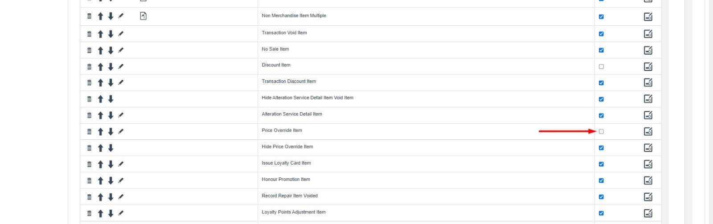

Now that we have made all the necessary changes as required, **click on
Save and navigate to the root of the Receipt and save all changes** to
this Receipt.

You can **select your Receipt again and preview** it before broadcasting
and using this new customised Receipt in the POS.

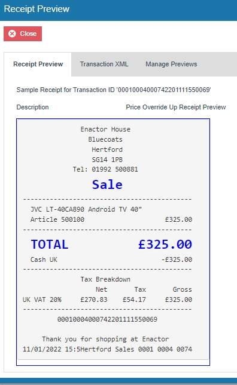

If everything is successful, the customised Receipt with the Price
Override up customisations will now show in the POS as follows:

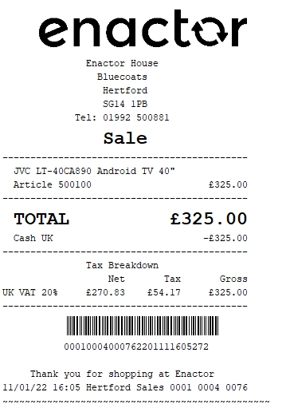

The Price Override up will be displayed in the format as required and
hence it can be seen that the Receipt has been successfully customised
and printed on the physical printer.

**Note:** If you are going to use card as the tender option, then it is
the Combined Receipt type which is used in the POS to print and not the
Standard Receipt. Hence, the same changes done above for the Standard
Receipt should also be made to the Combined Receipt.

### Promotions

This section will guide you through on how Promotion customisations can
be made in Receipts.

Following shows how promotions are displayed in the current customised
standard receipt:

**Note:** Before starting the customisations in this section, make sure
that you have made the customisations to the Standard Receipt as
discussed in the sub-section "Initial Customisation for Basket
Modifiers".

In this customisation, we will change the content of the receipt and
display it in the following order:

-   Display only the Product Description of the item without the value.

-   Display the label "Current Value" and the value of the item.

-   Display the label "Promotion" and the value.

-   Display the Promotion Description.

-   Display the Product ID or Active Selling Code and the final value of
    the item.

-   Hide the Savings section that displays the promotion calculations.

From the above list, the current customised standard receipt needs
customisations for displaying the current value label and the value of
the item, the promotion label and value, the promotion description and
hiding the savings section that shows the promotion calculations.

Let us first add the current value label and the value of the item
before promotion.

1 -- **Navigate to the Receipt Body Section \> Basket Item List \>
Merchandise Item \> Item Modifiers**

2 -- **Disable the 2 "Promotion Modifier" elements**, **enable the
"PreItem Modifiers Promotions Conditional" element** and **navigate into
"PreItem Modifiers Promotions Conditional \> Promotion Modifier"** as
follows:

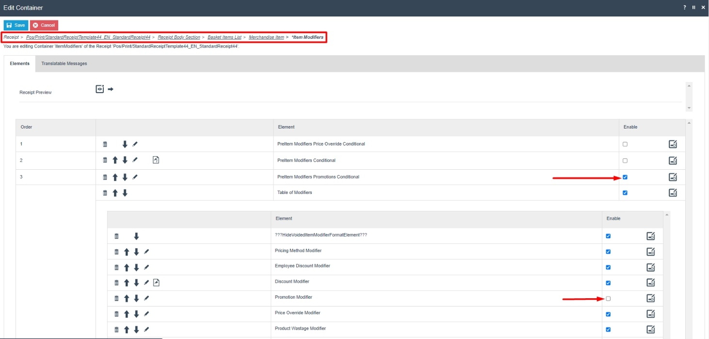 

The receipt preview after making the above changes is now shown as
below:

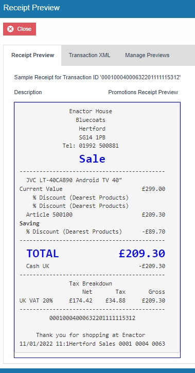 

Now we have to display the label "Promotion" and the value, followed by
the Promotion Descriptions.

3 -- **Disable the "Promotion Saving Item Trigger" elements**.

4 -- **Enable the "Distributed Promotion Savings" and "Distributed
Promotion Savings Amount" elements**.

5 -- Move the **"Distributed Promotion Savings" element above the
"Distributed Promotion Savings Amount" element**.

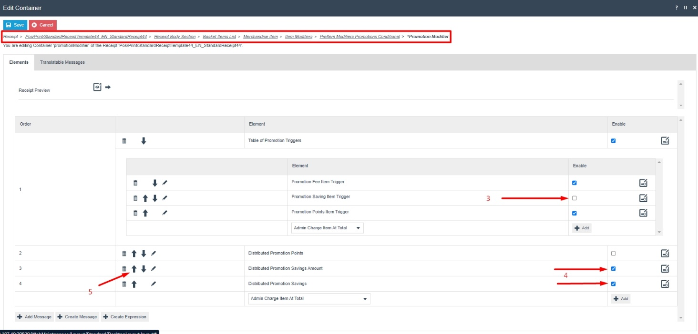 

The receipt preview after making the above changes is now shown as
below:

Now let us fix the alignments of the Promotion and Current Value labels.

6 -- **Navigate to the "Distributed Promotion Savings Amount" element**
and **change the column of the "Item" element to Item Detail Line 1** as
follows:

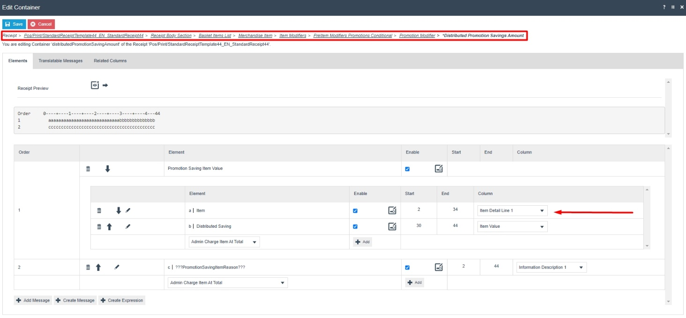 

7 -- Now **navigate back out to the "PreItem Modifiers Promotions
Conditional" element** and then from there, **into the "PreItem
Promotions Item Value\" element** and **change the column of the
"Original Value Label" element to Item Detail Line 1** as follows:

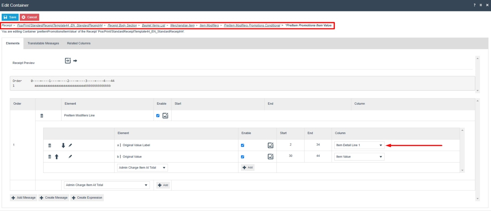 \
The receipt preview after making the above changes is now shown as
below:

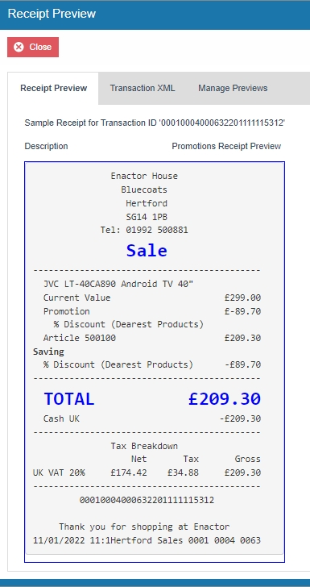

Now we have to finally hide the Savings section that displays the
promotion calculations.

6 -- **Navigate back out to the "Receipt Body Section" element** and
**disable "Promotion Calculation" element** as follows:

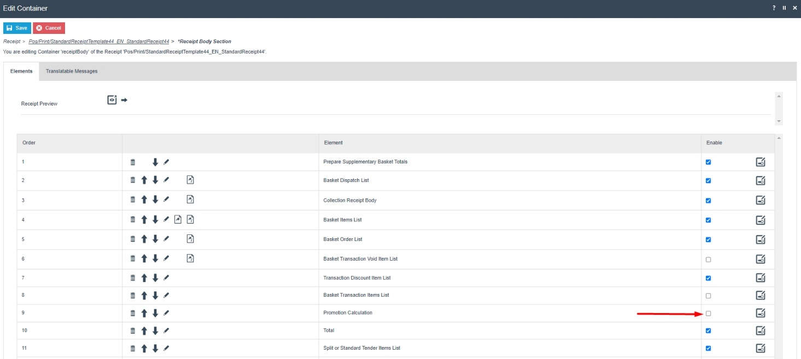 

Now that we have made all the necessary changes as required, **click on
Save and navigate to the root of the Receipt and save all changes** to
this Receipt.

You can **select your Receipt again and preview** it before broadcasting
and using this new customised Receipt in the POS.

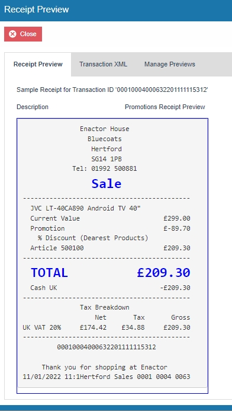

If everything is successful, the customised Receipt with the Promotion
customisations will now show in the POS as follows:

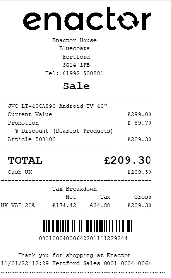 

The Promotion will be displayed in the format as required and hence it
can be seen that the Receipt has been successfully customised and
printed on the physical printer.

**Note:** If you are going to use card as the tender option, then it is
the Combined Receipt type which is used in the POS to print and not the
Standard Receipt. Hence, the same changes done above for the Standard
Receipt should also be made to the Combined Receipt.

## Multiple Basket Items

This section covers the customisations that are related to multiple
basket items, which is where a quantity of two or more of a single
product is added in the basket.

All the elements related to Multiple Basket Item customisations can be
found in the below 2 elements:

**Receipt Body Section → Basket Items List → Merchandise Item Multiple**

**Receipt Body Section → Basket Items List → Non Merchandise Item
Multiple**

The two main customisations that will be covered here will be on how
measurement products and item quantity pricing with discounts will be
customised.

### Item Quantity Pricing with Discounts

This section will guide you through on how item quantity pricing with
discounts customisations can be made in Receipts.

Following shows how an item quantity pricing with a discount is
displayed in the current customised standard receipt:

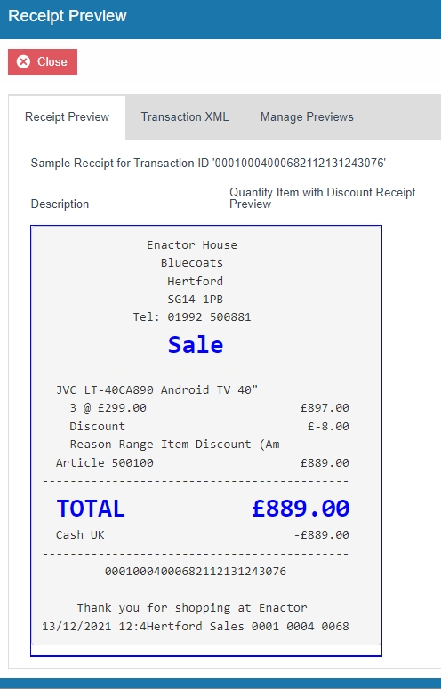

**Note:** Before starting the customisations in this section, make sure
that you have made the customisations to the Standard Receipt as
discussed in the sub-section "Initial Customisation for Basket
Modifiers".

In this customisation, we will change the content of the receipt and
display it in the following order:

-   Display only the Product Description of the item without the value.

-   Remove the value appearing at the end of this line.

-   Display the discount with its value.

-   Display the discount reason.

-   Display the Product ID or Active Selling Code and the final value of
    the item.

From the above list, the current customised standard receipt only needs
customisations in the second line where we need to remove the final
value that appears for this basket item.

1-- **Navigate to the Receipt Body Section → Basket Items List →
Merchandise Item Multiple → Merchandise Standard Item Details Multiple**
and disable the "**Value**" element as follows:

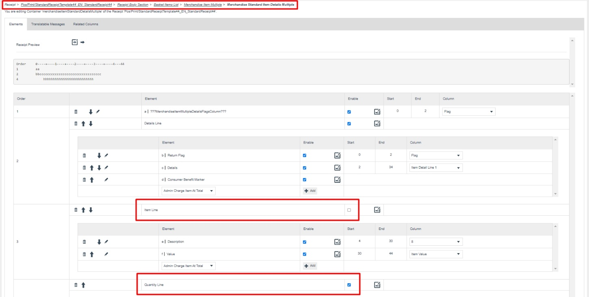

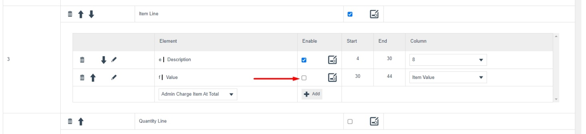 \
Now that we have made all the necessary changes to the item quantity
pricing with discounts standard receipt, click on Save and navigate to
the root of the Receipt and save all changes to this Receipt.

You can select your Receipt again and preview it before broadcasting and
using this new customised Receipt in the POS.

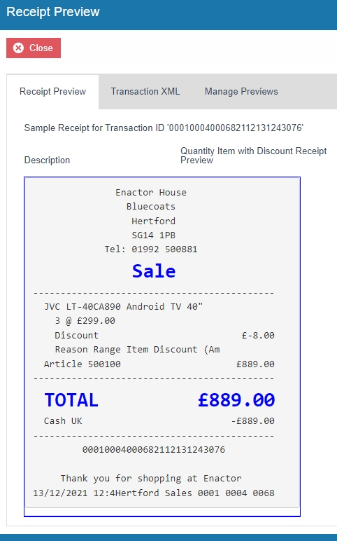

If everything is successful, the customised Receipt with the item
quantity pricing with discounts standard receipt will now show in the
POS as follows:

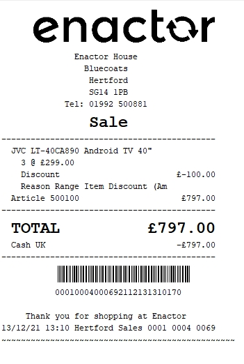

The item quantity pricing with discounts standard receipt will be
displayed in the format as required and hence it can be seen that the
Receipt has been successfully customised and printed on the physical
printer.

**Note:** If you are going to use card as the tender option, then it is
the Combined Receipt type which is used in the POS to print and not the
Standard Receipt. Hence, the same changes done above for the Standard
Receipt should also be made to the Combined Receipt.

### Measurement Products

This section will guide you through on how measurement product
customisations can be made in Receipts.

Following shows how measurement products are displayed in the current
customised standard receipt:

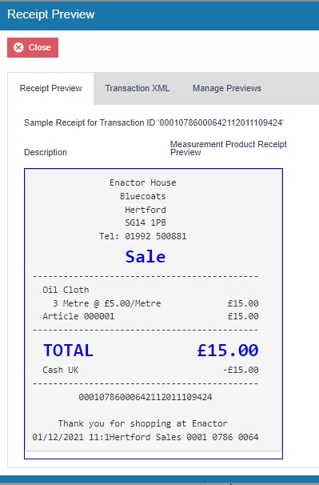

**Note:** Before starting the customisations in this section, make sure
that you have made the customisations to the Standard Receipt as
discussed in the sub-section "Initial Customisation for Basket
Modifiers".

In this customisation, we will change the content of the receipt and
display it in the following order:

-   Display only the Product Description of the item without the value.

-   Display Quantity, @ symbol and POS Price per measurement with the
    currency symbol.\
    Eg: 3 @ £5.00

-   Display the Product ID or Active Selling Code and the final value of
    the item.

From the above list, the current customised standard receipt only needs
customisations for displaying the second line that consists of the
measurements of the product.

1-- **Navigate to the Receipt Body Section → Basket Items List →
Merchandise Item Multiple → Merchandise Standard Item Details Multiple**
and disable the "**Item Line**" element and enable the **"Quantity
Line"** element as follows:

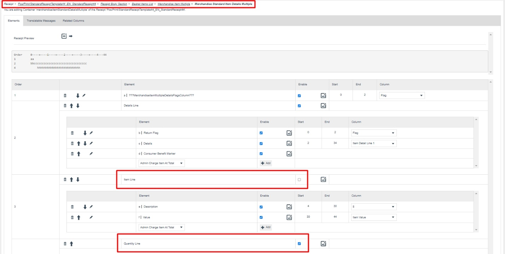 

2 -- **Navigate into the "Measured Quantity" element** where you will
find all the elements that make up the measurement line of the product
in the receipt.

3 -- Disable the following elements in the same order as shown below:

-   Sales Item Units of Measure Description

-   Single Spacing

-   Item Measured Quantity Per Label Text

-   Sales Item Units of Measure Description

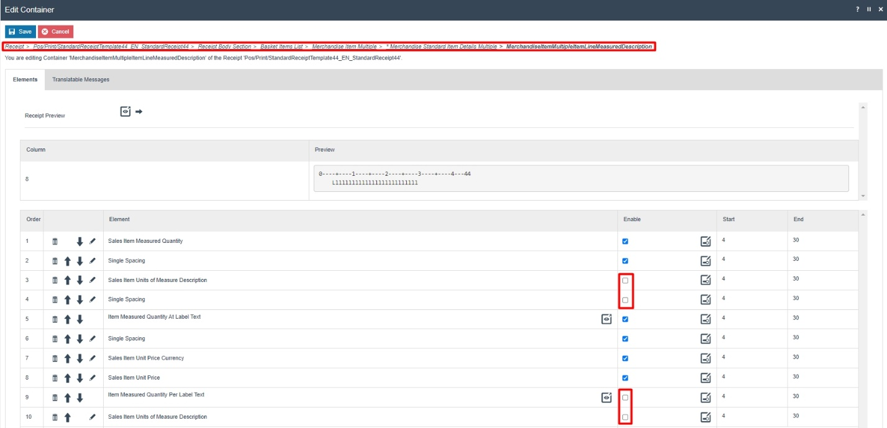 

Now that we have made all the necessary changes to the Measurement
Product standard receipt, click on Save and navigate to the root of the
Receipt and save all changes to this Receipt.

You can select your Receipt again and preview it before broadcasting and
using this new customised Receipt in the POS.

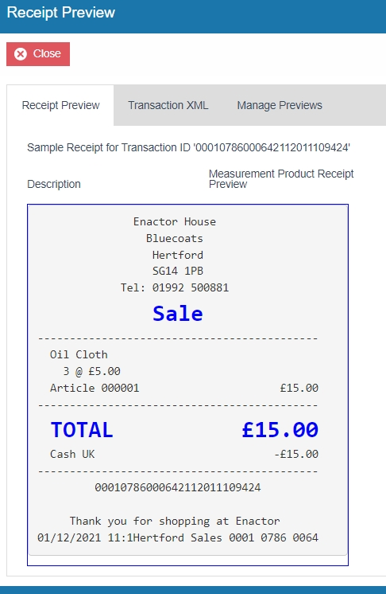

If everything is successful, the customised Receipt with the Measurement
Product customisations will now show in the POS as follows:

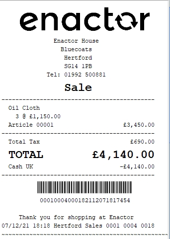

The Measurement Product will be displayed in the format as required and
hence it can be seen that the Receipt has been successfully customised
and printed on the physical printer.

**Note:** If you are going to use card as the tender option, then it is
the Combined Receipt type which is used in the POS to print and not the
Standard Receipt. Hence, the same changes done above for the Standard
Receipt should also be made to the Combined Receipt.

## Voided Transactions

This section will guide you through on how customisations can be done
for the receipts that get printed when a transaction void is done in the
POS. The current Standard Receipt displays transaction void as follows:

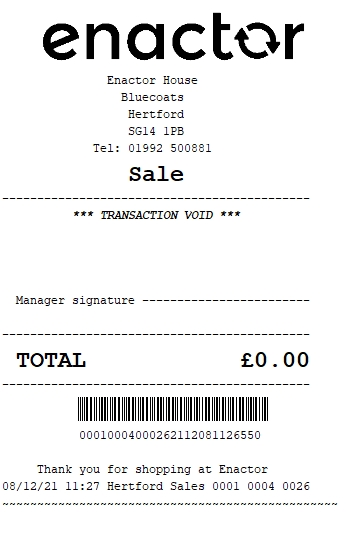

In this customisation, we will change the content of the receipt and
display it in the following order:

-   Remove the Manager Signature Line.

-   Display the list of the items that were in the basket before voiding
    the transaction by striking-through each of the lines as follows:\
    ~~JVC LT-40CA898~~\
    ~~Original Price £299.00~~\
    ~~Discount £-8.00~~\
    ~~Item Discount~~\
    ~~Article 500100 £291.00~~

**Note:** Receipt Preview cannot be used to validate the customisations.
This is because voided transactions are not recorded in the retail
transaction archive and cannot be added as a preview. A broadcast needs
to be sent to the POS terminal for this receipt and then this receipt
can be printed on a physical printer in order to validate the
customisations made.

We will first display the list of the items that were in the basket
before voiding the transaction by striking-through each of the lines.

1 -- In the Standard Receipt, **Navigate to Receipt Body Section** and
**Enable the "Basket Transaction Void Item List" element as follows:**

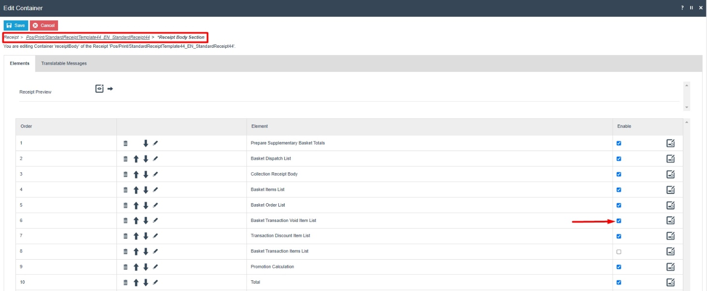 

The receipt after making the above changes is now shown as below:

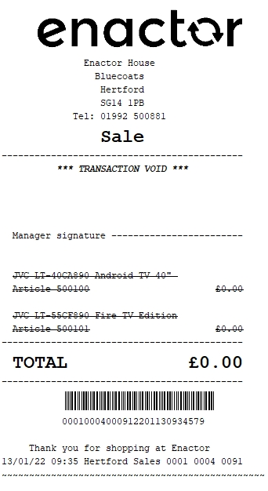

Now let us remove the Manager Signature Line.

2 -- **Navigate to Receipt Body Section → Basket Items List →
Transaction Void Item** and **disable the main "Manager Signature"
element as follows:**

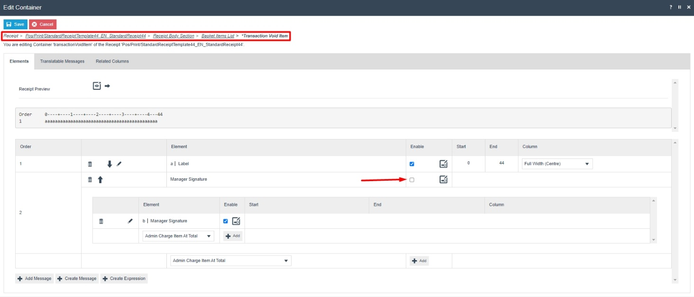 

Now that we have made all the necessary changes to the Standard Receipt
for Voided Transactions, click on Save and navigate to the root of the
Receipt and save all changes to this Receipt.

If everything is successful, the Standard Receipt with the Voided
Transaction customisations will now show in the POS as follows:

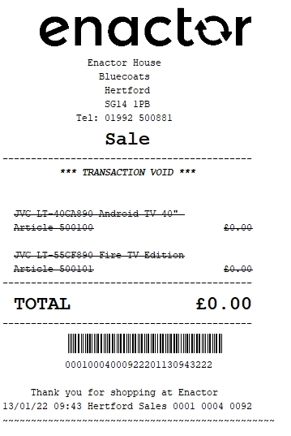

The Standard Receipt for Voided Transactions will be displayed in the
format as required and hence it can be seen that the Receipt has been
successfully customised and printed on the physical printer.

## Duplicate Receipts

This section will guide you through on how customisations can be done
for copy receipts in the POS. The current Standard Receipt displays a
copy receipt is as follows:

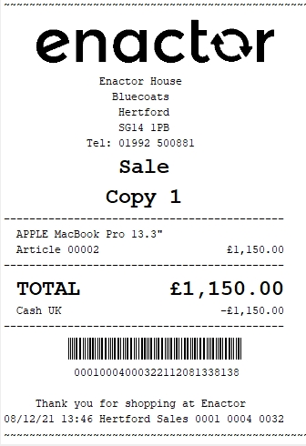

In this customisation, we will change the content of the receipt and
display it in the following order:

-   Change the header from Copy 1 to Receipt Copy with dotted lines on
    the top and bottom of the header as follows:\
    ...\...\...\...\...\...\...\...\...\....\
    Receipt Copy\
    ...\...\...\...\...\...\...\...\...\....

**Note:** Receipt Preview cannot be used to validate the customisations.
This is because duplicate transactions are not recorded in the retail
transaction archive and cannot be added as a preview. A broadcast needs
to be sent to the POS terminal for this receipt and then this receipt
can be printed on a physical printer in order to validate the
customisations made.

### Pre-requisites

Before making any duplicate receipt configurations, we should make sure
that we have the following configured:

-   POS Terminal should be configured to print the correct receipt as
    the additional receipt.

-   There should be a product or a reason that is configured, which
    would allow to print additional copy receipts.

To set your customised Receipt as your Additional Receipt, navigate to
the POS Terminal Maintenance using the Search or the path:

 

Click on the **Edit icon of the POS Terminal** that the Additional
Receipt is to be changed. Go to the tab Printing → General and in the
drop-down for Additional Receipt 1 and Additional Receipt 2, select
**Enactor Standard Receipt 44** as follows:

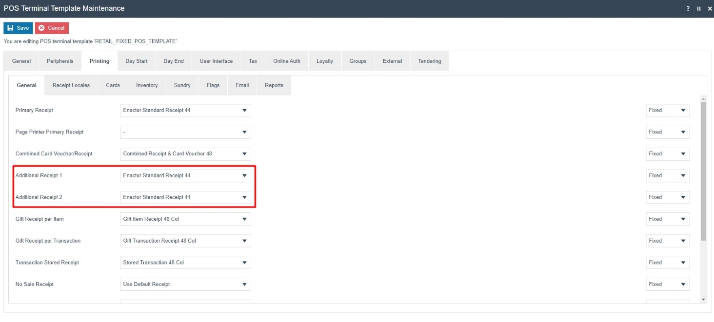 

Now we need to configure a product or reason which would initiate the
printing of the duplicate receipts.

Set via product configuration as follows:

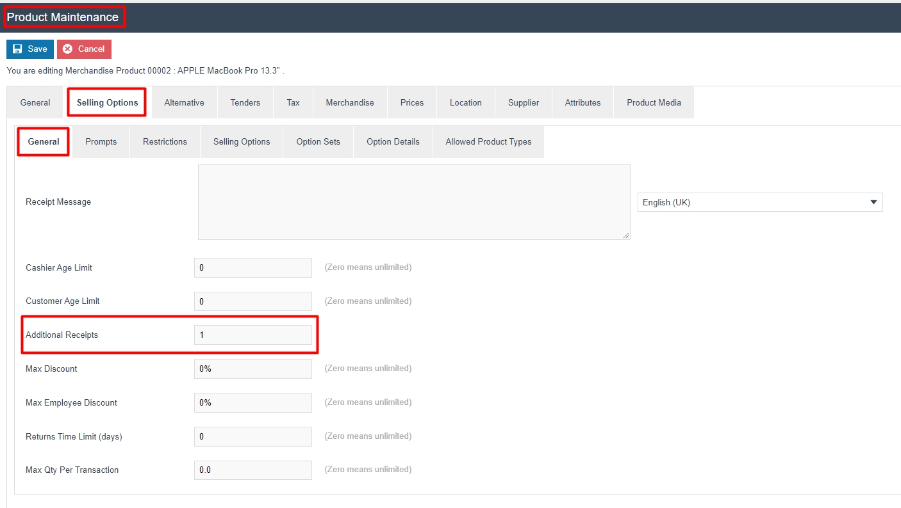 

Set via reason configuration as follows:

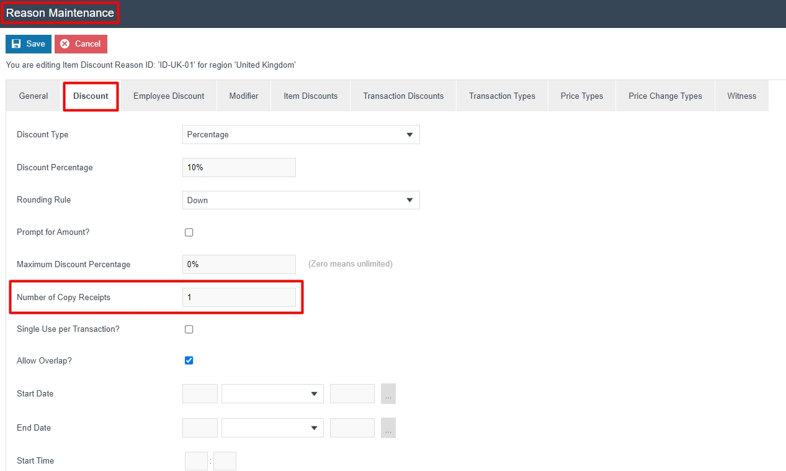 

Once these configurations have been made send a broadcast to your POS
Terminal which includes the following entities:

-   POS Terminal

-   Product

-   Reason

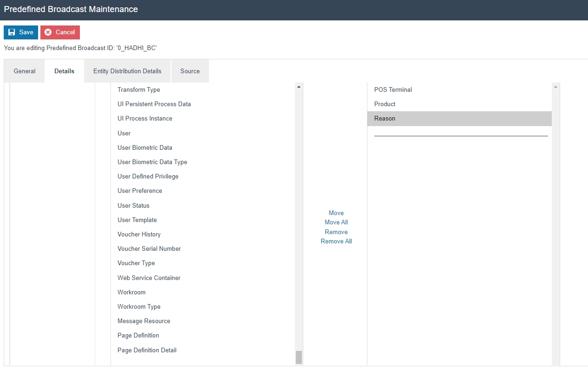 

We can now get duplicate receipts printed in our physical printer.

### Customisations

Let us now start customising this duplicate receipt which is the Enactor
Standard Receipt 44 that has been used so far.

We need to first add the dotted lines for the header of the duplicate
receipt.

1 -- **Navigate to the Receipt Header Section \> Copy Header** which is
the element that contains the label that displays the header of the
duplicate receipt.

2 -- **Select the "Dotted Line" element from the dropdown and click +
Add twice** and move one of the dotted lines to the line 1 as follows:

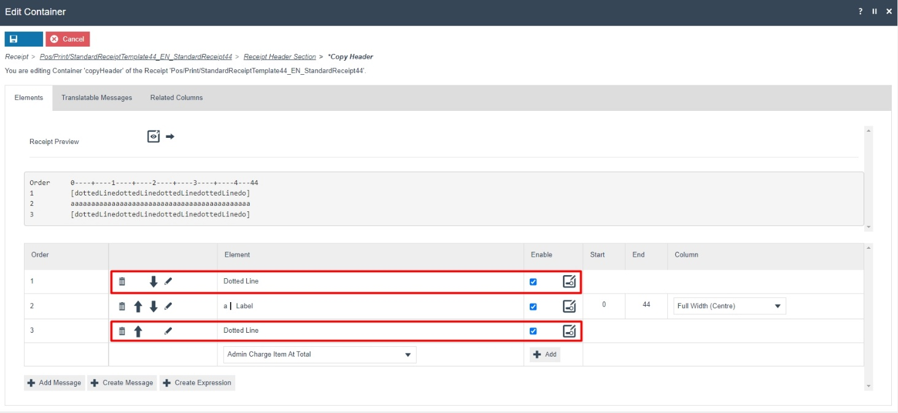 

Now let us change the text of the header in copy receipt.

3 -- **Click on the Translatable Messages tab** which shows the Message
Resource, Message ID and Message Text that is used as follows:

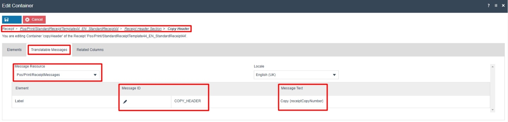

**Note:** It is important to make a note of the Message Resource and
Message ID that is used and then navigate to the Application Translation
Maintenance where we would change the Message Text for the Message ID.

5 -- Now **click on Save and navigate to the root of the Receipt and
save all changes** to this Receipt.

6 -- **Navigate to Application Translations** using the Search or the
path

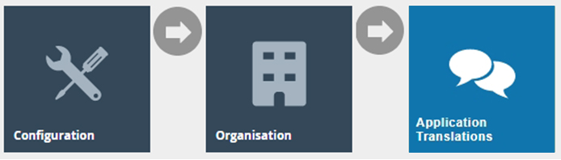 

7 -- In the Application Translation Maintenance, **Filter the Package as
Enactor POS** and then **click Ctrl+F on the keyboard and search for the
"Pos/Print/ReceiptMessages" Message Resource**.

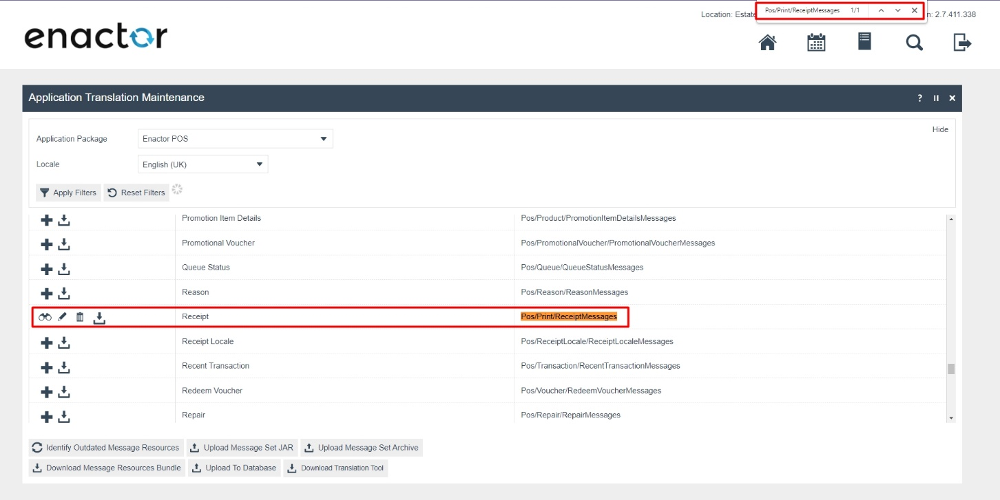

8 -- Click on the + icon to navigate into this Message Resource and then
**click Ctrl+F on the keyboard and search for the \"COPY_HEADER\"
Message ID**.

9 -- **Change the text from "Copy {receiptCopyNumber}" to "Receipt
Copy"** as follows:

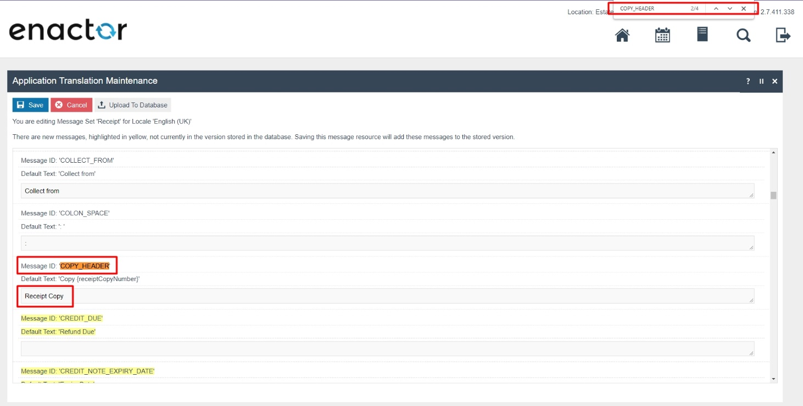 

10 -- Now **send a broadcast to your POS Terminal which includes the
following entities**:

-   Message Resource

-   Page Definition

-   Page Definition Detail

-   POS Terminal

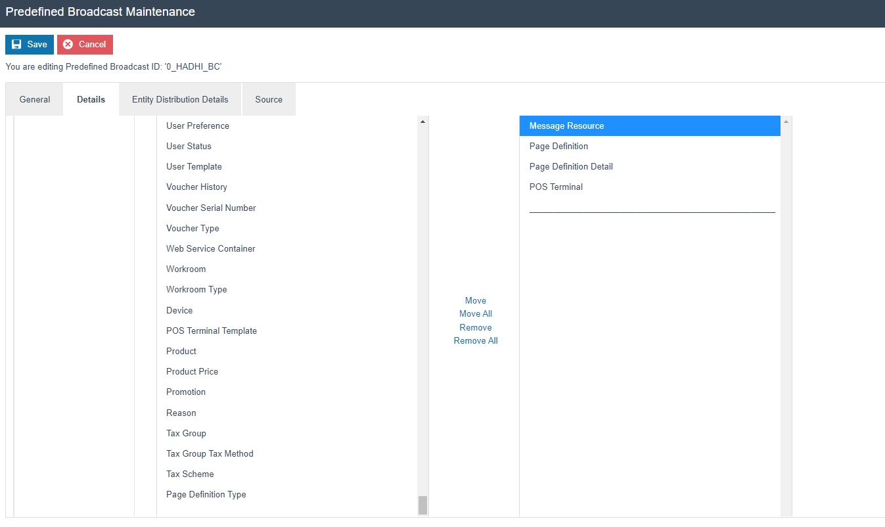 

If everything is successful, the customised Receipt with the duplicate
receipt customisations will now show in the POS as follows:

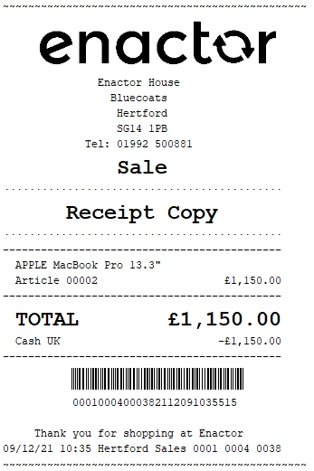

The duplicate receipt will be displayed in the format as required and
hence it can be seen that the Receipt has been successfully customised
and printed on the physical printer.

## Stored Transactions

This section will guide you through on how customisations can be done
for the receipts that get printed when a transaction is stored in the
POS.

The Stored Transaction Receipt is of a different receipt type and this
new receipt must be created and configured in the POS Terminal as well.

Let us first create this new receipt.

1 -- **Navigate to the Receipt Maintenance** and **click on + New
Receipt Document**.

2 -- **Set the appropriate values** for the new Stored Transaction
Receipt as follows:

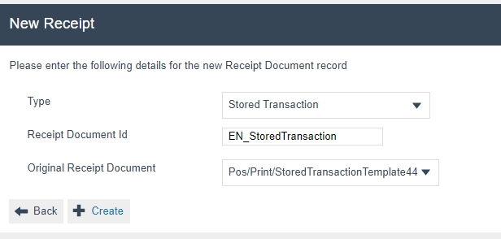

3 -- **Set an appropriate Receipt Name** and **click on Save**.

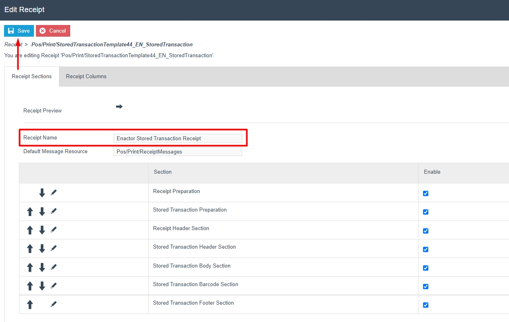 

Now let us configure the POS Terminal to use this Receipt to print the
Stored Transaction Receipt.

4 -- Navigate to the POS Terminal Maintenance using the Search or the
path:

 

5 -- Click on the **Edit icon of the POS Terminal** that the Stored
Transaction Receipt is to be changed. **Go to the tab Printing →
General** and in the **drop-down for Transaction Stored Receipt**,
select **Enactor Stored Transaction Receipt** as follows:

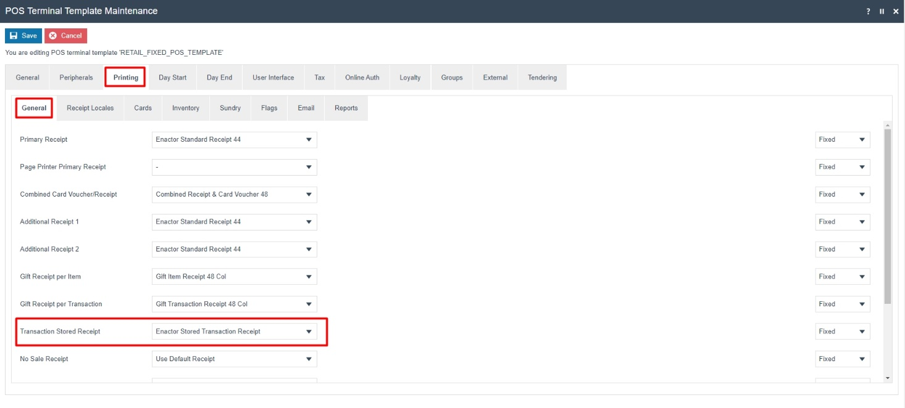 

**Save and broadcast the following entities** which will successfully
set up your new Transaction Stored Receipt to be printed in your POS
Terminal printer:

-   POS Terminal

-   Page Definition

-   Page Definition Detail

The Stored Transaction Receipt displays in the POS Terminal as follows:

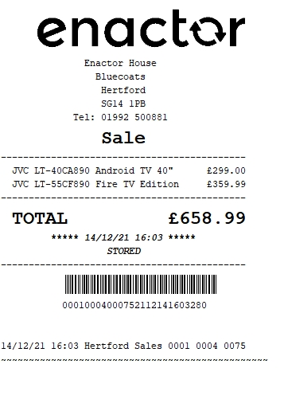

In this customisation, we will change the content of the receipt and
display it in the following order:

-   Change the Sale header inside the dotted lines to display the text
    as Stored.

-   Remove the 2 lines after total that displays the date, time and
    transaction stored text.

**Note:** Receipt Preview cannot be used to validate the customisations.
This is because stored transactions are not recorded in the retail
transaction archive and cannot be added as a preview. A broadcast needs
to be sent to the POS terminal for this receipt and then this receipt
can be printed on a physical printer in order to validate the
customisations made.

Let us first get the Sale header to appear inside the dotted lines.

1 -- In the Receipt Maintenance for this new Stored Transaction Receipt,
**enable the "Stored Transaction Header Section" element** which would
show the following receipt preview:

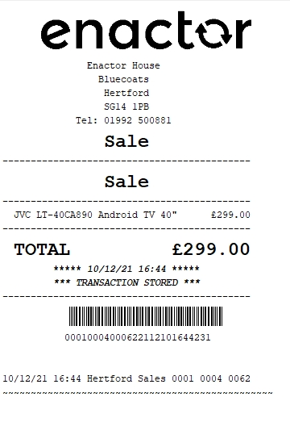

Now let us disable the duplicate Sale header.

2-- **Navigate to Receipt Header Section, disable the "Sale Header"
element** and **click on Save**.

Now we have to change the Sale header to display the text as Stored.

3 -- **Navigate to Stored Transaction Header Section \> Sale Header \>
Header** and **click on the Displayed Text icon** as follows:

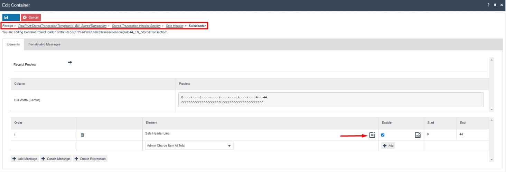 

4 -- Now **click on the edit icon** and **in the Message Translation
field, enter a new unique Message ID** which we will create next in the
application translation.

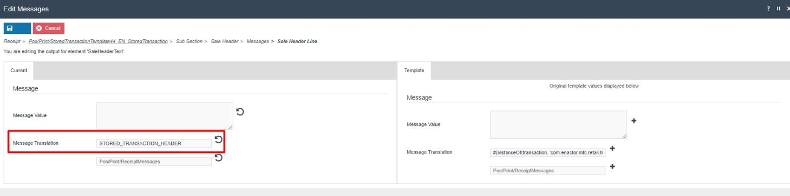 

5 -- Now **click on Save and navigate to the root of the Receipt and
save all changes** to this Receipt.

We have to now create a new message for the message ID that was entered.

6 -- **Navigate to Application Translations** using the Search or the
path

 

7 -- In the Application Translation Maintenance, **Filter the Package as
Enactor POS** and then **click Ctrl+F on the keyboard and search for the
"Pos/Print/ReceiptMessages" Message Resource**.

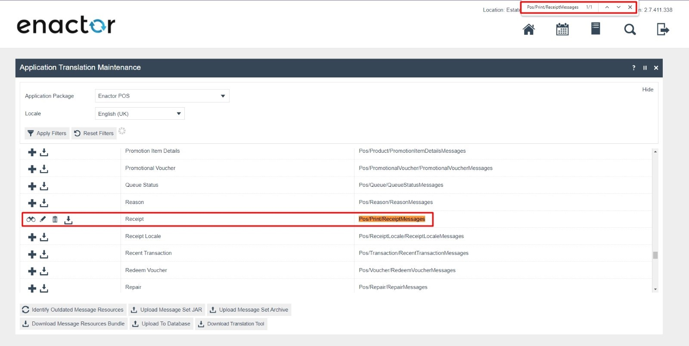

8 -- At the bottom **enter the Message ID and Message Text** as follows
and **click on + Add Message:**

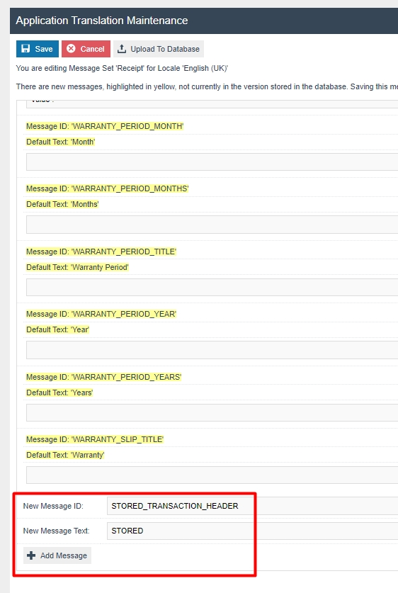 

9 - **Click on Save** which will successfully create a new Message for
the Message ID that you defined for the Sale Header.

Let us now remove the 2 lines after total that displays the date, time
and transaction stored text.

10 -- In your Stored Transaction Receipt, **Navigate to the Stored
Transaction Body Section** and **disable the "Transaction Stored"
element** as follows:

 

Now that we have made all the necessary changes to the Stored
Transaction Receipt, click on Save and navigate to the root of the
Receipt and save all changes to this Receipt.

Make sure to broadcast the following entities to your POS terminal:

-   Message Resource

-   Page Definition

-   Page Definition Detail

-   POS Terminal

If everything is successful, the Stored Transaction Receipt with the
customisations will now show in the POS as follows:

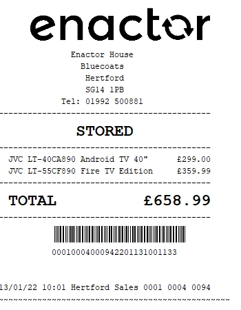 

The Stored Receipt will be displayed in the format as required and hence
it can be seen that the Receipt has been successfully customised and
printed on the physical printer.

## Receipt Return

This section will guide you through on how customisations can be done
for the receipts that get printed when a receipt return is done in the
POS. When this is done, there is a separate receipt type called
"Customer Signature Slip" which is used to get the signature of the
customer when returns are made. The current Standard Receipt and
Customer Signature Slip displays receipt returns as follows:

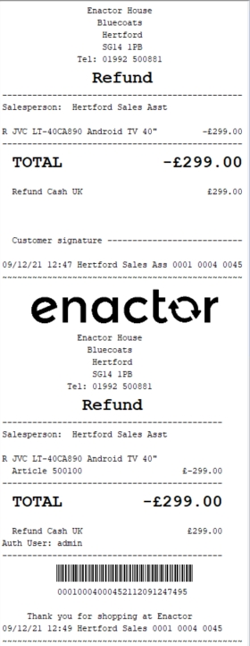

First the customer signature slip is printed and then the standard
receipt which shows the refund of the receipt return is printed.

This section will cover each of these receipt types in separate
sub-sections.

### Standard Receipt Customisation

This is the Receipt that prints the items that are returned and
following is the preview for this:

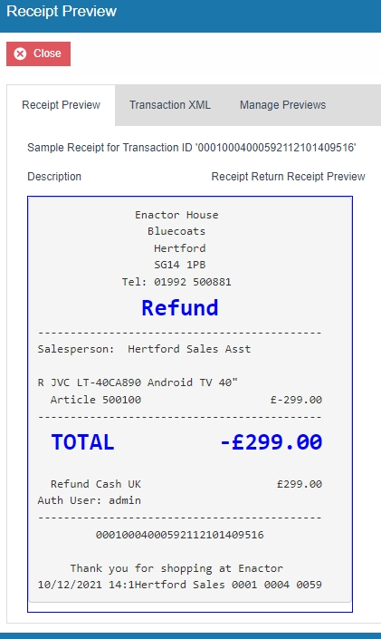

**Note:** The above preview is the standard receipt after making the
changes shown in the section "Addition of the Active Selling Code in the
Receipt", which has changed the formatting that the basket items are
shown.

In this customisation, the changes we will make are:

-   A line that says "Refund" should be added before each basket item.

-   The letter that appears at the start of each basket item should be
    removed.

1 -- In the Standard Receipt, **Navigate to Receipt Body Section →
Basket Items List → Merchandise Item → Merchandise Standard Item
Details**.

2 -- **Enable the "Flags" element, Disable the "Return Flag" element**
and **change the column from Flag to Item Detail Line 1** as follows:

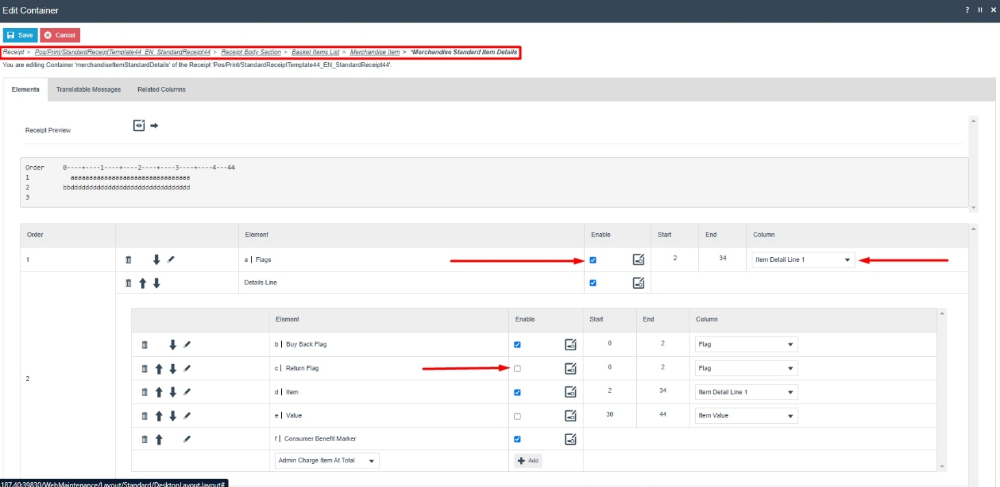 

The receipt preview after making the above changes is now shown as
below:

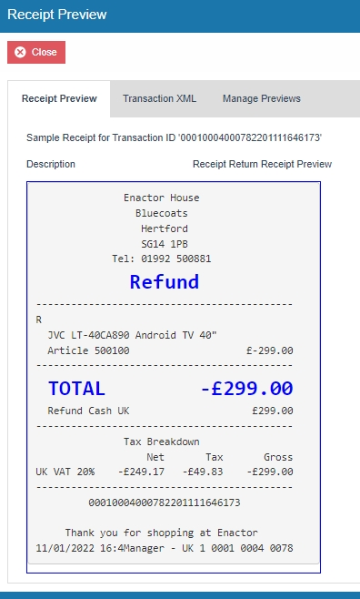 

Now we have to change the text R to Return.

3 -- **Navigate into the "Flags" element** and **Click on the Displayed
Text icon of the "Item Return Flag Label Text" element** as follows:

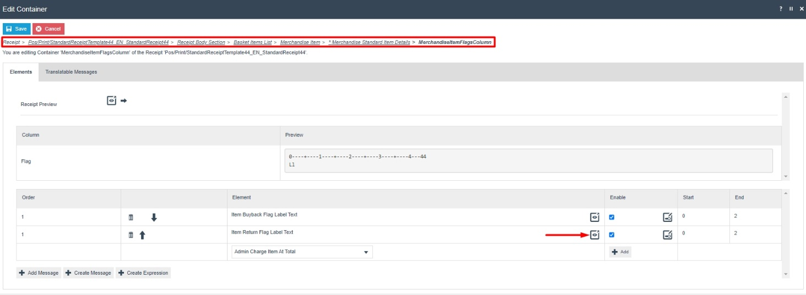 

You will notice the Message Translation ID is "ITEM_RETURN_FLAG".

4 -- Now **click on Save and navigate to the root of the Receipt and
save all changes** to this Receipt.

We have to now change the message of the Message Translation ID
"ITEM_RETURN_FLAG", which displays the message R, into Return.

6 -- **Navigate to Application Translations** using the Search or the
path

 

7 -- In the Application Translation Maintenance, **Filter the Package as
Enactor POS** and then **click Ctrl+F on the keyboard** and **search for
the "Pos/Print/ReceiptMessages" Message Resource**.

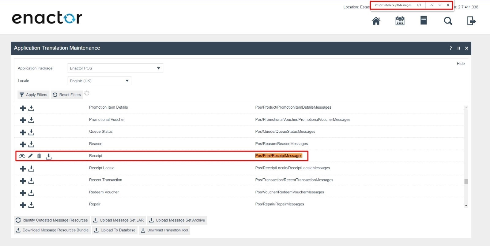 

8 -- C**lick Ctrl+F on the keyboard again** and **search for the
"ITEM_RETURN_FLAG",** **enter the text "Return" in the field of that
Message ID** and **click on Save** as follows:

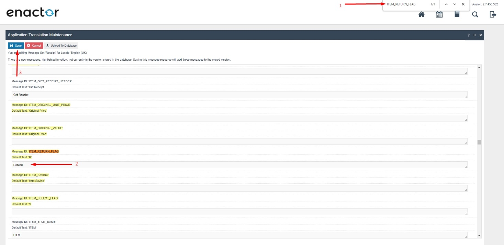 

You can **select your Receipt again and preview** it before broadcasting
and using this new customised Receipt in the POS.

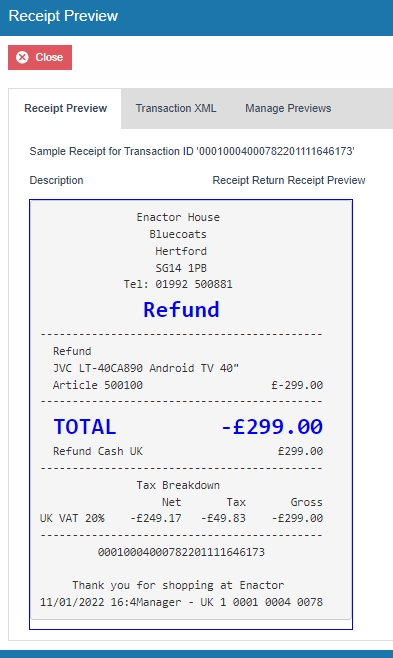 

If everything is successful, the customised Receipt with the Return
customisations will now show in the POS as follows:

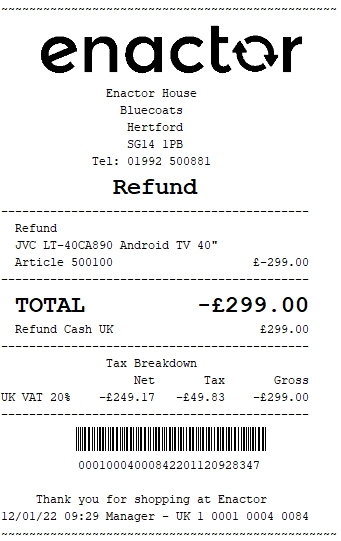

The Return will be displayed in the format as required and hence it can
be seen that the Receipt has been successfully customised and printed on
the physical printer.

### Customer Signature Slip Customisation

This is a separate receipt that is printed before the standard receipt,
where the purpose is to receive the customer details and the signature
at the point of the return transaction.

The Customer Signature Slip is a receipt that is of a different receipt
type and this new receipt must be created and configured in the POS
Terminal as well.

Let us first create this new receipt.

1 -- **Navigate to the Receipt Maintenance** and **click on + New
Receipt Document**.

2 -- **Set the appropriate values** for the new Customer Signature Slip
as follows:

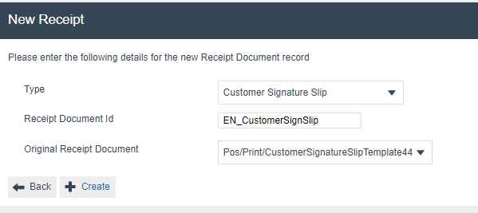 

3 -- **Set an appropriate Receipt Name** and **click on Save**.

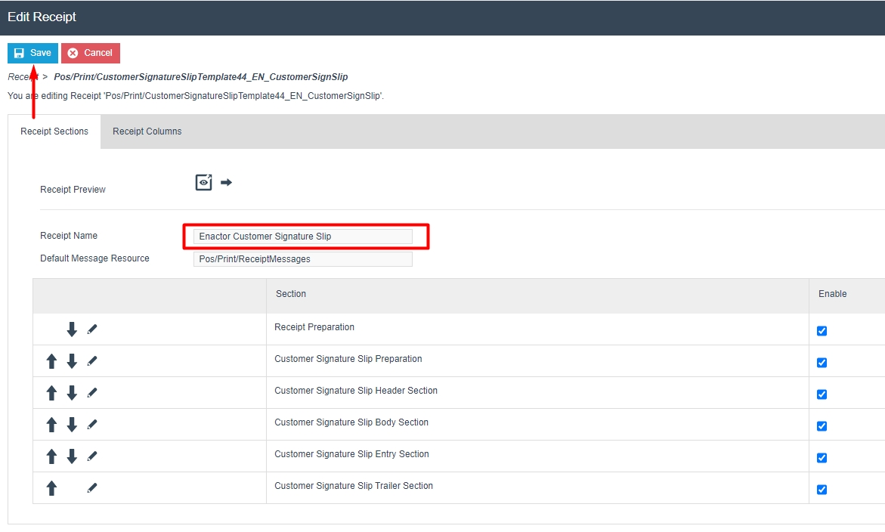 

Now let us configure the POS Terminal to use this Receipt to print the
Customer Signature Slip.

4 -- Navigate to the POS Terminal Maintenance using the Search or the
path:

 

5 -- Click on the **Edit icon of the POS Terminal** that the Customer
Signature Slip is to be changed. **Go to the tab Printing → Sundry** and
in the **drop-down for Customer Signature Slip**, select **Enactor
Customer Signature Slip** as follows:

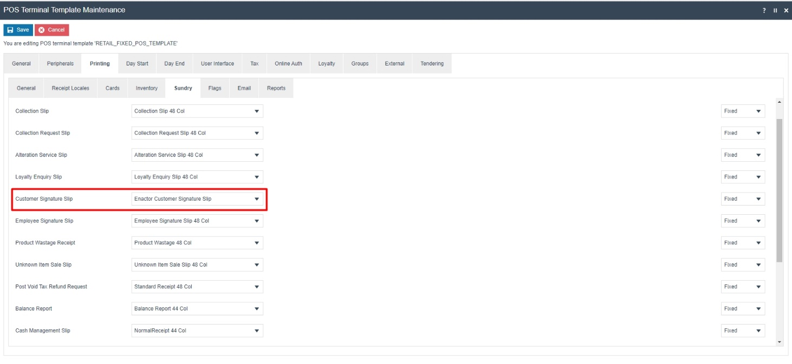 

**Save and broadcast the following entities** which will successfully
set up your new Customer Signature Slip to be printed in your POS
Terminal printer:

-   POS Terminal

-   Page Definition

-   Page Definition Detail

Following is the Receipt Preview in the Receipt Maintenance for the
Customer Signature Slip that was created:

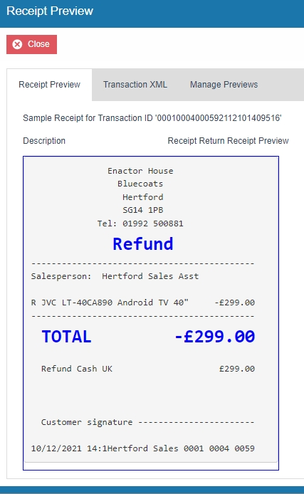

In this customisation, we will replace the customer signature line that
is shown in the above preview by adding the following 3 lines:

-   Have a title as Customer.

-   Customer Name\
    \_\_\_\_\_\_\_\_\_\_\_\_\_\_\_\_\_\_\_\_

-   Customer Signature\
    \_\_\_\_\_\_\_\_\_\_\_\_\_\_\_\_\_\_\_\_

To do this, **Navigate to Customer Signature Slip Entry Section** and
disable the "Customer Signature Compact" element and enable the
"Customer Signature Expanded" element as follows:

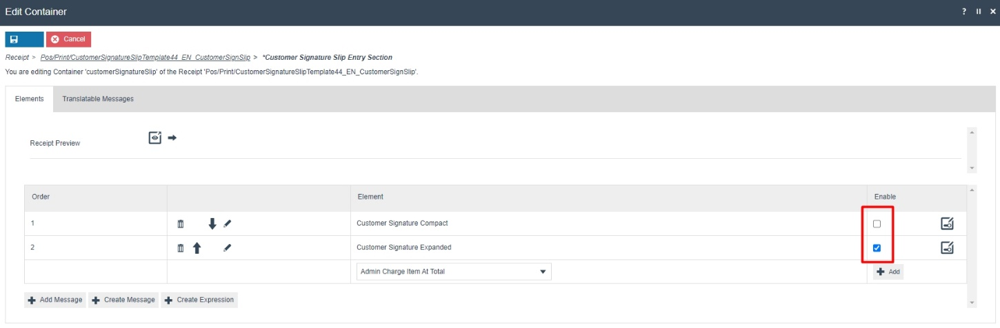

Now that we have made all the necessary changes to the Customer
Signature Slip, click on Save and navigate to the root of the Receipt
and save all changes to this Receipt.

You can select your Receipt again and preview it before broadcasting and
using this new customised Receipt in the POS.

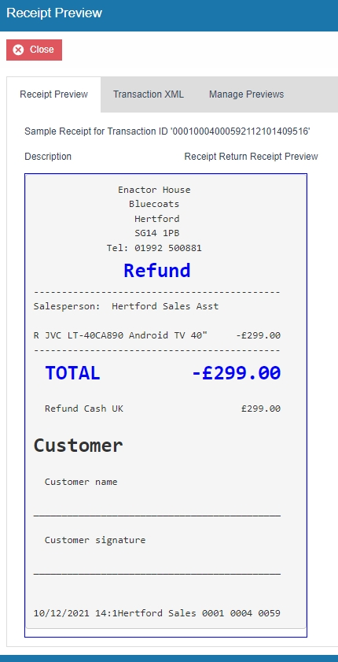

If everything is successful, the Customer Signature Slip Receipt with
customisations will now show in the POS as follows:

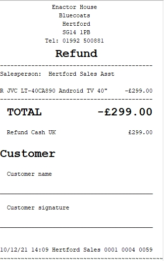

The Customer Signature Slip Receipt appears here as required and hence
it can be seen that the Receipt has been successfully customised and
printed on the physical printer.

## Cash Management Receipts

This section will guide you through on how customisations can be done
for the receipts that get printed when Cash Management transactions are
carried out in the POS.

For Cash Management, there are 3 different types of receipts and based
on the cash management function that is carried out, each of these
receipts are printed in the printer. Following are the 3 cash management
receipt types:

-   Cash Management Normal Receipt.

-   Cash Management Balance Report.

-   Cash Management Session Summary.

Each of these receipts have to be created in the Receipt Maintenance and
configured in the POS Terminal as well.

In this section we would walkthrough on how the Cash Management Normal
Receipt Type can be created and configured.

Let us first create this new Cash Management Normal Receipt.

1 -- **Navigate to the Receipt Maintenance** and **click on + New
Receipt Document**.

2 -- **Set the appropriate values** for the new Cash Management Normal
Receipt as follows:

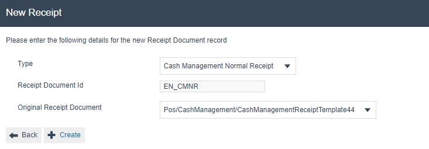 

3 -- **Set an appropriate Receipt Name** and **click on Save**.

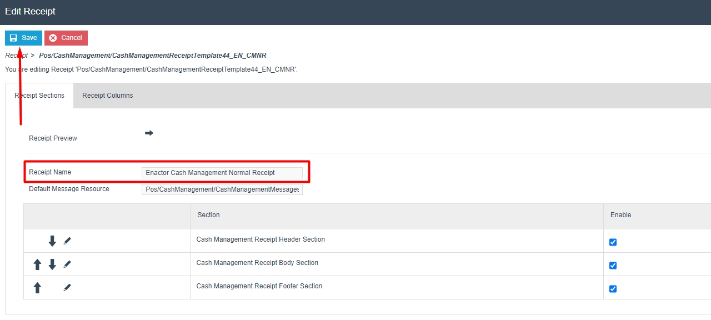 

Now let us configure the POS Terminal to use this Receipt to print the
Cash Management Normal Receipt.

4 -- Navigate to the POS Terminal Maintenance using the Search or the
path:

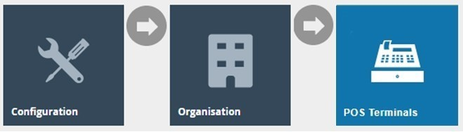 

5 -- Click on the **Edit icon of the POS Terminal** that the Customer
Signature Slip is to be changed. **Go to the tab Printing → Sundry** and
in the **drop-down for Cash Management Slip**, select **Enactor Cash
Management Normal Receipt** as follows:

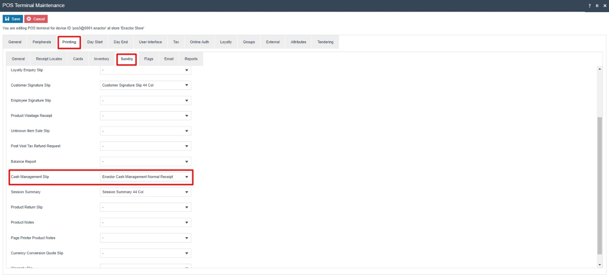 

**Note:** To configure the other 2 cash management receipt types, i.e.,
**Cash Management Balance Report** and **Cash Management Session
Summary**, select the appropriate receipts from the dropdowns for the
fields **Balance Report** and **Session Summary** respectively, in the
above shown **Printing → Sundry Tab of the POS Terminal**.

**Save and broadcast the following entities** which will successfully
set up your new Transaction Stored Receipt to be printed in your POS
Terminal printer:

-   POS Terminal

-   Page Definition

-   Page Definition Detail

The Cash Management Normal Receipt displays in the POS Terminal as
follows:

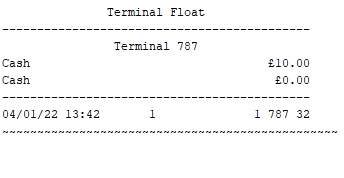

In this customisation, we will change the content of the receipt and
display it in the following order:

-   Add the company logo to the header of the Cash Management Receipts.

-   Display reasons for all Cash Managements Functions such as terminal
    float and pickup.

**Note:** Receipt Preview cannot be used to validate the customisations.
This is because cash management transactions are not recorded in the
retail transaction archive and cannot be added as a preview. A broadcast
needs to be sent to the POS terminal for this receipt and then this
receipt can be printed on a physical printer in order to validate the
customisations made.

Let us get the Company Logo to appear in the Header in each of the 3
Cash Management Receipts. We will first get the Company Logo to appear
in the Header of the Cash Management Normal Receipt.

1 -- In the Receipt Maintenance, **navigate to the Cash Management
Normal Receipt** which was created and configured to your POS Terminal.

2 -- **Navigate into the Cash Management Receipt Header Section** and
then enable the Header Logo as follows:

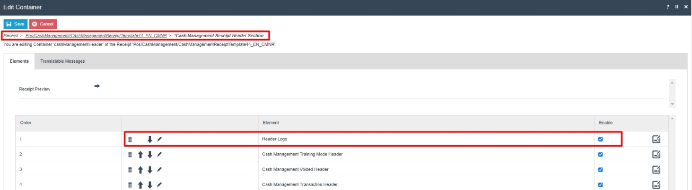 

Following is the Receipt after the Header Logo has been enabled:

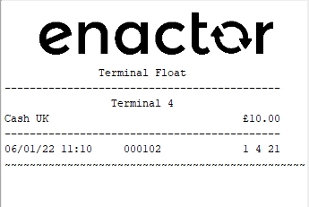

**Note:** To add the Company Logo to the other 2 cash management receipt
types, i.e., **Cash Management Balance Report** and **Cash Management
Session Summary**, **navigate into the Cash Management Receipt Header
Section** of the appropriate receipt and then **enable the Header Logo**
as shown above in the second point. This would then enable the Company
Logo for all cash management transactions.

Now we need to display reasons for all Cash Managements Functions such
as terminal float and pickup. The current cash management receipt
configuration shows the reasons only for income and expence transactions
as shown below:

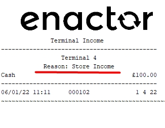
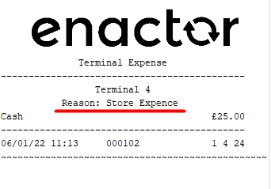

The reasons are not displayed for other cash management functions such
as float and pickup and we need to configure the receipt to display
them.

**Note:** Please make sure that you have reasons already configured for
Terminal Float and Terminal Pickup reason types. Only if these are
already configured will the below steps display the reasons in the Cash
Management Receipts.

3 -- In the Receipt Maintenance, **navigate to the Cash Management
Normal Receipt** which was created and configured to your POS Terminal.

4 -- **Navigate into the Cash Management Receipt Header Section** and
then **click on the visibility expression icon of the** **"Reason"**
**element** as follows:

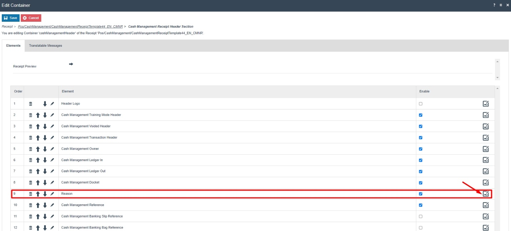 

5 -- Click on the Edit button of the popup that appears.

6 -- In the Applicability Expression field on the left panel, you will
notice the following expression:

#{(cMTransaction.transactionType == \'TerminalExpense\' \|\|
cMTransaction.transactionType == \'TerminalIncome\') &&
notEmpty(cMTransaction.reasonKey.reasonId)}

You have to remove the expression that checks if the cash management
transaction type is terminal expense and terminal income, and leave only
the last part of that expression that checks if a Reason ID exists as
follows:

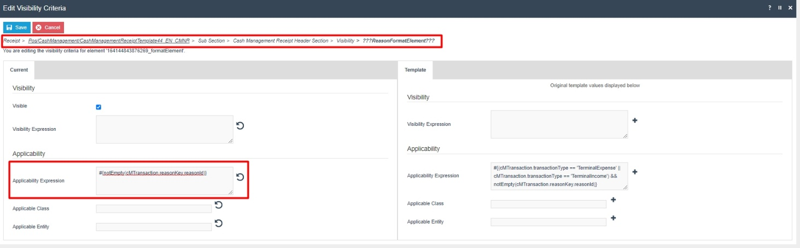 

Now that we have made all the necessary changes to the Cash Management
Normal Receipt, click on Save and navigate to the root of the Receipt
and save all changes to this Receipt.

After broadcasting, if everything is successful, the Cash Management
Normal Receipt with customisations will now show in the POS as follows
for Terminal Float and Terminal Pickup transactions:

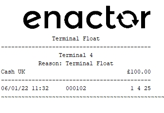
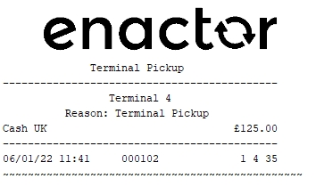

The Cash Management Normal Receipt will be displayed in the format as
required and hence it can be seen that the Receipt has been successfully
customised and printed on the physical printer.

## Warranty Receipts

This section will guide you through on how customisations can be done
for the receipts that get printed when products with warranty are sold
in the POS.

The Warranty Receipt is of a different receipt type and this new receipt
must be created and configured in the POS Terminal as well.

Let us first create this new receipt.

1 -- **Navigate to the Receipt Maintenance** and **click on + New
Receipt Document**.

2 -- **Set the appropriate values** for the new Warranty Receipt as
follows:

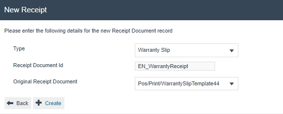

3 -- **Set an appropriate Receipt Name** and **click on Save**.

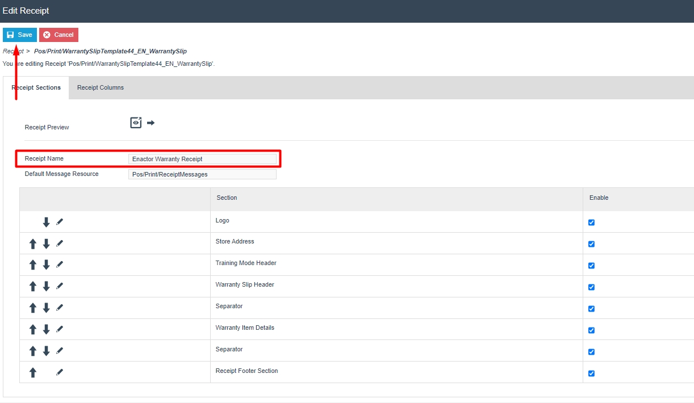 

Now let us configure the POS Terminal to use this Receipt to print the
Warranty Receipt.

4 -- Navigate to the POS Terminal Maintenance using the Search or the
path:

 

5 -- Click on the **Edit icon of the POS Terminal** that the Warranty
Receipt is to be changed. **Go to the tab Printing → Sundry** and in the
**drop-down for Warranty Slip**, select **Enactor Warranty Receipt** as
follows:

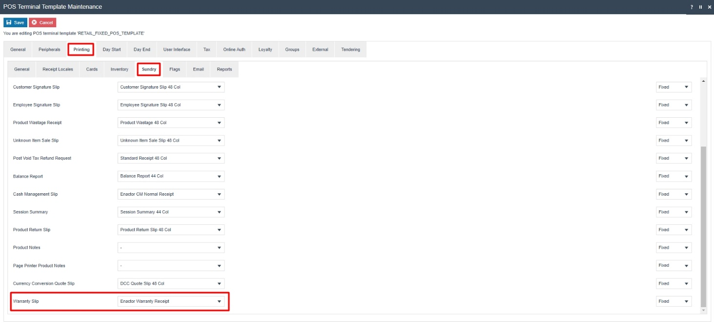 

**Save and broadcast the following entities** which will successfully
set up your new Transaction Stored Receipt to be printed in your POS
Terminal printer:

-   POS Terminal

-   Page Definition

-   Page Definition Detail

The Warranty Receipt displays in the POS Terminal as follows:

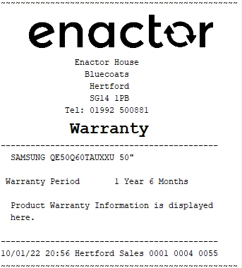

In this customisation, we will change the content of the receipt and
display it in the following order:

-   The warranty header should be wrapped in between dotted lines.

-   Add "\[Quantity\] @ \[Active Selling Code/Product ID\]" after the
    product description line.

**Note:** Receipt Preview cannot be used to validate the customisations.
This is because stored transactions are not recorded in the retail
transaction archive and cannot be added as a preview. A broadcast needs
to be sent to the POS terminal for this receipt and then this receipt
can be printed on a physical printer in order to validate the
customisations made.

Let us first get the warranty header to appear inside the dotted lines.

1 -- In the Receipt Maintenance, **navigate to the Warranty Receipt**
which was created and configured to your POS Terminal.

2 -- **Navigate into the** **Warranty Slip Header Section**.

3 -- **Select the "Seperator" element** **from the drop-down** and
**click on the + Add button**.

4 -- **Move the "Seperator" element to the first row**, above the
"Warranty Slip Header Column" element, which would result as follows:

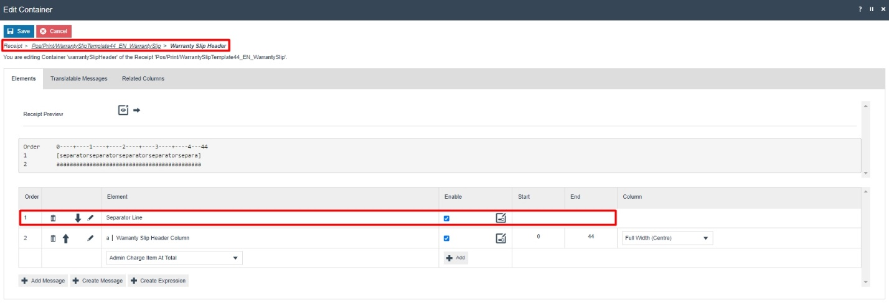 

Now let us add the "\[Quantity\] @ \[Active Selling Code/Product ID\]"
after the product description line.

5 -- **Click on Save and navigate to the root of the Receipt** and now
**navigate to the Warranty Item Details section**.

6 -- **Enable the "Warranty Article Column" element** as follows:

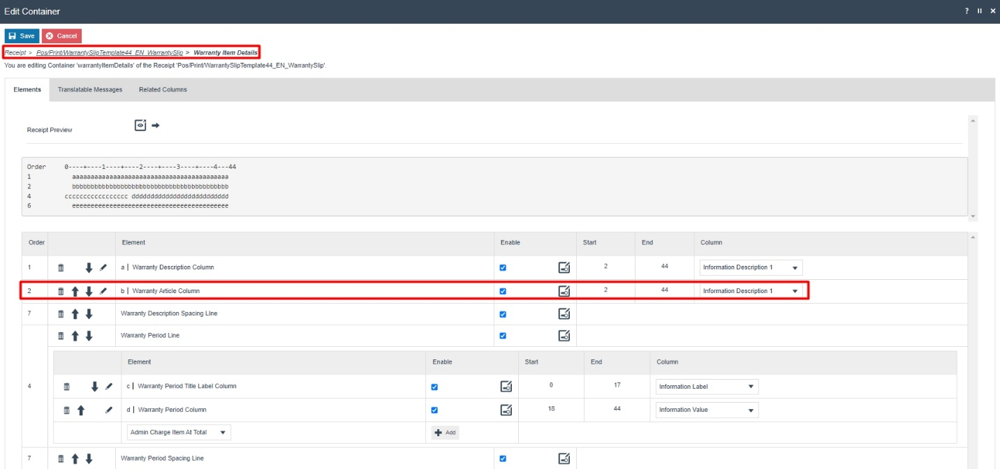 

Now that we have made all the necessary changes to the Warranty Receipt,
click on Save and navigate to the root of the Receipt and save all
changes to this Receipt.

After broadcasting, if everything is successful, the Warranty Receipt
with customisations will now show in the POS as follows for when a
product with Warranty is sold:

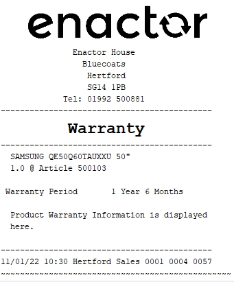 

The Warranty Receipt will be displayed in the format as required and
hence it can be seen that the Receipt has been successfully customised
and printed on the physical printer.

## Gift Transaction Receipts

This section will guide you through on how customisations can be done
for the receipts that get printed when a Gift Receipt is selected to be
printed in the POS.

The Gift Transaction Receipt is of a different receipt type and this new
receipt must be created and configured in the POS Terminal as well.

Let us first create this new receipt.

1 -- **Navigate to the Receipt Maintenance** and **click on + New
Receipt Document**.

2 -- **Set the appropriate values** for the new Gift Transaction Receipt
as follows:

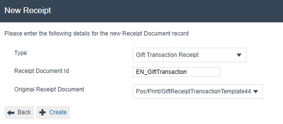 

3 -- **Set an appropriate Receipt Name** and **click on Save**.

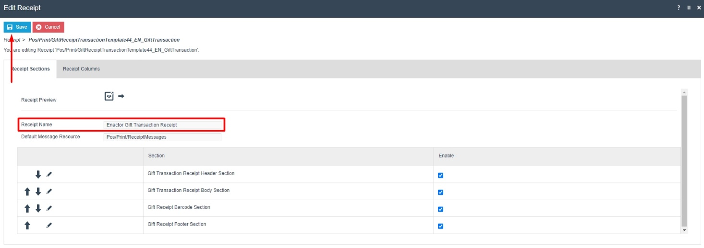 

Now let us configure the POS Terminal to use this Receipt to print the
Gift Transaction Receipt.

4 -- Navigate to the POS Terminal Maintenance using the Search or the
path:

 

5 -- Click on the **Edit icon of the POS Terminal** that the Gift
Transaction Receipt is to be changed. **Go to the tab Printing →
General** and in the **drop-down for Gift Receipt per Transaction**,
select **Enactor Gift Transaction Receipt** as follows:

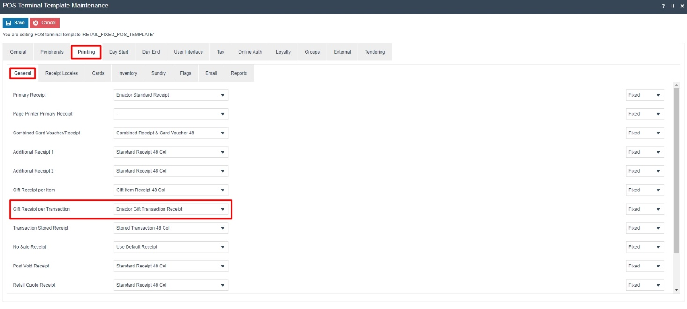 

**Save and broadcast the following entities** which will successfully
set up your new Transaction Stored Receipt to be printed in your POS
Terminal printer:

-   POS Terminal

-   Page Definition

-   Page Definition Detail

The Gift Transaction Receipt displays in the POS Terminal as follows:

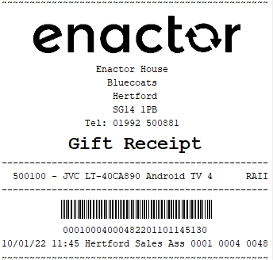 

You can notice that the price of the product is shown in an encoded
alphabet value. In this customisation we will hide that value altogether
and leave the rest of the details in the Gift Transaction Receipt.

**Note:** Receipt Preview cannot be used to validate the customisations.
This is because stored transactions are not recorded in the retail
transaction archive and cannot be added as a preview. A broadcast needs
to be sent to the POS terminal for this receipt and then this receipt
can be printed on a physical printer in order to validate the
customisations made.

1 -- In the Receipt Maintenance for this new Gift Transaction Receipt,
**navigate to** **Gift Transaction Receipt Body Section \> Gift Receipt
Item List \> Gift Receipt Item**.

2 -- **Disable the \"Item Value" element** as follows:

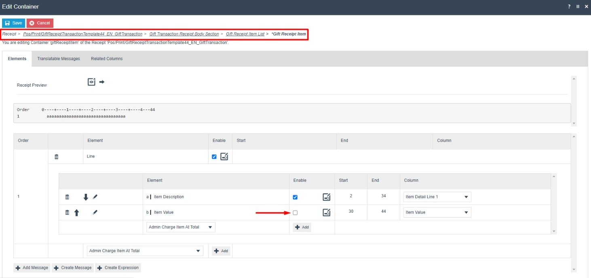 

Now that we have made all the necessary changes to the Gift Transaction
Receipt, click on Save and navigate to the root of the Receipt and save
all changes to this Receipt.

If everything is successful, the Gift Transaction Receipt with the
customisations will now show in the POS as follows:

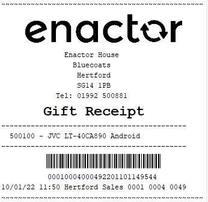

The Gift Transaction Receipt will be displayed in the format as required
and hence it can be seen that the Receipt has been successfully
customised and printed on the physical printer.

## Location based Header & Footer customisations for Receipts

This section will guide you on making customisations to the header and
footer sections of the receipts based on each location. These
configurations are done using the Location Maintenance function.

1 -- **Navigate to the Location Maintenance** using the Search or the
path:

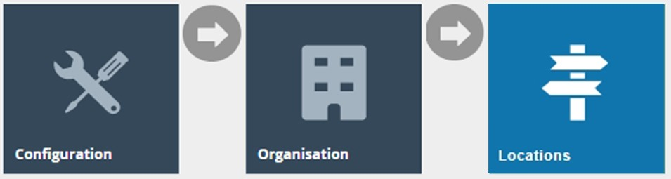 

2 -- Select the **Edit** option on the desired **location** to which the
receipt configurations are to be made.\
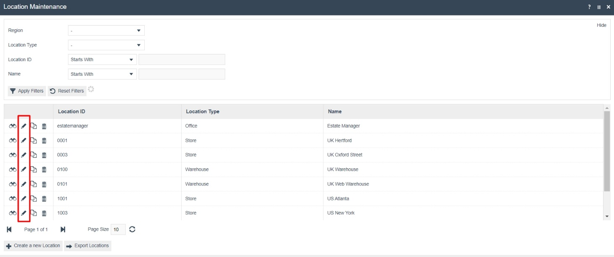 

3 -- **Navigate to the Address tab** of the location. There are 2
sub-tabs here namely, Address and Contact Details. Enter the Address
details and Contact Details as shown below:\
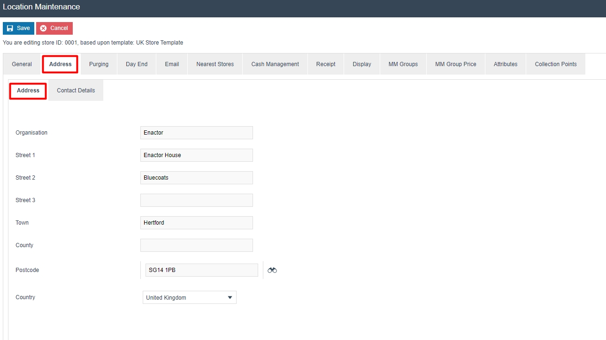
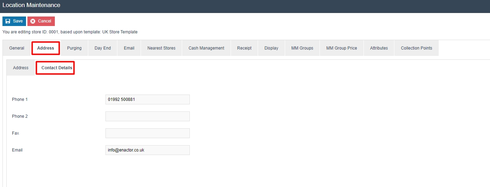
\
The following image shows how each of the fields of the above Address
tab is displayed in the Receipt:

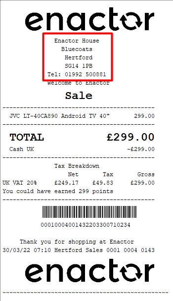 

4 -- **Navigate to the Receipt tab** of the location. This is where the
Receipt Header Lines, Receipt Footer Lines, Receipt Header Logo and
Receipt Footer Logo are configured.

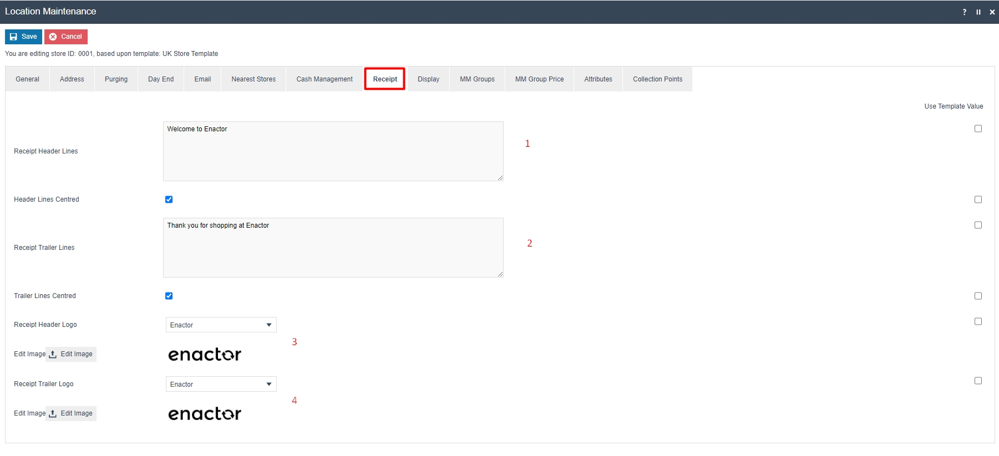 The
following image how each of the above fields of the Receipts tab is
displayed in the Receipt:

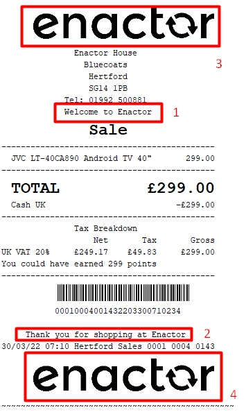 

The configurations made in the Image Maintenace produce the images
available for selection in the dropdown for the Receipt Header Logo and
Receipt Footer Logo.

5 -- To add an image, navigate to the **Image Maintenance** using the
Search or the path:

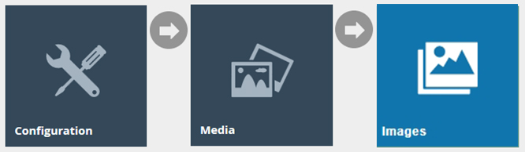 

6 -- Select **Upload a New Image** on the Image Maintenance page.

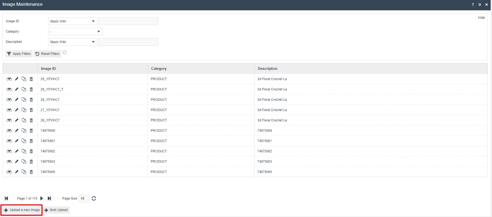 

7 -- Select the **Category** as **Receipt Logos,** enter an **Image ID**
for the new Receipt Logo image and click on **Create**.

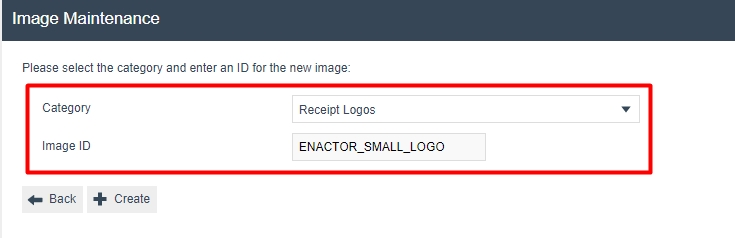 

8 -- Enter a suitable **description** for this image and click on the
**Upload Image** button as shown below:

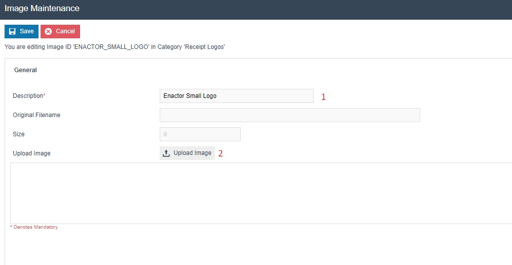 

**Note:** The following sizes can be maintained,

-   Normal logo: 300 x 58 pixels

-   Small logo: 150 x 29 pixels

Make sure to maintain a ratio of 5:1 when uploading any new image.

Please find the normal and small logo size samples below:

 

 

9 -- Click on **Choose File** to select the desired image to upload.
Once selected, click on the **Upload button** as shown below:

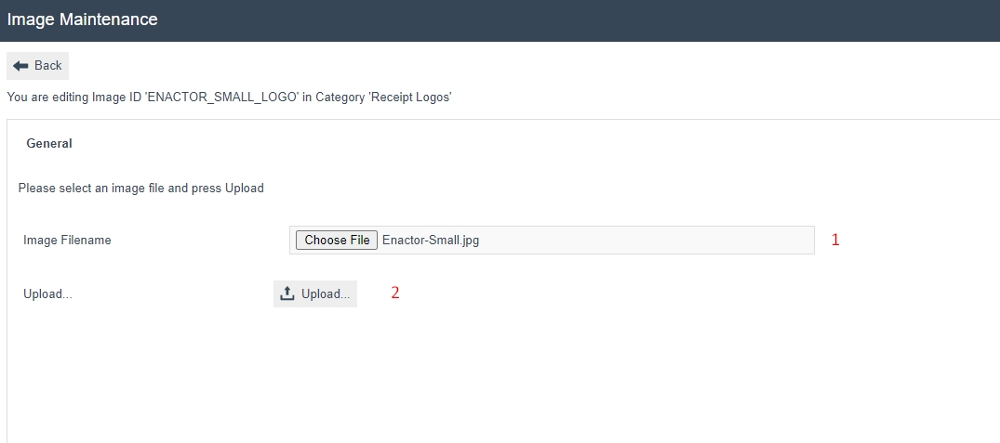 

A successfully uploaded image will be displayed as shown below:\
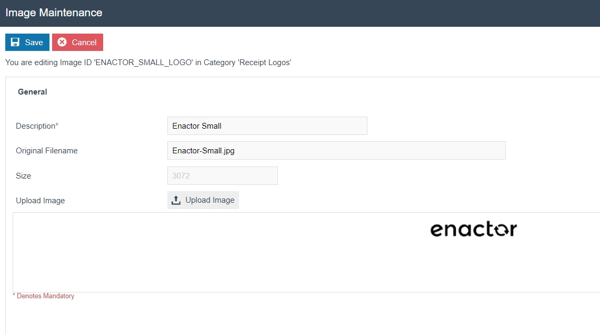 

10 -- Select **Save**

Navigate back to the Location Maintenance and you will now be able to
select the newly uploaded image from the Receipt Header Logo and Receipt
Footer Logo dropdown menus in the **Location Maintenance- Receipt Tab**
as shown below:

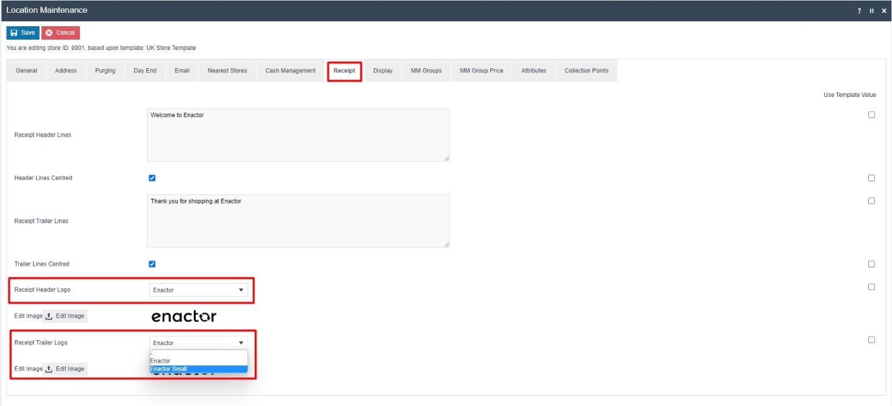 

11 -- Select **Save** and **broadcast t**he following entities which
will successfully set up your new location-based header and footer
customisations to be printed in your POS Terminal printer:

-   Location

-   Images

The Standard Receipt with the added customisations will be displayed in
the POS Terminal as shown below:

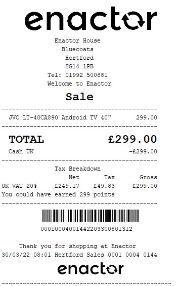 

Notice that the logo of the footer is using the Enactor Small image that
was uploaded and customised. Hence, all the customisations made appear
here as desired and successfully customised and printed on the physical
printer.

# Broadcasting

To deliver all the configuration changes to the POS, broadcast the
following entities.

-   Page Definition

-   Page Definition Detail

-   POS Terminal

-   POS Terminal Template

-   Product

-   Reason

-   Message Resource

-   Location

-   Images
