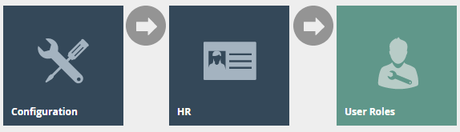

# Configuring Return Reasons
# Introduction

The purpose of this guide is to provide a foundational understanding of
the options and capabilities available when configuring Return Reasons.
Return Reasons mainly consist of Item Return, Receipt Return, Item
Exchange, MMG Return, and Non-Merchandise Return. Reasons are configured
based on a Reason Type and are associated with a Region in which they
are applicable.

The properties of a Reason configuration too depend on the Reason Type.
Return Reasons are Reasons for which either a particular item or Receipt
is enabled return following checkout. This guide provides the basic
step-by-step configurations required to set up the necessary Return
Reasons.

## Overview

This guide will cover the configuration for the following:

-   **Item Return** -- Allows return of a particular item in a
    transaction.

-   **Receipt Return** -- Allows return of the entire receipt.

-   **Item Exchange** -- Allows exchange of a particular item in a
    transaction.

-   **MMG Return** -- Allows return of an item from a department sale.

-   **Non-Merchandise Return** -- Allows return of a non-merchandise
    item.

**Prior Training / Experience ** 

You should be familiar with the following:  

-   Estate Manager Configuration  

-   Data Broadcasting 

# Configuration Steps

Reasons are created based on a pre-defined **Reason Type** and
associated with a Region in which they are applicable. Each Reason Type
is known to a specific function of the application, that is required to
capture reasons of the specific type. Many of the Reason Types relate to
Application-Specific built-in functionality. 

## Item Return

Item Return Reason allows setting the option to return a particular item
in a transaction. This governs how manual returns (also referred to as
Non-receipt Returns) are handled at the POS. Generally, an Item Return
Reason can directly impact Tenders and Inventory.

The reason maintenance application can be accessed through:

Configuration -\> Organisation -\> Reasons

To create a new Reason, select **Create a New Reason** on the Reason
Maintenance page.

Select the appropriate Region** **from the **Region** drop-down. 

Select **Item Return** from the **Reason Type** drop-down. 

Enter a unique **Reason ID **for the new Item Discount Reason. The ID
can be alphanumeric and contain a maximum of 20 characters. 

You will be presented with the following options to complete creating
the new Item Return Reason: 

### Reason -- General Tab

The General tab has all the basic information that captures the identity
of the Item Return Reason.

Set the appropriate values on the **General** tab as follows:

 | Configuration                     | Description                                                                                                                                                                                         |
|-----------------------------------|-----------------------------------------------------------------------------------------------------------------------------------------------------------------------------------------------------|
| Description                       | Enter a user-friendly, meaningful description for the Reason that can be alphanumeric with a maximum of 50 characters.                                                                              |
|                                   | Select the locale from the dropdown list of all configured Locales.                                                                                                                                 |
| Function Authorisation Code       | Select the applicable Function Authorisation Code from the drop-down list. These are defined and configured in Role Maintenance and applicable only if the reason selection requires authorisation. |
| Capture Reference Number          | Select check box, if the User should be prompted to enter a reference number when using this Reason.                                                                                                |
| Capture Customer Name and Address | Select check box, if the User should be prompted to capture the Customer's Name and Address when using this Reason.                                                                                 |
| Parent Reason ID                  | If the reason requires a parent reason, select the relevant parent reason from the drop-down list of all configured Reasons of the same Reason Type.                                                |
| Reason Start Date                 | Enter a Reason Start Date                                                                                                                                                                           |
| Reason End Date                   | Enter a Reason End Date                                                                                                                                                                             |

### Reason -- Return Tab

The Return tab provides a comprehensive list of properties available for
configuration of the specific Item Return Reason that define permissible
options and handling of Returns.

Set the appropriate values on the **Return** tab as follows:

 | Configuration                | Description                                                                                                                                                                                                   |
|------------------------------|---------------------------------------------------------------------------------------------------------------------------------------------------------------------------------------------------------------|
| Effect On Inventory          | Select an appropriate type from all configured Inventory Types that will determine the effect on inventory property when using this Reason.                                                                   |
| Capture Original Tender?     | Select the checkbox if the User must be prompted to capture the original tender details when using this Reason.                                                                                               |
| Capture Original Tax Region? | Select the checkbox if the User must be prompted to capture the original Tax Region when using this Reason.                                                                                                   |
| Requires Witness?            | Select the checkbox to indicate if the User must obtain a witness when using this Reason.                                                                                                                     |
| Return within Days Limit     | Enter a numeric value ranging from 0-365 which will determine the period within which an item may be returned with this Reason. Setting the value to 0 determines, an unlimited number of days is applicable. |
| Capture Return Information?  | Select the checkbox if the User must be prompted to capture any required return information when using this Reason.                                                                                           |
| Raise Alert?                 | Select the checkbox if an alert must be raised when this Reason is used.                                                                                                                                      |
| Print Signature Slip?        | Select the checkbox if a customer signature slip will be printed when this Reason is used.                                                                                                                    |
| Number of Copy Receipts      | Enter a numeric value ranging from 0-5 which will determine the number of extra receipts to be printed when this Reason is used.                                                                              |
| Offer Return Slip            | Select the checkbox if the User must be prompted to offer a product return slip when using this Reason.                                                                                                       |

### Reason -- Return Price Tab

The Return Price tab provides properties that capture components
relating to the return price of the Item Return Reason.

Set the appropriate values on the **Return Price** tab as follows:

| Configuration                     | Description                                                                                                                    |
|-----------------------------------|--------------------------------------------------------------------------------------------------------------------------------|
| Force Price Entry                 | Select the checkbox if the User is enabled to force a price entry that is different to the price shown when using this Reason. |
| Enable Lowest Return Price Lookup | Select the checkbox if the User is enabled to lookup the lowest Return price of a product when using this Reason.              |

### Reason -- Applicable Tenders Tab

The Applicable Tenders Tab is available for Reason Types that contains a
Tenders dependency when using the Reason. This Reason will be available
for the operator to select only if the Tender of the Transaction
permits.

All Tenders that may be applicable to this Reason Type are listed with a
Checkbox. Select the desired tender type(s) to indicate the operator the
applicable tender type(s) when using this Reason.

### Reason -- Transaction Types Tab

The Transaction Types tab is available for Reasons which are only valid
for certain transaction types (Eg: Restaurant sale transaction). All
Transaction Types for this Reason can be selected here and if no
transaction types are selected, it is assumed that the Reason is valid
for all.

Reason -- Witness Tab 

The Witness tab is available for Reasons which require the User to
obtain a witness when using this Reason. If checked, the user will be
prompted for a witness whenever the Reason is selected.  

If checked, additional configuration options will appear. Set
appropriate values on the fields as follows: 

+----------------------+-----------------------------------------------+
| > Configuration      | > Description                                 |
+======================+===============================================+
| > Witness User       | > Select from the drop-down list to determine |
| > Function           | > this as a **Manager Authorised              |
| Authorisation Code   | > Functions**.                                |
+----------------------+-----------------------------------------------+
| > Witness Skip       | > Select from the drop-down list to determine |
| > Function           | > this as a **Manager Authorised              |
| >                    | > Functions**.                                |
|  Authorisation Code  |                                               |
+----------------------+-----------------------------------------------+
| > Capture            | > Enter a numeric value to define             |
| > Witness Rate       | > a percentage for the capture witness        |
|                      | > rate. (Indicates the percentage that the    |
|                      | > user should be prompted to capture witness; |
|                      | > against the number of times this reason is  |
|                      | > used)                                       |
+----------------------+-----------------------------------------------+

Select **Save** to complete creating the Item Return Reason.

\* Multiple Reasons can be created for the Item Return Reason Type as
required. These Reasons will be presented to the operator to select from
when performing an Item Return.

## 

## Receipt Return 

Receipt Return Reason allows setting the option to return one or more
items in a transaction. Both Item Return and Receipt Return Reason Types
capture the same properties in the same set of Tabs of their Reason
Maintenance pages except for the differences in the properties captured
in the Return Tab. Receipt Return Reason can also directly impact
Tenders and Inventory.

To create a new Reason, select **Create a New Reason** on the Reason
Maintenance page.

Select the Region** **from the **Region** drop-down. 

Select **Receipt Return** from the **Reason Type** drop-down. 

Enter a unique **Reason ID **for the new Item Discount Reason. The ID
can be alphanumeric and contain a maximum of 20 characters. 

You will be presented with the following options to complete creating
the new Receipt Return Reason: 

### Reason -- General Tab

The General tab has all the basic information that captures the identity
of the Receipt Return Reason.

Set the appropriate values on the** General Tab** as per the sample on
configuring Item Return reason.

### Reason -- Applicable Tenders Tab

The Applicable Tenders Tab is available for Reason Types that contains a
Tenders dependency when using the Reason. This Reason will be available
for the operator to select only if the Tender of the Transaction
permits.

Set the appropriate values on the** Applicable Tenders Tab** as per the
sample on configuring Item Return reason.

### Reason -- Transaction Types Tab

The Transaction Types tab is available for Reasons which are only valid
for certain transaction. All Transaction Types for this Reason can be
selected here and if no transaction types are selected, it is assumed
that the Reason is valid for all.

### Reason -- Witness Tab

The Witness tab is available for Reasons which require the User to
obtain a witness when using this Reason. If checked, this option is made
active for this Reason.

Set the appropriate values on the** Witness Tab **as per the sample on
configuring Item Return reason.

### Reason -- Return Tab

The Return tab provides a comprehensive list of properties available for
configuration of the specific Receipt Return Reason that define
permissible options and handling of Returns.

Set the appropriate values on the **Return** tab as follows:

 Configuration                              | Description                                                                                                                                                                                                           |
|--------------------------------------------|-----------------------------------------------------------------------------------------------------------------------------------------------------------------------------------------------------------------------|
| Effect On Inventory                        | Select an appropriate type from all configured Inventory Types that will determine the effect on inventory property when using this Reason.                                                                           |
| Requires Witness?                          | Select the checkbox to indicate if the User must obtain a witness when using this Reason.                                                                                                                             |
| Return within Days Limit                   | Enter a numeric value ranging from 0-365 which will determine the period within which an item may be returned with this Reason. Setting the value to 0 determines, an unlimited number of days is applicable.         |
| Minimum Return Days Limit                  | Enter a numeric value ranging from 0-365 which will determine the minimum period within which an item may be returned with this Reason. Setting the value to 0 determines, an unlimited number of days is applicable. |
| Capture Return Information?                | Select the checkbox if the User must be prompted to capture any required return information when using this Reason.                                                                                                   |
| Raise Alert?                               | Select the checkbox if an alert must be raised when this Reason is used.                                                                                                                                              |
| Print Signature Slip?                      | Select the checkbox if a customer signature slip will be printed when this Reason is used.                                                                                                                            |
| Number of Copy Receipts                    | Enter a numeric value ranging from 0-5 which will determine the number of extra receipts to be printed when this Reason is used.                                                                                      |
| Offer Return Slip                          | Select the checkbox if the User must be prompted to offer a product return slip when using this Reason.                                                                                                               |
| Don't force original Tenders during return | Select the checkbox if the User must be prompted to force the original tender when using this Reason. (i.e.One of the applicable tenders selected in the Applicable Tenders Tab can be used in this instance)         |

### Reason -- Return Price Tab

The Return Price tab only captures the **Force Price Entry** property
when configuring Item Return Reason. Select the checkbox if the User is
enabled to force a price entry that is different to the price shown when
using this Reason.

Select **Save.**

\* Multiple Reasons can be created for the Receipt Return Reason Type as
required. These Reasons will be presented to the operator to select from
when performing a Receipt Return.

## Item Exchange

Item Exchange Reason allows setting the option to exchange an item for
another one of the same item type. Both Item Return and Item Exchange
Reason Types capture the same properties in the same set of Tabs of
their Reason Maintenance pages.

To create a new Reason, select **Create a New Reason** on the Reason
Maintenance page.

Select the Region** **from the **Region** drop-down. 

Select **Item Exchange** from the **Reason Type** drop-down. 

Enter a unique **Reason ID **for the new Item Discount Reason. The ID
can be alphanumeric and contain a maximum of 20 characters. 

You will be presented with the following options to complete creating
the new Item Exchange Reason:

### Reason -- General Tab

The General tab has all the basic information that captures the identity
of the Item Exchange Reason.

Set the appropriate values on the** General Tab** as per the sample on
configuring Item Return reason.

### Reason -- Return Tab

The Return tab provides a comprehensive list of properties available for
configuration of the specific Item Exchange Reason that define
permissible options and handling of Exchange Returns.

Set the appropriate values on the** Return Tab** as per the sample on
configuring Item Return reason.

### Reason -- Return Price Tab

The Return Price tab provides properties that capture components
relating to the return price of the Item Exchange Reason.

Set the appropriate values on the** Return Price Tab** as per the sample
on configuring Item Return reason.

### Reason -- Applicable Tenders Tab

The Applicable Tenders Tab is available for Reason Types that contains a
Tenders dependency when using the Reason. This Reason will be available
for the operator to select only if the Tender of the Transaction
permits.

Set the appropriate values on the** Applicable Tenders Tab** as per the
sample on configuring Item Return reason.

### Reason -- Witness Tab

The Witness tab is available for Reasons which require the User to
obtain a witness when using this Reason. If checked, this option is made
active for this Reason.

Set the appropriate values on the** Witness Tab **as per the sample on
configuring Item Return reason.

Select **Save.**

\* Multiple Reasons can be created for the Item Exchange Reason Type as
required. These Reasons will be presented to the operator to select from
when performing a Receipt Return.

##   

## MMG Return

MMG Return Reason allows setting the option to make a department return
of an item. A department return occurs when the operator is unable to
locate the return item in the POS. Through MMG Return Reason, the
operator is enabled to register a price against a department to proceed
with the return of the product that is not available in the POS at the
time of return.

MMG Return captures the same properties as Item Return in the same set
of Tabs of the Reason Maintenance page.

To create a new Reason, select **Create a New Reason** on the Reason
Maintenance page.

Select the Region** **from the **Region** drop-down. 

Select **MMG Return** from the **Reason Type** drop-down. 

Enter a unique **Reason ID **for the new Item Discount Reason. The ID
can be alphanumeric and contain a maximum of 20 characters. 

You will be presented with the following options to complete creating
the new MMG Return Reason:

### Reason -- General Tab

The General tab has all the basic information that captures the identity
of the Item Exchange Reason.

Set the appropriate values on the** General Tab** as per the sample on
configuring Item Return reason.

### Reason -- Return Tab

The Return tab provides a comprehensive list of properties available for
configuration of the specific Item Exchange Reason that define
permissible options and handling of Exchange Returns.

Set the appropriate values on the** Return Tab** as per the sample on
configuring Item Return reason.

### Reason -- Return Price Tab

The Return Price tab provides properties that capture components
relating to the return price of the Item Exchange Reason.

Set the appropriate values on the** Return Price Tab** as per the sample
on configuring Item Return reason.

### Reason -- Applicable Tenders Tab

The Applicable Tenders Tab is available for Reason Types that contains a
Tenders dependency when using the Reason. This Reason will be available
for the operator to select only if the Tender of the Transaction
permits.

Set the appropriate values on the** Applicable Tenders Tab** as per the
sample on configuring Item Return reason.

### Reason -- Transaction Types Tab

The Transaction Types tab is available for Reasons which are only valid
for certain transaction. All Transaction Types for this Reason can be
selected here and if no transaction types are selected, it is assumed
that the Reason is valid for all.

### Reason -- Witness Tab

The Witness tab is available for Reasons which require the User to
obtain a witness when using this Reason. If checked, this option is made
active for this Reason.

Set the appropriate values on the** Witness Tab **as per the sample on
configuring Item Return reason.

Select **Save.**

\* Multiple Reasons can be created for the MMG Return Reason Type as
required. These Reasons will be presented to the operator to select from
when performing a MMG Return.

## Non Merchandise Return

Non Merchandise are products or other materials utilized in the process
but are not offered for sale by the store. Non Merchandise Return Reason
allows setting the option to return such items that have typically been
used with priced products but are not sold such as carrier bags,
hangers, equipment etc.

Non Merchandise Return captures the same properties as Item Return in
the General and Transaction Types Tabs of the Reason Maintenance page.

To create a new Reason, select **Create a New Reason** on the Reason
Maintenance page.

Select the Region** **from the **Region** drop-down. 

Select **Non Merchandise Return** from the **Reason Type** drop-down. 

Enter a unique **Reason ID **for the new Item Discount Reason. The ID
can be alphanumeric and contain a maximum of 20 characters. 

You will be presented with the following options to complete creating
the new Non Merchandise Return Reason:

### Reason -- General Tab

The General tab has all the basic information that captures the identity
of the Non Merchandise Return Reason.

Set the appropriate values on the** General Tab** as per the sample on
configuring Item Return reason.

### Reason -- Transaction Types Tab

The Transaction Types tab is available for Reasons which are only valid
for certain transaction. All Transaction Types for this Reason can be
selected here and if no transaction types are selected, it is assumed
that the Reason is valid for all.

Select **Save.**

\* Multiple Reasons can be created for the Non Merchandise Return Reason
Type as required. These Reasons will be presented to the operator to
select from when performing a Non-Merchandise Return.

## Menus 

To enable the use of the above reasons, appropriate Menus, Role and
Tender privileges should be configured separately.

The menu maintenance application can be accessed through:  

Configuration -\> System -\> Menus 

 

The **Sale Menu** contains most of the functions that will be required
by a retailer. Most of the customization work will involve restructuring
the hierarchy of the menu, removing unnecessary items, or potentially
adding a new item.

Following are the events that can be configured for this reason menu:

+------------------+-----------------------+--------------------------+
| > Reason Type    | > Event Name          | > Event ID               |
+==================+=======================+==========================+
| > Item Return    | > Item Return         | > ItemReturn             |
+------------------+-----------------------+--------------------------+
| > Receipt        | > Return From Receipt | > ReturnFromReceipt      |
| > Return         |                       |                          |
+------------------+-----------------------+--------------------------+
| > Item Exchange  | > Item Exchange       | > ItemExchange           |
+------------------+-----------------------+--------------------------+
| > MMG Return     | > Return Unknown      | ReturnUnknownProduct     |
|                  | > Product             |                          |
+------------------+-----------------------+--------------------------+

\*Configuring Menus is further described in a separate How-to Guide.

## Roles 

The configuration interface used to specify User Roles facilitates the
selection of required permissions by applying a discovery process to the
Package resources of the Enactor Retail Software itself. Named
Privileges are associated with individual Functions, which assert their
requirement. The required Permissions implicitly correspond to these
Privileges and provide the building blocks used to construct User
Roles. 

 

The user role maintenance application can be accessed through:  

Configuration -\> HR -\> User Roles 

 

 

Authorisation to run the specific functionality documented here are
controlled with privileges maintained in roles. 

 

Select the appropriate role you wish to edit, the example here is
using SALES_ASSISTANT.

Select the enactor POS package and configure the privileges as
required.  

 

Following are the privileges that can be configured for this user role: 

+---------------+-------------+---------------------------------------+
| >             | > Package   | > Function ID                         |
|  Reason Type  |             |                                       |
+===============+=============+=======================================+
| > Item Return | > Enactor   | > enactor.pos.AuthorisesReturnItem    |
|               | > POS       | >                                     |
|               |             | > enactor.pos.ReturnItemAllowed       |
+---------------+-------------+---------------------------------------+
| > Receipt     | > Enactor   | > en                                  |
| > Return      | > POS       | actor.pos.AuthorisesReturnFromReceipt |
|               |             | >                                     |
|               |             | >                                     |
|               |             |  enactor.pos.ReturnFromReceiptAllowed |
+---------------+-------------+---------------------------------------+
| > Item        | > Enactor   | > enactor.pos.ExchangeItemAllowed     |
| > Exchange    | > POS       | >                                     |
|               |             | > enactor.pos.AuthorisesExchangeItem  |
+---------------+-------------+---------------------------------------+
| > MMG Return  | > Enactor   | >                                     |
|               | > POS       | enactor.pos.AllowUnknownProductReturn |
+---------------+-------------+---------------------------------------+

\* Configuring User Roles is further described further in a separate
How-to Guide.

## 

## Tender

Tenders configuration provides the means to enable and control the
conduct of payment options. Tender options are offered in a Menu and are
associated with a specific type of tendering Process, to which they
provide a specific Tenders configuration, which controls the conduct of
that Process.

The user role maintenance application can be accessed through:  

Configuration -\> Financial -\> Tenders

 

Edit the appropriate tenders that should be included in the Return
Reason configuration process, the example captured is using CASH_UK
tender.

### Tender -- Restrictions 1 Tab

Set the appropriate values on the **Restrictions 1** tab as follows:

+----------------------+-----------------------------------------------+
| Configuration        | Description                                   |
+======================+===============================================+
| Credits Allowed      | Select the checkbox to indicate if the        |
|                      | customer can receive return amount in the     |
|                      | same tender.                                  |
+----------------------+-----------------------------------------------+
| Credits Tendering    | Select the applicable option from the drop    |
| Restrictions         | drown list that will set constraints on the   |
|                      | amount to be paid (or part-paid) in the       |
|                      | return using this Tender option. **Amount**   |
|                      |                                               |
|                      | **less than or equal balance** is generally   |
|                      | applicable.                                   |
+----------------------+-----------------------------------------------+
| Credit Limit         | Enter a numeric value that will determine the |
|                      | maximum amount that may be paid back using    |
|                      | this Tender (0.00 indicates unlimited)        |
+----------------------+-----------------------------------------------+
| Aggregate Credit     | Select the checkbox to indicate, in a         |
| Limits               | multi-part-payment accumulate the amounts     |
|                      | paid with Tenders of this type to apply the   |
|                      | Credit Limit restriction specified above.     |
+----------------------+-----------------------------------------------+
| Minimum Credit       | Enter a numeric value that will determine a   |
| Amount               | threshold amount below which this Tender type |
|                      | cannot be used for full- or part return.      |
+----------------------+-----------------------------------------------+
| Credit Rounding Rule | Select the applicable option from the drop    |
|                      | drown list that will determine the minimum    |
|                      | accepted denomination for credits.            |
+----------------------+-----------------------------------------------+

### Tender -- Restrictions 2 Tab

Set the appropriate values on the **Restrictions 1** tab as follows:

| Configuration                          | Description                                                                                                                                                                                                     |
|----------------------------------------|-----------------------------------------------------------------------------------------------------------------------------------------------------------------------------------------------------------------|
| Credit Tender Effect on Loyalty Points | Select from the drop drown list, the effect a return or a refund will have on customers' Loyalty points. Either *None* or *Deduct Loyalty points* are generally applicable.                                     |
| Return Tenders                         | Selected the applicable return tender type from the drop drown list of all configured Tenders. This enables the User to define the allowed return tenders. Multiple options may be added against this property. |

## 

## Broadcasting 

To deliver the configuration changes to the POS, broadcast the following
entity.

-   Reason

-   Menu

-   Roles

-   Tenders

# POS Functionality

## Item Return Reason Functionality 

Select **Return** option as shown on screen 1.

Select **Return Without Receipt** as shown on screen 2, and the operator
may either scan barcode if available, enter the product code or use
product search to identify the product that requires returning.

On entering the product code, the operator will be presented with the
option to **Return Item** as shown on screen 3.

The operator will then be prompted to select product details (Size,
Colour etc.) as shown on screen 4. On selection of accurate colour /
size details, select **OK** to proceed.

The operator can then select the applicable Reason and click **OK** to
apply the Item Return function to the selected product.

As shown on screen 4 the operator will be promoted to select whether a
return slip is required for this Item Return.

Select **Total** as shown on screen 7. On confirmation of the balance
due, select the applicable tender as shown on screen 8 to refund the
customer and complete the Item Return.

## Receipt Return Reason Functionality 

Select **Returns** option as shown on screen 1.

Select **Return With Receipt** as shown on screen 2.

The operator may either scan barcode, enter the product code if
available or select **Return With Receipt** button as shown on screen 3
to search using the original transaction details.

Enter transaction details as shown on screen 4 and select **Search.**

Select the transaction from the list and select the **Select** button as
shown on screen 5.

As shown on screen 6 all transaction details will be shown for the
operator to select from. If there are multiple products, select an
individual product to return and it will be highlighted in blue.

Or select **Return Entire Receipt** button to perform a return of the
entire transaction.

Select **Finish** to proceed as shown on screen 6.

The operator can then select the applicable Reason and click **OK** as
shown on screen 7 to apply the Receipt Return function to the selected
product or Receipt.

Select **Total** as shown on screen 8 to confirm total refund amount
due.

Select the applicable Tender type as shown on screen 9 and select OK to
proceed. Based on the tender chosen the operator will be prompted to
proceed with the receipt return.

\*If enabled the operator will be prompted to verify customer signature.

## MMG Return Reason Functionality 

Select **Returns** option as shown on screen 1. Select

**MMG** **Return** as shown on screen 2.

Select the MM Group as shown on screen 3 and select **OK**.

\*Only operators with required privileges can perform MMG Returns.

If the operator has the said privileges, as shown on screen 4 he / she
will be prompted to enter a price against the product that the customer
wishes to return.

Enter the product price and select **OK** to proceed.

Select a salesperson from the list as shown on screen 5 and select
**OK** to proceed.

As shown on screen 6 complete the MMG Return and Refund the due amount
to the customer after selecting the applicable tender type.
