# Configuring a New Store
# Introduction

The purpose of this guide is to show the typical steps involved when
setting up a New Store. Often, a retailer will leverage the Template
capabilities within Enactor to setup new and manage existing locations.
The use of Templates is covered in a separate guide. This document will
focus on completing the core configuration steps manually.

## Overview

The following steps are required to configure a New Store:

-   Region Configuration

-   Location Configuration

-   Device Configuration

-   POS Terminal Configuration

Region configuration is covered in the "How to configure a base
Organisation Structure" guide. This guide will cover Location, Device,
and POS Terminal configuration.

# Prerequisites

## Resources

Before starting, you should have the following resources in place:

-   Enactor Estate Manager

-   Enactor POS (configured within the UK Region, connected to the
    Estate Manager)

-   Standard Configuration, including:

    -   Base Configuration

    -   UK Retail (I have used UK in this example, but it could be other
        regional config packs.)

-   Regionally appropriate data including Product, Localisation,
    Tenders, etc.

## Prior Training/Experience

You should be familiar with the following:

-   Estate Manager configuration

-   Enactor configuration concepts, including Locations, POS Terminals,
    Products etc.

-   Data broadcasting

-   Standard POS Sales processes

# Configuration Steps

## Location Configuration

Enactor supports multiple Location types including Store, Office,
Warehouse and Restaurant. This guide focuses on setting up a new store.
Examples of the other locations can be found in other configuration
guides. Before setting up the New Store, validate that the necessary
Regional hierarchy exists to support the location. Refer to the "How to
configure a Base Organizational Structure" guide for assistance if
necessary.

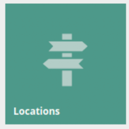
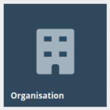
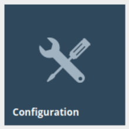

Locations are accessed using the Locations option, obtained via the
selection sequence shown at right starting from the Main Menu:

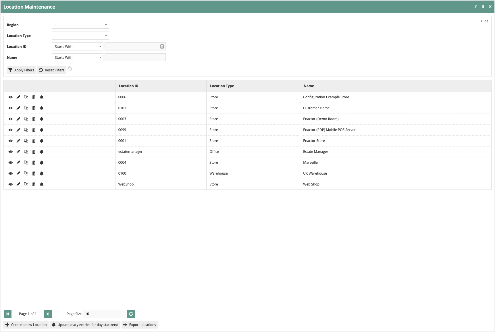

On the Location Maintenance page, select "Create a new Location".

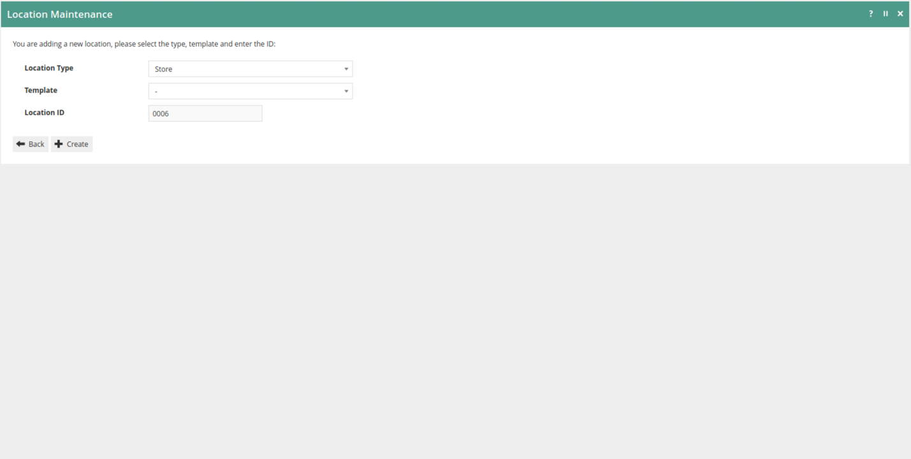

Select Store from the Location Type dropdown. Enter a unique Location ID
for this location. Note, the Location ID cannot be changed once the
Location has been created. Select Create.

Numerous tabs and sub-tabs are presented as part of Location
configuration. This guide is focused on the core Location aspects and
will cover the following: General, Address, Purging, Day End, Email,
Nearest Stores, Receipt, and Display.

The General tab has all the basic information that controls the store
behavior and identity.

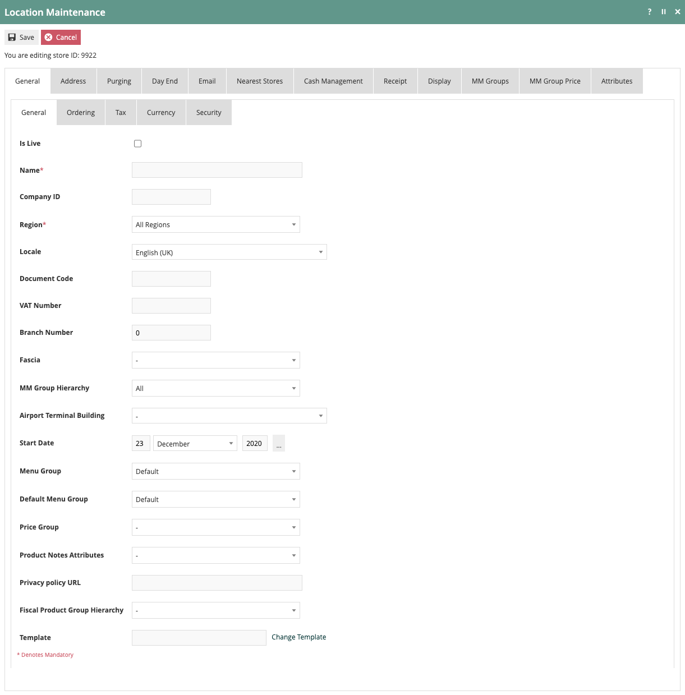

The Is Live checkbox specifies the location status. When checked, the
location is "live", "available for trading", or "active". This box
should be checked or ticked if the Store is transacting (sales or
inventory).

Give your location a name in the Name field. This could be the same as
the location ID or it could be the name of the store location. This name
will be shown on other configuration pages when referring to the
location so it must be conclusive and recognisable.

Select the appropriate Region from the Region groups. If the appropriate
Region does not appear, it must be created. Refer to the How to
configure a base Organisation Structure guide for assistance.

Select the Locale for this location. Locale will affect locale-dependent
operation in language, time zone, etc.

If you have VAT number, enter it in VAT Number. If you do not have a VAT
number, leave the field blank. The VAT Number is typically printed on
receipts and is included with the transaction data.

Set the Branch Number to the location ID.

Select the Merchandise Management Group that is appropriate for this
location from the MM Group Hierarchy. This will set the POS Rich Product
Search starting MM Group.

Enter the date when this location will go live in the Start Date field.

If this location has a specific menu that must be used, select the
appropriate Menu Group for this location. Otherwise, select Default.
Select the default menu group for the organisation from the Default Menu
Group dropdown.

Select the appropriate Price Group from the dropdown for the location.
Price Group is used for the valuation of purchase orders, stock
transfers, and orders. If the appropriate Price Group does not exist it
must be created. Refer to the How to configure a base Organisation
Structure guide for assistance.

The ordering Sub-tab handles configuration for the customer orders
functionality.

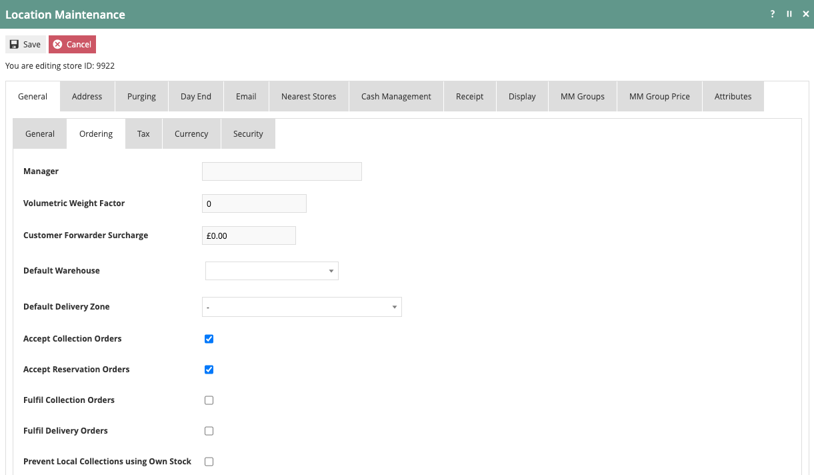

When a location Accepts Collection Orders or Accepts Reservation Orders,
the location will be providing the stock for the order. Normally these
functions are done at a warehouse.

When a location Fulfills Delivery Orders, the location is handling the
carrier (UPS, FedEx, Post, etc) or courier handoff for delivery to the
customer. This could be done at a warehouse or at a store location.

When a location Fulfills Collection Orders, the location will be
handling the final step in the order process with a customer. Normally
this is done at a store.

The Default Warehouse will be used to route orders from this location.
Select the UK Warehouse.

If this location should not use its own stock to fulfill orders, check
the Prevent Location Collections using Own Stock to require orders to be
fulfilled from another location. Otherwise. This is often done if store
stocking levels do not account for sales from other channels.

The Tax sub-tab captures Tax parameters applicable at the Location. Tax
configuration is handled in a different guide.

The General-Currency sub-tab is only used when there are multiple
locations with different base currencies. If all stores have the same
base currency, the data on this sub-tab does not need to be set.

The Address Tab provides two Sub-Tabs to capture the Address and Contact
Details of the Location. These fields are used in receipt printing,
supplying Store Locations in web inquiry, etc.

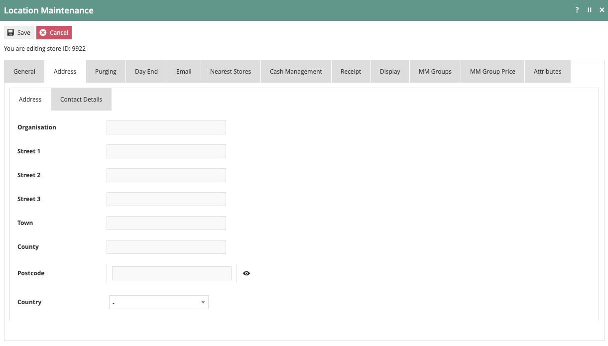

The Location Address properties are Organisation, Street Address, Town,
County, Postcode and Country. The Contact Details sub-tab captures Phone
Numbers, a Fax Number and Email Address.

The Purging tab contains the rules for removing old data from the system
that is no longer needed. Purging can remove 2 different types of data
from the system: directories in the filesystem and data entities in the
local database.

Directory purging is based on age in days since the file was last
modified. Directories can be absolute or relative based on the ENACTOR
HOME environment variable. A common setting for the "Default Directory
Purge Age (days)" is 90 days.

The logs and the updates directories can generate a lot of data, so it
is recommended to specify a more aggressive Purging guidelines. These
directories are commonly set for a 45-day Purge Age as shown below.

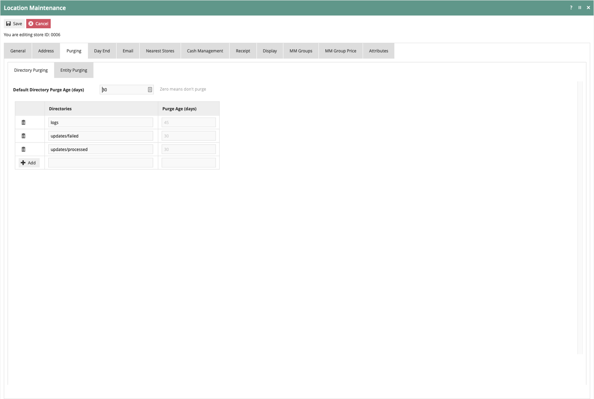

Entities in the database can be purged based on age.

A "Default Purge Age (days)" of 365 days will keep entity data in the
database for 1 year. This is a common setting but may vary with your
retailer's business requirements. Specific tables can be set other
values if needed. In this guide we will just set the default for all
tables.

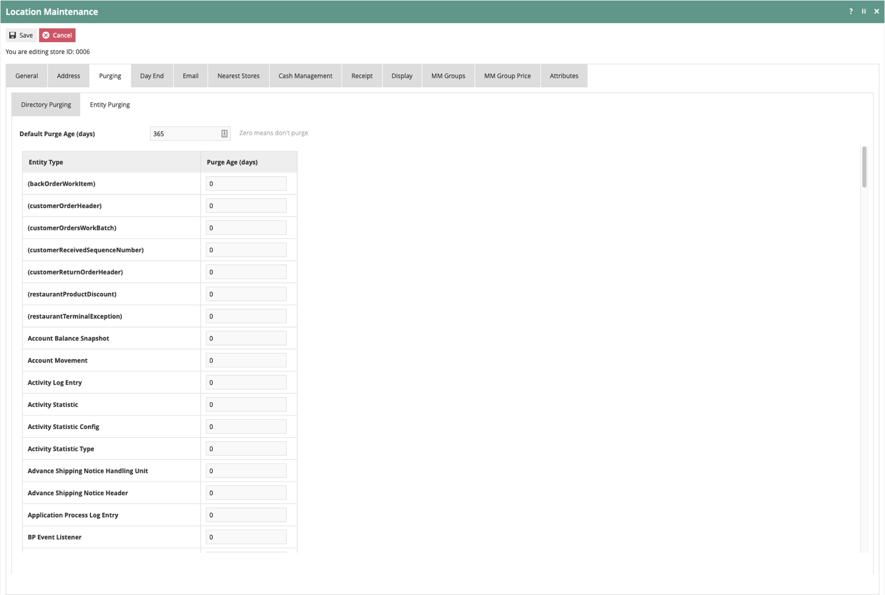

The Day End tab allows configuration of the normal Day Start and Day End
processing. These processes can be manual or automated. Users who will
manually initiate Day Start or Day End will need user role permission.

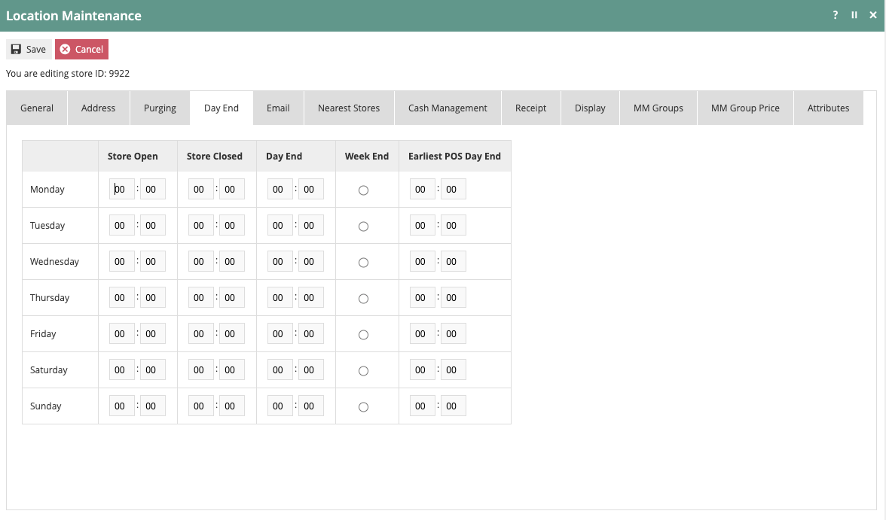

The Store Open and Store Closed times should be entered for each day of
the week. Additionally, the time that a normal Day End should occur
should be specified for each day of the week. The day of the week that
represents the last day of the retailer's business week is selected in
the "Week End" column.

The Email Tab captures information about the location's email server.
The applications that send email will use this information to connect to
the email server. The necessary settings will typically be provided by
the retailer's IT organization.

If the support team has an email for collecting alerts, enter that email
in Support Email Address.

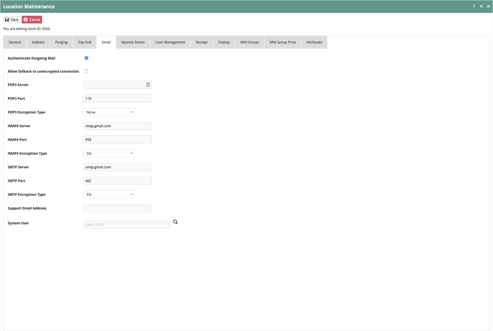

The Nearest Stores tab permits the pre-selection of locations that the
POS will use in the Rich Product Search and other functionality to
identify other locations that may be helpful during a customer
transaction.

Use the "Store" dropdown to select the appropriate locations and select
"Add". Repeat the process as necessary. The Arrows can be used to
reorder the list into a meaningful priority.

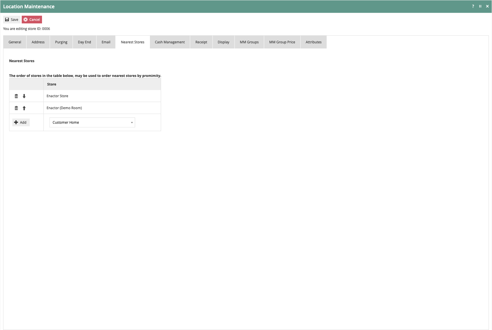

The Cash Management tab provides the necessary settings to configure the
appropriate Cash Management settings for the location. The configuration
of Cash Management is covered in a separate How-To guide.

The Receipt tab allows location specific information to be added to
Receipts. Use this tab to specify the Receipt Header Lines, Receipt
Trailer Lines, the Receipt Header Logo, and/or a Receipt Trailer Logo.

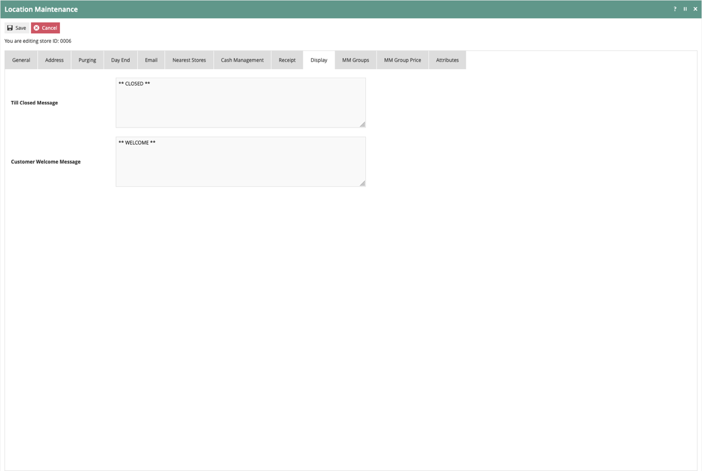

After entering the Receipt Header Lines and the Receipt Trailer Lines,
the text can be formatted further by selecting Header Lines Centered or
Trailer Lines Centered.

If a Receipt Header or Receipt Trailer Logo has been uploaded, it can be
selected. A preview of the Logo is also provided as confirmation. For
more information on uploading Receipt Logos, please refer to the How-To
guide covering Media Management.

The Display tab is used only if customer-facing line displays are in
use. If the location has deployed terminals with line displays, the Till
Closed Message and Customer Welcome Message is defined here.

The information on the preceding pages represents the common Location
configuration items when setting up a New Store. At this time, the
Location can be saved, and Device configuration can begin.

## Device Configuration

All endpoints are of a specific type and need a unique device ID.
Examples includes point of sale devices, mobile devices, inventory
handheld terminals, and servers. Any device that will connect to the
Enactor system needs a device type and a unique device ID.

Devices can be of different types. The specific device type is used by
the process connection diagram to determine which endpoint to use.
Defining a new device type is not covered in this guide.

Devices are accessed using the Locations option, obtained via the
selection sequence shown at right starting from the Main Menu:

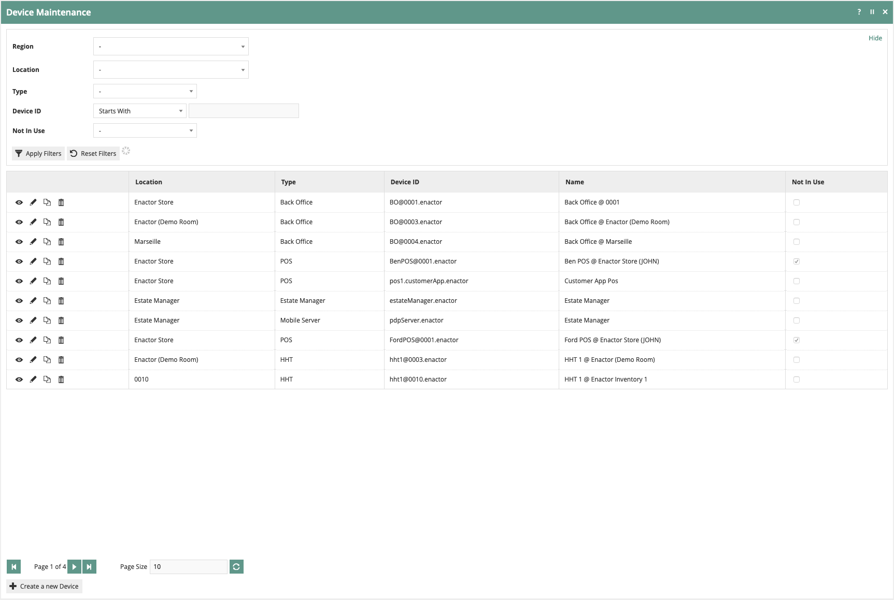

To create a new Device, On the Device Maintenance page, select Create a
new Device.

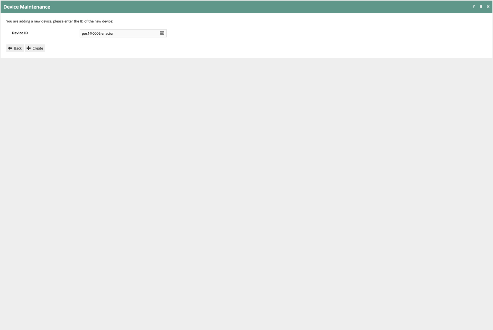

Each Device must be assigned a unique Device ID. It is recommended to
work with the retailer to establish a naming convention that can be
easily replicated across the entire estate. The Device ID should contain
sufficient information to convey what it is, how it is used and where it
is deployed. As in the example shown above, the Device ID has been set
to pos1@0006.enactor. From this Device ID, it can be known that this is
a POS terminal which is identified as terminal 1, deployed to location
0006 within the Enactor company/fascia. The convention used in this
example is:

\<device type\>\<device number\>@\<location\>.\<company/fascia\>

Select Create once the Device ID has been created. Once a Device has
been created, the Device ID cannot be changed.

On the Device Maintenance page, only the **General** sub-tab will be
populated in this guide.

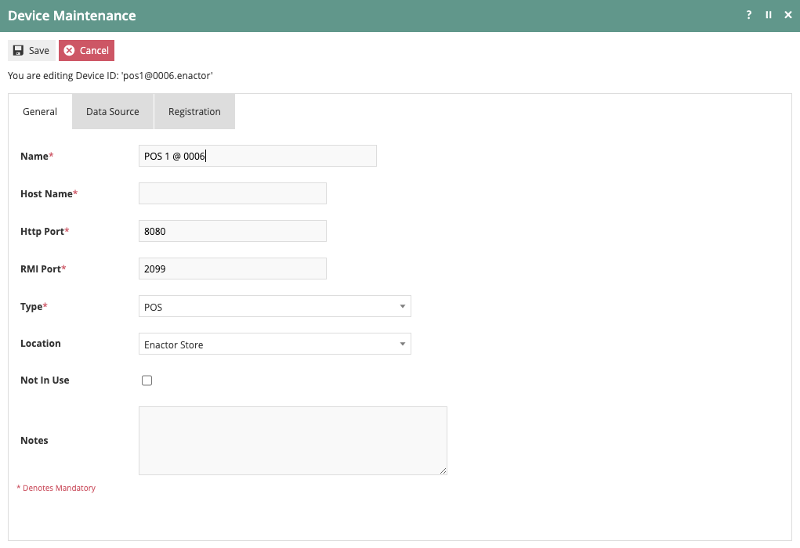

In the **Name** field, a Device Name must be specified. As with the
Device ID, the Name should be derived using a convention across the
estate. It is strongly suggested that the name should convey the device
type, terminal number or other identifier and deployed location. Often,
the Name will be a derivative of the Device ID as shown in the example
above. The Host Name entry is for remote connections to the device.
Enter "localhost" for Host Name**.** Select the appropriate Device Type
from the drop down. In the Location field, select the Location where
this Device will be deployed.

Select "Save" to complete the Device configuration.

## POS Terminal Configuration

POS Terminals are the workhorse of the commerce environment. Each POS
Terminal can have unique configuration to support the specific task that
the terminal will perform.

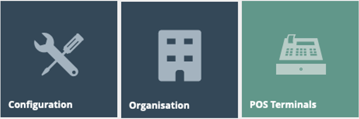

POS Terminals are accessed using the Locations option, obtained via the
selection sequence shown at right starting from the Main Menu:

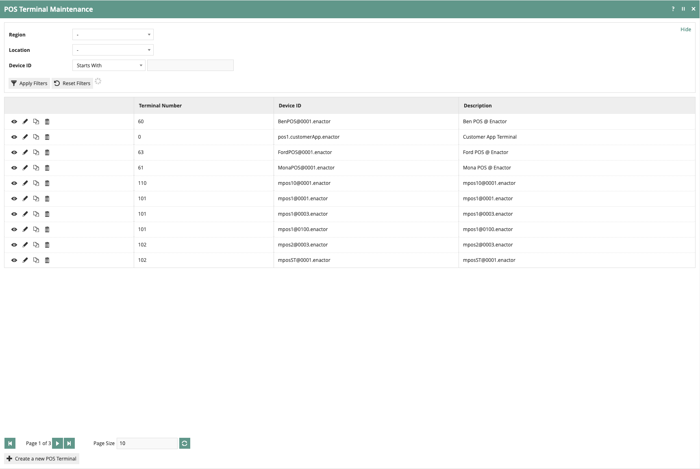

On the POS Terminal Maintenance page, select **Create a new POS
Terminal**.

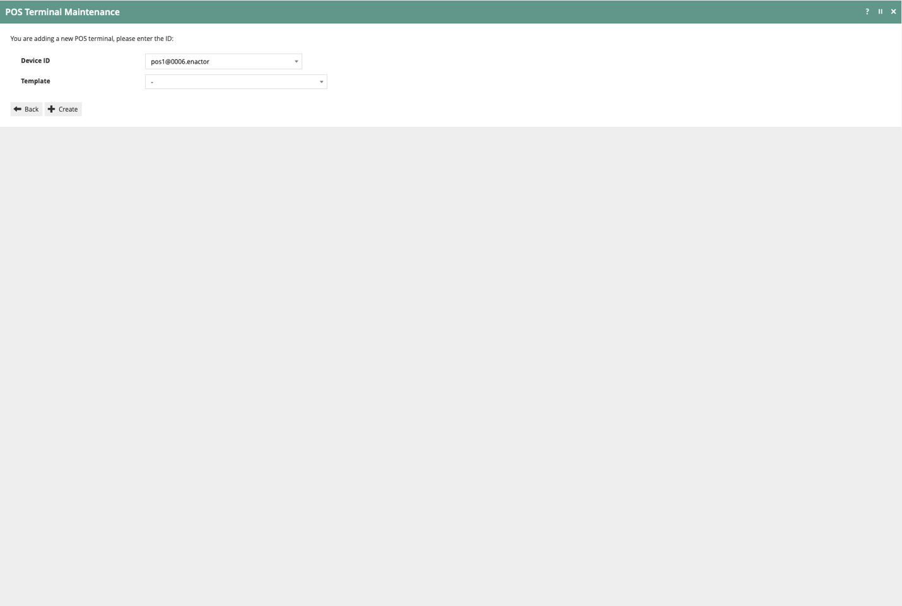

Only one Device ID can be associated to one POS Terminal. Only Device
ID's that have not already been associated with a POS terminal will be
presented. Select the **Device ID** for the new POS Terminal. The
creation and use of Templates for POS Terminal configuration is covered
in a separate How-to Guide. This document covers how to configure the
required and common settings manually. No selection should be made for
Template.

Select "Create".

On the POS Terminal Maintenance page, the **General, Peripherals,
Printing, Day Start, Day End,** **User Interface,** and **Loyalty**
sub-tabs will be populated in this guide.

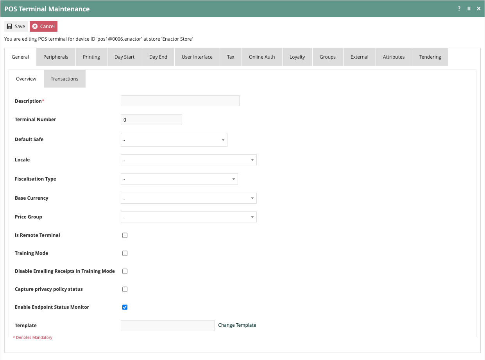

On the General tab, the **Description** of the POS Terminal must be
specified. As established previously with Device ID and Device Name, POS
Terminals are typically identified using a naming convention. The
recommended convention is the same as used for Device Name \<device
type\> \<device number\> @ \<location\>.

Each POS Terminal must have a Terminal Number assigned. The assigned
Terminal Number must be unique for the assigned location.

Many POS Terminal configuration settings can also be and are more
commonly made at the location level. This includes settings for Locale,
Fiscalisation Type, Base Currency, Price Group and others. If the
setting has been made at the Location level, they will automatically be
inherited at the POS Terminal level. It is only necessary to make these
settings at the POS Terminal if the Location setting needs to be
overridden for a particular terminal.

While only applicable if Email receipts are active, it is recommended to
Disable Emailing Receipts in Training Mode.

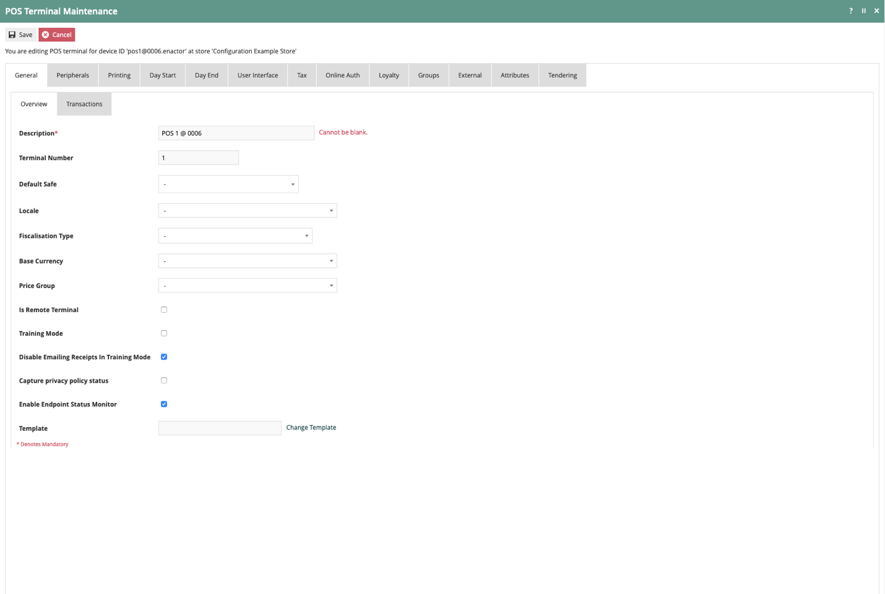

On the General -- Transactions sub-tab, select "Retail Sale" from the
Default Transaction Type dropdown.

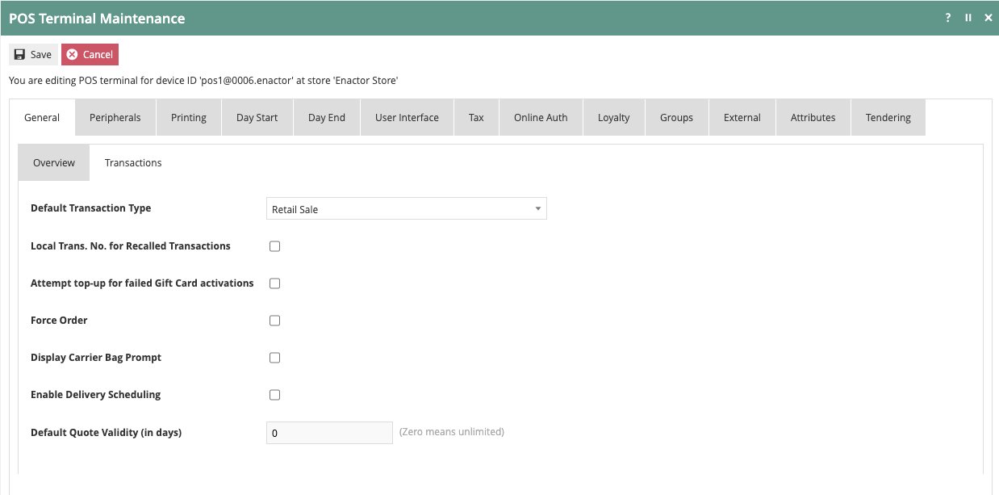

The Peripherals tab will specify the input and output devices for the
POS Terminal. The settings on this tab will be very specific to the
retailer's hardware environment and may be different from terminal to
terminal. For a basic test environment without physical peripherals
attached, a number of "simulated" peripherals can be used as shown.

The Peripherals Inputs sub-tab covers all of the input devices.

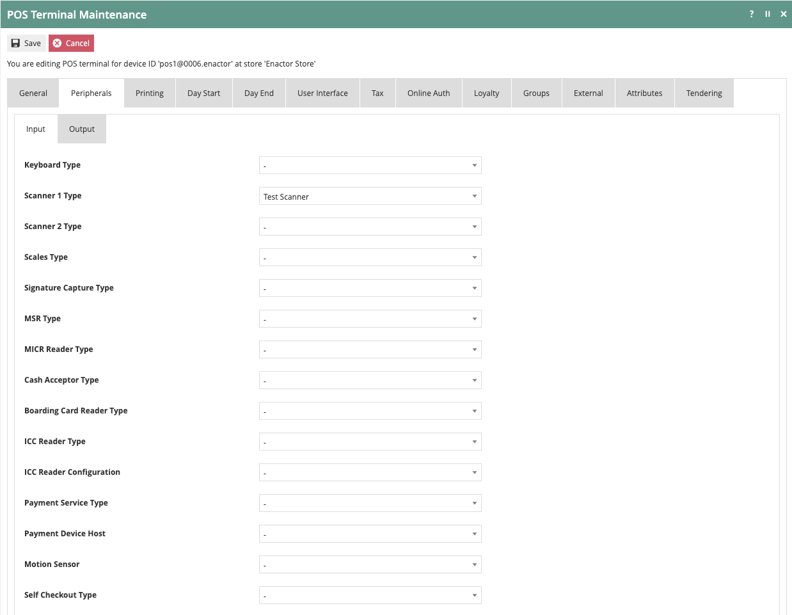

Select "Test Scanner" for Scanner 1 Type.

The Peripherals Outputs sub-tab covers all of the output devices.

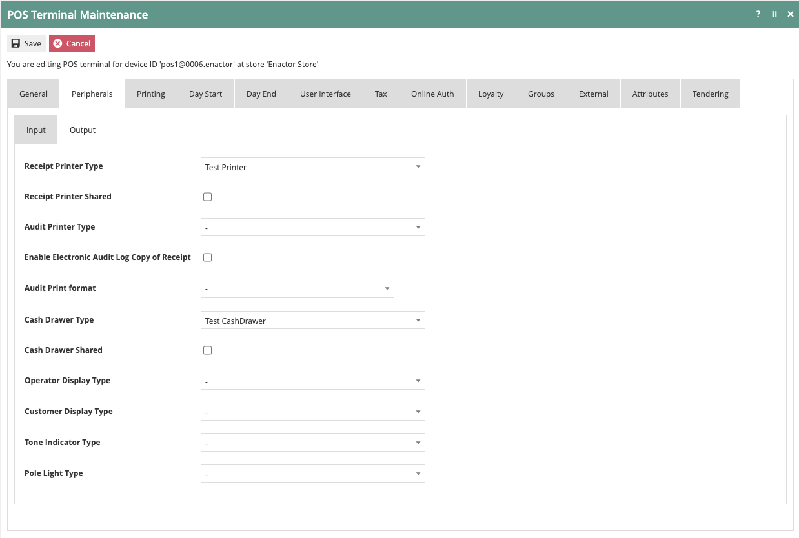

Select "Test Printer" for Receipt Printer Type.

Select "Test CashDrawer" for Cash Drawer Type.

The Printing sub-tab covers receipt selections for printed and email
receipts and reports.

Receipts are defined with a name and either a paper size or a column
width. Paper sizes are the standard laser printer sizes such as A4.
Retail receipt printers have a defined number of columns.

There are many receipt types and definitions. This guide will only cover
the basic printed customer receipt, receipt flags, and reports receipts.

On the Printing -- General sub-tab receipt formats are specified for
most transaction types. The settings shown assume the default receipt
formats are being used on a standard 48-column receipt printer.

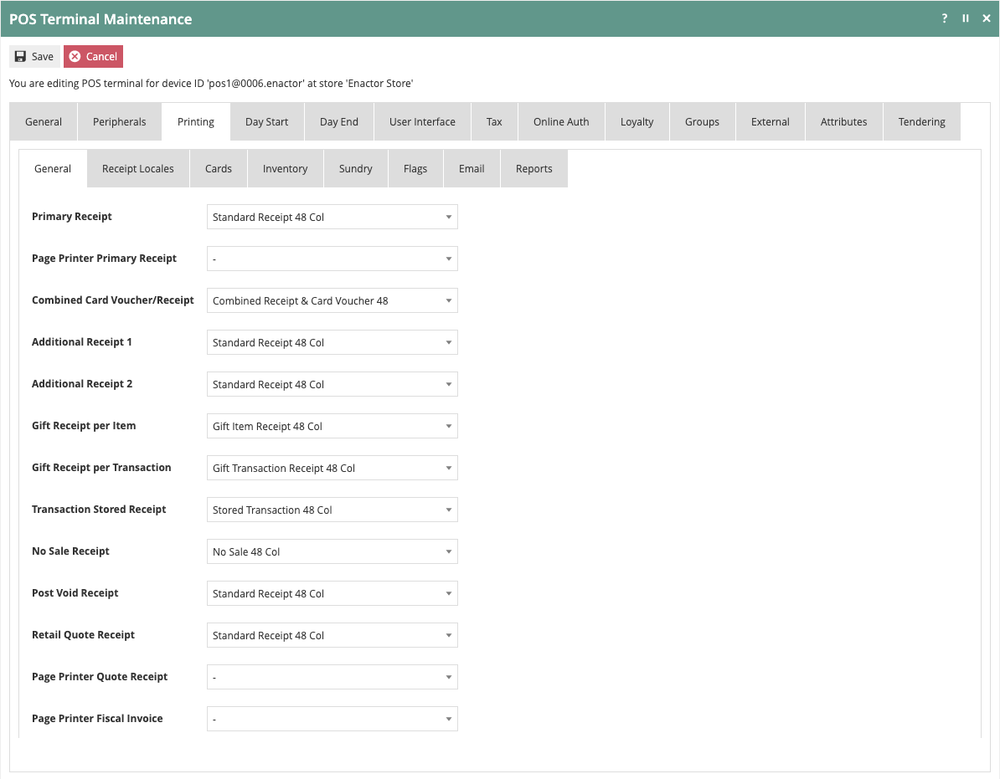

Select "Standard Receipt 48 Col" for Primary Receipt.

Select "Combined Receipt & Card Voucher 48" for Combined Card
Voucher/Receipt.

Select "Standard Receipt 48 Col" for Additional Receipt 1.

Select "Standard Receipt 48 Col" for Additional Receipt 2.

Select "Gift Item Receipt 48 Col" for Gift Receipt per Item.

Select "Gift Transaction Receipt 48 Col" for Gift Receipt per
Transaction.

Select "Stored Transaction 48 Col" for Transaction Store Receipt.

Select "No Sale 48 Col" for No Sale Receipt.

Select "Standard Receipt 48 Col" for Post Void Receipt.

Select "Standard Receipt 48 Col" for Retail Quote Receipt

On the Printing -- Flags sub-tab, additional printing parameters are
available. The most common options configured in this area include
"Print Tax Details on Receipt", "Offer to email the receipt" and "Offer
gift receipts".

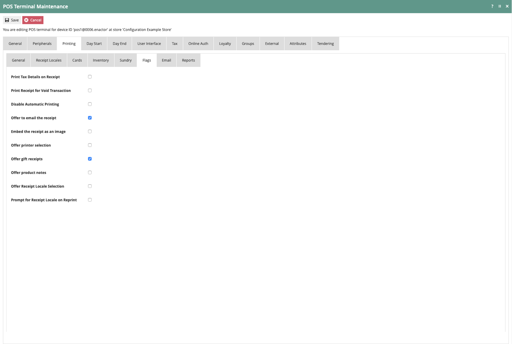

On the Printing -- Reports sub-tab receipt formats are specified for
most transaction types. The settings shown assume the default report
formats are being used on a standard 48-column receipt printer.

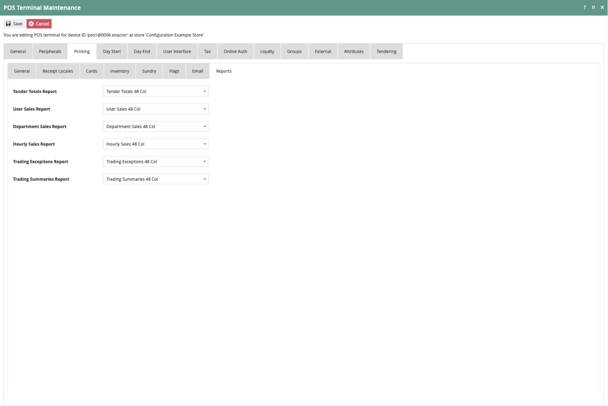

Select "Tender Totals 48 Col" for Tender Totals Report.

Select "User Sales 48 Col" for User Sales Report.

Select "Department Sales 48 Col" for Department Sales Report.

Select "Hourly Sales 48 Col" for Hourly Sales Report.

Select "Trading Exceptions 48 Col" for Trading Exceptions Report.

Select "Trading Summaries 48 Col" for Trading Summaries Report.

The Day Start and Day End tabs are covered in detail as part of the Cash
Management How-to Guide. The settings described below represent a
minimal, traditional Cash Management process. These settings will likely
be changed once reviewing the desired business process with the
retailer.

On the Day Start tab, select the Allow Sales option.

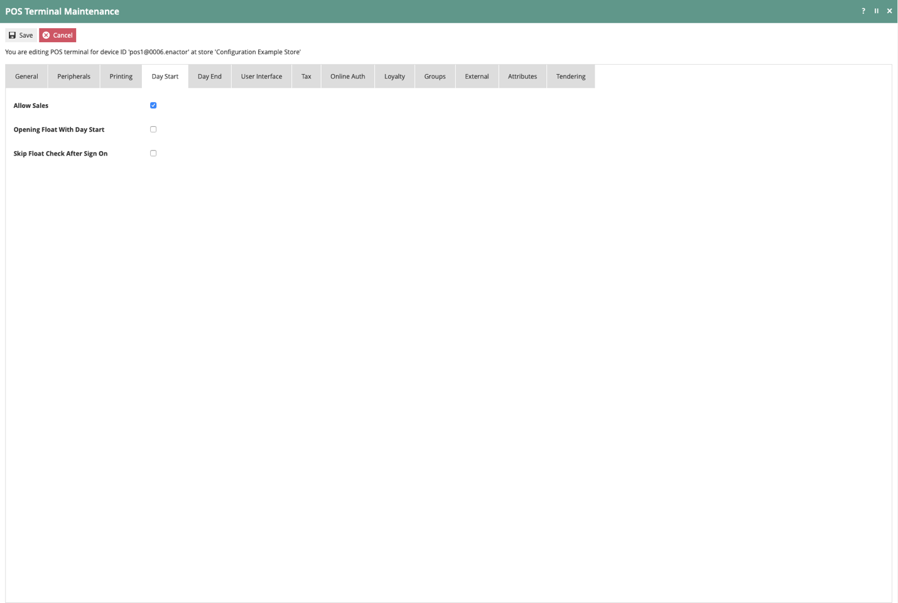

On the Day End tab, select the following oiptions:

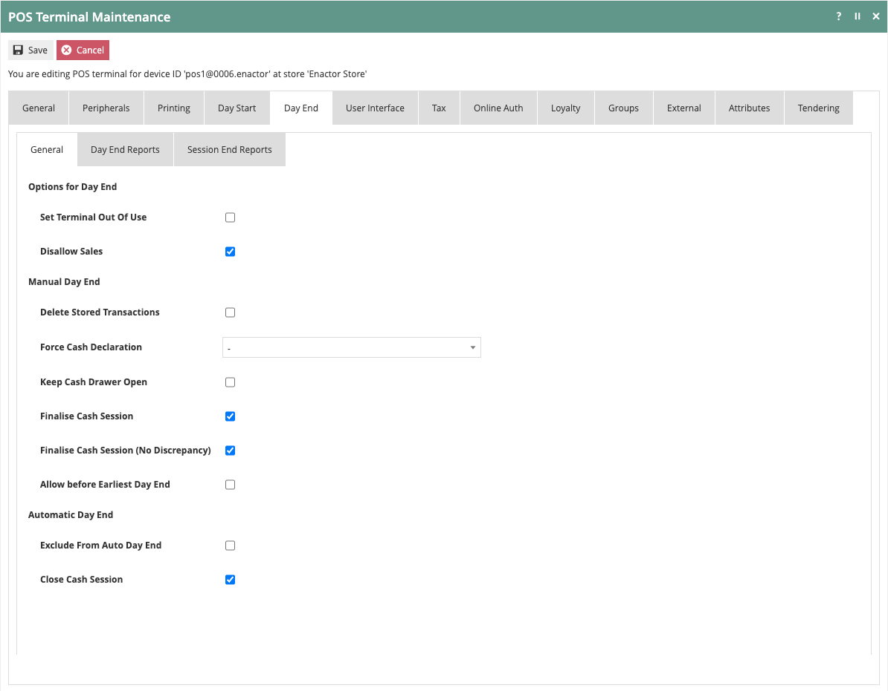

Select "Disallow Sales".

Select "Finalise Cash Session".

Select "Finalise Cash Session (No Discrepancy)".

Select "Close Cash Session".

Details on these settings, how they impact business processes and other
settings available can be found in the Cash Management How-to Guide.

The User Interface settings specify the look and feel, color schemes,
branding, and screen layouts. A retailer will frequently take the
opportunity to apply a certain amount of branding to the default UI.
That process is covered in the How-to Guide on POS Themes and Styles.
This guide covers only how to select those items in terms of POS
Terminal configuration.

The User Interface -- General sub-tab contains core settings about the
information being displayed.

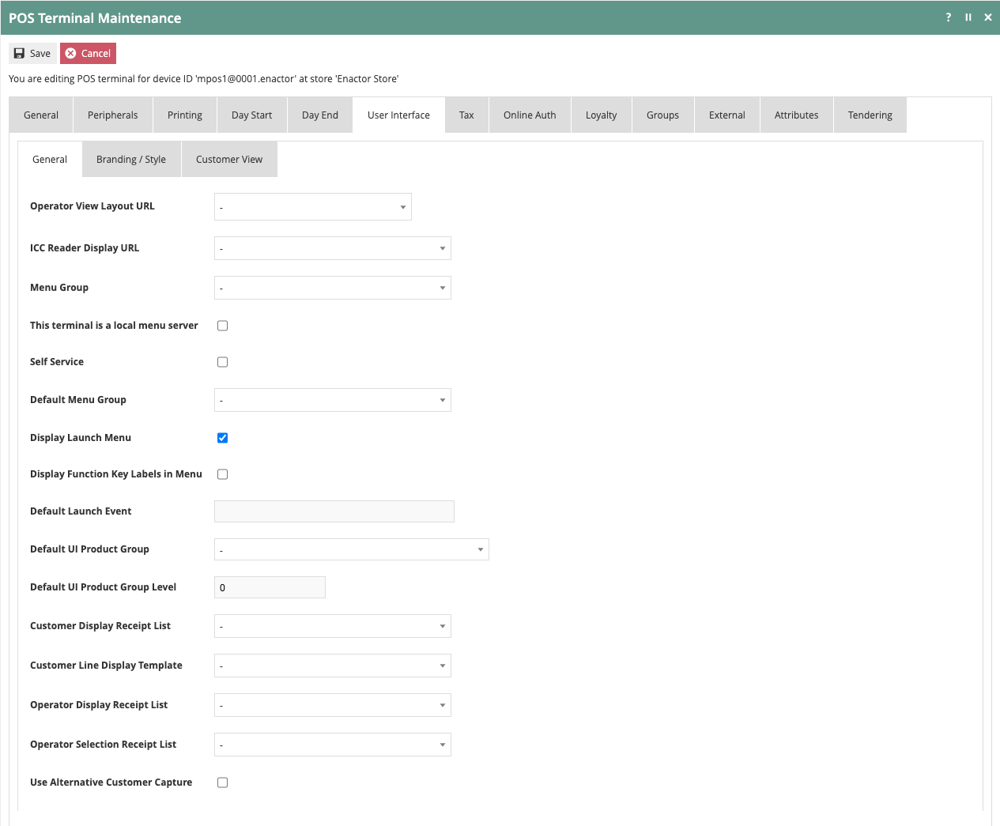

Assuming the default UI is being used, very few selections will need to
be made on the General sub-tab. The most common settings include
overriding the Menu Group specified at the location level and enabling
the Display Launch Menu option. If the Launch Menu is active, the user
will be presented with a choice of applications once signing into POS.

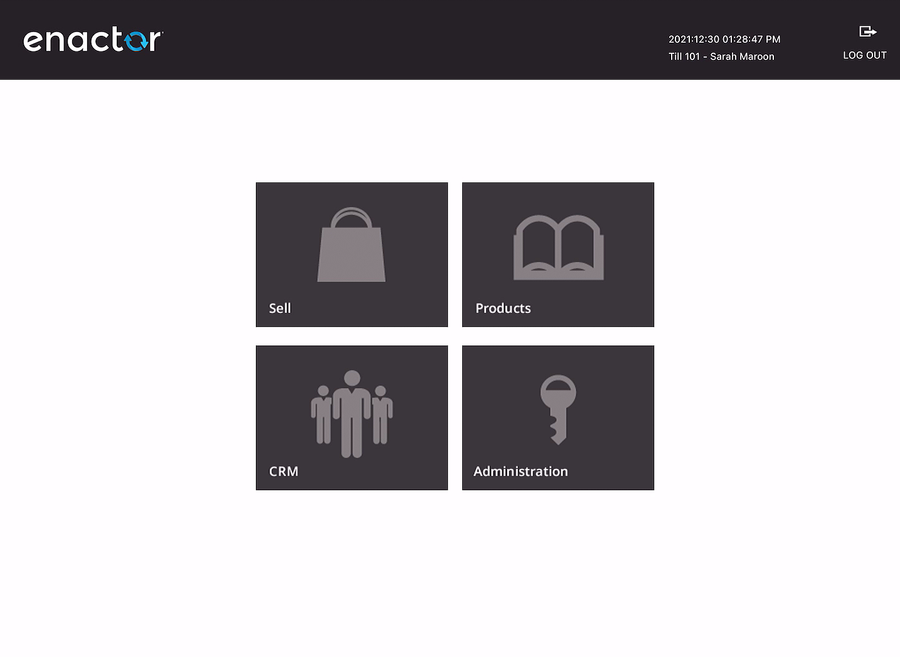

On the Branding/Style sub-tab, the components necessary to present the
user with a branded experience are selected.

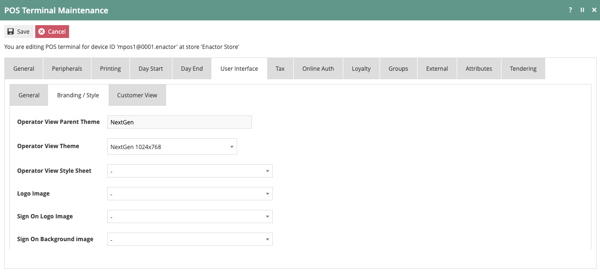

The settings above represent the 'out of the box' Enactor retail theme.
Customized themes for retailers may be selected as an Operator View
Theme or through specifying Operator View Style Sheets in conjunction
with additional Logos and Images. Additional information on the creation
of Themes and Styles can be found in the How-to Guide on POS Themes and
Styles.

On the User Interface -- Customer View sub-tab settings are available to
configure a customer facing monitor.

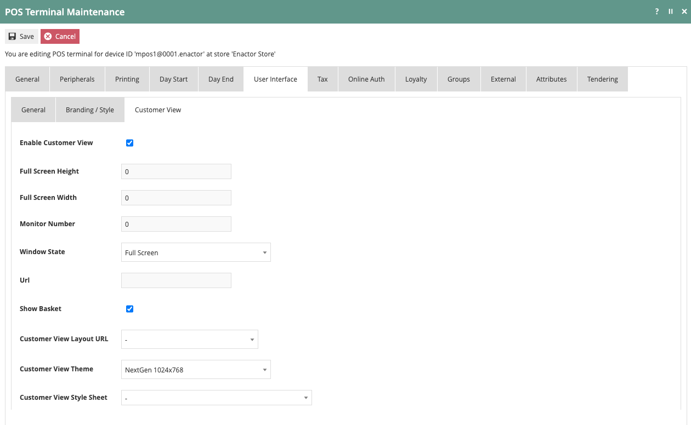

The Customer View sub-tab is used when the retailer uses a separate
customer facing display. As with the Operator View discussed previously,
the Customer View will also have a theme and/or Style Sheet applied to
present the information in the context of the retailer's branding.

The following information only applies if the retailer offers a Loyalty
programme. Configuration of Loyalty Schemes and Loyalty Tiers is covered
in a separate How-to Guide. Once a Loyalty programme has been
configured, additional configuration at the terminal is not required.
However, there are settings on the Loyalty -- Loyalty sub-tab that are
often changed.

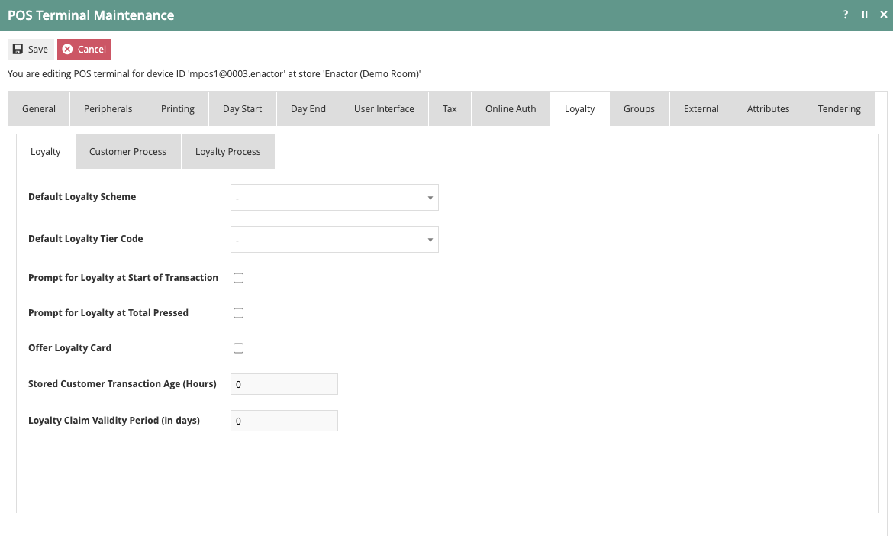

By selecting either "Prompt for Loyalty at Start of Transaction" or
"Prompt for Loyalty at Total Pressed" the user will be prompted to ask
the customer for their Loyalty information at the appropriate point in
the transaction. If both options are selected, the prompt will be
triggered at the beginning of the transaction and again at the end if no
customer information was captured on the first prompt. Loyalty
information can be captured at any point of the transaction regardless
of the settings for these options. Additionally, "Offer Loyalty Card"
will prompt the user to sign the customer up for a Loyalty program upon
pressing total if no Loyalty information has been collected previously
in the transaction.

This completes the exercise of manually completing a simple POS
configuration involving the most common settings. Selecting "Save" will
complete the configuration. Refer to the How-to Guide on broadcasting
Configuration Data to distribute the changes to the estate. Also, with
the base understanding of how Location and POS Terminal configuration is
completed, please review the How-to Guides on Templates for a better
understanding on how Location and POS Terminal Configuration can be
managed more easily and efficiently in a large and complex estate.
