# Configuring Tender Types
# Introduction

The purpose of this guide is to show how to configure Tender Types (i.e.
Payment Methods) on the Enactor Estate Manager and POS.

Tender Type configuration is used to set up the behaviours and business
rules for how different payment methods will operate at the Point of
Sale, and in the Back Office (Store Server or Estate Manager).

Most of the Tender settings are common to all the various tender types.
However some tender types (e.g. Cash) have additional settings. This
guide will cover these at the end.

Dependent on the tender type, there may be other entities that also need
to be set up. These are covered in other specific guides (e.g. Card
Payments, Gift Cards,

## Overview

This guide will cover the Tender Type configuration settings, covering
each tab of the Tender maintenance utility in the Estate Manager:

-   General

-   Restrictions 1

-   Restrictions 2

-   Discount Restrictions

-   Overlap Tenders

-   User Limits

-   Cash Management

-   Change

-   Surcharge

-   Attributes

It will then cover the specific settings for the following main tender
types:

-   Cash Tender

-   Card Tender

-   Cheque Tender
n a
# Prerequisites

## Resources

Before starting, you should have the following resources in place:

-   Enactor Estate Manager

-   Enactor POS (configured within the UK Region, connected to the
    Estate Manager)

-   Standard Configuration, including:

    -   Base Configuration

    -   UK Retail (I have used UK in this example, but it could be other
        regional config packs)

    -   Retail Segment pack (I have used UK Fashion here).

## Prior Training/Experience

You should be familiar with the following:

-   Estate Manager configuration

-   Enactor configuration concepts, including Locations, POS Terminals
    etc.

-   Data broadcasting

-   Standard POS Sales processes

If necessary, please revise the appropriate how-to guides on these
concepts before starting the Email Receipt configuration process.

# Configuration Steps

## General Tender Configuration

To access the Tender Maintenance utility in the Estate Manager, navigate
to *Configuration -- Financial --* Tenders or search for Tenders.

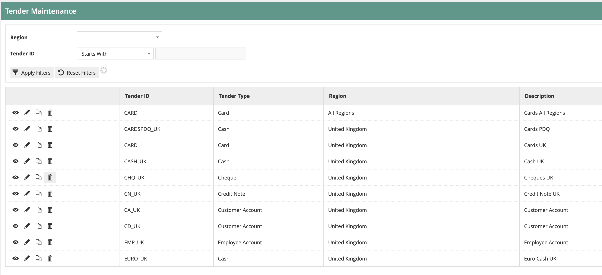

Initially you will be presented with the normal selection screen.

When you create a new tender, you will be asked to provide a Region, a
Tender Type and a Tender ID:

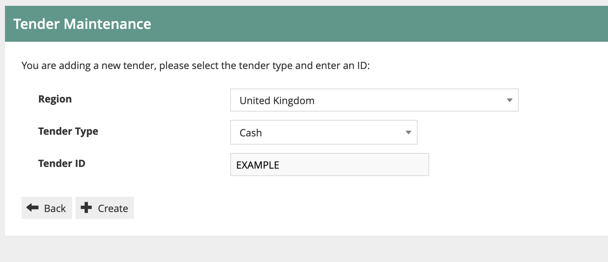

Tenders are normally managed regionally (e.g. by country) as currency
and other local compliance rules often need to be applied. For the
purposes of this document we will be setting up tenders for the United
Kingdom region. Tenders configured at a higher region in the hierarchy
will be available to stores in lower-level regions.

Tender Type sets up the basic rules for the Tender (e.g. Cash, Card,
Cheque, Gift Card). A retailer may use multiple Cash Tenders, for
example: if the retailer accepts GBP cash, plus two other currencies,
they would have three cash tenders in total. If in doubt, the Cash
tender tends to be the simplest, so should be the base Tender type used
if it is not obvious.

Once the basic details have been entered (Or if you are editing an
existing Tender Type), the full set of Tabs is displayed:

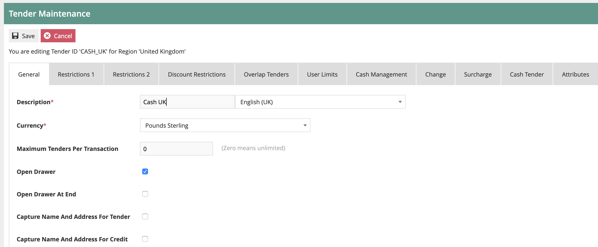

We will now start configuring the key elements on each Tab:

## General Tab

This is used for the main information and settings for the tender type.

**Description**: this will appear on screen and on the customer's
receipt to describe the payment method. Different descriptions can be
set for each language.

**Currency**: this is the currency applied for the tender type. If this
is different from the Store currency, then an exchange translation will
be applied.

**Maximum Tenders**: if used, this will restrict how many payments for
this tender type can be used in a transaction. It is only normally only
used for Card Tenders (where the acquirer may limit to e.g. 3 tenders
per transaction).

**Open Drawer (At end)**: this is used to fire the cash drawer when the
tender is taken. It is used for cash and other tenders that need to be
stored securely. If the "Open Drawer at end" option is used, the drawer
will only fire once the transaction has been fully tendered.

The remaining settings are less frequently used. The Capture Name &
Address and reference number number settings can be used if additional
data capture is required. The franking rules are used for documents that
need to be printed (e.g. cheques) which is rarely used today.

## Restrictions 1 Tab

This tab holds the main restrictions for how the tender type may be used
for payments and refunds.

Note: there are references to "Debits" and "Credits". In this context,
"Debit" means accepting a payment from a customer (e.g. a sale) and
"Credit" means paying money to a customer (e.g. a refund).

For Debits and Credits, there are settings as follows:

**Debits/Credits allowed**: this indicates that the tender type may be
used for both debits and credits. For example, some tenders may not be
used for making payments out (Credits).

**Debit/Credit tendering restrictions**: this is a very key setting. It
indicates how the tender type may be used in relation to the balance of
the transaction (by **balance** we mean the remaining transaction value
to be paid/refunded):

-   None -- there are no restrictions; the tender may be used for part
    of the transaction balance, for the full balance, or for more than
    the balance (e.g. Cash, where the customer may pay more than the
    balance of the transaction, and receive change in return).

-   Amount less than or equal to balance -- the tender may only be used
    up to the transaction balance, not exceeding it.

-   Amount must equal balance -- cannot be used for over tendering or
    under tendering

-   Amount less than next currency unit -- rarely used

-   Amount must equal transaction total - cannot be used for over
    tendering or under tendering, and must be the tender used for the
    entire transaction.

**Debit/Credit Limit** -- this is the maximum and value that can be used
for this tender. It may be overridden by using User Limits (See below).

The remaining rules apply irrespective of debit/credit.

**Aggregate Limits** -- indicates that where there are multiple tenders
for the same tender type on the transaction, they should be added
together to check whether the maximum value limit is reached.

**Minimum Limit** -- a minimum value for the tender. Rarely used.

**Force Amount Entered/Prompt with Amount Due/Force Amount Due**: these
settings are used to control whether/how the POS prompts the user to
enter the value to be used for the tender:

-   Force Amount entered: the user must enter a value.

-   Prompt with amount due: the POS will prompt the user to enter an
    amount (and pre-fill the field with the remaining transaction
    balance).

-   Force Amount Due: the POS will automatically apply the tender to the
    remaining balance due and the user will not be able to change the
    amount (unless they enter it manually before choosing the tender).

**Minimum Transaction value** -- only allows use of the tender if the
transaction is over a certain value.

**Transaction Tender Limit** -- this is used normally for enforcing
money laundering rules. Any tenders with this flag set are added
together, and if the total exceeds the Transaction Tender Limit value
(Set on the POS Terminal -- Tendering tab), then there is an alert and
an authorised user needs to complete the transaction. Only normally used
in retailers with very high transaction values.

**Enable Promotion Check** -- this allows the POS to check whether the
tender type is included in any promotion rules. If tender-based
promotions are not used, it should be disabled as it will avoid
unnecessary checks.

The rounding rules and minimum denomination rules are required for
jurisdictions (e.g. Belgium, Sweden) where some small-value Denominations are not accepted. For example for Belgium the smallest
accepted cash denomination is 5 cents. Debit/Credit payments should be
set to be rounded up/down (according to the applicable rules) as
required.

**Tax refund eligible** -- indicates that if this payment is used, and
the transaction meets the other requirements, the customer will be
offered the opportuinity to receive a tax (e.g. VAT) refund.

## Restrictions 2 Tab

There are two key settings on this tab:

**Debit/Credit effect on Loyalty Points**: this allows the application
to give additional/remove points for payments (or part payments) using
this tender. For example, you might set the Loyalty redemption tender so
that it removes loyalty points from the transaction. This will avoid the
possibility of customers "doubling up" on points when spending their
redemption. Use of this will depend on the Loyalty programme policies.

**Return Tenders**: this is used to control which tender type(s) may be
used when refunding transactions that were paid for with this tender.
For example, when configuring the Cash tender, the retailer may choose
to allow refunds in Cash, via Credit Note or Gift Card. When more than
one possible return tender is used, the order may be altered using the
arrows:

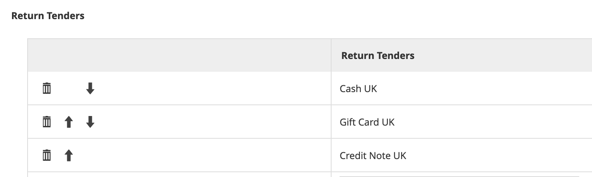

If no return tenders are configured, then the full list of tenders for
the region will be offered to the user for a with-receipt return.

Note that these rules may be overridden dependent on the return reason
code used, and the user may have privileges that allow then to skip the
refund tender list and choose their own.

## Discount Restrictions Tab

The settings on this tab may be used to disallow the use of the tender
type if there are manual or automated promotional discounts from applied
to the transaction.

The disallow all discounts/disallow all promotions checkboxes will
prevent the use of the tender for manual/automated discounts
respectively.

The drop downs may be used to select authorisation codes that will
provide the user with the authority to override the tender prevention
(for details on authorisation codes, refer to the "How to Configure
Users, User Roles and User Templates" document.

## Overlap Tenders

This is used to allow/disallow the use of certain combinations of tender
types within a single transaction. For example, the retailer may wish to
prevent the use of multiple Payment Card tenders within a single
transaction. These settings tend to be used only rarely in production
environments.

Any overlap tenders added to the list will then be allowed should the
user select them, having already added at least one instance of the
current tender type to the transaction.

A function authorisation code may be assigned to allow users who have
that privilege to override the overlap rule if required.

**Note**: if no overlap tenders are maintained (which is the default)
then all tenders are allowed to be overlapped with each other.

## User Limits

The user limits tabs allow use of Function Authorisation codes to set up
user levels with different value limits for payments (Debits) and
refunds (Credits).

For example, a retailer may wish to allow most shopfloor users to accept
cash up to a value of £10,000. Only "High Value Team" users with a
special Function Authorisation code will be allowed to accept cash
values above that limit.

This would be set up with rules similar to the below:

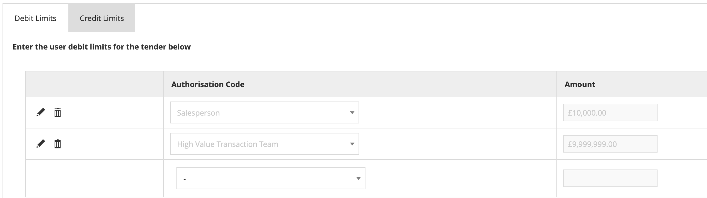

Most users will have the "Salesperson" Function authorisation code
assigned, so they can take cash payments up to £10,000; members of the
"High Value Transaction" team will be able to take cash payments up to
£9,999,999.

By setting Credit limits, refunds can be controlled in a similar way.

**Note**: if you set any rules for Tender User limits, then all users
must have an authorisation code that is included on the list. If they do
not, they will be unable to take payment/refund with that tender at all.
Tender User Limits will override the values set in the "Restrictions 1"
tab.

## Cash Management Tab

The detailed information on how to configure Cash Management is covered
in the guide "How to configure Terminal Cash up and Empty".

Here we will cover the key settings included on the Cash Management tab
for the tender. Most of the settings are checkboxes that indicate
whether the tender type should be included in the specified cash
management processes:

**Banking Tender** -- indicates that the tender type should be included
when transferring cash to bank. This would be true for tenders such as
cash, payment cards and cheques; it would be false for internal tenders
such as Gift Cards.

**Auto Banked** -- this means the tender will be automatically
considered to be banked as soon as it is processed. This is used for
electronic tenders such as payment cards

**Include in Safe Limit Check** -- Store safes may have an insured value
limit applied. If this flag is ticked, then this tender is considered to
be part of that limit. Should be enabled for all public tenders such as
cash etc.

**Cashup Tender** -- this tender type is included in cash up (Counting
and reconciliation) processes.

**Currency Purchase Tender** - indicates that the tender type should be
included when transferring cash from bank to the store.

**Float Tender** -- this tender type is included in float activities
(transferring funds from safe to cashdrawer). Used for tenders that form
part of the cashdrawer float, usually just cash.

**Pickup Tender** -- this tender type is included in pickup activities
(transferring funds from cashdrawer to safe).

**Auto Picked Up** - this means the tender will be automatically
considered to be picked up as soon as it is captured at the POS.

**Spot Check Tender** -- this tender type is included in spot checks (ad
hoc checks to compare the cash drawer/safe total with the system total).

**Enter by Quantity** -- when counting this tender, the values are
entered as quantities rather than the financial value; normally used in
combination with "Enter by Denomination" below.

**Enter by Denomination** -- when counting this tender, values are
entered for each denomination for the currency. This simplifies counting
of funds such as cash where many denominations may be held in the
cashdrawer.

**Allow Negative Cashup Value** -- negative cashup values are usually
only applicable for electronic tenders issued at the POS, e.g. Credit
Notes; normally disallowed.

**Tracked Item** -- indicates that each of these items is individually
tracked (e.g. Gift Vouchers). When cashed up, these items will be
checked off individually.

**Safe/Terminal Discrepancy Thresholds** -- if set, the cashup process
will check any discrepancy value (difference between counted and
expected values) against the threshold limit; if the discrepancy exceeds
the threshold, the user will be alerted, and either a recount will be
required, or a privileged user may override the alert.

**Maximum Amount** - limits the amount that may be entered for the value
of this Tender in Cash Management operations.

## Change Tab

Change settings are used to control whether/how change may be returned
to the customer when they pay more than the transaction balance with
this tender type.

**Assign Change to Over Payment** -- if this flag is set, then no change
will be returned to the customer. Any excess payment by the customer
will be treated as an "over payment" so will be retained by the
retailer. If desired, a reason code may be assigned so that the over
payment can be treated appropriately by external systems (e.g. to credit
the payment to an appropriate GL account). If "over payment" is set then
the other Change Tender settings will be disabled.

**Change Tender** -- if set, this will return any change in the selected
tender. For example, we may accept payment by a foreign currency tender,
but change is always given using the main cash tender. If not set,
change is returned in the same tender type as the payment.

**Change Limit** -- this sets the maximum value of change that may be
returned. For example, a maximum change value of £5.00 might be set for
Gift Voucher tenders.

**Change Minimum Limit** -- this sets the minimum value of change to be
returned.

**Secondary Change Tender --** if the calculated change value exceeds
the maximum/is lower than the minimum limit set for the tender, then a
secondary change tender will be applied. For example, using the Gift
Voucher tender that is set to return a maximum value of £5.00 in cash,
if more than £5.00 change is due, this may be set to be returned using a
Gift Card tender.

**Secondary Change/Minimum Change Limits** -- as for the primary limits
above. If the change is outside these limits too, then any remaining
excess would be treated as overpayment.

**Credit Change Tender** -- this sets the tender type to be used if
Change is given on refunds (credits). This is rarely used.

## Surcharge Tab

This is used to configure a surcharge to be applied on the transaction
if this payment is used. The surcharge may be a fixed fee or a % of the
tender value. The surcharge may be applied only on tenders over a
minimum/up to a maximum value.

This setting is rarely used.

## Attributes Tab

Attributes are freeform data values that may be freely assigned to the
Tender type. Attribute data structures may be configured using the
Attribute/Option Set configuration utility.

Once the data structure(s) have been configured, data component(s) may
then be configured for the chosen tender type.

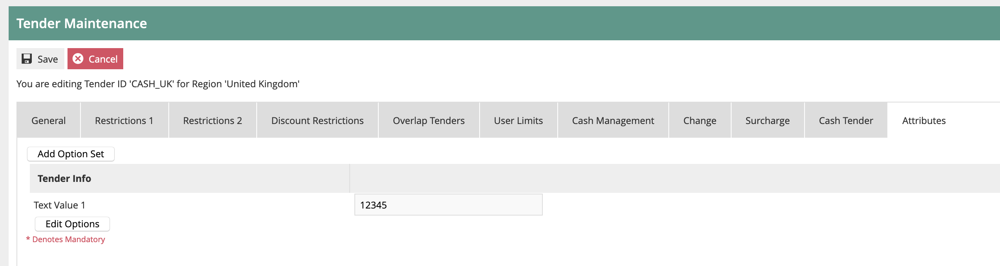

Attribute data has no impact on standard Enactor functionality.

However, the data can be included on the transaction data that is
exported from the Estate Manager. This data can then be used by external
applications.

## Tender Specific Configurations

Some tender types have specific data components. The key ones are
provided below:

### Cash Tender

This has one data element -- Drawer Limit. This specifies the maximum
value of this tender that is expected to be held in shopfloor cash
drawers.

If this value is exceeded on a POS, then the users will receive alerts.
The user may then ignore that alert and carry on taking sales, but the
alert will return every few minutes, until a Pickup is carried out. Once
the Pickup has been completed and the cash drawer total has been reduced
to below the limit, the alerts will stop.

### Card Tender

These settings are specific to Payment Card Tenders:

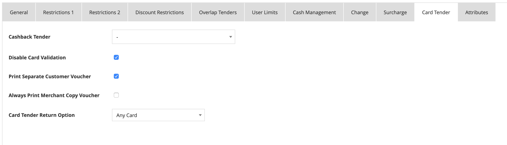

If Cashback is allowed, the cashback tender (usually local cash) is
configured here.

**Disable Card Validation** -- if set, no card validation will be
carried out. Rarely used.

**Print Separate Customer Voucher** -- if set, the customer will receive
two receipts for Card transactions. One will have the card payment
details, the other will be the normal receipt. If this is not set, the
customer will receive a single receipt with all information.

**Always print Merchant Voucher** -- printing a merchant copy is
normally only carried out in exception circumstances. If this flag is
set, a merchant copy will always be printed.

**Card Tender Return** -- this sets the rule for how the card number
should be validated on with-receipt card returns. It may be to any card,
to any card that was used in the original transaction, or only to the
same card as originally used.

### Cheque Tender

Cheque tender settings are broadly in four areas:

These settings are used when cheques are automatically printed by the
POS:

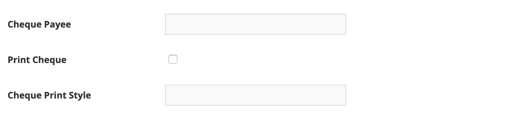

These settings are used to control how cheque guarantee cards are
validated:

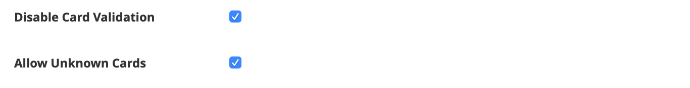

These settings are used to control how any online cheque authorisation
is handled, including floor limit rules:

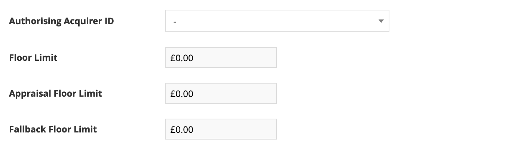

The remaining settings are used to control how much cheque information
should be captured (when cheque MICR reading is not used):

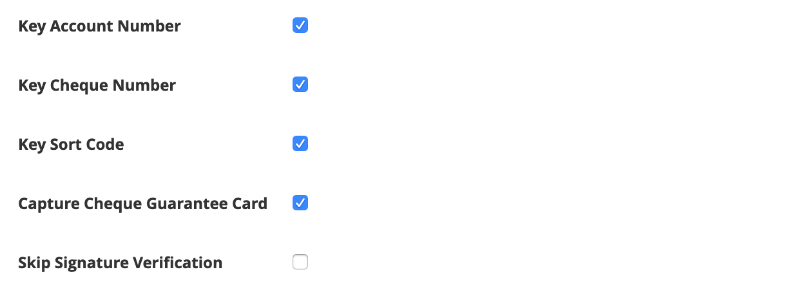
