# Configuring Users, User Templates and Roles

# Introduction

The purpose of this guide is to show how to configure Users, User
Templates and User Roles to allow you to set up different access to meet
your organization\'s needs.

Access covers a certain set of functions a user will be allowed to
perform.

Eg: A Sales Assistant might be able to sell but not do returns, there
may be tendering limits for certain groups. In order to do this, this
guide walks you through on how you can define and configure your own
User Roles with the set of enabled permissions (privileges), configure
new Users Templates and Users, and be able to assign the User Roles to
the specific Users as required.

## Overview

This guide will cover the configuration for the following:

-   **User Role Configuration --** to set up and assign privileges so as
    to assign what functions a User can have access to perform.

-   **User Template Configuration --** to template a set of users with
    common behaviour using User Templates.

-   **User Configuration --** to set the user information, passwords and
    individual user settings.

-   **User Group Configuration --** to set up a hierarchical structure
    to group users for group selection such as task allocation.h m

-   **User Team Configuration --** to set up a team of users that
    associates with a location and cost centre. A team manager, the
    users who belong to the team and the customers that the team
    supports are specified here as well.

-   **Functional Authorisation Codes --** limiting users' tender limits
    and reason code limits.

# User Role Configuration

The **User Role** configuration element provides a convenient method of
grouping together privileges, which may then be associated with one or
more Users who require them. This way it allows certain users to access
only certain functions. Eg: Returns, Loyalty, Ordering.

The most basic elements of application functionality in Enactor Retail
are **Functions** and these are typically associated with **Privileges**
which are a requirement for access to the Function. Each function
requires that a privilege is available in at least one of the User Role
that is associated with the User's Account, which would grant access for
the User to run that function since the Privilege has been assigned to
that User. All functions and their privileges are grouped into
**Processes** and these Processes are grouped into **Packages.** This is
further explained in the "Authorised Tab" section.

## Create a new User Role

To create a new User Role follow the steps below:

Navigate to User Role Maintenance using the Search or the path

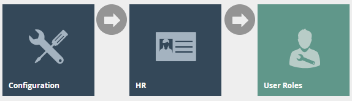

To create a new User Role, select **Create a New User Role** on the User
Role Maintenance page.

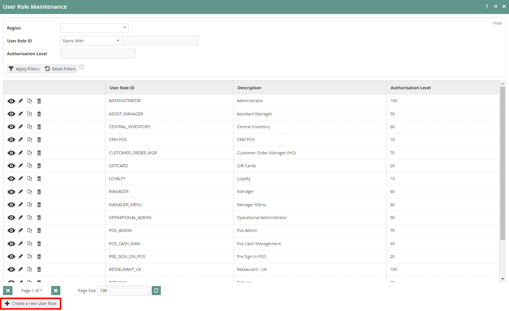

Select the Region from the **Region** drop-down.

Enter a unique **User Role ID** for the new User Role. The ID can be
alphanumeric and contain a maximum of 20 characters and will be used to
uniquely identify this new User Role. Use of a systematic and
business-specific naming convention is recommended here.

We will create a User Role for Manager - Returns which would contain the
privileges required to carry out return functions for all Managers as
follows:

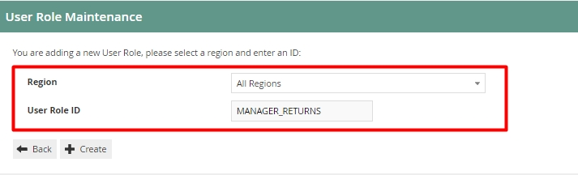

The User Role Maintenance, for the newly created User Role, is presented
as follows with the 4 key tabs namely; **General, Authorised Functions,
Special Functions and Report Functions**.

### User Role -- General Tab

The **General** Tab has the basic information that captures the identity
of the new User Role and the Authorisation Level for it.

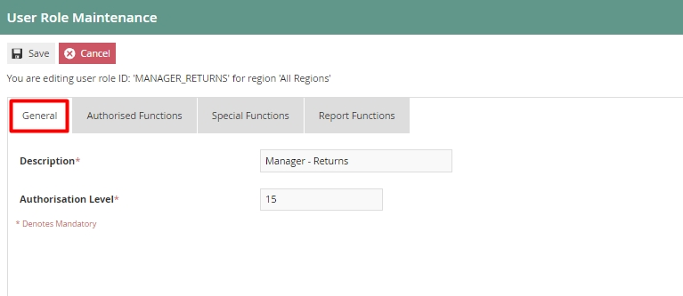

Set the appropriate values on the **General** Tab as follows:

| Configuration | Description |
| ---- | ---- |
| Description | Enter a User-Friendly, meaningful name by which Users will be able to identify and select the                  Roles in other locations of the Estate Manager. The use of some systematic and business-specific naming convention is                      recommended. Maximum 30 alphanumeric characters. |
| Authorisation Level | This field allows this role to be ranked against other roles with the same privileges. A                   numeric value which ranges from 0-100 is to be entered here. In this scenario, the newly created Manager Role should rank higher than the Sales Assistant Role. So, the value entered here should be higher than the value assigned                   for the Sales Assistant Role. This way, when both the Manager and Sales Assistant use the same function, it is the Manager who is given a higher priority than the Sales Assistant. |

### User Role -- Authorised Functions Tab

The **Authorised Functions** Tab is used to assign Privileges for User
Roles in relation to the **Functions.** Each Function is associated with
a **Process** and a Process is associated with an Application
**Package**. This is all available for configuration in this Authorised
Functions Tab as dropdown lists, so that the privileges for this User
Role can be easily filtered and enabled as required.

The details of the most commonly used Application Packages are as
follows:

| Application Package  | Description |
| ---- | ---- |
| Enactor Cash Management | Contains all cash management related functions and privileges for Estate              Manager and Back Office. |
| Enactor POS | Contains all POS related functionalities and privileges that are accessed when using the Enactor                                 POS. |
| Enactor Web Maintenance | Contains all UI related functionalities and privileges that are accessed when using the Enactor Web Maintenance. |

The details of the occasionally used Application Packages are as
follows:

| Application Package | Description |
| ---- | ---- |
| Enactor Address Lookup Service | Contains functionalities and privileges that are required when                accessing AFD, PA, Postcode, QAS and Internal Services. |
| Enactor Application Download Service | Contains functionalities and privileges that are required when                        accessing Application Download Services. |
| Enactor CRM | Contains all CRM functionalities and privileges such as Customer Activity Flow Service Access. |
| Enactor Card Payment | Contains ICC Reader related functionalities and privileges for Enactor Card Payment. |
| Enactor Card Payment Services | Contains all Card Payment functionalities and privileges required when accessing Card Payment Services such as authorising and refunding card payments. |
| Enactor Core Reporting | Contains all Reporting functionalities and privileges required when accessing Report functions such as viewing saved report and charts. |
| Enactor Customer Orders | Contains all Customer Order Maintenance functionalities and privileges for Estate Manager and Order Manager. |
| Enactor Customer Orders Retail | Contains functionalities and privileges that are required for Retail Customer Orders. |
| Enactor Customer Orders | Contains all Customer Order Processing Processing functionalities and privileges for                                running Customer Orders. |
| Enactor Diary | Contains all Customer Order Processing functionalities and privileges required for viewing, editing,                              running, removing in the Diary Entry Maintenance of the Estate Manager. |
| Payment Gateway - Card Services | Contains Payment Gateway Card Service functionalities and privileges for                             generating card tokens and bulk tokenisation. |
| Receipt Maintenance | Contains all Receipt functionalities and privileges required when accessing                Receipt based functions in the Receipt Maintenance. |
| Enactor Repairs Manager | Contains all Repairs Management related functionalities and privileges                    for Repairs Manager. |
| Restaurant Maintenance | Contains all Restaurant Management related functionalities and privileges when accessing Restaurant processes. |
| Enactor Web Maintenance - CRM | Contains all UI related functionalities and privileges that are accessed when using the CRM related Maintenance of Enactor Web Maintenance. |
| Enactor Web Maintenance -  Inventory | Contains all Inventory Management related functionalities and privileges                             that are accessed when using the Inventory related Maintenance of Enactor Web Maintenance.

Each package has a dropdown to select from a list of all available
Processes, relevant to a functional area of Enactor. Eg: Discount Item,
Receipt Return, Return Item.

Note: It is common for a function to have both an allowed privilege and
an authorised privilege. The allowed privilege would let this User to
start the function but in order to complete it, the user should also
require the authorised privilege. This is further illustrated in the
example scenario of the Item Returns function below.

The checkboxes corresponding to each Function can be used to enable or
disable a particular function for this User Role.

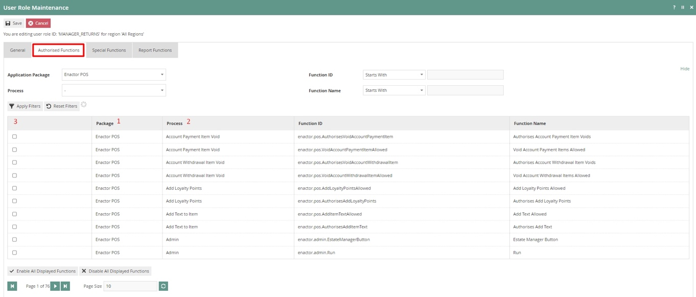

| Configuration | Description |
| ---- | ---- |
| Packages | Select from a drop list of available packages. Eg: Enactor POS. The various Processes and the Functions of the Enactor retail System are organised into Packages. |
| Processes | Dropdown selection from a list of all available Processes defined for the selected Application Package. |                          | Enable/Disable Privileges | A fixed set of Functions and their checkboxes is presented for the selected Process. Checkboxes, which if checked, indicate the Function is enabled for this Role.  Convenience options are available below the table to Enable or Disable the Function checkboxes of the selected Process all at once. |                                         

Following is an example scenario of how to enable the Allowed and
Authored privileges of Item Return transactions, in the Enactor POS, for
this Manager - Returns Role.

Filter the fields as follows:\
Application Package \> Enactor POS

Function ID \> Contains, returnitem

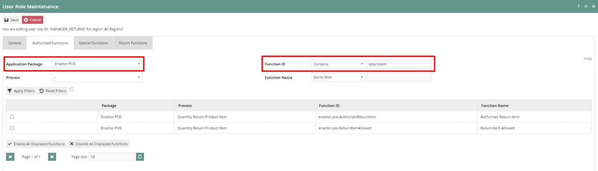

You will notice there is the **enactor.pos.ReturnItemAllowed** privilege
which allows to start the Item Return function and
**enactor.pos.AuthorisesReturnItem** privilege which allows to complete
the Item Return function.\
Make sure to tick both these boxes and click Save in order to enable the
Item Return function for this Manager - Returns Role.

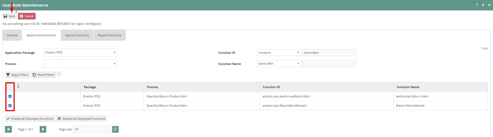\
Screenshots of the usage of these privileges in the POS can be found
later in the POS Screens section of this guide.

**Note:** Shown above is assigning only the item return privileges to
the Manager -- Returns Role. In a more realistic scenario, other return
privileges such as tender rules and receipt returns should also be
assigned to this user role.

### User Role -- Special Functions Tab

The **Special Functions** Tab is used to create and remove User-defined
Function Codes, which are further explained in the Functional
Authorisation Codes section of this guide.

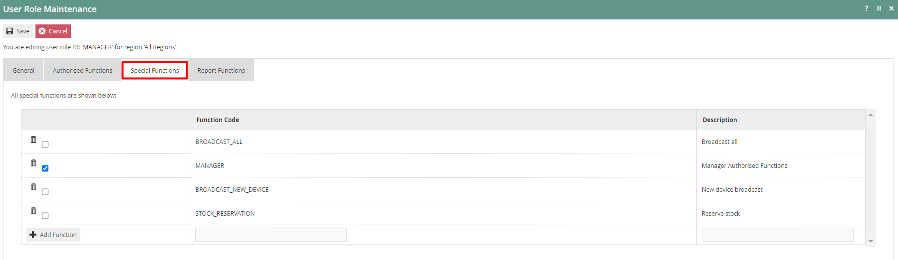

### User Role -- Report Functions Tab

The **Report Functions** Tab is used to select one of the User-Defined
Report Categories and configure permissions of the Role to enable or
disable individual elements of a general set of Reporting-specific
functions, which would then allow the User to manage the Reports. The
Report Categories are configured using the Report Categories Maintenance
and is not covered in this guide.

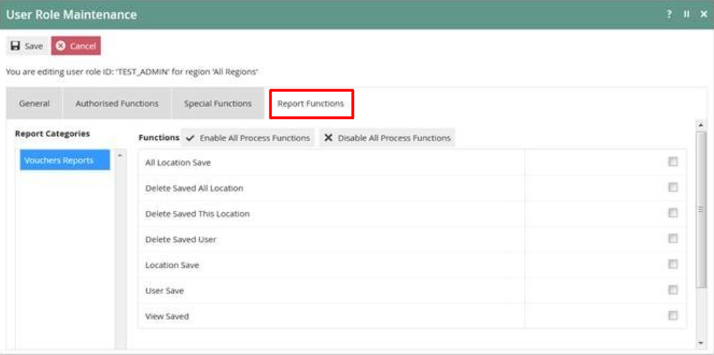

The User selects a Report Category in the list at the left-hand side of
the page and may then enable or disable permission for the specific
functions. The Enable All Process Functions and Disable All Process
Functions options are available for convenience.

After configuring all the above 4 tabs, select **Save** to complete
creating the new User Role.

# User Template Configuration

User Templates can be set up and assigned to a user, so that common
behaviour can be applied to many Users. It eases and makes it convenient
to create new Users since all the functional roles that were configured
in the User Template applies to the new User created. A User Template
can be set up for a specific type of user. Eg: Store Operator, Store
Manager. This also allows users with the same roles to take advantage
when a new privilege is added to a role i.e., if a new privilege to
access a new area of the system is needed for a certain set of users,
they will all get the change when the User Template is changed and will
not have to edit each user.

## Create a new User Template

To create a new User Template follow the steps below:

Navigate to User Template Maintenance using the Search or the path

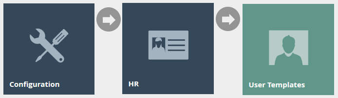

To create a new User Template, select **Create New User Template** on
the User Template Maintenance page.

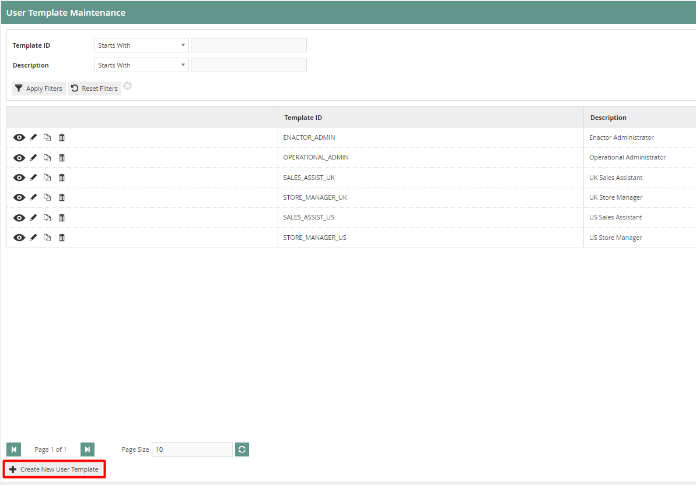

Enter a unique **Template ID** for the new User Template. The ID can be
alphanumeric and contain a maximum of 20 characters and will be used to
uniquely identify this new User Template. Use of a systematic and
business-specific naming convention is recommended here.

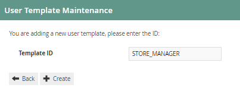

The User Template Maintenance, for the newly created User Template, is
presented as follows with the 5 key tabs namely; **General, Roles,
Security, Access Times and Associated Locations**.

### User Template -- General Tab

The **General** tab captures the basic information of the new User
Template.

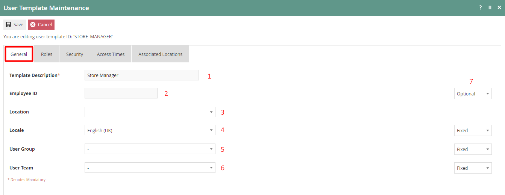

Set the appropriate values on the **General** tab as follows:

| Configuration | Description |
| ---- | ---- |
| Template Description | Enter a User-Friendly, meaningful name by which Users will be able to identify and select the Roles in other locations of the Estate Manager. The use of some systematic and business-specific naming convention is    recommended. Maximum 30 alphanumeric characters. |
| Locale | Select from a dropdown list of all configured Locales. |
| Rules for specific fields | When creating a user from a template, the rules on the fields are inherited from the user template and this is where you can set such rules for each field.  -   Optional -- The field will be optional     when creating a new user.  -   Fixed -- The field will be pre-filled and cannot be changed when creating a new user.  -   Mandatory -- The field must be entered when creating a new user. |

### User Template -- Roles Tab

The **Roles** tab allows to specify the roles, which have been
configured in User Roles, for this User Template.

In the User Roles section, we have already created a User Role called
"Manager - Returns" to provide privileges for all manager-based
functions. So here we can assign the Manager - Returns Role to our new
Store Manager User Template by ticking on the corresponding checkbox as
follows:

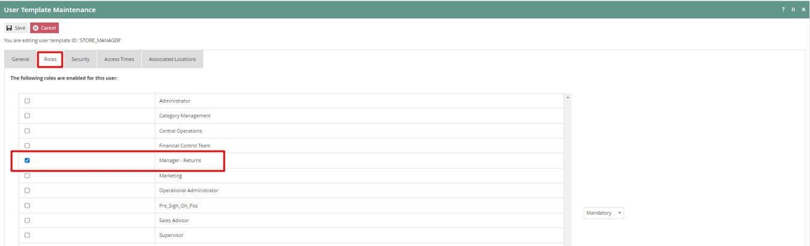

### User Template -- Security Tab

The **Security** tab consists of security related configurations and
setting up values in this User Template will save time when setting up
new users. The security tab settings can also be set as optional, fixed
or mandatory.

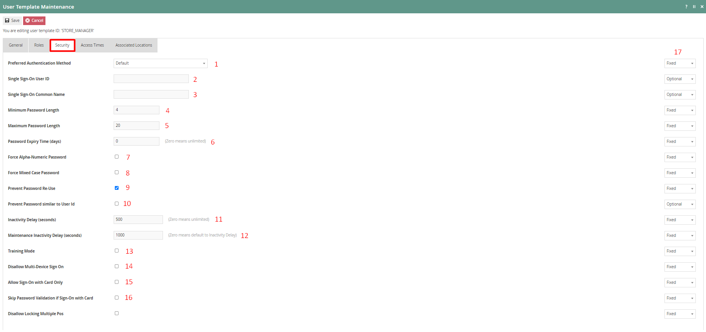

Set the appropriate values on the **Security** tab as follows:

| Configuration | Description |
| ---- | ---- |
| Preferred Authentication Method | Selected from a fixed drop list i.e., Default Enactor Internal or Active Directory. The integration setup for this is not included as part of this document |
| Single Sign-On User ID | A user ID (Alphanumeric; maximum 20 characters) which is used for linking to single sign on directory services such as active directory. The integration setup for this is not included as part of this document. |                                    | Single Sign-On Common Name | Common name for single sign on use. The integration setup for this is not included as  part of this document. |
| Minimum Password Length | The minimum length of the password. Integer value minimum 1. |
| Maximum Password Length | The maximum length of the password. Integer value maximum 20. |
| Password Expiry Time (days) (Zero means unlimited) | Number of days until password expires. Integer value maximum 999 and 0 means unlimited. |
| Force Alpha-Numeric Password | Checkbox, if checked indicates that the User will be forced to use alpha and numeric  characters when they change their password. |
| Force Mixed Case Password | Checkbox, if checked indicates that the User will be forced to use mixed case characters when they change their password. |
| Prevent Password Re-Use | Checkbox, if checked indicates that the User will be prevented from using a previously used password when they change their password. |
| Prevent Password similar to User Id | Checkbox, if checked indicates that the User will be prevented from using a password that bears similarity to the User ID. |
| Inactivity Delay (seconds) (Zero means unlimited) | The delay in seconds after which this User is automatically logged off the POS system. Integer value where 86400 is the maximum value and 0 means unlimited. |
| Maintenance Inactivity Delay (seconds) (Zero means same as nactivity Delay value) | The delay in seconds after which this User is automatically logged off the Web Maintenance. Integer value where 86400 is the maximum value and 0 would take the value of the previous Inactivity Delay field. |
| Training Mode | Checkbox, if checked indicates that this User is operating in training mode and will have reduced privileges. |
| Disallow Multi-Device Sign On | Checkbox, if checked indicates that this User is prevented from signing onto the system at more than one location at any one time. |
| Allow Sign-On with Card Only | Checkbox, if checked indicates that this User can only sign onto the system with a card. |
| Skip Password Validation if Sign-On with Card | Checkbox, if checked indicates that password validation will be skipped if this User logs onto the system using a card. |
| Rules for specific fields | When creating a user from a template, the rules on the fields are inherited from the user template and this is where you can set such rules for each field.  -   Optional -- The field will be optional         when creating a new user.  -   Fixed -- The field will be pre-filled and cannot be changed when creating a new user.  -   Mandatory -- The field must be entered when creating a new user. |

After configuring all the above 3 tabs, select **Save** to complete
creating the new User Template.

# User Configuration

User configuration defines the User Accounts via which staff who have
access to the Software Applications may Sign-On and are assigned
Permissions to the Application functions they need to use. User
configuration also captures information about the staff member that is
required by the system.

The Maintenance of User configuration is typically a responsibility of
the System Administrator. Each person requiring access to Applications
of the Enactor Retail System must be identified to the system based on a
User Account, which provides for authentication of the User at Sign On
time and, through enabled Roles configuration, defines their access to
functionality of the Applications. User configuration is maintained
using the User function described following

## Create a new User 

To create a new User follow the steps below:

Navigate to User Maintenance using the Search or the path

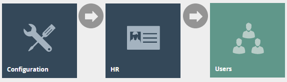

To create a new User, select **Create New User** on the User Maintenance
page.

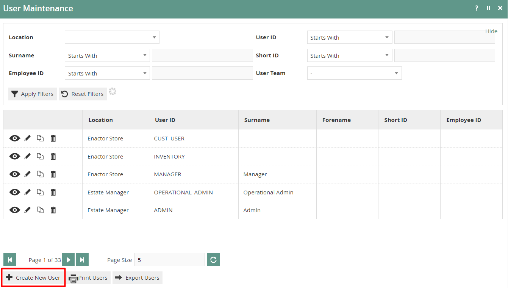

Enter a unique **User ID** for the new User. The ID can be alphanumeric
and contain a maximum of 20 characters and will be used to uniquely
identify this new User. Use of a systematic and business-specific naming
convention is recommended here.

If you wish to apply a User Template, then select it from the **Template
ID** drop-down.

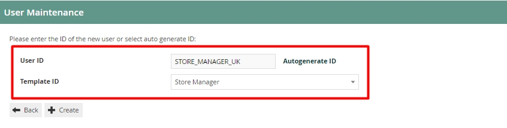

The User Maintenance, for the newly created User, is presented as
follows with the 8 key tabs namely; **General, Address, Roles, Security,
Access Times, E-mail, Biometrics and Associated Locations**.

**Note:** Only a few fields in General and Address tabs have to be
configured since most of the remaining fields are all managed by the
already selected User Template.

### User -- General Tab

The **General** tab captures the basic information of the new User.
Here, only the Display Name and Surname are mandatory fields.

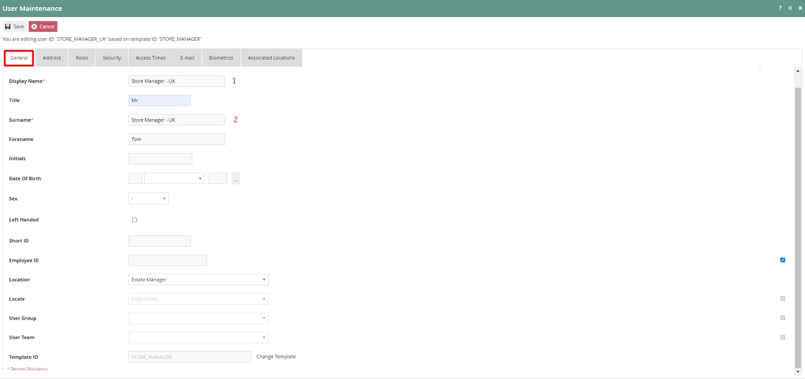

Set the appropriate values on the **General** tab as follows:

| Configuration | Description |
| ---- | ---- |
| Display Name | Alphanumeric; maximum 30 characters. Enter a value that meaningfully associates with the                        User and by which they and other Users will recognise their User Account. This name will be displayed in screens and on receipts. |

| Surname | Alphanumeric; maximum 100 characters. Enter the User's Surname. |

### User -- Address Tab

The **Address** tab captures the standard address information related to
the User.

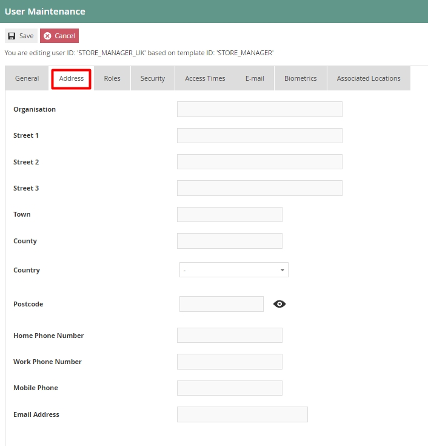

### User -- Access Times Tab

The **Access Times** tab allows to set times that a user can access the
Enactor system.

### 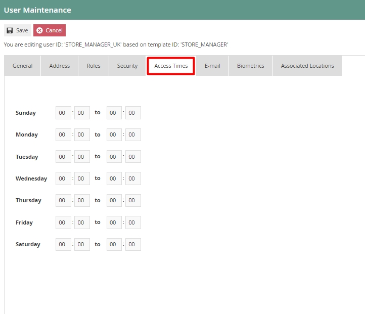{width="3.958837489063867in" height="3.40625in"}

### User -- Associated Locations Tab

The **Associated Locations** tab allows to specifically add any other
location that a user is to be given access to.

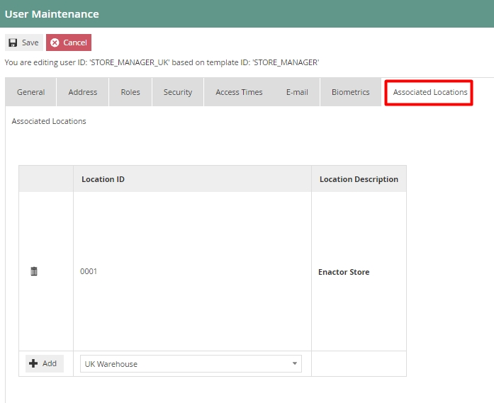

### User -- Biometrics Tab

The **Biometrics** tab allows to enable fingerprint scanning to the
User. This is not covered in this guide.

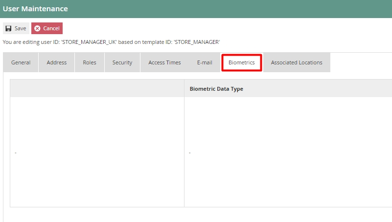

Note: The User Configurations for Roles and Security are discussed in
the User Templates Configuration section of this guide.

After configuring all the above 8 tabs, select **Save** to complete
creating the new User.

# User Group Configuration

The User Group Type is a hierarchical structure that can defined with up
to 10 levels, which is used to group Users for group selection like for
example, in task allocation.

## Create a new User Group

To create a new User Group follow the steps below:

Navigate to Groups Maintenance using the Search or the path

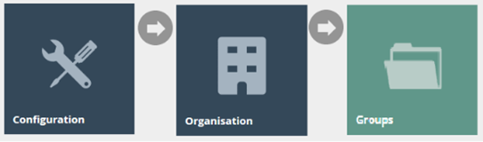

To create a new User Group, filter Group Type as **User Group** from the
dropdown and select **Create New User Group Hierarchy** on the Groups
Maintenance page.

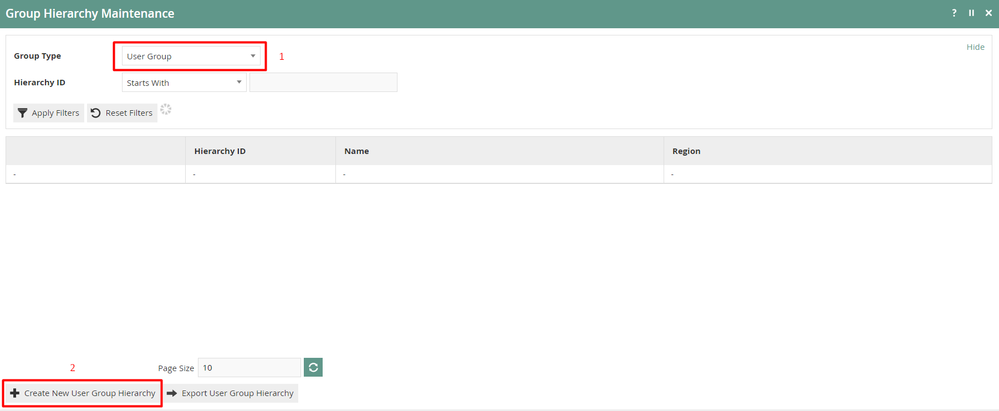

Enter a unique **Hierarchy ID** for the new User Group. The ID can be
alphanumeric and contain a maximum of 20 characters and will be used to
uniquely identify this new User Role. Use of a systematic and
business-specific naming convention is recommended here.

Select the Region from the **Region** drop-down.

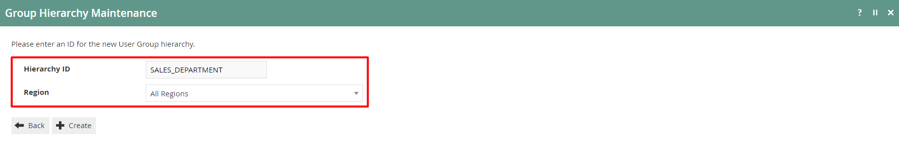

Once the Group Hierarchy has been created the User Group Hierarchy Edit
page is available to Add, Edit or Remove Group nodes in the hierarchy as
illustrated below:

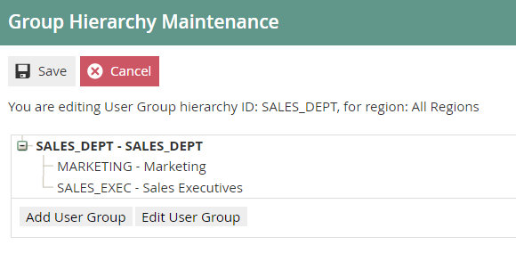

After creating the User Group Hierarchy, click **Save.**

Finally, these User Groups can be as assigned when creating a new User
or User Template.

# User Team Configuration

User Teams are created to be able to give the team a Name, associate it
with a Location and Cost Centre, specify a Team Manager, identify the
Users who belong to the Team and the Customers that the Team supports. A
User Team may also be created and given just the required Identifier
with no further input.

## Create a new User Team

To create a new User Team follow the steps below:

Navigate to Team Maintenance using the Search or the path

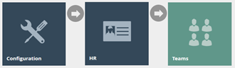

To create a new User Team, select **Create a New Team** on the Team
Maintenance page.

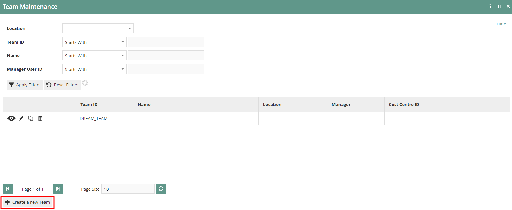

Enter a unique **Team ID** for the new User Team. The ID can be
alphanumeric and contain a maximum of 20 characters and will be used to
uniquely identify this new User Role. Use of a systematic and
business-specific naming convention is recommended here.

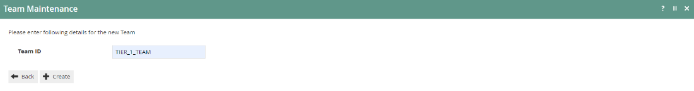

The Team Maintenance, for the newly created User Team, is presented as
follows with the 3 key tabs namely; **General, Team Customers, Team
Users**

### User Team -- General Tab

The **General** tab captures the basic information of the new User Team.

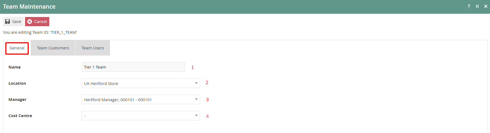

Set the appropriate values on the **General** tab as follows:

| Configuration | Description |
| ---- | ---- |
| Name | Enter a User-defined, meaningful name for the Team by which Users may recognise and select it in other UIs. Alphanumeric; maximum 40 characters. |
| Location | Select from a dropdown list of all configured Locations. |
| Manager | Select from a dropdown list of all configured Users |
| Cost Centre | Select from a dropdown list of all configured Cost Centres. |

### User Team -- Team Customers Tab

The **Team Customers** tab captures a List of Customers, which is list
of Customers affiliated with this Team. The list is created and
accumulated by selecting the Add option. Customers appear in the list
with a Delete Icon, which may be used to Remove the Customer from the
List.

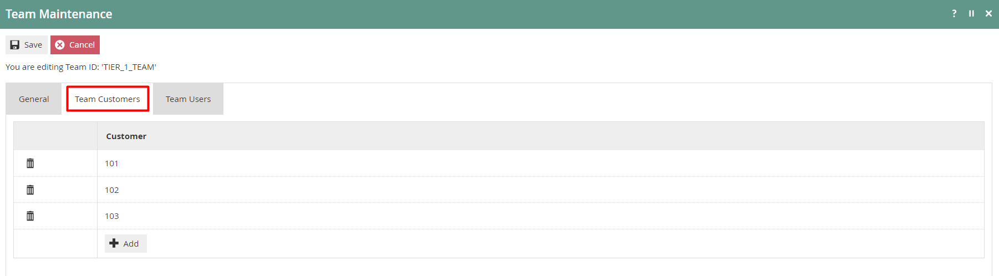

### User Team -- Team Users Tab

The **Team Users** tab captures a List of Users belonging to the Team.
The list is created and accumulated by selecting the Add option. Users
appear in the list with a Delete Icon, which may be used to Remove the
User from the List.

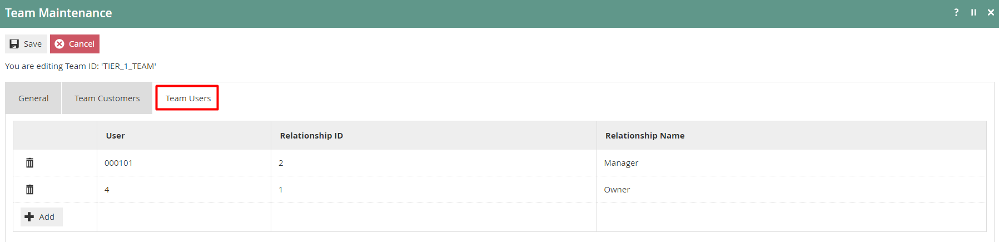

The columns of the table depict the following:

| Configuration | Description |
| ---- | ---- |
| User | Enter a User-defined, meaningful name for the Team by which Users may recognise and select it in other UIs. Alphanumeric; maximum 40 characters. |
| Relationship Name | This is the Relationship of the User to the Team. Enter a User-defined, meaningful name for                    the Team-User Relationship by which Users may recognise and select it in other UIs. Alphanumeric; maximum 40 characters. |
| Relationship ID | This uniquely identifies the Relationship of the User to the Team. Enter a User-defined,                unique ID for this Relationship. Alphanumeric; maximum 20 characters. |

After creating the User Team, click **Save.**

Finally, these User Teams can be as assigned when creating a new User or
User Template.

# Functional Authorisation Codes

They can be created new (initially un-associated with any Application
Function) in the Role Maintenance page of Web Maintenance while editing
any Role. However, once created they are available for association with
any other Role. Various Web Maintenance configurations provide for
qualifying access to an option based on a Functional Authorisation Code.
Thus, once created in Role Maintenance, they can now be associated with
Functions of this type. The same Functional Authorisation Code may be
used in more than one of these configurations, typically being
associated with a Role that will be granted to Users who require to
access the Functions they identify.

The main places this is used is to set Tender debit limits and to limit
specific Reason codes to these users.

## Setting Functional Codes in User Roles

In User Role Maintenance, edit a role and go to the Special Functions
Tab.

To create a new Function Code, enter a Function Code and Description and
click on Add Function.

  -----------------------------------------------------------------------
  Configuration           Description
  ----------------------- -----------------------------------------------
  Function Code           Maximum 20 alphanumeric characters. Enter a
                          User-defined, unique value.

  Description             Maximum 30 alphanumeric characters. Enter a
                          User-Friendly, meaningful value by which Users
                          will identify and select the Function Code in
                          other UIs.
  -----------------------------------------------------------------------

To set the special function for the role ensure the tick box is selected
and click **Save**.

## Configuring Tender Limits using Functional Codes

Tender Limits can be set on each tender for a functional code.

A sales assistant may be able to tender with a different amount to a
manager.

Configuring the tender limit using the Functional Code, will limit the
user if they try to tender over this limit and ask for authorisation for
a manager.

To get to Tender Maintenance

> Sign on to Estate Manager
>
> Configuration → Financial → Tender
>
> Edit the tender and go to the User Limits Tab
>
> Add the Authorisation Code and set the user limit

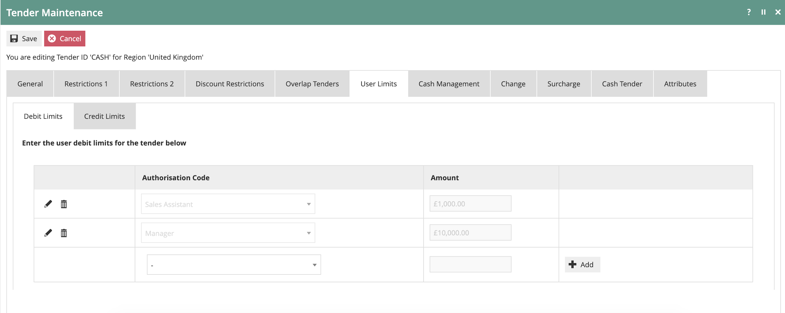

For changes to take effect the Tender entity will need to be broadcast
to the POS.

## Configuring Reasons for specific Functional Codes

It is possible to limit the user of specific reason codes to users with
the correct Functional Code. Eg: A transaction discount reason.

When a user tries to use this reason, they will be required to get
authorisation from a user who has the correct Functional Code.

To get to Reason Maintenance

1.  Sign on to Estate Manager

2.  Configuration → Organisation → Reasons

3.  Edit the reason to change set the Functional Authorisation Code

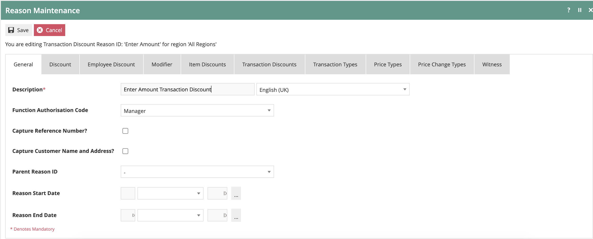

For changes to take effect the Reasons entity will need to be broadcast
to the POS.

# Broadcasting

To deliver all the configuration changes to the POS, broadcast the
following entities.

-   Role

-   User

-   User Template

-   Group

-   Team

-   Tender

-   Reasons

# POS Screens

Following screen shows how we **sign on** using the **STORE_MANAGER_UK**
user that we have created.

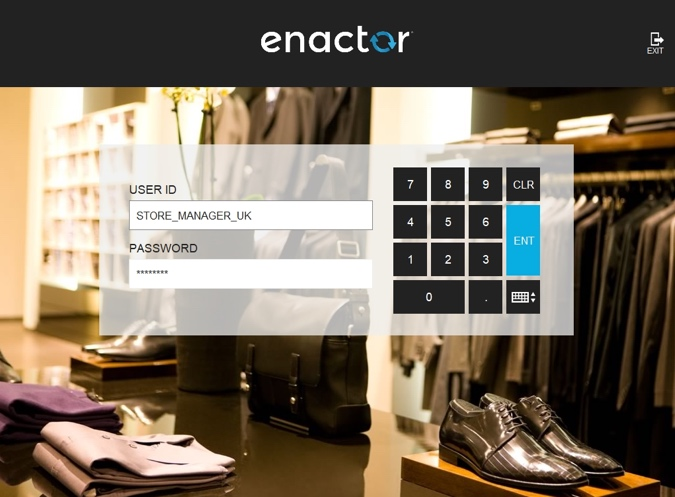

The following screens show how an **Item Return** is done using this
User, which also shows that the **privileges** we have added in the
**Manager -- UK** role is allowing the Item Return to function
successfully for this User.

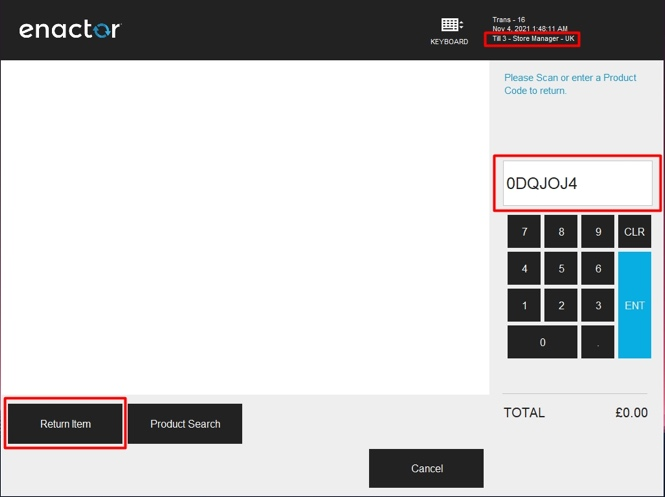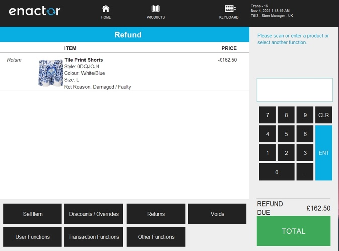

The following screens show how a **Sales Assistant User** is trying to
give a **Manager Transaction Discount** which has a functional
authorisation code configured against this reason.

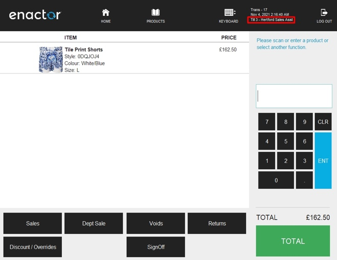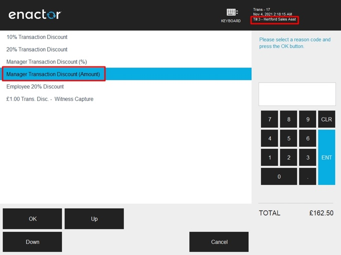

When this reason has been selected, the POS prompts for the Manager to
authorise the use of this reason. We will use our **STORE_MANAGER_UK**
user to **authorise** this reason, since this user's role has the
functional authorisation code that matches with the one configured with
this reason. After authorising with this User, the Sales Assistant will
be able to successfully add the Manager Transaction Discount reason for
this transaction.

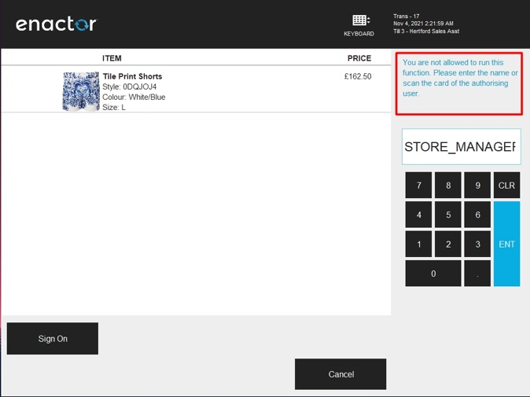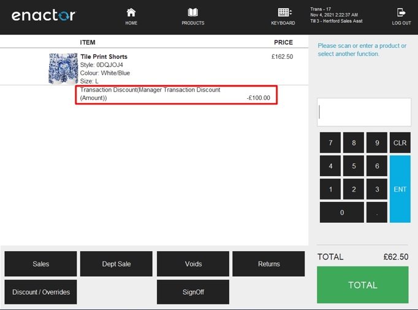

# 
