# Configuring Voids
# Introduction

The purpose of this guide is to provide a foundational understanding of
the options and capabilities available when configuring Void Reasons.
Reasons are configured based on a Reason Type (E.g: Item Void Reason,
Transaction Void Reason, Post Transaction Void Reason) and are
associated with a Region in which they are applicable.

The properties of a Reason configuration too depend on the Reason Type.
Void Reasons are Reasons for which either a particular item or an entire
transaction may be deemed to be void and not taken into consideration,
due to reasons such as the item being faulty, a customer leaving the
store, operator error, etc. This guide provides the basic step-by-step
configurations required to set up the necessary Void Reasons.

## 

## Overview

This guide will cover the configuration for the following:

-   **Item Void Reason** -- Allows setting a particular item in a
    transaction as a void item.

-   **Transaction Void Reason** -- Allows setting an entire transaction
    as a void transaction.

-   **Post Transaction Void Reason** -- Allows setting an entire
    completed transaction as a void transaction.

-   **Item Tender Void** -- Allows setting a tender function applied on
    a transaction as void.

**Prior Training / Experience **

You should be familiar with the following: 

-   Estate Manager Configuration 

-   Data Broadcasting

# Configuration Steps

Reasons are created based on a pre-defined **Reason Type** and
associated with a Region in which they are applicable. Each Reason Type
is known to a specific function of the application, that is required to
capture reasons of the specific type. Many of the Reason Types relate to
Application-Specific built-in functionality.

## Item Void Reason

There are instances when a customer requires to eliminate a selected
item before proceeding with the transaction. Item Void Reason allows
setting a particular item in a transaction as a void item.

The reason maintenance application can be accessed through:

Configuration -\> Organisation -\> Reasons

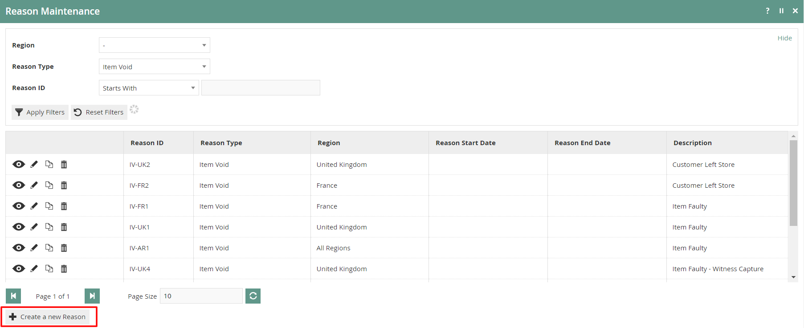

To create a new Reason, select **Create a New Reason** on the Reason
Maintenance page.

Select the appropriate Region** **from the **Region** drop-down. 

Select **Item Void** from the **Reason Type** drop-down. 

Enter a unique **Reason ID **for the new Item Void Reason. The ID can be
alphanumeric and contain a maximum of 20 characters. 

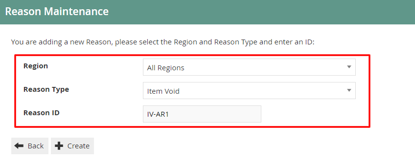

Select **Create.**

You will be presented with the following options to complete creating
the new Item Void Reason:

### Reason -- General Tab

The General tab has all the basic information that captures the identity
of the Item Void Reason.

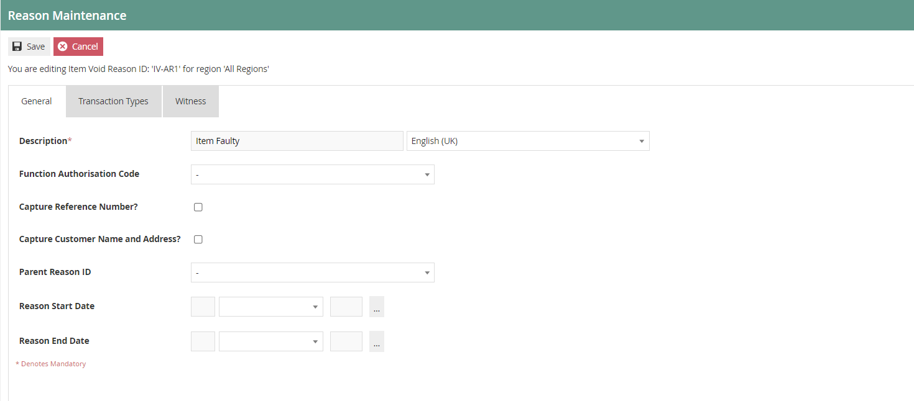

Set the appropriate values on the **General** tab as follows:

| Configuration                     | Description                                                                                                                                                                                           |
|-----------------------------------|-------------------------------------------------------------------------------------------------------------------------------------------------------------------------------------------------------|
| Description                       | Enter a user-friendly, meaningful description for the Reason that can be alphanumeric with a maximum of 50 characters.                                                                                |
|                                   | Select the locale from the dropdown list of all configured Locales.                                                                                                                                   |
| Function Authorisation Code       | Select the applicable Function Authorisation Code from the drop-down list. These are defined and configured in Role Maintenance and applicable only if the reason selection requires authorisation.   |
| Capture Reference Number          | If checked, the User will be prompted to enter a reference number when using this Reason.                                                                                                             |
| Capture Customer Name and Address | If checked, indicates that the User must be prompted to capture the Customer's Name and Address when using this Reason.                                                                               |
| Parent Reason ID                  | If the reason requires a parent reason, select the relevant parent reason from the drop-down list of all configured Reasons of the same Reason Type.                                                  |
| Reason Start Date                 | Enter a Reason Start Date                                                                                                                                                                             |
| Reason End Date                   | Enter a Reason End Date    
                                                                                                                                                                           |
### Reason -- Transaction Types Tab

The Transaction Types tab is available for Reasons which are only valid
for certain transaction types (Eg: Restaurant sale transaction). All
Transaction Types for this Reason can be selected here and if no
transaction types are selected, it is assumed that the Reason is valid
for all.

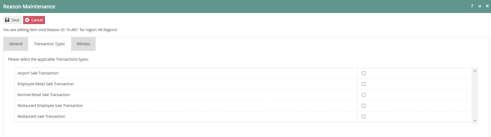

Reason -- Witness Tab 

The Witness tab is available for Reasons which require the User to
obtain a witness when using this Reason. If checked, the user will be
prompted for a witness whenever the Reason is selected.  

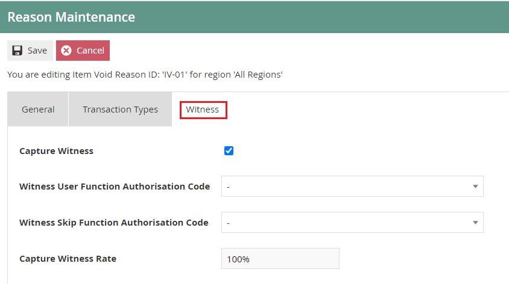

If checked, additional configuration options will appear. Set
appropriate values on the fields as follows: 

+----------------------+-----------------------------------------------+
| > Configuration      | > Description                                 |
+======================+===============================================+
| > Witness User       | > Select from the drop-down list to determine |
| > Function           | > this as a **Manager Authorised              |
| Authorisation Code   | > Functions**.                                |
+----------------------+-----------------------------------------------+
| > Witness Skip       | > Select from the drop-down list to determine |
| > Function           | > this as a **Manager Authorised              |
| >                    | > Functions**.                                |
|  Authorisation Code  |                                               |
+----------------------+-----------------------------------------------+
| > Capture            | > Enter a numeric value to define             |
| > Witness Rate       | > a percentage for the capture witness        |
|                      | > rate. (Indicates the percentage that the    |
|                      | > user should be prompted to capture witness; |
|                      | > against the number of times this reason is  |
|                      | > used)                                       |
+----------------------+-----------------------------------------------+

Select **Save** to complete creating the Item Void Reason.

\*Multiple Reasons can be created for the Item Void Reason Type as
required, and these Reasons will be presented to the operator to select
from when performing an Item Void.

## Transaction Void Reason

Unlike eliminating a single purchased item as discussed previously,
there are instances when a complete transaction might require
eliminating. Transaction Void Reason allows setting an entire
transaction as a void transaction.

To create a new Reason, select **Create a New Reason** on the Reason
Maintenance page.

Select the appropriate Region** **from the **Region** drop-down. 

Select **Transaction Void** from the **Reason Type** drop-down. 

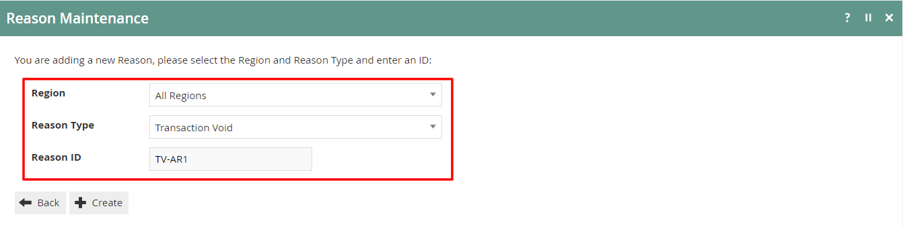Enter a unique **Reason ID **for the new
Transaction Void Reason. The ID can be alphanumeric and contain a
maximum of 20 characters. 

Select **Create.**

You will be presented with the following options to complete creating
the new Transaction Void Reason:

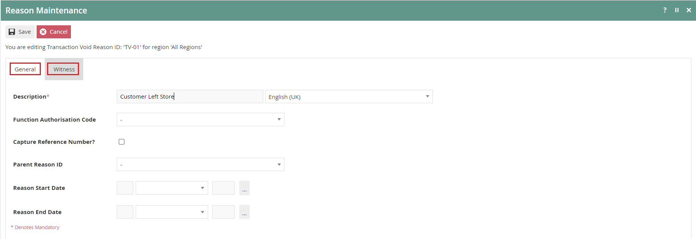

### Reason -- General Tab

The General tab has all the basic information that captures the identity
of the Transaction Void Reason.

Set the appropriate values on the** General Tab **as per the sample on
configuring item void reason.  

### Reason -- Witness Tab

The Witness tab is available for Reasons which require the User to
obtain a witness when using this Reason. If checked, this option is made
active for this Reason.

Set the appropriate values on the** Witness Tab **as per the sample on
configuring item void reason.  

Select **Save** to complete creating the Transaction Void Reason.

**\***Multiple Reasons can be created for the Transaction Void Reason
Type as required, and these Reasons will be presented to the operator to
select from when performing a Transaction Void.

## Post Transaction Void Reason

Post Transaction Void Reason allows setting an entire transaction that
had been completed, as a void transaction.

To create a new Reason, select **Create a New Reason** on the Reason
Maintenance page.

Select the appropriate Region** **from the **Region** drop-down. 

Select **Post Transaction Void** from the **Reason Type** drop-down. 

Enter a unique **Reason ID **for the new Post Transaction Void
Reason. The ID can be alphanumeric and contain a maximum of 20
characters. 

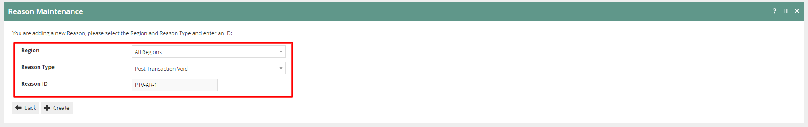

Select **Create.**

You will be presented with the following options to complete creating
the new Post Transaction Void Reason:

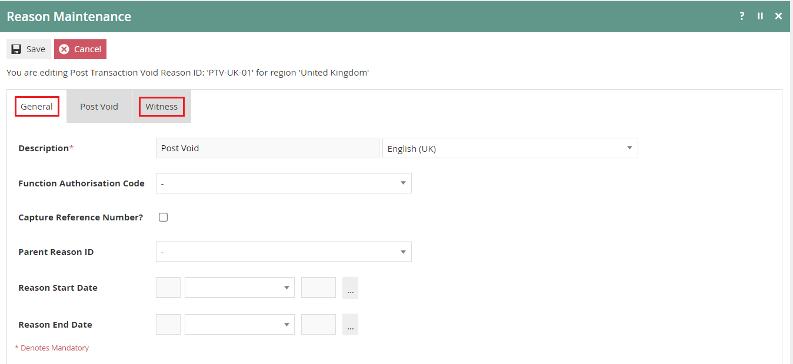

### Reason -- General Tab

The General tab has all the basic information that captures the identity
of the Post Transaction Void Reason.

Set the appropriate values on the** General Tab **as per the sample on
configuring item void reason.  

### Reason -- Witness Tab

The Witness tab is available for Reasons which require the User to
obtain a witness when using this Reason. If checked, this option is made
active for this Reason.

Set the appropriate values on the** Witness Tab **as per the sample on
configuring item void reason.  

### Reason -- Post Void Tab

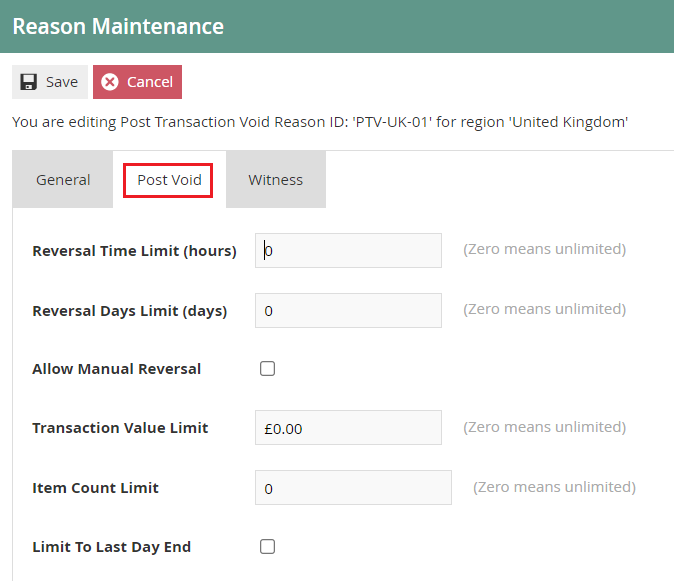

Set the appropriate values on the **Post Void** tab as follows:

  -----------------------------------------------------------------------
  Configuration           Description
  ----------------------- -----------------------------------------------
  Reversal Time Limit     Enter a numeric value to indicate the limit for
  (hours)                 reversal in hours. If set to zero, the hours
                          will unlimited.

  Reversal Days Limit     Enter a numeric value to indicate the limit for
  (days)                  reversal in days. If set to zero, the days will
                          be unlimited.

  Allow Manual Reversal   Select checkbox to enable the user to perform a
                          manual reversal through the POS.

  Transaction Value Limit Set a Transaction Value Limit for the post
                          transaction void reason. If set to zero, the
                          transaction value will be unlimited.

  Item Count Limit        Enter a numeric value to indicate a limit for
                          items for this void reason. If set to zero, the
                          item count will be unlimited.

  Limit To Last Day End   Select checkbox to indicate that the reason is
                          limited to Last Day End.
  -----------------------------------------------------------------------

Select **Save** to complete creating the Post Transaction Void Reason.

**\***Multiple Reasons can be created for the Post Transaction Void
Reason Type as required, and these Reasons will be presented to the
operator to select from when performing a Post Transaction Void.

## Item Tender Void Reason

When adding various tenders to an order there may be instances where the
customer will need to change the mode of payment. Item Tender Void
Reason allows setting a selected tender function (Cash or Card) of a
transaction as void.

To create a new Reason, select **Create a New Reason** on the Reason
Maintenance page.

Select the appropriate Region** **from the **Region** drop-down. 

Select **Item Tender Void** from the **Reason Type** drop-down. 

Enter a unique **Reason ID **for the new Item Tender Void Reason. The ID
can be alphanumeric and contain a maximum of 20 characters. 

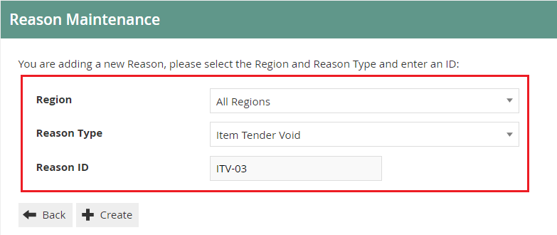

Select **Create.**

You will be presented with the following options to complete creating
the new Post Transaction Void Reason:

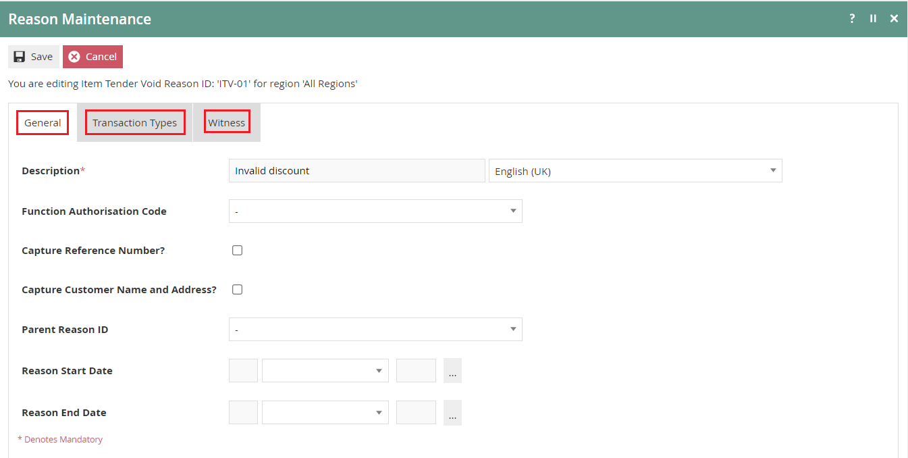

### Reason -- General Tab

The General tab has all the basic information that captures the identity
of the Item Tender Void Reason.

Set the appropriate values on the** General Tab **as per the sample on
configuring item void reason. 

### Reason -- Transaction Types Tab

The Transaction Types tab is available for Reasons which are only valid
for certain transaction types (Eg: Restaurant sale transaction). All
Transaction Types for this Reason can be selected here and if no
transaction types are selected, it is assumed that the Reason is valid
for all.

Set the appropriate values on the** Transaction Types Tab **as
per the sample on configuring item void reason. 

### Reason -- Witness Tab

The Witness tab is available for Reasons which require the User to
obtain a witness when using this Reason. If checked, this option is made
active for this Reason.

Set the appropriate values on the** Witness Tab **as per the sample on
configuring item void reason.  

Select **Save** to complete creating the Item Tender Void Reason.

**\***Multiple Reasons can be created for the Item Tender Void Reason
Type as required, and these Reasons will be presented to the operator to
select from when performing an Item Tender Void.

## Menus 

To enable the use of the above reasons, appropriate Menus and Role
privileges should be configured separately.

The menu maintenance application can be accessed through:  

Configuration -\> System -\> Menus 

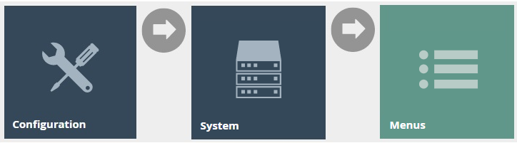 

The **Sale Menu** contains most of the functions that will be required
by a retailer. Most of the customization work will involve restructuring
the hierarchy of the menu, removing unnecessary items, or potentially
adding a new item.

Following are the events that can be configured for this reason menu:

+-------------------+------------------------+------------------------+
| Reason Type       | > Event Name           | > Event ID             |
+===================+========================+========================+
| > Item Void       | > Item Void            | > ItemVoid             |
+-------------------+------------------------+------------------------+
| > Transaction     | > Transaction Void     | > TransactionVoid      |
| > Void            |                        |                        |
+-------------------+------------------------+------------------------+
| > Post            | > Post Void            | > PostVoid             |
| > Transaction     |                        |                        |
| > Void            |                        |                        |
+-------------------+------------------------+------------------------+

\*Configuring Menus is further described in a separate How-to Guide.

## User Roles

The user role maintenance application can be accessed through:  

Configuration -\> HR -\> User Roles 

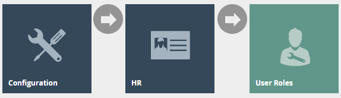 

The configuration interface used to specify User **Roles** facilitates
the selection of required permissions by applying a discovery process to
the Package resources of the Enactor Retail Software itself.

Authorisation to run the specific functionality documented here are
controlled with privileges maintained in roles.

Select an appropriate role you wish to edit, the example here is
using SALES_ASSISTANT. 

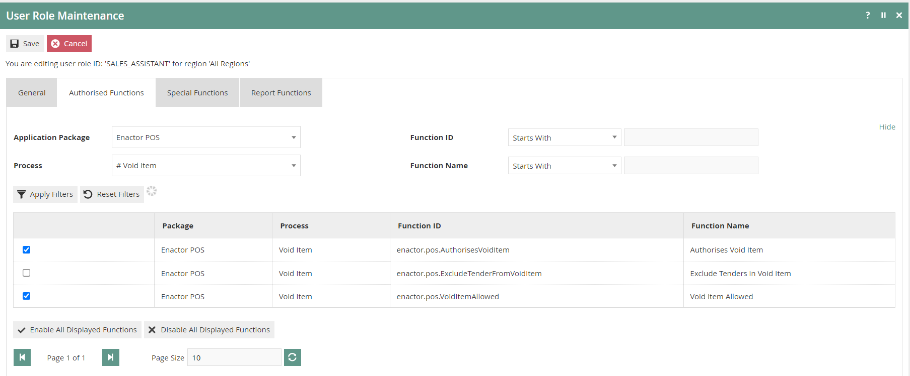

Select the enactor POS package and configure the privileges as required.

Following are the privileges that can be configured for this user role: 

+---------------+------------+----------------------------------------+
| Reason Type   | Package    | Function ID                            |
+===============+============+========================================+
| Item Void     | Enactor    | enactor.pos.AuthorisesVoidItem         |
|               | POS        |                                        |
|               |            | enactor.pos.VoidItemAllowed            |
+---------------+------------+----------------------------------------+
| Transaction   | Enactor    | enactor.pos.AuthorisesVoidTransaction  |
| Void          | POS        |                                        |
|               |            | enactor.pos.VoidTransactionAllowed     |
+---------------+------------+----------------------------------------+
| Post          | Enactor    | enac                                   |
| Transaction   | POS        | tor.pos.AuthorisesPostTransactionVoid  |
| Void          |            |                                        |
|               |            | e                                      |
|               |            | nactor.pos.PostTransactionVoidAllowed  |
+---------------+------------+----------------------------------------+
| Item Tender   | Enactor    | enactor.pos.AuthorisesVoidTenderItem   |
| Void          | POS        |                                        |
|               |            | enactor.pos.VoidTenderItemAllowed      |
+---------------+------------+----------------------------------------+

\* Configuring User Roles is further described further in a separate
How-to Guide.

## Broadcasting 

To deliver the configuration changes to the POS, broadcast the following
entity.

-   Reason

-   Menu

-   Roles

# POS Functionality

## Item Void Reason Functionality 

On adding products to the bag, the operator will be presented with
screen 1.

Select product as shown on screen 2, to view all applicable functions
for the product displayed at the bottom pane.

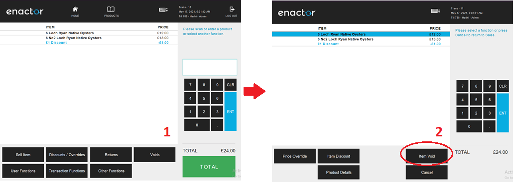

Select **Item Void** and a set of configured Item Void Reasons are
displayed to the operator.

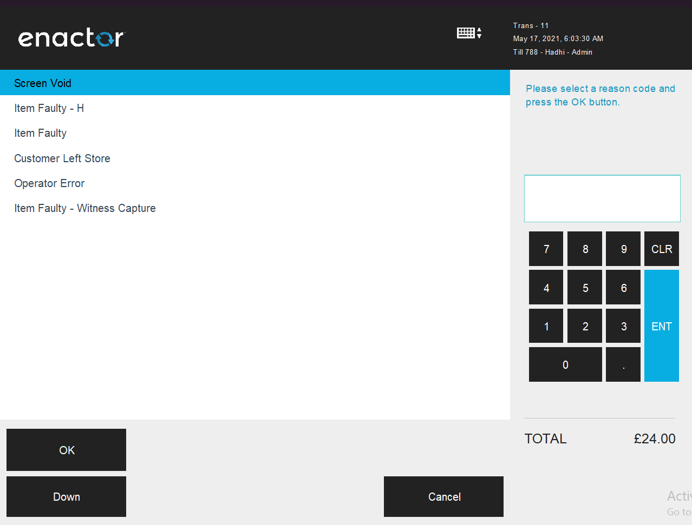

The operator can then select the applicable Reason and click **OK** to
apply the Item Void reason to the selected product.

## Transaction Void Reason Functionality 

On adding products to the bag, the operator will be presented with
screen 1.

All applicable functions for transaction are displayed at the bottom
pane. Select **Voids** and the option of Transaction Void will be
displayed to the operator as shown on screen 2.

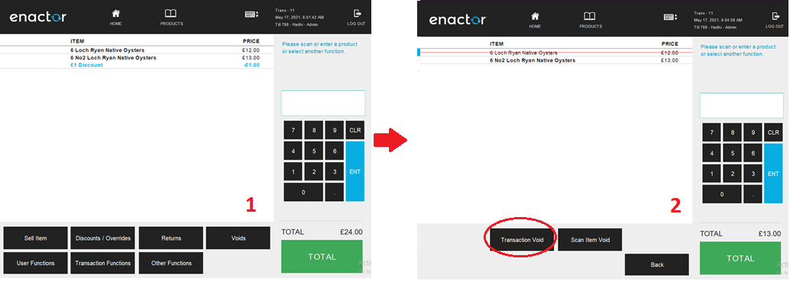

Select **Transaction Void** and a set of configured Transaction Void
Reasons are displayed to the operator.

The operator can then select the applicable Reason and click **OK** to
apply the Transaction Void function to the selected transaction.

## Post Transaction Void Reason Functionality

The operator after completing a transaction will be able to use the Post
Transaction Void function by clicking on the **Post Void** button as
shown of screen 1.

Once Post Void is selected, click on the **Search** button as shown of
screen 2 to pick the transaction to void.

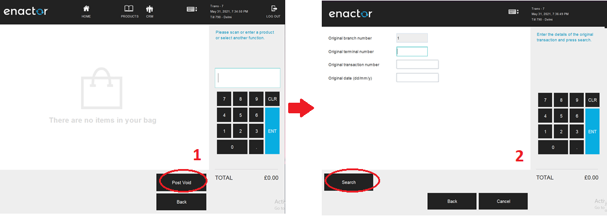

Enter search criteria and select the **Search** button again as shown on
screen 3.

Search results of the transactions will be displayed as shown on screen
4.

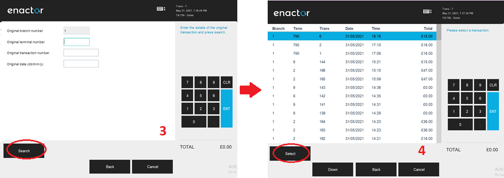

Select the transaction from the list and select the **Confirm** button,
which will result in a Post Transaction Void.

## Item Tender Void Reason Functionality

The operator after completing a transaction will be able to use the Item
Tender Void function.

Selecting the tender applied and click on the **Void Tender** button as
shown of screen 1.

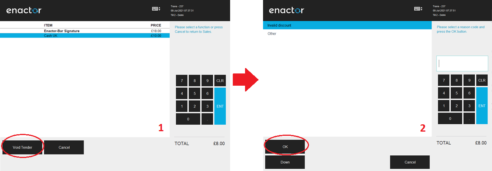

A of configured Item Tender Void Reasons are displayed to the operator
as shown on screen 2.

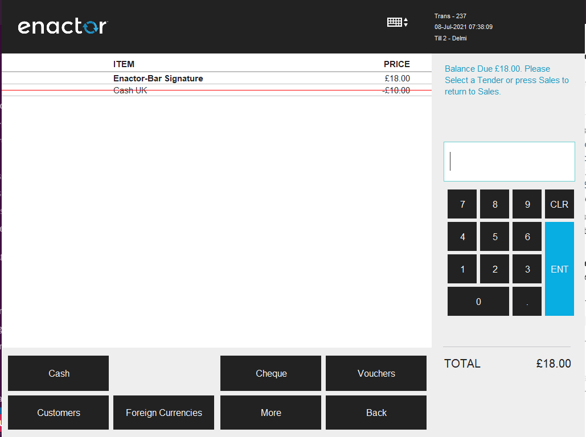

The operator can then select the applicable Reason and click **OK** to
apply the Item Tender Void function to the selected transaction.
