# Terminal Cash-up and Closing Float
# Introduction

This document provides full description of the Cash Management & Closing
Float Process in the Enactor Retail System from the Operational
perspective. It describes its purpose, its foundations and the Cash
Management Operations by which it is performed and recorded.

In the context of Cash Management Cash is monetary value in potentially
diverse physical forms, each separately identified as **Tenders**,
stored in Repositories such as the Cash Drawer of a POS Terminal, a Safe
or a Cash Box maintained by a Cashier and individually tracked by Cash
Management processing. Cash Management maintains the orderly conduct of
transfer of Cash through the business from the point of origin *via*
Repositories to the point at which Banking is done with accountability
throughout. The Cash storage Repositories are identified in the Cash
Management process as **Session Owners**.

Retail Transactions involve the transfer of cash into or out of the
business and these transfers are tracked by Enactor Retail as Expected
Totals. The management of physical cash into or out of Cash Repositories
is conducted by the Operator.

All of the movement of Cash into, out of and between Repositories not
involving Retail Transactions, or the management and accounting of Cash
within them is conducted using **Cash Management Operations**. The
details of each Cash Management Operation are recorded in a **Cash
Management Transaction**. Cash Management (CM) Transactions record the
transfer of cash throughout the business based on the CM Operations. A
diverse range of Cash Management Operations is available in the Enactor
Retail System. Not all of these Operations will be used by any given
Retail Business but rather, a selection of those available chosen to
accommodate a Cash Management Policy designed for suitability to the
manner in which the Retail Business is conducted.

The Cash Management Operations of the Enactor Retail System are of two
distinct categories: those that apply specifically to ***Safe***
Repositories and those that apply to all other types of Repositories
(those that conduct Retail Transactions -- \_***POS Terminals***,
***Cashiers*** and ***Pay Points***). Most of these Operations may be
conducted either at the POS Terminal or in the Estate Manage. Depending
on the Business Cash Management Policy some or all Cash Management
Operations may be automated or conducted by operators as part of the Day
Start/End cycle. All of the Cash Management Operations are also subject
to Permissions, which are provided for in the Roles applied to the User
Account to which the operator is Signed On. Some Permissions allow the
operator to conduct operation directly others allow the operator to
conduct operation only after

The purpose of this guide is to demonstrate the steps to configure the
POS to support Terminal Cash Up & Closing Float.

This guide will focus on the POS configuration delivered from the Estate
Manager.

## Overview

The following steps are required to enable terminal cash up and closing
float:

-   **Location** -- Setting the cash management methods and safes

-   **Cash Management Session Owners** -- Creating the terminal
    sessions.

-   **Menu** -- Adding cash up and closing float, including opening
    float function

-   **Role** -- Ensuring **POS** users have the appropriate privileges
    to carry out terminal cash up and closing float functionality

-   **Tenders** -- Enabling tenders for terminal cash up and closing
    float

-   **Reasons** -- Optional

-   **Currency** -- Configuring denominations

# Configuration Steps

## Location

Location determines a variety of aspects of software function. Location
is applied by POS Software to select other configuration, such as the
Currency, Pricing and Tax applied in transactions, Menus and Language
used to conduct them and cash management functionality.

Each distinct Geographical or logical **Location** within the estate may
be configured as a distinct and appropriate ***Location Type***,
affecting processing based on other, Location-related configuration.

Navigate to Location configuration using the Search or the path

Each of the store locations where you will be configuring the terminal
cash management should be set as follows. This would normally be done
using a location template linked to store location. The guide below will
configure the store location but the configuration for store location
template is similar.

The key tab in the Location configuration is Cash Management.

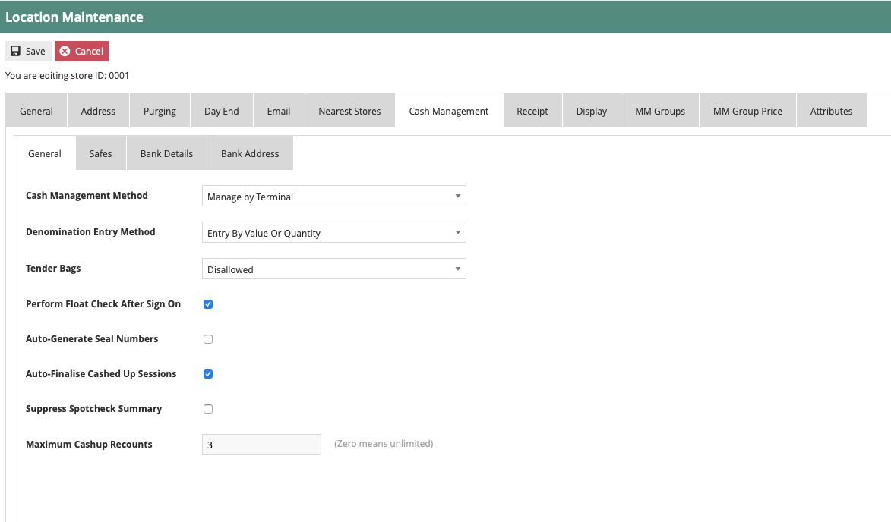

Set the appropriate values on the **Cash Management** tab as follows:

| Configuration                     | Description                                                                                                                                                                                                                                                       |
|-----------------------------------|-------------------------------------------------------------------------------------------------------------------------------------------------------------------------------------------------------------------------------------------------------------------|
| Cash Management method            | Drop down selection to manage cash management by different methods -- the key methods are                                                                                                                                                                         |
|                                   |                                                                                                                                                                                                                                                                   |
|                                   | - *Terminal:* is one to one relation between the terminal and the cash session, this is the method described in the document.                                                                                                                                     |
|                                   |                                                                                                                                                                                                                                                                   |
|                                   | - *Pay Point:* allows multiple terminals e.g. tablets to record their sales against a single shared cash session (cash drawer).                                                                                                                                   |
|                                   |                                                                                                                                                                                                                                                                   |
|                                   | - *User:* The user's sales are recorded against its own user cash session.                                                                                                                                                                                        |
| Denomination Entry Method         | Drop down selection to configure the entry method for the count, this configuration is used in other cash management event e.g. spot check and pick ups                                                                                                           |
|                                   |                                                                                                                                                                                                                                                                   |
|                                   | - *Entry by value or quantity:* The operator will be able to enter the count by quantity or value.                                                                                                                                                                |
|                                   |                                                                                                                                                                                                                                                                   |
|                                   | - *Entry by value:* The operator will be able to enter the count value.                                                                                                                                                                                           |
|                                   |                                                                                                                                                                                                                                                                   |
|                                   | - *Entry by quantity:* The operator will be able to enter the count by quantity                                                                                                                                                                                   |
|                                   |                                                                                                                                                                                                                                                                   |
|                                   | If entering by quantity the denominations for the currency will need to be configured                                                                                                                                                                             |
| Perform Float Check After Sign On | If set, when a float has not been recorded in the new cash session the operator will be prompted to add a float at sign on, the operator can bypass the message and continue. The message will continue to prompt at sign on if the float has not been completed. |
| Auto Finalise Cashed Up Sessions  | If set, it will auto finalise the session after the cash up has been completed with or without discrepancies in the count.                                                                                                                                        |
| Maximum Cash Up Recounts          | Set the maximum number of recounts before forcing the operator to accept the cashed-up count.                                                                                                                                                                     |

\*if you wish for the terminal cash up and closing float function to
move the counted totals from the terminal cash session to the safe
session, a configured safe is required against the store location.

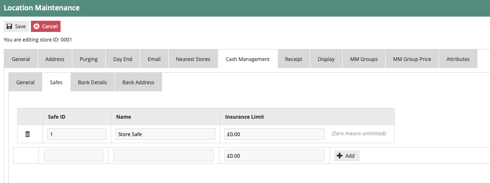

The main fields on the Cash Management \> Safe Tab are

| Entry   | Example Value | Description                                                                          |
|---------|---------------|--------------------------------------------------------------------------------------|
| Safe ID | 1             | Unique ID that is recorded in the transactions and displayed in the UI safe screens. |
| Name    | Store Safe    | Safe name.                                                                           |
This completes the location configuration.

## Cash Management Session Owner

This section describes the configuration of **Session Owners**, which
are the fundamental elements of the Cash Management model. **Session
Owners** are named Cash Repositories, which may be Safes, Cash Drawers,
POS Terminals or the person of responsibility for a User SignOn Account.

Navigate to Session Owners Configuration using the search or the path

The POS session configuration should automatically be created if the
device has been directly configured on the EM, if the device has been
imported into the enactor solution, you may need to create the terminal
session owner configuration.

Select the create new session owner function in the bottom left hand
corner.

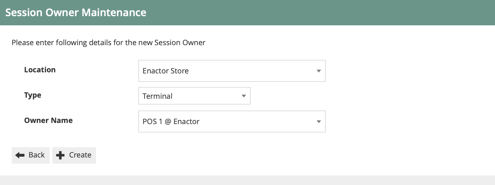

| Entry      | Example Value  | Description                                                                               |
|------------|----------------|-------------------------------------------------------------------------------------------|
| Location   | Enactor Store  | Location the terminal is linked to.                                                       |
| Type       | Terminal       | Session owner type.                                                                       |
| Owner Name | POS 1@ Enactor | If 'Terminal' Selected will provide a list of POS devices to link the terminal session to |

## Menu

**Menus** are constructed based on a set of basic tasks selected from a
**Menu Set**, which is specific to an Application, associated with a
**Menu Group** and **Role**, for access, and identified to the software
by a **Menu ID**.

Navigate to Menu Configuration using the search or the path

The Terminal Cash Management Menu provides a list of configurable cash
management events

The menu configuration required is as follows:

| Filter     | Description                                                                                                          |
|------------|----------------------------------------------------------------------------------------------------------------------|
| Menu Set   | Set to POS                                                                                                           |
| Role       | Whichever role your POS menus are assigned to. The example here is using a Role of POS Cash Management               |
| Menu Group | whichever Menu Group is configured for your POS Terminals. The example here is using a Menu Group of United Kingdom. |
| Locale     | appropriate Locale for your region. The example here is using English (UK)                                           |
| Menu ID    | Set to TERMINAL_CASH_MANAGEMENT                                                                                      |
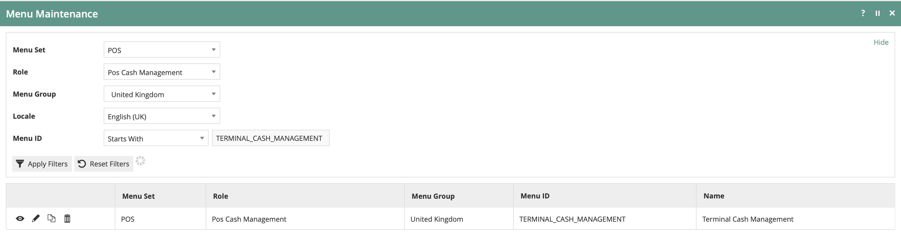

Edit the terminal cash management menu. If one does not exist for your
Role/Menu Group, then copy one from another Role/Menu Group.

There is availability for 8 button items on the menu, the last button
item should be configured as a back button to exit the menu.

If the Terminal Cash Up and Closing Float function does not exist in the
menu, highlight the Terminal Cash Management option add the functions.

Select Add \> Add a new button.

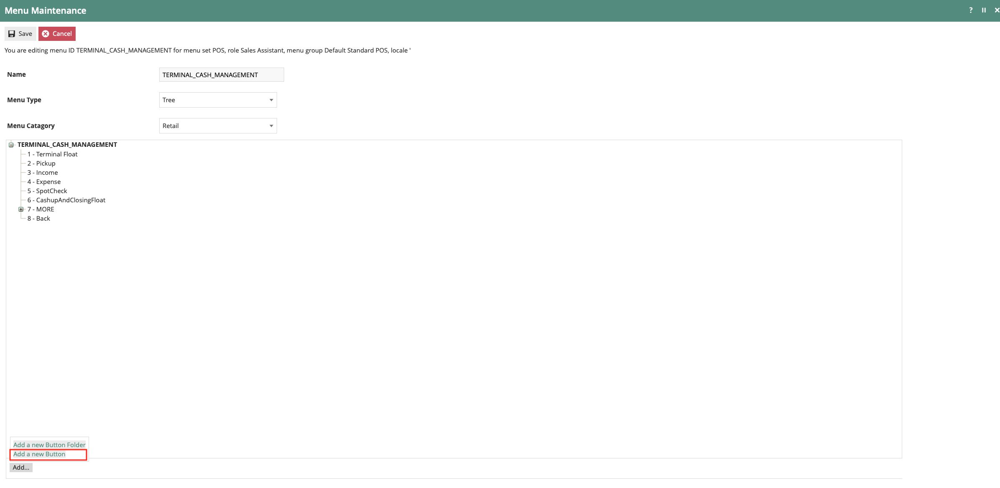

The Terminal Cash Up & Closing Float Button should be configured as
follows:

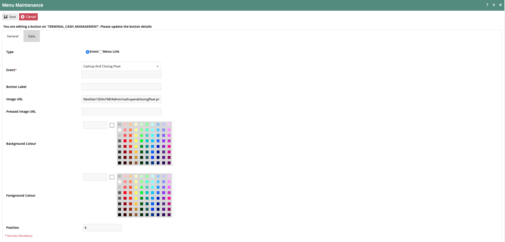

Set the values on the **General** tab as follows:

| Configuration | Description                                                                                                                                         |
|---------------|-----------------------------------------------------------------------------------------------------------------------------------------------------|
| Event         | Select Cash up and Closing Float from the drop-down selection, some of the configurations in this list will pre-populate on selection of the event. |
| Button Label  | Configure a button label if you do not have an image URL configured.                                                                                |
| Image URL     | NextGen1024x768/Admin/cashupandclosingfloat.png                                                                                                     |
| Position      | Where you want the function to be displayed on the menu.                                                                                            |

\*The terminal cash management menu can be linked to the **SALE** or
**ADMIN** menu by adding the following event **Terminal Cash
Management**

## Roles

The configuration interface used to specify User Roles facilitates the
selection of required permissions by applying a discovery process to the
Package resources of the Enactor Retail Software itself. Each Package
essentially represents a cluster of related Software Functions defined
in terms of the Processes it includes and the Functions available within
each Process. Packages may be shared by applications. Named Privileges
are associated with the individual Functions, which assert their
requirement. The required Permissions implicitly correspond to these
Privileges and provide the building blocks used to construct User Roles.

Navigate to Roles Configuration using the search or the path

Authorisation to run the specific functionality documented here are
controlled with privileges maintained in roles.

Select the appropriate role you wish to edit, the example here is using
POS_CASH_MAN

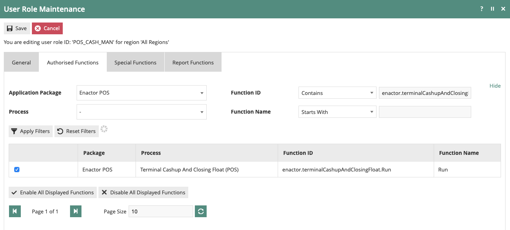

Select the enactor POS package and configure the following privileges.

| Package     | Function ID                                  | Description                                                                                                              |
|-------------|----------------------------------------------|--------------------------------------------------------------------------------------------------------------------------|
| Enactor POS | enactor.admin.Run                            | This function is only required if you link the terminal cash management menu function to the admin menu.                 |
| Enactor POS | enactor.admin.terminalCashManagement.Run     | This function is only required if you link the terminal cash management function to the admin menu.                      |
| Enactor POS | enactor.terminalCashupAndClosingFloat.Run    | Set this to allow the operator to run the terminal cash up and Closing Float function                                    |
| Enactor POS | enactor.terminalClosingFloat.Run             | Set this to allow the operator to run the terminal closing float function                                                |
| Enactor POS | enactor.cashManagement.CreateTerminalSession | If no terminal cash session has been created, this will create the session, useful for new stores and first day trading. |

\*Roles and the privileges they contain are assigned to users to be able
to control the level of access they have to the applications.

## Tender

Tenders configuration provides the means to enable and control the
conduct of payment options. Tender options are offered in a Menu and are
associated with a specific type of tendering Process, to which they
provide a specific Tenders configuration, which controls the conduct of
that Process.

Navigate to Tender Configuration using the search or the path

Edit the tenders that should be included in the terminal cash up and
closing float process, the example captured is using CASH_UK tender.

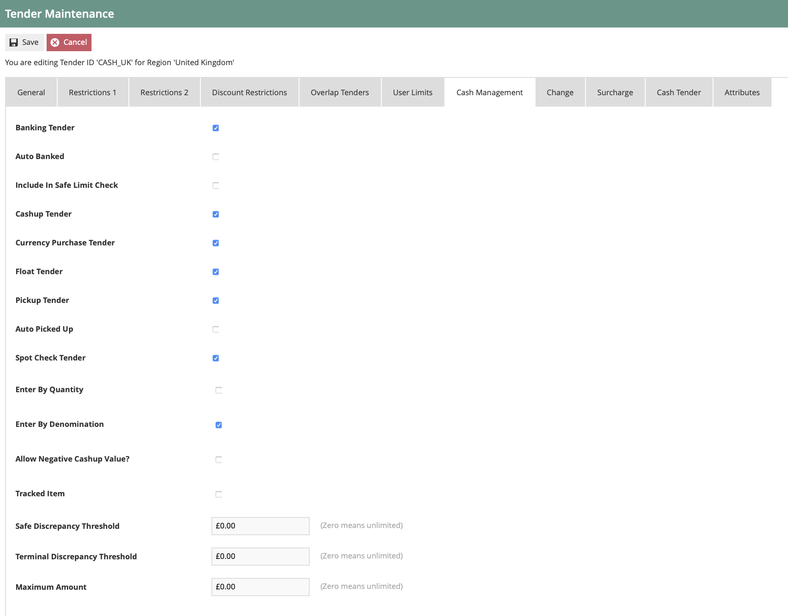

Set the values on the **Cash Management** tab as follows:

| Configuration                  | Description                                                                                                                           |
|--------------------------------|---------------------------------------------------------------------------------------------------------------------------------------|
| Float Tender                   | Select this option to include the tender in the float count                                                                           |
| Cash up Tender                 | Select this option to include the tender in the cash up count                                                                         |
| Auto Picked Up                 | Select this option if wish to have the tender included in the cash up and automatically counted e.g. gift cards, payment cards.       |
| Enter by denomination          | Select this option if you wish to have option to count the tender's denomination, requires currency -- denominations to be configured |
| Allow negative cash up value   | Only required for electronic payments e.g. cards, gift cards.                                                                         |
| Terminal Discrepancy Threshold | Prompt to be recounted if the threshold is breached during the cash up                                                                |

## Reasons

**Reason** configuration provides the means to capture and record
*Reasons* for accessing specific functions. ***Reasons*** are
pre-defined based on a **Reason Type**, which is known to and captured
by a specific function of the application. Specific Authorisation
requirements may be associated with individual ***Reasons*** and,
subject to the ***Reason Type***, a set of configuration options may be
defined specifying properties requiring values according to each Reason
Code defined.

Navigate to Reasons Configuration using the search or the path

Though it's not a mandatory requirement to have reasons for the terminal
cash up or terminal float, they can be created to add more granular
behaviour to the functions.

The example here shows a reason already configured against the United
Kingdom region and terminal cash up reason type.

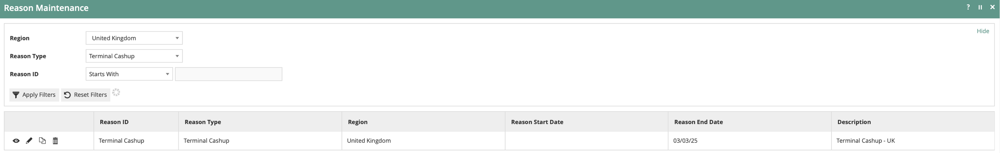

Edit the existing reason or create a new reason using reason type
terminal cash up and/or terminal float.

Add the description to the general tab and select the applicable tenders
tab

Select the applicable tender to be able to control the selectable
tenders overriding the configuration against the tender configuration.

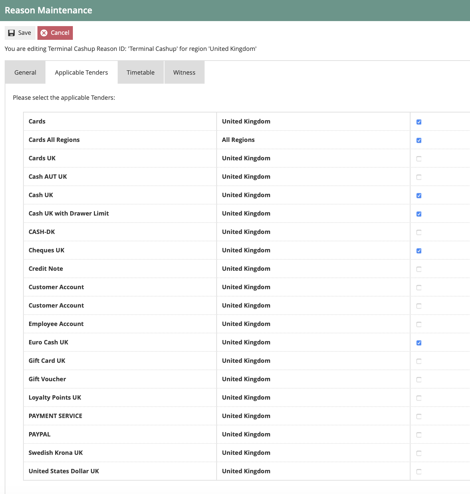

If a reason is configured it will be included in the cash management
transaction.

## Currency

**Currencies** and their *Currency Codes* and **Countries** and their
*Country Codes*, are defined as an ISO Standard and generally available
built-in to Java as part of the Java Install (although may need to be
maintained up-to-date post-install as an Administrative task).

Navigate to Currency Configuration using search or the path

If the specified tenders cash management option 'enter by denomination'
is configured, the currency linked to the tender will require the
configured denominations.

Select the country's currency that requires the denominations to be
configured, the example used here is **GBP**

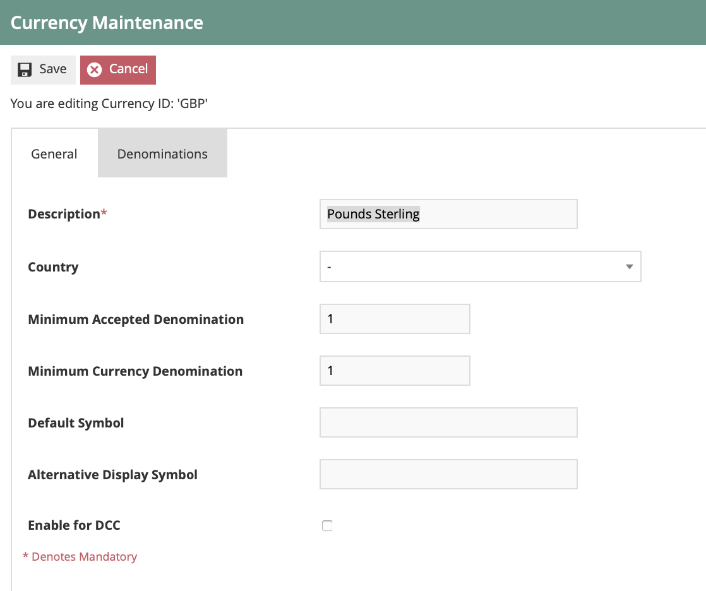

Set the values on the **General** tab as follows:

| Configuration                 | Description                                                                                                  |
|-------------------------------|--------------------------------------------------------------------------------------------------------------|
| Minimum Accepted Denomination | For my example this would be set to '1' in other countries the minimum accepted might be a higher unit value |
| Minimum Currency Denomination | For my example this would be set to '1' in other countries the minimum currency might be a higher unit value |
Select the denomination tab

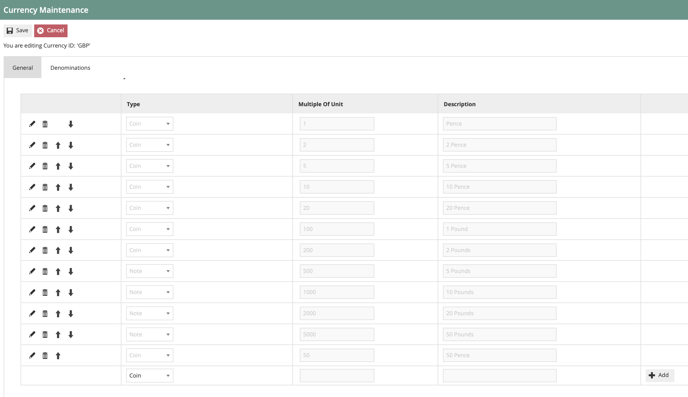

Set the values on the **Denomination** tab as follows:

| Type | Multiple Of Unit                                 | Description              | Comment                                    |
|------|--------------------------------------------------|--------------------------|--------------------------------------------|
| Coin | Denomination to unit value e.g. 50pence would 50 | Denomination description | Add a coin type for each coin denomination |
| Note | Denomination to unit value e.g. £50 would 5000   | Denomination description | Add a note type for each note denomination |
## 

## Broadcasting 

To deliver the configuration changes to the POS, broadcast the following
entities.

-   Location

-   Location Templates

-   Cash Management Session Owners

-   Menu

-   Roles

-   Tender

-   Reasons

-   Currencies

## 

##  

# POS Functionality

The operator after selecting cash up and closing float function will be
prompted to enter the closing float. If prompted, select the float
reason and press ok to continue. The operator has the option to void the
function if they wish to exit and void the process.

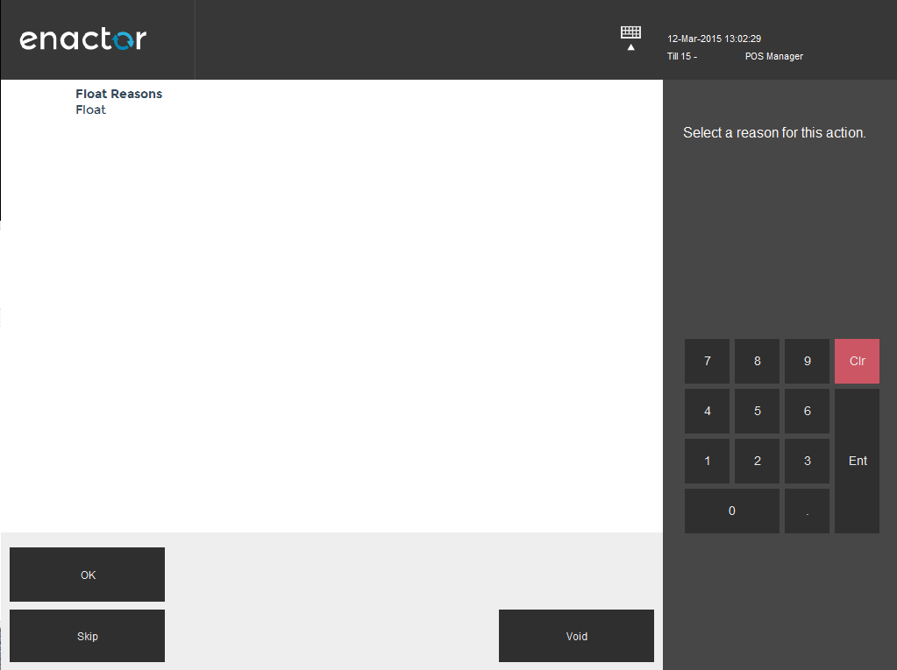

Float Reason Screen Functions:

| Function | Outcome                               |
|----------|---------------------------------------|
| OK       | Select and confirm highlighted reason |
| Voids    | Void Event                            |
| Skip     | Skip reason selection                 |
The operator will enter the cash float, selecting complete to finalise
and move onto the terminal cashing up.

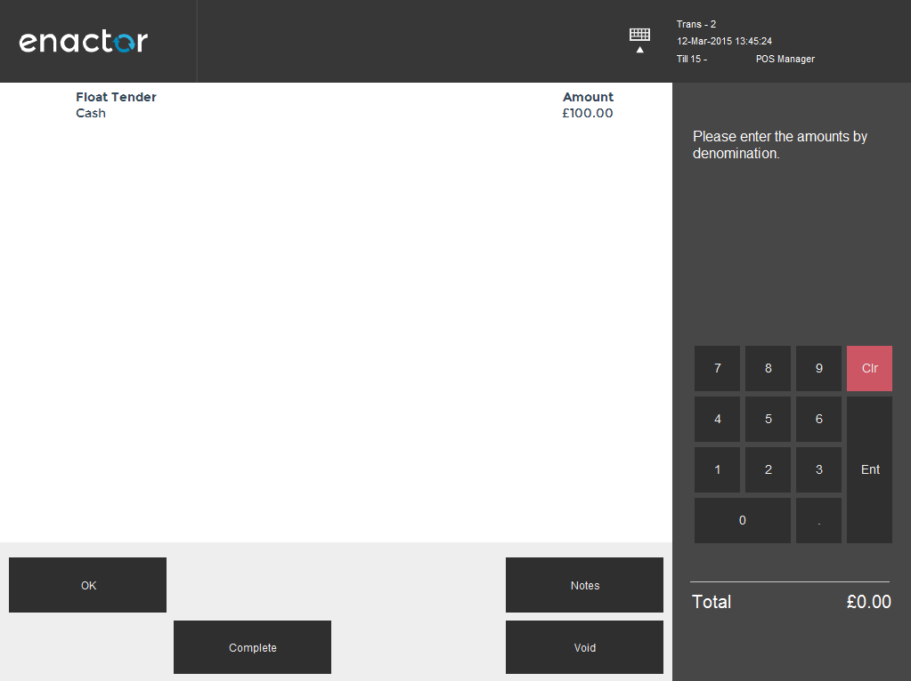{width="6.25in" height="4.6875in"}

Float Tender Screen Functions:

| Function | Outcome                   |
|----------|---------------------------|
| OK       | Select Highlighted tender |
| Notes    | Free text notes field     |
| Void     | Void Event                |
| Complete | Complete Event            |
If prompted select the terminal cash up reason and press ok to continue,
the operator has the option to void the function if a mistake was made.

Float Reason Screen Functions:

| Function | Outcome                   |
|----------|---------------------------|
| OK       | Select Highlighted tender |
| Notes    | Free text notes field     |
| Void     | Void Event                |
| Complete | Complete Event            |

Enter the terminal cash up counted tenders and press complete to
finalise. Press OK to confirm the finalise.

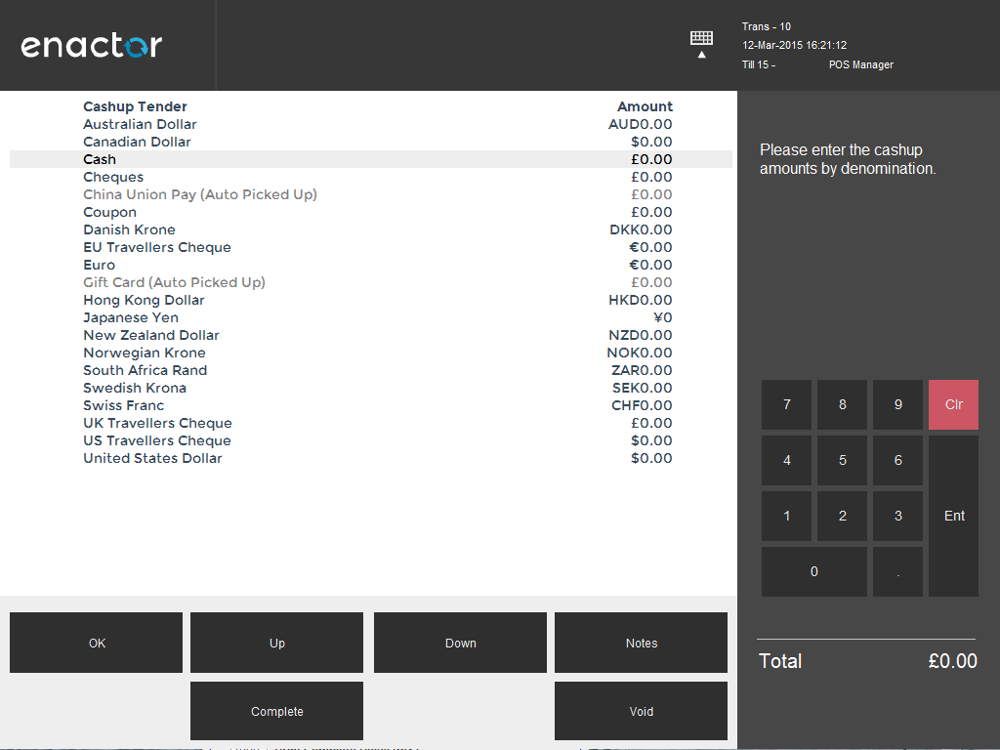

Cashing up Screen Functions:

| Function | Description.                                  |
|----------|-----------------------------------------------|
| OK       | Select Highlighted tender and enter the value |
| Up       | Moves to next line up                         |
| Down     | Moves to next line down                       |
| Notes    | Free text notes field                         |
| Void     | Void Event                                    |
| Complete | Complete Event                                |

# 

# About This Document

©2020 Enactor Ltd

All documents produced by Enactor Ltd are supplied to customers subject
to Copyright, commercial confidentiality and contractual agreements and
must not be copied or transferred without permission.

The amendment history of this document can be found in the table
below***.***

