# Configuring Coupons
# Introduction

The purpose of this guide is to provide a foundational understanding of
the options and capabilities of Coupons. The use of Coupons provides the
retailer a flexible method to issue a document or code that can be used
as a promotion trigger on a future purchase.

## Overview

The following concepts will be used to configure Coupons:

-   Product Configuration

-   Promotion Configuration

# Prerequisites

## Resources

Before starting, you should have the following resources in place:

-   Enactor Estate Manager

-   Enactor POS (configured within the UK Region, connected to the
    Estate Manager)

-   Standard Configuration, including:

    -   Base Configuration

    -   UK Retail (I have used UK in this example, but it could be other
        regional config packs.)

-   Regionally appropriate data including Product, Localisation,
    Tenders, etc.

## Prior Training/Experience

You should be familiar with the following:

-   Estate Manager configuration

-   Enactor configuration concepts, including Locations, POS Terminals,
    Products, Promotions, Tenders, Discounts etc.

-   Data broadcasting

-   Standard POS Sales processes

# Coupons

Coupons are a mechanism used to convey a discount or offer to a
customer. Historically, Coupons were a printed document that were
surrendered at the time of use but are now frequently issued digitally
or as a short code to be used during online checkout. Coupons can be
distributed externally from Enactor or issued at POS as a Promotion
Reward Type. Coupon redemption is processed through the Enactor
Promotions Engine where the Coupon Product is used as an item that is
required to qualify for the Promotion.

# Configuration

## Coupon Product

To facilitate the use of the Promotions Engine for Coupon redemption,
each Coupon is associated with a Promotional Coupon Product which is
used as a qualifying item in the redemption offer. The basics of
Promotional Coupon Product configuration mimic those of Merchandise
Product configuration.

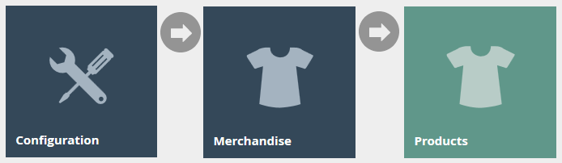

Access Product Maintenance using the Products option, obtained via the
selection sequence

shown at right, starting from the Main Menu:

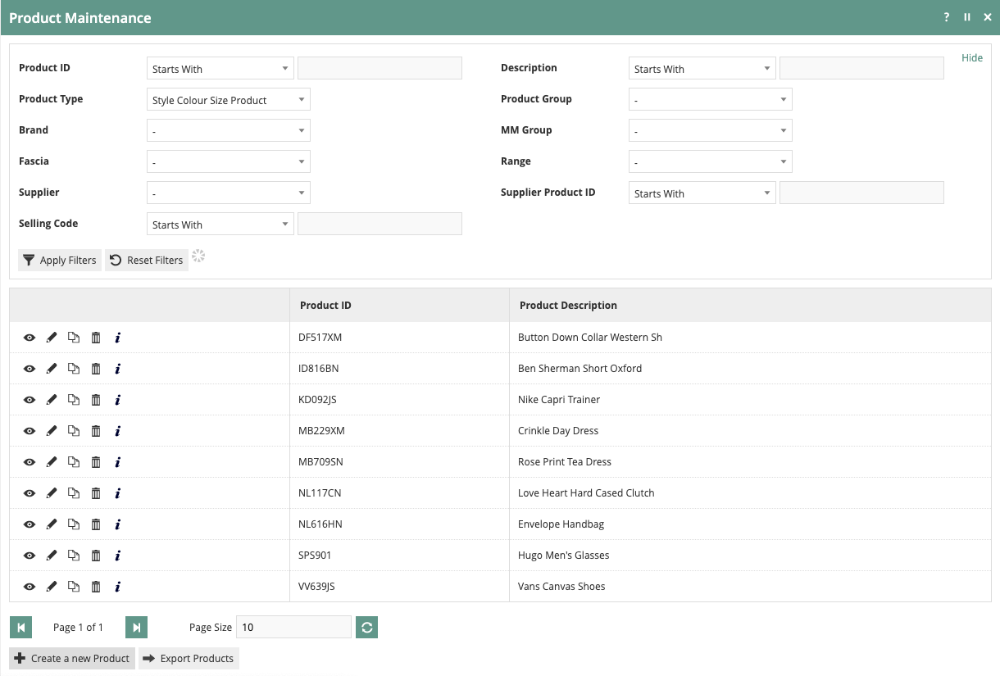

On the Product Maintenance page, select "Create a new Product".

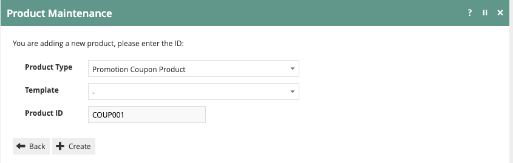

Select Promotional Coupon Product from the Product Type dropdown and
enter the desired Product ID.

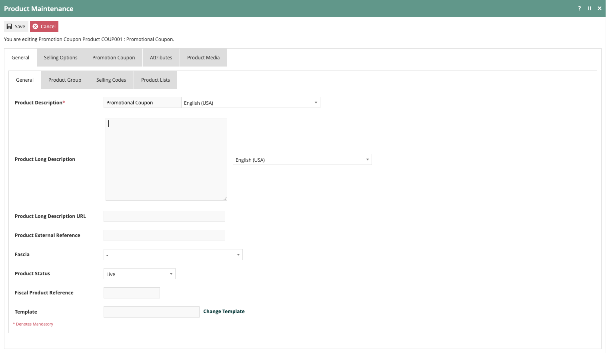

The basics of configuring a Promotional Coupon Product are the same as a
Merchandise Product which are described in the configuration guide on
Product setup. The only setting unique to the Promotional Coupon Product
type is found on the Promotion Coupon tab. Select the desired Promotion
Coupon Document from the dropdown which will be used when a Coupon is
issued from POS.

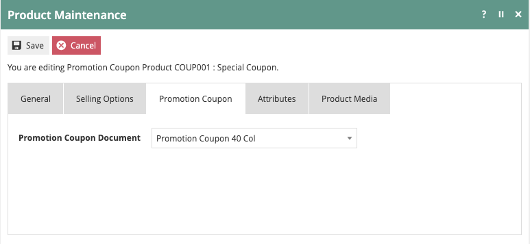

No offer-related configuration is done within the Promotion Coupon
Product setup.

It is worth noting that the Promotion Coupon Product Type supports the
use of multiple Selling Codes in the same manner as regular Merchandise
Product. A retailer may find this especially useful when setting up a
Promotion Coupon Product. While a complex Selling Code presented in the
form of a barcode may be suitable for store use, a short code can also
be assigned for use with e-commerce checkout. Additionally, retailers
can use different selling codes to represent different distribution
methodologies for the same offer. This can help the retailer understand
the various response rates without creating multiple versions of the
same offer.

## Issuing Coupons

Coupons can be issued at the POS by creating a Promotion using the
Promotion Coupon Promotion Type. The Promotion Coupon Promotion Type is
available with transaction or item-based offers. Promotion qualification
is configured in the same way as with other Promotion Types. Please
refer to the configuration guide on Promotions for more information.

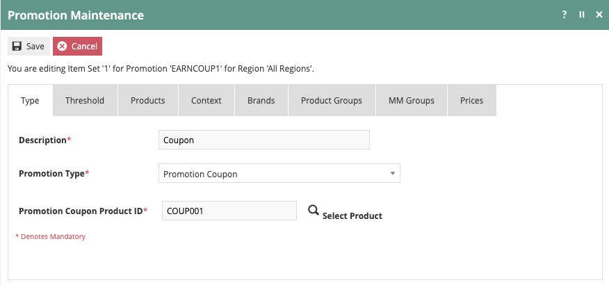

After selecting the Promotion Coupon Promotion Type, enter the
Promotional Coupon Product ID. If the ID is not known, click the
magnifying glass icon which will open Product Maintenance to facilitate
searching for the item.

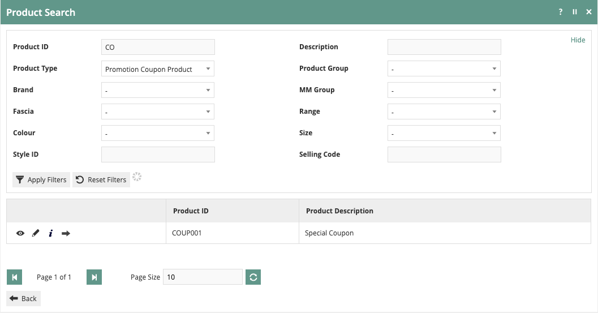

Once the Product ID has been found, click the arrow to return to the
Promotion Maintenance application and complete any remaining aspects of
Promotion configuration.

When the Promotion is triggered during a sale, a Coupon will be printed
using the Promotion Coupon Document selected during Product setup. Be
aware that since the Promotion Coupon Promotion Type does not modify any
basket items, there is no indication within POS that the offer has been
triggered. If a notification is desired, use the Force Acknowledge
Triggered Alert option along with the Triggered Alert Message in
Promotion setup on the General -- General tab.

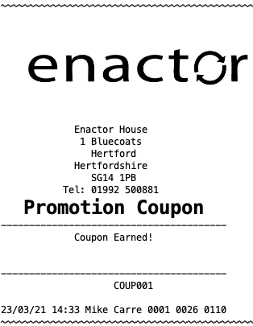

While Coupons are similar to Vouchers, one important difference is that
Coupons do not have the ability to be tracked. Since Coupons are not
tracked, they are not associated with a known Customer and will not
appear on the Rewards tab of the Customer record.

## Redeeming Coupons

Coupons are redeemed by using them as a qualifying condition on a
Promotion. This allows the maximum flexibility in determining what types
of offers can be triggered by a Coupon. A Coupon triggers an offer by
adding the Promotion Coupon Product as an Item Set within the Promotion.

To setup a Promotion to be triggered by a Coupon, begin by completing
the standard Promotion setup using Item Sets or Transaction Promotions.
For additional information about Promotions, refer to the configuration
guide on setting up Promotions.

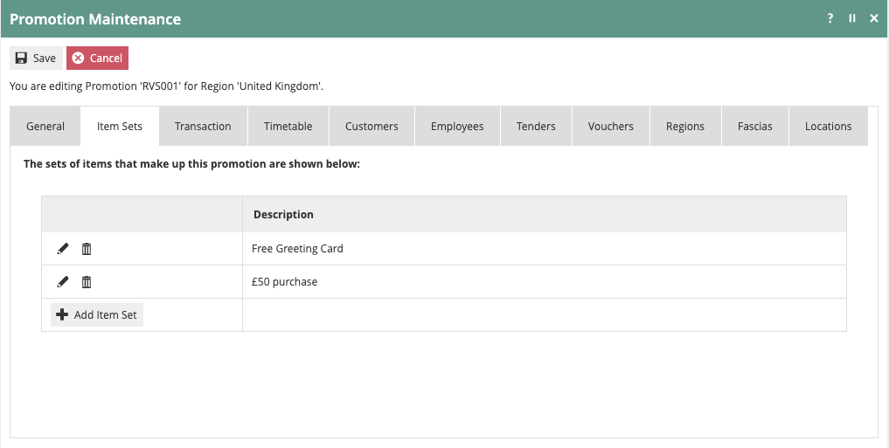

The Promotion shown above uses Item Sets and is configured to provide a
Greeting Card free when the customer spends £50.

As seen in POS, the Promotion is triggered when all items are added to
the basket:

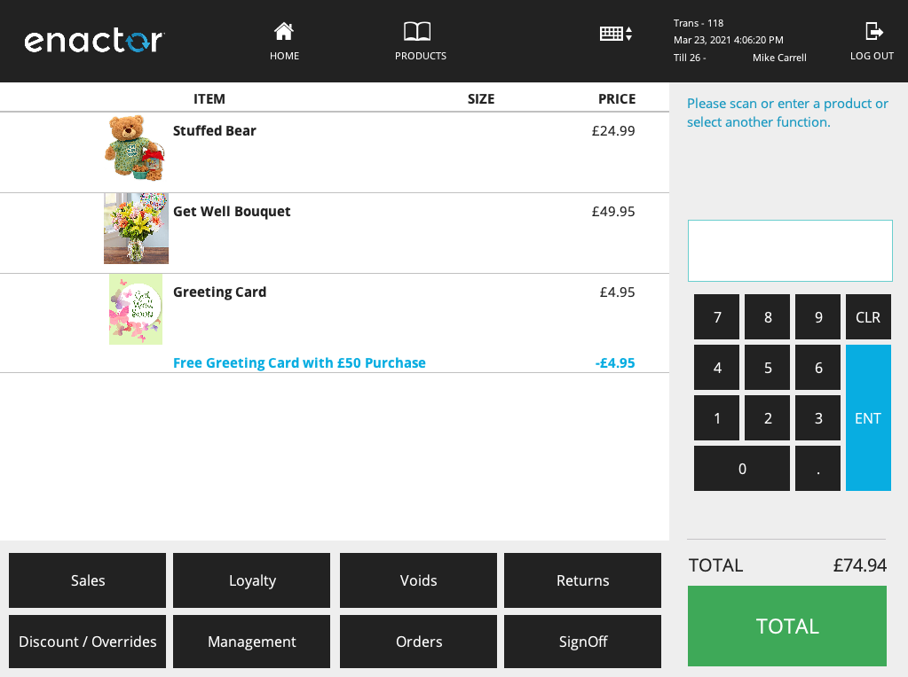

To require the Coupon, an additional item set is needed.

Click 'Add Item Set'.

When creating the Item Set, provide a meaningful Description and leave
the Promotion Type set as None.

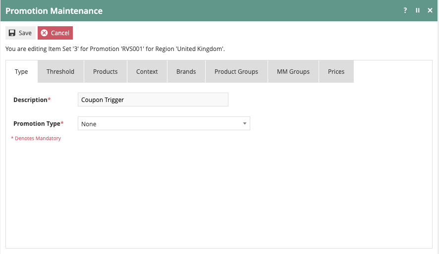

On the Threshold tab, set the Threshold Type to Count and the Threshold
Value to 1.

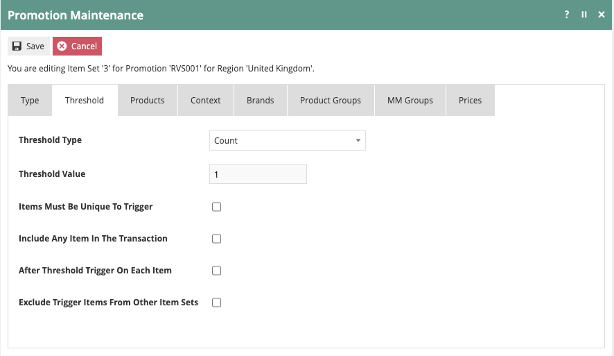

Select the Products tab to enter the Promotion Coupon Product
information.

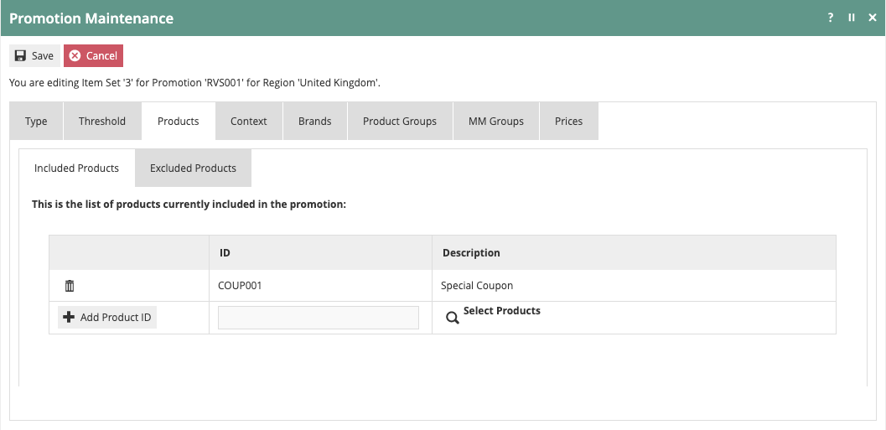

On the Included Products tab, enter the Promotion Coupon Product ID(s)
and click 'Add Product ID'. If you are unsure of the Product ID, click
on the magnifying glass to open the Product Maintenance screen and
search for the correct item. Save the Item Set and Promotion.

Now at POS, the Promotion is no longer triggered only by adding the
items:

The Promotion Coupon Product specified in the Item Set must now be added
to the transaction to trigger the Promotion.

