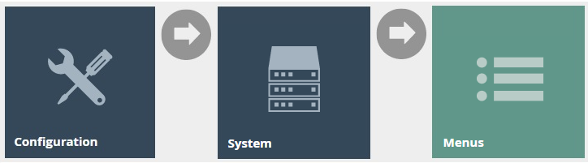

# Loyalty
# Introduction

The purpose of this guide is to show how to configure Loyalty that will
enable the user to set up their own loyalty scheme and get customers to
engage in it. This guide provides a foundational understanding of
defining and configuring a new Loyalty Scheme, creating new customers,
new customer loyalty accounts and issuing new loyalty cards. This will
further enable the user to carry out loyalty-based transactions of
loyalty customers such as capturing and redeeming points based on the
Loyalty Scheme that had been configured.

## Overview

This guide will cover the configuration for the following:

-   **Loyalty Schemes Configuration** -- Setting up loyalty tiers and
    the rules associated with them for loyalty-based transactions.

-   **Role Configuration** -- Enabling privileges and configuring the
    Sale and Tender menus to run Loyalty-based functions in the POS.

-   **Customer Loyalty Configuration** -- Setting up an IIN range,
    customer accounts, customer loyalty accounts and loyalty cards to
    carry out loyalty-based transactions based on the Loyalty Scheme
    configuration.

-   **Capturing of Loyalty Points** -- Using a loyalty customer to earn
    points from a basic sales transaction.

-   **Redeeming of Loyalty Points** -- Using the available points of a
    loyalty customer as a tender option.

# Configuration Steps

The Loyalty Scheme Configuration function provides the option to create
Loyalty Schemes that allow users to define different Loyalty Tiers and
the rules associated with them when carrying out loyalty-based
transactions. At what rate do loyalty customers earn loyalty points, at
what rate are the points redeemed, what promotion strategy is used for
calculation of loyalty and after how many points or total value spent
would the customer be able to advance to the next Tier, are examples for
some rules that are configured in the Loyalty Scheme.

Loyalty Schemes are associated with individual customer loyalty accounts
and the POS terminal. A diverse number of Loyalty Schemes may be defined
based on the requirements.

## Create a new Loyalty Scheme

To create a new Loyalty Scheme, follow the below steps.

The Loyalty Scheme Maintenance application can be accessed through:

Configuration -\> Financial -\> Loyalty Scheme

To create a new Loyalty Scheme, select **Create a new Loyalty Scheme**
on the Loyalty Scheme Maintenance page.

Enter a unique **Scheme ID** for the new Loyalty Scheme. The ID can be
alphanumeric and contain a maximum of 20 characters and will be used to
uniquely identify this new Loyalty Scheme.

{width="5.0in" height="1.78125in"}

Select **Create.**

### Loyalty Scheme -- General Tab

The General tab is the most important in configuring the Loyalty Scheme
where the Name, Tier Promotion Strategy and Loyalty Tiers are defined.

Set the appropriate values on the **General** tab as follows:

| Configuration              | Description                                                                                                                                                                                                                                                                          |
|----------------------------|--------------------------------------------------------------------------------------------------------------------------------------------------------------------------------------------------------------------------------------------------------------------------------------|
| Name                       | Enter a User-Friendly, meaningful name by which Users will be able to identify and select the Roles in other locations of the Estate Manager. The use of some systematic and business-specific naming convention is recommended. Maximum 30 alphanumeric characters.                 |
| Tier Promotion Strategy    | Select an applicable Tier Promotion Strategy from the dropdown list of four available options as follows:                                                                                                                                                                            |
|                            |                                                                                                                                                                                                                                                                                      |
|                            | - *Manual* -- The Loyalty Customer's Tier Status must be managed manually in the Web Maintenance UI.                                                                                                                                                                                 |
|                            |                                                                                                                                                                                                                                                                                      |
|                            | - *Points Balance* -- Tier Promotion is managed automatically in Transaction Processing based on the Scheme Tier configuration data. Note that when a Transaction triggers promotion the new Tier does not apply until that Transaction has been processed.                          |
|                            |                                                                                                                                                                                                                                                                                      |
|                            | - *Annual Spend* -- Tier Promotion is managed based on a different assumption about the threshold values and accumulated Annual Spend.                                                                                                                                               |
|                            |                                                                                                                                                                                                                                                                                      |
|                            | - *Custom* -- With this option selected all other options are ignored in deference to the assumption of a Custom-built mechanism implemented by or for the Enactor Customer using the Enactor Retail Toolset, which checks for and is enabled by the Custom Tier Promotion Strategy. |
| Calculate In Tier Currency | Select the checkbox to consider all calculations of this Loyalty Scheme to be done using the Currency that is defined in the Loyalty Tiers.                                                                                                                                          |
| Loyalty Tiers              | Discussed in detail below.                                                                                                                                                                                                                                                           |

To add Loyalty Tiers for this Loyalty Scheme, enter a suitable Tier Code
and select **Add.**

This will navigate the user to the **Loyalty Scheme Maintenance** of the
new Loyalty Tier that was just added.

### Loyalty Scheme -- Loyalty Tier -- General Sub-tab

In the **General Tab**, enter a name for this Loyalty Tier for which
(optionally) a Default Customer Price Group can be selected if required.

Different values for the Loyalty Tier are to be configured for each
column as shown below:

The following table details the properties of Loyalty Tier Item:

| Configuration          | Description                                                                                                                                                                                                                           |
|------------------------|---------------------------------------------------------------------------------------------------------------------------------------------------------------------------------------------------------------------------------------|
| Currency ID            | Select from a dropdown list of configured Currencies. This identifies the association with a specific Currency.                                                                                                                       |
| Points Rate            | Specify the number of basic units of the applicable currency (Eg: If Pounds Sterling, then pence) required to accrue one Point to the Customer Loyalty Account. (Eg: 100 yields One Point per Pound, 50 yields Two Points per Pound). |
| Points Reward          | Specify the number of Loyalty Points accrued to the Customer Account per Transaction.                                                                                                                                                 |
| Redeem Points Rate     | Specify the number of Loyalty Points to redeem to contribute one basic unit of the applicable currency (Eg: One Penny).                                                                                                               |
| Points Threshold       | Specify the number of Points accumulated in Total required for Promotion to the next Tier.                                                                                                                                            |
| Points Alert Threshold | Specify the number of Points accumulated in Total at which the Customer may be alerted of imminent Promotion to the next Tier.                                                                                                        |
| Spend Threshold        | Specify the amount of Total Spend accumulated by the Customer required for Promotion to the next Tier.                                                                                                                                |
| Spend Alert Threshold  | Specify the amount of Total Spend accumulated by the Customer at which the Customer may be alerted of imminent Promotion to the next Tier.                                                                                            |

The values will be added as follows for the below example:

-   **100 for Points Rate** which sets this Bronze Tier to award 1
    loyalty point for each 100 pence spent.

-   **1 for Redeem Point Rate** which sets this Bronze Tier to be able
    to redeem points at a rate where 1 loyalty point is equal to 1
    penny.

Enter the appropriate values to the new Loyalty Tier and select **Add**.

Select **Save.**

The new Bronze Tier has been successfully added to the Loyalty Scheme as
shown below:

More Tiers can be added to the Loyalty Scheme using the same method as
above and will display multiple tiers as shown below:

Note: The values of the Points Threshold column are different for each
Tier, as it is necessary for the customer to have that required number
of points for them to be able to qualify for the next Tier. Also, note
that the Points Rate and Redeem Points Rate are different in the Gold
Tier since the customers in a higher loyalty Tier should be having more
benefits.

Select **Save** to successfully add the new Loyalty Scheme.

**Broadcast the Loyalty Scheme entity** to the applicable device(s) to
use this new Loyalty Scheme.

## Configure Loyalty Scheme in the POS terminal

There are Loyalty-based configurations that can be made in the POS
terminal to increase the efficiency of using Loyalty-based functions in
the POS. To configure the POS terminal with Loyalty Scheme
configurations can be added to the POS terminal in the POS Terminal
Maintenance application.

The POS Terminal Maintenance application can be accessed through:

Configuration -\> Organisation -\> POS Terminals

In the POS Terminal Maintenance page, select the **Edit** icon of the
desired POS Terminal.

### POS Terminals -- Loyalty Tab

Set the appropriate values on the **Loyalty** tab as follows:

| Configuration                              | Description                                                                                                                                                 |
|--------------------------------------------|-------------------------------------------------------------------------------------------------------------------------------------------------------------|
| Default Loyalty Scheme                     | Select the desired Loyalty Scheme from the dropdown list selection of defined Loyalty Schemes.                                                              |
| Default Loyalty Tier Code                  | Select the desired Loyalty Tier Code from the dropdown list selection of defined Loyalty Tier Codes. These are defined in Loyalty Scheme Maintenance.       |
| Prompt for Loyalty at Start of Transaction | Select checkbox, to prompt the operator to enter loyalty information, at the start of a transaction for loyalty capture on this POS Terminal.               |
| Prompt for Loyalty at Total Pressed        | Select checkbox, to prompt the operator to enter loyalty information, at the Total Pressed stage of a transaction for loyalty capture on this POS Terminal. |
| Offer Loyalty Card                         | Select checkbox, indicate that a Loyalty card should be offered at the Total Pressed stage of a Transaction, if the there is no Loyalty Customer captured.  |

Select **Save.**

**Broadcast** the **POS Terminal entity** to the desired device(s) to
use the above Loyalty functions on POS.

# Role Configuration

For the users of Loyalty functions, specific Loyalty-based privileges
and menu configurations must be configured to access the Loyalty
functions in the POS. This section lists the privileges and menu
functions that are specific to Loyalty.

## Privileges Configuration

The User Role Maintenance application can be accessed through:

Configuration -\> HR -\> User Roles

In the User Role Maintenance, select the **Edit** icon of the desired
User to enable the privilege for.

Navigate to the **Authorised Functions tab** of that selected User and
apply the following filters:

Application Package \> Enactor POS

Function ID \> Contains, loyalty

This lists the privileges that are required to access some of the
Loyalty-based functions:

| Package     | Process                       | Function ID                                      | Function Name                                      |
|-------------|-------------------------------|--------------------------------------------------|----------------------------------------------------|
| Enactor POS | Add Loyalty Points            | enactor.pos.AddLoyaltyPointsAllowed              | Add Loyalty Points Allowed                         |
| Enactor POS | Add Loyalty Points            | enactor.pos.AuthorisesAddLoyaltyPoints           | Authorises Add Loyalty Points                      |
| Enactor POS | Claim Customer Loyalty Points | enactor.pos.ClaimLoyaltyPointsAllowed            | enactor.pos.ClaimLoyaltyPointsAllowed              |
| Enactor POS | Claim Customer Loyalty Points | enactor.pos.AuthoriseClaimLoyaltyPoints          | enactor.pos.AuthoriseClaimLoyaltyPoints            |
| Enactor POS | Display Loyalty Account       | enactor.pos.AllowLoyaltyDetailsPrint             | Allow loyalty details print                        |
| Enactor POS | Do Capture Loyalty Account    | enactor.pos.VoucherRedeemInCaptureLoyaltyAllowed | Redeem Customer Voucher in Capture Loyalty Allowed |
| Enactor POS | Issue New Loyalty Card        | enactor.pos.LoyaltyGenerateCardNumberAllowed     | enactor.pos.LoyaltyGenerateCardNumberAllowed       |
| Enactor POS | Issue New Loyalty Card        | enactor.pos.LoyaltyIssueNewCardAllowed           | Issue New Loyalty Card Allowed                     |
| Enactor POS | Issue New Loyalty Card        | enactor.pos.AuthorisesLoyaltyIssueNewCard        | Authorises Issue New Loyalty Card                  |
| Enactor POS | Loyalty Account Tender        | enactor.pos.LoyaltyAccountTenderAllowed          | Loyalty Account Tender Allowed                     |
| Enactor POS | Loyalty Account Tender        | enactor.pos.AuthorisesLoyaltyAccountTender       | Authorises Loyalty Account Tender                  |

Ensure that the selected User has the required privileges enabled by
ticking on the necessary functions that are listed.

Select **Save**.

Now the user will be able to carry out all Loyalty-based functions in
the POS.

## Menu Configuration

To run the Loyalty-based functions in the POS, the menu should be
configured with the functions that are required by the user.

The Menu Maintenance application can be accessed through:

Configuration -\> System -\> User Roles

Select the appropriate menu (E.g., Sales Menu) that the Loyalty-based
functions are to be added.

### Loyalty Basic Menu Functions

The basic functions of Loyalty can be configured in the existing Sales
menu by adding a new folder named **Loyalty** and configuring the menu
functions as required under this folder.

Following is an example of a configured Sales Menu which contains all
the basic Loyalty functions:

Following is an example of the **Customer Loyalty Account Enquiry**
event of this menu:

Following are the details of the Loyalty-based events that can be
configured:

| Event Name                       | Description                                                                                                                                     | Privileges                                 |
|----------------------------------|-----------------------------------------------------------------------------------------------------------------------------------------------------|--------------------------------------------|
| Capture Loyalty                  | Allows the user to capture the customer as a Loyalty customer in the current transaction.                                                           | No privileges are required.                |
| Customer Loyalty Account Enquiry | Allows the user to enquire the details of an existing customer Loyalty account.                                                                     | enactor.pos.Custo merLoyaltyEnquiryAllowed |
| New Loyalty Account              | Allows to user to create a new Customer Loyalty account using the POS.                                                                              | enactor.pos.Lo yaltyIssueNewCardAllowed    |
| Add Loyalty Points               | Allows to manually add Loyalty Points, for the current transaction using the POS, using the "Add Loyalty Points" reasons that have been configured. | enactor.pos .AddLoyaltyPointsAllowed       |

The usage of some of these events is demonstrated in latter sections of
this guide.

### Loyalty Tender Menu Functions

Redemption of Loyalty points can be done as a Tender option in the POS
by configuring the Tender menu. Before making configurations in the menu
itself, a Tender for this purpose must be configured. Configuring
Tenders is covered in a separate How-to guide. Once a Tender is
configured, navigate to the Menu Maintenance application, and select the
Tender menu that you wish to add the Loyalty tender option to.

Following is an example of a configured Tender Menu which contains
Customer Loyalty:

Following is an example of the **Loyalty Account** event of this menu:

Once the Loyalty Tender has been configured in the Tender Maintenance,
the **Loyalty Account Tender** button should be configured to use the
Loyalty Tender that has been configured.

To do this, click on the Data tab of the Loyalty Account Tender button
and select from the dropdown the Loyalty Tender that has already been
configured in the Tender Maintenance and click on Add as follows:

This would allow the user to select the option of using loyalty points
to redeem for the current transaction as a tender option in the tender
menu.\
**Note:** Make sure that the "enactor.pos.LoyaltyAccountTenderAllowed"
privilege has been assigned to the user to allow Loyalty Account Tender.

The usage of this menu event is demonstrated in a latter section of this
guide.

# Customer Loyalty Configuration

To use the Loyalty Scheme that was configured, a customer, a customer
loyalty account and a customer loyalty card must be created. Before
creating a customer loyalty card, the IIN range for the customer loyalty
card must be configured to ensure that the card is identified as a
loyalty card which is associated with the loyalty scheme created.

## Create a new IIN Range

To create a new IIN Range follow the below steps:

The IIN Range Maintenance application can be accessed through:

Configuration -\> Financial \> IIN Ranges

{width="6.5in" height="2.68125in"}

To create a new IIN Range, select **Create a new IIN Range** on the IIN
Range Maintenance page.

Enter a **Start** and **End IIN Range** for the new customer loyalty
card which will be a fixed value that indicates what type of card.

Enter the **Minimum** and **Maximum PAN Length** of the card.

According to the following configurations set, the card starting with
the four digits "1212" and has a length of 8 digits is considered as a
Customer Loyalty Card.\
E.g.: 12120001

Select **Create.**

### IIN Range -- General Tab

The General tab captures the basic information of the new IIN Range.

Set the appropriate values on the **General** tab as follows:

| Configuration       | Description                                                                                                                                                     |
|---------------------|-----------------------------------------------------------------------------------------------------------------------------------------------------------------|
| Card Description    | Enter a User-Friendly, meaningful description by which to identify the Card Range in other locations of the Estate Manager. Maximum 40 alphanumeric characters. |
| Issuer Description  | Enter a User-Friendly identification of the Card Issuer. Maximum 40 alphanumeric characters.                                                                    |
| No LUHN Check Digit | Checkbox, if true indicates that no LUHN check should be applied to this IIN Range (Last digit must otherwise conform to LUHN Check calculation).               |
| Country             | Select from a dropdown list of all configured Countries.                                                                                                        |
| Currency            | Select from a dropdown list of all configured Currencies.    
                                                                                                   |
### IIN Range -- Track Data Tab

The **Track Data** Tab is used to configure how the data of the card is
to be read.

Enter the value 2 for the Track Field, the PAN Length for the Length
field and tick the Keyable option as shown below:

### IIN Range -- Applicable Cards

The **Applicable Cards** Tab is used to configure the card related
configurations for this IIN Range.

Make sure to tick on the Loyalty Card and Online Update checkboxes as
shown below:

Set the appropriate values on the **Applicable Cards** tab as follows:

 | Configuration | Description                                                                        |
|---------------|------------------------------------------------------------------------------------|
| Loyalty Card  | Select checkbox, to enable the card for use as a Loyalty Card.                     |
| Online Update | Select checkbox, to enable online update of loyalty accounts. It defaults to true. |

Select **Save** to successfully add the new IIN Range.

**Broadcast** the **IIN Range entity** to the desired device(s) to use
this new IIN Range to create new Customer Loyalty Cards.

## Create a new Customer, Customer Loyalty Account and Customer Loyalty Card

Following setting up a loyalty scheme and an IIN range for the customer
loyalty card, a customer, a customer loyalty account, and a customer
loyalty card must be created. This can be done on the New Loyalty
Account function in the POS:

1.  Navigate to Sales -\> More -\> Loyalty and use the **New Loyalty
    Account** function in the menu.

2.  **Enter a new Customer Loyalty Card number** which is within the IIN
    range that has been configured in the previous section
    (Eg:12120001, 12120002) This will be the new loyalty card that will
    be issued for the new loyalty customer and will be associated with
    both the new customer account and the customer loyalty account.

3.  **Enter the basic identification details** of the new customer
    account and select **OK**.

4.  **Enter the address details** of the new customer account and select
    **OK**.

1\. 2.

3\. 4.

5.  **Enter the contact details** of the new customer account and select
    **OK**.

6.  At this stage, the right loyalty scheme must be selected in
    association with this new customer account to a new customer loyalty
    account. Select the **Loyalty Scheme** and the **Loyalty Tier** to
    be applied to this customer and select **OK**.

7.  If the new customer, customer loyalty account and the loyalty card
    have successfully been created; the loyalty customer's details will
    be displayed as shown below:

5\. 6.

7\.

This new Loyalty Customer is now ready to carry out Loyalty-based
transactions such as capturing and redeeming of Loyalty points.

# Capturing of Loyalty Points

Once a new customer is created who is associated to both a customer
loyalty account and a loyalty card, sales transactions can be performed
to capture loyalty points based on the Loyalty Scheme defined. Following
steps describe of how to execute this using the POS:

Before or after adding products to the basket, the loyalty customer must
be added to captured loyalty points.

1.  Navigate to Sales -\> More -\> Loyalty and use the **Capture
    Loyalty** function in the menu.

2.  The user will be prompted to enter a loyalty card number. **Enter
    the loyalty card number** and select **OK.**

3.  Alternatively, select the **Search By Name** button.

4.  The following screen will be displayed to confirm the Loyalty
    account. Select **OK** to confirm.

5.  If the Loyalty account is successfully added, and it is ready for
    capture, the loyalty customer's details will be displayed along with
    the points earned from the products in the basket.

1\. 2.

3\. 3.

4\. 5.

6.  Select **Total** and complete the tender of this transaction. The
    customer loyalty account details will also be visible in the receipt
    as shown below:

This is another way to verify that the captured loyalty customer has
points added to their loyalty account based on the loyalty scheme
configured.

# Redeeming of Loyalty Points

After Loyalty Customers have earned points to their Loyalty Accounts,
they are able to redeem their available points as a tender option to pay
for transactions. The rate at which these points can be redeemed is
configured in the Loyalty Scheme that is defined. Following are the
steps to redeem loyalty points during a transaction in the POS:

1.  After adding the products to the basket, select on the **Total**
    function to navigate to the Tender menu. The available tender
    options will be displayed as shown below. Select **Customers**.

2.  Select the **Loyalty Account** button to select the loyalty account
    that the user wishes to redeem points from.

3.  The user will then be asked to enter a loyalty card number. **Enter
    the loyalty card number** or **Search by Name** as done when
    Capturing Loyalty. Select **OK**. The user will then be navigated to
    a screen that will request for the amount that the customer wishes
    to redeem from the loyalty account. **Enter the amount** the
    customer wishes to redeem and select **OK**.

4.  If the loyalty account and redeemed the point have been successfully
    added, the loyalty customer's details will be displayed along with
    the points redeemed.

1\. 2.\

3\. 4.

5.  Once Cash or any other tender option is selected to complete the
    tender of this transaction, the customer loyalty account details
    will also be displayed in the receipt as shown below:

This is another way to verify that the points have been redeemed from
the customer loyalty account based on the loyalty scheme configured.
