# Promotions 
# Introduction

The purpose of this guide is to provide a foundational understanding of
the options and capabilities available when designing Promotions. The
Enactor Promotions Engine is extremely powerful and flexible while
remaining easy to manage. The Enactor Promotions Engine provides nearly
limitless capabilities when defining offer qualifications and rewards.

## 

## Overview

All activity required to define and configure a new offer is completed
within the Promotions Maintenance application. However, offer behaviour
can be influenced by additional factors such as Regions, Locations, MMG
hierarchy, Brands, Product Groups, Loyalty Programmes and many others.
Therefore, a system should be fully configured and loaded with all
master data before proceeding with Promotions setup.

# Prerequisites

## Resources

Before starting, you should have the following resources in place:

-   Enactor Estate Manager

-   Enactor POS (configured within the UK Region, connected to the
    Estate Manager)

-   Standard Configuration, including:

    -   Base Configuration

    -   UK Retail (I have used UK in this example, but it could be other
        regional config packs.)

-   Regionally appropriate data including Product, Localisation,
    Tenders, Vouchers etc.

-   Customer configuration including Loyalty, Tiers and Groups

## Prior Training/Experience

You should be familiar with the following:

-   Estate Manager configuration

-   Enactor configuration concepts, including Locations, POS Terminals,
    Products etc.

-   Data broadcasting

-   Standard POS Sales processes

# Promotion Fundamentals

## Nature of the promotion

The Enactor Promotions Engine categorizes all promotions into one of two
types: either Transaction Level or Item Level. Transaction Level
Promotion rewards are applied against the entire transaction. Item Level
rewards are applied to specific items or groups of items in a
transaction.

## Promotion Trigger

Transaction Level Promotions are triggered by the entire transaction
meeting the qualifying threshold (value, quantity, points, etc.).
Additional Inclusion/Exclusion rules can be imposed for attributes such
as Loyalty Membership, Customer Segment, Regions, Location and more.

## Item Set Inclusion/Exclusion

Item Level promotions are triggered by meeting the qualifying threshold
(value, quantity, points, etc.) of a particular item or group of items
within the transaction. As with Transaction Level Promotions, additional
Inclusion/Exclusion rules can be imposed for attributes such as Loyalty
Membership, Customer Segment, Regions, Location and more.

## Promotion Reward

When a Promotion is triggered, a Reward is provided. The specific type
and value of the Reward are defined as part of the Promotion
Configuration. A large number of Reward types are supported including
Discounts, Vouchers, Free Items, Fee Override, Gift Cards and others.

## Manner of Application

The manner in which a Reward is applied is defined through configuration
and is specific to the Promotion. This includes the ability to define
how the Reward behaves during returns and how it interacts with other
Promotions, Discounts and Overrides.

## Promotion Timetable

Promotions are typically effective over a specific range of dates.
Beginning and ending dates can be specified for each offer. Promotions
can also be limited to be active only during specific times of the day
and/or on specific days of the week.

# Configuration

Enactor supports multiple Promotion types, rewards, application methods,
qualification and include/exclude criteria. This guide focuses on the
core concepts which can then be replicated across numerous variations.
For a detailed account of all available options, please refer to the
full Enactor Application Configuration book.

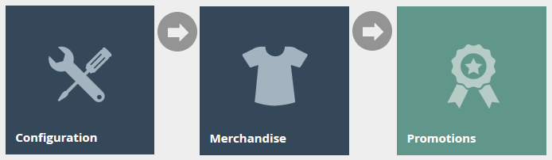Access Promotions using the Promotions
option, obtained via the selection sequence shown at right, starting
from the Main Menu:

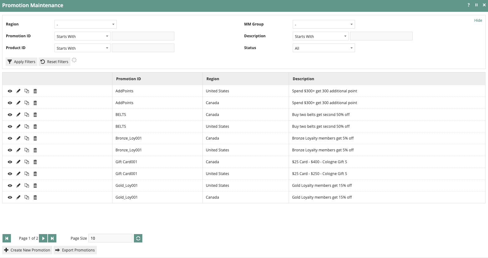

On the Promotion Maintenance page, select "Create a new Promotion".

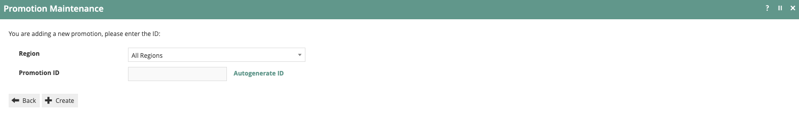

If the Promotion is being created for a specific Region, select it from
the list. Otherwise, it can be left as "All Regions". Each Promotion
must have a unique Promotion ID per Region. This can be automatically generated if one is not specified.

## Manner of Application

Numerous tabs are displayed within Promotion Maintenance. The options
displayed on the General tabs primarily impact how the Promotion is
applied.

#### 

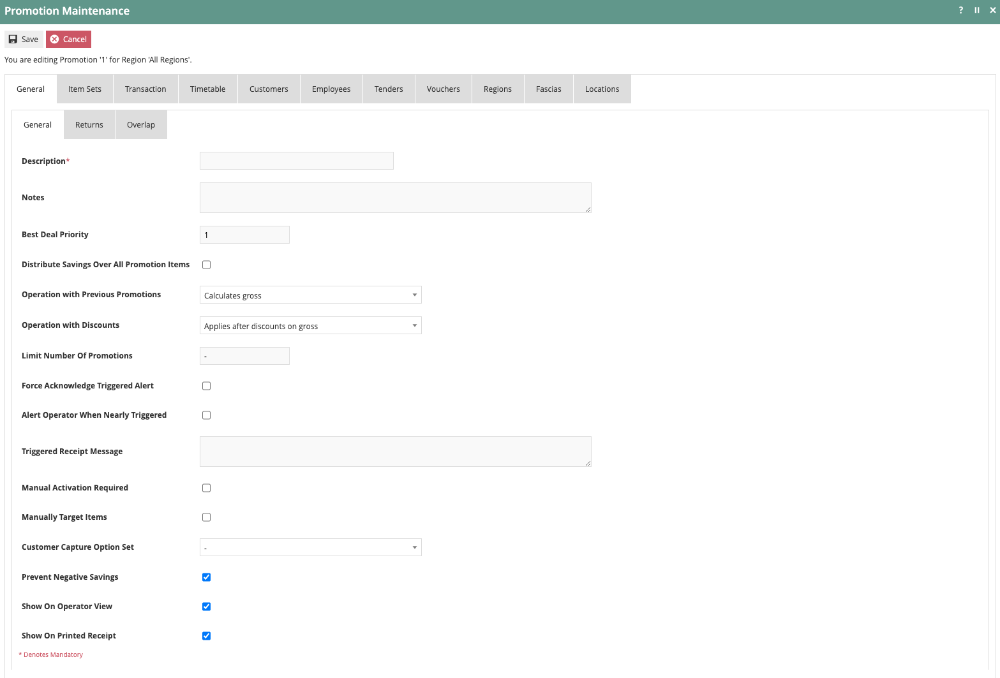

On the General -- General tab, a Description is required for the
Promotion. This is the Description that will be shown on the operator
display and receipt when the promotion is triggered. The Notes field is
provided to allow a more detailed description of the Promotion for
internal reference. The Notes are not visible to the cashier or
customer.

When multiple combinations of Promotions could be applied to a
transaction the Promotions Engine uses Best Deal Logic to select the
combination that results in the highest discount to the customer. If a
retailer wishes to override the Best Deal Logic and force certain
Promotions to be chosen over others, the behaviour can be manipulated by
applying a Best Deal Priority. This feature should be used only when
absolutely necessary as it may result in unexpected results especially
in highly promotional environments.

When setting up Item Level Promotions, it is possible to have multiple
Item Sets. Some Item Sets may have a reward associated while other Item
Sets only exist for qualification. As an example, a Promotion may be
defined to discount items 10% from merchandise category 'B' if the
customer spends at least £20 on items in merchandise category 'A'. Under
normal circumstances, the transaction XML in this example would only
show a discount applied to items from merchandise category 'B' even
though the items in merchandise category 'A' were technically part of
the promotion. If the option to "Distribute Savings Over All Promotion
Items" is selected, the transaction XML would then show the total
discount amount distributed proportionally across the items from both
merchandise categories. This option has no impact on the amount of
discount given and is transparent to the cashier and customer. This
change is made only to comply with the retailer's accounting practices.

If a Promotion is allowed to overlap with other Promotions or Discounts,
selections should be made for "Operation with Previous Promotions" and
"Operation with Discounts". The available selections will determine when
the promotion can apply and if it should calculate using gross or net
price.

If a promotion can only be used a certain number of times within a
single transaction it should be specified in the "Limit Number of
Promotions" field. If no entry is made, the Promotion will trigger as
many times as needed.

There may be circumstances where it is appropriate to alert the operator
that a particular Promotion has been triggered and require their
acknowledgement. Selecting "Force Acknowledge Triggered Alert" will
result in a pop-up message being displayed when triggered. When this
option is selected, an additional input field is displayed on the form
for the "Triggered Alert Message" to specify the message sent to the
operator.

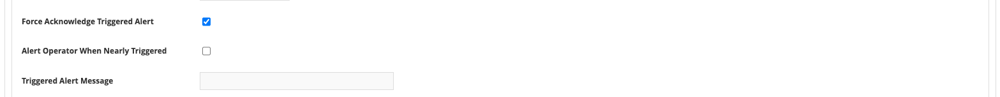

Similarly, it is possible to "Alert Operator When Nearly Triggered"
indicating the customer has almost qualified for a Promotion. This is
frequently used to entice the customer to make additional purchases if
they are close to qualifying for a reward. When this option is selected,
an additional input field is displayed on the form for the "Near Miss
Alert Message" to specify the message sent to the operator.

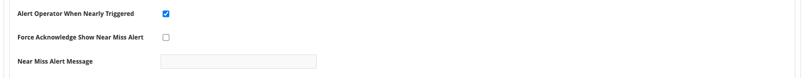

If the Promotion is set to "Alert Operator When Nearly Triggered" an
additional threshold will be defined to specify when this alert should
be sent. Thresholds are reviewed later in this document.

The General -- Returns tab controls atypical Promotion behaviour during
return transactions. These settings do not need to be changed to
accommodate normal return transactions. If a receipted return is done on
a transaction that has been reduced by a promotion, that will
automatically be included in the refund.

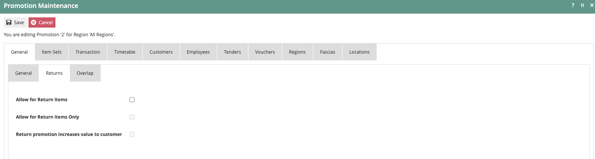

In some cases, items may be qualifiers for multiple Promotions and
capable of triggering multiple offers in a transaction. Promotions with
some number of common qualifying items are said to Overlap. Retailers
have differing policies on Promotions with some allowing the customer to
claim all rewards possible while others stipulate that an item can only
be used once to qualify for a Promotion. Some retailers, with very
complicated promotional schemes, allow the overlapping of some
promotions while restricting others. The General -- Overlap tab permits
full control of how the promotions should interact together.

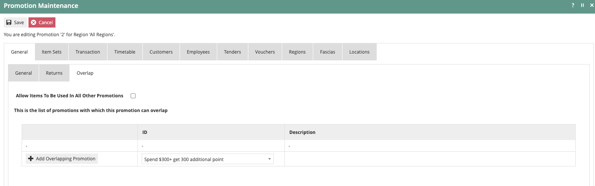

To allow the items involved with this Promotion to be used in all other
eligible Promotions, the "Allow Items To Be Used In All Other
Promotions" option should be selected. When this option is selected, the
dropdown selector to add individual Promotions is removed. If the
Promotion is only allowed to Overlap with a limited number of other
Promotions, they should be selected from the ID dropdown and added to
the list individually using the "Add Overlapping Promotion" button. To
disallow all Overlap, the "Allow Items To Be Used In All Other
Promotions" option should be unselected and no Promotions should be
added to the list of Promotions allowing Overlap.

## Promotion Timetable

Typically, Promotions are active for a limited time. Managing when a
Promotion is valid is accomplished on the Timetable tab.

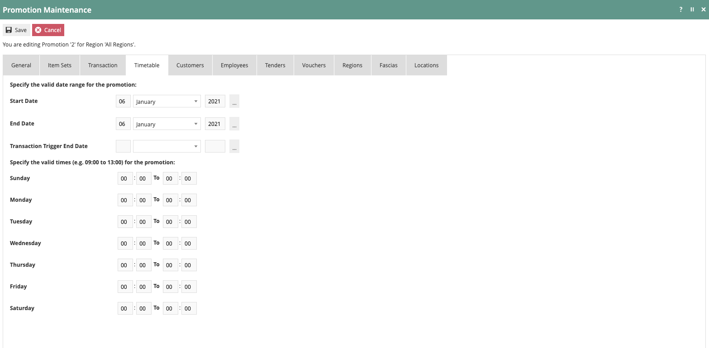

Promotions can be setup and broadcast in advance of their active dates
by designating the Promotion Start Date which is the first day the
Promotion is active. The Promotion End Date signifies the last day that
the promotion is active. By using the Transaction Trigger End Date, it
is possible to stop the promotion from triggering automatically but
remain available for manual activation. If no dates are specified, a
Promotion will be active immediately upon broadcast and remain active
until an End Date is supplied or the Promotion is removed.

By specifying Valid Times for the Promotion, it is possible to create a
Promotion that is only valid on certain days of the week and/or times of
day.

## Additional Inclusion/Exclusion Criteria

In addition to Timetable, there are several other factors that can
influence the validity of a Promotion. The Customers tab provides
Include/Exclude options based on Customer.

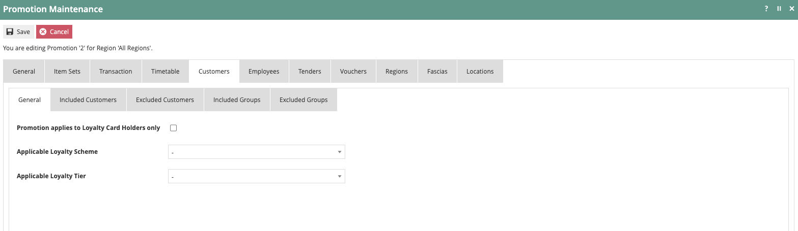

The Customers -- General tab includes the options to restrict the
Promotion to Loyalty members. This is accomplished by selecting the
"Promotion applies to Loyalty Card Holders only" option. In the event
that the retailer has multiple Loyalty Schemes or Tiers, they can also
be specified using the drop-down selectors.

The Customers -- Included Customers and Customers -- Excluded Customers
allows the direct entry of individual customers to be Included or
Excluded from the Promotion. To add a Customer to either list, simply
enter the customer number and then click "Add Customer Number".

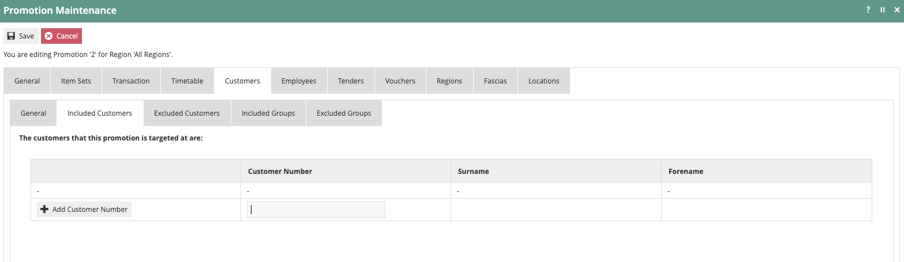

Similarly, the Customers -- Included Groups and Customers -- Excluded
Groups tabs allow the Inclusion or Exclusion of specific Customer
Groups. To add a Customer Group to either list, select the desired Group
from the dropdown and click "Add Customer Group".

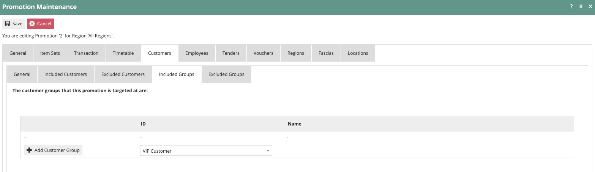

Employee Sales are covered in detail in a separate How to Guide. On the
Employees tab it is possible to control a Promotion's validity within an
Employee Sale Transaction.

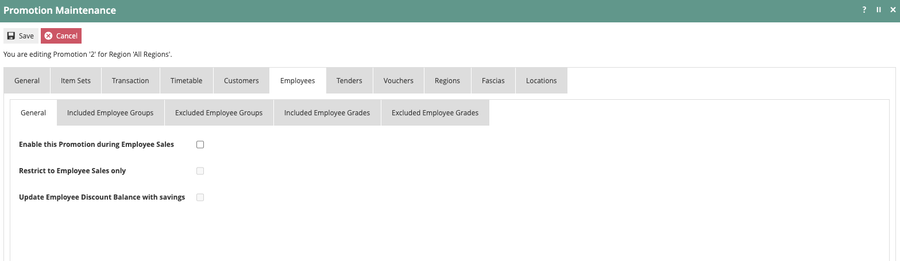

To make a Promotion valid within an Employee Sale Transaction, "Enable
this Promotion during Employee Sales" must be selected. Additionally,
selecting the "Restrict to Employee Sales only" option will result in
the Promotion only being valid within an Employee Sale Transaction.

It is possible to limit the amount of discount that an Employee can
receive over a period of time through Employee Sales. This is discussed
in detail in the How to Guide on configuring Employee Sales. To have
Promotional discounts count towards that limit, the "Update Employee
Discount Balance with savings" option must be selected.

If a Promotion has been enabled for Employee Sales, it is possible to
limit the validity to subsections of Employees. If Employee Groups have
been defined, it is possible to Include or Exclude Employee Groups from
the Promotion on the Employees -- Included Employee Groups and Employees
-- Excluded Employee Groups tabs. To Include or Exclude a group, select
it from the dropdown and click "Add Employee Group".

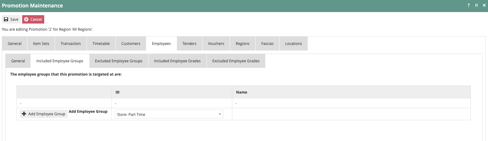

Similarly, it is possible to Include or Exclude Employee Grades from the
Promotion on the Employees -- Included Employee Grades and Employees --
Excluded Employee Grades tabs. To Include or Exclude a grade, select it
from the dropdown and click "Add Employee Grade".

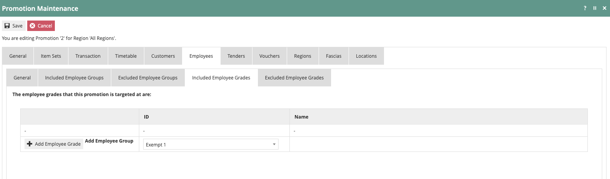

Promotions can also be linked to the use of a specific Tender. Since the
Promotion is not triggered until the tender has been selected, the
transaction flow is a bit unique.

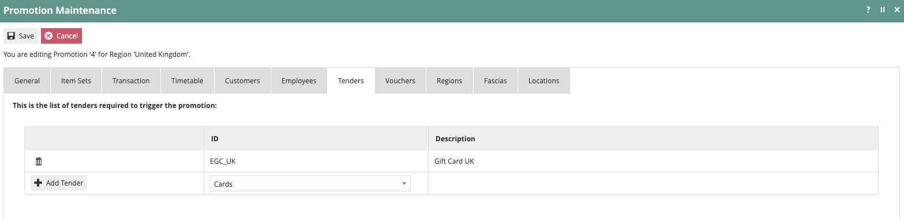

On the Tenders tab, select the desired Tender ID(s) from the dropdown
and click "Add Tender". By default, the Promotions Engine stops basket
evaluation once the tendering process has been initiated. If a Tender is
being used as a Promotion trigger, the "Enable Promotion Check in
Tendering" option must be selected for that specific Tender in the
Tender Maintenance application. See the How to Guide on configuring
Tenders for more information.

When a Promotion has been triggered after selecting the appropriate
Tender, the operator will receive a message on the terminal informing
them of the new total.

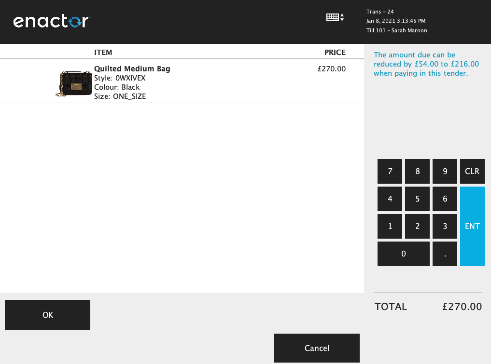

Promotions can be triggered through the use of Vouchers. On the Vouchers
tab, select the required Voucher from the dropdown and click "Add
Voucher". The appropriate Voucher will now need to be presented to
qualify for the Promotion.

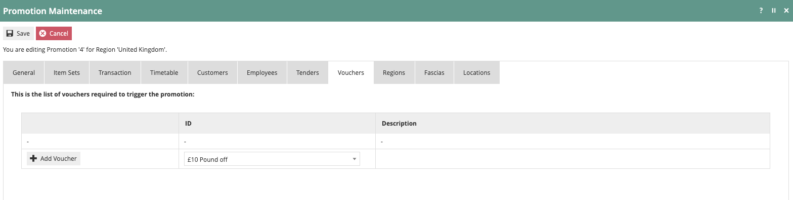

On the Regions tab, it is possible to Include or Exclude the Promotion
at a Region level lower than it was created. On the Regions -- Included
Regions or Regions -- Excluded Regions tabs, select the desired region
from the dropdown and click "Add Region".

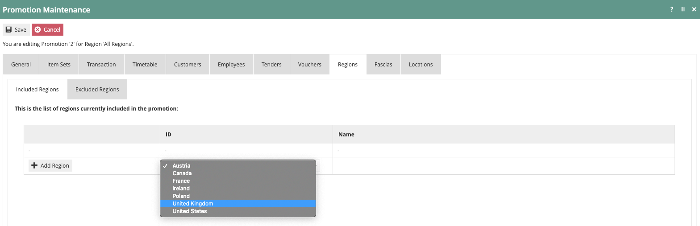

Retailers that operate more than one Fascia can Include or Exclude
Promotions at the Fascia level. On the Fascias -- Included Fascias or
Fascias -- Excluded Fascias tabs, select the desired fascia from the
dropdown and click "Add Fascia".

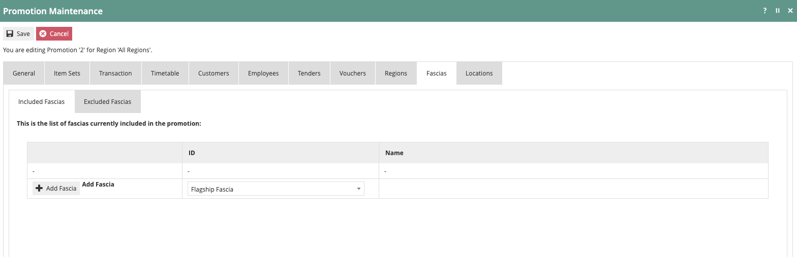

Note that like Promotions, Fascias are also tied to Regions. For a
Fascia to appear as an option, it must be within the same Region
hierarchy as the Promotion and at the same level or below.

Using the Locations -- Included Locations and Locations -- Excluded
Locations tabs, individual Locations can be Included or Excluded from a
Promotion. This is accomplished by selecting the desired Location from
the dropdown and clicking "Add Location".

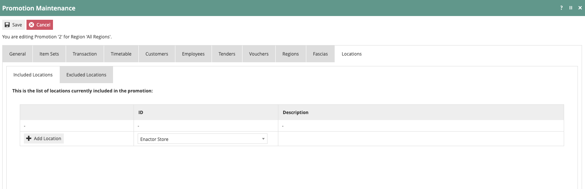

Locations will appear as options only if they are within the same
Regional hierarchy as the promotion and at the same level or below.

In the example above, the Promotion was created for 'All Regions' which
permits any Region to be added to the Include or Exclude list. If the
Promotion had been created for a Region at the lowest level of the
hierarchy, no Regions would be available for selection.

## Transaction Promotion Types

In a Transaction Promotion, qualification is evaluated at the
Transaction Level and the Reward is applied at the Transaction Level.
Select the Transaction tab to define the qualifiers and rewards.

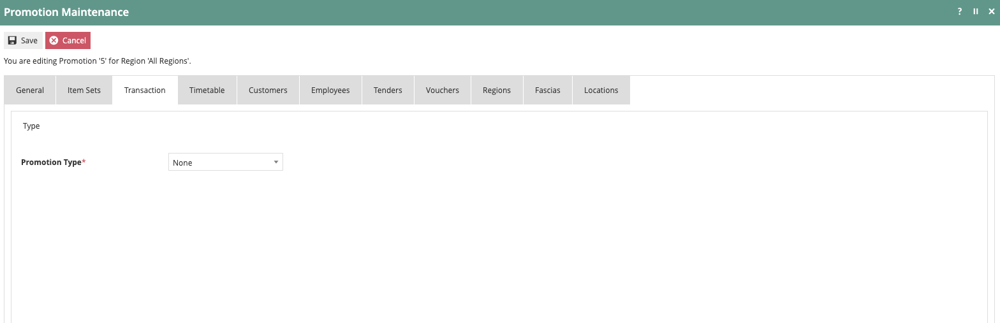

There are currently 9 different Transaction Promotion Types. The form
displayed for Reward definition will vary based on the selected
Promotion Type.

### Additional Points

This Promotion Type will Reward the customer with Additional Points
deposited into their Loyalty account. The Reward Value represents the
number of Additional Points to be received.

### Amount Discount

This Promotion Type will Reward the customer with a currency Amount
Discount applied to the transaction. The Reward Value represents the
Discount Amount being applied to the transaction.

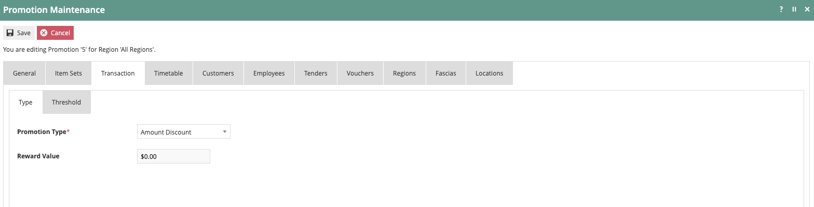

### Free Product Alert

This Promotion Type will Reward the customer with a Free Product. The
intent is for this Promotion to be used for a "give-away" product that
will be given to the customer by the operator upon qualification. As
opposed to a Reward Value, this Promotion requires entry of the Free
Product ID.

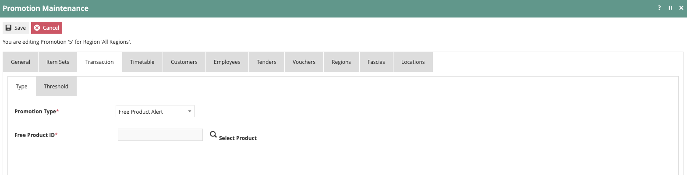

### Gift Card

This Promotion Type will Reward the customer with a Gift Card to be used
on a future purchase. During the tender process, the operator will be
instructed to scan/swipe a gift card which will be activated for the
specified amount. The Gift Card Type must be selected from the dropdown
and the Gift Card Amount is specified in the Reward Value.

### % Discount

This Promotion Type will Reward the customer with a Percentage-based
Discount applied to their transaction. The Reward Value represents the
desired Discount Percentage. The Rounding Rule determines if the
discount amount will always be rounded Up, Down or to the Closest
amount. It is also possible to specify a Maximum Reward Saving so that
the discount cannot exceed a particular currency value.

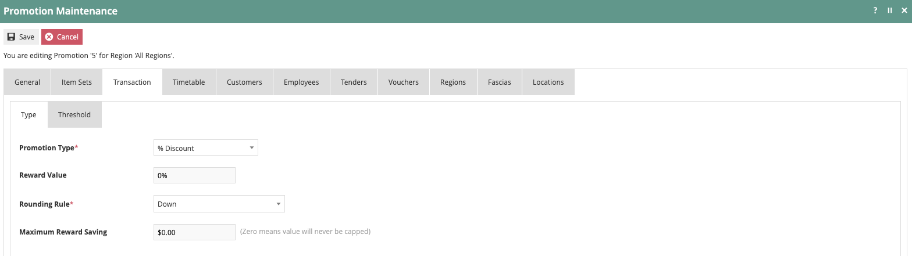

### Points Multiplier

This Promotion Type will Reward the customer with Additional Points
deposited into their Loyalty account. The amount of Points is determined
by multiplying the Points earned in the transaction by the Reward Value.

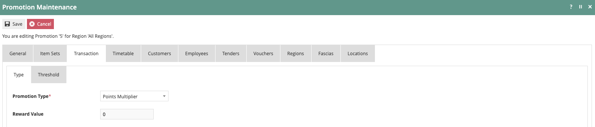

### Points Rate

This Promotion Type will Reward the customer with Additional Points
deposited into their Loyalty account. The amount of Points is determined
by adding the number of Points earned in the transaction to the number
of Points that would be earned in the transaction using the Points rate
entered as the Reward Value.

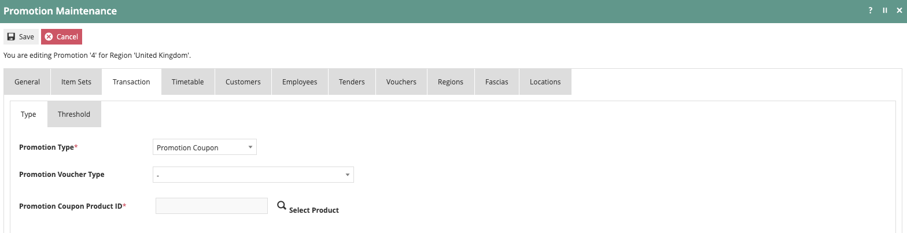

### Promotion Coupon

This Promotion Type will Reward the customer with a printed Coupon to
use on a future purchase. This Promotion Type requires specification of
the Promotion Coupon Product ID, which will be used as a qualifier on
redemption, and the Promotion Voucher Type which defines the information
to be printed.

### Spend X get Y

This Promotion Type will Reward the customer with a currency Amount
Discount applied to the transaction. While similar to the Amount
Discount Promotion Type, there are 2 key differences. First, the
Threshold must be expressed in terms of transaction currency value
(thresholds are discussed in a later section). Second, the Reward amount
will be applied every time the Threshold is met. For example, if the
promotion is setup as Spend £50 get £5 a £100 transaction would get £10
and a £150 transaction would get £15 and so on. The Reward Value should
be equal to the lowest level currency Discount Amount.

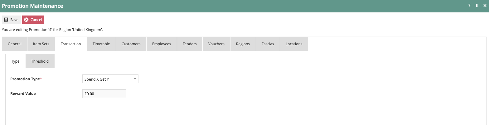

## Transaction Threshold Types

All Transaction Promotions utilise the same form to define qualification
Threshold.

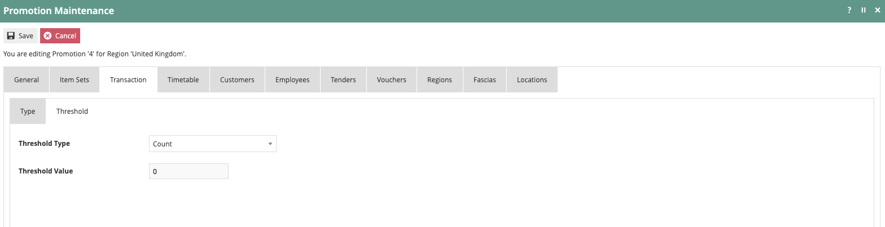

There are 4 Threshold Types that can be used with Transaction
Promotions:

-   Count: The number of items in the Transaction

-   Value: The value of all items in the Transaction

-   Points: The number of loyalty points earned in the Transaction

-   Points Balance: The customer's current loyalty points balance

After selecting the Threshold Type from the dropdown, enter the desired
Threshold Value in the provided field.

If the Promotion has been configured to "Alert Operator When Nearly
Triggered" an additional Threshold field will be shown. This is labeled
as the Alert Threshold and represents the condition that must be
satisfied to trigger the alert.

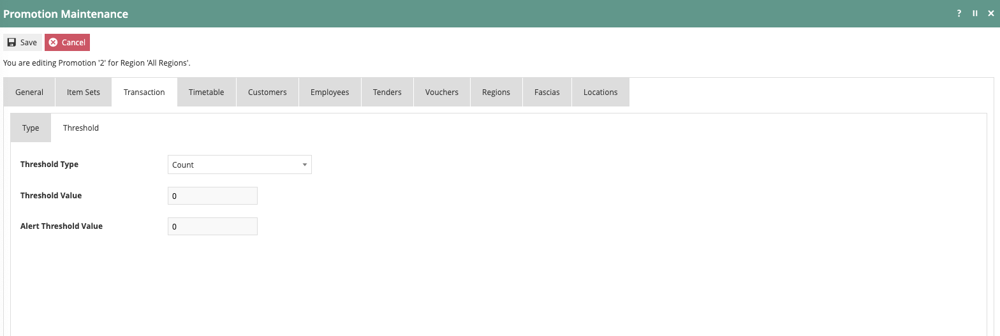

## Item Sets

Item sets are used to trigger Promotions based on the specific Items or
groups of Items within the transaction. By using Item Sets, it is also
possible to confine the Reward to a particular Item or group of Items.
To define an Item Set, select the Item Sets tab and click "Add Item
Set".

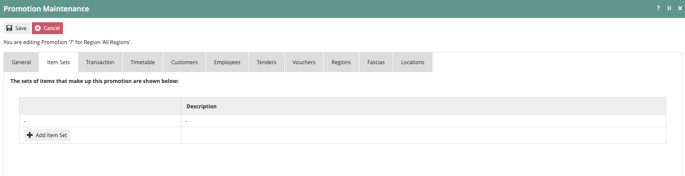

It is possible and common to create more than one Item Set within a
Promotion. When more than one Item Set exists, all item sets must be
satisfied for the Promotion to be triggered.

Similar to Transaction Promotions, Item Sets are defined by selecting
the Promotion Type, defining the Reward and Threshold. Item Sets support
all of the Promotion Types supported by Transaction Promotions plus
several additional. The biggest difference with Item Sets is the process
to define what products will satisfy the Item Set.

Multiple criteria are available for defining the products within an Item
Set. Most commonly, products are included or exclude by Product ID,
Brand, Product Groups or Merchandise Hierarchy.

To define an Item Set, select "Add Item Set" from the Item Sets tab.

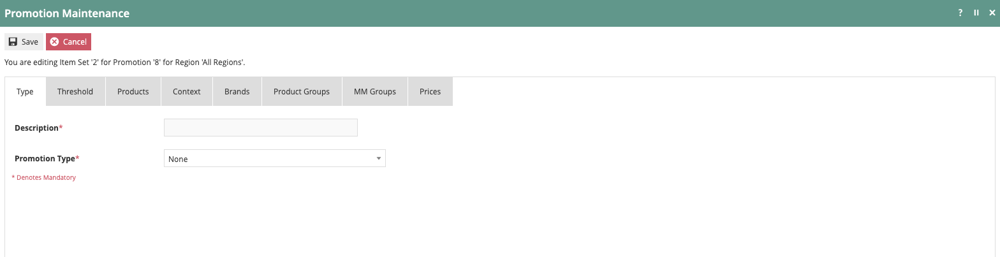

On the Products tab, items can be explicitly Included or Excluded by
adding the Product ID to the Included Products or Excluded Products
list. Products can be added individually by entering the Product ID and
clicking "Add Product ID".

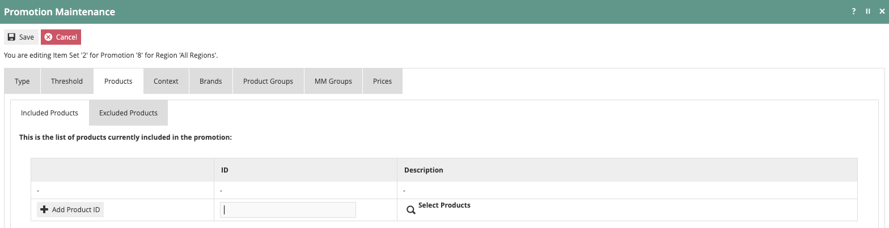

Multiple Products can also be added at once by clicking "Select
Products" and then using the Product Search function.

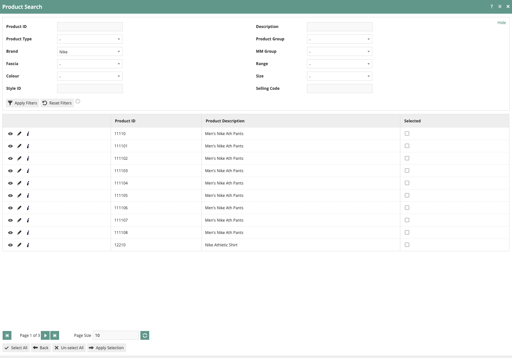

Using the Product ID as described above to specifically Include or
Exclude items from an Item Set can be cumbersome when dealing with large
data sets. Therefore, it is more common to see Item Sets defined by
using a combination of Brand, Product Groups and MM Group.

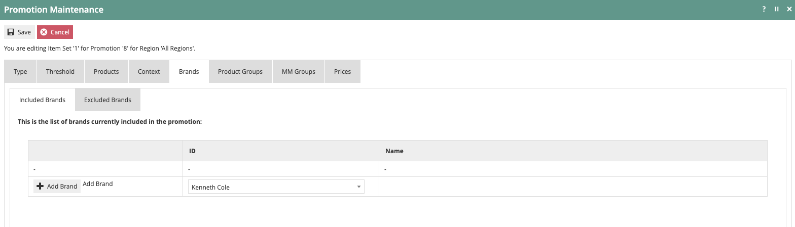

To add a Brand to the Include Brands or Excluded Brands list, select the
desired Brand from the dropdown and click "Add Brand". If multiple
Brands are included on a list, they will be treated as an 'OR'
condition.

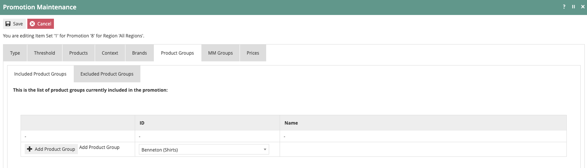

To add a Product Group to the Included Product Groups or Excluded
Product Groups list, select the desired Product Group from the dropdown
and click "Add Product Group". If multiple Product Groups are included
on a list, they will be treated as an 'OR' condition by default.
However, when multiple Product Groups are included on a list, an
additional option of "An item must match all product groups" will become
available. If this option is selected, the list of Product Groups will
be treated as an 'AND' condition.

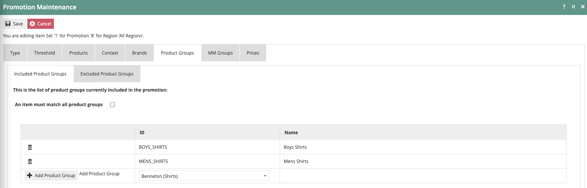

To add an MM Group to the Included MM Groups or Excluded MM Groups list,
select the desired MM Group from the dropdown and click "Add MM Group".
It is important to note when selecting an MM Group all subgroups will
also be included.

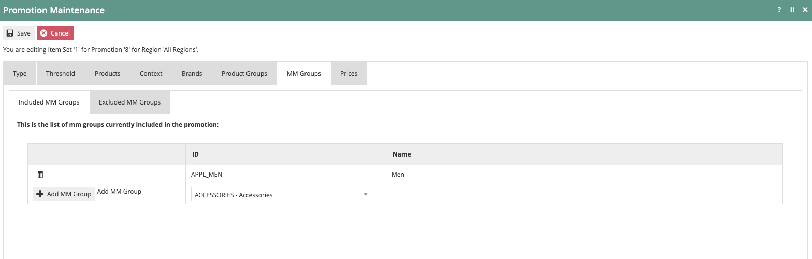

When defining Item Sets using these general features, they can be
combined with 'AND' logic. For example, it is possible include a
specific MM Group by selecting it on the Included MM Groups tab but
exclude items that are of a specific Brand in the MM Group by also
selecting the Brand on the Excluded Brands tab.

## Item Set Promotion Types

There are 19 base Item Set Promotion Types. As with Transaction
Promotions, the information required to define the associated Reward
will vary based on the selected Promotion Type.

### None

It is possible and common to define an Item Set with a Promotion Type of
"None". This is typically done in Promotions where the items required to
qualify for a promotion are different than the items to which a Reward
will be applied. Take the following promotion as an example: 10% off
accessory items with a Tablet purchase. This Promotion would use 2 items
sets. One Item Set would be the qualifying purchase of a Tablet. This
Item Set would have a Promotion Type of "None" since no Reward is being
applied to the Tablet. The second Item Set would be for the accessory
purchase with Promotion Type of "% Discount" which is discussed later.

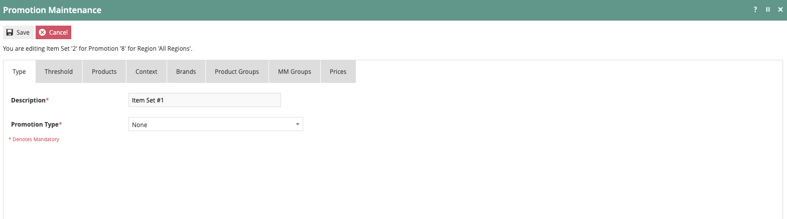

### Additional Points

This Promotion Type will Reward the customer with Additional Points
deposited into their Loyalty account. The Reward Value represents the
number of Additional Points to be received.

### Amount Discount

This Promotion Type will Reward the customer with a currency Amount
Discount. The Reward Value represents the Discount Amount being applied
singularly to the Item/Group of Items in the transaction defined by the
Item Set.

### Amount Discount by Item

This Promotion Type will Reward the customer with a currency Amount
Discount. The Reward Value represents the Discount Amount being applied
to each item in the transaction defined by the Item Set.

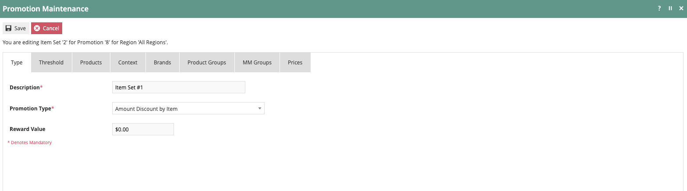

### Cheapest/Closest/Dearest Products Free

This Promotion Type will Reward the customer by fully discounting a
designated number of items in the Item Set. Commonly thought of in terms
of a BOGO-type offer, this Promotion provides some amount of product at
a 100% discount when the qualifying purchase is made. The variations of
Cheapest, Closest and Dearest permit control over which item in the
group will provided free. When selecting this promotion type, the Number
Of Free Products is specified on the Type tab.

### % Discount (Cheapest/Closest/Dearest Products)

This Promotion Type will Reward the customer by applying a % Discount to
a designated number of items in the Item Set. Similar to the previous
Promotion, this Promotion Type offers the Cheapest, Closest and Dearest
variants to control which item(s) are to receive the discount. This
Promotion Type requires the Number of Items to Discount, the Discount
Rate and the Rounding Rule to be specified on the Type tab.

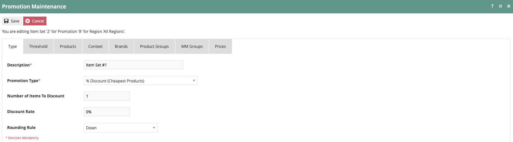

### Fixed Price

This Promotion Type will Reward the customer by applying a Fixed Price
to a group of items as defined in the Item Set. A Fixed Price Promotion
Type is frequently used when selling a bundle of items at a promotional
price independent of their regular prices (i.e., buy any shirt and tie
for £100). The promotional selling price is specified in the Reward
Value not a discount amount.

### Fixed Price by Item

This Promotion Type will Reward the customer by applying a Fixed Price
to each item as defined by the item set. In contrast to the previous
Promotion Type, Fixed Price by Item establishes a promotional selling
price for each individual item as opposed to setting a price for a
group/bundle of items. The promotional selling price is specified in the
Reward Value not a discount amount.

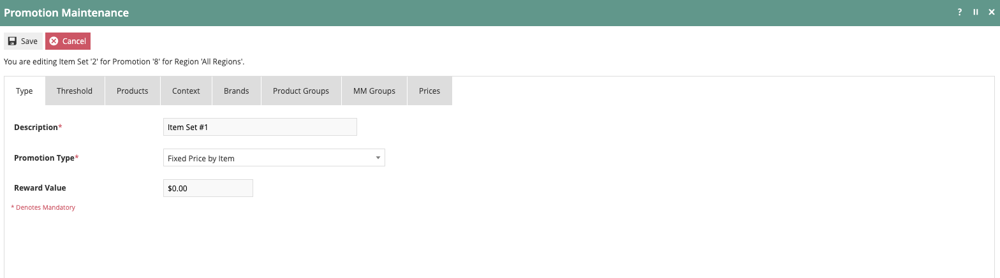

### Offer-Price Promotion

This Promotion Type will Reward the customer by applying an alternative
Price Type for the items as defined by the Item Set. The Price Type that
is being used for the Promotion is selected on the Type tab.

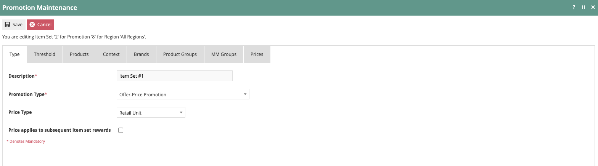

### Free Product Alert

This Promotion Type will Reward the customer with a Free Product. The
intent is for this Promotion to be used for a "give-away" product that
will be given to the customer by the operator upon qualification. This
Promotion Type requires entry of the Free Product ID. Optionally, it is
possible to display a specific Alert Message to the operator and require
them to acknowledge using the Force Acknowledge Alert option.

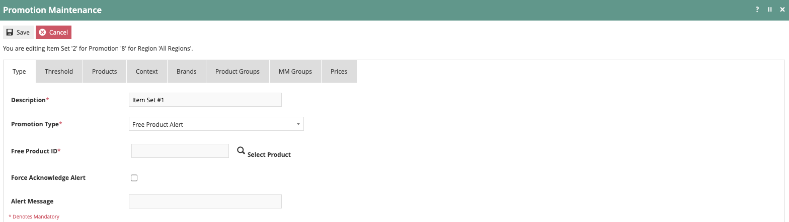

### Gift Card

This Promotion Type will Reward the customer with a Gift Card to be used
on a future purchase. During the tender process, the operator will be
instructed to scan/swipe a gift card which will be activated for the
specified amount. The Gift Card Type must be selected from the dropdown
and the Gift Card Amount is specified in the Reward Value.

### % Discount

This Promotion Type will Reward the customer with a Percentage-based
Discount applied to the items defined by the Item Set. The Reward Value
represents the desired Discount Percentage. The Rounding Rule determines
if the discount amount will always be rounded Up, Down or to the Closest
amount. It is also possible to specify a Maximum Reward Saving so that
the discount cannot exceed a particular currency value.

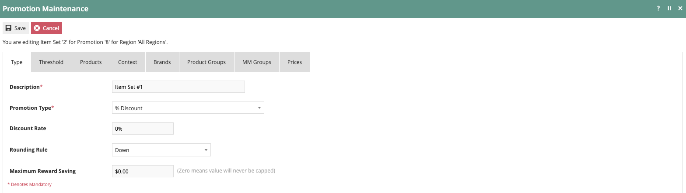

### Points Multiplier

This Promotion Type will Reward the customer with Additional Points
deposited into their Loyalty account. The amount of Points is determined
by multiplying the Points earned by the items contained within the Item
Set by the Reward Value.

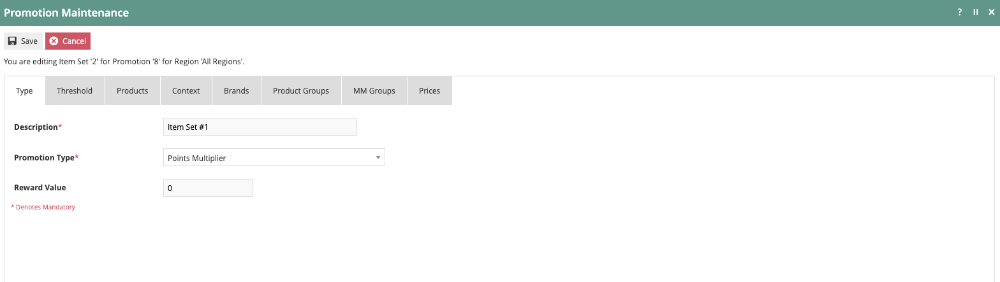

### Voucher

This Promotion Type will Reward the customer with a Voucher to be used
on a future purchase. The Voucher Type is selected from a dropdown
containing all Vouchers available within the Promotion's selected
Region.

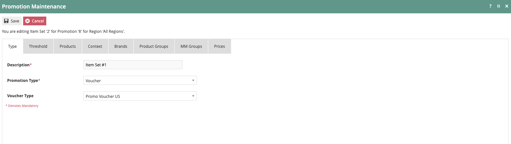

#### 

### Promotion Coupon

This Promotion Type will Reward the customer with a Promotion Coupon to
be used on a future purchase. The Coupon Product ID is entered directly
on the Type tab or it can be found by clicking "Select Product" and
using the Product Search application.

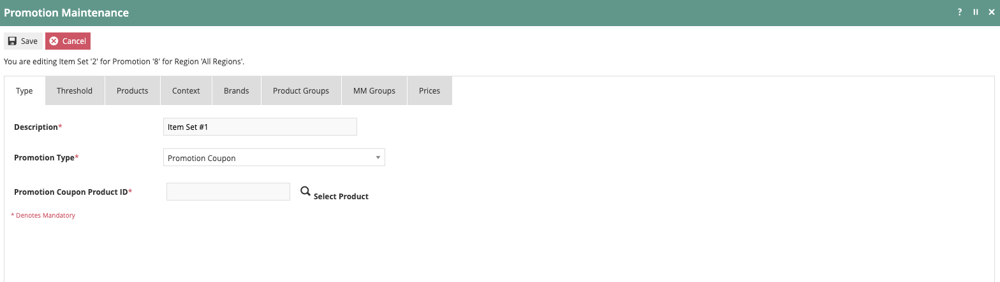

Within Product Maintenance, there is a special Product Type of
Promotional Coupon Product. By creating a Product to represent a
Promotional Coupon, that Product ID can be included in an Item Set of
the Promotion it is designed to trigger. A Promotional Coupon Product is
a simple way of issuing coupons when single use or serial number
tracking is not required.

### Spend X Get Free Product

This Promotion Type will Reward the customer with a Free Product after
meeting a currency spend Threshold within the Item Set. The intent is
for this Promotion to be used for a "give-away" product that will be
given to the customer by the operator upon qualification. This Promotion
Type requires entry of the Free Product ID which can be done directly or
located with Product Search by clicking "Select Product".

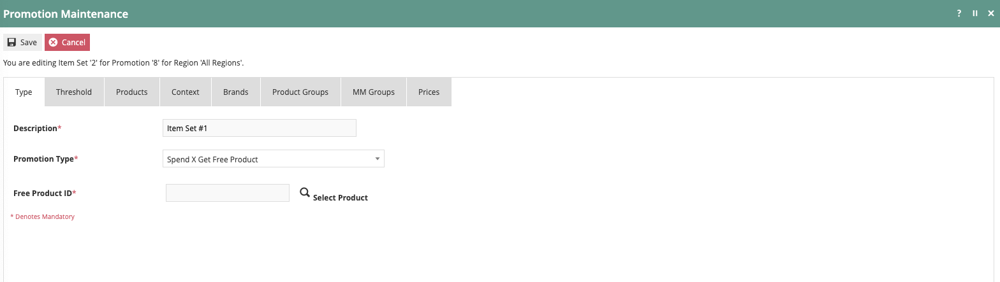

### Spend X Get Y

This Promotion Type will Reward the customer with a currency Amount
Discount applied to the items as defined in the Item Set. While similar
to the Amount Discount Promotion Type, there are 2 key differences.
First, the Threshold must be expressed in terms of transaction currency
value (thresholds are discussed in a later section). Second, the Reward
amount will be applied every time the Threshold is met.

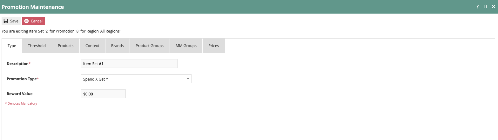

### Fee Override

This Promotion Type will Reward the customer by applying either a
promotional fixed selling price or discount percentage to an item that
is specifically a Fee Product Item. Some examples may be shipping,
delivery or installation fees. To specify a selling price for the Fee
Product Item it should be entered in the Reward Value. Alternatively, a
discount percentage can be entered in the Reward Rate with the
appropriate Rounding Rule.

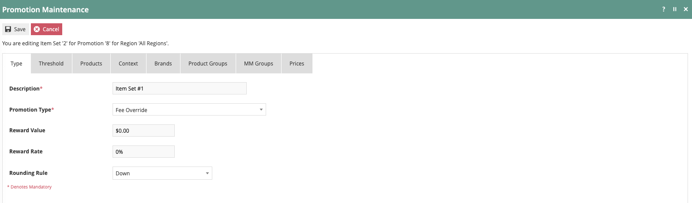

### 

## Item Set Threshold Types

All Item Set Promotions utilise the same form to define qualification
Threshold.

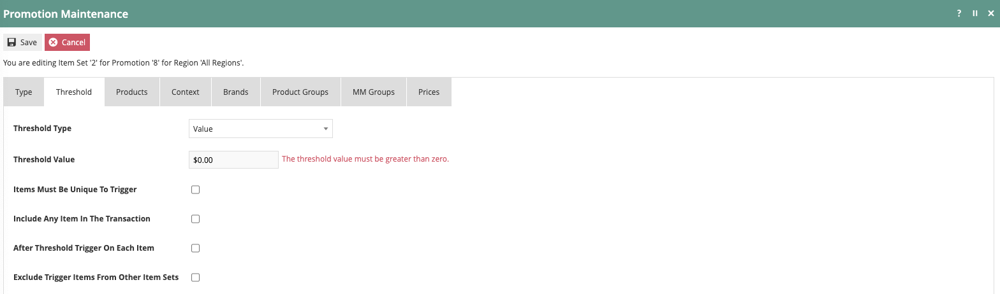

There are 3 Threshold Types that can be used with Transaction
Promotions:

-   Count: The number of items in the Item Set

-   Value: The value of all items in the Item Set

-   Points: The number of loyalty points earned in the Item Set

After selecting the Threshold Type from the dropdown, enter the desired
Threshold Value in the provided field.

If the Promotion has been configured to "Alert Operator When Nearly
Triggered" an additional Threshold field will be shown. This is labeled
as the Alert Threshold and represents the condition that must be
satisfied to trigger the alert.

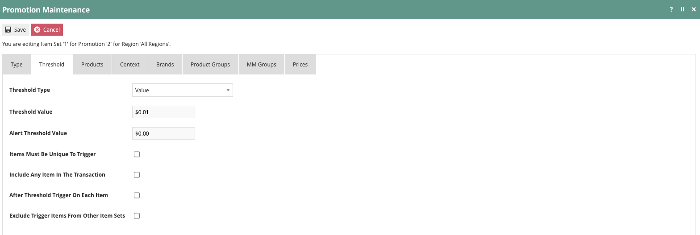

Additional Threshold options exist for Item Sets that do not exist for
Transaction Promotions. By selecting the Items Must Be Unique To Trigger
option, permits the use of a specific product only once for
qualification no matter how many times it appears in the transaction.

Using the Products, Brands, Product Groups and MM Groups tabs to create
Include/Exclude lists for Item Sets was reviewed previously in this
document. When creating an Item Set that is to include most products, it
is also possible to set the Include Any Item In The Transaction option
on the Threshold tab. Select this option moves all products into an
'Include' status and will remove the Include tabs from the Products,
Brands, Product Groups and MM Groups tabs. It is still possible to
specify Excludes on those tabs.

By default, a reward will trigger once after an Item Set Threshold is
reached. In some cases, it may be desirable to have the reward continue
to trigger for each additional item after the threshold has been met.
Imagine a promotion where the customer receives a 10% discount when they
buy 3 or more shirts. The discount would trigger after the 3^rd^ shirt
was scanned but if a fourth shirt was purchased no discount would be
applied as the Item Set Threshold is now reset. By enabling the After
Threshold Trigger On Each Item option, every shirt scanned after the
3^rd^ shirt would also receive the 10% discount.

While it is possible to allow various Promotions and Rewards to Overlap
as discussed earlier it is possible to prevent items from being used to
satisfy thresholds in multiple Item Sets without disturbing the reward
overlap. Selecting the Exclude Trigger Items from Other Item Sets option
will prevent a single item from being used for qualification in multiple
Item Sets.
