# Configuring Vouchers
# Introduction

The purpose of this guide is to provide a foundational understanding of
the options and capabilities of Vouchers. The use of Vouchers provides
the retailer a flexible method to issue, track and control the
redemption of credits, discounts and promotions.

## Overview

The following concepts will be used to configure Vouchers:

-   Voucher Type Configuration

-   Product Configuration

-   Tender Configuration

-   Promotion Configuration

-   Voucher Serial Number Maintenance

# Prerequisites

## Resources

Before starting, you should have the following resources in place:

-   Enactor Estate Manager

-   Enactor POS (configured within the UK Region, connected to the
    Estate Manager)

-   Standard Configuration, including:

    -   Base Configuration

    -   UK Retail (I have used UK in this example, but it could be other
        regional config packs.)

-   Regionally appropriate data including Product, Localisation,
    Tenders, etc.

## Prior Training/Experience

You should be familiar with the following:

-   Estate Manager configuration

-   Enactor configuration concepts, including Locations, POS Terminals,
    Products, Promotions, Tenders, Discounts etc.

-   Data broadcasting

-   Standard POS Sales processes

# Voucher Fundamentals

## Understanding Vouchers

A Voucher is a flexible means of providing some form of benefit to a
customer. A Voucher can be generated at POS or in an external system.
When redeemed, a Voucher can be used as a tender, to apply a discount or
to trigger a promotion. Vouchers have the capability of being serialised
allowing them to be tracked and managed.

## Issuing Vouchers

A Voucher can be produced at POS as a Promotion Reward or it can be
'sold' as an item when associated with a Voucher Issue Product. When a
Voucher is produced at POS it can be printed as part of the receipt.
Vouchers can also be generated by external systems and distributed in
various physical or digital formats. Externally created vouchers can be
redeemed immediately or require activation at POS before they can be
redeemed.

## Redeeming Vouchers

A Voucher can be configured to be used as a tender, to apply a discount
or to trigger a promotion when redeemed. Depending on the Voucher
configuration and retailer preferences, redemption can be initiated by
selecting the Voucher Type from a list, selecting Vouchers associated
with a customer, or scanning/entering a serial number. If a Voucher Type
is Tracked, the number of times each Voucher is permitted to be redeemed
can be specified.

# Configuration

## Voucher Type

Enactor supports numerous ways and options for configuring Voucher
Types. This guide will focus on the core concepts and most common
options used when configuring Voucher Types. For a detailed explanation
of all available options, please refer to the full Enactor Application
Configuration book.

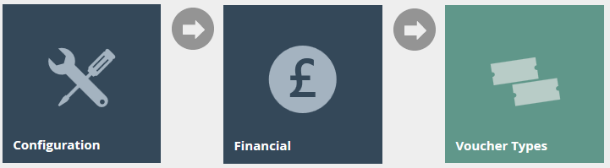

Access Voucher Types using the Voucher Types option, obtained via the
selection sequence

shown at right, starting from the Main Menu:

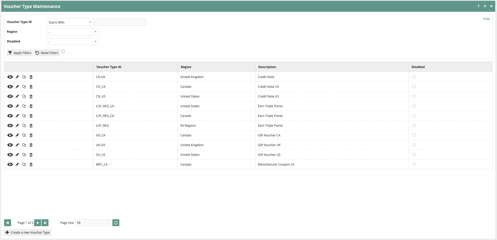

On the Voucher Type Maintenance page, select "Create a new Voucher
Type".

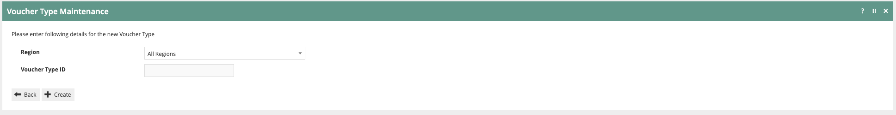

If the Voucher Type is being created for a specific Region, select it
from the list. Otherwise, it can be left as "All Regions". Each Voucher
Type must have a unique Voucher Type ID per Region.

Multiple Tabs are displayed in Voucher Type Maintenance. Additional Tabs
may be displayed based on options selected.

#### 

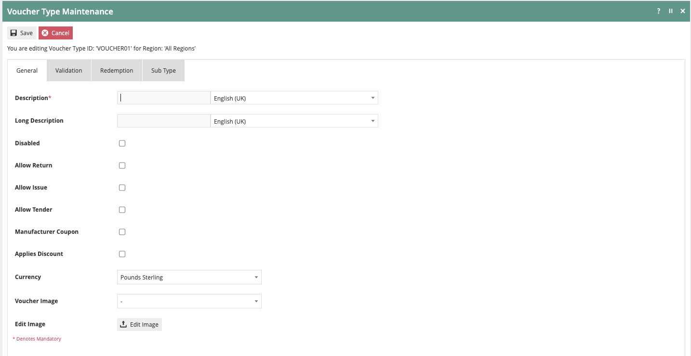

On the General tab, a Description is required for the Voucher Type. This
is the Description that will be shown on the operator display and
receipt when the Voucher is issued or redeemed. A Long Description field
is also provided for reference.

There are 3 key aspects to the configuration of Voucher Types: Issuance,
Validation and Redemption. Each of these aspects have numerous options
which are independent of each other which results in numerous variations
when combined together. Given the number of variations and potential
complexity, this guide will cover each aspect individually.

## Issuance

If the Voucher Type is to be issued by POS, there are several settings
to control the behaviour at issuance.

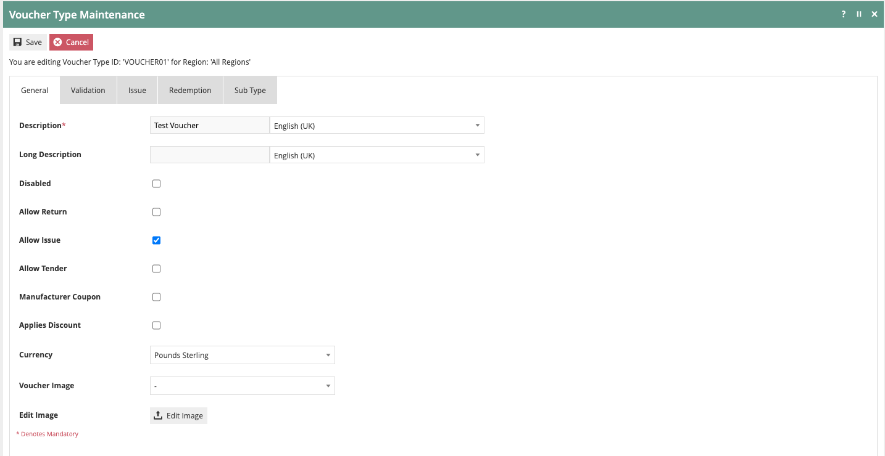

On the General tab, select the Allow Issue option if the Voucher is to
be issued by POS. Once the option has been selected, the Issue tab will
be visible. If a marketing Image will be used to represent the Voucher,
select it from the Voucher Image list. If the Image has not been
previously uploaded to the system, select Edit Image which will step
through the process to upload an Image as is done with Product Images
and other Media.

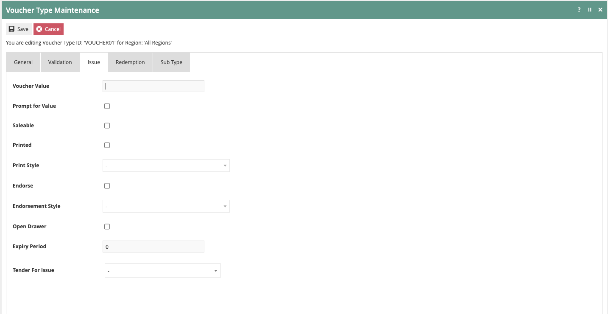

When configuring the Issuance options for a Voucher, it is important to
first understand how the Voucher will be obtained. A Voucher can be
issued as a reward in a Promotion. A Voucher can also be sold in a
transaction or manually issued by the cashier. If the Voucher is to be
sold or added to a transaction, it must be marked as Saleable by
selecting the option. If a Voucher has been marked as Saleable, it is
possible to designate a Voucher Value or select the Prompt for Value
option. The Value will not only be the default redemption value of the
Voucher but will also be the amount charged for the Voucher at Issuance.
By specifying or prompting for a Value, it is presumed that the Voucher
will be treated as a Tender. When a Voucher is being sold in a
transaction, it is possible to include its presence as part of a
Promotion Item Set. This is accomplished by associating a Voucher Issue
Product with the Voucher Type and is described in the following section.

If POS is to print the Voucher as a component of the receipt, the
Printed option should be selected. Once the Printed option is selected,
the Print Style should be selected from the choices in the dropdown.

The Expiry Period allows the retailer to specify an expiration point for
the Voucher expressed in the number of days after issue. If expiration
is desired on a specific date, that is controlled at the Redemption
level and will be discussed later.

### Voucher Issue Product

When a Voucher Type is being issued by POS, it may be desirable to have
it behave as an item in the basket. This is often done to allow the
Voucher to be included from a Promotion evaluation standpoint. Refer to
the guide on Product Setup for basic information on and navigation to
the Product Maintenance Application.

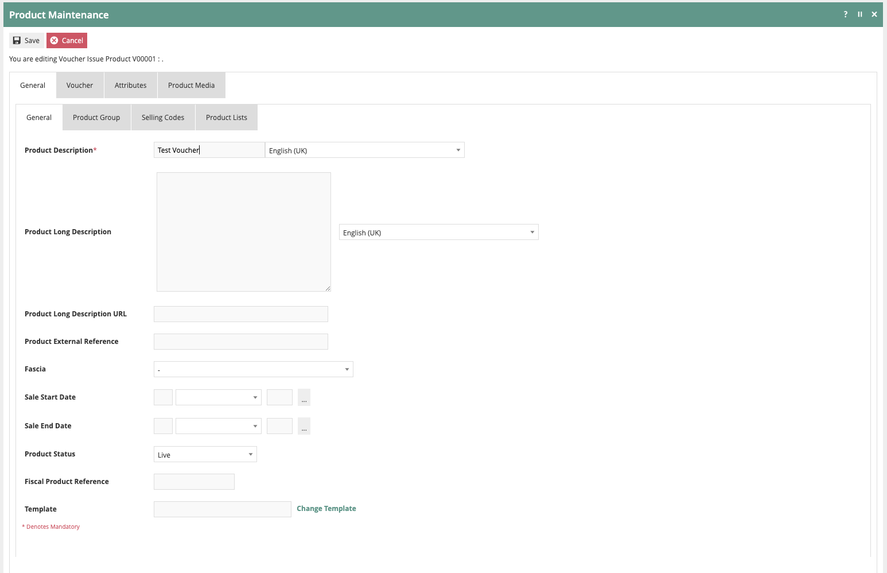

The Voucher Issue Product contains a subset of the tabs present when
performing merchandise product setup. As these have been covered in the
Product Setup guide, they will not be repeated here. The only tab that
is unique to the Voucher Issue Product maintenance view is Voucher.

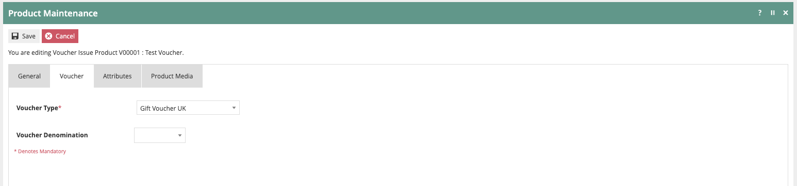

Select the Voucher Type from the dropdown that is to be issued when this
Product is sold in a completed transaction.

## Validation

Vouchers Types have the ability to support a unique serial number for
each Voucher issued. Because every Voucher can be unique, their issuance
and use can be tracked and managed making them ideal to be used with
high-value rewards.

Regardless of any settings selected on the General tab, the Validation
tab will always be available in the Voucher Type Maintenance screen.

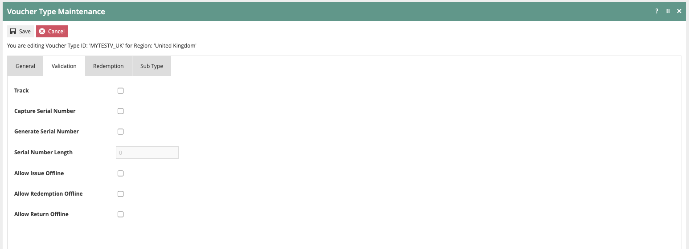

Enactor has the ability to Validate a Voucher, by serial number, against
a list of known Vouchers. If it is desired for Enactor to manage
Validation, the Track option should be selected.

Populating Enactor with the Voucher serial numbers can be accomplished
in different ways depending on how the Voucher is being produced. If the
Voucher is not being issued by POS and contains a pre-assigned serial
number, the Capture Serial Number option should be selected. This will
prompt the cashier to scan the serial number on the physical voucher at
the time it is issued. If POS is Issuing the Voucher, select the
Generate Serial Number option which will result in a serial number being
assigned at the time of issuance.

Voucher Validation relies on communications with Estate Manager at the
time of Issuance and at Redemption. The Validation tab includes options
on how these transactions should behave in the event that communications
to the Estate Manager has been disrupted.

Tracking Vouchers by serial number as described is a prerequisite to
being able to manage and control Redemption. The process to impose
limits on Redemptions is covered in the next section.

## Redemptions

As mentioned previously, a Voucher Type can be configured to provide
many different types of benefits: it can act as a tender, it can apply a
discount, or it can be used to trigger a promotion. Regardless of the
type of benefit received, there are a number of common settings found on
the Redemption tab.

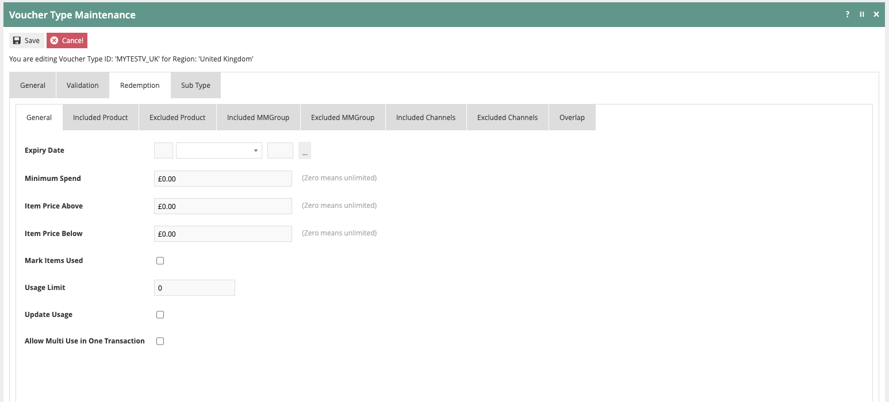

The Redemption tab and sub tabs allow a significant amount of control
over the applicability of the Voucher. Many of the concepts applied are
consistent with those seen in the Promotion Configuration guide.

On the Redemption -- General tab an Expiry Date can be specified for the
benefit. As best practice, the Expiry Date should not be used if an
Expiry Period has been specified on the Issue tab.

Using the Minimum Spend Field, it is possible to establish a minimum
transaction value that must be achieved before the Voucher can be
redeemed. Additionally, the Item Price Above and Below options allow
eligible items to be specified by their minimum or maximum prices. If
the Mark Items Used is selected, items in the transaction will be marked
as used if a voucher is applied against them. This will affect their
ability to receive other discounts or promotions depending on
configuration.

The Usage Limit field represents the number of times a Voucher can be
redeemed. A usage limit of 0 indicates that it may be redeemed an
unlimited number of times. The Update Usage option should be selected if
the Voucher serial numbers and usage limits are being managed within
Enactor. An additional option is provided to Allow Multi Use in One
Transaction. Assuming a Voucher has a Usage Limit higher than 1, this
option would permit multiple uses within a single transaction up to the
Usage Limit.

The Redemption -- Included and Excluded tabs as well as the Redemption
-- Included and Excluded MMGroup tabs mirror those found in Item Set
configuration in Promotion Maintenance. Please refer to the Promotions
Configuration guide if additional information is required.

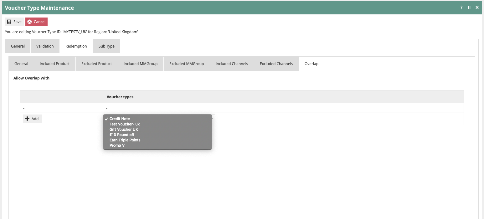

By default, Vouchers are not permitted Overlap. The Redemption --
Overlap tab provides a mechanism to allow Overlap on a
Voucher-by-Voucher basis. To permit Overlap with a Voucher, select the
desired voucher from the dropdown and click 'Add'. Multiple Vouchers can
be selected to allow Overlap.

Additional configuration options will be present on the Redemption --
General tab based on the type of benefit being provided by the Voucher.
The following sections provide the additional Redemption configuration
required based on benefit type.

## Redemption as a Tender

A Voucher Type can be configured so that it acts like a tender. Many of
the configuration options discussed will be dictated by the retailer's
accounting practices more so than functionality.

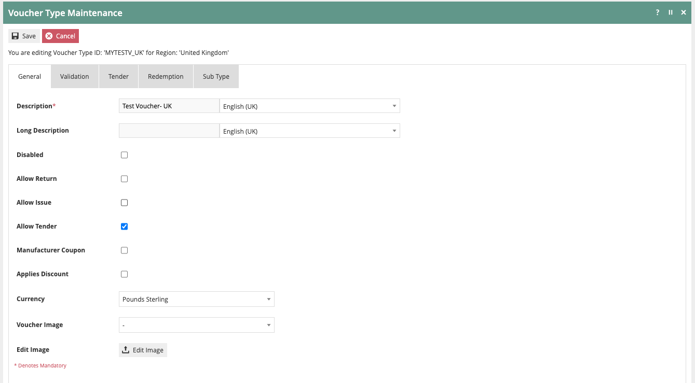

If a Voucher Type is to be treated as a tender at Redemption, the Allow
Tender option on the General tab must be selected. Once this option is
selected, the Tender tab will become visible and Tender-specific options
will be added to the Redemption -- General tab.

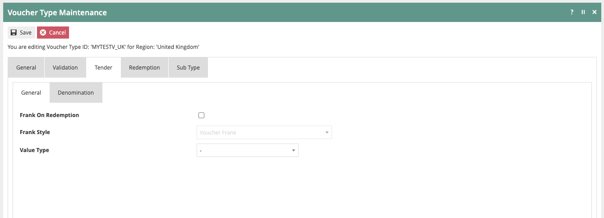

When a Voucher is being used as a tender it may be desirable to Frank
the document at the time of redemption to mark that it has been used or
to add to the usage history in the case of a Voucher that is permitted
to be used multiple times. The option to Frank the Voucher at Redemption
is provided on the Tender -- General tab.

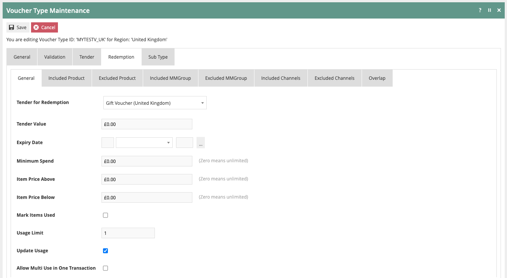

Once the Allow Tender option is selected on the General tab, additional
options appear on the Redemption -- General tab. The Tender for
Redemption is selected from a dropdown list. A brief description
regarding Tender configuration is available in the next section of the
document. A field is also provided to specify a Tender Value for the
Voucher Type.

It is important to note that, as discussed in the section on Issuance,
that a Voucher Value may have been specified or the Prompt for Value
option may have been enabled as part of Issuance. If the Issuance
options for Value have been used, it is not necessary to specify a
Tender Value on the Redemption -- General tab. It is conceivable that
both a Voucher Value and a different (higher) Tender Value could be
specified for the same Voucher. This would create a condition where it
would be possible to sell a Voucher at a discount compared to its Tender
Value (i.e., purchase a £50 Voucher for £35).

### 

### Tender Types

Configuring a Tender Type to support Vouchers follows the same process
as setting up any other Tender Type. Refer to the configuration guide on
Tenders for navigation to and basic operation of the Tender Maintenance
application.

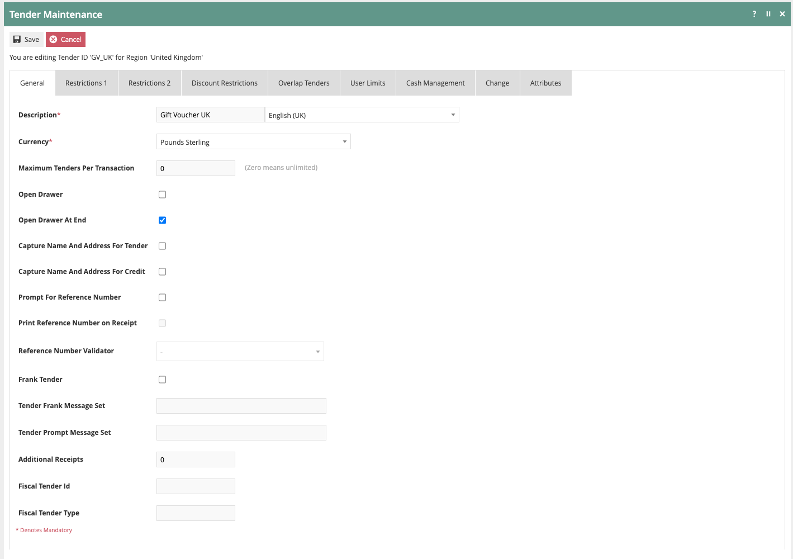

There are no special tabs or settings presented when configuring a
Tender Type of Voucher. There are some settings that should receive
special attention in the context of a Voucher Tender Type.

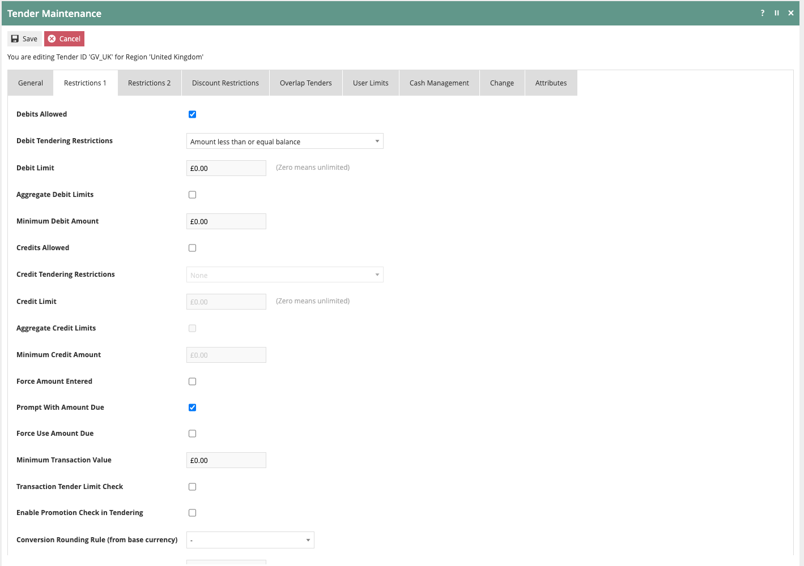

On the General tab, one of the Open Drawer options should be selected if
the Vouchers are to be collected and reconciled as part of Cash
Management. On the Restrictions 1 tab, the Debit Tendering Restrictions
should be considered if there is need to minimize the need to provide
Change associated with an overtender. The Credits Allowed option should
be consistent with any return privileges afforded to the Voucher Type.

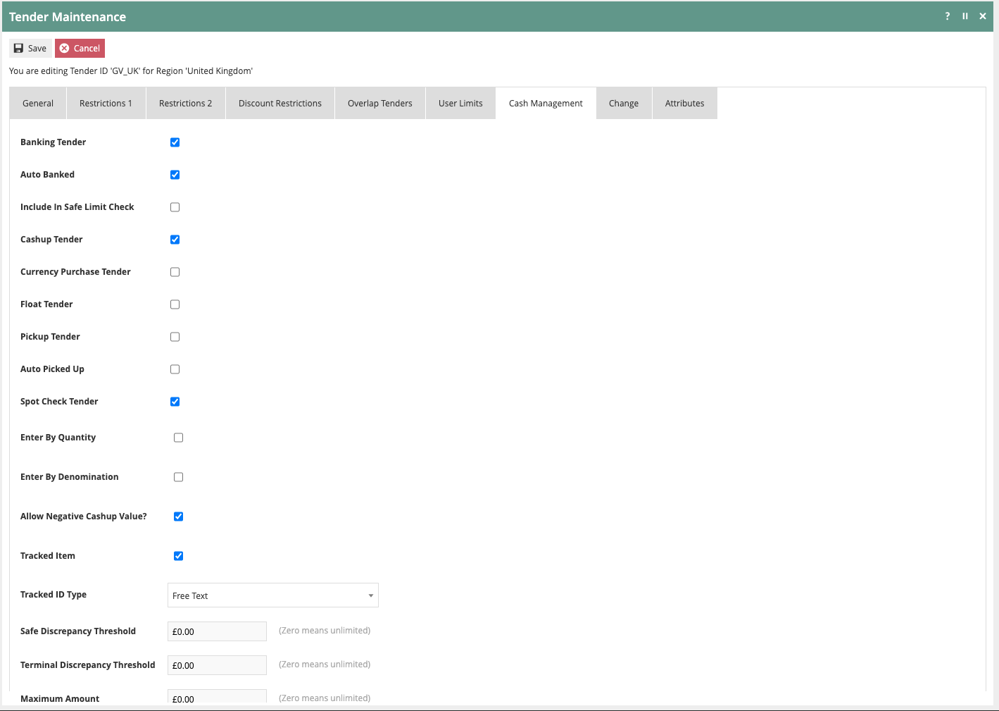

The Cash Management tab contains the settings necessary to process the
Vouchers as part of the cash reconciliation process. Some retailers will
choose to handle and reconcile Vouchers as if they are a physical
currency while others will choose to treat them as if they are an
electronic form of payment and allow the system to manage the process.

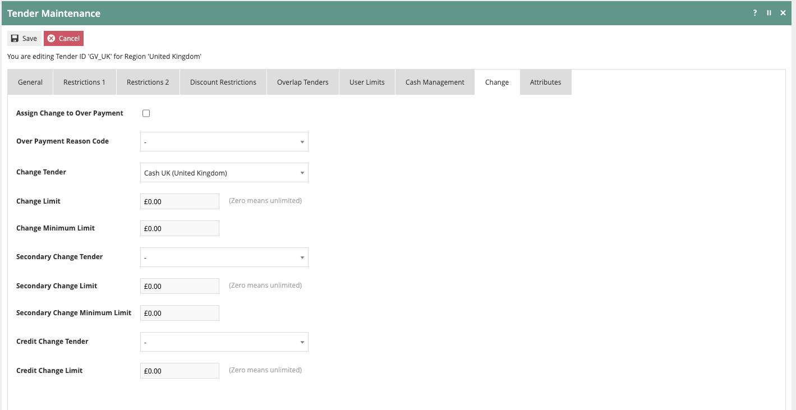

When treating a Voucher as a tender, the retailer will also need to
consider the possibility of needing to provide change in a transaction
using a Voucher as a tender. The Tender that is to be used for Change,
along with associated limits, is selected on the Change tab.

## Redemption as a Discount

A Voucher can be used to apply a Discount. When a Voucher is used to
apply a discount, it leverages Reasons to manage the rules associated
with the Discount.

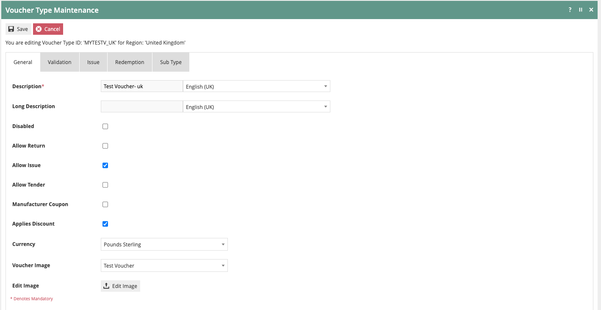

To configure a Voucher Type to apply a discount, select the Applies
Discount option on the General tab. Using a Voucher Type to apply a
discount does not result in any additional settings or options related
to Validation or Issuance. Please note, there are settings on the Issue
tab that presume use as a tender including Voucher Value, Prompt for
Value and Tender for Issue. These fields should not be used when
configuring a Voucher Type to apply a discount.

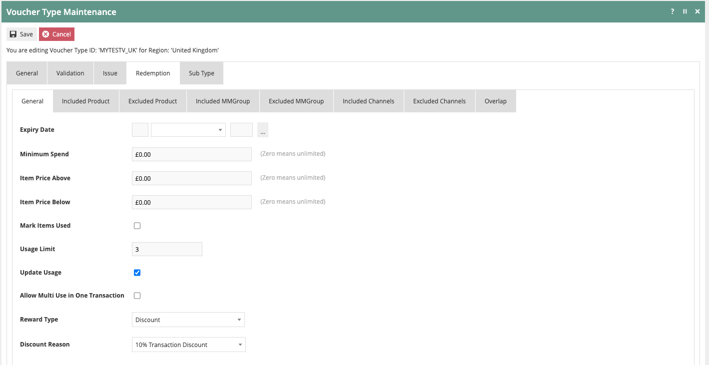

On the Redemption tab, there are 2 additional fields available to
configure the Discount Reward. To apply a discount upon redemption,
select the Discount Reward type from the dropdown. The Discount Reason
selector will be prepopulated with all of the defined Transaction
Discount Reasons. If a pre-existing Discount is not appropriate, a new
Discount Reason can be configured in the Reason Maintenance application.

If a Voucher is being used to trigger a Promotion then the Reward Type
should be set to Promotion and the Discount Reason field should be left
blank. Additionally, no further restrictions should be configured on the
Redemption tab. All restrictions should be configured within the
promotion itself.

### Promotion Setup

When using a Voucher to trigger a Promotion, all of the key concepts
related to Promotion configuration remain the same. For more
information, please refer to the Promotion configuration guide.

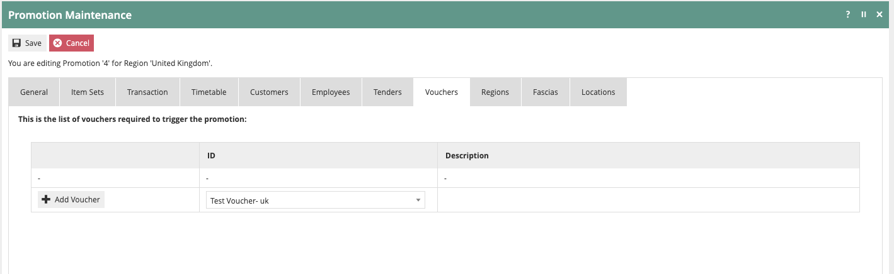

Once a promotion has been setup, select the Vouchers tab. From the
dropdown list, select the desired Voucher(s) and click 'Add Voucher'.
The selected Voucher(s) will now be a condition to qualify for the
Reward.

## Voucher Sub Type

Through the Sub Type tab, it is possible to group together Vouchers to
use a common set of General, Validation, Issue and Redemption Type
characteristics. Each Sub Type can support a unique set of Redemption
settings but must be of the same Redemption Type as the parent Voucher.

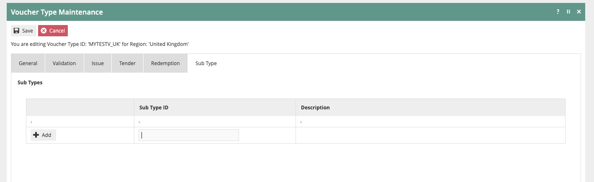

To create a Voucher Sub Type, navigate to the Sub Type tab, enter a
Voucher Sub Type ID and click 'Add'.

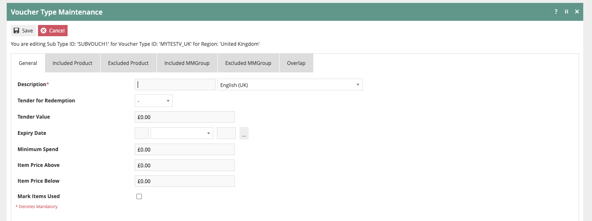

Once the Voucher Sub Type has been added, a Description for the new
Voucher Sub Type is required on the General tab along with the expected
settings for the reward type similar to what is found on the Redemption
tabs. The image above is for a Sub Type being created against a parent
Voucher Type that is set as a Tender.

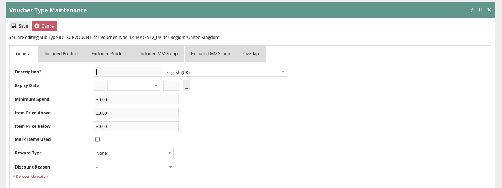

The image above is for a Sub Type being created against a parent Voucher
Type that is set as a Discount.

Once Sub Types have been created, they will inherit any changes made to
the parent Voucher Type settings. A Voucher Sub Type cannot be separated
from the parent without deletion and recreation as its own Voucher Type.

## Voucher Serial Number Maintenance

While not specifically required as part of Voucher Type configuration, a
brief review of Voucher Serial Number Maintenance is appropriate.

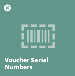

Access Voucher Types using the Voucher Types option, obtained via the
selection sequence

shown at right, starting from the Main Menu:

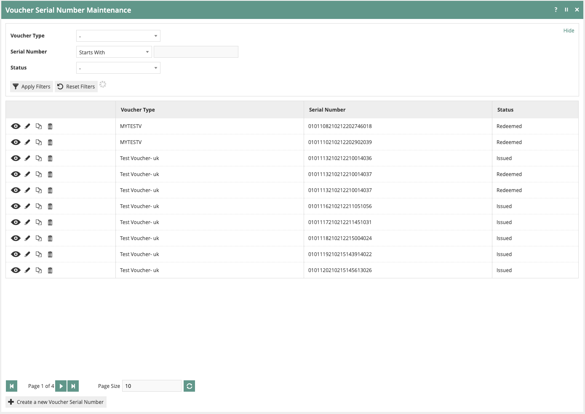

The Voucher Serial Number Maintenance shows a record of all Tracked
Vouchers along with their Serial Numbers. A Voucher Serial Number can be
added manually by clicking 'Create a new Voucher Serial Number'.

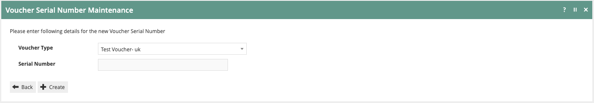

To create the Voucher Serial Number, select the Voucher Type from the
dropdown list, enter the Serial Number and click 'Create'.

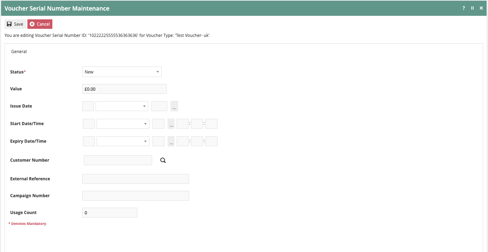

Once the Voucher Serial Number has been created, the Status of the
Voucher Serial Number must be selected. A Status of Issued is required
to support Redemption. Additional fields are available for
configuration. If using the additional fields, be sure they are
consistent with the Voucher Type selected.

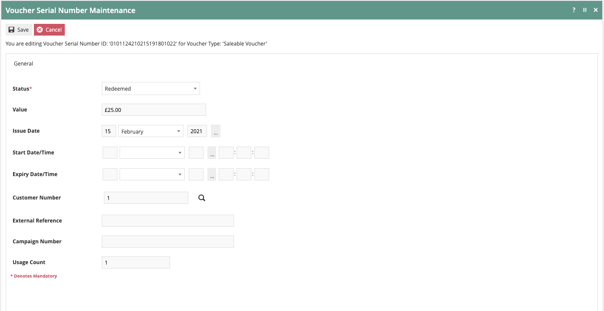

The Voucher Serial Number Maintenance screen can also be used to view or
modify the status of a previously issued Voucher Serial Number.
