# Configuring German Fiscal 
# Overview

Fiscalisation is a legal requirement imposed by the Tax Authorities (TA)
of an increasing number of countries, but particularly prevalent in the
European Union. The common reason, between countries, for fiscal
legislation is to record sales in such a way that an inalterable record
of each transaction and the VAT due is available to the TA.

Enactor have fiscal solutions available for the majority of European
Fiscal countries and continue to work on additional country solutions
both inside and outside Europe. Enactor found that a common complaint
from retailers was, POS providers and Fiscal Software Solutions
providers blaming each other when things went wrong. Enactor's approach
to fiscal is to avoid reliance on third parties wherever possible. This
allows Enactor to provide solutions that do not have hidden third party
software costs and also give customers a single point of contact.

Whilst Enactor have avoided relying on software partners to provide
pre-packed solutions, we recognise the importance of in country experts.
We have therefore built a network of partners that both help us
initially understand legislation and technical requirements for each
country but are also kept on retainer to inform us of any legislation
changes and guide us through their implementation. This allows us to
keep our solutions up to date and compliant in what is often a
fast-changing area in terms of legislation.

While the reasons for Fiscal legislation are common between countries,
unfortunately the approach taken differs from one to the next, although
there are a number of common patterns outlined below:

## Device Based {#device-based .unnumbered}

When each transaction is finalised, it is also sent to physical device
which records the transaction in an inalterable way. In some countries,
the device also functions as a printer; in others it is USB or network
connected device.

Devices contain a fiscal module which will both sign and record each
transaction in a write once read many, fiscal memory. The signature
produced by the device is usually printed on the receipt so that the
customer, or a TA inspector, can see the transaction has been recorded
properly. Devices will also have some mechanism to provide the data held
to the TA, commonly one of:

-   Extract in a defined format, tiggered by the POS

-   Internal GPRS connections

-   Device requires an ethernet internet connection

-   Memory Card that can be given to the TA on request

These Fiscal Devices are certified by the TA and this usually, although
not always, means that the POS solution does not need certification.

##  {#section .unnumbered}

## Service Based {#service-based .unnumbered}

Transactions are sent to an online service provided by the TA which will
record the transaction detail and provide a signature back as part of
the response. This signature is usually required to be printed on the
receipt, in some countries in the form of a QR code. Some TA's offer a
lottery where retail customers can scan the QR code to be entered in a
regular lottery, thus encouraging reporting of retailers who are not
compliant.

Each country has its own provisions for how to deal with a loss of
connection to the service, but it is usual to permit offline sales
which, must either be manually recorded or electronically submitted to
the TA within a defined timeframe.

## Signature Based {#signature-based .unnumbered}

In this type of scheme, it becomes the responsibility of the POS to
record the transactions in an inalterable way and provide a record of
the transactions to the TA. The usual approach is to sign and record
each transaction, including the signature of the previous transaction as
part of the singed data. This has the effect of producing a chain of
singed transactions where a transaction modified at a later date would
be detectable, as either the altered transaction or all subsequent
transactions would have incorrect signatures.

The second requirement of this type of solution is for the POS solution
to be able to provide the transaction data, including signatures, to the
TA. This data is usually provided in an XML file often in the common
SAF-T format.

Again, it's common for the signature, or part of it, to be printed on
the customer receipt.

Clearly this type of solution requires the TA to have a certain level of
trust in the POS provider that they will, properly protect the private
key used to sign the transactions and that they will not provide the
retailer with a mechanism to alter transactions. It is therefore common
for these types of solution to require either a declaration of
conformity or formal certification process.

## Other Requirements {#other-requirements .unnumbered}

As well as the above each country has a number of other fiscal
requirements that must be adhered to, some of which are common between
countries, for example:

-   Sales and Returns are not permitted in the same transaction

-   Transaction value must be positive

-   Ability to produce X and Z reports in a proscribed manner

-   Items may not be discounted to zero or negative values

-   Particular handling of deposit and balance transactions

-   Requirement to produce invoices for transactions that meet
    particular criteria, over a set value, B2B

-   Particular handling of tax for bottle returns

# German Introduction {#german-introduction .unnumbered}

The fiscal approach in Germany is based around the use of TSE devices.
These devices can either be USB, printer or service based but in essence
all perform the same function which is to sign and store each
transaction in an inalterable state. Receipts for transaction must be
offered to customers but the format of the receipt is not mandated,
although there are some mandatory fields that must be included, one of
which is the signature produced by the TSE.

In event of a TSE being broken or offline it is possible for the POS to
continue trading. Receipts must show that the POS is offline, and the
transactions must be fiscalised once the TSE is back online. However,
given that our customers tend to run multiple POS in a store Enactor
recommend that an alternate POS is used where possible until the TSE can
be brought back online, to avoid this complication.

Certification of the POS software is not required; only the TSE device
itself requires certification.

## Notes {#notes .unnumbered}

Currently the Enactor solution supports Epson USB TSE devices. However,
the interface for the TSE is specified by the authorities and therefore
common so Enactor do not foresee huge complexity in adding new devices
or types of devices.

# Configuration Overview {#configuration-overview .unnumbered}

The following configuration changes are required and should be broadcast
to all German devices in preparation for go live.

## POS Terminal Template {#pos-terminal-template .unnumbered}

The POS Terminal Template used by all devices in Germanymust be
configured to have the fiscalisation Type set to Germany. Currency
should be set to Euros and Locale to German.

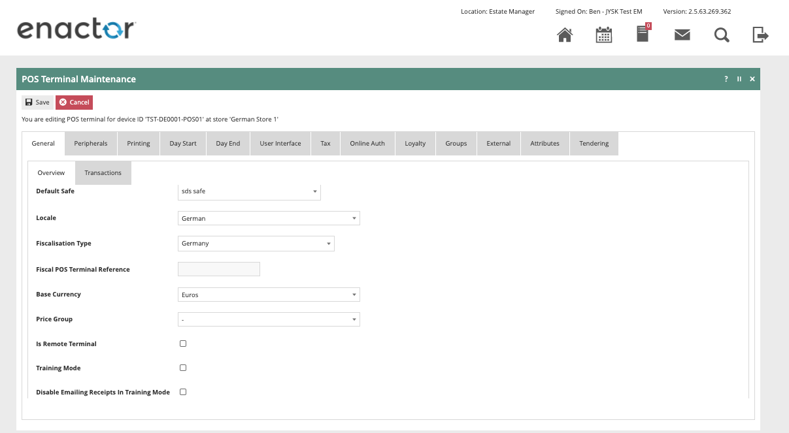

The primary Receipt should be set to Fiscal Standard Receipt XX Col and
no sale receipt should be set to Fiscal No Sale 4XX Col where XX is the
correct printer column width.

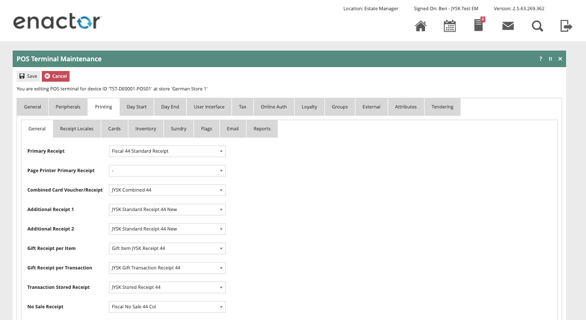

The 'Print Tax Details on Receipt' flag withing the printing \> flags
tab should be ticked.

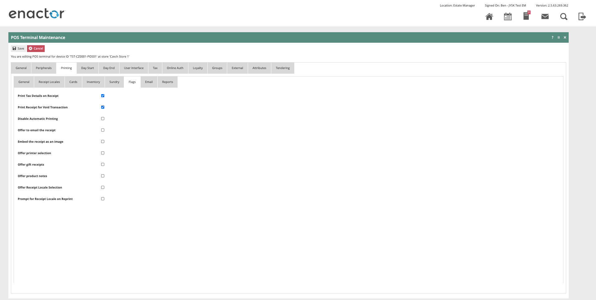

Within the Tax section the Tax region should be set to Germany and the
tax scheme to to the German tax scheme configured in the following
section.

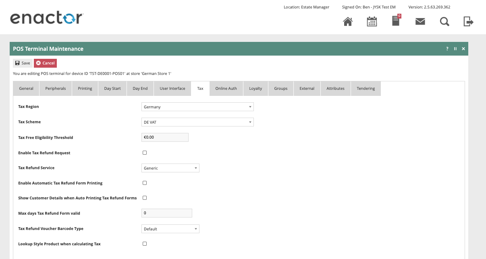

## Location {#location .unnumbered}

Each location in Germany should have its Fiscal Location Reference
configured within the EM and broadcast to the appropriate German
devices.

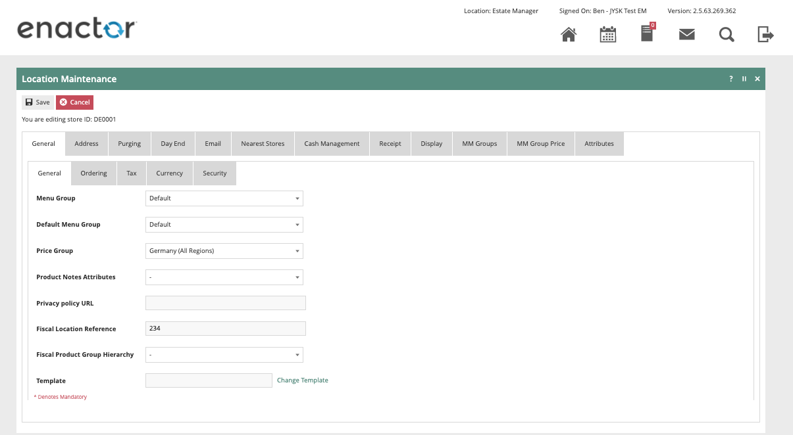

##  {#section-1 .unnumbered}

## Tax Groups {#tax-groups .unnumbered}

The following tax groups should be configured and broadcast to the
appropriate German devices.

| Tax Group ID | Description    |
|--------------|----------------|
| DE1          | DE Tax Group A |
| DE2          | DE Tax Group B |
| DE3          | DE Tax Group C |

##  {#section-2 .unnumbered}

## Tax Scheme {#tax-scheme .unnumbered}

The following tax scheme should be configured and broadcast to the
appropriate German devices.

| Tax Scheme ID | Description | Price Include Tax |
|---------------|-------------|-------------------|
| DE            | DE VAT      | TRUE              |

## Tax Rates {#tax-rates .unnumbered}

The following tax rates should be configured and broadcast to the
appropriate German devices.

| Tax Rate ID | Description     | Display Code    | Percentage | Fiscal Tax Rate Reference |
|-------------|-----------------|-----------------|------------|---------------------------|
| DE_R1       | DE Standard 19% | DE Standard 19% | 19%        | 1                         |
| DE_R2       | DE Reduced 7%   | DE Reduced 7%   | 7%         | 2                         |
| DE_R3       | DE Other        | DE Other        | 0%         | 3                         |

## Tax Group Tax Methods {#tax-group-tax-methods .unnumbered}

The following tax group tax methods should be configured and broadcast
to the appropriate German devices.

| Tax Group ID | Tax Scheme ID | Description     | Tax Rate        |
|--------------|---------------|-----------------|-----------------|
| DE_1         | DE            | DE Standard 19% | DE Standard 19% |
| DE_2         | DE            | DE Reduced 7%   | DE Reduced 7%   |
| DE_3         | DE            | DE Other        | DE Other        |

## Account Credentials {#account-credentials .unnumbered}

The following Account Credentials should be configured on the estate
manager and broadcast to the appropriate German devices.

**General Tab**

 | Account Credential ID | Name             | Type             | Use System Key | Is Live |
|-----------------------|------------------|------------------|----------------|---------|
| FISCAL_GERMANY        | Fiscal Key Store | Fiscal Key Store | TRUE           | TRUE    |

**Other Properties**

| Property Name | Type   | Value                                                |
|---------------|--------|------------------------------------------------------|
| SIG ALGORITHM | String | SHA256                                               |
| ADMIN_PIN     | String | A 5 digit PIN of your choosing                       |
| HOST_IP       | String | 127.0.0.1                                            |
| PORT          | String | 8009                                                 |
| PUK           | String | A 6 character alphanumeric password of your choosing |
| SECRET_KEY    | String | EPSONKEY                                             |
| USER_PIN      | String | A 5 digit PIN of your choosing                       |

The ADMIN_PIN, USER_PIN and PUK are used to authenticate with the TSE.
When the TSE is first initialised, it will be set up with the values
configured in the account credentials. When the POS communicates with
the TSE in the future it will need to login with the user (ADMIN or
USER) and PIN appropriate for the function it is performing. The PUK
(PIN Unblock Key) can be used to reset the PIN's if they are forgotten,
using tools provided by Epson.

If the PIN and PUK are forgotten the TSE will be unrecoverable. It is
therefore important that these values are not changed once the TSE is
initialised (described in a later step) to do so would result in the TSE
becoming blocked as a result of too many failed PIN attempts. Unblocking
a TSE is a non-trivial exercise that would require loging on to the TSE
and using tools provided by Epson.

##  {#section-3 .unnumbered}

## Process Connection {#process-connection .unnumbered}

Within the POS Process Connection Diagram Locate the
GermanyFiscalService Connected Process as shown below:

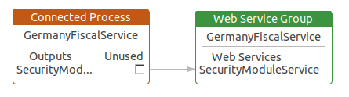

Update the class name and the account credentials id in the
SecurityModuleService as shown below:

-   Class Name:
    com.enactor.peripherals.tse.driver.epson.impl.EpsonSecurityModule

-   Account credentials id: FISCAL_GERMANY

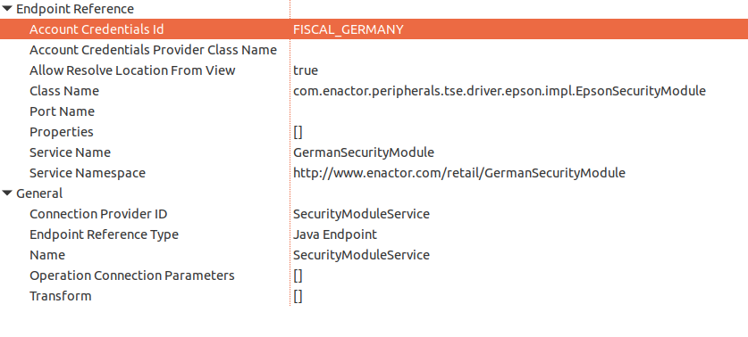

This change will need to be broadcast or copied to the relevant German
POS devices.

## Privileges {#privileges .unnumbered}

The following privileges will need to be configured and broadcast to the
appropriate German devices. It's recommended that a store manager be the
only role with these privileges since for the most part they permit the
configuration and set up of a new TSE. Perhaps the exception to this may
be LoginAsTimeAdminAllowed and AuthorisesLoginAsTimeAdmin which may be
required in the general operation of the POS as the TSE may require the
time to be set if it were ever unplugged.

| Privilege ID                           | Package          |
|----------------------------------------|------------------|
| enactor.pos.InitialiseDeviceAllowed    | PosFiscalisation |
|                                        |                  |
| enactor.pos.AuthorisesInitialiseDevice |                  |
| enactor.pos.LoginAsAdminAllowed        | PosFiscalisation |
|                                        |                  |
| enactor.pos.AuthorisesLoginAsAdmin     |                  |
| enactor.pos.LoginAsTimeAdminAllowed    | PosFiscalisation |
|                                        |                  |
| enactor.pos.AuthorisesLoginAsTimeAdmin |                  |
| enactor.pos.RegisterPosAllowed         | PosFiscalisation |
|                                        |                  |
| enactor.pos.AuthorisesRegisterPos      |                  |

## Menus {#menus .unnumbered}

At an appropriate point within your German POS menu structure, suggested
on the Admin menu, a fiscalisation menu with the following 5 items will
need to be configured and broadcast the German POS devices. This menu
will be used to facilitate initialising the TSE and setting the time on
the device.

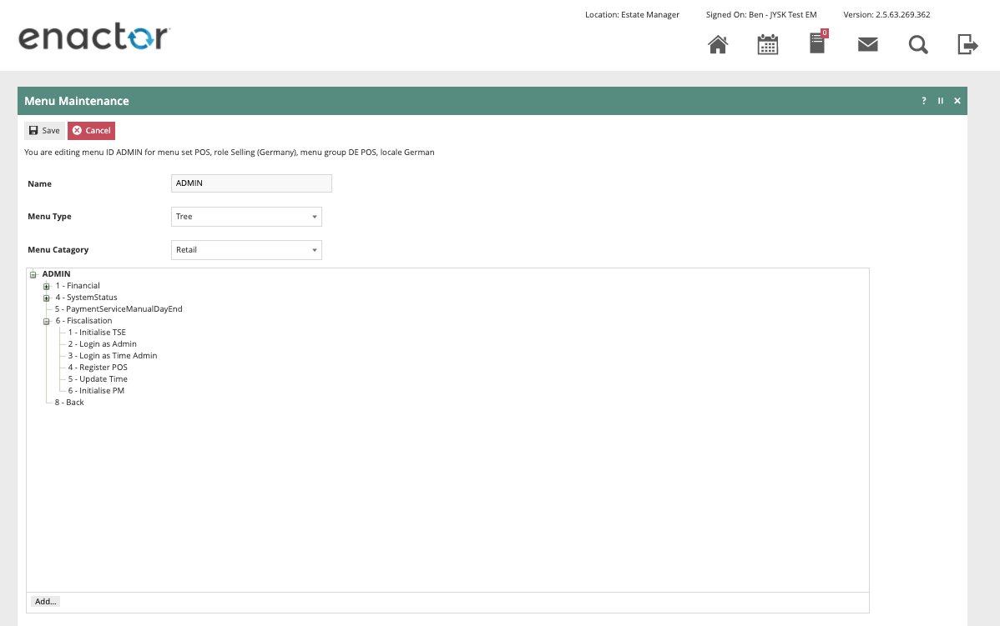

| Event                      | ID                         | Button Label        |
|----------------------------|----------------------------|---------------------|
| Fiscal_TSE_Initialise      | Fiscal_TSE_Initialise      | Initialise TSE      |
| Fiscal_TSE_Login_Admin     | Fiscal_TSE_Login_Admin     | Login as Admin      |
| Fiscal_TSE_Login_TimeAdmin | Fiscal_TSE_Login_TimeAdmin | Login as Time Admin |
| Fiscal_TSE_Register_POS    | Fiscal_TSE_Register_POS    | Register Pos        |
| Fiscal_TSE_UpdateTime      | Fiscal_TSE_UpdateTime      | Update Time         |

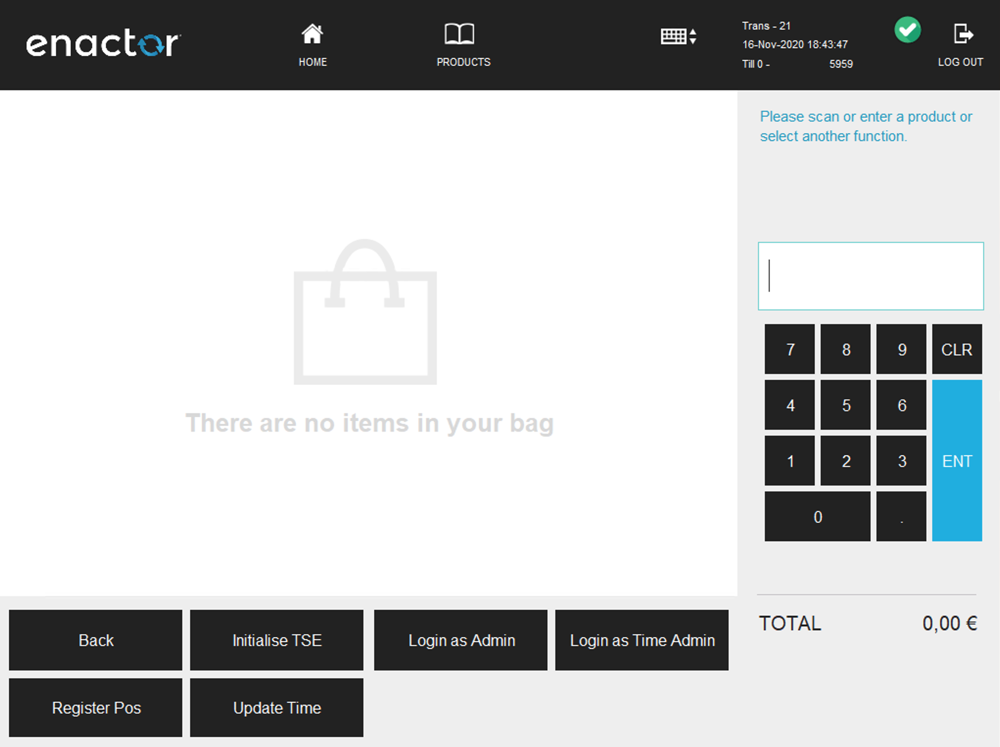

# Initial TSE Setup {#initial-tse-setup .unnumbered}

1.  On the POS navigate to the fiscalisation menu created in the
    previous step.

2.  Click the Initialise **TSE** button on the fiscalisation menu.

    -   The POS will prompt 'Operation Completed Successfully' click OK.

### Click the Login as **Admin** button on the fiscalisation menu.

-   The POS will prompt 'Operation Completed Successfully' click OK.

### Click the Register **POS** button on the fiscalisation menu.

-   The POS will prompt 'Operation Completed Successfully' click OK.

### Click the Login as **Time** Admin button on the fiscalisation menu.

-   The POS will prompt 'Operation Completed Successfully' click OK.

### Click the Update **Time button** on the fiscalisation menu.

-   The POS will prompt 'Operation Completed Successfully' click OK.

On occasion it is possible that the POS will prompt for the time to be
updated on the TSE, if this should happen repeat steps 8 through 11.

At this point it should be possible to complete fiscal transactions on
the POS. Also, when observing the details in the Epson TSE Monitor tool
it should show the device as Initialised, as shown below.

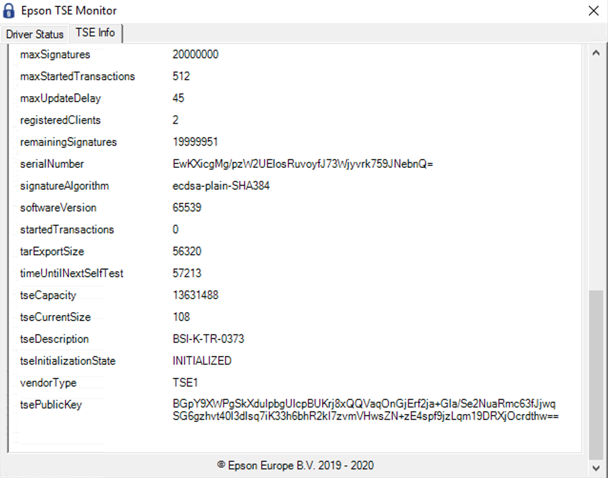

# Receipt {#receipt .unnumbered}

The format of the receipt is not prescribed by the German authorities
although receipts should be provided to customers and there are some
requirements that must be met.

The following are required to be shown on the receipt:

Add support file No file chosen
Template 
Default
to 
org
 Standalone
 Embed resources
 Citeproc
 TOC
 Number sections

Plain math

Auto wrap

No highlighting
permalink
download example as JSON
| - Company name and address       | - Tax totals per VAT rate   |
|                                  |                             |
| - Date the receipt was issued    | - TSE Transaction number    |
|                                  |                             |
| - Transaction start and end time | - Amount per payment method |
|                                  |                             |
| - Item names                     | - Signature counter         |
|                                  |                             |
| - Quantities                     | - Signature value           |
|                                  |                             |
| - Total price                    | - Serial number of the TSE  |
|                                  |                             |
| - Item prices                    |                             |
|----------------------------------|-----------------------------|
|                                  |                             |

Optionally a QR code with the above details can also be included and
Enactor support this where it is also supported by the printer.

Within the POS Terminal Template there is a receipt available named
'Fiscal XX Standard Receipt' which meets all of the above requirements.
Although a retailer can choose to customise the receipt to meet their
needs, this should form a good starting point that contains all of the
mandatory information. An example of this receipt is shown below.

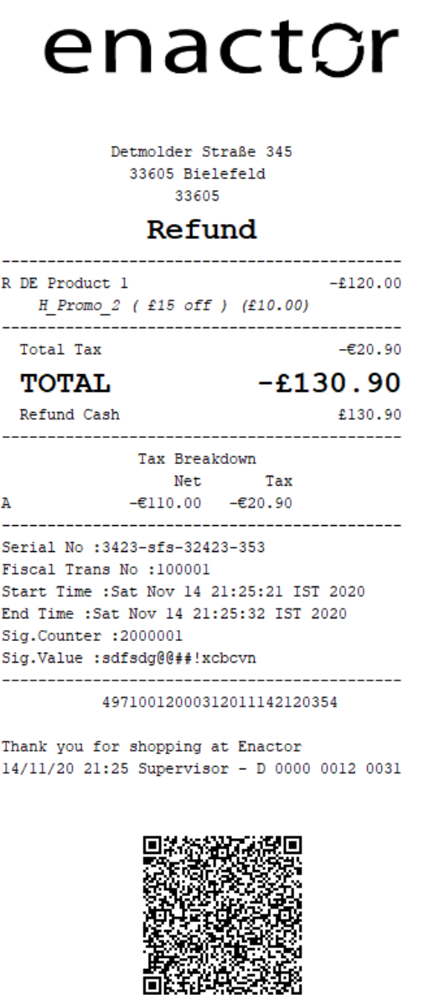
