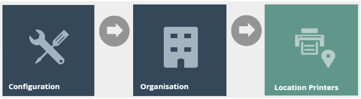
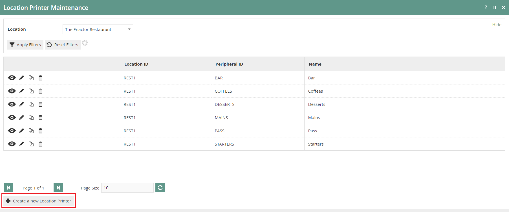
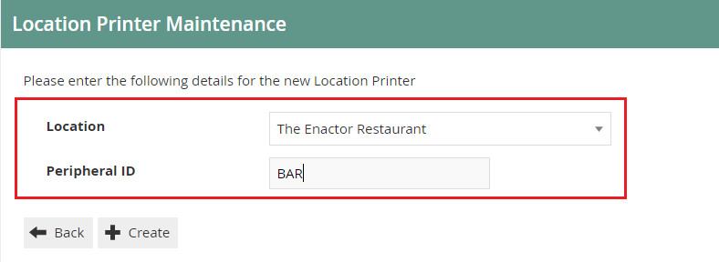
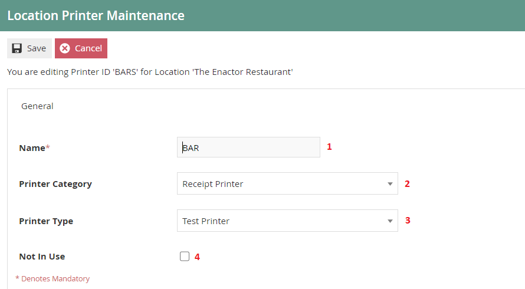
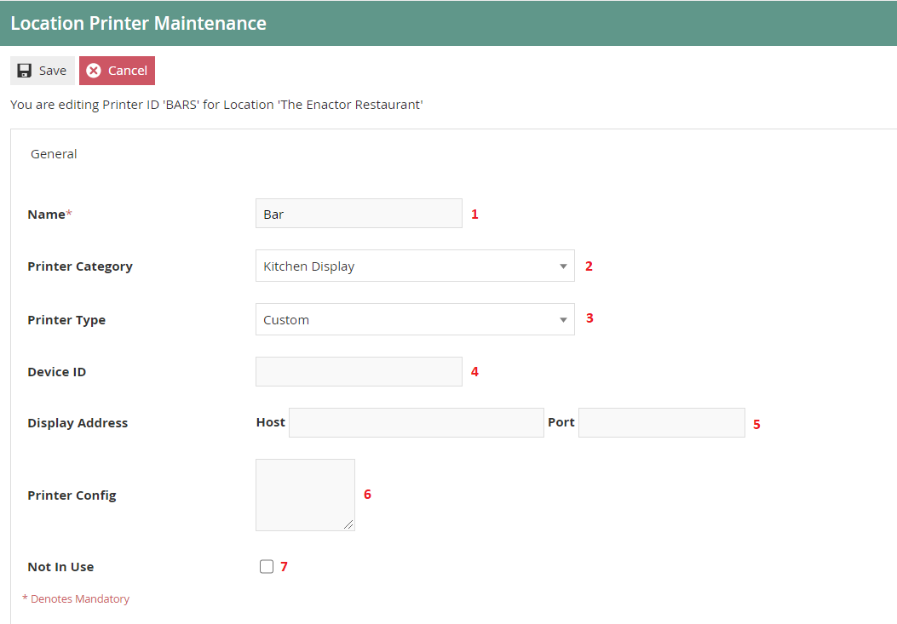
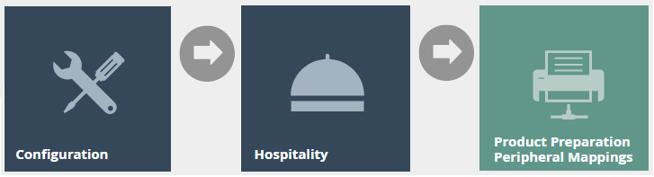
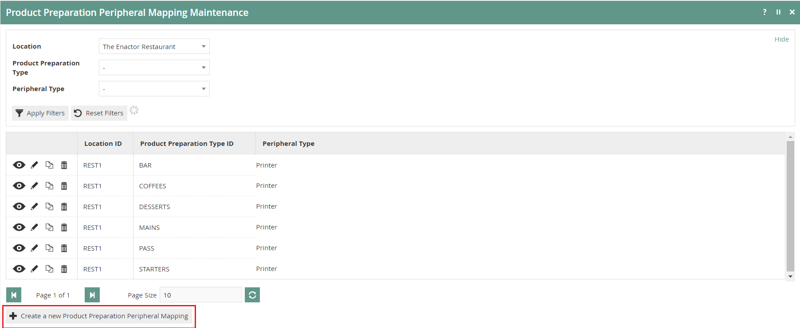
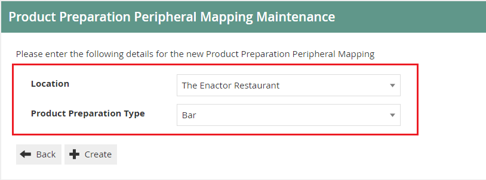
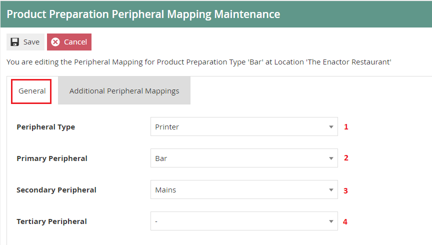
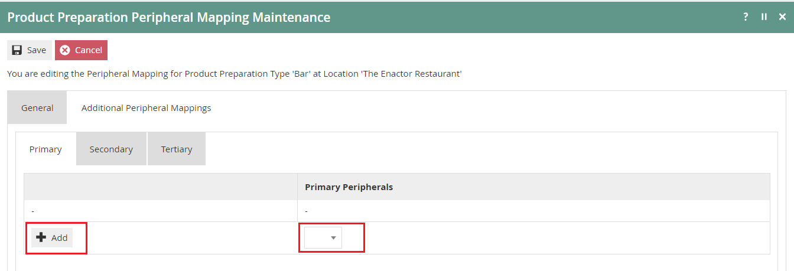

# Kitchen Printers
# Introduction

The purpose of this guide is to provide a foundational understanding of
the options and capabilities available when configuring products in a
restaurant that need to be printed to a Kitchen Printer.

## Overview 

All activities required to define and configure new location printer and
Peripheral Mappings based on product preparation type is provided here.

This guide will cover the configuration for the following:

-   Location Printers

-   Product Preparation Peripheral Mappings

Configuring product preparation types is covered in the **How to
configure Hospitality Products** guide. Products should be configured
before the configuration of Kitchen printers of a restaurants.

## Prior Training / Experience

You should be familiar with the following:

-   Estate Manager Configuration

-   Data Broadcasting

# Location Printer

Location Printers define the printers available at a Location which can
be used for ordering, printing and are typically shared by several POS
terminals. Printers in a restaurant kitchen are described in the
Location Printer Maintenance application.

## Creating a Location Printer

The Location Printer Maintenance application can be accessed through:

Configuration -\> Organisation -\> Location Printers

There can be multiple Location printers defined against the same
physical printer. (For example, Starters and Main course tickets may
both be printed on the same kitchen printer but as separate tickets).

To create a new Location Printer, select **Create a New Location
Printer** on the Location Printer Maintenance page.

Select a Restaurant Location, From the **Location** drop-down.

Enter a unique **Peripheral ID** that can be alphanumeric with a maximum
of 20 characters.

Select **Create.**

You will be presented with the following options to complete creating
the new location printer:

\*This guide will focus on **Printer Categories \"**Receipt Printer\"
and \"Kitchen Display\" only.

### Location Printer Maintenance- Printer Category (Receipt Printer Selection)

Set the appropriate values on **Location Printer Maintenance**
application as follows:

| Configuration    | Description                                                                                                                             |
|------------------|-----------------------------------------------------------------------------------------------------------------------------------------|
| Name             | Enter a Name that can be alphanumeric with a maximum of 30 characters. This will be visible in screens and other configuration options. |
| Printer Category | Select *Receipt Printe*r, from the drop-down list.                                                                                      |
| Printer Type     | Select *Test Printer* from the drop-down list.                                                                                          |
| No In Use        | Select the checkbox to indicate that the location printer cannot be used.                                                               |

\*Enactor also supports the following printer Types:

-   System Named Printer

-   JPOS Printer

-   Generic ESC/POS Serial Printer

-   Axiohm A758 Serial

-   IBM 4610 Serial

-   Star Line

### Location Printer Maintenance- Printer Category (Kitchen Display Selection)

Set the appropriate values on **Location Printer Maintenance**
application as follows:

 | Entry                    | Example Value                | Description                                                                                                                             |
|--------------------------|------------------------------|-----------------------------------------------------------------------------------------------------------------------------------------|
| Name                     | Bar                          | Enter a Name that can be alphanumeric with a maximum of 30 characters. This will be visible in screens and other configuration options. |
| Printer Category         | Kitchen Display              | Select *Kitchen Display*, from the drop-down list.                                                                                      |
| Printer Type             | Custom                       | Select *Custom* from the drop-down list.                                                                                                |
| Device ID                |                              | Enter the Device ID of the kitchen display.                                                                                             |
| Display Address *(Host)* | 192.168.1.31                 | Enter credentials of printer *Host* that can be alphanumeric with a maximum of 30 characters.                                           |
| Display Address *(Port)* | 9100                         | Enter credentials of printer *Port* that can be alphanumeric with a maximum of 5 characters.                                            |
| Printer Config           | printer.delayAfterImage=1000 | Enter additional printer configurations if applicable. Can be Alphanumeric with a maximum of 100 characters.                            |
| Not In Use               |                              | Select the checkbox to indicate that the location printer cannot be used.                                                               |

#  Product Preparation Peripheral Mapping

Product Preparation Peripheral Mappings determine how orders are printed
for products that have a particular preparation type. You need to set
your product preparation types and product preparation type mappings
before this step. These are defined based on location and is covered in
the product configuration How-to Guide.

If a mapping is defined, it enables you to specify the device (Primary
Peripheral) that the order will be sent to, when an item in a particular
Product Preparation Type is ordered. This also includes setting up of
secondary and tertiary peripherals that are intended for use if the
primary is not available.

## Creating Product Preparation Peripheral Mappings

The Product Preparation Peripheral Mapping Maintenance application can
be accessed through:

Configuration -\> Hospitality -\> Product Preparation Peripheral
Mappings

To create a new Product Preparation Peripheral Mapping, select **Create
a new Product Preparation Peripheral Mapping** on the Product
Preparation Peripheral Mapping Maintenance page.

Select a Restaurant Location, from the **Location** drop-down.

From the **Product Preparation Type** drop down, select a Preparation
Type.

Select **Create.**

**\*** All configured locations and Product Preparation Types will be
listed in the drop-down list. Configuring Locations and Product
Preparation Types are described in separate how-to guides.

**Product Preparation Peripheral Mapping Maintenance**

You will be presented with the following options to complete defining
the location printers that an order will be sent to when an item in the
defined Product Preparation Type is ordered.

### Product Preparation Peripheral Mapping Maintenance - General Tab 

Set the appropriate values on the **General** tab as follows:

| Configuration        | Description                                                                                                                                                                                                       |
|----------------------|-------------------------------------------------------------------------------------------------------------------------------------------------------------------------------------------------------------------|
| Peripheral Type      | Select the Peripheral Type from the drop-down list. You can set it either to *Printer* or *Bump Bar* (Kitchen Display).                                                                                           |
| Primary Peripheral   | Select the Primary Peripheral from the drop-down list. This determines the printer or the bump bar the order should be printed/displayed.                                                                         |
| Secondary Peripheral | Select Secondary Peripheral from the drop-down list. This will determine the back-up printer or the bump bar where the order should be printed/displayed if the primary Peripheral is unavailable.                |
| Tertiary Peripheral  | Select Tertiary Peripheral from the drop-down list. This will determine the back-up printer or the bump bar where the order should be printed/displayed if the primary and secondary Peripherals are unavailable. |

\*Peripherals shown are based on the peripheral type selected.

### Product Preparation Peripheral Mapping Maintenance - Additional Peripheral Mappings Tab

You can include additional Primary, Secondary and Tertiary printers
here.

If multiple printers / bump bars of the same type are defined, the order
will be printed / displayed on all of them.

To add additional peripheral(s), select the peripheral from the
drop-down list and select **Add.**

\* The default receipt printer of the POS Application will also be used
as the last resort printer if no other printers are available. In this
instance kitchen dockets will also be printed on the POS Application's
default receipt printer.

## Broadcasting 

To deliver the configuration changes to the POS, broadcast the following
entities.

-   Location Printer

-   Product Preparation Peripheral Mapping

###  
