# Configuring Hospitality Menus
# Introduction

The purpose of this guide is to provide a foundational understanding of
the options and capabilities available when configuring Hospitality
specific Menus related to product sales and other functions.

This guide will cover the configuration for the following Hospitality
specific menus:

-   Restaurant Course Menu

-   Restaurant Bar Menu

-   Restaurant Functions Menu

-   Restaurant Bar Functions Menu

-   Hospitality Modify Item Functions Menu

-   Restaurant Bill Split Menu

-   Restaurant Manager Functions Menu

-   Restaurant Non-Table Sales Functions Menu

-   Restaurant Transaction Notes Functions Menu

-   Restaurant Item Notes Functions Menu

-   Tender Menu

**Prior Training / Experience **

You should be familiar with the following: 

-   Estate Manager Configuration 

-   Data Broadcasting

# POS Menus

Enactor Applications that present User Interfaces (UIs) use **Menus** as
the principal means to navigate and access functionality of the
Application. Menu configuration provides the first level control over
what Application Functionality individual Users and groups of Users may
access and how they navigate to the functions they require.

Menus are associated with a **Locale**, **User Role **and **Menu
Group**. Before configuring menus, the related configuration
elements must be understood and configured. From the POS User
perspective some POS Menu options select other Menus or refer
to software functions. In most hospitality POS Menus, the action behind
the Menu Option is an Event; a Function or a Process defined within the
constraint of the Menu Set.  

## Restaurant Menu Configuration

The Menu Maintenance application can be accessed through:  

Configuration -\> System -\> Menus  

 

 

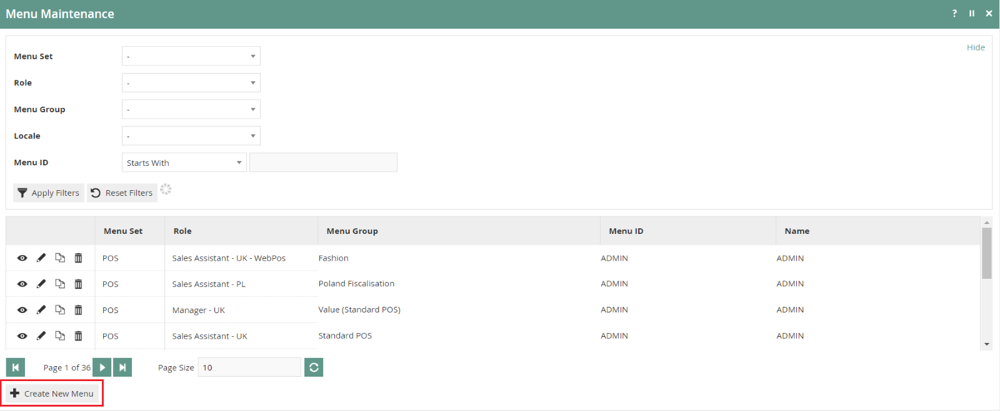 

### Creating a Linked Menu

A linked menu is a series of menus linked to one another to form one
large menu. Linked menus can be defined when configuring food menus to
be used in the POS application. Before creating the main Restaurant
Course menu or Restaurant Bar menu, we should create linked menus for
each product category. This would enable to add these linked menus to
the main Restaurant Course menu or Restaurant Bar menu which will be
configured later.

Following is an example of creating a Linked Menu for the product
category Champagne and adding an item to it:

To create a new linked Menu, select **Create New Menu **on the Menu
Maintenance page**.** 

You will be presented with the following options.

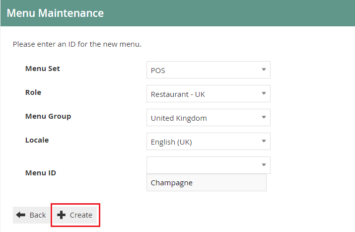

Set the appropriate values on the** Menu Maintenance** screen as
follows: 

| Configuration | Description                                                                                                                                                    |
|---------------|----------------------------------------------------------------------------------------------------------------------------------------------------------------|
| Menu Set      | This selection determines the basic elements of functionality offered by the Application. Select *POS* from the drop-down list.                                |
| Role          | Role provides the necessary permissions to access the function options of the Menu. Select *Restaurant-UK* from the drop-down list.                            |
| Menu Group    | This selection allows to identify a set of Menus associated the with Location(s) in which its use is enabled. Select *United Kingdom* from the drop-down list. |
| Locale        | Defines the defines locale in which the Menu may be used. Select *English (UK)* from the drop-down list.                                                       |
| Menu ID       | Must be a unique ID that identifies an Application Context in which the Menu will be requested. Can contain up to a maximum of 30 alphanumeric characters.     |
     
Select **Create.** 

You will be presented with the following options to complete creating
the new linked menu: 

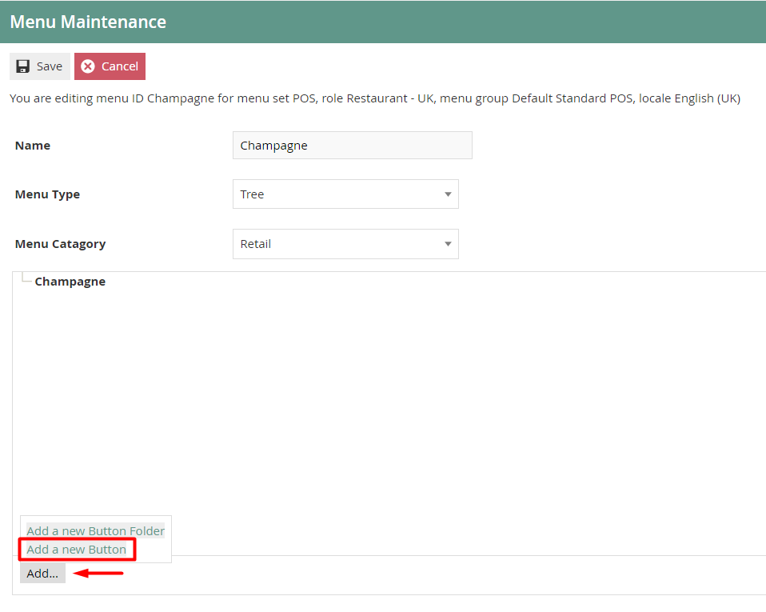

Enter a **Name** that can contain up to maximum of 20 alphanumeric
characters.

 

Select** Tree** from** **the Menu Type drop-down.

Select** Hospitality** from** **the Menu Category drop-down.

Select the Menu root **Champagne**, and the menu options will appear at
the bottom left corner.

Select **Add**.

From the list select **Add a new Button** to proceed.

### Menu Maintenance - General Tab

On adding a basic menu item, the general tab captures the main data
associated with the item.

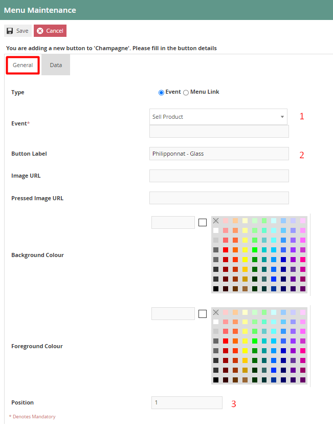

Set the appropriate values on the** General** tab as follows: 

| Configuration | Description                                                                                                                    |
|---------------|--------------------------------------------------------------------------------------------------------------------------------|
| Event         | Select *Sell Product* from the drop-down list.                                                                                 |
| Button Label  | Enter a value that describes what the product ID button will sell on selection, this will be displayed on the POS Application. |
| Position      | Enter a numeric value that will indicate where the menu item is to be displayed in the Menu Order.                             |
                                                                                           |
### 

### Menu Maintenance - Data Tab  

The Data Tab allows the user to set a restaurant product for sale in the
Restaurant Courses menu. Here the product must be specified in the data
tab. This can be done by clicking on the **Product Search icon** in the
Data tab.

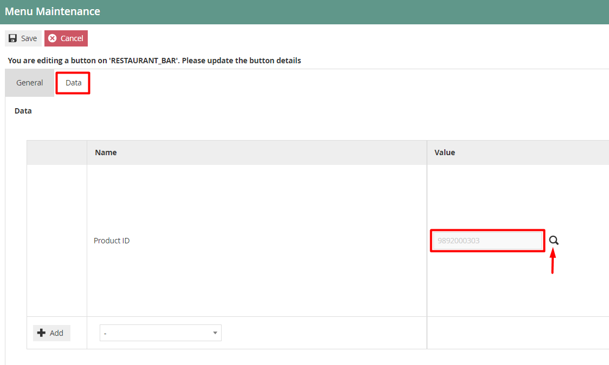{width="5.0in" height="3.0in"}

After configuring both the tabs, select **Save** to complete creating
the new Product in the Menu Link.

## Restaurant Course Menu

This is the main menu which displays all the Restaurant Products for the
Restaurant Dine-in location. If you have a Dine-in location in your
Restaurant and you want to list your Restaurant Products to sell, this
is the menu that must be created.

Following is a configured Restaurant Course Menu in the Estate Manager:

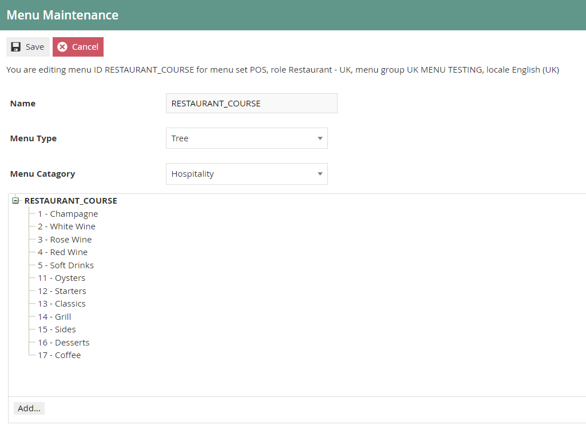

### Creating a Restaurant Course Menu

To create a root Restaurant Course menu with the link menu created,
select **Create New Menu **on the Menu Maintenance page.

You will be presented with the following options:

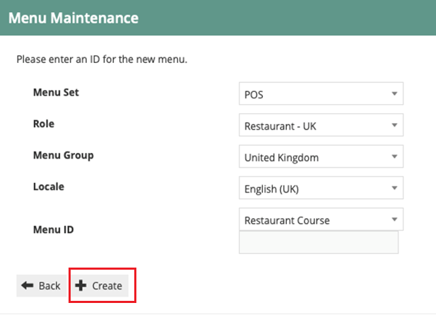

Select **Restaurant Course** from the Menu ID drop-down list.

Select **Create**. 

You will be presented with the following options to complete creating
the new restaurant course menu:

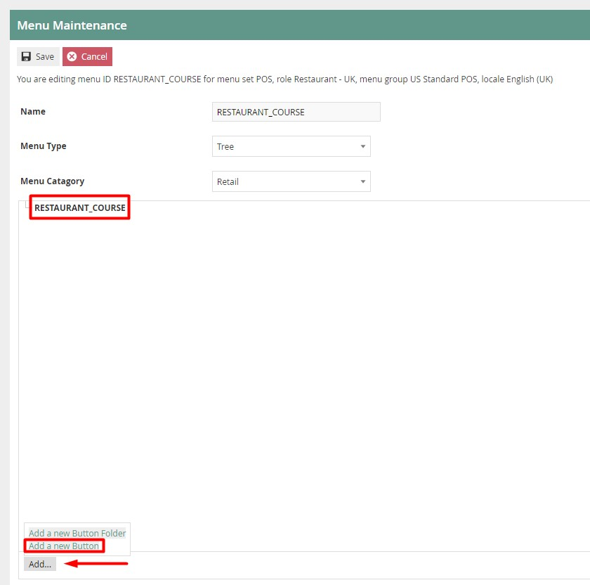

Enter a **Name** that can contain up to maximum of 20 alphanumeric
characters.

 

Select** Tree** from** **the Menu Type drop-down.

Select the Menu root **RESTAURANT_COURSE**, and the menu options will
appear at the bottom left corner.

Select **Add.**

From the list select **Add a new Button** to proceed.

You will be presented with the following options:

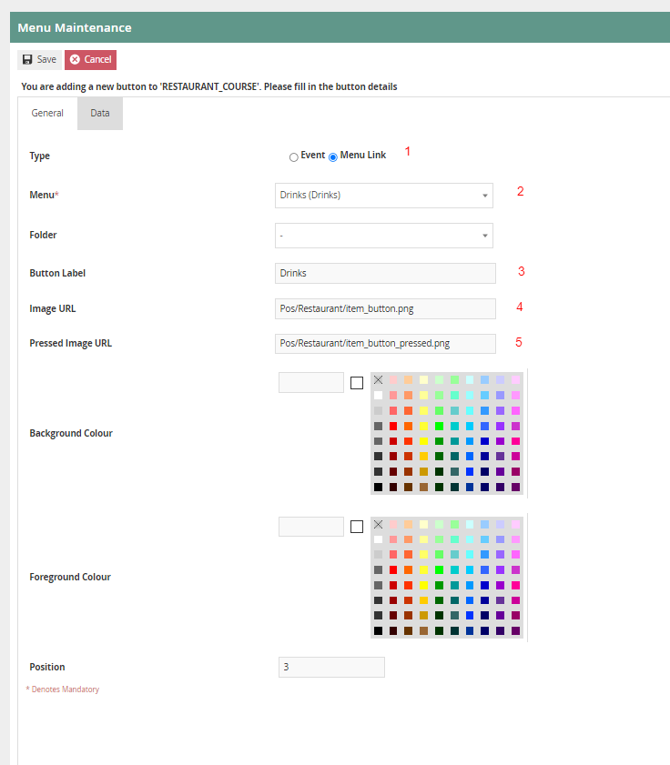

Set the appropriate values on the** General** tab as follows: 

| Configuration     | Description                                                                                                                                                                                             |
|-------------------|---------------------------------------------------------------------------------------------------------------------------------------------------------------------------------------------------------|
| Type              | Select *Menu Link* which will provide a reference to the link Menu that was previously defined independently which requires to be added to this course menu.                                            |
| Menu              | Select the appropriate Menu that needs to be linked to, from the drop-down list.                                                                                                                        |
| Button Label      | This is a fixed text which will appear on Tile of Menu tree entry that will select the menu folder. Can be alphanumeric and contain a maximum of 30 characters. Enter an appropriate Button label name. |
| Image URL         | Captures the URL identifying an image to be displayed on the button. Can be alphanumeric and contain a maximum of 100 character. Enter *Pos/Restaurant/item_button.png*                                 |
| Pressed Image URL | Captures the URL of any image to be displayed on the button when it is pressed. Enter *Pos/Restaurant/item_button_pressed.png*                                                                          |

After configuring both the tabs, select **Save** to complete creating
the new Restaurant Course Menu item.

This menu can be accessed in the POS as follows:

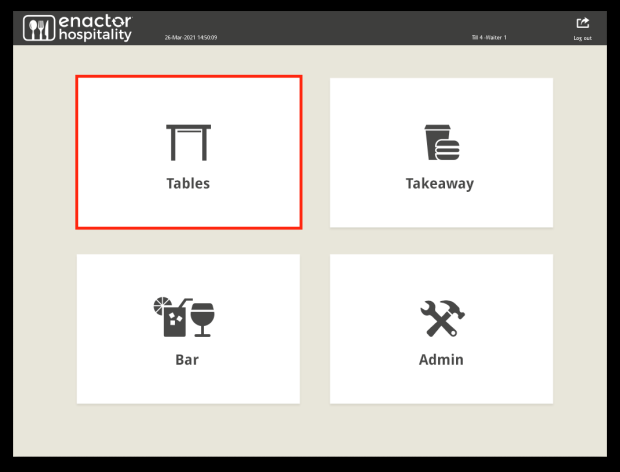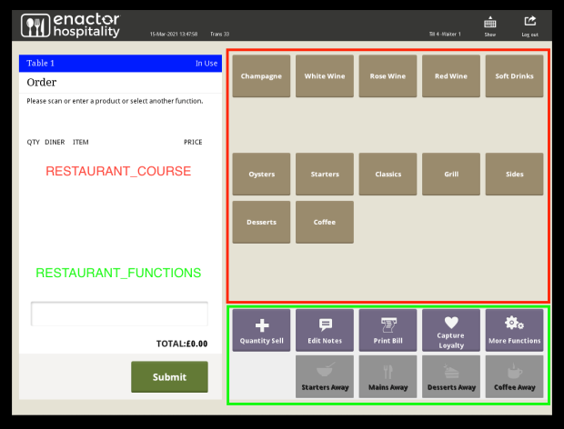

The menu represented by RESTAURANT_COURSE in the above image is the one
to be configured.

## Restaurant Bar Menu

This is the main menu which displays all the Restaurant Products for the
Restaurant Bar location. If you have a Bar location in your Restaurant
and you want to list your Restaurant Products to sell, this is the menu
that must be created.

When creating this new menu, make sure to select **Restaurant Bar** from
the Menu ID drop-down list.

Following is a configured Restaurant Bar Menu in the Estate Manager:

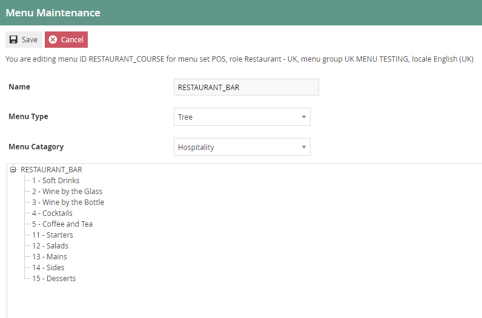

Following are the events which can be configured for this menu:

| Event Name and Data | Description                                                                                                                                                                                                                          |                             |
|---------------------|--------------------------------------------------------------------------------------------------------------------------------------------------------------------------------------------------------------------------------------+-----------------------------|
| Sell Product  Data: Product ID       | Allows the user to set a restaurant product for sale in this menu. Here the product must be specified in the data tab. This can be done by clicking on the Product Search icon in the Data tab. 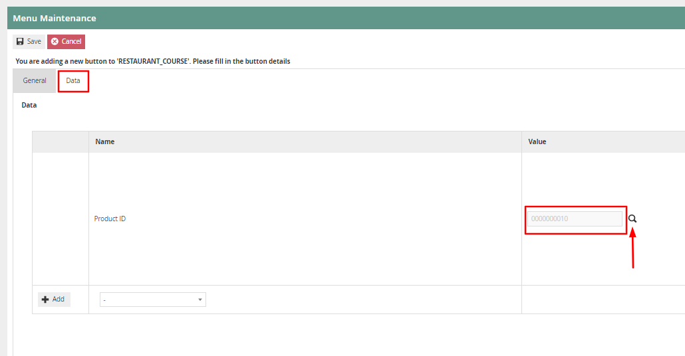 | No privileges are required. |
                                                                                                                                                                                                                |                             |

This menu can be accessed in the POS as follows:

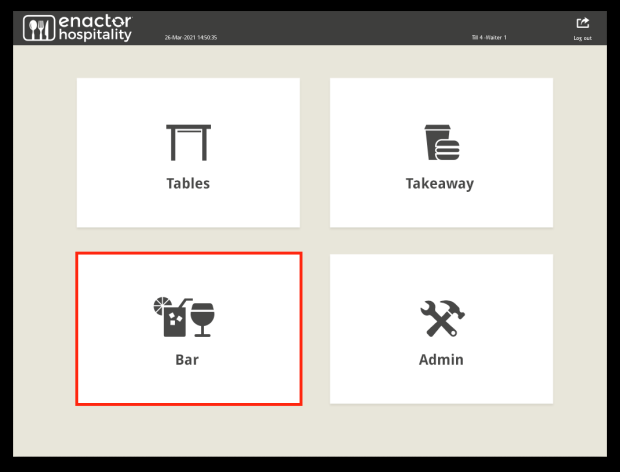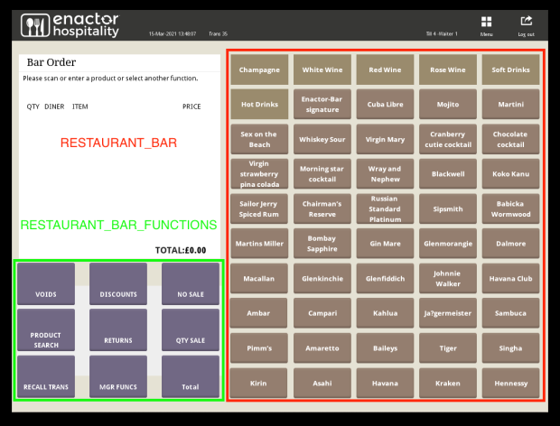

The menu represented by RESTAURANT_BAR in the above image is the one to
be configured.

## 

## Restaurant Functions Menu

This is the main menu which displays all the Restaurant related
functions in the Restaurant Dine-in location.

When creating this new menu, make sure to select **Restaurant
Functions** from the Menu ID drop-down list.

Following is a configured Restaurant Functions Menu in the Estate
Manager:

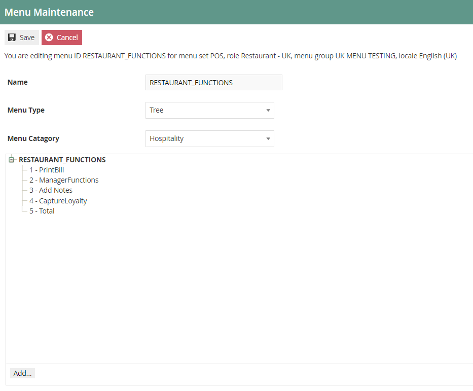

Following are the events which can be configured for this menu:

| Event Name and Data | Description                                                                                                                       |   Privileges                          |
|---------------------|-----------------------------------------------------------------------------------------------------------------------------------|-----------------------------|
| Print Bill          | Allows the user to print the bill for a table (note - this is also available from one of the quick launch buttons on each table). | No privileges are required. |
| Manager Functions   | Allows to user to access the Restaurant Manager Functions menu.                                                                   | No privileges are required. |
| Add Notes           | Allows to user to access the Restaurant Transaction Notes Functions menu.                                                         | No privileges are required. |
| Total               | Enables to start the Tender process by taking the user to the Tender menu.                                                        | No privileges are required. |

This menu can be accessed in the POS as follows:

The menu represented by RESTAURANT_FUNCTIONS in the above image is the
one to be configured.

## Restaurant Bar Functions Menu

This is the main menu which displays all the Restaurant related
functions in the Restaurant Bar location.

When creating this new menu, make sure to select **Restaurant Bar
Functions** from the Menu ID drop-down list.

Following is a configured Restaurant Bar Functions Menu in the Estate
Manager:

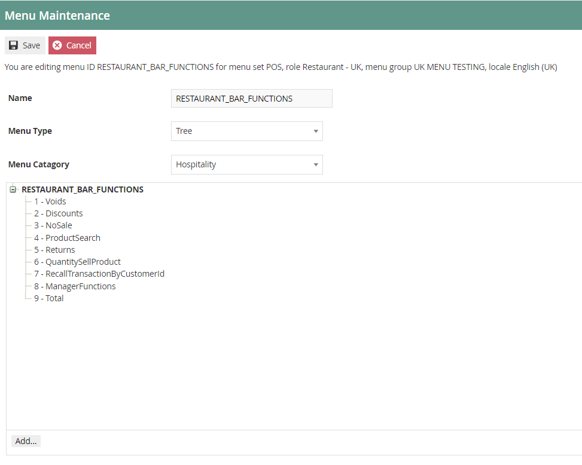{width="5.0in" height="4.0in"}

The events that are available for configuration in this menu are the
same set of events available for the Restaurant Functions menu.

This menu can be accessed in the POS as follows:

The menu represented by RESTAURANT_BAR_FUNCTIONS in the above image is
the one to be configured.

## Hospitality Modify Item Functions Menu

This is the menu which allows to make modifications to the list of items
added in the order.

When creating this new menu, make sure to select **Hosp Modify Item
Functions** from the Menu ID drop-down list.

Following is a configured Hospitality Modify Item Functions Menu in the
Estate Manager:

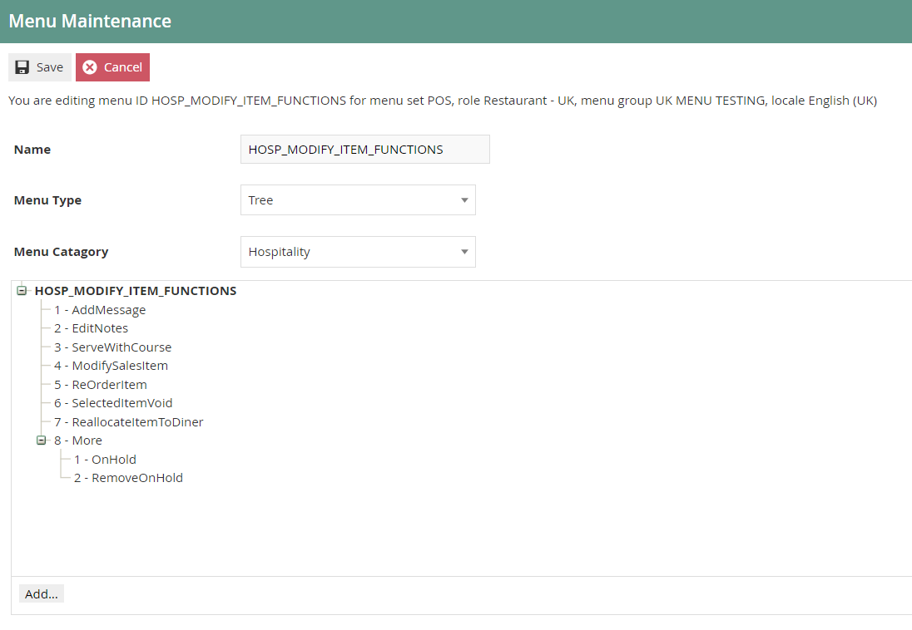

Following are the events which can be configured for this menu:

| Event Name and Data      | Description                                                                                                                                       | Privileges                  |
|--------------------------|----------------------------------------------------------------------------------------------------------------------------------------------------|-----------------------------|
| Re Order Item            | Allows the operator to select an item already in the virtual basket, then re-order it (including any options selected) with one button press.      | No privileges are required. |
| Modify Sales Item        | Allows the operator to edit the item, changing options selected or editing the item message.                                                       |  No privileges are required.|
| Reallocate Item To Diner | Allows an item to be allocated to a different diner.                                                                                               |  No privileges are required.|
| On Hold                  | Adds a text message of On Hold to the item when it is submitted to the kitchen.                                                                    | No privileges are required. |
| Add Message              | Allows the operator to add a message to the item that will be submitted to the kitchen.                                                            | No privileges are required. |
| Edit Notes               | Allows the operator to edit notes already added to the item.                                                                                       | No privileges are required. |
| Serve With Course        | Allows the operator to allocate an item to a course other than the one it is configured against (e.g. customer orders a starter as a main course). | No privileges are required. |
| Selected Item Void       | Allows the operator to void the selected item.                                                                                                     | No privileges are required. |

This menu can be accessed in the POS as follows:

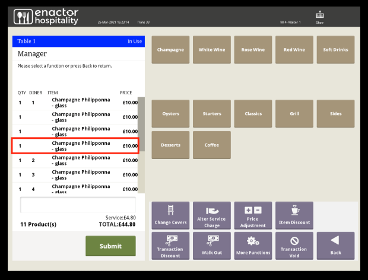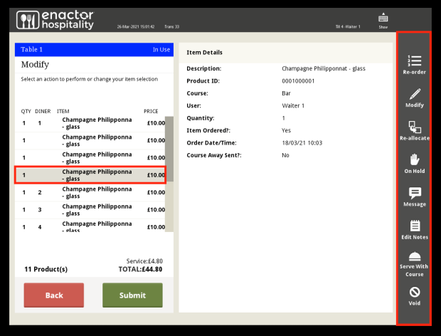

The menu appears on the right when the item is selected.

## Restaurant Bill Split Menu

This is the menu which allows to split the total amount of the
restaurant bill based on the split requirement.

When creating this new menu, make sure to select **Restaurant Bill Split
Menu** from the Menu ID drop-down list.

Following is a configured Restaurant Bill Split Menu in the Estate
Manager:

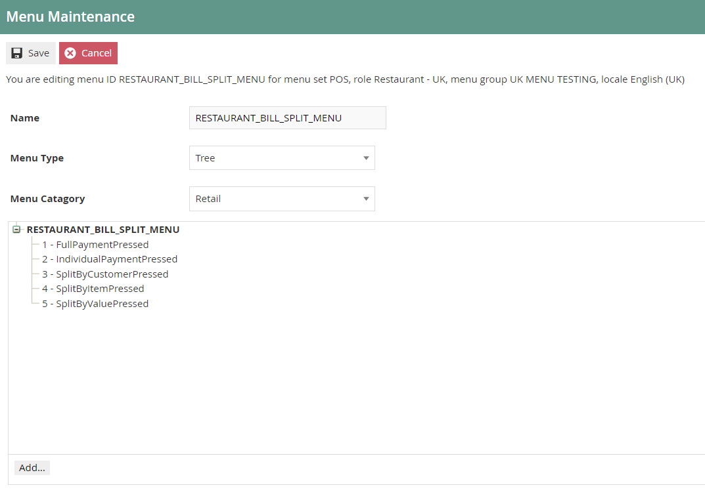

Following are the events which can be configured for this menu:

| Event Name                 | Description                                                                                                                    | Privileges                  |
|----------------------------|----------------------------------------------------------------------------------------------------------------------------------|-----------------------------|
| Full Payment Pressed       | Enables the transaction to be paid in full without any bill splitting.                                                           | No privileges are required. |
| Split By Value Pressed     | Enables the transaction total to be split by the number entered by the POS operator.                                            | No privileges are required. |
| Split By Item Pressed      | Allows the operator to split the bill per item in the transaction.                                                               | No privileges are required. |
| Split By Customer Pressed  |  Once selected, a split is created for each diner on the table and each diner's items are automatically allocated to their split. | No privileges are required. |
| Individual Payment Pressed | Allows an operator entered cash amount to be paid off the value of the transaction.                                              | No privileges are required. |

This menu can be accessed by clicking on the total button of another
menu, and would appear in the POS as follows:

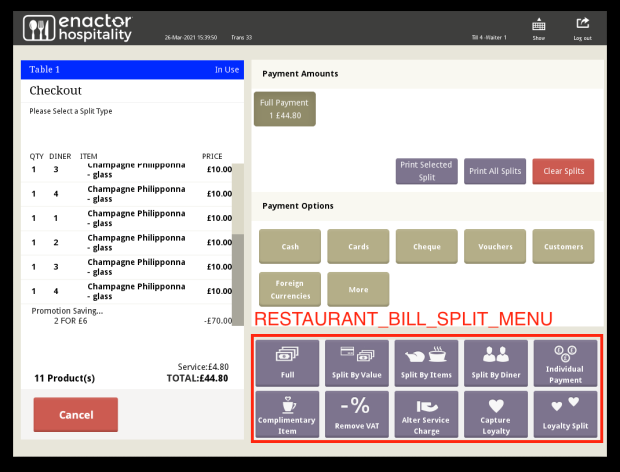

The menu represented by RESTAURANT_BILL_SPLIT_MENU in the above image is
the one to be configured.

## Restaurant Manager Functions Menu

This is the menu which allows to access and run Manager based events and
functions for a Restaurant.

When creating this new menu, make sure to select **Restaurant Manager
Functions** from the Menu ID drop-down list.

Following is a configured Restaurant Manager Functions Menu in the
Estate Manager:

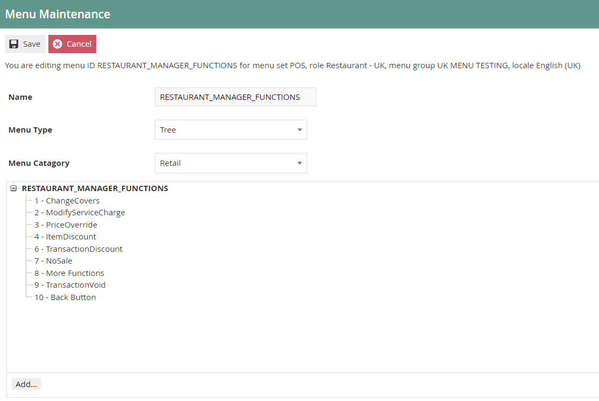

Following are the events which can be configured for this menu:

| Event Name                 | Description                                                                          | Privileges                  |
|----------------------------|----------------------------------------------------------------------------------------|-----------------------------|
| Modify Service Charge      | Enables to modify the service charge of the order.                                     | No privileges are required. |
| Modify Service Charge      | Enables to modify the service charge of the order.                                     |                             |
| Change Covers              | Allows the operator to amend the number of diners originally entered on the table.     | No privileges are required. |
| Cancel Course Away         | Enables the operator to cancel an Away Message that was submitted by mistake.          | No privileges are required. |
| Change Table Status        | Enables a user to change the status of a table.                                        | No privileges are required. |
| Merge Transaction By Table | Enables the transactions on two tables to be merged into one transaction on one table. | No privileges are required. |

This menu can be accessed by clicking on the Manager button of another
menu, and would appear in the POS as follows:

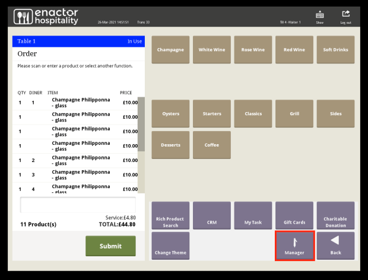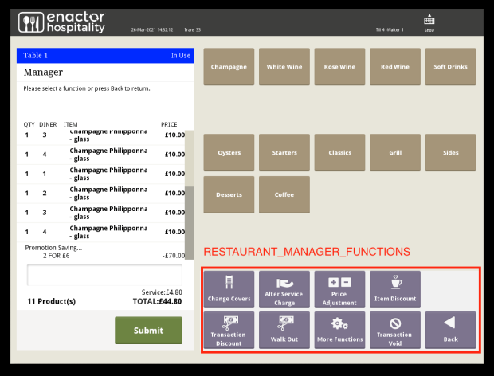

The menu represented by RESTAURANT_MANAGER_FUNCTIONS in the above image
is the one to be configured.

## Restaurant Non-Table Sales Functions Menu

This is the menu which allows to access and run Admin related functions
of a Restaurant.

When creating this new menu, make sure to select **Restaurant Non Table
Sales Functions** from the Menu ID drop-down list.

Following is a configured Restaurant Non Table Sales Menu in the Estate
Manager:

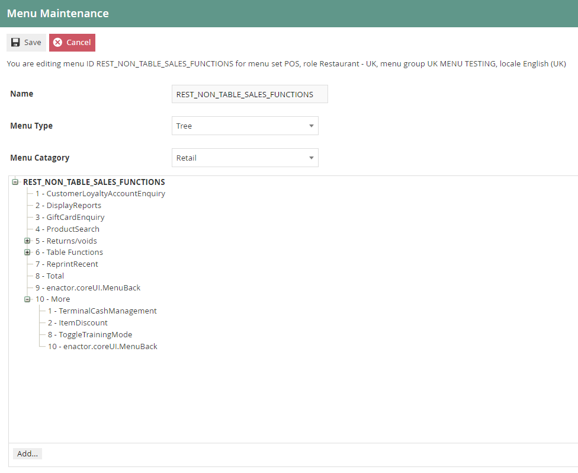

Following are the events which can be configured for this menu:

| Event Name                | Description                                                        | Privileges                      |
|---------------------------|---------------------------------------------------------------------|---------------------------------|
| Set Table Out Of Use      | Enables to change the status of the table to "Out of Use".       | No privileges are required.     |
| Set Table In Use          | Enables to change the status of the table to "Out of Use".           | No privileges are required.     |
| Set Table Reserved        | Enables to change the status of the table to "Out of Use".             | No privileges are required.     |
| Remove Table Reservations | If there are any table reservations, this enables to remove them.   | No privileges are required.     |
| Product Search            | Enables to search for a Product of the list of Products configured. | enacto r.pos.AllowProductSearch |

This menu can be accessed in the POS as follows:

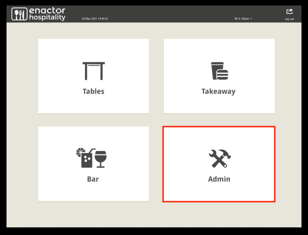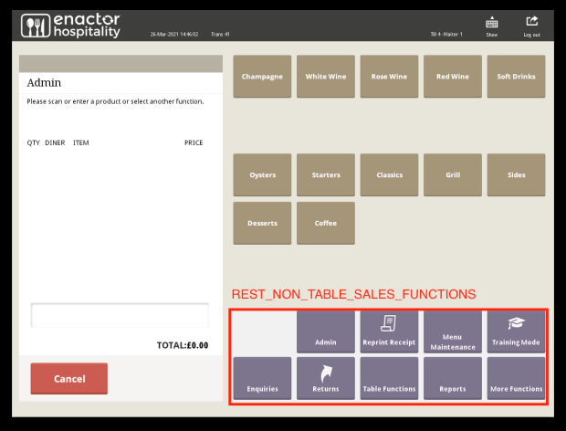

The menu represented by REST_NON_TABLE_SALES_FUNCTIONS in the above
image is the one to be configured.

## Restaurant Transaction Notes Functions Menu

This is the menu which allows to attach notes to the current transaction
of the Restaurant.

When creating this new menu, make sure to select **Restaurant
Transaction Notes** from the Menu ID drop-down list.

Following is a configured Restaurant Transaction Notes Functions Menu in
the Estate Manager:

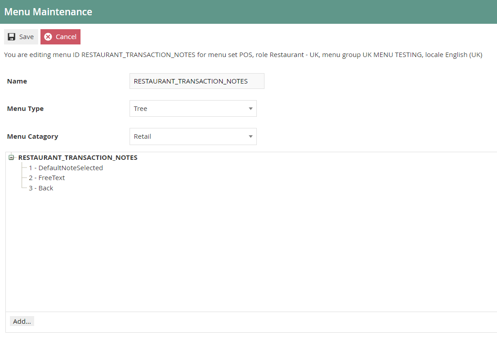

Following are the events which can be configured for this menu:

 Event Name            | Description                                                                                                                | Privileges                  |
|-----------------------|------------------------------------------------------------------------------------------------------------------------------|-----------------------------|
| Free Text             | Enables to enter any text to attach with the transaction.                                                                    | No privileges are required. |
| Default Note Selected Data: Default Note Value | Enables to have the default note attached with the transaction. When configuring the Default Note, the value that you want to have as your Default Note should be specified in the data tab. | No privileges are required. |

This menu can be accessed by clicking on the Edit Notes button of either
the Restaurant Functions or Restaurant Bar Functions menu, and would
appear in the POS as follows:

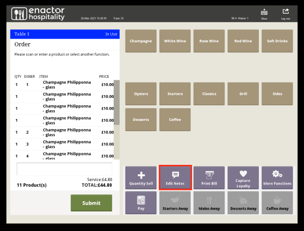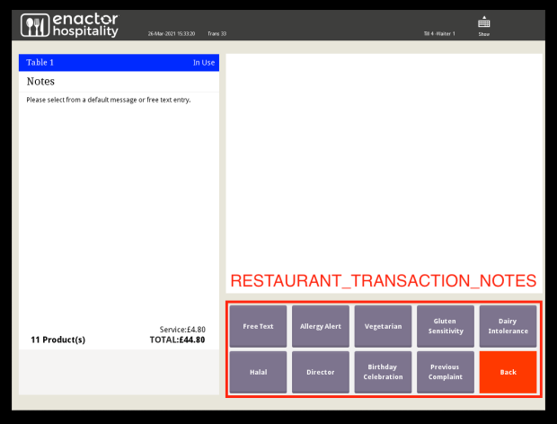

The menu represented by RESTAURANT_TRANSACTION_NOTES in the above image
is the one to be configured.

## Restaurant Item Notes Functions Menu

This is the menu which allows to attach notes to each item of the
current transaction.

When creating this new menu, make sure to select **Restaurant Item
Notes** from the Menu ID drop-down list.

Following is a configured Restaurant Item Notes Menu in the Estate
Manager:

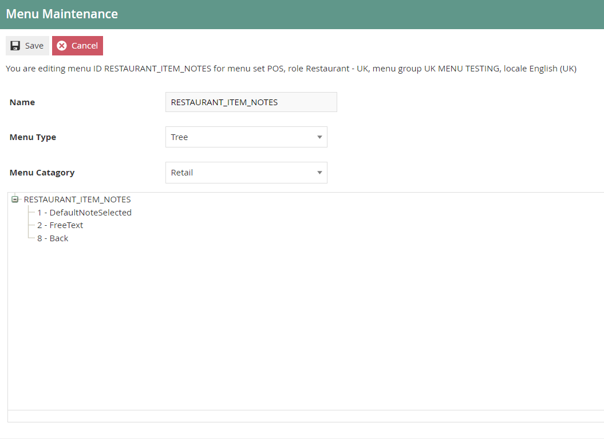

Following are the events which can be configured for this menu:

| Event Name            | Description                                                                                                                | Privileges                  |
|-----------------------|------------------------------------------------------------------------------------------------------------------------------|-----------------------------|
| Free Text             | Enables to enter any text to attach with the transaction.                                                                     | No privileges are required. |
| Default Note Selected Data: Default Note Value | Enables to have the default note attached with the transaction. When configuring the Default Note, the value that you want to have as your Default Note should be specified in the data tab.   | No privileges are required. |

This menu can be accessed by clicking on the Edit Notes button of the
Hospitality Modify Item Functions Menu in the POS as follows:

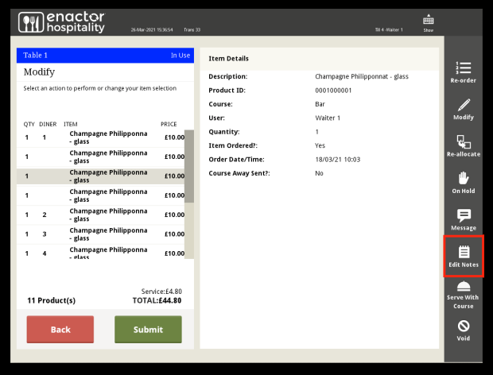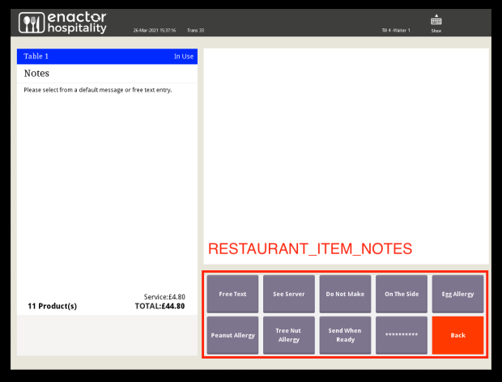

The menu represented by RESTAURANT_ITEM_NOTES in the above image is the
one to be configured.

## Tender Menu

This is the menu which allows to make tender transactions after the
products have been added and are ready to be totalled.

When creating this new menu, make sure to select **Tender** from the
Menu ID drop-down list.

Following is a configured Tender Menu in the Estate Manager:

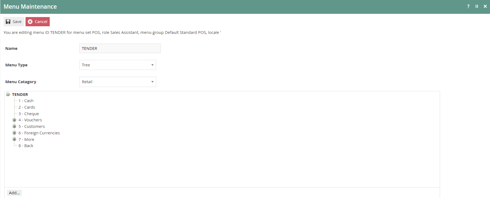

Following are the events which can be configured for this menu:

| Event Name            | Description                                                                                                                                         | Privileges                     |
|-----------------------|-----------------------------------------------------------------------------------------------------------------------------------------------------------|--------------------------------|
| Cash Tender Data: enac tor.mfc.TenderId | Enables to make cash-based tender transactions. Here the Tender ID must be specified in the data tab with a Cash Tender that has already been configured. | enact or.pos.CashTenderAllowed |

This menu can be accessed by clicking on the Total button of another
menu in the POS as follows:

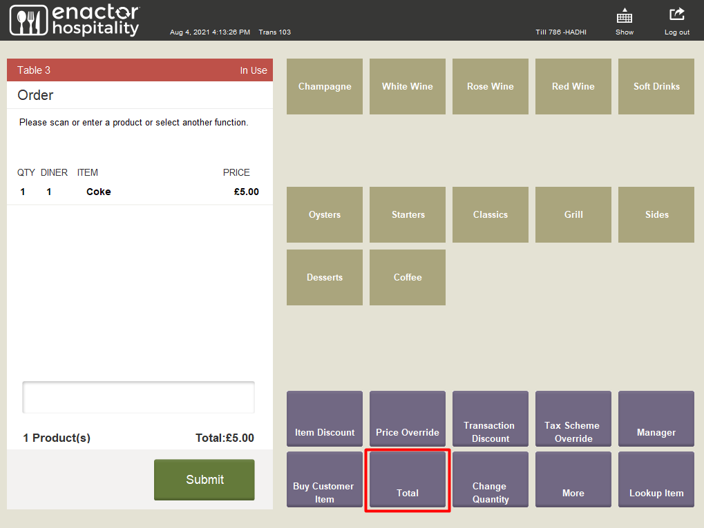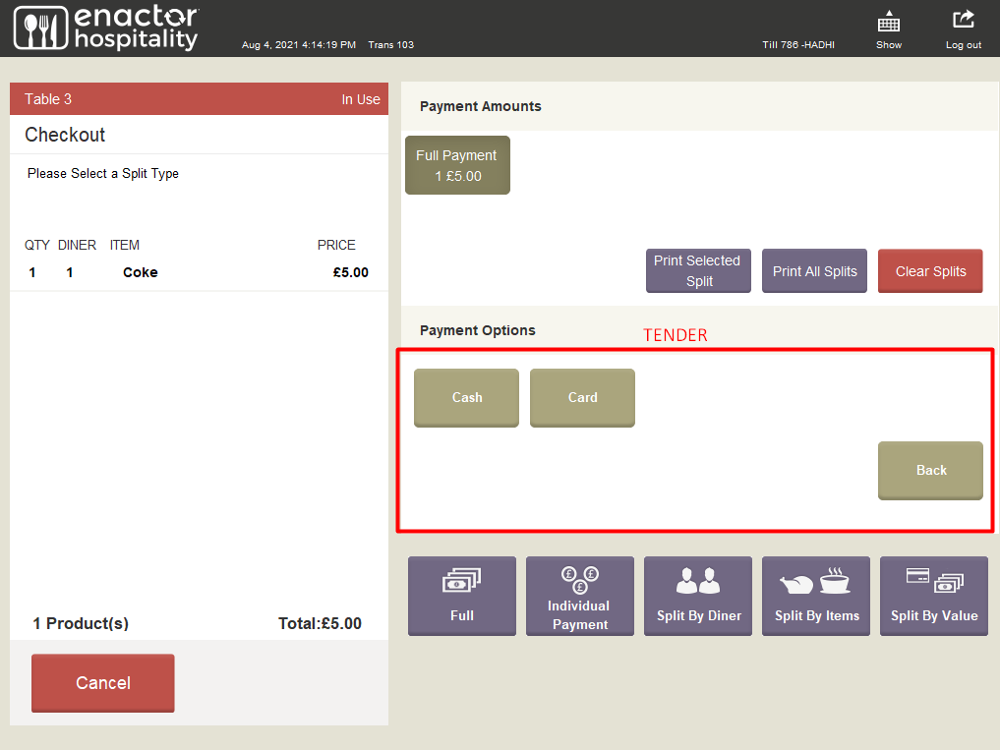

The menu represented by TENDER in the above image is the one to be
configured.
