# Configuring Hospitality Products
# Introduction

The purpose of this guide is to provide a foundational understanding of
the options and capabilities available when configuring all the
different types of Hospitality Products and Restaurant Courses.

## Overview 

All activities required to define and configure a new Hospitality
Product including Product Preparation Types, Restaurant Course, Option
and set product is provided here.

This guide will cover the configuration for the following:

-   Hospitality Product

-   Hospitality Product Set Product

-   Hospitality Option Product

-   Service Charge Fee Product

-   Product List

-   Option Set

    -   Product Options

    -   Product Preparation Options

    -   Product Set Options

-   Product Preparation Types

-   Product Preparation Type Mappings

-   Restaurant Course

## Prior Training / Experience

You should be familiar with the following:

-   Estate Manager Configuration

-   Data Broadcasting

# Hospitality Products

Enactor supports multiple hospitality product types such as Hospitality
Product, Hospitality Option Product, Hospitality Product Set Product.
Hospitality products are configured through the Product Maintenance
application on the estate manager.

The Product Maintenance application can be accessed through: 

Configurations-\> Merchandise -\> Products 

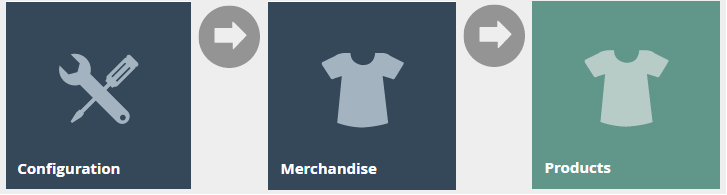

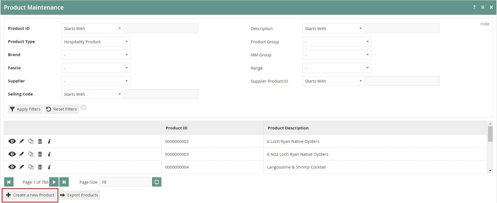

To create a new Hospitality Product, select **Create a new Product** on
the Product Maintenance page.

Select **Hospitality Product from** the Product Type drop-down.

No selection should be made for **Template**. The creation and use of
Templates are covered in a separate How-to Guide.  This document covers
how to manually configure the mandatory and common settings relating to
hospitality product maintenance. 

Enter a unique **Product ID** for this product that can be alphanumeric
and contain a maximum of 20 characters. 

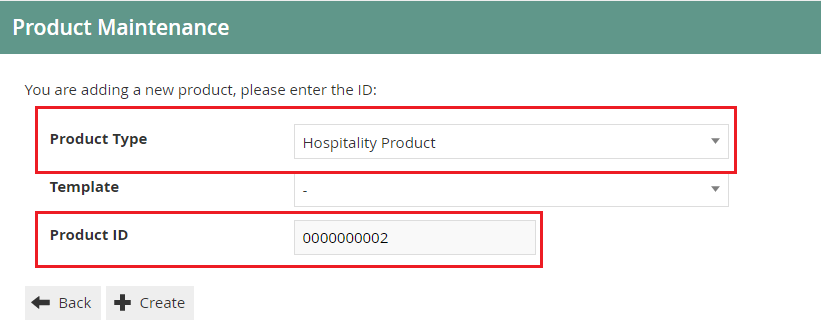

Select Create. 

**\* **The Product ID cannot be changed once the Product has been
created. 

## Product Maintenance 

Numerous tabs and sub-tabs are presented under product maintenance. This
guide is focused on the core aspects that are required to create a
Hospitality Product and the key
tabs are **General** and **Hospitality**. 

### Product - General Tab 

The General tab has all the basic information that
captures the identity of the hospitality product. 

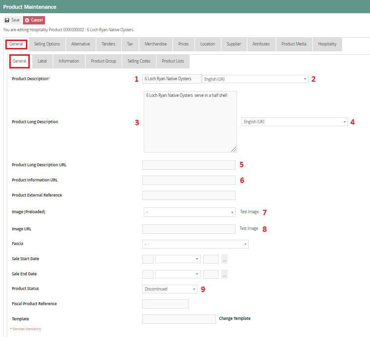

### Product - General -- General Sub-tab 

Set the appropriate values on the** General **tab as follows: 

| Configuration                | Description                                                                                                                                                                         |
|------------------------------|-------------------------------------------------------------------------------------------------------------------------------------------------------------------------------------|
| Product Description          | Enter a user-friendly, meaningful name for the Product that can be alphanumeric with a maximum of 30 characters.                                                                    |
|                              | Select the locale in the second field from a dropdown list of all configured locales.                                                                                               |
| Product Long Description     | Enter a long description of the Product if necessary, that can be alphanumeric with a maximum of 30 characters.                                                                     |
|                              | Select the locale in the second field from a dropdown list of all configured locales.                                                                                               |
| Product Long Description URL | Enter a URL pointer to an externally defined, usually HTML-formatted, description of the Product.                                                                                   |
| Product Information URL      | Enter a URL pointer to an externally defined, usually HTML-formatted, set of information of the Product.                                                                            |
| Image (Preloaded)            | Select the ID of an image from the drop-down list to choose the product display image. Images are managed through Image Maintenance. (This is described in a separate how-to guide) |
| Image URL                    | Add a URL that points to an externally stored image.                                                                                                                                |
| Product Status               | Select an appropriate status of the product from a drop-down list.                                                                                                                  |
|                              |                                                                                                                                                                                     |
|                              | - *Live* -- Indicates that the product is currently available.                                                                                                                      |
|                              |                                                                                                                                                                                     |
|                              | - *Discontinued* -- Indicates that the product is unavailable.                                                                                                                      |
|                              |                                                                                                                                                                                     |
|                              | - *Suspended* -- Indicates that the product is terminated.                                                                                                                          |

### Product - Prices Tab

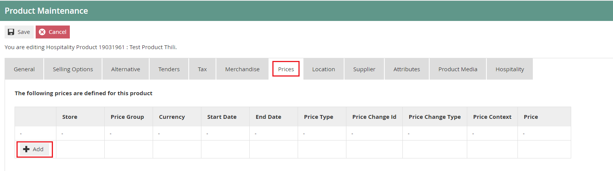

Select **Add,** and you will be navigated to **Product Price
Maintenance** screen as shown below:

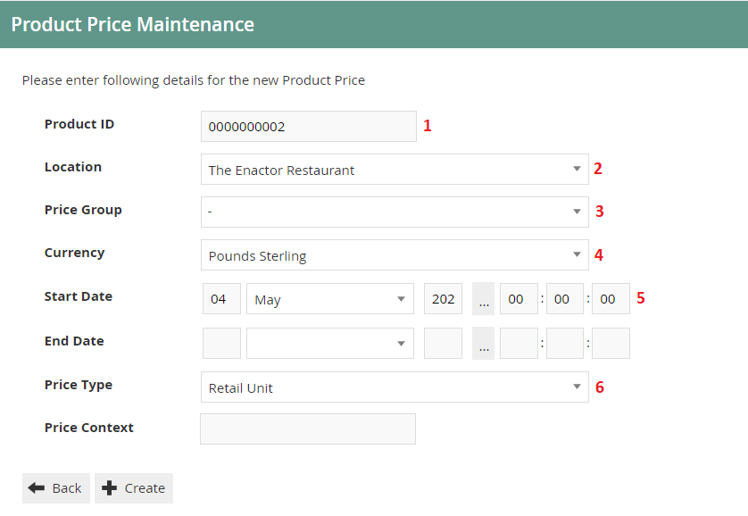

Set the appropriate values on the** Product Price Maintenance** as
follows: 

 | Configuration  | Description                                                                                                                                                             |
|----------------|-------------------------------------------------------------------------------------------------------------------------------------------------------------------------|
| Product ID     | Product ID of the product that you wish to set the price of will appear here if accessed through the prices tab in Product Maintenance. Or add the relevant product ID. |
| Location       | Select the appropriate location from the dropdown list. Do not select if a Price Group is already set.                                                                  |
| Price Group    | Select the appropriate price group from the dropdown list. Set to *UK (All Regions)* under *RESTAURANT (All Regions).* Do not select if a Location is already set.      |
| Currency       | Select *Pound Sterling* from the dropdown list. (Or whichever is applicable)                                                                                            |
| Start Date     | Defines the date from when the product price is applied. Defaults to the date of creation of the Product price entry.                                                   |
| End Date       | Defines the end date of the product price application (if necessary). Defaults to indefinite.                                                                           |
| Price Type     | Select *Retail Unit* from the dropdown list.                                                                                                                            |

\* Location and Price Group cannot be set at the same time. You must
choose either one of the options to proceed.

Select **Create.**

You will be presented with the following options to complete creating
the new product price:

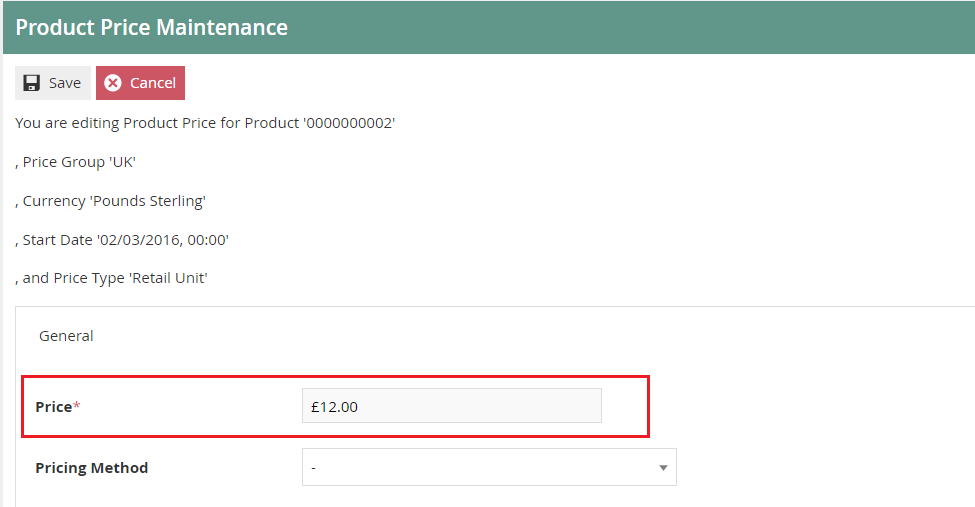

Enter a positive numeric value for the product price and select
**Save**. You will be taken back to the product maintenance prices tab
where the configured product price will be visible with the options to
edit or delete.

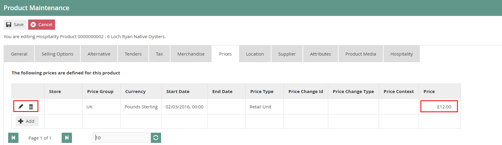

### Product - Hospitality Tab 

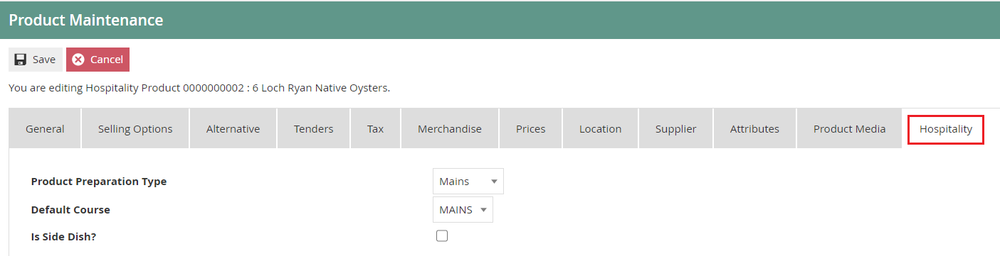

Set the appropriate values on the** Hospitality **tab as follows: 

| Configuration | Description                                                                                                                                                             |
|---------------|-------------------------------------------------------------------------------------------------------------------------------------------------------------------------|
| Product ID    | Product ID of the product that you wish to set the price of will appear here if accessed through the prices tab in Product Maintenance. Or add the relevant product ID. |
| Location      | Select the appropriate location from the dropdown list. Do not select if a Price Group is already set.                                                                  |
| Price Group   | Select the appropriate price group from the dropdown list. Set to /UK (All Regions)/ under /RESTAURANT (All Regions)./ Do not select if a Location is already set.      |
| Currency      | Select /Pound Sterling/ from the dropdown list. (Or whichever is applicable)                                                                                            |
| Start Date    | Defines the date from when the product price is applied. Defaults to the date of creation of the Product price entry.                                                   |
| End Date      | Defines the end date of the product price application (if necessary). Defaults to indefinite.                                                                           |
| Price Type    | Select /Retail Unit/ from the dropdown list.                                                                                                                            |

## Hospitality Products Set Products (Set Menu)

A Hospitality Product Set Product can be created if a restaurant wishes
to offer a Set Menu. This allows regular hospitality products to be
assigned to a set menu with a zero price on individual items that are
served. The price of the set menu is defined against the Hospitality
Product Set Product.

This can be configured using Product List Option Sets with the ability
to define any number of Product List Option Sets. Context pricing is
enabled for set menu functionality, in instances when products with
surcharges are included in set menus. The price of the product is
ignored but the surcharge will be defined as a context price against the
item and will be added to the price of the set menu. It is also possible
to define a single product to have different context prices against
different set menu options.

The following guide will use a use a Set Menu with Three courses as the
use case.

Create three Product List Option Sets named STARTERS, MAINS, DESSERTS as
described earlier in this document.

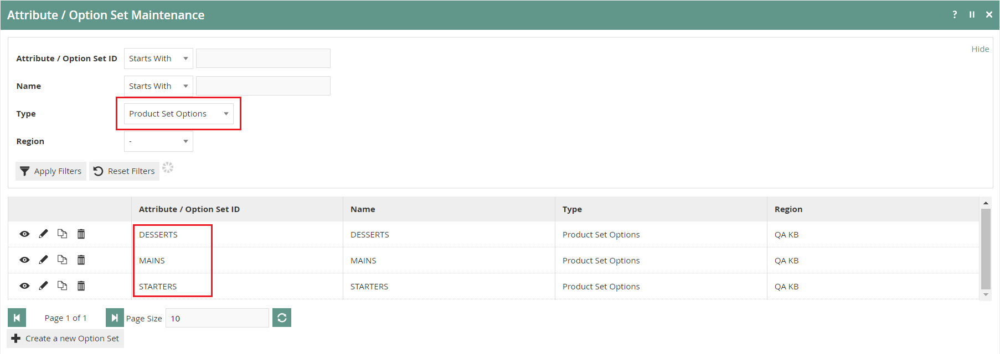

To create a new Hospitality Product Set Product, on the Product
Maintenance page select **Create a new Product.**

Select **Hospitality Product Set Product** from the Product Type
drop-down.

Enter a unique **Product ID** that can be alphanumeric and contain a
maximum of 20 characters. 

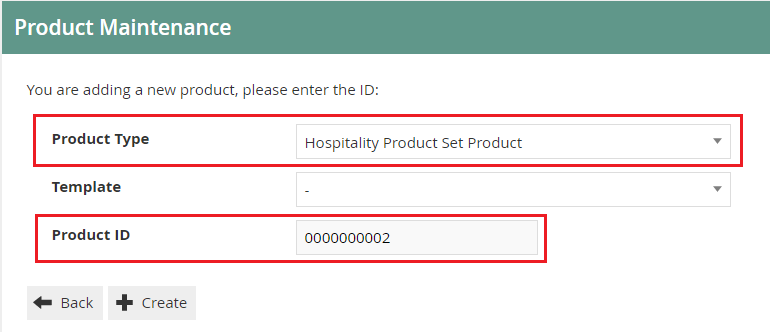

Select Create. 

**\* **The Product ID cannot be changed once the Product has been
created. 

To complete creating the Set Menu enter the appropriate values on
the** Product Maintenance** as follows: 

### Product - General - General Sub Tab

Enter a user-friendly, meaningful name for the Set Menu that can be
alphanumeric with a maximum of 30 characters.

Select the locale in the second field from a dropdown list of all
configured locales.

### Product - Selling Options - Option Sets Sub Tab

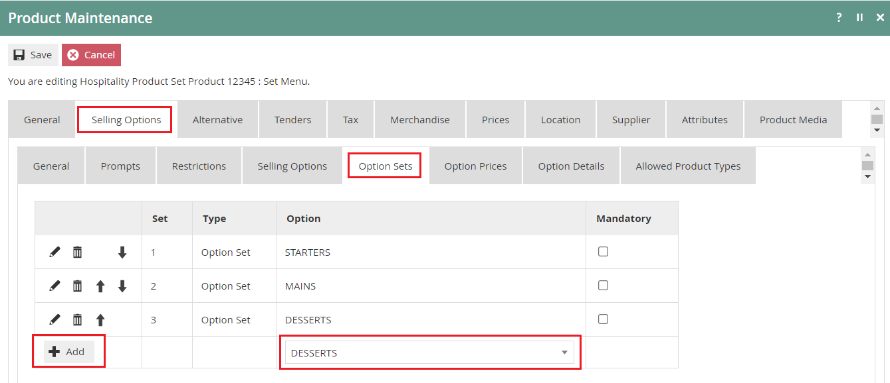

Select the Select the desired Option Set for this Set Menu, from the
drop-down list that contains all available Product Set Options. (In this
case STARTERS, MAINS, DESSERTS)

Select **Add.**

### Product - Selling Options - Option Sets Sub Tab

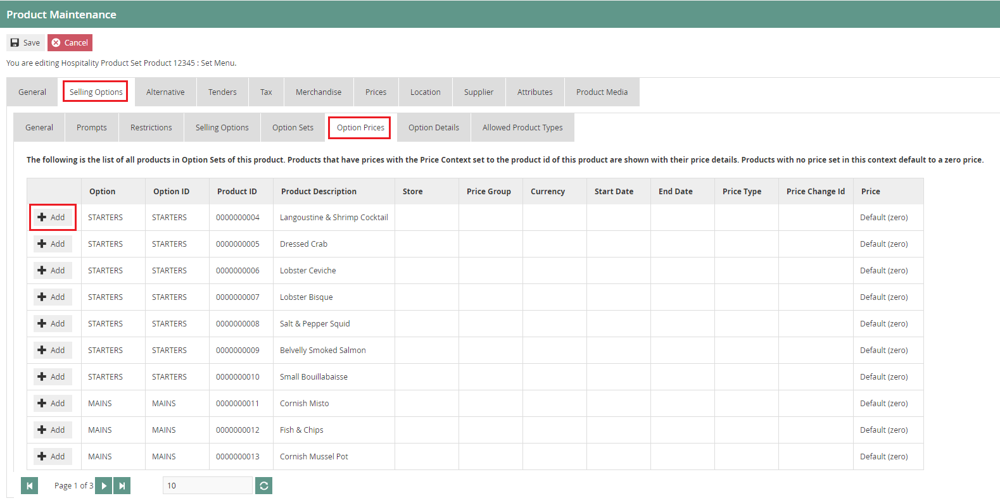

To add a context price to a specific product, select the **Add** button
against each product and you will be navigated to the **Product Price
Maintenance** where you can add the surcharge applicable on the selected
product. The context price will be set against the Hospitality Product
Set Product ID and will be added to the total cost of the Set Menu (as a
surcharge / context price) if the product is ordered.

### Product - Prices Tab

Select the **Add** button and you will be navigated to the **Product
Price Maintenance.**

Set the appropriate values (total price for the Set Menu) on
the** Product Price Maintenance** as done previously.

## Service Fee Products

This option is used to define products with a service charge applicable.
This will usually be a Fee Product with a percentage configured as the
product price.

To create a new Service Fee Product, on the Product Maintenance page
select **Create a new Product.**

Select **Fee Product** from the Product Type drop-down.

Enter a unique **Product ID** that can be alphanumeric and contain a
maximum of 20 characters. 

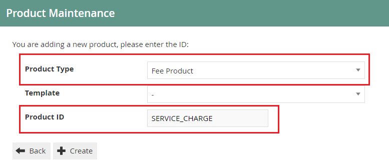

Select Create. 

**\* **The Product ID cannot be changed once the Product has been
created. 

### Product - General - General Sub Tab

Enter a user-friendly, meaningful name for the Service Fee Product that
can be alphanumeric with a maximum of 30 characters.

Select the locale in the second field from a dropdown list of all
configured locales.

### Product - Prices Tab

A fee product can either be configured with a fixed price or with a
percentage.

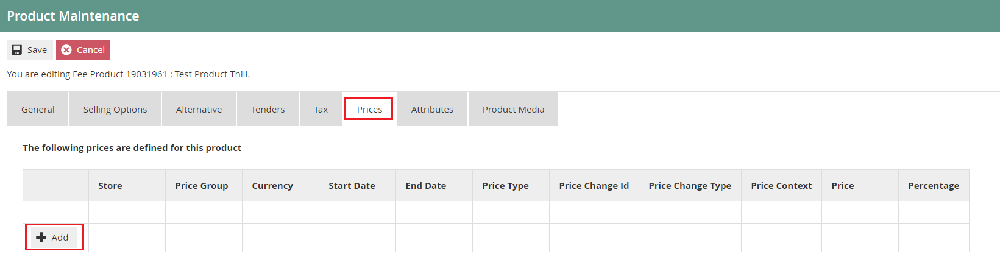

Select the **Add** button and you will be navigated to the **Product
Price Maintenance.**

Set the appropriate values as done previously.

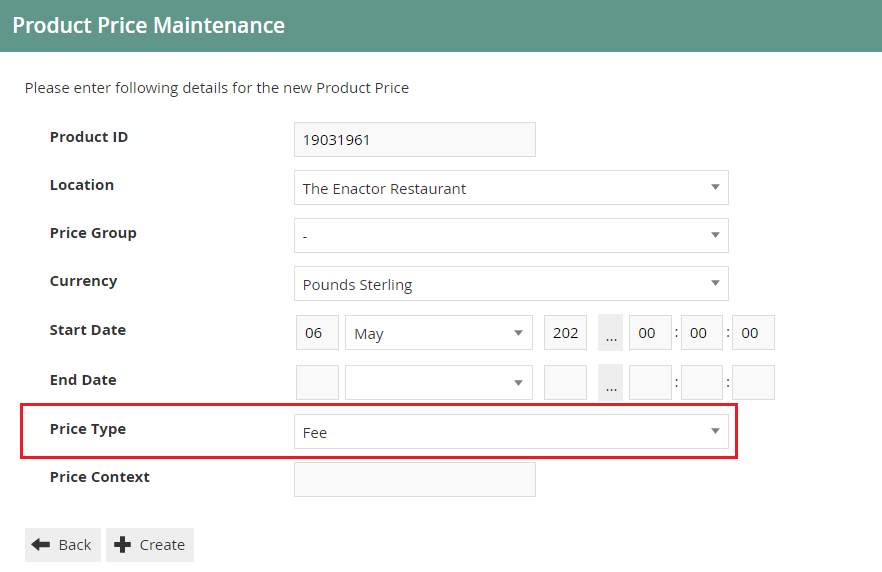

Select **Fee,** from the **Price Type** dropdown list.

Select **Create.**

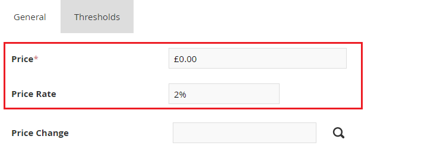

Set a fixed price in the **Price** field or a percentage in the **Price
Rate** for the service Fee Product.

Select **Save** and you will be taken back to the Product Maintenance
prices tab where the Fee product price will be shown.

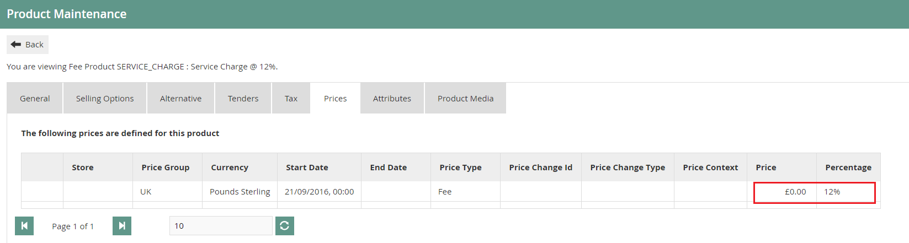

# Product List

A Product List is a collection of products referenced by an ID and a
specific Region. Each product ID in the collection (list) is also
associated with predefined Product Attributes. (Also referred to as
option sets) Hospitality makes use of product list for option set
configuration, which is discussed later in this document.

Product Lists are configured through the Product List Maintenance
application on the estate manager.

The Product List Maintenance application can be accessed through: 

Configurations-\> Merchandise -\> Product Lists

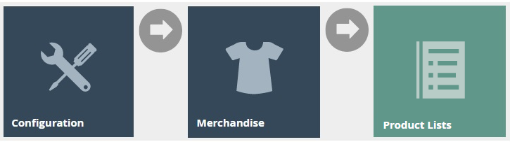

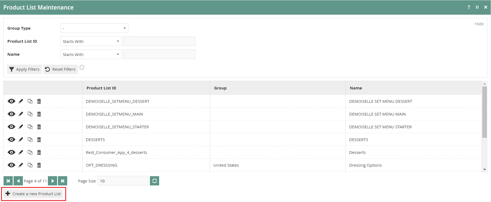

To create a new Product List, select **Create a new Product List** on
the Product List Maintenance page**.**

Enter a unique **Product List ID**. The ID can be alphanumeric and
contain a maximum of 50 characters.

Select the Group type **Region,** from the **Group Type** drop-down.

Select a region that is applicable for the restaurant from the **Group**
drop-down. (Can opt to select **All Regions**)

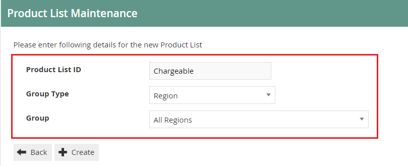

Select **Create.**

**\*** The Product List ID cannot be changed once the Product List has
been created.

You will be presented with the following options to complete creating
the new product list:

### Product List Maintenance - General Tab

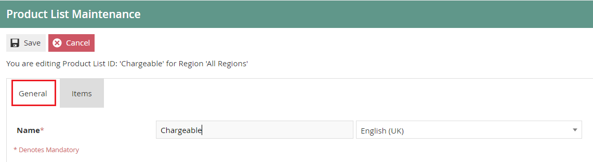

Set the appropriate values on the **General** tab as follows:

| Configuration | Description                                                                                                                                                                          |
|---------------|--------------------------------------------------------------------------------------------------------------------------------------------------------------------------------------|
| Name          | Enter your product list name in this field which can be alphanumeric and contain a maximum of 40 characters. This name will be displayed in screens and other configuration options. |
|               |                                                                                                                                                                                      |
|               | The name is locale dependent. Select the appropriate Locale from the drop-down list.                                                                                                 |

### Product List Maintenance - Items Tab

The Items tab allows you to specify any number of products you wish the
product list to contain.

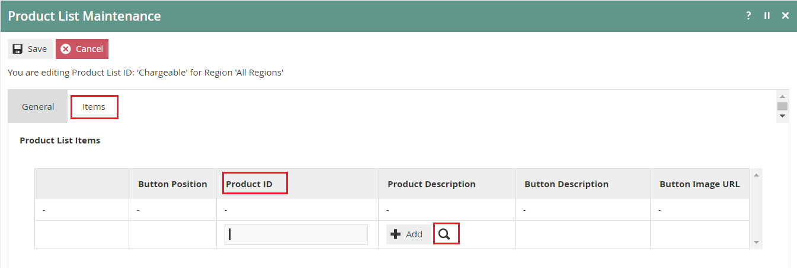

To add a new product, enter the Product ID in the space and Select
**Add**.

Or select the search icon and you will be navigated to a product search
screen as shown below:

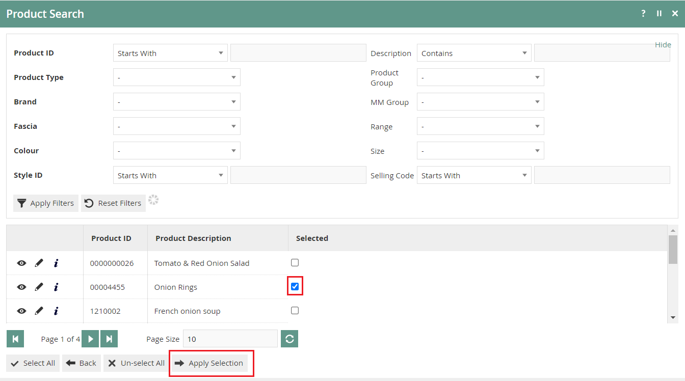

Select the checkboxes of products that you wish to add to the Product
list and **Apply Selection.**

All products added to the list will be displayed under the specific
product list:

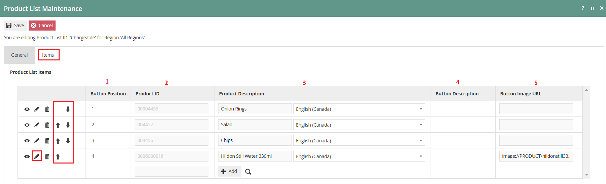

| Field               | Example Value                       | Description                                                                                                                                                       |
|---------------------|-------------------------------------+-------------------------------------------------------------------------------------------------------------------------------------------------------------------|
| Button Position     | 1, 2, 3                             | A read-only value, which indicates the position of the button on the POS.                                                                                         |
| Product ID          | 00004455                            | A read-only value, which indicates the product ID(s) of product added to the list.                                                                                |
| Product Description | Onion Rings                         | Alphanumeric; maximum 40 characters description to be displayed on POS button. The original values obtained from product configuration can be edited as required. |
|                     |                                     |                                                                                                                                                                   |
|                     |                                     | Select the Locale from the dropdown list as required.                                                                                                             |
| Button Image URL    | image ://PRODUCT/hil donstill33.png | A read-only value, which indicates the URL that identifies the image to be displayed on POS button.                                                               |

\* You can edit the order of the Product List items using directional
arrow buttons. Select the edit icon to navigate directly to product
maintenance, which will enable you to edit product details.

# Option Sets 

Option Sets are used to create user-configurable data entry fields. The
purpose and function of the option set is defined by the Option Set
Type. In a restaurant, Product Options, Product Preparation Options and
Product Set Options are examples of Option Set Types that can be used.

A single or multiple option sets can be added to a hospitality product.
Once all desired Option Sets have been configured against the product,
these will be displayed in the POS application as options to be selected
when a product is sold.

The Product Attribute / Option Set Maintenance application can be
accessed through: 

Configurations-\> Merchandise -\> Attribute / Option Sets

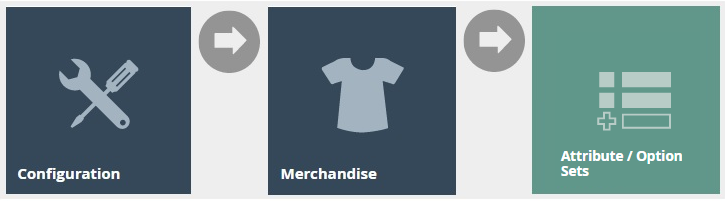

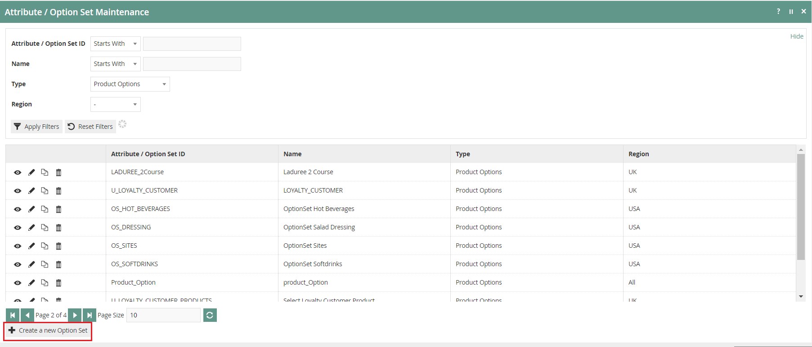

To create a new Option Set, select **Create a new Option Set** on the
Attribute / Option Set Maintenance page**.**

### Create New Attribute / Option Set 

### Type (Product Options /Product List Options)

Enter a unique **Option Set ID**. The ID can be alphanumeric and contain
a maximum of 40 characters.

Select **Product Options**, from the **Type** dropdown list.

Select the appropriate **Region** from the drop-down list.

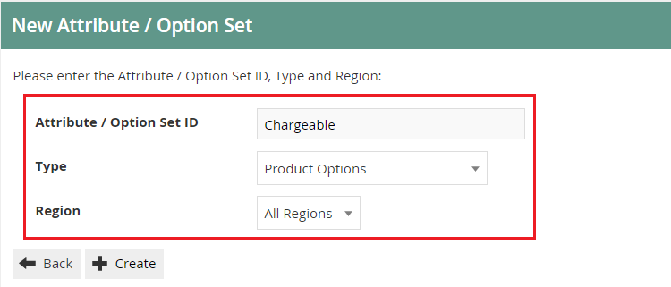

Select **Create.**

**\*** The Option Set ID cannot be changed once the Option Set has been
created.

You will be presented with the following options to complete creating
the new option set:

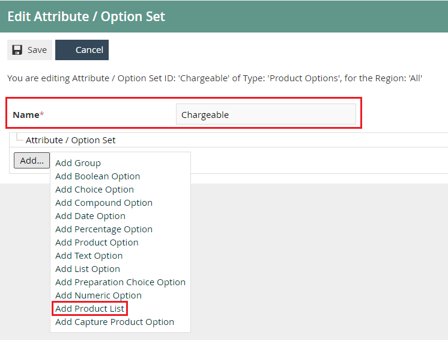

Enter an alphanumeric character value for the **Name.**

Select **Add.**

Select **Add Product List,** from the list displayed against the Add
button.

### Edit Product List Option - General Tab

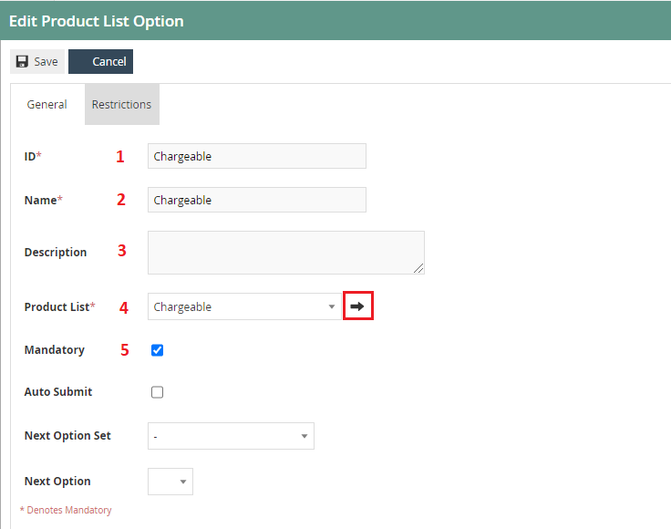

Set the appropriate values on the **General** tab as follows:

 | Configuration | Description                                                                                                                                  |
|---------------|----------------------------------------------------------------------------------------------------------------------------------------------|
| ID            | Enter an alphanumeric value for the Product List Option ID. This will be displayed in screens and other configuration options.               |
| Name          | Enter an alphanumeric value. This will be displayed in screens and other configuration options.                                              |
| Description   | Enter an optional description for Product List Option. This will be displayed in screens and other configuration options.                    |
| Product List  | Select the pre-defined Product List referenced by this option set from the dropdown list.                                                    |
| Mandatory     | Select the checkbox to define that at least one option from the Product List must be selected when present to a user on the POS application. |

\*To edit the chosen product list, select the arrow button which will
navigate you to Product List Maintenance.

Select **Save** when completed.

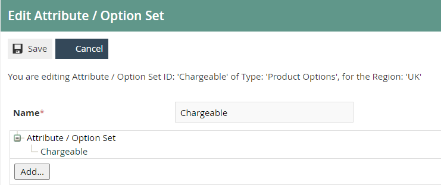

### Create New Attribute / Option Set 

### Type (Product Preparation Options)

A Product Preparation Options in Option Set is a text list of
preparation options that can be applied to a product.

Enter a unique **Option Set ID**. The ID can be alphanumeric and contain
a maximum of 40 characters.

Select **Product Preparation Options**, from the **Type** dropdown list.

Select the appropriate **Region** from the drop-down list.

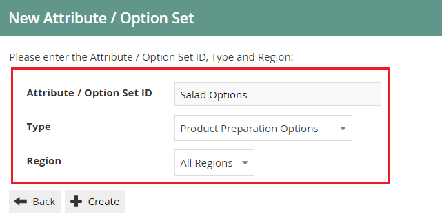

Select **Create.**

**\*** The Option Set ID cannot be changed once the Option Set has been
created.

You will be presented with the following options to complete creating
the new option set:

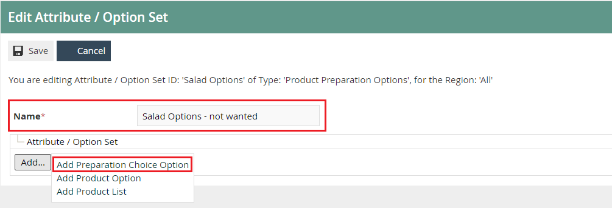

Enter an alphanumeric character value for the **Name.**

Select **Add.**

Select **Add Preparation Choice Option,** from the list displayed
against the Add button.

### Edit Choice Option - General Tab

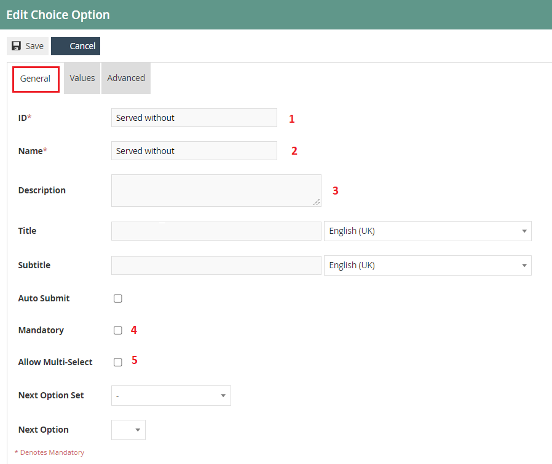

Set the appropriate values on the **General** tab as follows:

 | Configuration      | Description                                                                                                                                  |
|--------------------|----------------------------------------------------------------------------------------------------------------------------------------------|
| ID                 | Enter an alphanumeric value for the Product List Option ID. This will be displayed in screens and other configuration options.               |
| Name               | Enter an alphanumeric value. This will be displayed in screens and other configuration options.                                              |
| Description        | Enter an optional description for Product List Option. This will be displayed in screens and other configuration options.                    |
| Mandatory          | Select the checkbox to define that at least one option from the Product List must be selected when present to a user on the POS application. |
| Allow Multi-Select | Select the checkbox to allow multiple selection of the displayed options in the POS application.                                             |

### Edit Choice Option - Values Tab

The values tab allows you to define the preparation options entries as
string values.

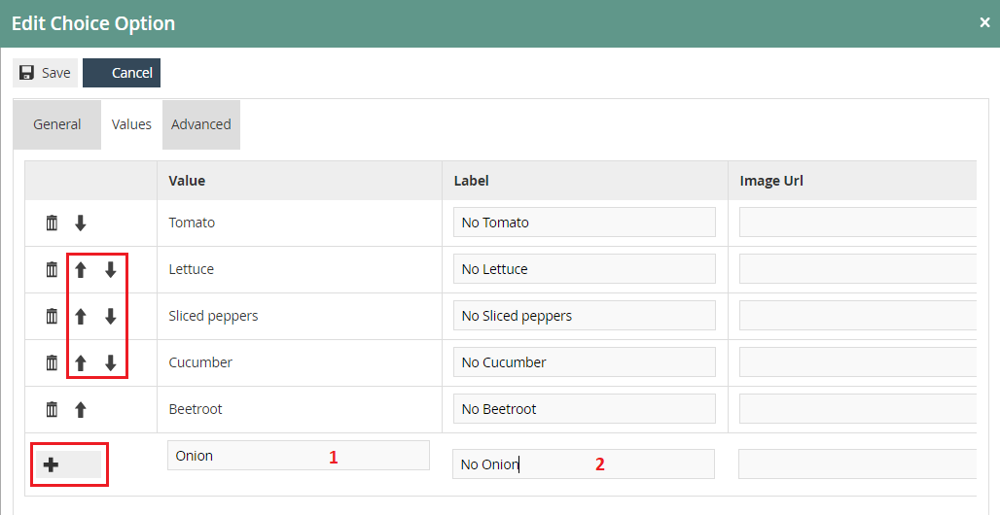

To add a new choice option, enter an alphanumeric value in the **Value**
field.

Enter an alphanumeric value in the **Label** field. This is the field
that will be displayed on the POS application.

Select the **Add** button.

All Choice options added will be listed in this screen.

\* You can edit the order of the option items using directional arrow
buttons.

Select **Save** when completed.

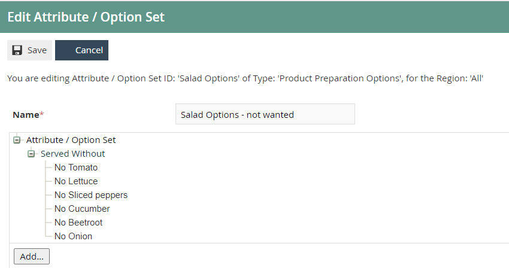

### Create New Attribute / Option Set 

### Type (Product Set Options)

Product Set Options are essentially Product List Options but are
intended to only be selected by Hospitality Product Set Products
(Detailed previously in the document).

Enter a unique **Option Set ID**. The ID can be alphanumeric and contain
a maximum of 40 characters.

Select **Product Set Options**, from the **Type** dropdown list.

Select the appropriate **Region** from the drop-down list.

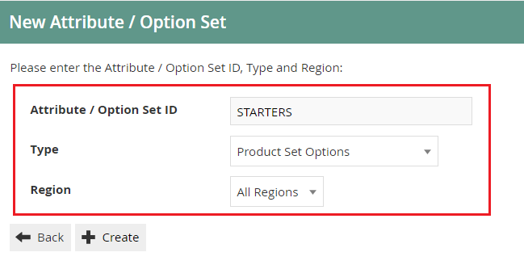

Select **Create.**

**\*** The Option Set ID cannot be changed once the Option Set has been
created.

You will be presented with the following options to complete creating
the new option set:

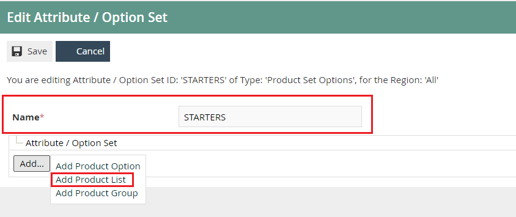

Enter an alphanumeric character value for the **Name.**

Select **Add.**

Select **Add Product List,** from the list displayed against the Add
button.

### Edit Product List Option - General Tab

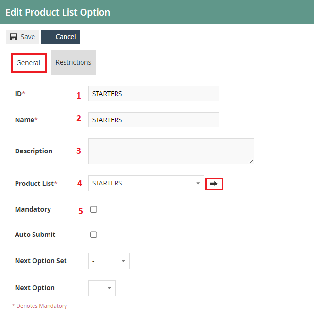

Set the appropriate values on the **General** tab as follows:

| Configuration | Description                                                                                                                                  |
|---------------|----------------------------------------------------------------------------------------------------------------------------------------------|
| ID            | Enter an alphanumeric value for the Product List Option ID. This will be displayed in screens and other configuration options.               |
| Name          | Enter an alphanumeric value. This will be displayed in screens and other configuration options.                                              |
| Description   | Enter an optional description for Product List Option. This will be displayed in screens and other configuration options.                    |
| Product List  | Select the pre-defined Product List referenced by this option set from the dropdown list.                                                    |
| Mandatory     | Select the checkbox to define that at least one option from the Product List must be selected when present to a user on the POS application. |

\*To edit the chosen product list, select the arrow button which will
navigate you to Product List Maintenance.

Select **Save** when completed.

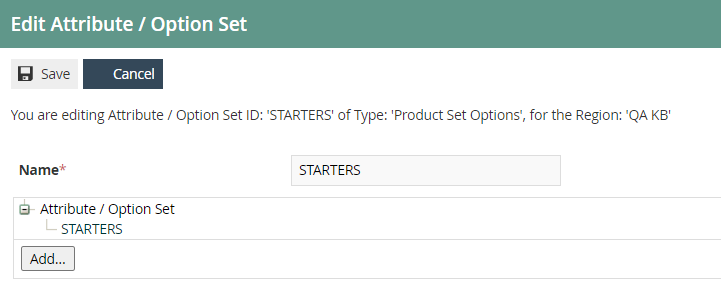

# Product Preparation Types

Product Preparation types is a means of categorising restaurant products
by defining the type of preparation required for the product when
ordered and submitted to a kitchen.

## Creating a Product Preparation Type

The Product Preparation Type maintenance application can be accessed
through:

Configuration -\> Hospitality-\> Product Preparation Types

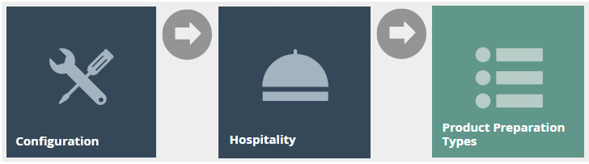

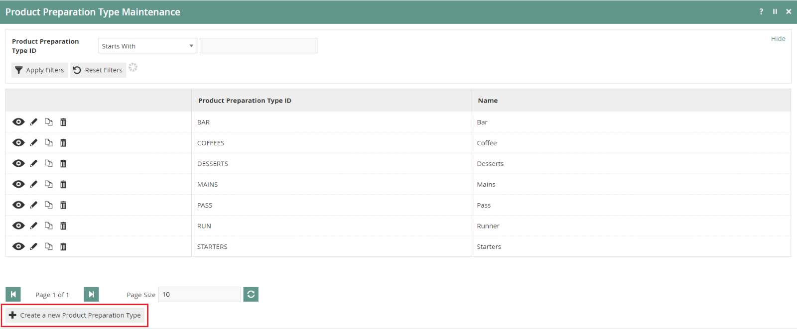

To create a new product preparation type, select **Create a New Product
Preparation Type** on the Product Preparation Type Maintenance page.

Enter a unique **Product Preparation Type ID** that can be alphanumeric
and contain a maximum of 20 characters.

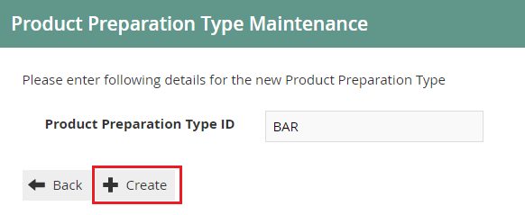

Select **Create.**

**\*** The Product Preparation Type ID cannot be changed once it has
been created.

You will be presented with the following option to complete creating the
Product Preparation Type:

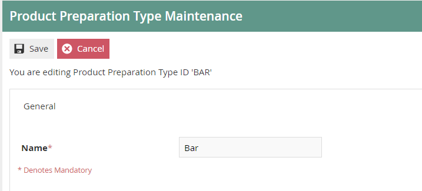

Enter a Product Preparation Type **Name**. This mandatory field can
contain up to maximum of 30 alphanumeric characters.

# Product Preparation Type Mappings 

Product Preparation Type Mappings are used to associate Products with a
preparation type. (\'Chocolate brownies\' to Desserts, \'Gin & Tonic\'
to \'Drinks\' etc.)

This can be done when configuring new products in Products Maintenance
(described in a separate how-to guide) or through the Product
Preparation Type Mappings Maintenance application.

## Creating a Product Preparation Type Mapping

The Product Preparation Type Mapping Maintenance application can be
accessed through:

Configuration -\> Hospitality-\> Product Preparation Type Mappings

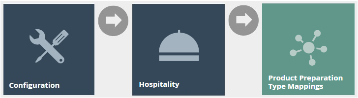

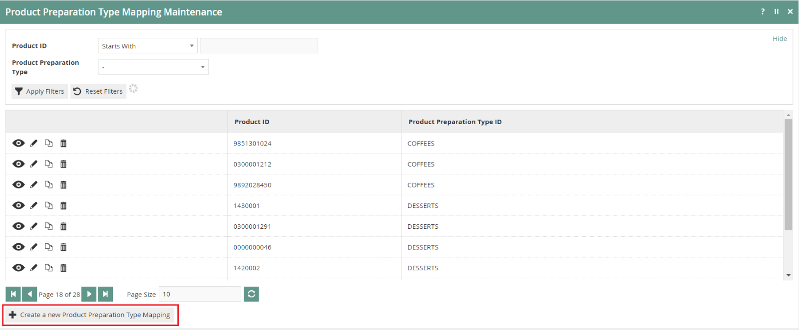

To create a new product preparation type mapping, select **Create a New
Product Preparation Type Mapping** on the Product Preparation Type
Mapping Maintenance page.

Enter the product ID you wish to create a mapping for.

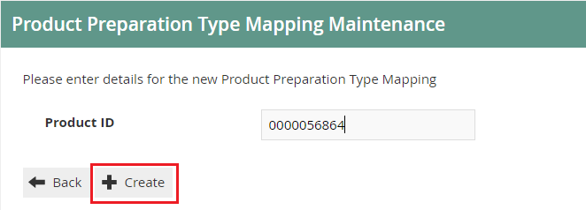

Select **Create.**

You will be presented with the following option to complete creating the
Product Preparation Type Mapping:

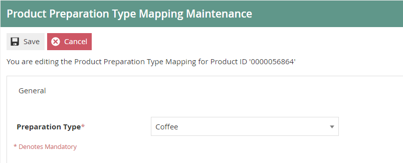

Select the appropriate Product Preparation Type Mapping from the
dropdown list.

\*You can view, edit, copy, or delete Product Preparation Type Mapping
associated with any product through the Product Preparation Type Mapping
Maintenance application.

# Restaurant Course

New Courses can be created for Restaurant Locations and Areas that have
already been configured. Restaurant Courses are configured with a
sequence number to define the order courses are served in.

The Restaurant Courses Maintenance application can be accessed through:

Operations -\> Restaurant -\> Restaurant Courses

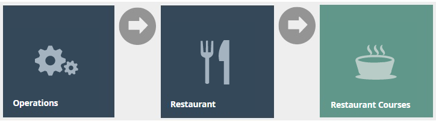

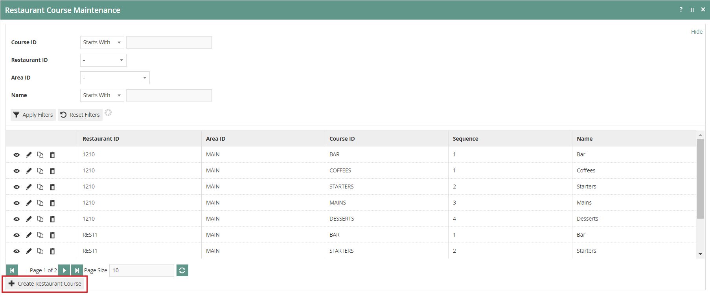

To create a new Restaurant Course, select **Create Restaurant Course**
on the Restaurant Course Maintenance page.

Select the relevant location by choosing the **Restaurant ID**, from the
dropdown list.

Select the relevant restaurant area by choosing the **Area ID**, from
the dropdown list.

Enter a unique **Course ID**. The ID can be alphanumeric and contain a
maximum of 20 characters.

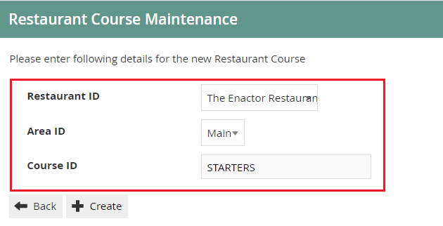

Select **Create.**

**\*** The Course ID cannot be changed once a Restaurant Course has been
created.

You will be presented with the following options to complete creating
the new restaurant course:

### Restaurant Course -- General Tab

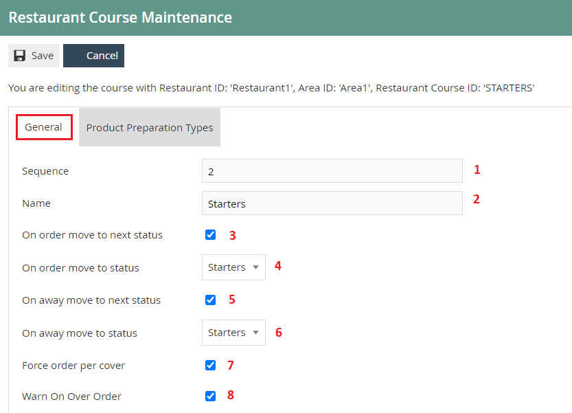

Set the appropriate values on the **General** tab as follows:

 | Configuration                | Description                                                                                                                                                                                                    |
|------------------------------|----------------------------------------------------------------------------------------------------------------------------------------------------------------------------------------------------------------|
| Sequence                     | Add a numeric value to the sequence of courses the table will go through.                                                                                                                                      |
| Name                         | Enter an alphanumeric value that can contain a maximum of 20 characters. This name will be displayed in screens and other configuration options.                                                               |
| On order move to next status | Select the checkbox to indicate that the tables status should move to the next table status in its sequence when an order is submitted.                                                                        |
| On order move to status      | Select from the dropdown list to define the table status to change to. This works in conjunction with *On order move to next status* and the table status definition *Allow Sequence Number Override* setting. |
| On away move to next status  | Select the checkbox to indicate that the table status should move to the next table status in its sequence when an away message is submitted on the POS application.                                           |
| On away move to status       | Select from the dropdown list to define the table status to change to. This works in conjunction with *On away move to next status* and the table status definition *Allow Sequence Number Override* setting.  |
| Force Order per cover        | Select checkbox to prompt on the POS Application that for the given course, all covers (Diners) should have an order. This can be fulfilled with course fillers (No Course Orders)                             |
| Warn On Over Order           | Select the checkbox to warn the POS Application operator if more items of this course have been ordered than the available diners on the table.                                                                |

### Restaurant Course -- Product Preparation Types Tab

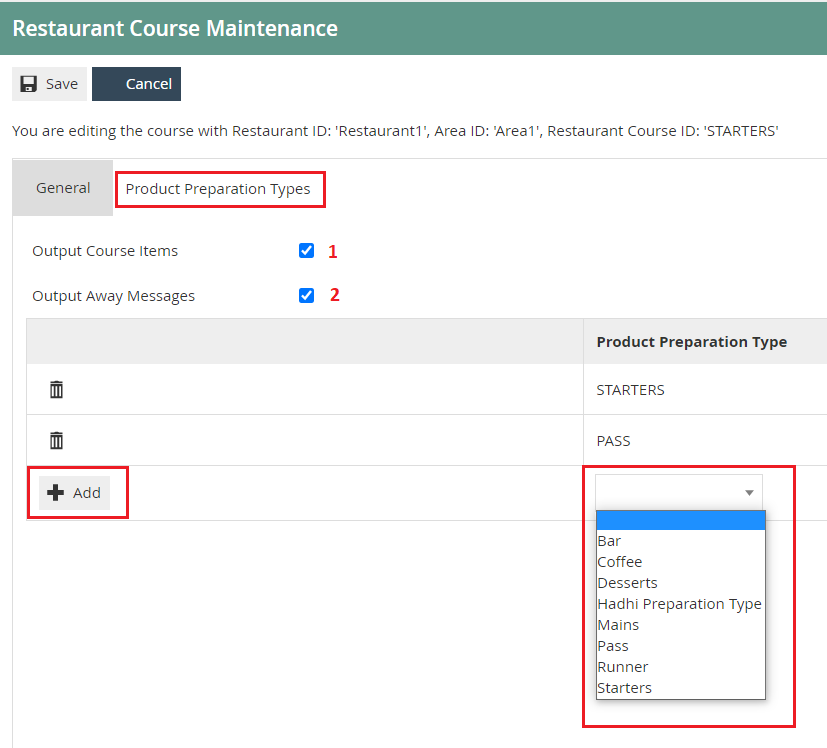

Select the **Output Course items** checkbox to indicate to the POS
Application to print ordered item to the kitchen.

Select the **Output Away Messages** checkbox to indicate to the POS
Application to print away messages to the kitchen.

To add to the collection of **Product Preparation Type**s, choose a
preferred a type from the dropdown list and select the **Add** button.

## Broadcasting 

To deliver the configuration changes to the POS, broadcast the following
entities.

-   Product

-   Product Attribute

-   Product List

-   Product Group

-   Product Preparation Type

-   Product Preparation Type Mapping

-   Product Price

-   Option Set

-   Restaurant Course

# POS Functionality

The operator after selecting a table, the POS will prompt to select the
number of dines on the table. Once the number of diners is entered, the
table order screen will be displayed with two separate menus.

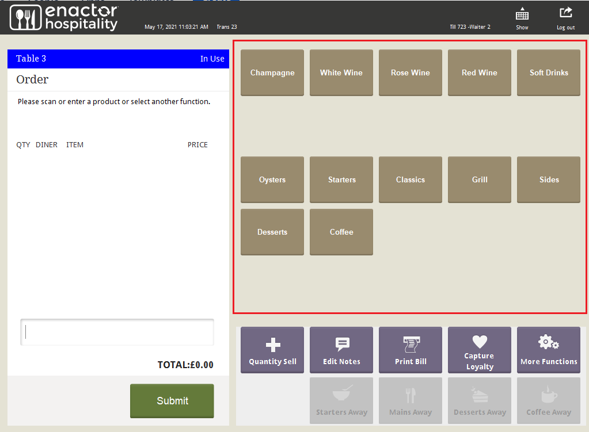

 | Function          | Outcome                                                       |
|-------------------|---------------------------------------------------------------|
| Restaurant Course | Shows the available course for this table. Select to proceed. |

The operator after selecting a product added in a Product list / Option
Set, it is prompted for following selection.

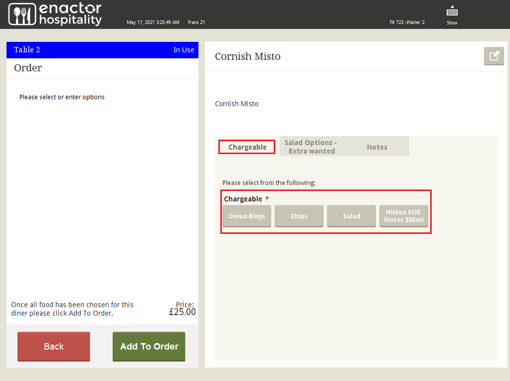

 | Function   | Outcome                                                        |
|------------|----------------------------------------------------------------|
| Chargeable | Shows the options enabled for this product. Select to proceed. |

The operator after selecting a product added in a Product list / Option
Set with a product type set to product preparation options, it is
prompted for following selection.

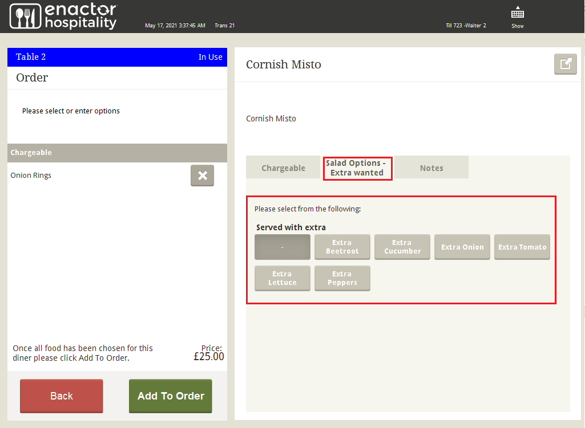

| Function          | Outcome                                                                                 |
|-------------------|-----------------------------------------------------------------------------------------|
| Served with Extra | Shows the Salad options enabled under extra wanted for this product. Select to proceed. |

#  
