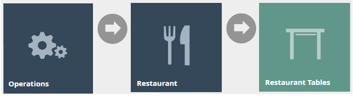
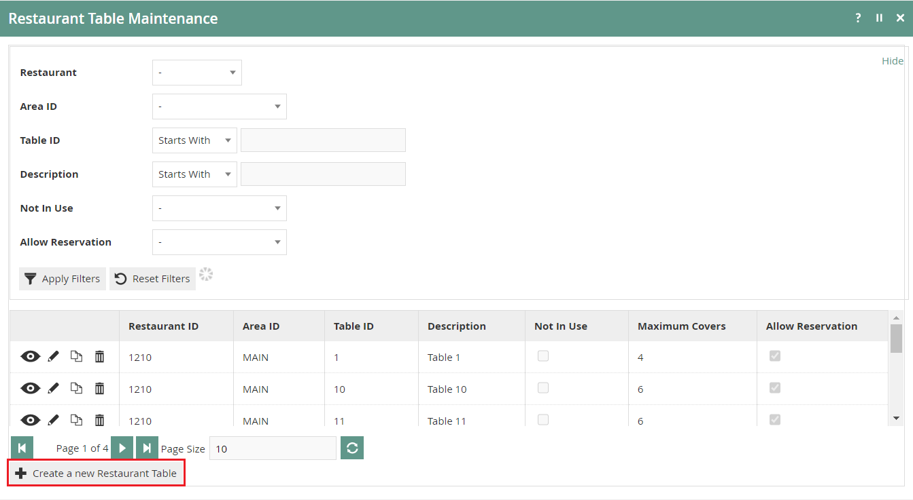
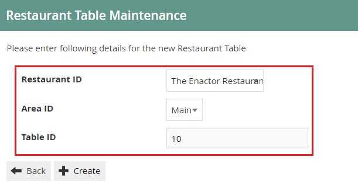
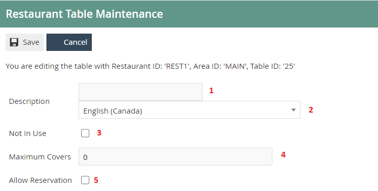
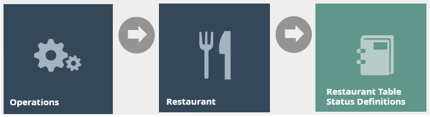
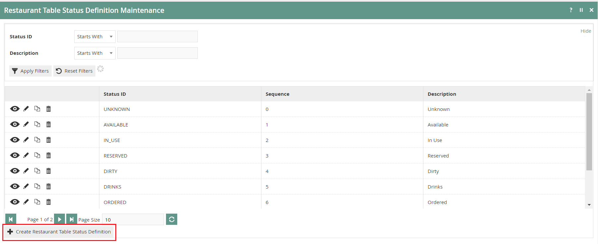
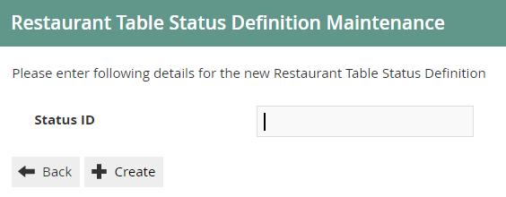
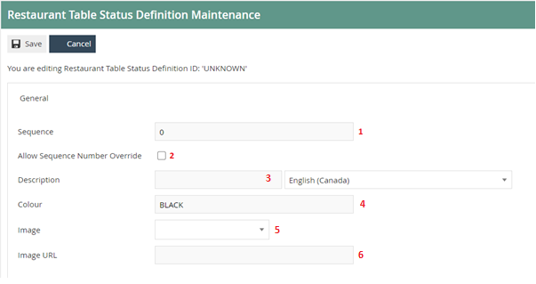
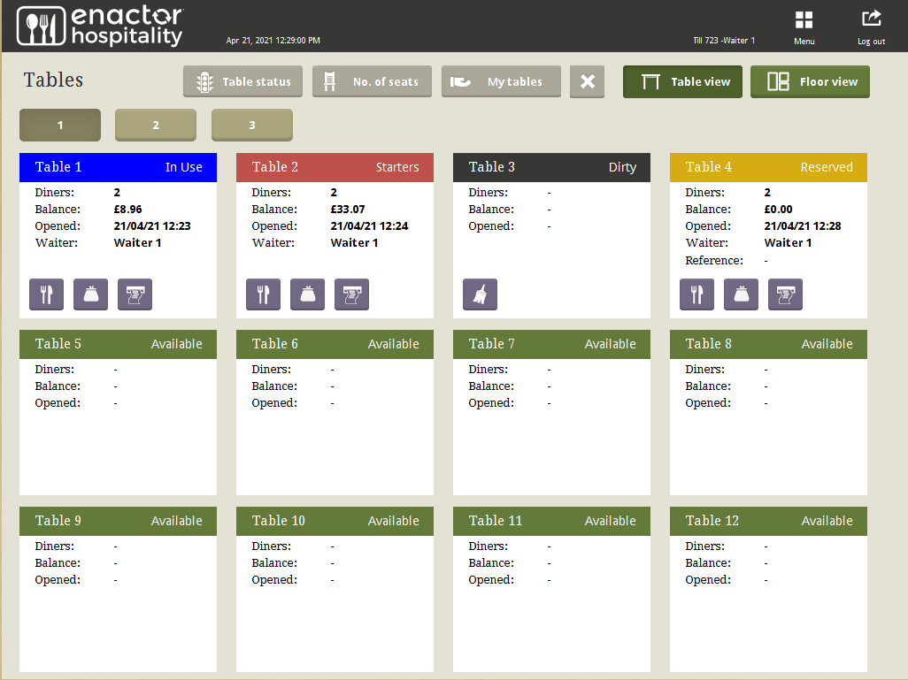

# Tables and Status Definitions
# Introduction

The purpose of this guide is to provide a foundational understanding of
the options and capabilities available when configuring a Restaurant
Table and Restaurant Table Status Definitions.

## Overview

All activities required to define and configure a new Restaurant Table
and Restaurant Table Status is provided here.

This guide will cover the configuration for the following:

-   Restaurant Table

-   Restaurant Table Status Definitions

## 

## Prior Training / Experience

You should be familiar with the following:

-   Estate Manager Configuration

-   Data Broadcasting

# Restaurant Tables

Restaurant tables are configured through the Restaurant Tables
Maintenance application on the estate manager. Tables are defined by
location and area. New Restaurant tables can be created for Restaurant
Locations and Areas that have already been configured. All tables
created in a location and/or area will be used by the POS application
when generating the table grid / floor view.

## Restaurant Table Configuration 

The Restaurant Table Maintenance application can be accessed through:

Operations-\> Restaurant -\> Restaurant Tables

.

To create a new Restaurant Table, select **Create a New Restaurant
Table** on the Restaurant Table Maintenance page.

Select the Restaurant Location from the **Restaurant ID** drop-down.

Select the area from the **Area ID** drop-down.

Enter a unique **Table ID** for the new table. The ID can be
alphanumeric and contain a maximum of 20 characters.

Select **Create.**

\*The available areas will be filtered based on the selected Location
(Restaurant ID)

You will be presented with the following options to complete creating
the new table:

Set the appropriate values in the **Restaurant Table Maintenance**
application as follows:

| Configuration      | Description                                                                                                                                          |
|--------------------|------------------------------------------------------------------------------------------------------------------------------------------------------|
| Description        | Enter a table description that can be alphanumeric with a maximum of 30 characters. This will be visible in screens and other configuration options. |
|                    | Select the locale in the second field from a drop-down list of all configured locales.                                                               |
| Not in Use         | Select the checkbox to indicate that the table is not in use. Will be displayed in the POS application as not in use.                                |
| Maximum Covers     | Enter the maximum number of diners (covers) that can occupy this table.                                                                              |
|                    |                                                                                                                                                      |
|                    | *This can be overridden on the POS application.                                                                                                      |
| Allow Reservations | Select the checkbox to indicate that the table can accept reservations. This will enable *Set Table Reservation* option in the POS application.      |

\*You can view, edit, copy, or delete tables listed under Restaurant
Table Maintenance.

# Restaurant Table Status Definitions

Restaurant Table Status Definition is configured in the Restaurant Table
Status Definition Maintenance application. Defining a table status can
drive functions such as courses being ordered, or away functions being
selected which are described in a separate how-to guide.

## Configuring Restaurant Table Status Definitions

The Restaurant Table Status Definition Maintenance application can be
accessed through:

Operations -\> Restaurant -\> Restaurant Table Status Definitions

To create a new Restaurant Table Status Definition, select **Create
Restaurant Table Status Definition** on the Restaurant Table Status
Definition Maintenance page

Enter a **Table ID** that can be alphanumeric with a maximum of 20
characters. This will be displayed in screens and other configuration
options.

Select **Create.**

You will be presented with the following options to complete creating a
**New Table Status Definition**:

Set the appropriate values on the **Restaurant Table Status Definition
Maintenance** application as follows:

| Configuration                  | Description                                                                                                                                                                   |
|--------------------------------|-------------------------------------------------------------------------------------------------------------------------------------------------------------------------------|
| Sequence                       | Enter the number of statuses the table will go through in sequence. (This means if a table will serve starters before mains and mains before desserts etc. in a sequence)     |
| Allow Sequence Number Override | Select the checkbox to indicate that the above sequence number can be overridden in the POS application.                                                                      |
| Description                    | Enter a Description for the table that can be alphanumeric with a maximum of 20 characters. This will be visible in screens and other configuration options.                  |
|                                | Select the locale in the field from a drop-down list of all configured locales.                                                                                               |
| Colour                         | Enter the Colour in which the specific table definition will be displayed on the POS application.                                                                             |
| Image                          | Select the Image to be displayed in the POS application from the drop-down list. Images are managed through Image Maintenance. (This is described in a separate how-to guide) |
| Image URL                      | Add an Image URL that points to an external source which will determine the image displayed in the POS application.                                                           |

\*You can view, edit, copy, or delete Table Status Definitions listed
under Restaurant Table Status Definition Maintenance.  

## Broadcasting 

To deliver the configuration changes to the POS, broadcast the following
entities.

-   Restaurant Table

-   Restaurant Table Status

-   Restaurant Table Status Definition

# POS Functionality

The operator after selecting Table view will be able to select the table
to enter orders accordingly. At each stage the status will change
displaying the status description and the colour assigned in Table
Status Definition.

| Function   | Outcome                                                    |
|------------|------------------------------------------------------------|
| Table View | Shows a Table View screen. Lists all tables in area.       |
| 1,2,3      | Enables navigating to additional screens with table lists. |