# Configuring a New Restaurant
# Introduction

The purpose of this guide is to provide a foundational understanding of
the options and capabilities available when configuring a Restaurant
Store.

Often, users would leverage the Template capabilities within Enactor to
set up new and manage existing locations. The use of Templates is
covered in a separate guide. This document will focus on completing the
core configuration steps manually.

## Overview

All activities required to define and configure a new Restaurant Store
is provided here.

This guide will cover the configuration for the following:

-   Restaurant Location

-   Restaurant Areas

-   Device

-   POS Terminal

Region configuration is covered in the **How to configure a base
Organisation Structure** guide.

## Prior Training / Experience

You should be familiar with the following:

-   Estate Manager configuration

-   Data broadcasting

# Restaurant Location 

Enactor supports multiple Location types: Store, Warehouse, Office, and
Restaurant etc. This guide will focus on setting up a new Restaurant
(Hospitality) Location.

## Creating a Restaurant Location 

The location maintenance application can be accessed through:

Configuration -\> Organisation -\> Locations

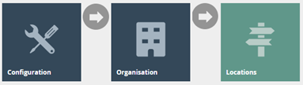

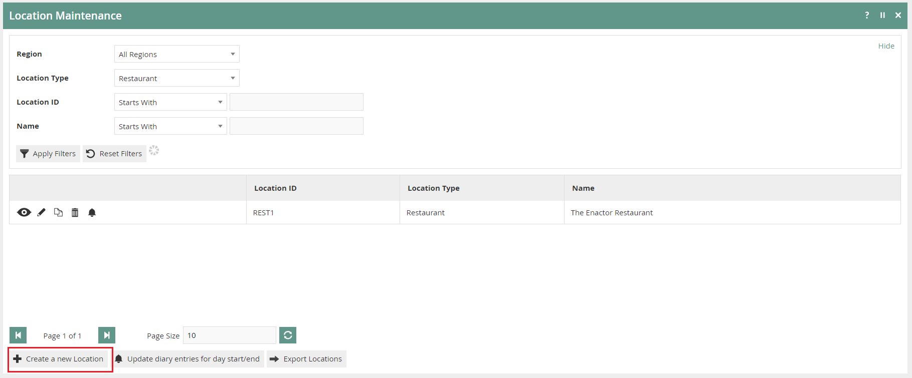

To create a new Restaurant Location, select **Create a New Location** on
the Location Maintenance page**.**

Select the Location type **Restaurant,** from the **Location Type**
drop-down.

No selection should be made for **Template**. The creation and use of
Templates are covered in a separate How-to Guide. This document covers
how to manually configure the mandatory and common settings relating to
location maintenance.

Enter a unique **Location ID** for this location. The ID can be
alphanumeric and contain a maximum of 20 characters.

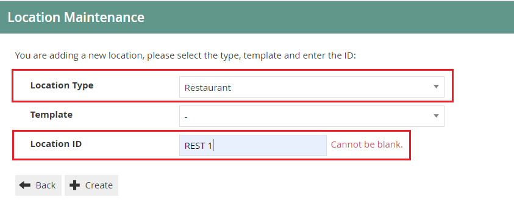{width="5.25875in" height="2.1525in"}

Select **Create.**

**\*** The Location ID cannot be changed once the Location has been
created.

## Location Maintenance

Numerous tabs and sub-tabs are presented under location maintenance.
This guide is focused on the core Location aspects that are required to
create a restaurant location and the key tabs are **General** and
**Restaurant**.

Address, Purging, Cash Management, Receipt, and Display tabs are briefly
explained within the context of setting up a new restaurant location.

### Location - General Tab

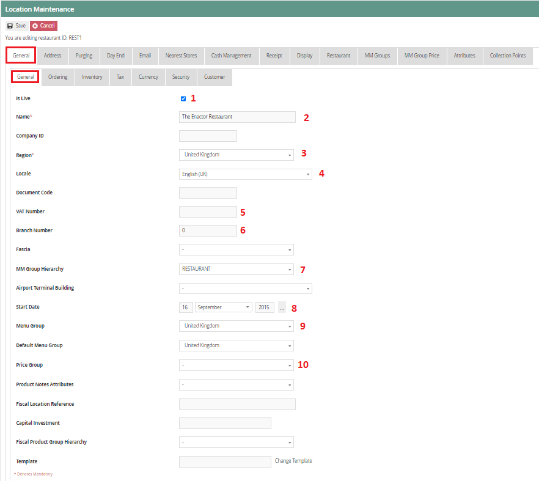The General tab has all the basic
information that captures the general behaviour and identity of the
restaurant location.

### Location - General Tab - General Sub-tab

Set the appropriate values on the **General** tab as follows:

 | Configuration      | Description                                                                                                                                                                                                                                                               |
|--------------------|---------------------------------------------------------------------------------------------------------------------------------------------------------------------------------------------------------------------------------------------------------------------------|
| Is Live            | Checkbox, if selected indicates that the Location is currently "live", "available for service", or “active". Select if the restaurant is ready for transacting.                                                                                                           |
| Name               | Enter your location name in this field. This could be the same as the location ID or it could be the name of the restaurant location. This name will be shown on other configuration pages when referring to the location, therefore must be conclusive and recognisable. |
| Region             | Select the appropriate Region from the drop-down list. If the desired Region does not appear, it must be created. Refer to the "How to configure a base Organisation Structure" guide for assistance.                                                                     |
| Locale             | Select the appropriate Locale from the drop-down list. This selection will affect locale-dependent operations such as language.                                                                                                                                           |
| VAT Number         | Enter the restaurant's VAT number here. If you do not have a VAT number, leave the field blank. The VAT Number is typically printed on receipts and is included with the transaction data.                                                                                |
| Branch Number      | Enter a numeric value that can be up to 8 digits or set it to match the location ID.                                                                                                                                                                                      |
| MM Group Hierarchy | Select *Restaurant* from the MM Group Hierarchy drop-down.                                                                                                                                                                                                                |
| Start Date         | If not set to "Is Live" enter the date when this restaurant will be available for service in this field.                                                                                                                                                                  |
| Menu Group         | This determines a specific group of menus that the location should display. Select the appropriate menu group from the drop-down list or set to default. Configuring groups is covered in a separate How-to Guide.                                                        |
| Price Group        | This is used to identify groups of Product Prices in a hierarchical structure. Select price group applicable for restaurant from the drop-down list. Configuring groups is covered in a separate How-to Guide.                                                            |

### Location -- Address Tab 

The Address Tab provides two Sub-Tabs to capture the **Address** and
**Contact Details** of the Location. Enter Address properties of the
location and contact details in the appropriate fields. These fields are
used in receipt printing.

### Location -- Purging Tab 

Data Purging functions, enables purging of files from the File System
and data from the Database. The two sub-tabs **Directory Purging**
applies to Directories of the File System and **Entity-Purging** applies
to Entities in the Database. Retention requirements are specified in
Days (if set to zero there will be no purging). This is covered in a
separate How-to Guide.

### Location -- Cash Management Tab

The **Cash Management** tab provides the necessary settings to configure
the appropriate Cash Management settings for the location. The
configuration of Cash Management is covered in a separate How-To guide.

### 

### Location -- Receipt Tab

The Receipt tab allows location specific information to be added to
Receipts. 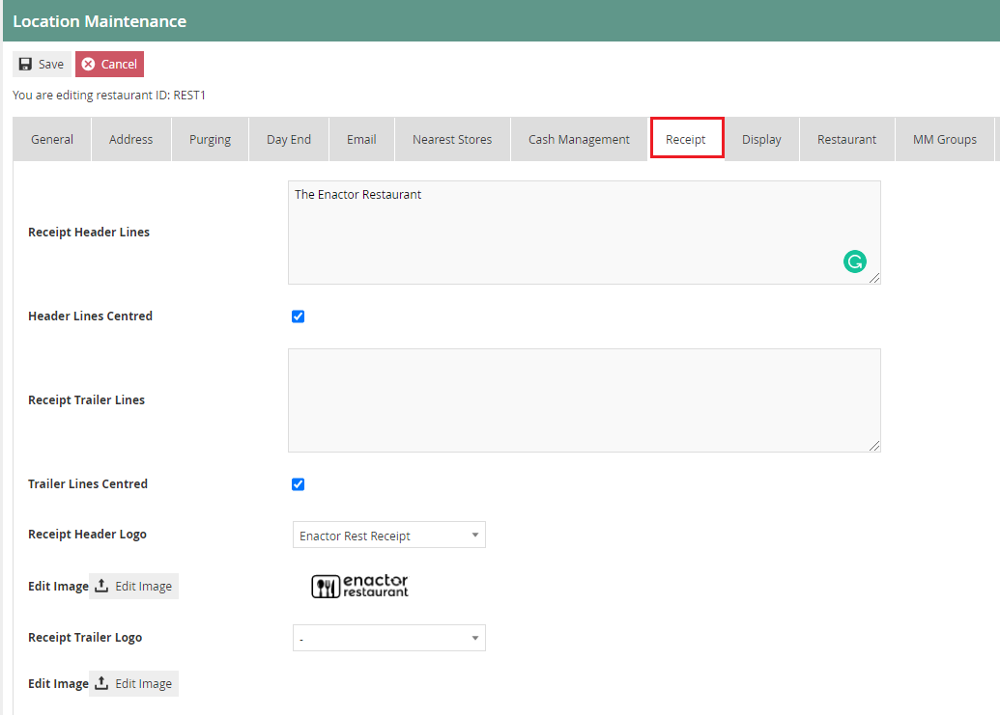

Set the appropriate values on the **Receipt** tab as follows:

| Configuration         | Description                                                                                                           |
|-----------------------|-----------------------------------------------------------------------------------------------------------------------|
| Receipt Header Lines  | Enter the text that should appear in the header of the receipt.                                                       |
|                       |                                                                                                                       |
|                       | The text can be formatted further by selecting the check box *Header Lines Centred*.                                  |
| Receipt Trailer Lines | Enter the text that should appear in the trailer lines of the receipt.                                                |
|                       |                                                                                                                       |
|                       | The text can be formatted further by selecting check box *Trailer Lines Centred.*                                     |
| Receipt Header Logo   | Select the appropriate Header logo from the drop-down list. A preview of the Logo is also provided for confirmation.  |
| Receipt Trailer Logo  | Select the appropriate Trailer Logo from the drop-down list. A preview of the Logo is also provided for confirmation. |
\*If you need to add Receipt Logos, please refer to the How-To guide
covering Media Management.

### Location -- Display Tab

The Display tab is used only if customer-facing line displays are in
use. If the restaurant has deployed terminals with line displays, the
Till Closed Message and Customer Welcome Message is defined here.

### Location -- Restaurant Tab 

### Location -- Restaurant Tab -- General Sub-tab

The Restaurant **General** tab includes the option to configure how Set
Menus Products are displayed on the customer\'s receipt.

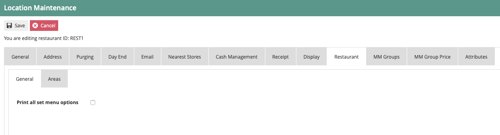

**Print all set menu options** checkbox works in conjunction with the
Hospitality Receipt documents templates. If selected, the set menu and
all options chosen by the customer will be printed on the customer\'s
receipt. If not, only the set menu product will be printed ensuring any
price contributions are consolidated.

### Location -- Restaurant Tab -- Areas Sub-tab

Restaurant areas allow for physical areas of a restaurant to be defined
such as Main, Bar, Terrace, Garden, etc.

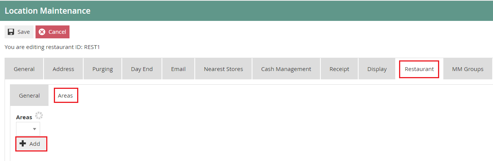

## Creating a Restaurant Area

A restaurant can have multiple **Location Areas** that can be configured
differently. These areas can be defined based on the services provided
in each area. (i.e Table Service, Bar Service, Takeaway Service)

To create a new Restaurant Area, select the **Add** button.

Enter an area ID that is alphanumeric and contains maximum of 20
characters.

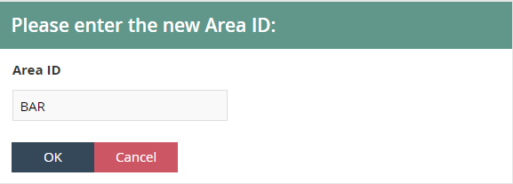

Select **Ok.**

### Adding Restaurant Area information

Select the desired area from the **Areas** drop-down. You will be
presented with the following options.

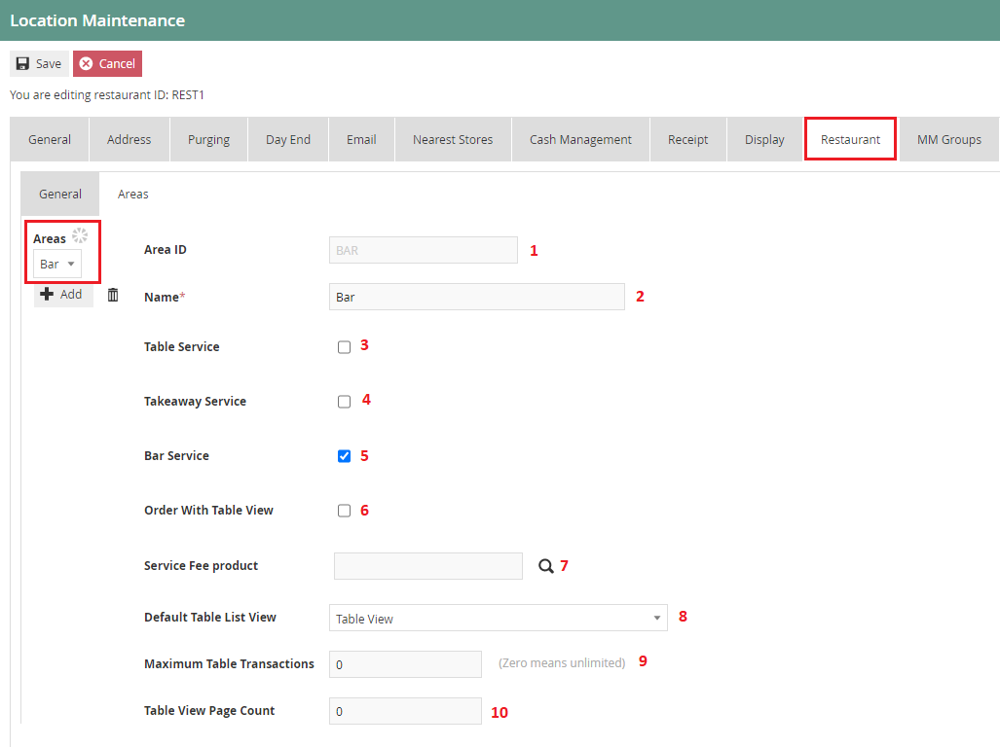

Set the appropriate values on the **Areas** tab as follows:

| Configuration              | Description                                                                                                                                                                                                                                                                                                                          |
|----------------------------|--------------------------------------------------------------------------------------------------------------------------------------------------------------------------------------------------------------------------------------------------------------------------------------------------------------------------------------|
| Area ID                    | This is already defined when creating the restaurant area.                                                                                                                                                                                                                                                                           |
| Name                       | Enter the area name. This mandatory field can contain up to maximum of 40 alphanumeric characters. This name will be shown on other configuration pages when referring to the restaurant area, therefore must be conclusive and recognisable.                                                                                        |
| Table Service              | This defines if table service is offered in this area of the restaurant. Select the checkbox if the POS terminal should allow the function for table service for this area.                                                                                                                                                          |
| Takeaway Service           | This defines if takeaway service is offered in this area of the restaurant. Select the checkbox if the POS terminal should allow the function for takeaway service for this area.                                                                                                                                                    |
| Bar Service                | This defines if bar service is offered in this area of the restaurant. Select the checkbox if the POS terminal should allow the function for bar service for this area.                                                                                                                                                              |
| Order With Table View      | This enables a table view that indicates each diner on the table. Select the checkbox to indicate that the POS terminal is allowed the function for table service with a digital table view for ordering. This can be primarily used for fine dining and will provide a custom view of the table. (Currently in experimental stages) |
| Service Fee product        | This indicates the product ID of products that include a service fee. Search from a pre-defined list of products and select if applicable. Service Fee products are further explained in the How-To guide on the configuration of hospitality products.                                                                              |
| Default Table List View    | This applies only to table service. From the drop-down menu, select if the POS terminal should display a Table View or a Floor View for this area.                                                                                                                                                                                   |
| Maximum Table Transactions | This applies only to table service. Set a maximum number of transactions per table in this area. If set to zero (0) unlimited transactions are allowed.                                                                                                                                                                              |
| Table View Page Count      | This applies only to table service. Set a maximum number of tables to be displayed on the POS terminal before paging. (Allow navigation to a new page in the POS application screen)                                                                                                                                                 |

\*Although all services (Table Service, Bar Service, Takeaway Service)
can be provided in the same area. The standard practice is to have
separate location areas setup for different services. Such as Bar, Main,
Takeaway etc.

# Device Configuration

A device is not merely thought of as a specific hardware item. The
Enactor Device configuration element is considered as a Service Device
representing the software that runs on the hardware. (Which in the case
of a POS is the POS Application). Therefore, multiple devices of diverse
nature may be running on the same physical hardware, which has no fixed
relationship to Location configuration.

The device options can be vast in a restaurant environment. For example,
point of sale devices, mobile devices, handheld terminals, and servers.
All endpoints are of a specific type and need a unique device ID. The
specific device type is used by the process connection diagram to
determine which endpoint to use. Defining a new device type is described
in a separate how-to guide.

Any device that will connect to the Enactor system needs a device type
and a unique device ID.

## Creating a new Device

The Device Maintenance application can be accessed through:

Administration -\> Devices -\> Devices

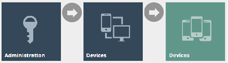

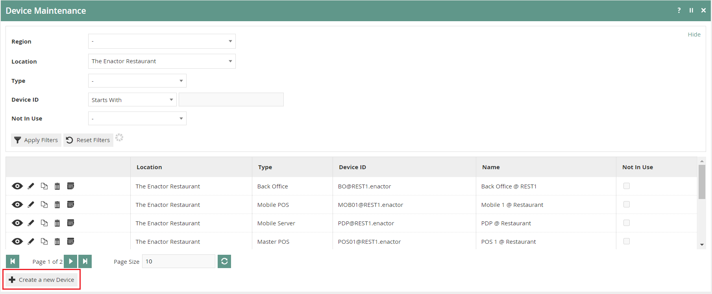

To create a new Device, select **Create a New Device** on the Device
Maintenance page.

Enter a unique device ID for this location. The ID can be alphanumeric
and contain a maximum of 40 characters.

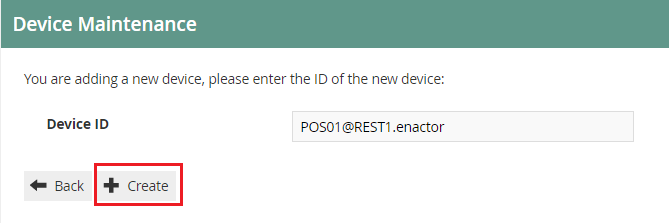

Select **Create.**

## Device maintenance 

There are three main tabs under Device maintenance application. The
General tab has all the basic information that captures the general
device behaviour and identity of the device.

### Device Maintenance - General Tab 

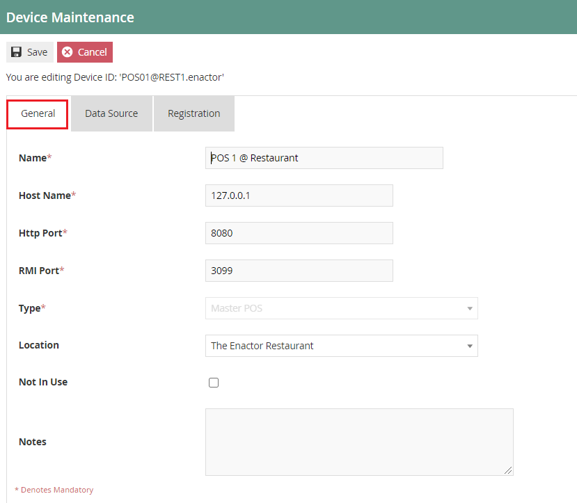

Set the appropriate values on the **General** tab as follows:

 | Entry      | Example Value          | Description                                                                                                                                                                                                           |
|------------|------------------------|-----------------------------------------------------------------------------------------------------------------------------------------------------------------------------------------------------------------------|
| Name       | POS 1 @ Restaurant     | Enter the device name. This mandatory field can contain up to maximum of 40 alphanumeric characters. Set a user-friendly identifier for the device that will be displayed in screens and other configuration options. |
| Host Name  | 127.0.01               | Enter the IP address, domain name or 'Localhost' to identify the server hosting the Device.                                                                                                                           |
| Http Port  | 8080                   | Enter credentials of the HTTP port of the device which will allow for remote connections.                                                                                                                             |
| RMI Port   | 3099                   | Enter credentials of the RMI port of the device which will allow for remote connections.                                                                                                                              |
| Type       | Master POS             | Select the appropriate device type from the drop-down list. Master POS, Mobile POS, POS etc.                                                                                                                          |
| Location   | The Enactor Restaurant | Select the device location from the drop-down list.                                                                                                                                                                   |
| Not In Use |                        | Select the checkbox to indicate that the device is not in use. Can be used to disable devices.                                                                                                                        |

# POS Terminal

All Devices that provide POS Application functionality should have a POS
Terminal configuration. This is associated with the Device ID, which
stores POS Terminal-specific configuration. Therefore, devices should be
configured before configuring a POS terminal.

Each POS Terminal can have unique configuration to support the specific
task that the terminal will perform. This guide will focus on the
Configuration of a restaurant POS Terminal.

## Creating a POS Terminal

The POS Terminal Maintenance application can be accessed through:

Configuration -\> Organisation -\> POS Terminals

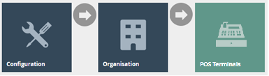

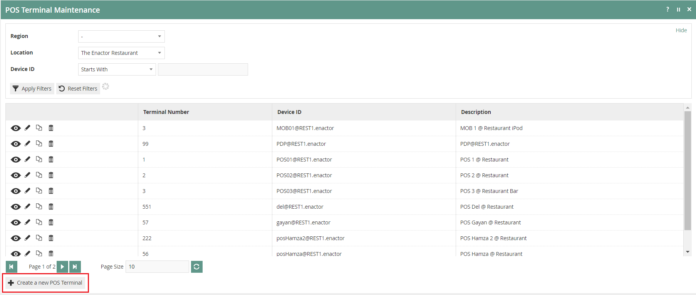

To create a new POS Terminal, select **Create New POS Terminal** on the
POS Terminal Maintenance page.

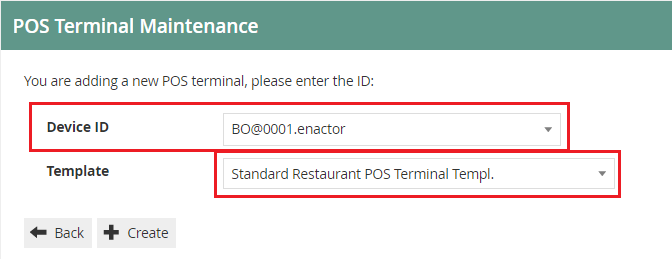

Select a device ID configured for a restaurant location form the
**Device ID** drop-down list.

Form the **Template** drop-down list you can opt to select the
**Standard Restaurant POS Terminal Template** which will determine the
standard POS terminal functions required by a restaurant. Templates
simplify the process by configuring common element values in a single
place for frequent re-use. Configuring Templates is covered in a
separate how-to guide.

Select **Create.**

\*Only one device can be associated with one POS Terminal.

## POS Terminal maintenance 

Numerous tabs and sub-tabs are presented under POS Terminal maintenance.
This guide is focused on the core aspects that are required to create a
restaurant POS Terminal and the key tabs are **General, Printing, User
Interface,** and **Restaurant.**

### POS Terminal Maintenance - General Tab 

The General tab has all the basic information that captures the general
behaviour and identity of the restaurant POS Terminal.

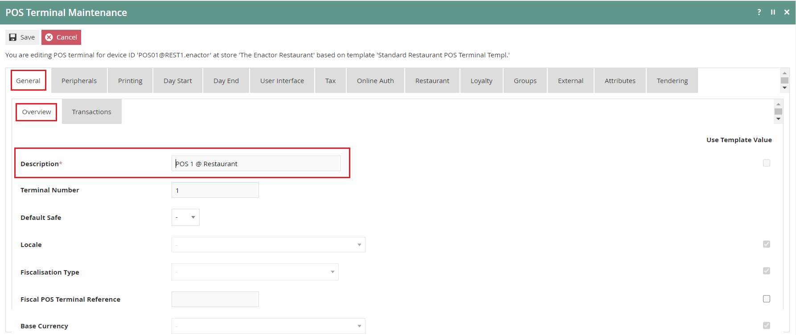

Set the appropriate values on the **General** tab as follows:

| Configuration | Description                                                                                                                                                                      |
|---------------|----------------------------------------------------------------------------------------------------------------------------------------------------------------------------------|
| Description   | Enter POS Terminal description. This mandatory field can contain up to maximum of 40 alphanumeric characters. This will be displayed in screens and other configuration options. |

\*Checkboxes listed against individual fields indicate the use of
template values. If selected, the default value for the chosen template
will be applied for the specific field/s.

### POS Terminal Maintenance -- Peripherals Tab 

Peripherals Tab provides Input and/or Output configuration for
peripheral devices attached to the POS Terminal. Select the appropriate
device type from drop-down lists in both input and output sub-tabs.

### 

### POS Terminal Maintenance -- Printing Tab 

The Printing Tab provides configuration of Page Definition Details
applicable to various printing operations that may be conducted at the
restaurant POS Terminal.

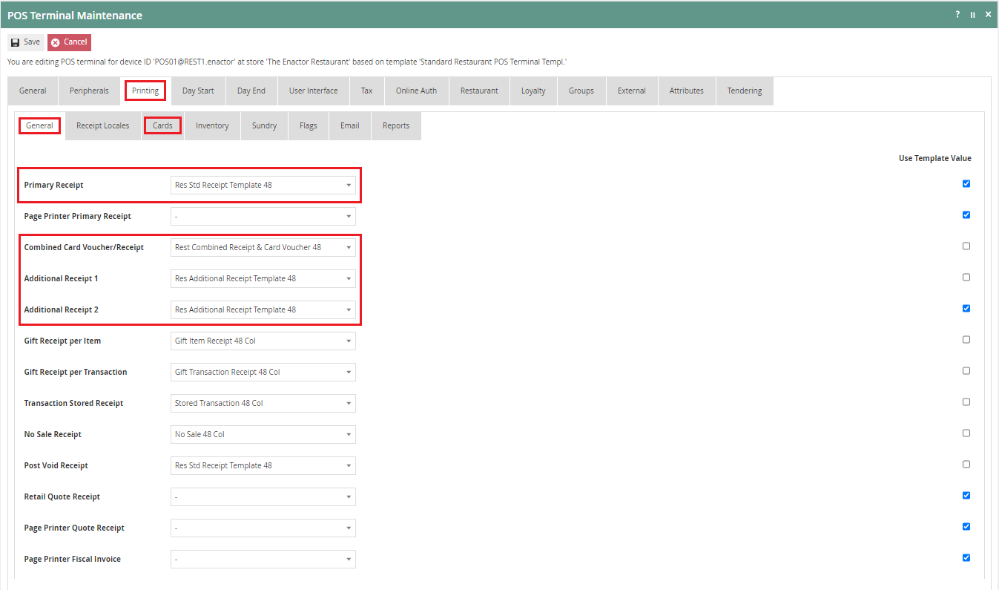

Set the appropriate values on the **General** sub**-**tab as follows:

| Configuration                 | Description                                                               |
|-------------------------------|---------------------------------------------------------------------------|
| Primary Receipt               | Select *Res Std Receipt Template 48* from the drop-down list.             |
| Combined Card Voucher/Receipt | Select *Rest Combined Receipt & Card Voucher 48* from the drop-down list. |
| Additional Receipt 1          | Select *Res Additional Receipt Template 48* from the drop-down list.      |
| Additional Receipt 2          |                                                                           |

Set the appropriate values on the **Cards** sub-tab as follows:

| Configuration              | Description                                                 |
|----------------------------+-------------------------------------------------------------|
| Split Bill Partial Receipt | Select *Res SplitBill Template 48* from the drop-down list. |

### POS Terminal Maintenance -- User Interface Tab

The User Interface Tab of POS Terminal Maintenance captures properties
used by the POS Terminal software to determine the appearance and
behaviour of the User Interface presented to the Operator.

### POS Terminal Maintenance -- User Interface Tab -- General Sub-tab

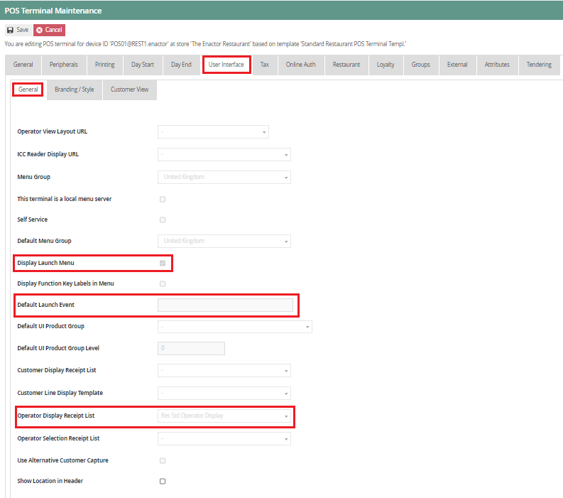

Set the appropriate values on the **General** sub-tab as follows:

| Configuration                 | Description                                                                                                                                                                                                                                                                                                                                                                                                                                                           |
|-------------------------------|-----------------------------------------------------------------------------------------------------------------------------------------------------------------------------------------------------------------------------------------------------------------------------------------------------------------------------------------------------------------------------------------------------------------------------------------------------------------------|
| Display Launch Menu           | Select this checkbox for the POS Terminal to present an initial Launch Menu. Menu Configuration is covered in a separate How-to Guide.                                                                                                                                                                                                                                                                                                                                |
| Default Launch Event          | This indicates the Launch Screen Event that should automatically be shown to allow for a terminal to display a specific function. This avoids the need for the user to select a specific function such as the Bar Mode View. This option can be used loosely in conjunction with a Restaurant Area, where an area is defined as only supporting bar service, thus the terminal should automatically display the Bar Mode View and not allow select of any other mode. |
|                               |                                                                                                                                                                                                                                                                                                                                                                                                                                                                       |
|                               | The following launch events are supported:                                                                                                                                                                                                                                                                                                                                                                                                                            |
|                               |                                                                                                                                                                                                                                                                                                                                                                                                                                                                       |
|                               | - *SelectTable*: Will display the Table Mode View                                                                                                                                                                                                                                                                                                                                                                                                                     |
|                               |                                                                                                                                                                                                                                                                                                                                                                                                                                                                       |
|                               | - *BarOrder*: Will display the Bar Mode View                                                                                                                                                                                                                                                                                                                                                                                                                          |
|                               |                                                                                                                                                                                                                                                                                                                                                                                                                                                                       |
|                               | - *SelectTakeaway*: Will display the Takeaway Mode View                                                                                                                                                                                                                                                                                                                                                                                                               |
|                               |                                                                                                                                                                                                                                                                                                                                                                                                                                                                       |
|                               | - *NonTableSaleReturns*: Will display a view similar to retail where the transaction is not linked to any of the previous modes.                                                                                                                                                                                                                                                                                                                                      |
| Operator Display Receipt List | Select the default and recommended option *Res Operator Display* from the drop-down list. This will ensure the POS Terminals Operator display is formatted correctly for the restaurant.                                                                                                                                                                                                                                                                              |

### POS Terminal Maintenance -- User Interface Tab -- Branding/Style Sub-tab

This defines the look and feel of the entire POS Application at runtime.
Themes contribute mainly to styles and positioning of screen elements.

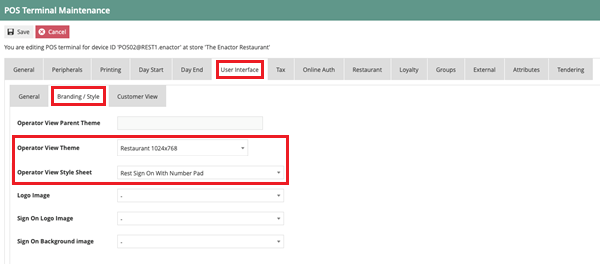

Set the appropriate values on the **Branding/Style** tab as follows:

| Configuration             | Description                                                                                                              |
|---------------------------|--------------------------------------------------------------------------------------------------------------------------|
| Operator View Theme       | Select from a predefined list of available themes available on the drop-down list that is suitable for restaurant*.*     |
| Operator View Style Sheet | Select the default stylesheet named *Rest Sign On With Number Pad.*                                                      |
|                           |                                                                                                                          |
|                           | *This optional setting is applicable if you want to use a numeric keyboard on the sign on screen in the POS application. |

### POS Terminal Maintenance -- Restaurant Tab

The Restaurant Tab of POS Terminal Maintenance enables user to configure
what Restaurant Area the terminal belongs to. Select the restaurant area
from the drop-down menu to be configured against the POS Terminal.

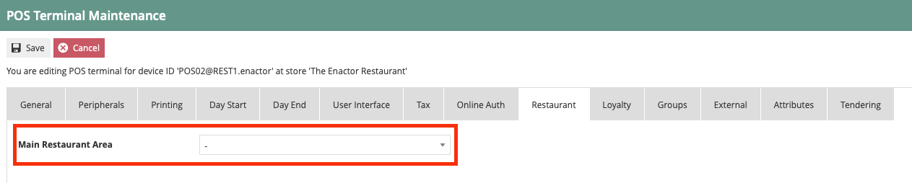

## 

## Broadcasting 

To deliver the configuration changes to the POS, broadcast the following
entities.

-   Location

-   Location Template

-   Device

-   POS Terminal
